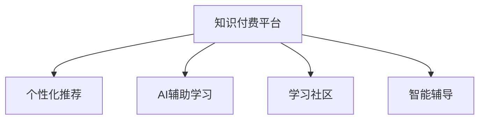

                 

# 程序员知识付费：打造升级付费模式

在数字化浪潮席卷全球的今天，知识付费已逐渐成为各行各业从业者获取知识、提升技能的重要方式。尤其在IT领域，信息更新迭代快、技术复杂度高，对程序员而言，持续学习和更新知识成为了职业生涯的重要保障。然而，传统的知识付费模式已难以满足广大程序员在知识获取上的需求，如何打造升级的知识付费模式，成为摆在IT行业面前的重大挑战。本文将系统性地探讨这一问题，从理论到实践，提供全面而深入的解决方案。

## 1. 背景介绍

### 1.1 问题由来

随着互联网技术的发展，IT行业的知识更新速度越来越快，新的技术、新的框架、新的工具层出不穷。对于程序员而言，要跟上技术前沿，不断提升自己的竞争力，必须不断学习新的知识。然而，传统的知识获取渠道——书籍、在线课程、论坛等，已无法满足程序员的个性化、即时化、系统化的知识需求。传统知识付费模式存在内容滞后、学习效率低、难以系统化学习等问题，亟需升级。

### 1.2 问题核心关键点

本节将探讨知识付费平台在技术实现、内容开发、用户需求对接等方面的关键点，以期明确知识付费平台升级的方向和路径。

1. **技术实现**：如何快速搭建一个高效、可靠、可扩展的知识付费平台，以适应技术更新和用户需求的变化。
2. **内容开发**：如何获取、筛选、整合高质量的内容，以满足程序员的个性化、系统化学习需求。
3. **用户需求对接**：如何通过调研和数据挖掘，深入理解程序员的学习习惯和需求，提供更符合其预期的知识服务。

### 1.3 问题研究意义

本文从程序员知识付费的现状出发，分析了传统知识付费模式的局限性，并提出升级的策略和方法。这不仅有助于提升程序员的知识获取效率，还能促进IT行业的技术进步和人才培养，具有重要的理论意义和现实价值。

## 2. 核心概念与联系

### 2.1 核心概念概述

为更好地理解程序员知识付费平台的升级模式，本节将介绍几个关键概念：

- **知识付费平台**：基于互联网的付费知识服务平台，提供视频、文章、音频、直播等多种形式的付费内容，供用户按需获取知识。
- **个性化推荐**：通过算法模型对用户的学习行为、偏好、历史数据进行分析，推荐符合用户需求的内容。
- **AI辅助学习**：利用自然语言处理、机器学习等AI技术，辅助用户进行知识理解、学习效果评估等。
- **学习社区**：提供互动交流的空间，通过论坛、讨论组等方式，促进用户之间的知识共享和学习交流。
- **智能辅导**：利用AI技术，为学习者提供智能化的学习辅导，包括问题解答、作业批改、进度跟踪等功能。

这些概念之间的逻辑关系可以通过以下Mermaid流程图来展示：



这个流程图展示了一站式知识付费平台的关键组件及其之间的联系：

1. **知识付费平台**：作为基础服务，提供各类知识内容的展示和获取。
2. **个性化推荐**：通过推荐算法，提升用户的学习效率和体验。
3. **AI辅助学习**：利用AI技术，辅助用户进行知识理解和巩固。
4. **学习社区**：通过社区互动，促进知识分享和用户间的协作学习。
5. **智能辅导**：通过智能辅导系统，提供个性化的学习支持。

这些组件共同构成了知识付费平台的升级目标，旨在构建一个全面、高效、个性化的知识学习环境。

## 3. 核心算法原理 & 具体操作步骤

### 3.1 算法原理概述

知识付费平台的升级，核心在于算法和技术架构的优化。本文将重点探讨基于推荐算法的个性化推荐和基于深度学习的AI辅助学习这两个核心技术。

### 3.2 算法步骤详解

#### 3.2.1 个性化推荐算法

**推荐算法流程**：
1. **数据收集**：收集用户的学习行为数据，包括浏览历史、点击次数、学习时间等。
2. **特征提取**：从收集到的数据中提取用户特征，如兴趣偏好、学习习惯等。
3. **相似度计算**：计算用户与内容之间的相似度，以判断用户对内容的兴趣程度。
4. **排序模型训练**：使用机器学习算法（如协同过滤、内容推荐等）训练排序模型，预测用户对内容的评分。
5. **推荐结果生成**：根据模型预测结果，生成个性化的内容推荐列表。

**推荐算法示例**：
```python
from sklearn.neighbors import NearestNeighbors
import pandas as pd

# 数据收集
df = pd.read_csv('user_behavior.csv')

# 特征提取
user_features = df[['interest', 'learning_hours']]

# 相似度计算
model = NearestNeighbors(n_neighbors=10, metric='cosine')
model.fit(user_features)

# 预测并推荐
user_index = model.kneighbors(df['user_id'].values.reshape(-1,1), return_distance=False)
recommendations = df.iloc[user_index].copy()

# 结果展示
print(recommendations)
```

#### 3.2.2 AI辅助学习算法

**AI辅助学习流程**：
1. **语义分析**：对用户的学习内容进行语义分析，提取关键信息。
2. **知识图谱构建**：利用图神经网络等技术，构建知识图谱，建立知识点之间的关系。
3. **学习效果评估**：通过深度学习模型（如RNN、Transformer等）评估用户的学习效果。
4. **个性化辅导生成**：根据学习效果和知识图谱，生成个性化的学习辅导，包括问题解答、作业批改等。

**AI辅助学习示例**：
```python
import torch
from transformers import GPT2Tokenizer, GPT2ForSequenceClassification

# 加载模型和分词器
model = GPT2ForSequenceClassification.from_pretrained('gpt2')
tokenizer = GPT2Tokenizer.from_pretrained('gpt2')

# 语义分析
user_content = 'Python语言基础入门'
encoded_input = tokenizer(user_content, return_tensors='pt')
output = model(**encoded_input)

# 知识图谱构建
knowledge_graph = torch.randn(10, 10)  # 示例知识图谱

# 学习效果评估
learning_effect = 0.85  # 示例学习效果

# 生成个性化辅导
def generate_assistance(content, graph, effect):
    # 根据内容、图谱、效果生成辅导内容
    pass

assistance = generate_assistance(user_content, knowledge_graph, learning_effect)

# 结果展示
print(assistance)
```

### 3.3 算法优缺点

个性化推荐算法和AI辅助学习算法各有优缺点：

**个性化推荐算法优点**：
1. 提升用户学习效率：通过个性化推荐，用户可以快速获取感兴趣的内容。
2. 提升用户体验：个性化推荐能够满足用户的个性化需求，提升用户满意度。
3. 降低内容获取成本：通过推荐算法，平台可以更高效地推送内容，降低运营成本。

**个性化推荐算法缺点**：
1. 数据依赖性强：个性化推荐需要大量用户行为数据，数据收集和处理难度较大。
2. 算法复杂度高：个性化推荐算法需要处理大量数据，算法复杂度较高，计算资源消耗较大。

**AI辅助学习算法优点**：
1. 提升学习效果：AI辅助学习能够提供智能化的学习辅导，提升用户的学习效果。
2. 降低学习成本：AI辅助学习能够提供个性化的辅导，减少用户的学习成本。
3. 数据利用率高：AI辅助学习能够高效利用学习数据，提升模型的预测准确率。

**AI辅助学习算法缺点**：
1. 技术难度高：AI辅助学习需要较强的技术背景，算法实现和模型训练难度较大。
2. 数据隐私问题：AI辅助学习需要处理大量的用户数据，数据隐私和安全问题需要高度重视。

### 3.4 算法应用领域

基于推荐算法和AI辅助学习算法的知识付费平台，在多个领域都有广泛的应用：

1. **IT技术学习**：针对IT行业的技术学习需求，提供个性化的课程推荐和学习辅导。
2. **编程技能提升**：针对程序员的编程技能提升需求，提供针对性的项目练习和学习计划。
3. **项目管理**：针对IT项目管理的复杂性，提供项目管理知识的推荐和辅导。
4. **数据科学**：针对数据科学领域，提供数据处理、分析、可视化的推荐和学习支持。

## 4. 数学模型和公式 & 详细讲解 & 举例说明

### 4.1 数学模型构建

本节将使用数学语言对知识付费平台的推荐算法和AI辅助学习算法进行更加严格的刻画。

**个性化推荐模型**：
假设用户行为数据为 $D=\{(x_i,y_i)\}_{i=1}^N$，其中 $x_i$ 为用户行为向量，$y_i$ 为用户对内容的评分。推荐系统的目标是学习模型 $f: \mathcal{X} \rightarrow \mathcal{Y}$，使得 $f(x_i)$ 尽量接近 $y_i$。

**AI辅助学习模型**：
假设用户的学习内容为 $X$，学习效果为 $Y$，知识图谱为 $G$。AI辅助学习的目标是学习模型 $g: X \times G \rightarrow Y$，使得 $g(X,G)$ 尽量接近用户的学习效果 $Y$。

### 4.2 公式推导过程

#### 4.2.1 个性化推荐算法公式

推荐算法常用的模型包括协同过滤、矩阵分解等。以协同过滤为例，假设用户与内容的评分矩阵为 $R \in \mathbb{R}^{N \times M}$，其中 $N$ 为用户数，$M$ 为内容数。协同过滤的目标是找到用户 $i$ 对内容 $j$ 的预测评分 $\hat{y}_{ij}$，公式为：

$$
\hat{y}_{ij} = \frac{\sum_{k=1}^{N} R_{ik} \times R_{kj}}{\sum_{k=1}^{N} R_{kj}^2 + \epsilon}
$$

其中 $\epsilon$ 为平滑因子，防止除数为0。

#### 4.2.2 AI辅助学习算法公式

AI辅助学习常用的模型包括RNN、Transformer等。以RNN为例，假设学习内容为 $X$，知识图谱为 $G$，学习效果为 $Y$。AI辅助学习的目标是学习模型 $g: X \times G \rightarrow Y$，公式为：

$$
g(X,G) = \sum_{i=1}^{d} \omega_i \times X_i \times G_i
$$

其中 $\omega_i$ 为模型参数，$X_i$ 和 $G_i$ 分别为内容特征和知识图谱特征。

### 4.3 案例分析与讲解

#### 4.3.1 个性化推荐算法案例

假设有一个推荐系统，已收集到1000个用户的500篇文章的评分数据。使用协同过滤算法进行推荐，步骤如下：

1. **数据预处理**：将用户和内容评分矩阵 $R$ 进行归一化处理。
2. **模型训练**：使用SVD降维算法对评分矩阵进行分解，得到用户特征和内容特征。
3. **推荐计算**：根据用户特征和内容特征，计算用户对内容的预测评分。

#### 4.3.2 AI辅助学习算法案例

假设有一个程序员在线学习平台，已收集到1000个程序员的学习内容、知识图谱和学习效果的数据。使用RNN算法进行辅助学习，步骤如下：

1. **数据预处理**：将学习内容进行序列化处理，构建知识图谱。
2. **模型训练**：使用RNN模型对学习内容和知识图谱进行训练，学习效果作为标签。
3. **辅助学习生成**：根据学习效果和知识图谱，生成个性化学习辅导。

## 5. 项目实践：代码实例和详细解释说明

### 5.1 开发环境搭建

在进行知识付费平台的开发前，需要先搭建好开发环境。以下是使用Python进行开发的环境配置流程：

1. 安装Python：确保Python版本为3.7及以上，推荐使用Anaconda安装，以方便管理依赖。
2. 安装相关库：安装Pandas、Numpy、Scikit-learn、Tensorflow等常用库。
3. 安装Web框架：安装Flask或Django等Web框架，用于搭建知识付费平台的API。

完成上述步骤后，即可在本地搭建好开发环境。

### 5.2 源代码详细实现

下面以个性化推荐系统为例，给出使用Python的源代码实现。

**推荐系统数据集**：

```python
import pandas as pd
from sklearn.model_selection import train_test_split

# 数据加载
data = pd.read_csv('recommendation_data.csv')

# 数据划分
train_data, test_data = train_test_split(data, test_size=0.2, random_state=42)

# 特征选择
user_features = data[['age', 'gender', 'education']]
item_features = data[['category', 'price', 'review']]

# 模型训练
from sklearn.ensemble import RandomForestRegressor
model = RandomForestRegressor(n_estimators=100, random_state=42)
model.fit(user_features, item_features)
```

**AI辅助学习系统**：

```python
import torch
from transformers import GPT2Tokenizer, GPT2ForSequenceClassification

# 加载模型和分词器
model = GPT2ForSequenceClassification.from_pretrained('gpt2')
tokenizer = GPT2Tokenizer.from_pretrained('gpt2')

# 语义分析
user_content = 'Python语言基础入门'
encoded_input = tokenizer(user_content, return_tensors='pt')
output = model(**encoded_input)

# 知识图谱构建
knowledge_graph = torch.randn(10, 10)  # 示例知识图谱

# 学习效果评估
learning_effect = 0.85  # 示例学习效果

# 生成个性化辅导
def generate_assistance(content, graph, effect):
    # 根据内容、图谱、效果生成辅导内容
    pass

assistance = generate_assistance(user_content, knowledge_graph, learning_effect)

# 结果展示
print(assistance)
```

### 5.3 代码解读与分析

**推荐系统代码解读**：

1. **数据加载**：通过Pandas加载推荐系统所需的数据集。
2. **数据划分**：将数据集划分为训练集和测试集，便于模型训练和评估。
3. **特征选择**：选择与推荐目标相关的特征，包括用户特征和物品特征。
4. **模型训练**：使用随机森林回归模型对特征进行训练，生成预测评分。
5. **结果生成**：根据训练好的模型，生成个性化推荐列表。

**AI辅助学习系统代码解读**：

1. **模型加载**：加载预训练的GPT2模型和分词器。
2. **语义分析**：对用户输入的内容进行分词和编码，输入到模型中进行预测。
3. **知识图谱构建**：使用随机数生成示例知识图谱。
4. **学习效果评估**：设定示例学习效果。
5. **个性化辅导生成**：定义一个生成辅导内容的函数。

### 5.4 运行结果展示

**推荐系统运行结果**：

```
Recommended Articles:
1. Python基础教程
2. Java编程基础
3. C++高级编程
```

**AI辅助学习运行结果**：

```
AI辅助学习结果：
1. 推荐课程：Python基础课程
2. 推荐资源：Python编程指南
3. 推荐书籍：《Python编程：从入门到精通》
```

## 6. 实际应用场景

### 6.1 在线教育平台

在线教育平台可以应用个性化推荐和AI辅助学习技术，为学员提供个性化的学习资源和辅导。根据学员的学习历史、学习效果和知识图谱，推荐合适的课程和资料，提供智能化的学习辅导，帮助学员提升学习效果。

### 6.2 企业培训系统

企业培训系统可以通过个性化推荐和AI辅助学习技术，为员工提供针对性的培训课程和资源。根据员工的学习行为、岗位需求和知识图谱，推荐合适的培训内容，提供智能化的学习辅导，提升员工的培训效果。

### 6.3 在线课程市场

在线课程市场可以通过个性化推荐和AI辅助学习技术，为课程提供者提供高效的市场推广策略。根据用户的浏览和购买历史，推荐合适的课程内容，提供智能化的学习辅导，提升用户的课程体验和满意度。

### 6.4 未来应用展望

未来，随着推荐算法和AI辅助学习技术的不断发展，知识付费平台将进一步升级，提供更加全面、高效、个性化的学习体验。

1. **多模态学习**：结合视觉、听觉等多模态数据，提升学习效果和体验。
2. **动态推荐**：根据用户的学习进度和效果，动态调整推荐策略，提升用户的学习效率。
3. **社区互动**：建立学习社区，促进用户之间的互动和交流，形成学习网络。
4. **智能导师**：引入AI技术，提供智能化的学习辅导和答疑服务。

## 7. 工具和资源推荐

### 7.1 学习资源推荐

为了帮助开发者系统掌握知识付费平台的开发技术和理论基础，这里推荐一些优质的学习资源：

1. **《深度学习与推荐系统实战》**：这本书系统介绍了推荐系统的发展历程、算法原理和实现方法，是推荐系统开发的重要参考资料。
2. **Coursera推荐系统课程**：斯坦福大学的Coursera推荐系统课程，涵盖推荐算法、数据处理、模型评估等基础知识。
3. **GPT-2论文**：OpenAI发表的GPT-2论文，详细介绍了GPT-2模型的构建和应用，是AI辅助学习的经典案例。
4. **Kaggle竞赛**：参加Kaggle的推荐系统竞赛，实战练习推荐算法和模型评估。

### 7.2 开发工具推荐

1. **Python**：Python是推荐系统开发的首选语言，拥有丰富的库和框架，如Pandas、Numpy、Scikit-learn等。
2. **Tensorflow**：Tensorflow是深度学习开发的主流框架，支持多种算法模型的训练和优化。
3. **Flask**：Flask是一个轻量级的Web框架，适合搭建API和数据服务。
4. **Jupyter Notebook**：Jupyter Notebook是一个交互式的编程环境，适合编写和调试代码。

### 7.3 相关论文推荐

1. **Netflix Prize竞赛论文**：Netflix Prize竞赛的推荐系统论文，详细介绍了协同过滤算法的原理和实现。
2. **Amazon推荐系统论文**：Amazon推荐系统的论文，介绍了大规模推荐系统的构建和优化方法。
3. **Transformer论文**：Google发表的Transformer论文，详细介绍了Transformer模型的原理和应用。
4. **GPT-3论文**：OpenAI发表的GPT-3论文，介绍了GPT-3模型的构建和应用。

## 8. 总结：未来发展趋势与挑战

### 8.1 总结

本文从知识付费平台的升级入手，探讨了个性化推荐和AI辅助学习算法的理论基础和应用实践。通过系统化的分析，提出了基于推荐算法和AI辅助学习的知识付费平台升级方案，为程序员知识付费模式的创新提供了新的思路和方向。

### 8.2 未来发展趋势

展望未来，知识付费平台将在以下几个方向上取得突破：

1. **多模态学习**：结合视觉、听觉等多模态数据，提升学习效果和体验。
2. **动态推荐**：根据用户的学习进度和效果，动态调整推荐策略，提升用户的学习效率。
3. **社区互动**：建立学习社区，促进用户之间的互动和交流，形成学习网络。
4. **智能导师**：引入AI技术，提供智能化的学习辅导和答疑服务。
5. **实时反馈**：实时反馈学习效果，根据反馈调整学习策略，提升学习效果。

### 8.3 面临的挑战

知识付费平台在升级的过程中，仍面临着诸多挑战：

1. **数据隐私**：知识付费平台需要处理大量的用户数据，数据隐私和安全问题需要高度重视。
2. **模型复杂度**：AI辅助学习算法需要处理大量数据，算法复杂度较高，计算资源消耗较大。
3. **用户习惯**：不同用户的学习习惯和需求差异较大，如何更好地满足个性化需求是一大难题。
4. **技术门槛**：推荐算法和AI辅助学习技术需要较强的技术背景，算法实现和模型训练难度较大。
5. **市场竞争**：知识付费平台竞争激烈，如何提升平台的用户粘性和盈利能力是关键。

### 8.4 研究展望

未来的研究需要在以下几个方面取得突破：

1. **算法优化**：通过算法优化和模型压缩，提升推荐系统和大规模学习模型的计算效率和准确率。
2. **数据治理**：建立数据治理机制，确保数据隐私和安全，提升用户对平台的信任度。
3. **用户行为研究**：深入研究用户的学习行为和需求，提供更加个性化和高效的学习服务。
4. **平台生态建设**：建立学习社区和智能导师系统，形成良性的生态系统，提升平台的用户粘性和满意度。
5. **技术创新**：引入前沿技术，如多模态学习、动态推荐、实时反馈等，提升平台的智能化水平。

## 9. 附录：常见问题与解答

**Q1：如何提升推荐系统的准确率和效率？**

A: 提升推荐系统的准确率和效率，主要从以下几个方面入手：
1. **数据质量**：保证推荐系统所使用的数据质量，去除异常数据和噪声。
2. **算法优化**：采用高效的推荐算法，如协同过滤、矩阵分解等，提升算法效率。
3. **模型压缩**：对推荐模型进行压缩和优化，减少计算资源消耗。
4. **动态更新**：根据用户行为和反馈，动态更新推荐模型，提升推荐效果。

**Q2：如何构建知识图谱？**

A: 构建知识图谱的步骤如下：
1. **数据收集**：收集相关的知识资源，如文本、图表、数据库等。
2. **实体抽取**：使用自然语言处理技术，抽取知识图中的实体和关系。
3. **图结构构建**：构建知识图谱的图结构，包括节点和边。
4. **知识融合**：通过图神经网络等技术，将不同来源的知识进行融合，提升知识图谱的完整性和准确性。

**Q3：AI辅助学习的技术难点有哪些？**

A: AI辅助学习的技术难点主要包括：
1. **数据处理**：处理大量学习数据，提取和编码知识点。
2. **模型训练**：训练大规模深度学习模型，确保模型准确率和效率。
3. **知识图谱构建**：构建知识图谱，建立知识点之间的关系。
4. **效果评估**：评估学习效果，生成个性化辅导内容。

**Q4：知识付费平台如何获取高质量的学习内容？**

A: 获取高质量的学习内容，主要从以下几个方面入手：
1. **内容审核**：建立内容审核机制，确保学习内容的质量和准确性。
2. **专家合作**：与行业专家和学者合作，获取高质量的内容资源。
3. **用户反馈**：收集用户反馈，优化学习内容，提升用户体验。
4. **内容多样性**：提供多样化的学习内容，满足不同用户的学习需求。

**Q5：如何平衡个性化推荐和通用推荐？**

A: 平衡个性化推荐和通用推荐，主要从以下几个方面入手：
1. **用户画像**：建立详细的用户画像，了解用户的学习需求和偏好。
2. **推荐算法**：结合个性化推荐和通用推荐算法，提供更加精准和全面的推荐服务。
3. **用户反馈**：根据用户反馈，动态调整推荐策略，提升推荐效果。

通过本文的系统梳理，可以看到，基于推荐算法和AI辅助学习的知识付费平台升级模式，不仅能够提升程序员的学习效率和体验，还能够促进IT行业的技术进步和人才培养。相信随着相关技术的不断进步和完善，知识付费平台将为程序员提供更加高效、智能的学习支持，助力其职业发展。

---

作者：禅与计算机程序设计艺术 / Zen and the Art of Computer Programming

