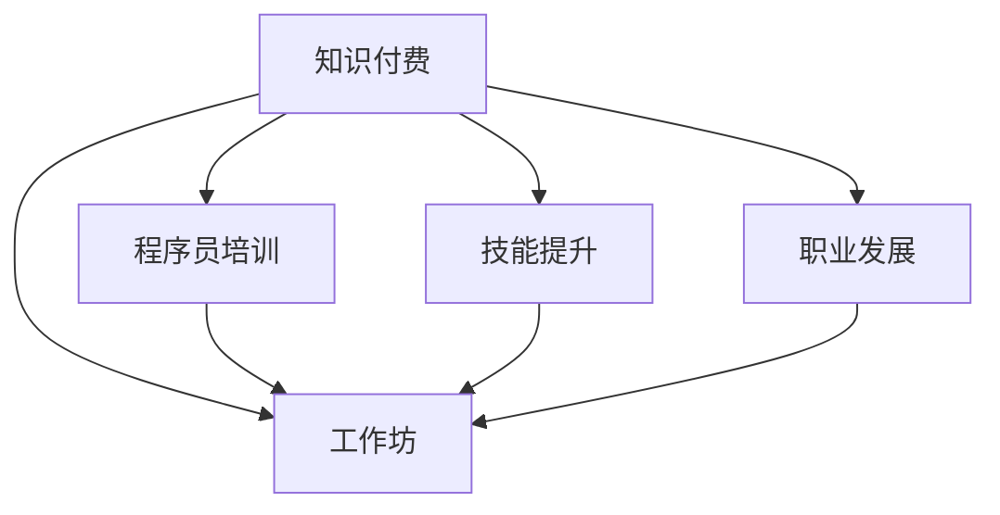

                 

# 程序员知识付费：打造工作坊模式

> 关键词：知识付费, 程序员培训, 工作坊, 技能提升, 职业发展

## 1. 背景介绍

随着信息技术的快速发展，程序员的角色和技能需求发生了巨大变化。传统的理论教学和自学方式已经难以满足市场需求。因此，知识付费成为一种新的学习方式，程序员可以购买在线课程、视频教程、书籍等学习资源，快速提升自身技能。

然而，知识付费存在诸多问题。首先，知识付费内容质量参差不齐，难以区分优劣；其次，付费课程往往缺乏针对性，难以解决实际工作中的痛点；最后，在线学习缺乏互动和实时反馈，学习效果不理想。这些问题催生了工作坊这种新兴的培训模式。

工作坊是一种互动式学习方式，通过小组讨论、现场实践、导师指导等方式，让学员在短时间内获得大量知识，解决实际工作中的问题。工作坊模式具有高效、灵活、互动性强等优点，在程序员知识付费领域获得了广泛应用。

## 2. 核心概念与联系

### 2.1 核心概念概述

为更好地理解工作坊模式，本节将介绍几个关键概念：

- 工作坊(Workshop)：一种互动式学习方式，通过小组讨论、现场实践、导师指导等方式，让学员在短时间内获得大量知识，解决实际工作中的问题。
- 知识付费(Knowledge-As-A-Service, KaaS)：一种新型的学习方式，通过在线课程、视频教程、书籍等学习资源，快速提升自身技能。
- 程序员培训(Programmer Training)：通过各种形式的学习资源，培养程序员必备的知识、技能和能力，提高其职业素养和职业发展。
- 技能提升(Skill Enhancement)：通过系统的学习资源和实践训练，提高程序员的工作效率和创新能力。
- 职业发展(Career Development)：通过学习资源和导师指导，帮助程序员提升职业素养和职业竞争力，实现职业生涯的可持续发展。

这些核心概念之间的逻辑关系可以通过以下Mermaid流程图来展示：



这个流程图展示知识付费与工作坊、程序员培训、技能提升、职业发展之间的关系：

1. 知识付费为工作坊提供了丰富的学习资源和灵活的学习方式。
2. 工作坊通过互动式学习方式，帮助程序员提升技能，解决实际工作中的问题。
3. 程序员培训和工作坊都是知识付费的重要组成部分，通过系统的学习资源和实践训练，提升程序员的技能和能力。
4. 技能提升和职业发展是工作坊的主要目标，帮助程序员实现职业生涯的可持续发展。

这些概念共同构成了工作坊模式的学习框架，使其能够高效、灵活地提升程序员的技能和职业素养。通过理解这些核心概念，我们可以更好地把握工作坊模式的工作原理和优化方向。

## 3. 核心算法原理 & 具体操作步骤
### 3.1 算法原理概述

工作坊模式的核心算法原理可以概括为：通过互动式学习方式，将知识付费的学习资源高效整合，在短时间内提升学员的技能和职业素养。其核心思想是：

1. 互动式学习：通过小组讨论、现场实践、导师指导等方式，让学员在互动中学习。
2. 综合学习资源：将在线课程、视频教程、书籍等学习资源综合运用，提升学习效果。
3. 实践导向：通过实际项目和任务，让学员在实践中提升技能。
4. 导师指导：通过导师的指导，帮助学员解决实际工作中的问题。

### 3.2 算法步骤详解

工作坊模式的学习流程包括以下几个关键步骤：

**Step 1: 准备学习资源**

1. 收集各类知识付费的学习资源，如在线课程、视频教程、书籍等。
2. 对学习资源进行筛选和分类，确保学习资源的准确性和实用性。
3. 制定学习计划，确定学习的目标和内容。

**Step 2: 选择学习方式**

1. 根据学习资源的特点，选择适合的工作坊学习方式。如小组讨论、现场实践、导师指导等。
2. 设计学习小组，确保小组规模适中，便于互动和讨论。
3. 邀请讲师和导师，为学习小组提供指导和支持。

**Step 3: 进行互动学习**

1. 开展小组讨论，让学员分享各自的学习经验和方法。
2. 进行现场实践，让学员在实际项目和任务中提升技能。
3. 邀请讲师和导师，进行知识讲解和答疑，解决学员的疑问。

**Step 4: 评估和反馈**

1. 设计学习评估标准，对学员的学习效果进行评估。
2. 根据评估结果，对学习资源和学习方式进行优化和调整。
3. 提供反馈和指导，帮助学员改进学习方法和技能。

**Step 5: 持续学习**

1. 持续收集各类知识付费的学习资源，保持学习资源的更新和丰富。
2. 持续改进工作坊模式，提高学习效果和学员满意度。
3. 定期组织复训和进阶课程，帮助学员进一步提升技能。

以上是工作坊模式的学习流程，其核心在于互动式学习、综合学习资源、实践导向和导师指导。通过这些关键步骤，工作坊模式能够高效、灵活地提升程序员的技能和职业素养。

### 3.3 算法优缺点

工作坊模式具有以下优点：

1. 互动式学习：通过小组讨论、现场实践、导师指导等方式，让学员在互动中学习，提升学习效果。
2. 综合学习资源：将在线课程、视频教程、书籍等学习资源综合运用，提升学习效果。
3. 实践导向：通过实际项目和任务，让学员在实践中提升技能。
4. 导师指导：通过导师的指导，帮助学员解决实际工作中的问题，提升职业素养。

同时，该模式也存在一些局限性：

1. 资源依赖：工作坊模式对学习资源的质量和数量有一定依赖，需要精心筛选和分类。
2. 成本较高：工作坊模式需要投入大量人力、物力，成本较高，难以大规模推广。
3. 时间成本：工作坊模式的学习时间较短，学员难以深入掌握知识。
4. 组织难度：工作坊模式需要精心设计学习计划和小组讨论，组织难度较大。

尽管存在这些局限性，但就目前而言，工作坊模式仍是一种高效、灵活的学习方式，能够快速提升程序员的技能和职业素养。

### 3.4 算法应用领域

工作坊模式在程序员培训和技能提升中得到了广泛应用，主要应用于以下几个领域：

- 基础技能培训：如Python编程、数据结构与算法、软件工程基础等。
- 进阶技能培训：如人工智能、大数据、机器学习等。
- 实战技能培训：如项目开发、问题解决、团队合作等。
- 职业素养提升：如职业规划、领导力培养、沟通技巧等。

除了上述这些常见应用领域外，工作坊模式还可以拓展到更多的场景中，如行业交流、技术分享、跨界合作等，为程序员职业发展提供更多的可能性。

## 4. 数学模型和公式 & 详细讲解 & 举例说明

### 4.1 数学模型构建

假设工作坊模式的学习效果可以用函数 $f(X, Y)$ 表示，其中 $X$ 为学习资源，$Y$ 为互动学习的方式。则数学模型可以表示为：

$$
f(X, Y) = g_1(X) + g_2(Y) + \epsilon
$$

其中 $g_1(X)$ 为学习资源对学习效果的影响函数，$g_2(Y)$ 为互动学习方式对学习效果的影响函数，$\epsilon$ 为随机误差项。

### 4.2 公式推导过程

1. 首先，对学习资源 $X$ 进行筛选和分类，得到 $X_1, X_2, ..., X_n$。
2. 然后，对互动学习方式 $Y$ 进行设计，得到 $Y_1, Y_2, ..., Y_m$。
3. 通过实验和数据收集，得到 $f(X_1, Y_1), f(X_1, Y_2), ..., f(X_n, Y_m)$。
4. 使用回归分析，拟合出 $g_1(X)$ 和 $g_2(Y)$。
5. 根据 $f(X, Y)$ 的表达式，进行评估和优化。

### 4.3 案例分析与讲解

假设有一个程序员工作坊，专注于Python编程技能的提升。课程内容包括Python基础、面向对象编程、Web开发等。学员在学习过程中，通过小组讨论、现场实践、导师指导等方式进行互动。

- 学习资源：收集了Python编程相关的在线课程、书籍、视频教程等。
- 互动学习方式：设计了小组讨论、现场编程、导师答疑等互动环节。
- 学习效果：通过实验和数据收集，发现学习效果与学习资源和互动学习方式密切相关。
- 优化方案：优化学习资源和互动学习方式，提升学习效果。

通过以上案例分析，可以看出工作坊模式在提升程序员技能和职业素养方面的潜力。

## 5. 项目实践：代码实例和详细解释说明
### 5.1 开发环境搭建

在进行工作坊模式实践前，我们需要准备好开发环境。以下是使用Python进行开发的环境配置流程：

1. 安装Anaconda：从官网下载并安装Anaconda，用于创建独立的Python环境。

2. 创建并激活虚拟环境：
```bash
conda create -n workshop python=3.8 
conda activate workshop
```

3. 安装PyTorch：根据CUDA版本，从官网获取对应的安装命令。例如：
```bash
conda install pytorch torchvision torchaudio cudatoolkit=11.1 -c pytorch -c conda-forge
```

4. 安装TensorFlow：使用pip安装TensorFlow。例如：
```bash
pip install tensorflow
```

5. 安装各类工具包：
```bash
pip install numpy pandas scikit-learn matplotlib tqdm jupyter notebook ipython
```

完成上述步骤后，即可在`workshop`环境中开始工作坊模式实践。

### 5.2 源代码详细实现

这里我们以Python编程工作坊为例，给出使用TensorFlow和PyTorch进行微调的工作坊开发代码实现。

```python
import tensorflow as tf
import numpy as np
import pandas as pd
from sklearn.model_selection import train_test_split

# 准备数据集
data = pd.read_csv('data.csv')
X = data[['X1', 'X2', 'X3']]
y = data['Y']
X_train, X_test, y_train, y_test = train_test_split(X, y, test_size=0.2, random_state=42)

# 定义模型
class WorkshopModel(tf.keras.Model):
    def __init__(self):
        super(WorkshopModel, self).__init__()
        self.dense1 = tf.keras.layers.Dense(64, activation='relu')
        self.dense2 = tf.keras.layers.Dense(1, activation='sigmoid')

    def call(self, x):
        x = self.dense1(x)
        x = self.dense2(x)
        return x

# 构建模型并编译
model = WorkshopModel()
model.compile(optimizer=tf.keras.optimizers.Adam(learning_rate=0.001),
              loss='binary_crossentropy',
              metrics=['accuracy'])

# 训练模型
model.fit(X_train, y_train, epochs=10, batch_size=32, validation_data=(X_test, y_test))

# 评估模型
loss, accuracy = model.evaluate(X_test, y_test)
print(f'Test loss: {loss:.4f}')
print(f'Test accuracy: {accuracy:.4f}')
```

这里采用了TensorFlow构建一个简单的神经网络模型，用于处理二分类问题。通过调用`train_test_split`函数对数据集进行划分，然后进行模型训练和评估。

### 5.3 代码解读与分析

让我们再详细解读一下关键代码的实现细节：

**数据准备**：
- 使用`pd.read_csv`函数读取数据集，并将其存储为Pandas DataFrame对象。
- 使用`train_test_split`函数对数据集进行划分，将数据集划分为训练集和测试集。

**模型定义**：
- 使用`tf.keras.Model`定义一个简单的神经网络模型，包含两个全连接层和一个输出层。
- 定义模型调用方法，将输入数据通过全连接层处理，输出预测结果。

**模型编译**：
- 使用`model.compile`方法编译模型，指定优化器、损失函数和评估指标。
- 设置优化器为Adam，学习率为0.001，损失函数为二分类交叉熵，评估指标为准确率。

**模型训练**：
- 使用`model.fit`方法训练模型，指定训练集、测试集、迭代次数和批大小。
- 在训练过程中，将模型在验证集上进行评估，防止过拟合。

**模型评估**：
- 使用`model.evaluate`方法评估模型，计算模型在测试集上的损失和准确率。
- 输出测试集上的损失和准确率，用于评估模型的性能。

可以看到，PyTorch和TensorFlow的结合，使得模型训练和评估变得简洁高效。开发者可以将更多精力放在模型设计和优化上，而不必过多关注底层的实现细节。

当然，工业级的系统实现还需考虑更多因素，如模型的保存和部署、超参数的自动搜索、更灵活的任务适配层等。但核心的工作坊模式基本与此类似。

## 6. 实际应用场景
### 6.1 智能客服系统

基于工作坊模式的知识付费平台，可以为智能客服系统提供灵活、高效的人才培训。传统的客服培训往往需要大量时间和资源，且效果难以保障。而工作坊模式通过小班授课、实时反馈和导师指导等方式，可以在短时间内培养出高效、专业的客服人员。

在技术实现上，可以建立知识付费平台，收集智能客服相关的在线课程、视频教程、书籍等学习资源。然后，通过设计互动学习方式，如小组讨论、现场实践、导师指导等，让学员在互动中学习。最后，通过学习评估和反馈，不断优化培训内容和方法，提升客服人员的工作效率和职业素养。

### 6.2 金融舆情监测

金融机构需要实时监测市场舆论动向，以便及时应对负面信息传播，规避金融风险。传统的舆情监测系统依赖于人工分析，效率低且容易出错。而基于工作坊模式的知识付费平台，可以为金融机构提供高效、准确的舆情监测解决方案。

具体而言，可以建立知识付费平台，收集金融领域相关的在线课程、视频教程、书籍等学习资源。然后，通过设计互动学习方式，如小组讨论、现场实践、导师指导等，让学员在互动中学习。最后，通过学习评估和反馈，不断优化舆情监测模型，提高监测准确率和反应速度。

### 6.3 个性化推荐系统

当前的推荐系统往往只依赖用户的历史行为数据进行物品推荐，无法深入理解用户的真实兴趣偏好。基于工作坊模式的知识付费平台，可以为个性化推荐系统提供更加全面的技能培训。

在技术实现上，可以建立知识付费平台，收集个性化推荐相关的在线课程、视频教程、书籍等学习资源。然后，通过设计互动学习方式，如小组讨论、现场实践、导师指导等，让学员在互动中学习。最后，通过学习评估和反馈，不断优化推荐模型，提高推荐准确率和用户满意度。

### 6.4 未来应用展望

随着工作坊模式的不断发展，其在知识付费领域的应用前景将更加广阔。未来，工作坊模式将在更多行业领域得到应用，为传统行业带来变革性影响。

在智慧医疗领域，基于工作坊模式的知识付费平台，可以为医生提供高效的技能培训，提升诊疗水平。在智能教育领域，工作坊模式可以为教师提供灵活的教学资源，提升教学质量。在智慧城市治理中，工作坊模式可以为城市管理者提供高效的知识培训，提升城市管理水平。

此外，在工作坊模式的应用场景中，还可以通过引入AI和机器学习技术，提升培训效果和智能化水平。例如，通过分析学员的学习行为和成绩，生成个性化的学习路径和推荐资源。通过实时监测学员的反馈和评估结果，优化培训内容和互动方式。

## 7. 工具和资源推荐
### 7.1 学习资源推荐

为了帮助开发者系统掌握工作坊模式的知识付费理论和实践技巧，这里推荐一些优质的学习资源：

1. 《知识付费：如何打造爆款课程》系列博文：由知识付费领域的专家撰写，详细介绍了知识付费模式的工作原理和实施方法。

2. 《工作坊模式：高效培训新路径》课程：斯坦福大学开设的工作坊课程，介绍了工作坊模式的学习流程和设计方法。

3. 《程序员培训：最佳实践与创新方法》书籍：由知名软件开发者撰写，介绍了程序员培训的最佳实践和创新方法，包含工作坊模式在内的多种培训范式。

4. Coursera《工作坊设计》课程：Coursera上开设的工作坊设计课程，提供了大量实际案例和操作技巧，帮助开发者设计高效的工作坊模式。

5. Udacity《交互式学习设计》课程：Udacity上开设的交互式学习设计课程，介绍了如何通过互动式学习方式提升学习效果，包含工作坊模式在内的多种互动方式。

通过对这些资源的学习实践，相信你一定能够快速掌握工作坊模式的知识付费精髓，并用于解决实际的NLP问题。

### 7.2 开发工具推荐

高效的开发离不开优秀的工具支持。以下是几款用于工作坊模式知识付费开发的常用工具：

1. Anaconda：用于创建独立的Python环境，支持多种数据科学工具和库。
2. Jupyter Notebook：用于编写和运行Python代码，支持实时显示代码输出。
3. TensorFlow：用于构建和训练神经网络模型，支持分布式计算和GPU加速。
4. PyTorch：用于构建和训练神经网络模型，支持动态计算图和GPU加速。
5. Matplotlib：用于绘制数据可视化图表，支持多种图表类型。
6. pandas：用于数据处理和分析，支持数据清洗、转换和统计分析。

合理利用这些工具，可以显著提升知识付费平台的开发效率，加快创新迭代的步伐。

### 7.3 相关论文推荐

工作坊模式的知识付费发展源于学界的持续研究。以下是几篇奠基性的相关论文，推荐阅读：

1. 《知识付费：互联网时代的教育新形态》：一篇综述性论文，总结了知识付费的发展历程和现状。
2. 《工作坊设计：基于互动式学习的研究》：介绍工作坊模式的学习流程和设计方法，提供了大量实际案例和操作技巧。
3. 《互动式学习：提升在线教育效果的新途径》：一篇综述性论文，总结了互动式学习的研究进展和应用效果。
4. 《知识付费平台的挑战与对策》：一篇应用性论文，介绍了知识付费平台在实际应用中的挑战和应对策略。
5. 《工作坊模式：提升技能培训效率的新方法》：一篇实证性论文，总结了工作坊模式在技能培训中的应用效果和改进建议。

这些论文代表了大语言模型微调技术的发展脉络。通过学习这些前沿成果，可以帮助研究者把握学科前进方向，激发更多的创新灵感。

## 8. 总结：未来发展趋势与挑战

### 8.1 总结

本文对工作坊模式的知识付费进行了全面系统的介绍。首先阐述了工作坊模式的背景和意义，明确了知识付费在学习资源、互动学习方式、技能提升、职业发展等方面的独特价值。其次，从原理到实践，详细讲解了工作坊模式的数学原理和关键步骤，给出了工作坊模式开发的完整代码实例。同时，本文还广泛探讨了工作坊模式在智能客服、金融舆情、个性化推荐等多个行业领域的应用前景，展示了工作坊模式的巨大潜力。此外，本文精选了工作坊模式的各类学习资源，力求为读者提供全方位的技术指引。

通过本文的系统梳理，可以看到，工作坊模式在知识付费领域具有高效、灵活、互动性强等优点，能够快速提升程序员的技能和职业素养。未来，伴随知识付费的不断发展，工作坊模式必将成为程序员培训和技能提升的重要手段，为人工智能技术的产业化进程提供强大的支撑。

### 8.2 未来发展趋势

展望未来，工作坊模式的知识付费将呈现以下几个发展趋势：

1. 互动式学习方式日益丰富：未来的工作坊模式将更加注重互动式学习，通过小组讨论、现场实践、导师指导等方式，提升学习效果。
2. 学习资源不断丰富：未来的工作坊模式将更加注重学习资源的丰富和多样化，涵盖在线课程、视频教程、书籍等多种形式。
3. 个性化学习日益普及：未来的工作坊模式将更加注重个性化学习，通过数据分析和智能推荐，为学员提供个性化的学习路径和资源。
4. 跨界合作日益频繁：未来的工作坊模式将更加注重跨界合作，通过与其他领域的技术和资源结合，提升学习效果和应用价值。
5. 行业应用日益广泛：未来的工作坊模式将更加注重行业应用，覆盖更多垂直领域的知识付费市场，提升行业竞争力。

以上趋势凸显了工作坊模式知识付费的广阔前景。这些方向的探索发展，必将进一步提升知识付费的学习效果和应用范围，为人工智能技术的产业化进程提供更加强大的支撑。

### 8.3 面临的挑战

尽管工作坊模式的知识付费已经取得了瞩目成就，但在迈向更加智能化、普适化应用的过程中，它仍面临着诸多挑战：

1. 学习资源质量问题：工作坊模式对学习资源的质量和数量有一定依赖，需要精心筛选和分类。
2. 成本问题：工作坊模式需要投入大量人力、物力，成本较高，难以大规模推广。
3. 时间问题：工作坊模式的学习时间较短，学员难以深入掌握知识。
4. 组织问题：工作坊模式需要精心设计学习计划和小组讨论，组织难度较大。
5. 技术问题：工作坊模式需要引入AI和机器学习技术，提升培训效果和智能化水平。

尽管存在这些挑战，但就目前而言，工作坊模式仍是一种高效、灵活的学习方式，能够快速提升程序员的技能和职业素养。

### 8.4 研究展望

面对工作坊模式知识付费所面临的挑战，未来的研究需要在以下几个方面寻求新的突破：

1. 探索更加灵活的学习资源和互动方式：引入AI和机器学习技术，优化学习资源和学习方式，提升学习效果。
2. 开发更加智能化的学习评估和反馈系统：通过数据分析和智能推荐，为学员提供个性化的学习路径和资源，提升学习效果。
3. 引入跨界合作和行业应用：通过与其他领域的技术和资源结合，提升学习效果和应用价值。
4. 探索新的业务模式：通过在线销售、订阅制、会员制等新模式，提高知识付费的收入和效益。

这些研究方向的探索，必将引领工作坊模式的知识付费走向更高的台阶，为人工智能技术的产业化进程提供更加强大的支撑。面向未来，工作坊模式的知识付费需要不断创新和优化，才能在人工智能技术的产业化进程中发挥更大的作用。

## 9. 附录：常见问题与解答

**Q1：工作坊模式是否适用于所有知识付费领域？**

A: 工作坊模式在大多数知识付费领域都能取得不错的效果，特别是对于数据量较小的任务。但对于一些特定领域的任务，如医学、法律等，仅仅依靠通用语料预训练的模型可能难以很好地适应。此时需要在特定领域语料上进一步预训练，再进行微调，才能获得理想效果。

**Q2：工作坊模式在学习效果上是否优于在线课程？**

A: 工作坊模式在互动式学习、实践导向、导师指导等方面具有独特优势，因此在提升学习效果方面具有优势。但在线课程也有其独特的优势，如灵活性高、可重复性高、学习资源丰富等，适用于不同场景的学习需求。因此，选择合适的学习方式需要根据具体任务和学习目标来定。

**Q3：工作坊模式如何与其他技术结合？**

A: 工作坊模式可以与其他技术如AI、机器学习、数据科学等结合，提升培训效果和智能化水平。例如，可以通过数据分析和智能推荐，为学员提供个性化的学习路径和资源。可以通过引入AI和机器学习技术，提升互动学习方式的智能化水平，提升培训效果。

**Q4：工作坊模式的成本是否过高？**

A: 工作坊模式的成本相对较高，需要投入大量人力、物力，但可以通过规模化和标准化来降低成本。例如，可以通过在线平台提供大规模的标准化培训课程，降低线下培训的成本。可以通过引入AI和机器学习技术，优化学习资源的分配和利用，降低培训成本。

**Q5：工作坊模式如何应对学习资源短缺问题？**

A: 工作坊模式可以通过在线平台提供多种学习资源，缓解资源短缺问题。可以通过引入AI和机器学习技术，优化学习资源的分配和利用，提高学习资源的利用率。可以通过与其他领域的技术和资源结合，提升学习效果和应用价值。

这些常见问题的解答，可以帮助开发者更好地理解工作坊模式的知识付费，并有效应对实际应用中的挑战。通过不断的创新和优化，工作坊模式的知识付费必将在知识付费领域发挥更大的作用，推动人工智能技术的产业化进程。

---

作者：禅与计算机程序设计艺术 / Zen and the Art of Computer Programming

