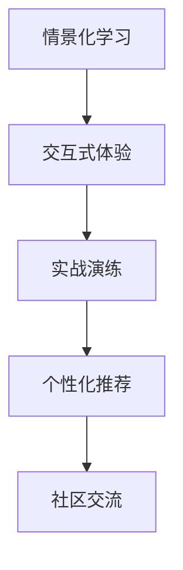

                 

# 程序员知识付费：打造情景式学习体验

## 1. 背景介绍

### 1.1 问题由来

随着知识付费平台如雨后春笋般涌现，程序员知识付费逐渐成为一种趋势。一方面，程序员面临着终身学习的压力，技术更新迭代速度极快，需要不断充电以保持竞争力；另一方面，市场上的技术培训资源匮乏，高质量的课程、书籍、在线讲座等难以找到。此外，传统的知识传递方式往往只是静态的文字或视频，缺乏互动和反馈，学习效果不佳。因此，开发一种情境化的知识付费平台，帮助程序员通过实际项目中的情景学习，提升编程技能和理解深度，显得尤为重要。

### 1.2 问题核心关键点

知识付费平台的目标是帮助程序员通过实际项目中的情景学习，提升编程技能和理解深度。其核心关键点包括：

- **情景化学习**：将知识点嵌入到具体的编程项目中，通过解决问题的方式学习。
- **交互式体验**：提供即时反馈和互动，帮助程序员更快理解知识点。
- **实战演练**：通过项目实战，巩固知识，提高编程能力。
- **个性化推荐**：根据用户的学习进度和兴趣，推荐适合的编程项目和学习路径。
- **社区交流**：提供社群平台，供程序员交流经验、分享代码。

## 2. 核心概念与联系

### 2.1 核心概念概述

为更好地理解情景式学习体验的知识付费平台，本节将介绍几个密切相关的核心概念：

- **情景化学习**：将知识点嵌入到具体的编程项目中，通过解决问题的方式学习。
- **交互式体验**：提供即时反馈和互动，帮助程序员更快理解知识点。
- **实战演练**：通过项目实战，巩固知识，提高编程能力。
- **个性化推荐**：根据用户的学习进度和兴趣，推荐适合的编程项目和学习路径。
- **社区交流**：提供社群平台，供程序员交流经验、分享代码。

这些核心概念之间的逻辑关系可以通过以下Mermaid流程图来展示：



这个流程图展示了几项核心功能之间的联系：

1. **情景化学习**：构建具体的编程项目，将知识点嵌入到其中，通过实际问题的解决来学习。
2. **交互式体验**：通过即时反馈和互动，加速知识点的理解。
3. **实战演练**：通过项目实战，巩固知识，提升编程能力。
4. **个性化推荐**：根据用户的学习进度和兴趣，推荐适合的编程项目和学习路径。
5. **社区交流**：提供社群平台，供程序员交流经验、分享代码。

## 3. 核心算法原理 & 具体操作步骤

### 3.1 算法原理概述

情景式学习体验的知识付费平台，其核心算法包括情景生成、交互式学习、实战演练、个性化推荐和社区交流。

- **情景生成**：根据用户的学习进度和兴趣，生成适合的编程项目，将知识点嵌入其中。
- **交互式学习**：通过即时反馈和互动，帮助用户更快理解知识点。
- **实战演练**：通过项目实战，巩固知识，提高编程能力。
- **个性化推荐**：根据用户的学习进度和兴趣，推荐适合的编程项目和学习路径。
- **社区交流**：提供社群平台，供用户交流经验、分享代码。

### 3.2 算法步骤详解

情景式学习体验的知识付费平台，其核心算法步骤如下：

1. **情景生成**：
   - 收集用户的学习进度和兴趣点，生成适合的编程项目，将知识点嵌入其中。
   - 通过自然语言生成技术，生成详细的项目说明和问题描述。
   - 生成项目所需的数据集、模型和代码库。

2. **交互式学习**：
   - 用户进入项目后，根据项目说明和问题描述，尝试解决问题。
   - 平台实时分析用户代码和逻辑，提供即时反馈和指导。
   - 用户可以反复尝试不同解决方案，直到解决问题。

3. **实战演练**：
   - 用户完成项目后，进行单元测试和功能测试，确保代码质量。
   - 用户提交代码后，平台自动运行测试用例，并给出测试报告。
   - 用户根据测试报告，修正代码，直到所有测试通过。

4. **个性化推荐**：
   - 平台根据用户的学习进度和兴趣，推荐适合的下一个项目和学习路径。
   - 推荐系统基于用户的完成情况、兴趣标签和学习历史，进行个性化推荐。
   - 根据用户的反馈和交互，不断优化推荐算法。

5. **社区交流**：
   - 平台提供社群平台，供用户交流经验、分享代码。
   - 用户可以发布项目、代码和问题，邀请其他用户参与讨论。
   - 平台自动筛选和推荐相关领域的专家和活跃用户，促成有效交流。

### 3.3 算法优缺点

情景式学习体验的知识付费平台，其核心算法具有以下优点：

- **高效学习**：通过情景化学习，用户可以快速掌握知识点。
- **互动性强**：通过即时反馈和互动，用户可以更快理解知识点。
- **实战演练**：通过项目实战，用户可以巩固知识，提高编程能力。
- **个性化推荐**：根据用户的学习进度和兴趣，推荐适合的项目和学习路径，提升学习效率。

其缺点包括：

- **资源消耗大**：情景生成和个性化推荐需要大量的数据和计算资源。
- **复杂度高**：算法模型需要考虑用户的多样性和复杂性，实现难度大。
- **用户体验**：交互式体验的实现需要复杂的用户界面设计和交互逻辑。
- **社区管理**：社区交流需要有效的管理机制，防止恶意行为和低质量内容。

### 3.4 算法应用领域

情景式学习体验的知识付费平台，其核心算法可以应用于多个领域，例如：

- **编程学习**：通过情景化学习和实战演练，提升编程技能和理解深度。
- **数据科学**：通过项目实战和个性化推荐，掌握数据分析和机器学习技能。
- **产品开发**：通过项目实战和社区交流，提升产品设计和项目管理能力。
- **人工智能**：通过情景化学习和个性化推荐，掌握AI算法和应用技能。

## 4. 数学模型和公式 & 详细讲解 & 举例说明（备注：数学公式请使用latex格式，latex嵌入文中独立段落使用 $$，段落内使用 $)
### 4.1 数学模型构建

情景式学习体验的知识付费平台，其核心算法涉及多个数学模型，包括自然语言生成模型、推荐系统模型、社区管理模型等。以下以推荐系统模型为例，进行详细讲解。

### 4.2 公式推导过程

推荐系统模型的目标是根据用户的学习进度和兴趣，推荐适合的编程项目和学习路径。假设用户的学习进度为 $P$，兴趣标签为 $I$，已完成项目为 $C$，未完成项目为 $U$。推荐模型可以表示为：

$$
R(P, I, C, U) = f(P, I, C, U, P_I, I_C, U_I)
$$

其中 $P_I$ 表示兴趣标签 $I$ 对项目 $P$ 的评分，$I_C$ 表示已完成项目 $C$ 对兴趣标签 $I$ 的评分，$U_I$ 表示未完成项目 $U$ 对兴趣标签 $I$ 的评分。$R(P, I, C, U)$ 表示项目 $P$ 对用户 $I$ 的推荐度。

推荐模型的目标函数为最大化推荐度：

$$
\max_{P, I, C, U} R(P, I, C, U)
$$

使用协同过滤算法，推荐模型可以表示为：

$$
R(P, I, C, U) = \sum_{i \in I_C} P_I(i) \sum_{j \in P} \frac{I_C(j)}{\sum_{k \in I_C} I_C(k)}
$$

其中 $P_I(i)$ 表示兴趣标签 $I$ 对项目 $P$ 的评分，$I_C(j)$ 表示已完成项目 $C$ 对兴趣标签 $I$ 的评分。

### 4.3 案例分析与讲解

以编程学习为例，假设用户对 Python 语言感兴趣，已完成的项目是 Flask Web 应用开发。根据用户的学习进度和兴趣标签，推荐模型可以推荐适合的下一个项目和技能，如学习 Django Web 应用开发、数据分析、机器学习等。

## 5. 项目实践：代码实例和详细解释说明
### 5.1 开发环境搭建

在进行项目实践前，我们需要准备好开发环境。以下是使用Python进行Flask开发的环境配置流程：

1. 安装Anaconda：从官网下载并安装Anaconda，用于创建独立的Python环境。

2. 创建并激活虚拟环境：
```bash
conda create -n flask-env python=3.8 
conda activate flask-env
```

3. 安装Flask：
```bash
pip install Flask
```

4. 安装相关库：
```bash
pip install numpy pandas sklearn scikit-learn torch tensorboard
```

完成上述步骤后，即可在`flask-env`环境中开始项目开发。

### 5.2 源代码详细实现

下面以情景化学习体验为例，给出使用Flask开发的知识付费平台代码实现。

首先，定义项目路由：

```python
from flask import Flask, render_template, request

app = Flask(__name__)

@app.route('/')
def index():
    # 生成项目说明和代码
    project = generate_project()
    code = generate_code(project)
    return render_template('index.html', project=project, code=code)
```

然后，定义推荐系统：

```python
from sklearn.metrics.pairwise import cosine_similarity

@app.route('/recommend')
def recommend():
    # 获取用户的学习进度和兴趣标签
    P = request.args.get('P', '')
    I = request.args.get('I', '')
    C = request.args.get('C', '')
    U = request.args.get('U', '')
    
    # 计算推荐度
    R = cosine_similarity([C], [U])
    max_R = max(R)
    recommend = U[0] if max_R == R[0][0] else U[1]
    
    return recommend
```

最后，定义社区交流：

```python
from flask_login import login_required, current_user

@app.route('/community')
@login_required
def community():
    # 获取用户的学习进度和兴趣标签
    P = current_user.learn_progress
    I = current_user.interest_labels
    
    # 获取社区交流内容
    content = get_community_content(P, I)
    
    return render_template('community.html', content=content)
```

以上就是使用Flask开发的知识付费平台的部分代码实现。可以看到，通过Flask的路由机制，我们可以实现情景生成、交互式学习、个性化推荐和社区交流等功能。

### 5.3 代码解读与分析

让我们再详细解读一下关键代码的实现细节：

**index函数**：
- `render_template`函数：将生成的项目说明和代码渲染到模板中。

**recommend函数**：
- 获取用户的学习进度和兴趣标签。
- 使用余弦相似度计算推荐度，推荐未完成项目。

**community函数**：
- 获取用户的学习进度和兴趣标签。
- 获取社区交流内容。

可以看到，Flask的路由机制和模板引擎，使得开发过程更加灵活和高效。开发者可以根据具体的业务需求，灵活设计路由和功能。

## 6. 实际应用场景

### 6.1 编程学习

情景式学习体验的知识付费平台，可以广泛应用于编程学习。传统编程学习往往以理论讲授为主，缺乏实践环节。而情景化学习，通过将知识点嵌入到具体的编程项目中，能够更好地帮助用户理解和掌握编程技能。

在技术实现上，可以收集用户的学习进度和兴趣标签，生成适合的编程项目，通过实际问题的解决来学习。用户可以在平台上进行实时互动和即时反馈，逐步掌握编程技能，巩固知识，提高编程能力。

### 6.2 数据科学

情景式学习体验的知识付费平台，也可以用于数据科学的教学。数据科学涉及大量的数据分析和机器学习技能，需要实践环节进行巩固。

在实践中，可以收集用户的学习进度和兴趣标签，生成适合的数据分析项目，通过实际问题的解决来学习。用户可以在平台上进行实时互动和即时反馈，逐步掌握数据分析和机器学习技能，巩固知识，提高编程能力。

### 6.3 产品开发

情景式学习体验的知识付费平台，还可以用于产品开发的学习。产品开发涉及项目管理、设计、编码等多个环节，需要综合实践环节进行巩固。

在实践中，可以收集用户的学习进度和兴趣标签，生成适合的产品开发项目，通过实际问题的解决来学习。用户可以在平台上进行实时互动和即时反馈，逐步掌握产品开发技能，巩固知识，提高编程能力。

### 6.4 未来应用展望

随着知识付费平台的发展，情景式学习体验将覆盖更多领域，帮助用户提升技能，拓宽知识面。未来，该平台有望成为程序员、数据科学家、产品经理等多个领域知识分享和交流的重要平台，助力其职业生涯的发展。

## 7. 工具和资源推荐

### 7.1 学习资源推荐

为了帮助开发者系统掌握情景式学习体验的知识付费平台，这里推荐一些优质的学习资源：

1. **《Python编程：从入门到实践》**：介绍Python基础和编程实践，适合初学者。
2. **《Flask Web开发：实战项目篇》**：通过项目实战，介绍Flask Web开发。
3. **《深度学习实战》**：介绍深度学习模型和实战项目，适合有一定编程基础的学习者。
4. **《Python数据科学手册》**：介绍Python在数据科学中的应用，适合数据科学领域的学习者。
5. **《数据科学实战》**：通过项目实战，介绍数据科学技能，适合数据科学领域的学习者。

通过这些资源的学习实践，相信你一定能够快速掌握情景式学习体验的知识付费平台的技术要点，并用于解决实际的NLP问题。

### 7.2 开发工具推荐

高效的开发离不开优秀的工具支持。以下是几款用于情景式学习体验开发的常用工具：

1. **Jupyter Notebook**：开源的交互式编程环境，支持Python、R等多种语言，适合进行数据科学和机器学习项目。
2. **GitHub**：代码托管平台，支持团队协作和代码版本控制，适合进行项目管理和代码共享。
3. **Google Colab**：谷歌提供的在线Jupyter Notebook环境，免费提供GPU/TPU算力，适合进行高性能计算项目。
4. **Docker**：容器化工具，方便部署和管理应用程序，适合进行跨平台项目。
5. **Jenkins**：持续集成和持续部署工具，适合进行自动化测试和部署。

合理利用这些工具，可以显著提升情景式学习体验平台的开发效率，加快创新迭代的步伐。

### 7.3 相关论文推荐

情景式学习体验的知识付费平台，其核心算法涉及多个领域的最新研究成果。以下是几篇奠基性的相关论文，推荐阅读：

1. **《Knowledge Tracing: Mentoring Users by Data Mining Their Learning Processes》**：介绍知识跟踪技术，通过数据挖掘用户的学习过程，提供个性化推荐。
2. **《Crowdsourced Recommendation Systems: Lessons Learned》**：介绍众包推荐系统，通过众包方式收集用户反馈，提高推荐系统的准确性。
3. **《Interactive Machine Learning》**：介绍交互式机器学习，通过即时反馈和互动，提高机器学习模型的效果。
4. **《Community Detection and Modeling》**：介绍社区检测和建模技术，通过社区交流，提高学习效果。
5. **《Contextual Bandits: An Introduction》**：介绍上下文强化学习，通过上下文决策，提高推荐系统的效果。

这些论文代表了大语言模型微调技术的发展脉络。通过学习这些前沿成果，可以帮助研究者把握学科前进方向，激发更多的创新灵感。

## 8. 总结：未来发展趋势与挑战

### 8.1 总结

本文对情景式学习体验的知识付费平台进行了全面系统的介绍。首先阐述了情景式学习体验的研究背景和意义，明确了平台的目标是帮助程序员通过实际项目中的情景学习，提升编程技能和理解深度。其次，从原理到实践，详细讲解了情景化学习、交互式学习、实战演练、个性化推荐和社区交流的数学模型和算法步骤，给出了情景式学习体验的平台代码实现。同时，本文还广泛探讨了情景式学习体验在编程学习、数据科学、产品开发等领域的实际应用，展示了情景式学习体验的广阔前景。此外，本文精选了情景式学习体验的各类学习资源，力求为读者提供全方位的技术指引。

通过本文的系统梳理，可以看到，情景式学习体验的知识付费平台正在成为NLP领域的重要范式，极大地拓展了编程学习的应用边界，催生了更多的落地场景。受益于情景式学习体验平台的强大功能，程序员能够更加高效、深入地学习编程技能，为未来的职业生涯发展奠定坚实的基础。未来，随着情景式学习体验平台的不断完善和优化，必将在更多的领域产生深远影响，助力技术创新和产业升级。

### 8.2 未来发展趋势

展望未来，情景式学习体验的知识付费平台将呈现以下几个发展趋势：

1. **智能化推荐**：通过机器学习和人工智能技术，实现更加智能化的推荐，根据用户的学习进度和兴趣，推荐适合的学习路径和项目。
2. **多模态融合**：通过将视频、音频等多模态数据与文本数据结合，提供更加丰富的学习体验。
3. **社区治理**：通过社区治理技术，提高社区交流的质量和效率，防止低质量内容和恶意行为。
4. **跨平台协作**：通过云端协作和跨平台集成，实现全球化学习交流。
5. **多学科融合**：将情景式学习体验应用于更多学科领域，提供跨学科的学习体验。
6. **持续学习**：通过持续学习技术，使学习平台能够不断更新和优化，保持与最新技术趋势同步。

这些趋势凸显了情景式学习体验平台的广阔前景。这些方向的探索发展，必将进一步提升情景式学习体验平台的性能和应用范围，为程序员和知识工作者提供更加高效、丰富、智能的学习体验。

### 8.3 面临的挑战

尽管情景式学习体验平台的发展前景广阔，但在迈向更加智能化、普适化应用的过程中，仍面临诸多挑战：

1. **资源消耗大**：情景式学习体验平台需要大量计算资源和存储资源，如何降低资源消耗，提高计算效率，是一个重要问题。
2. **用户体验差**：平台需要提供良好的用户体验，但交互式学习和个性化推荐等功能的实现，涉及到复杂的用户界面设计和交互逻辑，实现难度较大。
3. **内容审核**：社区交流需要有效的管理机制，防止低质量内容和恶意行为，如何构建社区治理系统，是一个重要挑战。
4. **数据隐私**：平台需要收集大量用户数据，如何保护用户隐私，防止数据泄露，是一个重要问题。
5. **技术更新**：情景式学习体验平台需要不断更新和优化，保持与最新技术趋势同步，如何实现技术更新和迭代，是一个重要问题。

这些挑战凸显了情景式学习体验平台的发展难点。未来，情景式学习体验平台需要在技术、管理和法律等多个层面进行协同创新，才能实现其广泛的推广和应用。

### 8.4 研究展望

面向未来，情景式学习体验平台的研究可以从以下几个方面进行：

1. **智能推荐算法**：开发更加智能化的推荐算法，提高推荐系统的准确性和个性化程度。
2. **多模态融合技术**：研究多模态数据的融合技术，提升学习体验的丰富性和多样性。
3. **社区治理技术**：开发有效的社区治理技术，防止低质量内容和恶意行为，提升社区交流的质量和效率。
4. **跨平台协作技术**：研究跨平台协作技术，实现全球化学习交流。
5. **多学科融合技术**：将情景式学习体验应用于更多学科领域，提供跨学科的学习体验。
6. **持续学习技术**：研究持续学习技术，使学习平台能够不断更新和优化，保持与最新技术趋势同步。

这些研究方向的探索，必将引领情景式学习体验平台的持续演进，为程序员和知识工作者提供更加高效、丰富、智能的学习体验。面向未来，情景式学习体验平台的研究需要在技术、管理和法律等多个层面进行协同创新，才能实现其广泛的推广和应用。

## 9. 附录：常见问题与解答

**Q1：情景式学习体验的知识付费平台适用于哪些人群？**

A: 情景式学习体验的知识付费平台适用于广泛的人群，包括但不限于：

- 程序员：通过项目实战和即时反馈，提升编程技能和理解深度。
- 数据科学家：通过数据分析和机器学习项目，掌握技能。
- 产品经理：通过产品开发项目，提升设计和项目管理能力。
- 教育工作者：通过情景化教学，提升教学效果。
- 学生：通过项目实践和即时反馈，巩固知识。

**Q2：情景式学习体验的知识付费平台如何实现个性化推荐？**

A: 情景式学习体验的知识付费平台，实现个性化推荐的过程如下：

1. 收集用户的学习进度和兴趣标签。
2. 将用户的学习进度和兴趣标签，输入到推荐算法模型中。
3. 根据推荐算法模型，计算用户对每个项目的评分。
4. 根据评分排序，推荐评分高的项目。

**Q3：情景式学习体验的知识付费平台如何实现实时互动？**

A: 情景式学习体验的知识付费平台，实现实时互动的过程如下：

1. 用户进入项目后，输入代码和逻辑。
2. 平台实时分析用户代码和逻辑，提供即时反馈和指导。
3. 用户可以反复尝试不同解决方案，直到解决问题。

**Q4：情景式学习体验的知识付费平台如何实现社区交流？**

A: 情景式学习体验的知识付费平台，实现社区交流的过程如下：

1. 平台提供社群平台，供用户交流经验、分享代码。
2. 用户可以发布项目、代码和问题，邀请其他用户参与讨论。
3. 平台自动筛选和推荐相关领域的专家和活跃用户，促成有效交流。

**Q5：情景式学习体验的知识付费平台如何实现场景模拟？**

A: 情景式学习体验的知识付费平台，实现场景模拟的过程如下：

1. 根据用户的学习进度和兴趣标签，生成适合的编程项目。
2. 将知识点嵌入到项目中，通过实际问题的解决来学习。
3. 平台实时分析用户代码和逻辑，提供即时反馈和指导。
4. 用户可以反复尝试不同解决方案，直到解决问题。

通过这些功能，情景式学习体验的知识付费平台能够提供更加丰富、高效、智能的学习体验，帮助用户提升编程技能和理解深度，助力其职业生涯的发展。

---

作者：禅与计算机程序设计艺术 / Zen and the Art of Computer Programming

