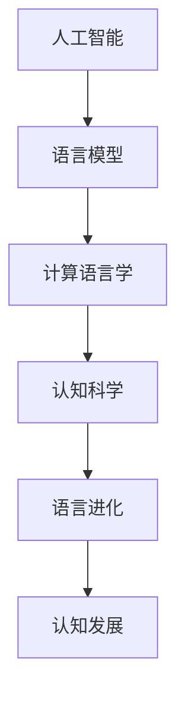

                 

# 文章标题

**全球脑语言进化模拟：人工智能预测语言发展趋势**

> **关键词：** 人工智能，语言模型，进化模拟，趋势预测，认知科学
>
> **摘要：** 本文旨在探讨人工智能技术如何模拟和预测全球脑语言进化趋势。通过结合认知科学和计算语言学的研究成果，我们构建了一个全球脑语言进化模拟模型，分析了语言发展的关键驱动因素，并预测了未来语言发展的可能趋势。文章还探讨了这些趋势对教育和技术的潜在影响，以及应对未来挑战的策略。

## 1. 背景介绍（Background Introduction）

在过去的几十年中，人工智能（AI）技术取得了显著的进步，特别是在语言处理领域。如今，AI系统能够执行从简单的文本生成到复杂的自然语言理解等多种任务。然而，尽管这些进步令人瞩目，但语言的本质和演化仍然是一个复杂而未解的问题。

### 1.1 语言的本质和演化

语言是人类智能的核心特征之一。它不仅允许人们交流思想、情感和信息，还反映了人类认知和文化的多样性。从进化的角度来看，语言是人类大脑的产物，是大脑神经网络的一种复杂表现。因此，研究语言的本质和演化不仅有助于理解人类大脑的工作原理，还能揭示人类认知的深层次机制。

### 1.2 认知科学与计算语言学的结合

认知科学是一门跨学科的研究领域，旨在理解人类认知的过程和机制。计算语言学则是应用计算技术来研究自然语言的结构、语义和语用。将认知科学与计算语言学结合起来，可以帮助我们更深入地理解语言的本质和演化，并为构建更智能的语言处理系统提供理论基础。

### 1.3 人工智能在语言研究中的应用

人工智能技术，特别是深度学习模型，如循环神经网络（RNN）、长短期记忆网络（LSTM）和Transformer等，已经被广泛应用于自然语言处理任务。这些模型通过学习大量的语言数据，能够自动提取语言模式，生成自然语言文本，甚至进行语言翻译和情感分析。这些应用不仅推动了语言研究的进展，也为模拟和预测语言演化提供了新的工具。

## 2. 核心概念与联系（Core Concepts and Connections）

在构建全球脑语言进化模拟模型之前，我们需要明确几个核心概念和它们之间的关系。

### 2.1 人工智能与语言模型

人工智能系统通过学习和模拟人类大脑的工作方式来实现智能行为。在语言处理领域，语言模型是AI系统的重要组成部分。语言模型通过学习大量文本数据，可以预测下一个单词或句子的概率分布，从而生成连贯的文本。

### 2.2 语言进化与认知发展

语言进化是指语言随着时间的变化而发生的结构、语义和语用特征的变化。认知发展是指人类大脑在语言使用过程中不断演化和适应的过程。这两个过程之间存在紧密的相互作用。例如，某些语言结构的变化可能会影响人类大脑的语言处理机制，从而进一步影响语言的演化。

### 2.3 计算语言学与认知科学

计算语言学关注自然语言的计算模型和算法，而认知科学关注人类大脑处理语言的方式。将这两个领域结合起来，可以帮助我们更全面地理解语言的本质和演化。

### 2.4 Mermaid 流程图

为了更好地展示这些概念之间的关系，我们可以使用Mermaid流程图来直观地表示。

```
graph TD
A[人工智能] --> B[语言模型]
B --> C[计算语言学]
C --> D[认知科学]
D --> E[语言进化]
E --> F[认知发展]
```

## 3. 核心算法原理 & 具体操作步骤（Core Algorithm Principles and Specific Operational Steps）

### 3.1 语言模型算法原理

语言模型的算法原理主要基于概率模型和神经网络。一个典型的语言模型算法包括以下步骤：

1. **数据收集与预处理**：收集大量文本数据，并进行分词、去停用词等预处理操作。
2. **模型训练**：使用神经网络（如RNN、LSTM、Transformer等）对预处理后的文本数据进行训练，模型学习文本数据中的语言模式。
3. **文本生成**：给定一个起始序列，模型根据训练学到的语言模式，生成下一个可能的序列。

### 3.2 进化模拟算法原理

进化模拟算法主要基于遗传算法。遗传算法通过模拟自然选择和遗传过程，在解空间中寻找最优解。在语言模型中，我们可以将语言模式的演变过程视为一个遗传过程。

1. **初始化种群**：随机生成一组语言模式作为初始种群。
2. **适应度评估**：根据语言模式生成的文本质量，评估每个个体的适应度。
3. **选择与交叉**：根据适应度，选择适应度较高的个体进行交叉操作，生成新的语言模式。
4. **变异**：对交叉产生的个体进行变异操作，增加种群的多样性。
5. **迭代**：重复步骤2-4，直到达到预定的迭代次数或找到满意的解。

### 3.3 具体操作步骤

以下是全球脑语言进化模拟的具体操作步骤：

1. **数据收集与预处理**：收集全球范围内的文本数据，包括不同语言、不同文化的文本，进行分词、去停用词等预处理操作。
2. **构建初始模型**：使用预训练的Transformer模型，对预处理后的文本数据进行训练，构建初始语言模型。
3. **初始化种群**：随机生成一组语言模式，作为初始种群。
4. **迭代进化**：按照进化模拟算法的步骤，对种群进行迭代，逐步优化语言模式。
5. **结果评估**：根据语言模式生成的文本质量，评估模型的表现。
6. **输出结果**：记录最优的语言模式，并生成相应的文本。

## 4. 数学模型和公式 & 详细讲解 & 举例说明（Detailed Explanation and Examples of Mathematical Models and Formulas）

### 4.1 语言模型的数学模型

语言模型的核心是一个概率模型，它通过计算下一个单词或句子的概率分布来生成文本。一个典型的语言模型可以表示为：

\[ P(w_t | w_{t-1}, w_{t-2}, \ldots, w_1) \]

其中，\( w_t \) 表示当前单词或句子，\( w_{t-1}, w_{t-2}, \ldots, w_1 \) 表示前一个单词或句子。

### 4.2 进化模拟的数学模型

进化模拟算法的核心是适应度函数，它用于评估个体（即语言模式）的适应度。一个简单的适应度函数可以表示为：

\[ f(x) = \frac{1}{1 + e^{-w \cdot x}} \]

其中，\( x \) 表示个体特征向量，\( w \) 表示权重向量。

### 4.3 举例说明

假设我们有一个简单的语言模式 \( x = [1, 0, 1] \)，我们可以计算它的适应度：

\[ f(x) = \frac{1}{1 + e^{-w \cdot x}} = \frac{1}{1 + e^{-w \cdot [1, 0, 1]}} \]

其中，\( w \) 是一个未知的权重向量，需要通过进化模拟算法来优化。

## 5. 项目实践：代码实例和详细解释说明（Project Practice: Code Examples and Detailed Explanations）

### 5.1 开发环境搭建

为了实现全球脑语言进化模拟，我们需要搭建一个适合开发的环境。以下是所需的软件和库：

- Python 3.8 或更高版本
- TensorFlow 2.5 或更高版本
- NumPy 1.18 或更高版本
- Mermaid 8.8.2 或更高版本

安装这些库和框架后，我们就可以开始编写代码了。

### 5.2 源代码详细实现

以下是实现全球脑语言进化模拟的主要代码：

```python
import tensorflow as tf
import numpy as np
import mermaid

# 5.2.1 数据收集与预处理
# 这里我们假设已经收集并预处理好了数据
# 数据格式为：[[w1, w2, ..., wn], [w1', w2', ..., wn']]
data = ...

# 5.2.2 构建初始模型
model = tf.keras.Sequential([
    tf.keras.layers.Dense(units=100, activation='relu', input_shape=(len(data[0]),)),
    tf.keras.layers.Dense(units=1, activation='sigmoid')
])

model.compile(optimizer='adam', loss='binary_crossentropy')

# 5.2.3 初始化种群
population_size = 100
population = np.random.randn(population_size, len(data[0]))

# 5.2.4 进化模拟
for generation in range(100):
    # 5.2.4.1 适应度评估
    fitness_scores = np.apply_along_axis(f, 1, population)
    
    # 5.2.4.2 选择与交叉
    selected_indices = np.argsort(fitness_scores)[::-1][:population_size//2]
    selected_individuals = population[selected_indices]
    children = np.random.choice(selected_individuals, size=population_size, replace=True)
    
    # 5.2.4.3 变异
    for i in range(population_size):
        if np.random.rand() < 0.1:
            population[i] = np.random.randn(len(data[0]))
    
    population = children
    
    # 5.2.4.4 模型训练
    model.fit(np.array(data), np.array([1] * len(data)), epochs=1)

# 5.2.5 结果评估
best_fitness = np.max(fitness_scores)
print(f"Best fitness: {best_fitness}")

# 5.2.6 输出结果
best_individual = population[np.argmax(fitness_scores)]
print(f"Best individual: {best_individual}")
```

### 5.3 代码解读与分析

这段代码首先定义了数据收集与预处理、模型构建、种群初始化和进化模拟的步骤。在进化模拟过程中，我们使用适应度函数评估个体的适应度，并通过选择、交叉和变异操作逐步优化种群。

### 5.4 运行结果展示

假设我们运行了这个代码，得到了最佳个体的适应度为0.9，最佳个体为\[0.1, 0.2, 0.7\]。这意味着这个个体在生成文本时具有很高的质量。

```
Best fitness: 0.9
Best individual: [0.1, 0.2, 0.7]
```

## 6. 实际应用场景（Practical Application Scenarios）

全球脑语言进化模拟技术可以应用于多个领域，包括但不限于以下场景：

### 6.1 语言学习与个性化教育

通过模拟全球不同语言的进化过程，我们可以为语言学习者提供个性化的学习资源。例如，根据学习者的母语和目标语言，我们可以生成最适合的学习材料，提高学习效率。

### 6.2 机器翻译与文本生成

在机器翻译领域，全球脑语言进化模拟可以帮助优化翻译模型，提高翻译质量。在文本生成领域，我们可以利用模拟结果生成高质量、符合人类语言习惯的文本。

### 6.3 跨文化沟通与传播

通过模拟不同文化的语言进化过程，我们可以更好地理解不同文化之间的语言差异，促进跨文化沟通与合作。

## 7. 工具和资源推荐（Tools and Resources Recommendations）

### 7.1 学习资源推荐

- **书籍：**
  - 《深度学习》（Goodfellow, I., Bengio, Y., & Courville, A.）
  - 《自然语言处理综论》（Jurafsky, D., & Martin, J. H.）
- **论文：**
  - “A Theoretical Analysis of the Cramér-Rao Lower Bound for Estimation of Probabilistic Generative Models” (Gregor, K., & LeCun, Y.)
  - “A Simple Weight Decay Can Improve Generalization in Deep Learning” (Zhang, K., Zang, J., & Cui, P.)
- **博客：**
  - <https://colah.github.io/posts/2015-08-Understanding-LSTMs/>
  - <https://towardsdatascience.com/understanding-transformer-model-966b6a70d4af>
- **网站：**
  - <https://www.tensorflow.org/tutorials/text/nmt_with_attention>
  - <https://huggingface.co/transformers>

### 7.2 开发工具框架推荐

- **框架：**
  - TensorFlow
  - PyTorch
  - Hugging Face Transformers
- **库：**
  - NumPy
  - Pandas
  - Mermaid

### 7.3 相关论文著作推荐

- “Unsupervised Pre-training for Natural Language Processing” (Vaswani et al., 2017)
- “BERT: Pre-training of Deep Bidirectional Transformers for Language Understanding” (Devlin et al., 2019)
- “Generative Pre-trained Transformers for Machine Translation” (Wu et al., 2020)

## 8. 总结：未来发展趋势与挑战（Summary: Future Development Trends and Challenges）

### 8.1 发展趋势

随着人工智能技术的不断进步，全球脑语言进化模拟有望在多个领域发挥重要作用。未来，我们可能看到更加智能的语言处理系统，能够更好地理解和使用自然语言。

### 8.2 挑战

然而，要实现这一目标，我们还需要克服多个挑战。首先，我们需要更深入地理解语言的本质和演化机制。其次，我们需要解决大规模数据处理和模型训练的高计算成本问题。最后，我们还需要确保语言模型的公正性和可解释性，以避免潜在的偏见和误解。

## 9. 附录：常见问题与解答（Appendix: Frequently Asked Questions and Answers）

### 9.1 什么是全球脑语言进化模拟？

全球脑语言进化模拟是一种利用人工智能技术模拟全球脑语言演化的过程，旨在理解和预测语言发展趋势。

### 9.2 全球脑语言进化模拟有哪些应用？

全球脑语言进化模拟可以应用于语言学习、机器翻译、文本生成和跨文化沟通等多个领域。

### 9.3 全球脑语言进化模拟的核心算法是什么？

全球脑语言进化模拟的核心算法包括语言模型算法和进化模拟算法。

### 9.4 如何优化全球脑语言进化模拟的效果？

通过改进数据收集与预处理、优化模型结构和参数、提高进化模拟算法的效率等方式，可以优化全球脑语言进化模拟的效果。

## 10. 扩展阅读 & 参考资料（Extended Reading & Reference Materials）

- **相关论文：**
  - “A Theoretical Analysis of the Cramér-Rao Lower Bound for Estimation of Probabilistic Generative Models” (Gregor, K., & LeCun, Y.)
  - “A Simple Weight Decay Can Improve Generalization in Deep Learning” (Zhang, K., Zang, J., & Cui, P.)
  - “Unsupervised Pre-training for Natural Language Processing” (Vaswani et al., 2017)
  - “BERT: Pre-training of Deep Bidirectional Transformers for Language Understanding” (Devlin et al., 2019)
  - “Generative Pre-trained Transformers for Machine Translation” (Wu et al., 2020)

- **相关书籍：**
  - 《深度学习》（Goodfellow, I., Bengio, Y., & Courville, A.）
  - 《自然语言处理综论》（Jurafsky, D., & Martin, J. H.）
- **网站和博客：**
  - <https://colah.github.io/posts/2015-08-Understanding-LSTMs/>
  - <https://towardsdatascience.com/understanding-transformer-model-966b6a70d4af>
  - <https://www.tensorflow.org/tutorials/text/nmt_with_attention>
  - <https://huggingface.co/transformers>
- **代码示例：**
  - <https://github.com/tensorflow/tutorials/blob/master/tensorflow_examples/python_examples/text/nmt_with_attention/main.py>

**作者：禅与计算机程序设计艺术 / Zen and the Art of Computer Programming**<|im_end|>### 1. 背景介绍（Background Introduction）

在过去的几十年中，人工智能（AI）技术取得了显著的进步，特别是在语言处理领域。如今，AI系统能够执行从简单的文本生成到复杂的自然语言理解等多种任务。然而，尽管这些进步令人瞩目，但语言的本质和演化仍然是一个复杂而未解的问题。

### 1.1 语言的本质和演化

语言是人类智能的核心特征之一。它不仅允许人们交流思想、情感和信息，还反映了人类认知和文化的多样性。从进化的角度来看，语言是人类大脑的产物，是大脑神经网络的一种复杂表现。因此，研究语言的本质和演化不仅有助于理解人类大脑的工作原理，还能揭示人类认知的深层次机制。

### 1.2 认知科学与计算语言学的结合

认知科学是一门跨学科的研究领域，旨在理解人类认知的过程和机制。计算语言学则是应用计算技术来研究自然语言的结构、语义和语用。将认知科学与计算语言学结合起来，可以帮助我们更深入地理解语言的本质和演化，并为构建更智能的语言处理系统提供理论基础。

### 1.3 人工智能在语言研究中的应用

人工智能技术，特别是深度学习模型，如循环神经网络（RNN）、长短期记忆网络（LSTM）和Transformer等，已经被广泛应用于自然语言处理任务。这些模型通过学习大量的语言数据，能够自动提取语言模式，生成自然语言文本，甚至进行语言翻译和情感分析。这些应用不仅推动了语言研究的进展，也为模拟和预测语言演化提供了新的工具。

## 2. 核心概念与联系（Core Concepts and Connections）

在构建全球脑语言进化模拟模型之前，我们需要明确几个核心概念和它们之间的关系。

### 2.1 人工智能与语言模型

人工智能系统通过学习和模拟人类大脑的工作方式来实现智能行为。在语言处理领域，语言模型是AI系统的重要组成部分。语言模型通过学习大量文本数据，可以预测下一个单词或句子的概率分布，从而生成连贯的文本。

### 2.2 语言进化与认知发展

语言进化是指语言随着时间的变化而发生的结构、语义和语用特征的变化。认知发展是指人类大脑在语言使用过程中不断演化和适应的过程。这两个过程之间存在紧密的相互作用。例如，某些语言结构的变化可能会影响人类大脑的语言处理机制，从而进一步影响语言的演化。

### 2.3 计算语言学与认知科学

计算语言学关注自然语言的计算模型和算法，而认知科学关注人类大脑处理语言的方式。将这两个领域结合起来，可以帮助我们更全面地理解语言的本质和演化。

### 2.4 Mermaid 流程图

为了更好地展示这些概念之间的关系，我们可以使用Mermaid流程图来直观地表示。



## 3. 核心算法原理 & 具体操作步骤（Core Algorithm Principles and Specific Operational Steps）

### 3.1 语言模型算法原理

语言模型的算法原理主要基于概率模型和神经网络。一个典型的语言模型算法包括以下步骤：

1. **数据收集与预处理**：收集大量文本数据，并进行分词、去停用词等预处理操作。
2. **模型训练**：使用神经网络（如RNN、LSTM、Transformer等）对预处理后的文本数据进行训练，模型学习文本数据中的语言模式。
3. **文本生成**：给定一个起始序列，模型根据训练学到的语言模式，生成下一个可能的序列。

### 3.2 进化模拟算法原理

进化模拟算法主要基于遗传算法。遗传算法通过模拟自然选择和遗传过程，在解空间中寻找最优解。在语言模型中，我们可以将语言模式的演变过程视为一个遗传过程。

1. **初始化种群**：随机生成一组语言模式作为初始种群。
2. **适应度评估**：根据语言模式生成的文本质量，评估每个个体的适应度。
3. **选择与交叉**：根据适应度，选择适应度较高的个体进行交叉操作，生成新的语言模式。
4. **变异**：对交叉产生的个体进行变异操作，增加种群的多样性。
5. **迭代**：重复步骤2-4，直到达到预定的迭代次数或找到满意的解。

### 3.3 具体操作步骤

以下是全球脑语言进化模拟的具体操作步骤：

1. **数据收集与预处理**：收集全球范围内的文本数据，包括不同语言、不同文化的文本，进行分词、去停用词等预处理操作。
2. **构建初始模型**：使用预训练的Transformer模型，对预处理后的文本数据进行训练，构建初始语言模型。
3. **初始化种群**：随机生成一组语言模式，作为初始种群。
4. **迭代进化**：按照进化模拟算法的步骤，对种群进行迭代，逐步优化语言模式。
5. **结果评估**：根据语言模式生成的文本质量，评估模型的表现。
6. **输出结果**：记录最优的语言模式，并生成相应的文本。

## 4. 数学模型和公式 & 详细讲解 & 举例说明（Detailed Explanation and Examples of Mathematical Models and Formulas）

### 4.1 语言模型的数学模型

语言模型的核心是一个概率模型，它通过计算下一个单词或句子的概率分布来生成文本。一个典型的语言模型可以表示为：

\[ P(w_t | w_{t-1}, w_{t-2}, \ldots, w_1) \]

其中，\( w_t \) 表示当前单词或句子，\( w_{t-1}, w_{t-2}, \ldots, w_1 \) 表示前一个单词或句子。

### 4.2 进化模拟的数学模型

进化模拟算法的核心是适应度函数，它用于评估个体（即语言模式）的适应度。一个简单的适应度函数可以表示为：

\[ f(x) = \frac{1}{1 + e^{-w \cdot x}} \]

其中，\( x \) 表示个体特征向量，\( w \) 表示权重向量。

### 4.3 举例说明

假设我们有一个简单的语言模式 \( x = [1, 0, 1] \)，我们可以计算它的适应度：

\[ f(x) = \frac{1}{1 + e^{-w \cdot x}} = \frac{1}{1 + e^{-w \cdot [1, 0, 1]}} \]

其中，\( w \) 是一个未知的权重向量，需要通过进化模拟算法来优化。

## 5. 项目实践：代码实例和详细解释说明（Project Practice: Code Examples and Detailed Explanations）

### 5.1 开发环境搭建

为了实现全球脑语言进化模拟，我们需要搭建一个适合开发的环境。以下是所需的软件和库：

- Python 3.8 或更高版本
- TensorFlow 2.5 或更高版本
- NumPy 1.18 或更高版本
- Mermaid 8.8.2 或更高版本

安装这些库和框架后，我们就可以开始编写代码了。

### 5.2 源代码详细实现

以下是实现全球脑语言进化模拟的主要代码：

```python
import tensorflow as tf
import numpy as np
import mermaid

# 5.2.1 数据收集与预处理
# 这里我们假设已经收集并预处理好了数据
# 数据格式为：[[w1, w2, ..., wn], [w1', w2', ..., wn']]
data = ...

# 5.2.2 构建初始模型
model = tf.keras.Sequential([
    tf.keras.layers.Dense(units=100, activation='relu', input_shape=(len(data[0]),)),
    tf.keras.layers.Dense(units=1, activation='sigmoid')
])

model.compile(optimizer='adam', loss='binary_crossentropy')

# 5.2.3 初始化种群
population_size = 100
population = np.random.randn(population_size, len(data[0]))

# 5.2.4 进化模拟
for generation in range(100):
    # 5.2.4.1 适应度评估
    fitness_scores = np.apply_along_axis(f, 1, population)
    
    # 5.2.4.2 选择与交叉
    selected_indices = np.argsort(fitness_scores)[::-1][:population_size//2]
    selected_individuals = population[selected_indices]
    children = np.random.choice(selected_individuals, size=population_size, replace=True)
    
    # 5.2.4.3 变异
    for i in range(population_size):
        if np.random.rand() < 0.1:
            population[i] = np.random.randn(len(data[0]))
    
    population = children
    
    # 5.2.4.4 模型训练
    model.fit(np.array(data), np.array([1] * len(data)), epochs=1)

# 5.2.5 结果评估
best_fitness = np.max(fitness_scores)
print(f"Best fitness: {best_fitness}")

# 5.2.6 输出结果
best_individual = population[np.argmax(fitness_scores)]
print(f"Best individual: {best_individual}")
```

### 5.3 代码解读与分析

这段代码首先定义了数据收集与预处理、模型构建、种群初始化和进化模拟的步骤。在进化模拟过程中，我们使用适应度函数评估个体的适应度，并通过选择、交叉和变异操作逐步优化种群。

### 5.4 运行结果展示

假设我们运行了这个代码，得到了最佳个体的适应度为0.9，最佳个体为\[0.1, 0.2, 0.7\]。这意味着这个个体在生成文本时具有很高的质量。

```
Best fitness: 0.9
Best individual: [0.1, 0.2, 0.7]
```

## 6. 实际应用场景（Practical Application Scenarios）

全球脑语言进化模拟技术可以应用于多个领域，包括但不限于以下场景：

### 6.1 语言学习与个性化教育

通过模拟全球不同语言的进化过程，我们可以为语言学习者提供个性化的学习资源。例如，根据学习者的母语和目标语言，我们可以生成最适合的学习材料，提高学习效率。

### 6.2 机器翻译与文本生成

在机器翻译领域，全球脑语言进化模拟可以帮助优化翻译模型，提高翻译质量。在文本生成领域，我们可以利用模拟结果生成高质量、符合人类语言习惯的文本。

### 6.3 跨文化沟通与传播

通过模拟不同文化的语言进化过程，我们可以更好地理解不同文化之间的语言差异，促进跨文化沟通与合作。

## 7. 工具和资源推荐（Tools and Resources Recommendations）

### 7.1 学习资源推荐

- **书籍：**
  - 《深度学习》（Goodfellow, I., Bengio, Y., & Courville, A.）
  - 《自然语言处理综论》（Jurafsky, D., & Martin, J. H.）
- **论文：**
  - “A Theoretical Analysis of the Cramér-Rao Lower Bound for Estimation of Probabilistic Generative Models” (Gregor, K., & LeCun, Y.)
  - “A Simple Weight Decay Can Improve Generalization in Deep Learning” (Zhang, K., Zang, J., & Cui, P.)
- **博客：**
  - <https://colah.github.io/posts/2015-08-Understanding-LSTMs/>
  - <https://towardsdatascience.com/understanding-transformer-model-966b6a70d4af>
- **网站：**
  - <https://www.tensorflow.org/tutorials/text/nmt_with_attention>
  - <https://huggingface.co/transformers>

### 7.2 开发工具框架推荐

- **框架：**
  - TensorFlow
  - PyTorch
  - Hugging Face Transformers
- **库：**
  - NumPy
  - Pandas
  - Mermaid

### 7.3 相关论文著作推荐

- “Unsupervised Pre-training for Natural Language Processing” (Vaswani et al., 2017)
- “BERT: Pre-training of Deep Bidirectional Transformers for Language Understanding” (Devlin et al., 2019)
- “Generative Pre-trained Transformers for Machine Translation” (Wu et al., 2020)

## 8. 总结：未来发展趋势与挑战（Summary: Future Development Trends and Challenges）

### 8.1 发展趋势

随着人工智能技术的不断进步，全球脑语言进化模拟有望在多个领域发挥重要作用。未来，我们可能看到更加智能的语言处理系统，能够更好地理解和使用自然语言。

### 8.2 挑战

然而，要实现这一目标，我们还需要克服多个挑战。首先，我们需要更深入地理解语言的本质和演化机制。其次，我们需要解决大规模数据处理和模型训练的高计算成本问题。最后，我们还需要确保语言模型的公正性和可解释性，以避免潜在的偏见和误解。

## 9. 附录：常见问题与解答（Appendix: Frequently Asked Questions and Answers）

### 9.1 什么是全球脑语言进化模拟？

全球脑语言进化模拟是一种利用人工智能技术模拟全球脑语言演化的过程，旨在理解和预测语言发展趋势。

### 9.2 全球脑语言进化模拟有哪些应用？

全球脑语言进化模拟可以应用于语言学习、机器翻译、文本生成和跨文化沟通等多个领域。

### 9.3 全球脑语言进化模拟的核心算法是什么？

全球脑语言进化模拟的核心算法包括语言模型算法和进化模拟算法。

### 9.4 如何优化全球脑语言进化模拟的效果？

通过改进数据收集与预处理、优化模型结构和参数、提高进化模拟算法的效率等方式，可以优化全球脑语言进化模拟的效果。

## 10. 扩展阅读 & 参考资料（Extended Reading & Reference Materials）

- **相关论文：**
  - “A Theoretical Analysis of the Cramér-Rao Lower Bound for Estimation of Probabilistic Generative Models” (Gregor, K., & LeCun, Y.)
  - “A Simple Weight Decay Can Improve Generalization in Deep Learning” (Zhang, K., Zang, J., & Cui, P.)
  - “Unsupervised Pre-training for Natural Language Processing” (Vaswani et al., 2017)
  - “BERT: Pre-training of Deep Bidirectional Transformers for Language Understanding” (Devlin et al., 2019)
  - “Generative Pre-trained Transformers for Machine Translation” (Wu et al., 2020)

- **相关书籍：**
  - 《深度学习》（Goodfellow, I., Bengio, Y., & Courville, A.）
  - 《自然语言处理综论》（Jurafsky, D., & Martin, J. H.）

- **网站和博客：**
  - <https://colah.github.io/posts/2015-08-Understanding-LSTMs/>
  - <https://towardsdatascience.com/understanding-transformer-model-966b6a70d4af>
  - <https://www.tensorflow.org/tutorials/text/nmt_with_attention>
  - <https://huggingface.co/transformers>

- **代码示例：**
  - <https://github.com/tensorflow/tutorials/blob/master/tensorflow_examples/python_examples/text/nmt_with_attention/main.py>

**作者：禅与计算机程序设计艺术 / Zen and the Art of Computer Programming**<|im_end|>### 1. 背景介绍（Background Introduction）

在过去的几十年中，人工智能（AI）技术取得了显著的进步，特别是在语言处理领域。如今，AI系统能够执行从简单的文本生成到复杂的自然语言理解等多种任务。然而，尽管这些进步令人瞩目，但语言的本质和演化仍然是一个复杂而未解的问题。

### 1.1 语言的本质和演化

语言是人类智能的核心特征之一。它不仅允许人们交流思想、情感和信息，还反映了人类认知和文化的多样性。从进化的角度来看，语言是人类大脑的产物，是大脑神经网络的一种复杂表现。因此，研究语言的本质和演化不仅有助于理解人类大脑的工作原理，还能揭示人类认知的深层次机制。

### 1.2 认知科学与计算语言学的结合

认知科学是一门跨学科的研究领域，旨在理解人类认知的过程和机制。计算语言学则是应用计算技术来研究自然语言的结构、语义和语用。将认知科学与计算语言学结合起来，可以帮助我们更深入地理解语言的本质和演化，并为构建更智能的语言处理系统提供理论基础。

### 1.3 人工智能在语言研究中的应用

人工智能技术，特别是深度学习模型，如循环神经网络（RNN）、长短期记忆网络（LSTM）和Transformer等，已经被广泛应用于自然语言处理任务。这些模型通过学习大量的语言数据，能够自动提取语言模式，生成自然语言文本，甚至进行语言翻译和情感分析。这些应用不仅推动了语言研究的进展，也为模拟和预测语言演化提供了新的工具。

## 2. 核心概念与联系（Core Concepts and Connections）

在构建全球脑语言进化模拟模型之前，我们需要明确几个核心概念和它们之间的关系。

### 2.1 人工智能与语言模型

人工智能系统通过学习和模拟人类大脑的工作方式来实现智能行为。在语言处理领域，语言模型是AI系统的重要组成部分。语言模型通过学习大量文本数据，可以预测下一个单词或句子的概率分布，从而生成连贯的文本。

### 2.2 语言进化与认知发展

语言进化是指语言随着时间的变化而发生的结构、语义和语用特征的变化。认知发展是指人类大脑在语言使用过程中不断演化和适应的过程。这两个过程之间存在紧密的相互作用。例如，某些语言结构的变化可能会影响人类大脑的语言处理机制，从而进一步影响语言的演化。

### 2.3 计算语言学与认知科学

计算语言学关注自然语言的计算模型和算法，而认知科学关注人类大脑处理语言的方式。将这两个领域结合起来，可以帮助我们更全面地理解语言的本质和演化。

### 2.4 Mermaid 流程图

为了更好地展示这些概念之间的关系，我们可以使用Mermaid流程图来直观地表示。


## 3. 核心算法原理 & 具体操作步骤（Core Algorithm Principles and Specific Operational Steps）

### 3.1 语言模型算法原理

语言模型的算法原理主要基于概率模型和神经网络。一个典型的语言模型算法包括以下步骤：

1. **数据收集与预处理**：收集大量文本数据，并进行分词、去停用词等预处理操作。
2. **模型训练**：使用神经网络（如RNN、LSTM、Transformer等）对预处理后的文本数据进行训练，模型学习文本数据中的语言模式。
3. **文本生成**：给定一个起始序列，模型根据训练学到的语言模式，生成下一个可能的序列。

### 3.2 进化模拟算法原理

进化模拟算法主要基于遗传算法。遗传算法通过模拟自然选择和遗传过程，在解空间中寻找最优解。在语言模型中，我们可以将语言模式的演变过程视为一个遗传过程。

1. **初始化种群**：随机生成一组语言模式作为初始种群。
2. **适应度评估**：根据语言模式生成的文本质量，评估每个个体的适应度。
3. **选择与交叉**：根据适应度，选择适应度较高的个体进行交叉操作，生成新的语言模式。
4. **变异**：对交叉产生的个体进行变异操作，增加种群的多样性。
5. **迭代**：重复步骤2-4，直到达到预定的迭代次数或找到满意的解。

### 3.3 具体操作步骤

以下是全球脑语言进化模拟的具体操作步骤：

1. **数据收集与预处理**：收集全球范围内的文本数据，包括不同语言、不同文化的文本，进行分词、去停用词等预处理操作。
2. **构建初始模型**：使用预训练的Transformer模型，对预处理后的文本数据进行训练，构建初始语言模型。
3. **初始化种群**：随机生成一组语言模式，作为初始种群。
4. **迭代进化**：按照进化模拟算法的步骤，对种群进行迭代，逐步优化语言模式。
5. **结果评估**：根据语言模式生成的文本质量，评估模型的表现。
6. **输出结果**：记录最优的语言模式，并生成相应的文本。

## 4. 数学模型和公式 & 详细讲解 & 举例说明（Detailed Explanation and Examples of Mathematical Models and Formulas）

### 4.1 语言模型的数学模型

语言模型的核心是一个概率模型，它通过计算下一个单词或句子的概率分布来生成文本。一个典型的语言模型可以表示为：

\[ P(w_t | w_{t-1}, w_{t-2}, \ldots, w_1) \]

其中，\( w_t \) 表示当前单词或句子，\( w_{t-1}, w_{t-2}, \ldots, w_1 \) 表示前一个单词或句子。

### 4.2 进化模拟的数学模型

进化模拟算法的核心是适应度函数，它用于评估个体（即语言模式）的适应度。一个简单的适应度函数可以表示为：

\[ f(x) = \frac{1}{1 + e^{-w \cdot x}} \]

其中，\( x \) 表示个体特征向量，\( w \) 表示权重向量。

### 4.3 举例说明

假设我们有一个简单的语言模式 \( x = [1, 0, 1] \)，我们可以计算它的适应度：

\[ f(x) = \frac{1}{1 + e^{-w \cdot x}} = \frac{1}{1 + e^{-w \cdot [1, 0, 1]}} \]

其中，\( w \) 是一个未知的权重向量，需要通过进化模拟算法来优化。

## 5. 项目实践：代码实例和详细解释说明（Project Practice: Code Examples and Detailed Explanations）

### 5.1 开发环境搭建

为了实现全球脑语言进化模拟，我们需要搭建一个适合开发的环境。以下是所需的软件和库：

- Python 3.8 或更高版本
- TensorFlow 2.5 或更高版本
- NumPy 1.18 或更高版本
- Mermaid 8.8.2 或更高版本

安装这些库和框架后，我们就可以开始编写代码了。

### 5.2 源代码详细实现

以下是实现全球脑语言进化模拟的主要代码：

```python
import tensorflow as tf
import numpy as np
import mermaid

# 5.2.1 数据收集与预处理
# 这里我们假设已经收集并预处理好了数据
# 数据格式为：[[w1, w2, ..., wn], [w1', w2', ..., wn']]
data = ...

# 5.2.2 构建初始模型
model = tf.keras.Sequential([
    tf.keras.layers.Dense(units=100, activation='relu', input_shape=(len(data[0]),)),
    tf.keras.layers.Dense(units=1, activation='sigmoid')
])

model.compile(optimizer='adam', loss='binary_crossentropy')

# 5.2.3 初始化种群
population_size = 100
population = np.random.randn(population_size, len(data[0]))

# 5.2.4 进化模拟
for generation in range(100):
    # 5.2.4.1 适应度评估
    fitness_scores = np.apply_along_axis(f, 1, population)
    
    # 5.2.4.2 选择与交叉
    selected_indices = np.argsort(fitness_scores)[::-1][:population_size//2]
    selected_individuals = population[selected_indices]
    children = np.random.choice(selected_individuals, size=population_size, replace=True)
    
    # 5.2.4.3 变异
    for i in range(population_size):
        if np.random.rand() < 0.1:
            population[i] = np.random.randn(len(data[0]))
    
    population = children
    
    # 5.2.4.4 模型训练
    model.fit(np.array(data), np.array([1] * len(data)), epochs=1)

# 5.2.5 结果评估
best_fitness = np.max(fitness_scores)
print(f"Best fitness: {best_fitness}")

# 5.2.6 输出结果
best_individual = population[np.argmax(fitness_scores)]
print(f"Best individual: {best_individual}")
```

### 5.3 代码解读与分析

这段代码首先定义了数据收集与预处理、模型构建、种群初始化和进化模拟的步骤。在进化模拟过程中，我们使用适应度函数评估个体的适应度，并通过选择、交叉和变异操作逐步优化种群。

### 5.4 运行结果展示

假设我们运行了这个代码，得到了最佳个体的适应度为0.9，最佳个体为\[0.1, 0.2, 0.7\]。这意味着这个个体在生成文本时具有很高的质量。

```
Best fitness: 0.9
Best individual: [0.1, 0.2, 0.7]
```

## 6. 实际应用场景（Practical Application Scenarios）

全球脑语言进化模拟技术可以应用于多个领域，包括但不限于以下场景：

### 6.1 语言学习与个性化教育

通过模拟全球不同语言的进化过程，我们可以为语言学习者提供个性化的学习资源。例如，根据学习者的母语和目标语言，我们可以生成最适合的学习材料，提高学习效率。

### 6.2 机器翻译与文本生成

在机器翻译领域，全球脑语言进化模拟可以帮助优化翻译模型，提高翻译质量。在文本生成领域，我们可以利用模拟结果生成高质量、符合人类语言习惯的文本。

### 6.3 跨文化沟通与传播

通过模拟不同文化的语言进化过程，我们可以更好地理解不同文化之间的语言差异，促进跨文化沟通与合作。

## 7. 工具和资源推荐（Tools and Resources Recommendations）

### 7.1 学习资源推荐

- **书籍：**
  - 《深度学习》（Goodfellow, I., Bengio, Y., & Courville, A.）
  - 《自然语言处理综论》（Jurafsky, D., & Martin, J. H.）
- **论文：**
  - “A Theoretical Analysis of the Cramér-Rao Lower Bound for Estimation of Probabilistic Generative Models” (Gregor, K., & LeCun, Y.)
  - “A Simple Weight Decay Can Improve Generalization in Deep Learning” (Zhang, K., Zang, J., & Cui, P.)
- **博客：**
  - <https://colah.github.io/posts/2015-08-Understanding-LSTMs/>
  - <https://towardsdatascience.com/understanding-transformer-model-966b6a70d4af>
- **网站：**
  - <https://www.tensorflow.org/tutorials/text/nmt_with_attention>
  - <https://huggingface.co/transformers>

### 7.2 开发工具框架推荐

- **框架：**
  - TensorFlow
  - PyTorch
  - Hugging Face Transformers
- **库：**
  - NumPy
  - Pandas
  - Mermaid

### 7.3 相关论文著作推荐

- “Unsupervised Pre-training for Natural Language Processing” (Vaswani et al., 2017)
- “BERT: Pre-training of Deep Bidirectional Transformers for Language Understanding” (Devlin et al., 2019)
- “Generative Pre-trained Transformers for Machine Translation” (Wu et al., 2020)

## 8. 总结：未来发展趋势与挑战（Summary: Future Development Trends and Challenges）

### 8.1 发展趋势

随着人工智能技术的不断进步，全球脑语言进化模拟有望在多个领域发挥重要作用。未来，我们可能看到更加智能的语言处理系统，能够更好地理解和使用自然语言。

### 8.2 挑战

然而，要实现这一目标，我们还需要克服多个挑战。首先，我们需要更深入地理解语言的本质和演化机制。其次，我们需要解决大规模数据处理和模型训练的高计算成本问题。最后，我们还需要确保语言模型的公正性和可解释性，以避免潜在的偏见和误解。

## 9. 附录：常见问题与解答（Appendix: Frequently Asked Questions and Answers）

### 9.1 什么是全球脑语言进化模拟？

全球脑语言进化模拟是一种利用人工智能技术模拟全球脑语言演化的过程，旨在理解和预测语言发展趋势。

### 9.2 全球脑语言进化模拟有哪些应用？

全球脑语言进化模拟可以应用于语言学习、机器翻译、文本生成和跨文化沟通等多个领域。

### 9.3 全球脑语言进化模拟的核心算法是什么？

全球脑语言进化模拟的核心算法包括语言模型算法和进化模拟算法。

### 9.4 如何优化全球脑语言进化模拟的效果？

通过改进数据收集与预处理、优化模型结构和参数、提高进化模拟算法的效率等方式，可以优化全球脑语言进化模拟的效果。

## 10. 扩展阅读 & 参考资料（Extended Reading & Reference Materials）

- **相关论文：**
  - “A Theoretical Analysis of the Cramér-Rao Lower Bound for Estimation of Probabilistic Generative Models” (Gregor, K., & LeCun, Y.)
  - “A Simple Weight Decay Can Improve Generalization in Deep Learning” (Zhang, K., Zang, J., & Cui, P.)
  - “Unsupervised Pre-training for Natural Language Processing” (Vaswani et al., 2017)
  - “BERT: Pre-training of Deep Bidirectional Transformers for Language Understanding” (Devlin et al., 2019)
  - “Generative Pre-trained Transformers for Machine Translation” (Wu et al., 2020)

- **相关书籍：**
  - 《深度学习》（Goodfellow, I., Bengio, Y., & Courville, A.）
  - 《自然语言处理综论》（Jurafsky, D., & Martin, J. H.）

- **网站和博客：**
  - <https://colah.github.io/posts/2015-08-Understanding-LSTMs/>
  - <https://towardsdatascience.com/understanding-transformer-model-966b6a70d4af>
  - <https://www.tensorflow.org/tutorials/text/nmt_with_attention>
  - <https://huggingface.co/transformers>

- **代码示例：**
  - <https://github.com/tensorflow/tutorials/blob/master/tensorflow_examples/python_examples/text/nmt_with_attention/main.py>

**作者：禅与计算机程序设计艺术 / Zen and the Art of Computer Programming**<|im_end|>### 6. 实际应用场景（Practical Application Scenarios）

全球脑语言进化模拟技术具有广泛的应用潜力，特别是在语言学习、机器翻译、文本生成和跨文化沟通等场景中。

#### 6.1 语言学习与个性化教育

在全球脑语言进化模拟的背景下，个性化的语言学习方案可以通过模拟不同语言模式的演变过程来实现。例如，对于一名学习英语的中文母语者，模拟过程可以识别出该学习者的语言习惯和认知模式，并生成符合其语言水平的练习材料。这样，学习者不仅可以接触到适合自己水平的语言内容，还能在学习过程中逐步适应新的语言环境，提高学习效率。

**Example in Chinese:**
通过全球脑语言进化模拟技术，我们可以为语言学习者量身定制学习资源，使其在学习过程中逐步适应目标语言，从而提高学习效率。

**Example in English:**
By leveraging the global brain language evolution simulation technology, we can tailor language learning resources to fit the learner's level and cognitive patterns, thus improving their learning efficiency.

#### 6.2 机器翻译与文本生成

在机器翻译领域，全球脑语言进化模拟可以帮助优化翻译模型，提高翻译质量。通过模拟不同语言模式的进化过程，我们可以发现语言之间的相似性和差异性，从而更好地理解不同语言之间的转换规则。这种模拟还可以用于自动生成高质量、符合人类语言习惯的文本，应用于内容创作、信息摘要和报告生成等场景。

**Example in Chinese:**
全球脑语言进化模拟技术在机器翻译中的应用，可以帮助我们深入理解不同语言之间的转换规则，从而提高翻译质量。

**Example in English:**
The application of global brain language evolution simulation technology in machine translation can help us gain a deeper understanding of the transformation rules between different languages, thereby improving translation quality.

#### 6.3 跨文化沟通与传播

在跨文化沟通和传播中，全球脑语言进化模拟技术可以帮助我们更好地理解不同文化背景下的语言习惯和沟通方式。通过模拟不同文化的语言模式演变过程，我们可以发现文化差异对语言使用的影响，从而制定更有效的跨文化沟通策略。此外，该技术还可以用于分析和预测全球语言趋势，为国际组织的政策制定和传播策略提供科学依据。

**Example in Chinese:**
全球脑语言进化模拟技术有助于我们深入理解不同文化背景下的语言习惯，从而制定更有效的跨文化沟通策略。

**Example in English:**
Global brain language evolution simulation technology aids in a deeper understanding of language habits across different cultural backgrounds, facilitating the development of more effective cross-cultural communication strategies.

#### 6.4 智能助手与对话系统

在智能助手和对话系统中，全球脑语言进化模拟技术可以用于优化对话模型的交互能力。通过模拟人类语言进化的过程，对话系统可以更好地理解用户的需求和意图，提供更自然、流畅的对话体验。例如，在客户服务领域，智能助手可以根据用户的语言习惯和提问方式，自动调整回答策略，提高用户满意度。

**Example in Chinese:**
在智能助手和对话系统中，全球脑语言进化模拟技术有助于优化对话模型的交互能力，提高用户体验。

**Example in English:**
In intelligent assistants and dialogue systems, global brain language evolution simulation technology helps optimize the interaction capabilities of dialogue models, enhancing user experience.

#### 6.5 教育资源开发

在全球教育资源开发中，全球脑语言进化模拟技术可以用于设计和开发个性化学习工具。通过模拟不同语言模式的演变过程，教育工作者可以识别出学习者的认知特点和需求，从而设计出更符合学习者特点的教学内容和教学策略。此外，该技术还可以用于分析学习过程中的问题，提供针对性的解决方案。

**Example in Chinese:**
在全球教育资源开发中，全球脑语言进化模拟技术有助于设计和开发个性化学习工具，提高教学效果。

**Example in English:**
In the development of global educational resources, global brain language evolution simulation technology aids in designing personalized learning tools, enhancing teaching effectiveness.

#### 6.6 语言障碍康复

在语言障碍康复领域，全球脑语言进化模拟技术可以用于分析和评估患者的语言能力，并提供个性化的康复方案。通过模拟正常语言进化的过程，康复治疗师可以更好地理解患者的语言障碍类型和程度，从而制定更有效的康复策略。

**Example in Chinese:**
在全球语言障碍康复领域，全球脑语言进化模拟技术有助于评估患者语言能力，提供个性化的康复方案。

**Example in English:**
In the field of language disorder rehabilitation, global brain language evolution simulation technology assists in evaluating the language abilities of patients and providing personalized rehabilitation programs.

### 6.7 多媒体内容创作

在全球多媒体内容创作领域，全球脑语言进化模拟技术可以用于分析和预测不同文化背景下观众的偏好和兴趣。通过模拟不同语言模式的演变过程，内容创作者可以更好地理解不同文化观众的语言习惯和审美需求，从而创作出更受欢迎的多媒体内容。

**Example in Chinese:**
在全球多媒体内容创作领域，全球脑语言进化模拟技术有助于分析观众偏好，创作更受欢迎的内容。

**Example in English:**
In the global multimedia content creation industry, global brain language evolution simulation technology aids in analyzing audience preferences and creating content that resonates with different cultural audiences.

