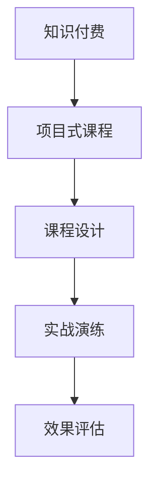

                 

# 程序员知识付费：打造项目式课程

在快速发展的科技行业中，知识付费成为一种重要的趋势，为程序员提供了高效获取知识和技能的新途径。项目式课程，特别是以实际项目为导向的课程，因其目标明确、实战性强而受到广泛欢迎。本文将详细探讨如何打造高效的项目式课程，帮助程序员系统地掌握新技能，提升实战能力。

## 1. 背景介绍

随着互联网技术的飞速发展和应用领域的不断拓展，程序员的知识更新速度日益加快，仅仅通过传统的书籍和网络课程已无法满足快速变化的技术需求。知识付费的兴起，为程序员提供了一种更为系统、更有针对性的学习方式。

项目式课程作为知识付费的一种形式，以实际项目为载体，通过具体问题驱动学习，帮助学员在实践中掌握新技能。与传统课程相比，项目式课程具有以下优势：

- **目标明确**：每个项目都有明确的学习目标，学员能清晰了解所需掌握的技能和知识点。
- **实战性强**：课程内容紧密结合实际应用场景，学员能通过完成项目直接提升实战能力。
- **效果显著**：通过系统化的实践和项目，学员能快速形成解决问题的思维模式和方法，增强解决问题的能力。

## 2. 核心概念与联系

在打造项目式课程时，需要深刻理解以下几个核心概念及其相互联系：

- **知识付费**：指的是将知识和技能通过付费的方式传递给学员，帮助他们快速提升职业技能。知识付费的载体可以是课程、书籍、博客等形式。
- **项目式课程**：是一种以实际项目为载体的课程，学员通过完成项目，学习到新技能和知识，提升实战能力。
- **课程设计**：包括课程目标设定、内容编排、任务分配等环节，是实现项目式课程的关键。
- **实战演练**：通过模拟真实项目环境，让学员在实际操作中应用所学知识，提升解决问题的能力。
- **效果评估**：通过项目成果的评估，帮助学员了解自身技能掌握情况，及时调整学习策略。

这些概念之间的联系如下：



## 3. 核心算法原理 & 具体操作步骤

### 3.1 算法原理概述

项目式课程的核心算法原理是：通过模拟实际项目环境，将复杂技能拆解为一系列小任务，逐一解决，最终形成完整的项目成果。该过程可以理解为一种将大问题拆解为小问题的算法，通过迭代求解逐步逼近最优解。

### 3.2 算法步骤详解

**Step 1: 项目选题**
- 确定课程目标，选择与目标技能相关且具有实际应用价值的项目。
- 项目应具有挑战性，但也不能过于复杂，应适中。

**Step 2: 需求分析和任务分解**
- 对项目进行需求分析，确定项目的关键功能和特性。
- 将项目任务分解为一系列可执行的小任务，每个小任务对应一个或多个知识点。

**Step 3: 知识讲解和技能训练**
- 根据任务需求，讲解相关知识点，并进行必要的技能训练。
- 讲解应结合实际案例，增强理解。

**Step 4: 实战演练和项目实施**
- 学员通过实践完成任务，实现项目的各个功能。
- 鼓励学员自由发挥，解决项目中遇到的问题。

**Step 5: 效果评估和反馈**
- 对项目成果进行评估，检查学员是否掌握相关技能。
- 根据评估结果，给出改进建议，帮助学员提升。

### 3.3 算法优缺点

**优点**：
- **目标明确**：项目式课程的学习目标清晰，学员能明确自己需要掌握的技能。
- **实战性强**：通过实际项目的实践，学员能快速提升实战能力。
- **效果显著**：系统化的学习和实战演练，能显著提升学员的技能水平。

**缺点**：
- **时间成本高**：项目式课程需要较多的时间和精力，对学员的要求较高。
- **资源需求大**：需要较多的技术资料、项目环境等资源。
- **难度不一**：项目难度不一，部分项目可能超出学员当前水平。

### 3.4 算法应用领域

项目式课程不仅适用于传统的编程技术培训，还广泛应用于数据分析、人工智能、系统架构等各个领域。无论是新入行的初学者，还是进阶的开发者，都能从项目式课程中受益。

## 4. 数学模型和公式 & 详细讲解 & 举例说明

### 4.1 数学模型构建

以项目式课程为例，假设课程目标为开发一个在线商城系统，需求如下：
- 用户注册登录
- 商品展示与搜索
- 购物车功能
- 下单与支付

构建数学模型的步骤如下：

**Step 1: 定义变量**
- 用户注册登录模块：$R$（注册），$L$（登录）
- 商品展示与搜索模块：$S$（展示），$T$（搜索）
- 购物车功能模块：$C$（加入购物车），$R$（移除购物车）
- 下单与支付模块：$O$（下单），$P$（支付）

**Step 2: 建立方程**
- 用户注册登录模块：$R \to L$
- 商品展示与搜索模块：$S \to T$
- 购物车功能模块：$C \to R$
- 下单与支付模块：$O \to P$

**Step 3: 求解方程**
- 实现每个模块的子任务，通过迭代求解，最终完成整个项目。

### 4.2 公式推导过程

以在线商城的订单模块为例，其数学模型如下：

$$
\begin{aligned}
O &= R + S + C + P \\
P &= O \cap R \\
R &= P + C
\end{aligned}
$$

其中，$O$ 表示订单模块，$R$ 表示注册模块，$S$ 表示展示模块，$C$ 表示购物车模块，$P$ 表示支付模块。

通过上述公式，可以计算出不同模块之间的依赖关系，实现项目各个功能的逻辑连接。

### 4.3 案例分析与讲解

以开发一个博客系统为例，项目式课程的步骤如下：

1. **项目选题**：开发一个博客系统，包括文章管理、用户管理、评论管理等功能。
2. **需求分析和任务分解**：
   - 文章管理模块：用户创建、编辑、删除文章。
   - 用户管理模块：用户注册、登录、修改个人资料。
   - 评论管理模块：用户发表、编辑、删除评论。
3. **知识讲解和技能训练**：
   - 讲解前端开发技术（HTML、CSS、JavaScript）。
   - 讲解后端开发技术（Python、Flask、SQLAlchemy）。
   - 讲解数据库设计（MySQL、SQLite）。
4. **实战演练和项目实施**：
   - 实现文章管理模块。
   - 实现用户管理模块。
   - 实现评论管理模块。
5. **效果评估和反馈**：
   - 通过代码审查和项目评审，评估学员项目成果。
   - 根据评估结果，提供改进建议，帮助学员提升技能。

## 5. 项目实践：代码实例和详细解释说明

### 5.1 开发环境搭建

在搭建开发环境时，需要考虑以下几个方面：

- **编程语言和框架**：选择适合的编程语言和框架，如Python、Flask等。
- **开发工具和编辑器**：安装Visual Studio Code、PyCharm等开发工具，提高开发效率。
- **数据库系统**：选择MySQL、PostgreSQL等关系型数据库，或MongoDB等非关系型数据库。
- **版本控制工具**：使用Git等版本控制工具，管理项目代码。

### 5.2 源代码详细实现

以开发一个简单的博客系统为例，主要涉及以下几个步骤：

1. **用户管理模块**：
   - 用户注册页面：创建用户注册表单，收集用户信息，存储到数据库中。
   - 用户登录页面：验证用户输入的用户名和密码，登录成功后生成用户会话。

2. **文章管理模块**：
   - 文章列表页面：从数据库中查询所有文章，并展示在页面上。
   - 文章详情页面：展示单个文章的信息，并允许用户进行编辑、删除等操作。

3. **评论管理模块**：
   - 文章评论页面：允许用户发表、编辑、删除评论。
   - 评论列表页面：展示所有文章的评论，并允许用户进行点赞、回复等操作。

### 5.3 代码解读与分析

**用户管理模块**：

```python
# 用户注册页面
def register(request):
    if request.method == 'POST':
        # 收集用户信息
        username = request.form['username']
        password = request.form['password']
        
        # 存储到数据库
        db.users.insert_one({'username': username, 'password': password})
        
        # 生成用户会话
        session['username'] = username
        
        # 跳转到登录页面
        return redirect('/login')
    
# 用户登录页面
def login(request):
    if request.method == 'POST':
        # 验证用户输入
        username = request.form['username']
        password = request.form['password']
        
        # 查询数据库
        user = db.users.find_one({'username': username, 'password': password})
        
        # 生成用户会话
        session['username'] = username
        
        # 跳转到首页
        return redirect('/')
```

**文章管理模块**：

```python
# 文章列表页面
def index(request):
    # 查询所有文章
    articles = db.articles.find()
    
    # 展示文章列表
    return render_template('index.html', articles=articles)
    
# 文章详情页面
def article(request, article_id):
    # 查询文章
    article = db.articles.find_one({'_id': article_id})
    
    # 展示文章详情
    return render_template('article.html', article=article)
    
# 文章编辑页面
def edit(request, article_id):
    # 查询文章
    article = db.articles.find_one({'_id': article_id})
    
    # 展示文章编辑表单
    return render_template('edit.html', article=article)
    
# 文章删除页面
def delete(request, article_id):
    # 删除文章
    db.articles.remove({'_id': article_id})
    
    # 跳转到文章列表页面
    return redirect('/')
```

**评论管理模块**：

```python
# 文章评论页面
def comment(request, article_id):
    # 查询文章
    article = db.articles.find_one({'_id': article_id})
    
    # 展示评论表单
    return render_template('comment.html', article=article)
    
# 评论列表页面
def comments(request, article_id):
    # 查询文章的所有评论
    comments = db.comments.find({'article_id': article_id})
    
    # 展示评论列表
    return render_template('comments.html', comments=comments)
```

### 5.4 运行结果展示

完成博客系统的开发后，可以在本地搭建Web服务器进行测试。以下是一个简单的测试流程：

1. 启动Web服务器，访问`http://localhost:5000`。
2. 进入用户管理页面，进行用户注册和登录。
3. 进入文章管理页面，创建、编辑、删除文章。
4. 进入评论管理页面，发表、编辑、删除评论。

通过上述测试流程，学员可以全面了解和掌握博客系统的开发流程和关键技术点。

## 6. 实际应用场景

### 6.1 企业内部培训

项目式课程在企业内部培训中具有广泛的应用。通过项目式课程，企业可以为员工提供系统的技能培训，提升团队整体的技术水平。

例如，某软件开发公司希望提升员工的Web开发能力，可以设计一个包含Web开发全栈技术的项目式课程。学员通过完成一系列项目，系统地掌握前端开发、后端开发、数据库管理等技能，从而实现团队整体能力的提升。

### 6.2 在线教育平台

在线教育平台如Coursera、Udemy等，也广泛应用项目式课程，帮助学员系统地掌握新技能。例如，某在线教育平台推出一个“Python全栈开发”课程，通过完成多个实战项目，帮助学员掌握Python全栈开发技术，提升实战能力。

### 6.3 技术社区

技术社区如GitHub、Stack Overflow等，可以组织项目式课程，吸引技术爱好者参与。例如，某技术社区组织一个“机器学习实战”项目式课程，学员通过完成多个机器学习项目，提升在实际场景中应用机器学习技术的能力。

## 7. 工具和资源推荐

### 7.1 学习资源推荐

1. **《Python编程：从入门到实践》**：一本经典的Python入门书籍，详细介绍了Python编程的基础知识和实战技巧。
2. **Coursera《机器学习》课程**：由斯坦福大学Andrew Ng教授主讲的机器学习课程，系统讲解了机器学习的基本概念和算法。
3. **GitHub学习路线**：GitHub提供的系统学习路线，涵盖Web开发、机器学习、数据科学等多个领域。
4. **《JavaScript高级程序设计》**：一本经典的JavaScript学习书籍，详细讲解了JavaScript的核心语法和高级应用。
5. **《Flask Web开发》**：一本介绍Flask框架的书籍，系统讲解了Flask的开发方法和实战案例。

### 7.2 开发工具推荐

1. **Visual Studio Code**：一个轻量级、功能强大的编辑器，支持Python、JavaScript等多种编程语言。
2. **PyCharm**：一个专业的Python IDE，提供了丰富的开发工具和调试功能。
3. **MySQL Workbench**：一个直观的MySQL数据库管理工具，方便进行数据库设计和开发。
4. **Git**：一个版本控制工具，方便管理代码和协作开发。
5. **Docker**：一个容器化平台，方便部署和管理应用。

### 7.3 相关论文推荐

1. **《项目式学习与软件开发》**：探讨了项目式学习在软件开发中的应用，提供了系统的项目式课程设计方法。
2. **《Web开发的模型驱动设计》**：介绍了一种基于模型驱动的设计方法，帮助开发者快速构建Web应用。
3. **《机器学习实战》**：提供了一系列机器学习项目的实战案例，帮助学员掌握机器学习技术。
4. **《深度学习与人工智能》**：探讨了深度学习在人工智能中的应用，提供了深度学习模型的设计方法。
5. **《软件开发生命周期》**：介绍了软件开发生命周期的基本概念和方法，帮助开发者进行系统化的软件开发。

## 8. 总结：未来发展趋势与挑战

### 8.1 总结

本文详细探讨了如何打造高效的项目式课程，帮助程序员系统地掌握新技能，提升实战能力。通过系统的课程设计、实战演练和效果评估，项目式课程能为程序员提供明确的培训目标，提升实战能力，满足实际应用需求。

### 8.2 未来发展趋势

1. **技术栈多样化**：未来的项目式课程将涵盖更多技术栈，如Web开发、人工智能、大数据等。
2. **数据驱动**：未来的项目式课程将更加注重数据驱动的开发方法，帮助学员提升数据处理和分析能力。
3. **个性化学习**：未来的项目式课程将注重个性化学习，根据学员的实际需求和能力进行定制化培训。
4. **跨领域融合**：未来的项目式课程将更多地融合不同领域的技术和方法，提升学员的跨领域应用能力。

### 8.3 面临的挑战

尽管项目式课程具有诸多优点，但也面临一些挑战：

1. **时间和资源成本高**：项目式课程需要较多的时间和资源，对学员的要求较高。
2. **项目难度不一**：不同学员的编程水平和实际经验差异较大，难以设计统一的难度标准。
3. **效果评估难度大**：项目式课程的效果评估需要考虑多个维度的指标，难以进行统一的评价。
4. **课程设计复杂**：项目式课程的设计需要考虑多个环节，如需求分析、任务分解、实战演练等，较为复杂。

### 8.4 研究展望

未来的项目式课程研究将集中在以下几个方面：

1. **自适应学习**：根据学员的实际情况，自动调整学习内容和难度，提供个性化的培训方案。
2. **在线协作**：利用在线协作工具，如GitHub、Slack等，帮助学员进行协作开发，提升团队合作能力。
3. **知识图谱**：引入知识图谱技术，帮助学员更好地理解和掌握项目中的知识点。
4. **自动化评估**：利用自动化工具，如代码质量检测工具、测试框架等，提升项目式课程的效果评估效率。

## 9. 附录：常见问题与解答

### Q1: 如何选择合适的项目进行课程设计？

A: 选择合适的项目是课程设计的关键。应根据学员的需求和目标，选择具有实际应用价值的项目，确保项目的难度适中。

### Q2: 如何设计合理的任务分解？

A: 任务分解应细化到具体的可执行小任务，每个小任务对应一个或多个知识点。任务应具有明确的目标和步骤，方便学员理解和掌握。

### Q3: 如何评估学员的项目成果？

A: 项目评估应从多个维度进行，如代码质量、功能实现、用户体验等。可以采用代码审查、项目评审等方式，综合评估学员的成果。

### Q4: 如何提高课程的实战性？

A: 应尽可能模拟真实的项目环境，提供真实的项目需求和数据。可以通过开放课程，让学员自由发挥，解决项目中的实际问题。

### Q5: 如何提高课程的效果？

A: 应根据学员的实际需求和反馈，不断优化课程设计和内容。可以引入专家讲座、案例分析等形式，提升课程的深度和广度。

---

作者：禅与计算机程序设计艺术 / Zen and the Art of Computer Programming

