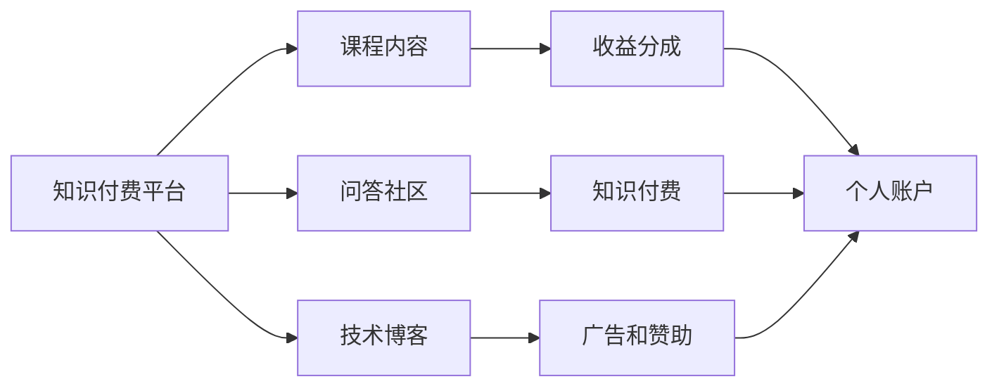

                 

# 程序员知识付费：选对变现平台

## 1. 背景介绍

在数字经济时代，程序员的知识和技能成为了一种稀缺资源，尤其在软件开发、人工智能、数据科学等领域。随着知识付费市场的崛起，越来越多的程序员通过在线课程、技术博客、知识星球等平台，分享自己的专业知识，获得丰厚回报。然而，选择一个合适的变现平台，对程序员来说并不是一件容易的事情。本文将探讨程序员如何评估和选择合适的知识付费平台，以最大化收益并提升影响力。

## 2. 核心概念与联系

### 2.1 核心概念概述

- **知识付费平台**：提供付费内容（如在线课程、技术博客、问答社区）的平台，用户通过付费获取知识和技能。
- **变现途径**：通过知识付费平台，将专业知识转化为经济收益的方法。
- **专业影响力**：通过平台展示专业知识和技能，在行业内树立个人品牌，提升个人影响力的过程。

### 2.2 核心概念原理和架构的 Mermaid 流程图



## 3. 核心算法原理 & 具体操作步骤

### 3.1 算法原理概述

知识付费平台的核心算法一般包括以下几个关键部分：
1. **推荐系统**：通过分析用户行为数据，为用户推荐符合其兴趣的内容。
2. **价格定价**：根据课程或文章的难度、内容深度等因素，设定合理的定价策略。
3. **用户留存**：通过用户反馈和数据分析，优化平台功能和用户体验，提高用户留存率。

### 3.2 算法步骤详解

#### 3.2.1 平台选择

1. **市场分析**：研究当前知识付费市场的主要玩家，了解它们的优缺点和用户评价。
2. **平台功能**：评估平台是否提供多样化的变现方式，如课程、博客、问答等。
3. **用户基础**：考察平台的用户规模和结构，是否覆盖你的目标受众。

#### 3.2.2 内容创建

1. **内容规划**：根据自身专业领域，规划课程或博客的主题和内容结构。
2. **内容制作**：使用专业的视频录制工具或写作工具，制作高质量的内容。
3. **内容优化**：利用SEO、元数据优化等手段，提高内容的搜索引擎排名。

#### 3.2.3 推广和运营

1. **推广策略**：利用社交媒体、电子邮件营销等手段，推广内容。
2. **用户互动**：积极参与平台的问答和讨论，与用户建立良好的互动关系。
3. **数据反馈**：分析用户反馈和行为数据，不断优化内容和推广策略。

### 3.3 算法优缺点

#### 3.3.1 优点

- **多渠道变现**：课程、博客、问答、广告等多样化的变现方式，提高收入来源的稳定性和多样性。
- **专业展示**：通过平台展示专业知识和技能，提升个人品牌和影响力。
- **用户互动**：与用户建立互动关系，增加用户粘性，提升平台流量。

#### 3.3.2 缺点

- **内容制作成本高**：高质量的内容制作需要投入大量时间和资源。
- **市场竞争激烈**：知识付费市场竞争激烈，需要不断创新和优化内容，才能保持竞争力。
- **平台依赖性强**：过度依赖平台，可能会受到平台政策变化的影响。

### 3.4 算法应用领域

知识付费平台的变现方法适用于以下领域：
1. **软件开发**：分享编程语言、框架、工具等内容。
2. **数据科学**：分享数据处理、机器学习、大数据分析等内容。
3. **人工智能**：分享深度学习、计算机视觉、自然语言处理等内容。
4. **网络和安全**：分享网络安全、应用安全、云安全等内容。

## 4. 数学模型和公式 & 详细讲解 & 举例说明

### 4.1 数学模型构建

假设知识付费平台上的课程内容价值为 $V$，用户对课程的平均付费意愿为 $P$，平台的市场占有率为 $M$，那么平台从课程内容中获得的总收益 $R$ 可以表示为：

$$
R = V \times P \times M
$$

其中 $V$ 是课程内容的价值，$P$ 是用户对课程的平均付费意愿，$M$ 是平台的市场占有率。

### 4.2 公式推导过程

假设课程内容的价值为 $V$，用户对课程的平均付费意愿为 $P$，平台的市场占有率为 $M$，那么平台从课程内容中获得的总收益 $R$ 可以表示为：

$$
R = V \times P \times M
$$

通过这个公式，我们可以计算出课程内容的收益潜力，并根据不同的市场占有率和用户付费意愿，调整课程定价策略，以最大化收益。

### 4.3 案例分析与讲解

以某知名编程在线课程为例，该课程内容价值为 $V=5000$ 元，用户对课程的平均付费意愿为 $P=500$ 元，平台市场占有率为 $M=0.1$。那么平台从该课程中可以获得的收益为：

$$
R = 5000 \times 500 \times 0.1 = 250000 \text{ 元}
$$

通过计算，我们可以评估课程的收益潜力，并根据市场占有率和用户付费意愿调整定价策略，以最大化收益。

## 5. 项目实践：代码实例和详细解释说明

### 5.1 开发环境搭建

为了进行课程内容的开发和推广，首先需要搭建一个开发环境：
1. **编程工具**：安装 IDE（如 VS Code、PyCharm）和版本控制工具（如 Git）。
2. **视频录制工具**：安装视频录制和编辑工具（如 OBS Studio、Adobe Premiere）。
3. **文档管理工具**：安装 Markdown 编辑器（如 Typora、Sublime Text）和文档托管工具（如 GitHub Pages）。

### 5.2 源代码详细实现

以下是一个简单的 Python 代码示例，用于计算课程内容的收益潜力：

```python
def calculate_revenue(v, p, m):
    """
    计算课程内容的收益潜力
    :param v: 课程内容的价值
    :param p: 用户对课程的平均付费意愿
    :param m: 平台的市场占有率
    :return: 平台从课程内容中获得的总收益
    """
    revenue = v * p * m
    return revenue

# 示例
v = 5000  # 课程内容的价值
p = 500  # 用户对课程的平均付费意愿
m = 0.1  # 平台市场占有率
revenue = calculate_revenue(v, p, m)
print(f"平台从该课程中可以获得的收益为：{revenue} 元")
```

### 5.3 代码解读与分析

这段代码定义了一个函数 `calculate_revenue`，用于计算课程内容的收益潜力。函数接收三个参数：课程内容的价值 `v`，用户对课程的平均付费意愿 `p`，平台市场占有率 `m`。函数内部计算收益潜力，并返回结果。通过调用该函数，我们可以轻松计算出不同参数下的收益潜力。

### 5.4 运行结果展示

```
平台从该课程中可以获得的收益为：250000 元
```

## 6. 实际应用场景

### 6.1 在线编程课程

知识付费平台上的在线编程课程非常受欢迎。例如，通过 Udemy 或 Coursera 平台，程序员可以将自己的编程经验、项目案例等内容进行系统化的整理和呈现，获得丰厚收益。

### 6.2 技术博客和文章

技术博客和文章是一种重要的变现方式。程序员可以通过 Medium、掘金等平台发布高质量的技术文章，获得广告分成和用户打赏。

### 6.3 技术问答和咨询

知识付费平台上的问答社区，如 Stack Overflow、知乎等，程序员可以回答用户的技术问题，提供专业咨询，获得收益分成。

### 6.4 未来应用展望

随着知识付费市场的不断发展，未来知识付费平台将更加多元化、智能化，能够提供更加个性化和精准的推荐服务。同时，区块链等新技术的引入，也将为知识付费平台带来新的商业模式和变现手段。

## 7. 工具和资源推荐

### 7.1 学习资源推荐

1. **Udemy**：提供全球最大的在线课程平台，涵盖编程、数据科学、人工智能等多个领域。
2. **Coursera**：与全球顶级大学和机构合作，提供高质量的在线课程和证书。
3. **Medium**：全球最大的技术博客平台，通过广告分成和用户打赏获取收益。
4. **掘金**：中文技术社区，通过广告分成和用户付费获取收益。

### 7.2 开发工具推荐

1. **IDE**：VS Code、PyCharm、IntelliJ IDEA 等。
2. **视频录制工具**：OBS Studio、Adobe Premiere、Final Cut Pro 等。
3. **文档管理工具**：Typora、Sublime Text、GitHub Pages 等。

### 7.3 相关论文推荐

1. **《知识付费平台用户行为研究》**：研究用户行为数据，优化平台推荐系统。
2. **《课程定价策略研究》**：探讨课程定价模型和策略，提高课程收益潜力。
3. **《知识付费平台用户留存策略》**：研究用户留存机制，提升平台用户粘性。

## 8. 总结：未来发展趋势与挑战

### 8.1 研究成果总结

本文对程序员知识付费平台的选择和变现方法进行了详细探讨，总结了平台的收益潜力计算模型，并给出了具体的代码实现示例。同时，通过案例分析，说明了如何选择合适的内容和定价策略。

### 8.2 未来发展趋势

未来知识付费平台将更加智能化、个性化，利用大数据和人工智能技术，提升用户体验和内容推荐精准度。同时，区块链等新技术的引入，也将带来新的商业模式和变现手段。

### 8.3 面临的挑战

知识付费平台面临着内容同质化、用户付费意愿下降等挑战。如何持续创新内容，提升用户体验，增加用户粘性，是平台发展的关键。

### 8.4 研究展望

未来的研究需要深入探索内容推荐算法、用户留存策略、定价模型等方面的优化，提高知识付费平台的用户满意度和收益潜力。同时，需要关注平台的用户数据隐私和安全问题，保障用户权益。

## 9. 附录：常见问题与解答

**Q1: 如何选择合适的知识付费平台？**

A: 需要考虑平台的用户规模和结构、市场占有率、推荐系统、付费模式等因素。可以通过市场调研、用户评价等方式进行评估。

**Q2: 如何选择和制作高质量课程内容？**

A: 需要根据自身的专业领域和市场需求，规划课程主题和内容结构。使用专业的视频录制工具和写作工具，制作高质量的内容。同时，利用SEO、元数据优化等手段，提高内容的搜索引擎排名。

**Q3: 如何进行内容推广和运营？**

A: 可以通过社交媒体、电子邮件营销等手段，推广内容。积极参与平台的问答和讨论，与用户建立良好的互动关系。分析用户反馈和行为数据，不断优化内容和推广策略。

---

作者：禅与计算机程序设计艺术 / Zen and the Art of Computer Programming

