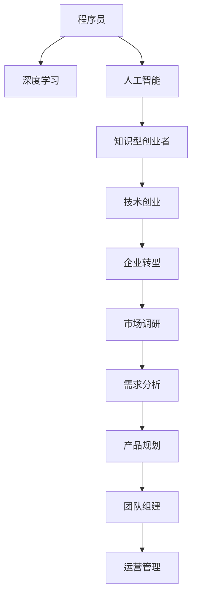

                 

# 程序员转型知识型创业者的成功案例

> 关键词：程序员转型,知识型创业,人工智能,深度学习,技术创业,企业转型,技术管理

## 1. 背景介绍

### 1.1 问题由来
随着人工智能技术的快速发展，越来越多的人开始思考如何将自身的编程技术转化为具有更高价值的工作形态。程序员转型为知识型创业者，成为了一种趋势。这一转变不仅意味着职业角色的转变，更意味着从单纯的代码编写者向行业应用和解决方案的提供者转变。本文将深入探讨程序员如何转型成为知识型创业者，并分享一些成功案例，以期为有意转型的人士提供参考和启发。

### 1.2 问题核心关键点
程序员转型为知识型创业者的关键点主要包括：

- **技术深度与广度**：不仅需要精通某一项核心技术，还需对多个相关领域有较深的理解。
- **市场调研与需求分析**：了解市场需求和客户痛点，找到技术可以解决的具体问题。
- **产品规划与商业模式**：设计符合市场需求的产品，并确定盈利模式。
- **团队组建与运营管理**：组建一支具备多样技能和高效协作的团队，并有效管理项目和运营。

### 1.3 问题研究意义
本文旨在通过案例分析，深入探讨程序员转型为知识型创业者的成功经验和方法，帮助有志于转型的人士更好地规划职业路径，提升技术应用能力和市场竞争力，最终实现自我价值和社会价值的双赢。

## 2. 核心概念与联系

### 2.1 核心概念概述

为更好地理解程序员转型为知识型创业者的过程，本节将介绍几个关键概念：

- **程序员**：通过编程实现软件开发的工程师。
- **知识型创业者**：以专业知识和技术为核心的创业者，通过创新思维和解决方案创造价值。
- **人工智能**：模拟人类智能行为的技术，如深度学习、机器学习等。
- **深度学习**：一种通过多层神经网络进行模式识别的技术，广泛应用于图像识别、自然语言处理等领域。
- **技术创业**：利用先进技术解决实际问题，创造商业价值的过程。
- **企业转型**：公司根据市场需求和环境变化，调整业务模式和技术架构以提升竞争力的过程。

这些概念之间的逻辑关系可以通过以下Mermaid流程图来展示：



这个流程图展示了一些关键概念之间的逻辑关系：

1. 程序员通过学习深度学习等人工智能技术，增强自身技术实力。
2. 掌握了深度学习等技术后，程序员可以转型为知识型创业者，利用技术解决实际问题。
3. 知识型创业者在技术创业过程中，需要了解市场调研、需求分析、产品规划等商业知识。
4. 创业成功需要组建高效团队，并进行科学运营管理。
5. 企业转型是企业在成长过程中根据市场需求和环境变化进行的战略调整。

这些概念共同构成了程序员转型为知识型创业者的基础框架，帮助理解转型过程中的关键环节。

## 3. 核心算法原理 & 具体操作步骤
### 3.1 算法原理概述

程序员转型为知识型创业者的过程，本质上是一个从技术技能到商业模式创新的过程。在这一过程中，深度学习等人工智能技术起着关键作用。其核心思想是：利用深度学习技术解决特定领域的问题，并将技术转化为商业价值。

形式化地，假设程序员掌握的深度学习技术为 $L$，该技术应用于某一特定领域 $D$，则转型的过程可以表示为：

$$
\text{创业} = f(L, D) = \text{解决方案} + \text{商业模式} + \text{市场需求}
$$

其中，$\text{解决方案}$ 指通过深度学习技术解决特定领域问题的技术方案，$\text{商业模式}$ 指将技术方案转化为商业运营的盈利模式，$\text{市场需求}$ 指通过市场调研和需求分析找到目标用户。

### 3.2 算法步骤详解

程序员转型为知识型创业者的操作步骤一般包括以下几个关键步骤：

**Step 1: 深度学习技能提升**
- 通过在线课程、书籍、论文等途径，深入学习深度学习、计算机视觉、自然语言处理等领域的知识，提升自身技术实力。
- 参加相关技术会议、讲座、研讨会，了解前沿技术和应用案例。

**Step 2: 市场调研与需求分析**
- 收集目标领域的市场信息，了解行业现状和未来发展趋势。
- 进行客户调研，了解用户需求和痛点，找到技术可以解决的具体问题。

**Step 3: 产品规划与技术方案设计**
- 结合市场调研和需求分析结果，设计符合市场需求的技术解决方案。
- 选择合适的算法模型和工具，进行实验验证和优化。

**Step 4: 团队组建与运营管理**
- 组建一支具备多种技能和高效协作的团队，包括但不限于数据科学家、算法工程师、产品经理、市场营销人员等。
- 制定明确的业务计划和运营目标，建立科学的管理体系。

**Step 5: 商业化落地**
- 根据产品设计和技术方案，进行产品开发和测试。
- 选择适合的市场推广策略，逐步扩大用户基础和市场份额。

### 3.3 算法优缺点

程序员转型为知识型创业者的过程具有以下优点：

1. **技术优势**：具备扎实的编程和算法基础，可以快速将技术应用于实际问题解决。
2. **创新能力**：通过深度学习等技术，实现突破传统模式的新解决方案。
3. **市场潜力**：深度学习等技术在多个领域具有广泛应用，市场前景广阔。
4. **品牌效应**：利用自身技术积累和品牌效应，快速吸引客户和投资者关注。

同时，这一过程也存在以下局限性：

1. **高风险性**：技术转化为商业产品面临诸多不确定性，风险较高。
2. **资源需求**：需要投入大量时间、资金和人力进行产品开发和市场推广。
3. **市场认知**：技术创业往往需要时间积累，市场认知度较低。
4. **团队管理**：需要具备较强的团队管理和运营能力，挑战较大。

尽管存在这些局限性，但就目前而言，通过深度学习等技术创业，成为了一种被广泛认可和追求的职业转型方向。未来相关研究的重点在于如何进一步降低创业风险，提高成功率，同时兼顾可解释性和伦理安全性等因素。

### 3.4 算法应用领域

基于深度学习的技术创业方法，在多个领域已经得到了广泛的应用，例如：

- **医疗健康**：利用深度学习进行医学影像分析、疾病预测、个性化治疗方案推荐等。
- **金融科技**：应用于风险评估、信用评分、欺诈检测、智能投顾等。
- **智能制造**：利用深度学习进行工业质量检测、预测性维护、智能制造优化等。
- **农业科技**：用于作物病虫害识别、农业智能监测、精准农业等领域。
- **教育科技**：应用于智能辅导、学习路径规划、个性化推荐等。

除了上述这些经典应用外，深度学习还被创新性地应用于更多领域，如能源管理、城市治理、环境保护等，为各行各业带来了新的突破。随着深度学习技术的不断发展，相信在未来更多领域，基于深度学习的技术创业将发挥更大的作用。

## 4. 数学模型和公式 & 详细讲解
### 4.1 数学模型构建

本节将使用数学语言对深度学习在技术创业中的应用进行更加严格的刻画。

假设程序员掌握的深度学习技术为 $L$，应用于某一特定领域 $D$，记目标任务为 $T$。构建深度学习模型的目标是最小化损失函数 $L_{D,T}(\theta)$，其中 $\theta$ 为模型参数。

模型 $M_{\theta}$ 在输入 $x$ 上的预测输出为 $\hat{y}$，则损失函数可以表示为：

$$
L_{D,T}(\theta) = \frac{1}{N}\sum_{i=1}^N \ell(M_{\theta}(x_i), y_i)
$$

其中 $\ell$ 为损失函数，用于衡量模型预测输出与真实标签之间的差异。常见的损失函数包括交叉熵损失、均方误差损失等。

### 4.2 公式推导过程

以下我们以二分类任务为例，推导交叉熵损失函数及其梯度的计算公式。

假设模型 $M_{\theta}$ 在输入 $x$ 上的输出为 $\hat{y}=M_{\theta}(x) \in [0,1]$，表示样本属于正类的概率。真实标签 $y \in \{0,1\}$。则二分类交叉熵损失函数定义为：

$$
\ell(M_{\theta}(x),y) = -[y\log \hat{y} + (1-y)\log (1-\hat{y})]
$$

将其代入经验风险公式，得：

$$
L_{D,T}(\theta) = -\frac{1}{N}\sum_{i=1}^N [y_i\log M_{\theta}(x_i)+(1-y_i)\log(1-M_{\theta}(x_i))]
$$

根据链式法则，损失函数对参数 $\theta_k$ 的梯度为：

$$
\frac{\partial L_{D,T}(\theta)}{\partial \theta_k} = -\frac{1}{N}\sum_{i=1}^N (\frac{y_i}{M_{\theta}(x_i)}-\frac{1-y_i}{1-M_{\theta}(x_i)}) \frac{\partial M_{\theta}(x_i)}{\partial \theta_k}
$$

其中 $\frac{\partial M_{\theta}(x_i)}{\partial \theta_k}$ 可进一步递归展开，利用自动微分技术完成计算。

在得到损失函数的梯度后，即可带入参数更新公式，完成模型的迭代优化。重复上述过程直至收敛，最终得到适应特定领域任务的最优模型参数 $\theta^*$。

## 5. 项目实践：代码实例和详细解释说明
### 5.1 开发环境搭建

在进行技术创业项目实践前，我们需要准备好开发环境。以下是使用Python进行TensorFlow开发的环境配置流程：

1. 安装Anaconda：从官网下载并安装Anaconda，用于创建独立的Python环境。

2. 创建并激活虚拟环境：
```bash
conda create -n tf-env python=3.8 
conda activate tf-env
```

3. 安装TensorFlow：根据CUDA版本，从官网获取对应的安装命令。例如：
```bash
conda install tensorflow=2.8 
```

4. 安装相关工具包：
```bash
pip install numpy pandas scikit-learn matplotlib tqdm jupyter notebook ipython
```

完成上述步骤后，即可在`tf-env`环境中开始技术创业项目实践。

### 5.2 源代码详细实现

这里我们以医疗影像分析为例，给出使用TensorFlow进行技术创业项目的PyTorch代码实现。

首先，定义医疗影像数据处理函数：

```python
import tensorflow as tf
from tensorflow.keras.preprocessing.image import ImageDataGenerator

def preprocess_images(train_path, val_path, test_path, batch_size):
    train_datagen = ImageDataGenerator(rescale=1./255)
    val_datagen = ImageDataGenerator(rescale=1./255)
    test_datagen = ImageDataGenerator(rescale=1./255)

    train_generator = train_datagen.flow_from_directory(
        train_path, target_size=(224, 224), batch_size=batch_size, class_mode='binary')
    val_generator = val_datagen.flow_from_directory(
        val_path, target_size=(224, 224), batch_size=batch_size, class_mode='binary')
    test_generator = test_datagen.flow_from_directory(
        test_path, target_size=(224, 224), batch_size=batch_size, class_mode='binary')

    return train_generator, val_generator, test_generator
```

然后，定义模型和优化器：

```python
from tensorflow.keras.applications import MobileNetV2
from tensorflow.keras.layers import Input, GlobalAveragePooling2D, Dense
from tensorflow.keras.models import Model

base_model = MobileNetV2(weights='imagenet', include_top=False, input_tensor=Input(shape=(224, 224, 3)))
x = base_model.output
x = GlobalAveragePooling2D()(x)
x = Dense(1, activation='sigmoid')(x)
model = Model(inputs=base_model.input, outputs=x)

model.compile(optimizer='adam', loss='binary_crossentropy', metrics=['accuracy'])
```

接着，定义训练和评估函数：

```python
def train_epoch(model, train_generator, val_generator, epochs):
    model.fit_generator(train_generator, epochs=epochs, validation_data=val_generator, callbacks=[tf.keras.callbacks.EarlyStopping(patience=5)])
    
def evaluate(model, val_generator, test_generator):
    val_loss, val_acc = model.evaluate_generator(val_generator)
    test_loss, test_acc = model.evaluate_generator(test_generator)
    print(f'Val Loss: {val_loss:.4f}, Val Acc: {val_acc:.4f}, Test Loss: {test_loss:.4f}, Test Acc: {test_acc:.4f}')
```

最后，启动训练流程并在测试集上评估：

```python
epochs = 10
batch_size = 32

train_path = 'data/train/'
val_path = 'data/val/'
test_path = 'data/test/'

train_generator, val_generator, test_generator = preprocess_images(train_path, val_path, test_path, batch_size)

train_epoch(model, train_generator, val_generator, epochs)

evaluate(model, val_generator, test_generator)
```

以上就是使用TensorFlow对医疗影像分类项目进行技术创业实践的完整代码实现。可以看到，借助TensorFlow，我们能够快速搭建深度学习模型，并通过图像分类任务展示了技术创业的基本流程。

### 5.3 代码解读与分析

让我们再详细解读一下关键代码的实现细节：

**preprocess_images函数**：
- 定义数据增强器，对图像进行归一化处理。
- 使用ImageDataGenerator的flow_from_directory方法，加载和预处理图像数据。

**定义模型和优化器**：
- 利用TensorFlow预训练的MobileNetV2模型作为基础网络，通过全局平均池化和全连接层构建分类器。
- 使用Adam优化器和二分类交叉熵损失函数进行模型训练。

**train_epoch和evaluate函数**：
- 使用Model.fit_generator方法进行模型训练，结合EarlyStopping回调机制，防止过拟合。
- 使用Model.evaluate_generator方法评估模型性能，输出训练集和测试集的损失和准确率。

**训练流程**：
- 定义训练轮数和批量大小，加载预处理好的数据集。
- 调用train_epoch函数进行模型训练。
- 调用evaluate函数在测试集上评估模型性能。

可以看到，TensorFlow提供了一站式的深度学习框架，使得技术创业项目的开发和部署变得简洁高效。开发者可以将更多精力放在模型优化和业务扩展上，而不必过多关注底层的实现细节。

当然，工业级的系统实现还需考虑更多因素，如模型的保存和部署、超参数的自动搜索、更灵活的任务适配层等。但核心的技术创业流程基本与此类似。

## 6. 实际应用场景
### 6.1 智能医疗健康

基于深度学习技术的医疗影像分析项目，可以广泛应用于智能医疗健康领域。传统医疗影像诊断依赖经验丰富的医生，成本高、效率低，难以满足大规模、高复杂度的诊断需求。利用深度学习技术，医疗影像分析项目能够快速、准确地识别和分类各类疾病，辅助医生进行诊断和治疗。

在技术实现上，可以收集大量的医疗影像数据，标注好各类疾病的标签，并在这些数据上进行深度学习模型的训练和微调。微调后的模型能够自动分析影像，输出疾病分类结果，辅助医生进行精准诊断。

### 6.2 金融科技应用

深度学习技术在金融科技领域也有广泛应用。通过训练深度学习模型，可以实现信用评分、风险评估、欺诈检测等功能，帮助金融机构提升风险控制能力，优化金融服务。

例如，可以收集用户的交易记录、社交媒体信息等数据，训练深度学习模型进行风险评估。模型能够识别出高风险用户，并及时预警，避免潜在损失。此外，还可以利用深度学习技术进行智能投顾、量化交易等应用，为投资者提供个性化的投资建议，优化投资策略。

### 6.3 智能制造

深度学习技术在智能制造领域也有重要应用。通过训练深度学习模型，可以实现工业质量检测、预测性维护等功能，提高生产效率，降低生产成本。

例如，可以收集车间生产设备的传感器数据，训练深度学习模型进行故障预测。模型能够识别出设备异常，及时维护，避免设备故障对生产线的影响。此外，还可以利用深度学习技术进行生产计划优化、物料管理等应用，提升生产过程的智能化水平。

### 6.4 未来应用展望

随着深度学习技术的不断进步，基于深度学习技术的创业项目将在更多领域得到应用，为传统行业带来变革性影响。

在智慧城市治理中，深度学习技术可以应用于交通流量分析、环境监测、灾害预警等环节，提高城市管理的自动化和智能化水平，构建更安全、高效的未来城市。

在智慧教育领域，利用深度学习技术进行个性化推荐、智能辅导等应用，能够因材施教，促进教育公平，提高教学质量。

在智能交通领域，深度学习技术可以应用于自动驾驶、智能交通管理等应用，提升交通安全和效率。

此外，在农业科技、能源管理、环境保护等多个领域，深度学习技术也将发挥重要作用，为各行各业带来新的突破。相信随着深度学习技术的不断发展，基于深度学习技术的创业项目必将在更广阔的应用领域大放异彩。

## 7. 工具和资源推荐
### 7.1 学习资源推荐

为了帮助开发者系统掌握深度学习在技术创业中的应用，这里推荐一些优质的学习资源：

1. **《深度学习》书籍**：Ian Goodfellow等著，全面介绍了深度学习的理论基础和实际应用，适合技术创业初期的学习。
2. **Coursera《深度学习专项课程》**：由斯坦福大学教授Andrew Ng主讲，系统讲解深度学习的基本概念和经典模型。
3. **Udacity《深度学习纳米学位》**：由Google、Facebook等企业专家授课，实践导向，涵盖深度学习项目开发和应用案例。
4. **Kaggle竞赛平台**：提供大量数据集和挑战任务，适合进行深度学习项目实践和竞赛。
5. **GitHub开源项目**：如TensorFlow官方代码库，包含丰富的深度学习模型和应用案例，适合学习和参考。

通过对这些资源的学习实践，相信你一定能够快速掌握深度学习在技术创业中的应用，并用于解决实际的商业问题。

### 7.2 开发工具推荐

高效的开发离不开优秀的工具支持。以下是几款用于深度学习技术创业开发的常用工具：

1. **TensorFlow**：由Google主导开发的深度学习框架，生产部署方便，适合大规模工程应用。
2. **PyTorch**：Facebook开发的深度学习框架，灵活高效，适合快速迭代研究。
3. **Jupyter Notebook**：支持Python编程，适用于数据处理和模型开发的交互式环境。
4. **GitHub**：全球最大的代码托管平台，便于代码共享和版本控制。
5. **Docker**：容器化技术，方便模型和应用部署，支持分布式环境下的高效协同。
6. **AWS、Google Cloud、阿里云等云平台**：提供强大的计算资源和丰富的服务，支持大规模深度学习项目开发和部署。

合理利用这些工具，可以显著提升深度学习技术创业的开发效率，加快创新迭代的步伐。

### 7.3 相关论文推荐

深度学习技术在技术创业中的应用，源于学界的持续研究。以下是几篇奠基性的相关论文，推荐阅读：

1. **《Deep Residual Learning for Image Recognition》**：提出ResNet模型，用于图像分类任务，刷新了ImageNet数据集上SOTA。
2. **《ImageNet Classification with Deep Convolutional Neural Networks》**：提出卷积神经网络模型，用于大规模图像分类任务，展示了深度学习在图像识别领域的应用潜力。
3. **《Attention is All You Need》**：提出Transformer模型，用于自然语言处理任务，展示了深度学习在语言理解领域的应用潜力。
4. **《GPT-3: Language Models are Unsupervised Multitask Learners》**：展示GPT-3模型，利用大规模预训练和微调技术，实现了多项自然语言处理任务的SOTA。

这些论文代表了大规模深度学习技术的发展脉络。通过学习这些前沿成果，可以帮助研究者把握深度学习技术的发展方向，激发更多的创新灵感。

## 8. 总结：未来发展趋势与挑战
### 8.1 总结

本文对程序员转型为知识型创业者的过程进行了全面系统的介绍。首先阐述了技术创业的基本流程和关键点，明确了深度学习技术在技术创业中的重要地位和作用。其次，从原理到实践，详细讲解了深度学习模型在技术创业中的应用，给出了技术创业项目的完整代码实现。同时，本文还广泛探讨了深度学习技术在医疗健康、金融科技、智能制造等多个领域的应用前景，展示了深度学习技术的巨大潜力。

通过本文的系统梳理，可以看到，深度学习技术在技术创业过程中扮演了重要角色，不仅提高了技术应用的精度和效率，还带来了新的商业价值。未来，伴随深度学习技术的不断进步，基于深度学习技术的创业项目必将在更多领域得到应用，为传统行业带来变革性影响。

### 8.2 未来发展趋势

展望未来，基于深度学习的技术创业将呈现以下几个发展趋势：

1. **技术集成化**：深度学习技术与区块链、物联网、大数据等技术进一步融合，形成多技术集成的新模式。
2. **应用场景多样化**：深度学习技术在智能城市、智慧交通、农业科技等领域的应用将不断拓展，推动各行各业的数字化转型。
3. **产品智能化**：深度学习技术的落地应用将更加注重用户体验和智能化，通过多模态数据融合，实现更自然、更智能的人机交互。
4. **技术标准化**：深度学习技术的应用将逐步形成标准化的流程和框架，提升技术应用的稳定性和可重复性。
5. **数据驱动**：深度学习技术将更多依赖数据进行训练和优化，数据质量和数据量将成为技术创新的关键因素。

这些趋势凸显了深度学习技术在技术创业中的广阔前景。这些方向的探索发展，必将进一步提升深度学习技术创业的精度和效率，推动技术创新和商业应用的双重突破。

### 8.3 面临的挑战

尽管基于深度学习的技术创业已经取得了显著成效，但在迈向更加智能化、普适化应用的过程中，它仍面临诸多挑战：

1. **高成本**：深度学习模型的训练和优化需要大量计算资源，成本较高。如何降低计算成本，提高模型训练效率，将是未来的重要研究方向。
2. **数据隐私**：深度学习模型在处理敏感数据时，隐私和安全问题尤为突出。如何保护数据隐私，防止数据泄露，将是技术创业过程中需要解决的重要问题。
3. **模型解释性**：深度学习模型通常是"黑盒"系统，难以解释其内部工作机制和决策逻辑。如何增强模型的可解释性，提升用户信任度，将是技术创业中需要解决的重要问题。
4. **技术壁垒**：深度学习技术具有较高的技术门槛，团队成员需要具备较强的技术实力。如何培养和吸纳技术人才，将是技术创业过程中需要解决的重要问题。
5. **市场竞争**：深度学习技术在多个领域都有广泛应用，市场竞争激烈。如何提升产品竞争力和市场份额，将是技术创业过程中需要解决的重要问题。

这些挑战凸显了深度学习技术在技术创业中的复杂性和不确定性。唯有不断探索和创新，才能克服这些挑战，推动深度学习技术在技术创业中的可持续发展。

### 8.4 研究展望

面对深度学习技术在技术创业中面临的挑战，未来的研究需要在以下几个方面寻求新的突破：

1. **模型压缩与加速**：开发更加轻量级的深度学习模型，提高计算效率和资源利用率。
2. **模型解释性增强**：引入可解释性技术，增强模型的透明性和可解释性，提升用户信任度。
3. **多技术集成**：探索深度学习与其他技术（如区块链、物联网等）的集成应用，提升系统的综合性能。
4. **数据隐私保护**：引入数据隐私保护技术，确保深度学习模型在处理敏感数据时的安全性。
5. **技术标准化**：推动深度学习技术应用的标准化，提升技术应用的稳定性和可重复性。

这些研究方向的探索，必将引领深度学习技术在技术创业中的不断进步，推动技术创新和商业应用的双重突破。面向未来，深度学习技术创业需要不断探索和创新，才能在激烈的市场竞争中脱颖而出，创造更大的商业价值和社会价值。

## 9. 附录：常见问题与解答

**Q1：如何评估深度学习模型的性能？**

A: 评估深度学习模型的性能通常采用以下指标：

1. **准确率(Accuracy)**：模型正确预测的比例。适用于分类任务。
2. **精确率(Precision)**：模型预测为正类的样本中，真正为正类的比例。适用于不平衡数据集。
3. **召回率(Recall)**：真正为正类的样本中，被模型预测为正类的比例。适用于需要全面捕捉正类样本的任务。
4. **F1分数(F1 Score)**：精确率和召回率的调和平均值，综合了模型的准确性和全面性。
5. **AUC-ROC曲线(Area Under the ROC Curve)**：绘制模型在不同阈值下的真正率(TPR)和假正率(FPR)曲线，综合评估模型的性能。

**Q2：如何提高深度学习模型的训练效率？**

A: 提高深度学习模型训练效率的方法包括：

1. **数据增强**：通过图像旋转、翻转、裁剪等方式扩充训练数据，减少过拟合。
2. **模型优化**：引入Adam、SGD等优化算法，调整学习率和学习率衰减策略，提高模型训练速度。
3. **模型压缩**：通过剪枝、量化等技术，减少模型参数量，提高模型推理速度。
4. **分布式训练**：利用多机多卡并行计算，加速模型训练过程。

**Q3：如何降低深度学习模型的过拟合风险？**

A: 降低深度学习模型过拟合的方法包括：

1. **数据扩充**：通过数据增强、合成数据等方式扩充训练数据，提高模型的泛化能力。
2. **正则化**：引入L2正则、Dropout等技术，防止模型过拟合。
3. **早停机制**：在验证集上监控模型性能，一旦性能不再提升，立即停止训练。
4. **模型集成**：训练多个模型，取其平均输出，减小过拟合风险。

**Q4：如何处理数据不平衡问题？**

A: 处理数据不平衡问题的方法包括：

1. **重采样**：通过过采样、欠采样等方式平衡数据集。
2. **类别权重调整**：在损失函数中引入类别权重，使模型更关注少数类样本。
3. **阈值调整**：调整模型输出阈值，使模型更关注少数类样本。
4. **多模态数据融合**：引入其他模态的数据，提高模型的鲁棒性。

**Q5：如何进行模型部署和维护？**

A: 进行模型部署和维护的方法包括：

1. **模型压缩**：通过剪枝、量化等技术，减少模型参数量，提高模型推理速度。
2. **模型优化**：优化模型结构和参数，提高模型的计算效率和内存利用率。
3. **模型监控**：实时监控模型性能，及时发现和解决模型问题。
4. **模型版本控制**：通过版本控制工具，管理不同版本的模型，确保系统的稳定性和可回溯性。

这些方法可以帮助开发者更好地处理深度学习模型在实际应用中的问题，提高模型的应用效率和可靠性。

---

作者：禅与计算机程序设计艺术 / Zen and the Art of Computer Programming

