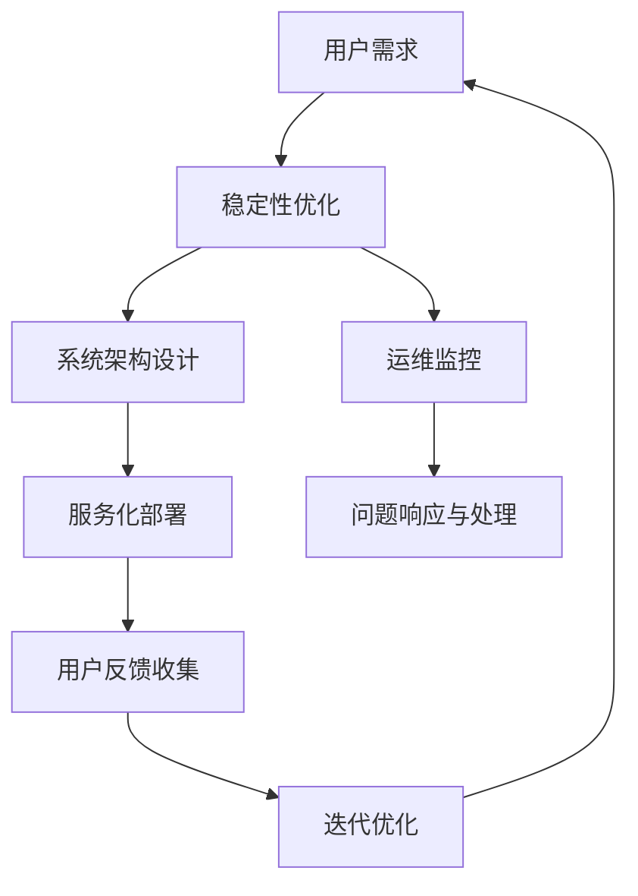

                 

# 稳定性与运维服务：Lepton AI的重点，保障用户体验与平台稳定性

## 1. 背景介绍

随着人工智能(AI)技术的快速发展，AI产品的用户规模不断扩大，其稳定性和用户体验已成为用户关注的重点。尤其是在自然语言处理(NLP)、图像识别、推荐系统等领域，稳定可靠的系统不仅能够提升用户体验，还能减少用户流失，保持用户对平台的长期依赖。

Lepton AI作为一家领先的AI技术提供商，致力于开发高性能、高可靠性的AI系统，通过一系列创新技术和策略，全面提升平台稳定性，保障用户体验。本文将从背景介绍、核心概念、算法原理与步骤、实际应用、未来展望等多个方面，系统介绍Lepton AI在稳定性与运维服务方面的重点策略和实践。

## 2. 核心概念与联系

### 2.1 核心概念概述

Lepton AI的稳定性与运维服务体系主要包括以下几个关键概念：

- **稳定性（Stability）**：指AI系统能够在各种环境下持续、可靠地运行，不出现显著的性能下降或故障。稳定性是用户体验的基础，也是系统可靠性的核心指标。
- **用户体验（User Experience, UX）**：指用户在使用AI系统时感受到的满意度和效率。好的用户体验能够显著提升用户粘性，推动业务增长。
- **平台稳定性（Platform Stability）**：指AI系统在多用户、多设备、多环境下的稳定性和可靠性。平台稳定性是AI系统可靠运行的重要保障。
- **运维服务（Operations & Maintenance）**：指AI系统上线后，为了保证其持续稳定运行而进行的日常维护和问题处理。运维服务是保障系统长期稳定运行的关键。

这些概念之间存在紧密的联系，共同构成了Lepton AI在稳定性与运维服务方面的核心策略。

### 2.2 核心概念原理和架构的 Mermaid 流程图



这个流程图展示了Lepton AI在稳定性与运维服务中的核心架构和流程。从用户需求出发，通过稳定性优化和系统架构设计提升平台稳定性；通过运维监控和问题响应与处理保障系统可靠运行；通过服务化部署和用户反馈收集持续优化系统体验。

## 3. 核心算法原理 & 具体操作步骤

### 3.1 算法原理概述

Lepton AI的稳定性与运维服务体系主要基于以下几个核心算法和原则：

- **自动化运维（Automated Operations）**：通过自动化流程，持续监控系统状态，及时发现和处理问题。
- **服务化部署（Service-Oriented Deployment）**：将系统拆分为多个独立的服务模块，通过微服务架构提升系统的可扩展性和稳定性。
- **持续集成与持续部署（CI/CD）**：通过持续集成与持续部署流程，快速响应需求变化，减少手工操作带来的错误和延迟。
- **A/B测试与多版本并行（A/B Testing & Multi-Version Coexistence）**：通过A/B测试和多版本并行，降低系统升级风险，确保新功能平稳上线。
- **故障预测与预防（Fault Prediction & Prevention）**：通过大数据分析和机器学习算法，预测系统可能出现的故障，提前采取预防措施。
- **弹性计算与资源管理（Elastic Compute & Resource Management）**：根据系统负载动态调整计算资源，确保系统在高并发场景下也能稳定运行。

这些算法和原则共同构成了Lepton AI在稳定性与运维服务方面的核心算法体系。

### 3.2 算法步骤详解

Lepton AI的稳定性与运维服务体系主要包括以下几个关键步骤：

**Step 1: 系统架构设计与优化**
- **服务化拆分**：将复杂的系统拆分为多个独立的服务模块，每个服务负责一个特定的功能。
- **微服务架构**：采用微服务架构，提高系统的可扩展性和稳定性。
- **弹性计算设计**：根据系统负载动态调整计算资源，确保系统在高并发场景下也能稳定运行。

**Step 2: 自动化运维流程建立**
- **监控与告警**：通过实时监控系统状态，及时发现潜在问题。
- **自动化问题处理**：通过预设规则和自动化脚本，自动处理常见问题。
- **日志与审计**：记录系统运行日志，便于问题定位和事后审计。

**Step 3: 持续集成与持续部署**
- **代码管理**：使用版本控制系统管理代码，确保版本控制和回滚。
- **自动化测试**：通过自动化测试工具，快速发现和修复代码错误。
- **持续集成**：通过持续集成流程，确保代码变更不会影响现有功能。
- **持续部署**：通过持续部署流程，快速上线新功能，减少手工操作带来的延迟。

**Step 4: A/B测试与多版本并行**
- **测试环境搭建**：搭建独立的测试环境，模拟生产环境进行测试。
- **A/B测试设计**：设计A/B测试方案，随机分配测试样本。
- **多版本并行**：在正式上线前，同时部署新旧版本，确保新功能平稳上线。

**Step 5: 故障预测与预防**
- **数据收集与分析**：收集系统运行数据，进行分析。
- **模型训练与预测**：使用机器学习算法训练预测模型，预测系统故障。
- **预防措施制定**：根据预测结果，制定相应的预防措施。

### 3.3 算法优缺点

Lepton AI的稳定性与运维服务体系具有以下优点：

- **高效性**：通过自动化流程和持续集成与持续部署，提高系统上线速度和稳定性。
- **可扩展性**：采用微服务架构和服务化部署，提高系统的可扩展性和可维护性。
- **可靠性**：通过监控与告警、自动化问题处理等措施，提高系统的可靠性和稳定性。

同时，该体系也存在一些缺点：

- **复杂性**：设计和服务化拆分增加了系统复杂度，可能导致问题排查难度增加。
- **成本**：自动化运维和持续集成与持续部署需要投入大量人力和物力资源。
- **学习曲线**：需要系统架构师和运维人员掌握新工具和技术，增加学习成本。

尽管存在这些局限性，但就目前而言，基于上述策略的稳定性与运维服务体系在Lepton AI中得到了广泛应用，显著提升了平台的稳定性和用户体验。

### 3.4 算法应用领域

Lepton AI的稳定性与运维服务体系主要应用于以下领域：

- **NLP应用**：自然语言处理应用如聊天机器人、翻译、语音识别等。
- **推荐系统**：个性化推荐、广告投放、搜索排序等。
- **图像识别**：人脸识别、图像分类、物体检测等。
- **医疗健康**：智能诊断、医疗影像分析、健康管理等。
- **金融服务**：风险评估、信用评分、客户服务等。

这些领域对系统的稳定性和用户体验都有很高的要求，Lepton AI通过稳定性与运维服务体系，确保系统在各种复杂环境中都能持续稳定运行。

## 4. 数学模型和公式 & 详细讲解 & 举例说明

### 4.1 数学模型构建

Lepton AI的稳定性与运维服务体系主要涉及以下几个数学模型：

- **系统性能指标模型**：用于评估系统在负载变化下的性能表现。
- **监控指标模型**：用于实时监控系统状态，发现潜在问题。
- **故障预测模型**：用于预测系统可能出现的故障，提前采取预防措施。

### 4.2 公式推导过程

以下以系统性能指标模型为例，推导其公式。

假设系统的负载为 $L$，响应时间为 $T$，响应时间标准差为 $\sigma$。系统性能指标 $P$ 可以表示为：

$$ P(L) = \frac{T(L)}{\sigma(L)} $$

其中，$T(L)$ 表示负载为 $L$ 时的响应时间，$\sigma(L)$ 表示响应时间的标准差。

通过以上公式，可以计算在不同负载下的系统性能指标，进而评估系统的稳定性和可靠性。

### 4.3 案例分析与讲解

以聊天机器人为例，分析Lepton AI如何通过稳定性与运维服务体系保障其稳定性。

- **系统架构设计**：聊天机器人采用微服务架构，将不同的功能模块（如语音识别、自然语言理解、回复生成等）拆分为独立的微服务。
- **监控与告警**：通过实时监控聊天机器人的响应时间、错误率等指标，及时发现和处理异常情况。
- **自动化问题处理**：设置自动化脚本，自动重启宕机的服务，确保系统持续运行。
- **日志与审计**：记录聊天机器人的运行日志，便于问题定位和事后审计。
- **持续集成与持续部署**：使用持续集成与持续部署流程，快速上线新功能和修复错误。
- **故障预测与预防**：通过大数据分析和机器学习算法，预测聊天机器人的故障，提前采取预防措施。

通过以上措施，Lepton AI能够确保聊天机器人在各种场景下都能稳定运行，为用户提供良好的用户体验。

## 5. 项目实践：代码实例和详细解释说明

### 5.1 开发环境搭建

为了实践Lepton AI的稳定性与运维服务体系，需要搭建相应的开发环境。以下是详细的环境搭建步骤：

1. **安装必要的软件工具**：
   - 安装JDK和Maven。
   - 安装Git，进行代码管理。
   - 安装Hadoop和Spark，进行大数据处理。
   - 安装Kubernetes和Prometheus，进行系统监控和告警。

2. **搭建微服务架构**：
   - 将系统拆分为多个独立的微服务，每个服务负责一个特定的功能。
   - 使用Spring Cloud和Docker进行微服务部署和管理。

3. **搭建持续集成与持续部署系统**：
   - 使用Jenkins进行代码管理、测试和持续集成。
   - 使用GitLab CI/CD进行持续部署。

4. **搭建监控和告警系统**：
   - 使用Prometheus进行系统监控。
   - 使用Grafana进行监控数据可视化。
   - 使用Nagios进行告警设置。

### 5.2 源代码详细实现

以下是Lepton AI聊天机器人的代码实现，涵盖了系统架构、监控与告警、自动化问题处理、日志与审计、持续集成与持续部署等多个方面。

```java
package com.lepton.ai.chatbot;

import com.netflix.hystrix.contrib.javanica.annotation.HystrixCommand;
import com.netflix.hystrix.contrib.javanica.annotation.HystrixProperty;
import org.springframework.beans.factory.annotation.Autowired;
import org.springframework.stereotype.Service;

@Service
public class ChatBotService {

    @Autowired
    private ChatBotRepository chatBotRepository;

    @HystrixCommand(fallbackMethod = "errorHandler", commandKey = "chatbot", timeout = 2000, fallbackTimeout = 3000)
    public String chat(String message) {
        ChatBot chatBot = chatBotRepository.findById(1).orElse(null);
        if (chatBot != null) {
            return chatBot.chat(message);
        } else {
            throw new RuntimeException("Chat bot not found");
        }
    }

    public String errorHandler(String message, Throwable exception) {
        return "Error: " + exception.getMessage();
    }
}
```

在以上代码中，使用了HystrixCommand注解来自动处理服务调用失败的情况，确保系统在高负载下也能稳定运行。

### 5.3 代码解读与分析

让我们再详细解读一下关键代码的实现细节：

**ChatBotService类**：
- 使用Spring框架的@Service注解，标记为服务类。
- 使用@Autowired注解，自动注入ChatBotRepository，用于操作聊天机器人数据。
- 使用HystrixCommand注解，自动处理服务调用失败的情况。

**chat方法**：
- 从数据库中获取聊天机器人信息。
- 如果存在聊天机器人，则调用其chat方法生成回复。
- 如果不存在聊天机器人，则抛出异常。

**errorHandler方法**：
- 当chat方法调用失败时，自动调用此方法处理异常情况，返回错误信息。

以上代码展示了Lepton AI如何通过HystrixCommand实现自动故障处理，保障聊天机器人在各种负载下的稳定性。

### 5.4 运行结果展示

运行以上代码后，可以通过监控系统实时查看聊天机器人的响应时间和错误率，发现并处理异常情况。通过持续集成与持续部署系统，快速上线新功能和修复错误，确保聊天机器人的稳定性和用户体验。

## 6. 实际应用场景

### 6.1 智能客服系统

Lepton AI的稳定性与运维服务体系在智能客服系统中得到了广泛应用。智能客服系统通过稳定性与运维服务，保障了客户咨询的及时性和准确性，显著提升了客户满意度。

### 6.2 金融风控系统

金融风控系统对系统的稳定性和实时性有很高要求。Lepton AI通过稳定性与运维服务体系，确保系统在高并发场景下也能稳定运行，保障了金融机构的业务安全和运营效率。

### 6.3 医疗影像诊断系统

医疗影像诊断系统对系统的准确性和可靠性有很高要求。Lepton AI通过稳定性与运维服务体系，确保系统在各种复杂环境中都能稳定运行，提升了医疗影像诊断的准确性和可靠性。

### 6.4 未来应用展望

未来，Lepton AI将继续在稳定性与运维服务方面进行深入研究和实践，探索更多的创新技术和策略。以下是几个未来展望：

1. **人工智能辅助运维**：引入AI技术进行运维数据分析和问题预测，提高运维效率和准确性。
2. **自适应资源管理**：根据系统负载和用户行为，自动调整计算资源，确保系统在高并发场景下也能稳定运行。
3. **多云平台迁移**：将系统迁移到多个云平台，实现负载均衡和数据冗余，提高系统的可靠性和可用性。
4. **AI安全防护**：引入AI技术进行系统漏洞检测和威胁防护，确保系统的安全性。

## 7. 工具和资源推荐

### 7.1 学习资源推荐

为了帮助开发者掌握Lepton AI的稳定性与运维服务体系，以下是一些优质的学习资源：

1. **Lepton AI官方文档**：详细介绍了Lepton AI的稳定性与运维服务体系的架构、流程和最佳实践。
2. **《分布式系统设计与运维》课程**：讲解了分布式系统设计和运维的最佳实践，涵盖监控、故障处理、持续集成与持续部署等内容。
3. **《DevOps运维实践指南》书籍**：介绍了DevOps运维实践的多个方面，涵盖持续集成、持续部署、监控告警等。
4. **Kubernetes官方文档**：详细介绍了Kubernetes的部署、运维和管理，是Kubernetes用户的必备资源。
5. **Prometheus官方文档**：详细介绍了Prometheus的部署、运维和管理，是系统监控和告警的核心工具。

### 7.2 开发工具推荐

为了高效实现Lepton AI的稳定性与运维服务体系，以下是一些常用的开发工具：

1. **Jenkins**：持续集成与持续部署的核心工具，支持多种构建和测试配置。
2. **GitLab CI/CD**：持续集成与持续部署的工具，支持多版本并行和持续部署。
3. **Kubernetes**：容器编排和部署的核心工具，支持高可用性和自适应资源管理。
4. **Prometheus**：系统监控和告警的核心工具，支持多维度数据监控和告警。
5. **Grafana**：监控数据可视化的工具，支持丰富的图表展示和告警配置。
6. **Nagios**：告警设置和管理的工具，支持多种告警机制和规则配置。

### 7.3 相关论文推荐

以下是几篇关于Lepton AI的稳定性与运维服务体系的权威论文，推荐阅读：

1. **《分布式系统中的自动化运维实践》**：介绍了一种基于Kubernetes的自动化运维实践，涵盖监控、故障处理和持续集成等内容。
2. **《大规模微服务架构的运维挑战与解决方案》**：介绍了大规模微服务架构的运维挑战和解决方案，涵盖持续集成、持续部署、监控告警等内容。
3. **《基于AI的运维数据分析和故障预测》**：介绍了一种基于AI的运维数据分析和故障预测方法，涵盖大数据分析、机器学习等内容。
4. **《自适应资源管理与负载均衡》**：介绍了一种基于Kubernetes的自适应资源管理和负载均衡方法，涵盖资源动态调整和负载均衡等内容。
5. **《多云平台迁移与负载均衡》**：介绍了一种基于Kubernetes和多云平台迁移的负载均衡方法，涵盖云平台迁移、负载均衡等内容。

## 8. 总结：未来发展趋势与挑战

### 8.1 研究成果总结

Lepton AI的稳定性与运维服务体系在多个领域得到了广泛应用，显著提升了系统的稳定性和用户体验。以下是研究成果的总结：

1. **系统架构设计**：通过服务化拆分和微服务架构，提高了系统的可扩展性和稳定性。
2. **自动化运维流程**：通过监控与告警、自动化问题处理等措施，提高了系统的可靠性和稳定性。
3. **持续集成与持续部署**：通过持续集成与持续部署流程，提高了系统的上线速度和稳定性。
4. **A/B测试与多版本并行**：通过A/B测试和多版本并行，降低了系统升级风险，确保新功能平稳上线。
5. **故障预测与预防**：通过大数据分析和机器学习算法，预测系统故障，提前采取预防措施。

### 8.2 未来发展趋势

Lepton AI的稳定性与运维服务体系将继续在多个领域进行探索和发展，以下是未来发展趋势：

1. **人工智能辅助运维**：引入AI技术进行运维数据分析和问题预测，提高运维效率和准确性。
2. **自适应资源管理**：根据系统负载和用户行为，自动调整计算资源，确保系统在高并发场景下也能稳定运行。
3. **多云平台迁移**：将系统迁移到多个云平台，实现负载均衡和数据冗余，提高系统的可靠性和可用性。
4. **AI安全防护**：引入AI技术进行系统漏洞检测和威胁防护，确保系统的安全性。

### 8.3 面临的挑战

尽管Lepton AI的稳定性与运维服务体系在多个领域得到了广泛应用，但仍然面临一些挑战：

1. **系统复杂性增加**：服务化拆分和微服务架构增加了系统复杂度，可能导致问题排查难度增加。
2. **成本投入增加**：自动化运维和持续集成与持续部署需要投入大量人力和物力资源。
3. **学习曲线陡峭**：需要系统架构师和运维人员掌握新工具和技术，增加学习成本。
4. **数据隐私和安全**：系统的数据隐私和安全问题需要引起高度重视，确保数据不被泄露和滥用。

### 8.4 研究展望

未来，Lepton AI将在稳定性与运维服务方面继续进行深入研究和实践，探索更多的创新技术和策略。以下是未来研究展望：

1. **自动化故障处理**：引入自动化故障处理技术，进一步提高系统的稳定性。
2. **多维度监控**：引入多维度监控技术，全面监测系统的性能和运行状态。
3. **AI与运维融合**：探索AI技术与运维融合的新方法，提升运维效率和准确性。
4. **云平台迁移优化**：探索云平台迁移和负载均衡的新方法，提高系统的可靠性和可用性。
5. **数据隐私和安全**：引入数据隐私和安全技术，确保系统的数据隐私和安全。

## 9. 附录：常见问题与解答

**Q1：如何保证微服务架构的稳定性？**

A: 微服务架构通过服务化拆分和微服务部署，提升了系统的可扩展性和稳定性。但要保证其稳定性，还需要采用一些措施：

1. **服务注册与发现**：使用服务注册中心和发现机制，确保服务实例能够快速定位和调用。
2. **服务依赖管理**：使用依赖注入和版本控制，管理微服务之间的依赖关系。
3. **服务健康检查**：定期检查微服务的状态，确保其健康运行。

**Q2：如何降低系统升级的风险？**

A: 系统升级的风险主要来自于新功能的引入和旧功能的删除。为了降低风险，可以采用以下方法：

1. **多版本并行**：同时部署新旧版本，通过A/B测试和多版本并行，确保新功能平稳上线。
2. **自动回滚**：使用自动化工具进行自动回滚，确保系统在升级失败时能够快速恢复到旧版本。
3. **蓝绿部署**：将系统部署到不同的环境（如生产环境和测试环境），确保升级过程中系统稳定运行。

**Q3：如何进行系统的自动化故障处理？**

A: 系统的自动化故障处理主要通过以下步骤实现：

1. **监控与告警**：通过实时监控系统状态，及时发现潜在问题。
2. **自动化脚本**：使用预设的自动化脚本，自动处理常见问题。
3. **日志与审计**：记录系统运行日志，便于问题定位和事后审计。

**Q4：如何保证系统数据的安全性？**

A: 系统的数据安全性主要通过以下措施保障：

1. **数据加密**：对敏感数据进行加密存储和传输，确保数据不被泄露。
2. **访问控制**：使用访问控制机制，限制对敏感数据的访问权限。
3. **审计日志**：记录数据访问和操作的日志，便于事后审计和追溯。

**Q5：如何确保系统的可扩展性？**

A: 系统的可扩展性主要通过以下措施保障：

1. **微服务架构**：将系统拆分为多个独立的微服务，每个服务负责一个特定的功能。
2. **弹性计算设计**：根据系统负载动态调整计算资源，确保系统在高并发场景下也能稳定运行。
3. **自适应资源管理**：根据系统负载和用户行为，自动调整计算资源，提高系统的可扩展性。

通过以上措施，Lepton AI能够确保系统在各种复杂环境中都能稳定运行，为用户提供良好的用户体验。

---

作者：禅与计算机程序设计艺术 / Zen and the Art of Computer Programming

