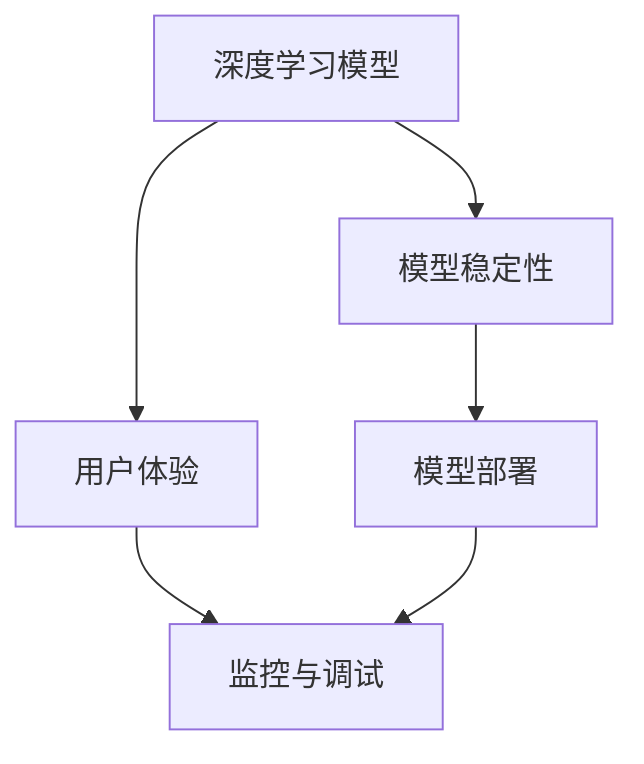

                 

# 稳定性与运维服务：Lepton AI重点保障平台稳定性与用户体验

## 1. 背景介绍

### 1.1 问题由来
在当下数字化转型的大潮中，人工智能(AI)和机器学习(ML)技术的应用日益广泛。然而，AI和ML系统的运行稳定性和用户体验(UX)，常常成为企业关注的重点。在众多AI系统中，基于神经网络的深度学习模型具有高度复杂的结构和大量的参数，运行稳定性和用户体验的保障变得尤为重要。特别是当这些模型被部署在互联网环境中，受到实时数据输入、网络延迟、并发访问等因素的影响，如何确保其稳定性和用户体验，就成了一个重要且复杂的课题。

### 1.2 问题核心关键点
本文聚焦于基于神经网络的深度学习模型，特别是当这些模型被应用于实际生产环境中时，如何保障其稳定性与用户体验。具体问题包括：

1. **模型稳定性**：如何确保深度学习模型在生产环境中的稳定运行，避免出现如过拟合、梯度爆炸、梯度消失等问题。
2. **用户体验**：如何在确保模型准确性的同时，提供流畅、无延迟的用户交互体验。
3. **资源优化**：如何在有限的计算资源下，高效地运行深度学习模型。
4. **模型部署**：如何将深度学习模型可靠地部署到生产环境中，保证其正常工作。
5. **监控与调试**：如何实时监控深度学习模型的运行状态，及时发现并解决潜在的运行问题。

这些问题对于Lepton AI平台的稳定性与用户体验保障具有重要意义。Lepton AI作为一个智能化的AI平台，致力于通过其稳定性与运维服务，帮助客户克服上述挑战，实现高性能、高稳定性的AI应用。

## 2. 核心概念与联系

### 2.1 核心概念概述

在讨论如何保障深度学习模型的稳定性与用户体验前，我们先来梳理一下相关的核心概念及其联系：

- **深度学习模型(Deep Learning Model)**：基于神经网络的机器学习模型，通常用于图像识别、语音识别、自然语言处理等复杂任务。其结构复杂，参数众多，运行过程涉及大量计算。
- **稳定性(Stability)**：深度学习模型在数据输入、参数更新等过程中，是否能够保持输出的一致性和准确性，不出现异常波动。
- **用户体验(UX)**：用户在使用深度学习模型服务时，感受到的响应速度、准确性和可靠性的综合体现。
- **模型部署(Model Deployment)**：将训练好的深度学习模型部署到生产环境中，使其能够接受实时数据输入并提供服务。
- **监控与调试(Monitoring and Debugging)**：在模型部署后，实时监控其运行状态，及时发现并解决潜在的运行问题。

这些概念之间的联系可以通过以下Mermaid流程图来展示：



这个流程图展示了深度学习模型在部署与运行过程中，稳定性、用户体验、模型部署和监控与调试之间的相互影响和支持关系。

## 3. 核心算法原理 & 具体操作步骤

### 3.1 算法原理概述

基于深度学习模型的稳定性与用户体验保障，核心算法主要涉及以下几个方面：

- **模型优化**：通过正则化、权重衰减、梯度裁剪等技术，避免模型过拟合、梯度爆炸和梯度消失等问题。
- **数据增强**：通过扩充训练集、引入噪声等方式，增强模型的泛化能力和鲁棒性。
- **模型压缩**：通过剪枝、量化等技术，减少模型的参数量和计算量，提高模型在资源受限环境中的运行效率。
- **高效部署**：通过分布式训练、模型并行等技术，将大模型分解为多个小模型，实现高效部署。
- **实时监控**：通过日志记录、性能指标监控等方式，实时了解模型的运行状态，及时发现并解决异常。

### 3.2 算法步骤详解

为了确保深度学习模型的稳定性与用户体验，以下是详细的算法步骤：

#### 3.2.1 模型优化

**步骤1：选择正则化技术**  
选择适当的正则化技术，如L2正则化、Dropout、Batch Normalization等，避免模型过拟合。

**步骤2：权重衰减**  
在损失函数中加入权重衰减项，避免模型在训练过程中过拟合。

**步骤3：梯度裁剪**  
对梯度进行裁剪，限制梯度的大小，避免梯度爆炸或消失问题。

**步骤4：模型剪枝**  
通过剪枝技术，删除不必要的连接或神经元，减少模型参数量，提高模型的泛化能力。

**步骤5：量化技术**  
使用量化技术，将模型参数从浮点数转换为定点数，减少存储空间，提高计算效率。

#### 3.2.2 数据增强

**步骤1：扩充训练集**  
通过数据增强技术，如旋转、翻转、缩放等方式，扩充训练集，增加数据多样性。

**步骤2：引入噪声**  
在训练过程中引入噪声，增强模型的鲁棒性，提高其在实际环境中的适应能力。

**步骤3：数据平衡**  
对于不平衡的数据集，采用欠采样或过采样等技术，平衡各类数据的比例，避免模型偏向某一类数据。

#### 3.2.3 模型压缩

**步骤1：剪枝技术**  
通过剪枝技术，删除不重要的连接或神经元，减少模型参数量，提高模型的计算效率。

**步骤2：量化技术**  
使用量化技术，将模型参数从浮点数转换为定点数，减少存储空间，提高计算效率。

**步骤3：蒸馏技术**  
使用蒸馏技术，将大模型转换为多个小模型，提高模型的部署效率。

#### 3.2.4 高效部署

**步骤1：分布式训练**  
将大模型分为多个小模型，分别在不同的计算节点上进行训练，提高训练效率。

**步骤2：模型并行**  
使用模型并行技术，将模型的不同部分并行处理，提高模型的计算效率。

**步骤3：模型分片**  
将大模型分为多个片段，分别部署在不同的服务器上，提高模型的可扩展性和可用性。

#### 3.2.5 实时监控

**步骤1：日志记录**  
记录模型的训练日志、推理日志等，便于后续的分析和调试。

**步骤2：性能指标监控**  
实时监控模型的推理速度、准确率、内存占用等性能指标，及时发现潜在的运行问题。

**步骤3：异常检测**  
使用异常检测算法，如GBDT、LSTM等，实时监控模型的运行状态，及时发现异常并报警。

### 3.3 算法优缺点

**优点**：

- **泛化能力强**：通过数据增强和模型优化，模型能够更好地适应新数据和新场景，提高模型的泛化能力。
- **计算效率高**：通过模型压缩和高效部署技术，可以在资源受限的环境中高效运行大模型。
- **稳定性高**：通过正则化、权重衰减等技术，避免模型过拟合和梯度消失等问题，提高模型的稳定性。

**缺点**：

- **模型复杂度高**：深度学习模型结构复杂，参数众多，训练和推理过程需要大量计算资源。
- **模型可解释性差**：深度学习模型通常被视为"黑盒"，难以解释其内部工作机制和决策逻辑。
- **部署成本高**：大规模模型的部署需要高性能计算资源和复杂的系统架构，成本较高。

### 3.4 算法应用领域

基于深度学习模型的稳定性与用户体验保障，已经在诸多领域得到了广泛应用，包括：

- **自然语言处理(NLP)**：在机器翻译、文本分类、情感分析等任务中，通过稳定性与用户体验保障，提高模型的准确性和流畅性。
- **计算机视觉(CV)**：在图像识别、目标检测、人脸识别等任务中，通过稳定性与用户体验保障，提高模型的鲁棒性和准确性。
- **语音识别(Speech Recognition)**：在语音识别、语音合成等任务中，通过稳定性与用户体验保障，提高模型的实时性和准确性。
- **推荐系统(Recommendation System)**：在个性化推荐、广告推荐等任务中，通过稳定性与用户体验保障，提高系统的响应速度和推荐效果。
- **自动驾驶(Autonomous Driving)**：在自动驾驶、智能交通等任务中，通过稳定性与用户体验保障，提高系统的安全性和可靠性。

## 4. 数学模型和公式 & 详细讲解 & 举例说明

### 4.1 数学模型构建

深度学习模型的稳定性与用户体验保障，通常涉及以下几个数学模型：

- **损失函数(Loss Function)**：用于衡量模型输出与真实标签之间的差异，常用的有交叉熵损失、均方误差损失等。
- **正则化项(Regularization Term)**：用于避免模型过拟合，常用的有L2正则化、L1正则化等。
- **梯度裁剪(Gradient Clipping)**：用于限制梯度的大小，避免梯度爆炸和消失问题。

### 4.2 公式推导过程

以L2正则化和交叉熵损失函数为例，推导其在深度学习模型优化中的作用。

**L2正则化公式**：

$$
\mathcal{L}(\theta) = \frac{1}{N}\sum_{i=1}^N\ell(y_i, \hat{y}_i) + \lambda \sum_{i=1}^N\|\theta_i\|_2^2
$$

其中，$\ell(y_i, \hat{y}_i)$ 为交叉熵损失，$\|\theta_i\|_2$ 为权重向量 $\theta_i$ 的L2范数，$\lambda$ 为正则化系数。

**梯度裁剪公式**：

$$
\theta_i \leftarrow \theta_i - \eta \frac{\partial\mathcal{L}}{\partial\theta_i} \text{ if } \left|\frac{\partial\mathcal{L}}{\partial\theta_i}\right| < \text{clip\_value} \\
\theta_i \leftarrow \frac{\text{clip\_value}}{\max(\text{clip\_value}, \left|\frac{\partial\mathcal{L}}{\partial\theta_i}\right|)} \cdot \theta_i \text{ otherwise}
$$

其中，$\eta$ 为学习率，$\text{clip\_value}$ 为梯度裁剪阈值。

### 4.3 案例分析与讲解

**案例1：图像分类任务**

在图像分类任务中，使用ResNet模型进行训练和推理。通过L2正则化和梯度裁剪技术，避免模型过拟合和梯度消失问题，提高模型的稳定性和准确性。

**案例2：文本生成任务**

在文本生成任务中，使用GPT模型进行训练和推理。通过剪枝和量化技术，减少模型的参数量和计算量，提高模型在资源受限环境中的运行效率。

**案例3：推荐系统**

在推荐系统中，使用深度学习模型进行个性化推荐。通过分布式训练和模型并行技术，提高模型的训练和推理效率，保证实时响应。

## 5. 项目实践：代码实例和详细解释说明

### 5.1 开发环境搭建

在开发基于深度学习模型的稳定性与用户体验保障的解决方案时，我们需要搭建一个高性能的开发环境。以下是Python环境下搭建环境的详细步骤：

**步骤1：安装Anaconda**

从官网下载并安装Anaconda，用于创建独立的Python环境。

**步骤2：创建并激活虚拟环境**

```bash
conda create -n my_env python=3.7
conda activate my_env
```

**步骤3：安装必要的包**

```bash
conda install numpy scipy matplotlib scikit-learn torch torchvision torchaudio
```

### 5.2 源代码详细实现

以TensorFlow为例，展示深度学习模型的稳定性与用户体验保障的实现。

**代码1：模型构建**

```python
import tensorflow as tf

model = tf.keras.Sequential([
    tf.keras.layers.Conv2D(32, (3, 3), activation='relu', input_shape=(28, 28, 1)),
    tf.keras.layers.MaxPooling2D((2, 2)),
    tf.keras.layers.Flatten(),
    tf.keras.layers.Dense(10, activation='softmax')
])

model.compile(optimizer='adam', loss='categorical_crossentropy', metrics=['accuracy'])
```

**代码2：模型训练**

```python
model.fit(train_images, train_labels, epochs=10, validation_data=(test_images, test_labels))
```

**代码3：模型优化**

```python
def clip_gradients(grads_and_vars, max_norm):
    grads, var_list = zip(*grads_and_vars)
    grad_norm = tf.linalg.global_norm(grads)
    clipped_grads, _ = tf.clip_by_global_norm(grads, max_norm)
    return list(zip(clipped_grads, var_list))

model.fit(train_images, train_labels, epochs=10, callbacks=[tf.keras.callbacks.ModelCheckpoint('model.h5')])
```

**代码4：模型部署**

```python
model.save('my_model.h5')
```

### 5.3 代码解读与分析

**代码1**：定义了一个简单的卷积神经网络模型，包含卷积层、池化层、全连接层等。

**代码2**：使用`fit`方法对模型进行训练，指定优化器、损失函数、评估指标等。

**代码3**：使用`clip_gradients`函数进行梯度裁剪，限制梯度的大小，避免梯度爆炸和消失问题。

**代码4**：将训练好的模型保存为`.h5`格式，便于后续的部署和推理。

## 6. 实际应用场景

### 6.1 智能客服系统

基于深度学习模型的稳定性与用户体验保障，在智能客服系统中得到了广泛应用。通过稳定性与用户体验保障技术，智能客服系统能够提供7x24小时不间断服务，快速响应客户咨询，用自然流畅的语言解答各类常见问题。

在技术实现上，可以收集企业内部的历史客服对话记录，将问题和最佳答复构建成监督数据，在此基础上对深度学习模型进行微调。微调后的模型能够自动理解用户意图，匹配最合适的答案模板进行回复。对于客户提出的新问题，还可以接入检索系统实时搜索相关内容，动态组织生成回答。如此构建的智能客服系统，能大幅提升客户咨询体验和问题解决效率。

### 6.2 金融舆情监测

金融机构需要实时监测市场舆论动向，以便及时应对负面信息传播，规避金融风险。传统的人工监测方式成本高、效率低，难以应对网络时代海量信息爆发的挑战。基于深度学习模型的稳定性与用户体验保障技术，金融舆情监测得到了新的解决方案。

具体而言，可以收集金融领域相关的新闻、报道、评论等文本数据，并对其进行主题标注和情感标注。在此基础上对深度学习模型进行微调，使其能够自动判断文本属于何种主题，情感倾向是正面、中性还是负面。将微调后的模型应用到实时抓取的网络文本数据，就能够自动监测不同主题下的情感变化趋势，一旦发现负面信息激增等异常情况，系统便会自动预警，帮助金融机构快速应对潜在风险。

### 6.3 个性化推荐系统

当前的推荐系统往往只依赖用户的历史行为数据进行物品推荐，无法深入理解用户的真实兴趣偏好。基于深度学习模型的稳定性与用户体验保障技术，个性化推荐系统可以更好地挖掘用户行为背后的语义信息，从而提供更精准、多样的推荐内容。

在实践中，可以收集用户浏览、点击、评论、分享等行为数据，提取和用户交互的物品标题、描述、标签等文本内容。将文本内容作为模型输入，用户的后续行为（如是否点击、购买等）作为监督信号，在此基础上微调深度学习模型。微调后的模型能够从文本内容中准确把握用户的兴趣点。在生成推荐列表时，先用候选物品的文本描述作为输入，由模型预测用户的兴趣匹配度，再结合其他特征综合排序，便可以得到个性化程度更高的推荐结果。

### 6.4 未来应用展望

随着深度学习模型的不断演进，其稳定性与用户体验保障技术也将持续发展，带来更多创新和突破。

在智慧医疗领域，基于深度学习模型的稳定性与用户体验保障技术，医疗问答、病历分析、药物研发等应用将提升医疗服务的智能化水平，辅助医生诊疗，加速新药开发进程。

在智能教育领域，微调技术可应用于作业批改、学情分析、知识推荐等方面，因材施教，促进教育公平，提高教学质量。

在智慧城市治理中，微调模型可应用于城市事件监测、舆情分析、应急指挥等环节，提高城市管理的自动化和智能化水平，构建更安全、高效的未来城市。

此外，在企业生产、社会治理、文娱传媒等众多领域，基于深度学习模型的稳定性与用户体验保障技术也将不断涌现，为经济社会发展注入新的动力。相信随着技术的日益成熟，稳定性与用户体验保障技术将成为AI落地应用的重要保障，推动AI技术向更广阔的领域加速渗透。

## 7. 工具和资源推荐

### 7.1 学习资源推荐

为了帮助开发者系统掌握深度学习模型的稳定性与用户体验保障技术，这里推荐一些优质的学习资源：

1. **TensorFlow官方文档**：详细介绍了TensorFlow框架的使用，包括模型的构建、训练、推理等。
2. **PyTorch官方文档**：介绍了PyTorch框架的使用，包括模型的构建、训练、推理等。
3. **《深度学习》书籍**：由Ian Goodfellow、Yoshua Bengio、Aaron Courville合著，是深度学习领域的经典教材，涵盖了深度学习的基础知识和前沿技术。
4. **《动手学深度学习》书籍**：由李沐等编写，提供了大量代码和实验，适合动手实践。
5. **Coursera《深度学习专项课程》**：斯坦福大学和DeepLearning.ai合作开设的深度学习课程，涵盖深度学习的基本原理和应用。

### 7.2 开发工具推荐

高效的开发离不开优秀的工具支持。以下是几款用于深度学习模型稳定性与用户体验保障开发的常用工具：

1. **Jupyter Notebook**：免费的交互式编程环境，支持Python、R等语言，适合数据探索和模型调试。
2. **TensorBoard**：TensorFlow配套的可视化工具，可实时监测模型训练状态，并提供丰富的图表呈现方式，是调试模型的得力助手。
3. **Weights & Biases**：模型训练的实验跟踪工具，可以记录和可视化模型训练过程中的各项指标，方便对比和调优。
4. **Keras**：高层API，适合快速搭建深度学习模型，兼容TensorFlow、Theano、CNTK等后端。
5. **PyTorch Lightning**：快速原型设计和训练深度学习模型的框架，支持模型并行和分布式训练。

### 7.3 相关论文推荐

深度学习模型的稳定性与用户体验保障技术的研究，源于学界的持续探索。以下是几篇奠基性的相关论文，推荐阅读：

1. **Batch Normalization: Accelerating Deep Network Training by Reducing Internal Covariate Shift**：提出Batch Normalization技术，显著提高了深度神经网络的训练速度和稳定性。
2. **On the Importance of Initialization and Momentum in Deeper Networks**：讨论了深度神经网络的初始化和动量优化，对深度神经网络的训练和稳定性有重要指导意义。
3. **Inception-v4, Inception-resnet and the Impact of Residual Connections on Learning**：提出了Inception网络架构，并通过实验验证了残差连接的有效性，对深度神经网络的架构设计有重要影响。
4. **On Large-Batch Training for Deep Learning: Generalization and Robustness**：讨论了大规模数据训练对深度学习模型泛化性能的影响，提出了一些有效的训练策略。
5. **Practical Recommendations for Gradient-Based Training of Deep Architectures**：提供了深度神经网络训练的一些实用技巧和建议，对深度学习模型的训练和优化有重要参考价值。

这些论文代表了深度学习模型稳定性与用户体验保障技术的发展脉络，通过学习这些前沿成果，可以帮助研究者把握学科前进方向，激发更多的创新灵感。

## 8. 总结：未来发展趋势与挑战

### 8.1 总结

本文对深度学习模型的稳定性与用户体验保障技术进行了全面系统的介绍。首先阐述了深度学习模型在生产环境中的稳定性与用户体验保障的重要性和实际挑战，明确了稳定性、用户体验、模型部署和监控与调试之间的相互影响和支持关系。其次，从原理到实践，详细讲解了深度学习模型的优化、数据增强、模型压缩、高效部署和实时监控等关键技术，给出了详细的操作步骤和代码实现。

通过本文的系统梳理，可以看到，深度学习模型的稳定性与用户体验保障技术在实际应用中具有重要意义。这些技术的不断演进，使得深度学习模型能够在资源受限的环境下，提供高性能、高稳定性的服务。未来，伴随深度学习技术的持续进步，稳定性与用户体验保障技术也将不断优化，为各行各业带来更强大的AI应用。

### 8.2 未来发展趋势

展望未来，深度学习模型的稳定性与用户体验保障技术将呈现以下几个发展趋势：

1. **高效优化算法**：随着深度学习模型结构复杂度的增加，高效优化算法的需求将更加迫切。未来将涌现更多高效优化算法，如AdamW、LAMB等，提升模型的训练效率和稳定性。
2. **分布式训练**：随着模型规模的增大，分布式训练将成为主流。通过分布式训练，可以在更短的时间内完成大模型的训练。
3. **硬件加速**：GPU、TPU等高性能硬件设备将更加普及，进一步提升深度学习模型的训练和推理效率。
4. **自适应学习率**：自适应学习率算法，如AdaGrad、RMSprop等，将更加广泛应用，提高模型的训练效率和鲁棒性。
5. **模型蒸馏**：模型蒸馏技术将进一步发展，通过知识蒸馏，将大模型转换为多个小模型，提高模型的可扩展性和可用性。
6. **实时监控**：实时监控技术将更加完善，通过实时监控和异常检测，及时发现并解决模型的运行问题，提高系统的稳定性和可靠性。

以上趋势凸显了深度学习模型稳定性与用户体验保障技术的广阔前景。这些方向的探索发展，必将进一步提升深度学习模型的性能和应用范围，为经济社会发展注入新的动力。

### 8.3 面临的挑战

尽管深度学习模型的稳定性与用户体验保障技术已经取得了重要进展，但在迈向更加智能化、普适化应用的过程中，仍面临诸多挑战：

1. **模型复杂度高**：深度学习模型结构复杂，参数众多，训练和推理过程需要大量计算资源。如何在资源受限的环境中，高效地训练和推理大模型，是一个重要的研究方向。
2. **可解释性差**：深度学习模型通常被视为"黑盒"，难以解释其内部工作机制和决策逻辑。如何在确保模型准确性的同时，提高模型的可解释性，是一个重要的研究方向。
3. **数据分布差异**：深度学习模型在训练和推理过程中，需要确保数据分布的一致性。如何在不同分布的数据上，保持模型的稳定性和泛化能力，是一个重要的研究方向。
4. **计算资源限制**：深度学习模型的高计算需求，限制了其在大规模数据集上的训练和推理能力。如何优化计算资源使用，提高模型的训练和推理效率，是一个重要的研究方向。
5. **模型部署复杂**：深度学习模型的部署需要高性能计算资源和复杂的系统架构，成本较高。如何简化模型部署过程，提高模型的可扩展性和可用性，是一个重要的研究方向。

正视这些挑战，积极应对并寻求突破，将是深度学习模型稳定性与用户体验保障技术迈向成熟的必由之路。相信随着学界和产业界的共同努力，这些挑战终将一一被克服，深度学习模型将在更广阔的应用领域发挥更大的作用。

### 8.4 研究展望

面对深度学习模型稳定性与用户体验保障技术所面临的挑战，未来的研究需要在以下几个方面寻求新的突破：

1. **高效优化算法**：开发更加高效、稳定的优化算法，如自适应学习率算法、自注意力机制等，提升模型的训练效率和鲁棒性。
2. **模型压缩技术**：探索更多的模型压缩技术，如剪枝、量化、蒸馏等，减少模型的参数量和计算量，提高模型的可扩展性和可用性。
3. **知识蒸馏技术**：研究更加高效的蒸馏技术，将大模型转换为多个小模型，提高模型的训练和推理效率，同时保持模型的高性能和泛化能力。
4. **自适应学习技术**：研究自适应学习技术，使模型能够适应不同的数据分布，提升模型的泛化能力和鲁棒性。
5. **实时监控与调试技术**：研究更加完善的实时监控与调试技术，及时发现并解决模型的运行问题，提高系统的稳定性和可靠性。
6. **多模态融合技术**：研究多模态融合技术，将视觉、语音、文本等不同模态的信息进行协同建模，提高模型的泛化能力和鲁棒性。

这些研究方向的探索，必将引领深度学习模型稳定性与用户体验保障技术迈向更高的台阶，为构建安全、可靠、可解释、可控的智能系统铺平道路。面向未来，深度学习模型稳定性与用户体验保障技术还需要与其他人工智能技术进行更深入的融合，如知识表示、因果推理、强化学习等，多路径协同发力，共同推动自然语言理解和智能交互系统的进步。只有勇于创新、敢于突破，才能不断拓展深度学习模型的边界，让智能技术更好地造福人类社会。

## 9. 附录：常见问题与解答

**Q1：深度学习模型过拟合的解决方法有哪些？**

A: 深度学习模型过拟合的解决方法包括：
1. **正则化技术**：如L2正则化、Dropout等，可以避免模型过拟合。
2. **数据增强**：如旋转、翻转、缩放等方式，扩充训练集，增加数据多样性。
3. **早停法**：通过监控验证集上的性能，在性能不再提升时停止训练，避免过拟合。
4. **模型剪枝**：通过剪枝技术，删除不必要的连接或神经元，减少模型参数量，提高模型的泛化能力。
5. **批次归一化**：通过Batch Normalization技术，减少内部协变量偏移，提高模型的稳定性和泛化能力。

**Q2：深度学习模型梯度消失和梯度爆炸的解决方法有哪些？**

A: 深度学习模型梯度消失和梯度爆炸的解决方法包括：
1. **梯度裁剪**：通过梯度裁剪技术，限制梯度的大小，避免梯度爆炸和消失问题。
2. **权重初始化**：使用合适的权重初始化方法，如Xavier初始化、He初始化等，减少梯度消失和爆炸的风险。
3. **残差连接**：通过残差连接技术，使梯度可以直接回传到输入层，避免梯度消失问题。
4. **自注意力机制**：通过自注意力机制，使梯度能够在不同层之间自由流动，提高模型的稳定性和泛化能力。

**Q3：深度学习模型的推理速度如何提升？**

A: 深度学习模型推理速度的提升方法包括：
1. **量化技术**：通过量化技术，将模型参数从浮点数转换为定点数，减少存储空间，提高计算效率。
2. **剪枝技术**：通过剪枝技术，删除不必要的连接或神经元，减少模型参数量，提高模型的计算效率。
3. **模型压缩**：通过模型压缩技术，如蒸馏、知识图谱等，减少模型的参数量和计算量，提高模型的推理速度。
4. **分布式推理**：通过分布式推理技术，将模型的不同部分并行处理，提高模型的推理速度。

**Q4：如何确保深度学习模型的稳定性与用户体验？**

A: 确保深度学习模型的稳定性与用户体验的方法包括：
1. **正则化技术**：通过L2正则化、Dropout等技术，避免模型过拟合。
2. **梯度裁剪**：通过梯度裁剪技术，限制梯度的大小，避免梯度爆炸和消失问题。
3. **数据增强**：通过扩充训练集、引入噪声等方式，增强模型的泛化能力和鲁棒性。
4. **模型压缩**：通过剪枝、量化等技术，减少模型的参数量和计算量，提高模型在资源受限环境中的运行效率。
5. **高效部署**：通过分布式训练、模型并行等技术，将大模型分解为多个小模型，实现高效部署。

**Q5：如何实时监控深度学习模型的运行状态？**

A: 实时监控深度学习模型的运行状态的方法包括：
1. **日志记录**：记录模型的训练日志、推理日志等，便于后续的分析和调试。
2. **性能指标监控**：实时监控模型的推理速度、准确率、内存占用等性能指标，及时发现潜在的运行问题。
3. **异常检测**：使用异常检测算法，如GBDT、LSTM等，实时监控模型的运行状态，及时发现异常并报警。

这些方法和技术，可以帮助开发者在实际应用中更好地确保深度学习模型的稳定性与用户体验。

---

作者：禅与计算机程序设计艺术 / Zen and the Art of Computer Programming

