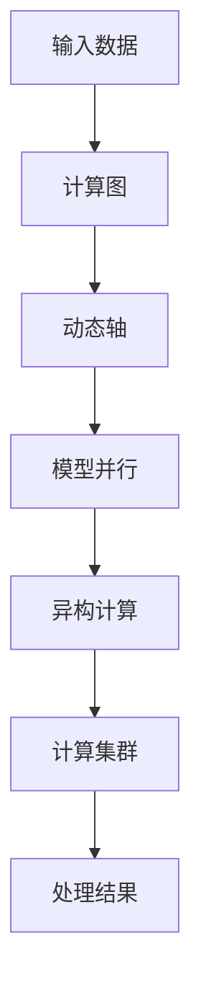

                 

# 突破性能瓶颈：LLM处理速度的进化

> 关键词：
> - 大语言模型 (Large Language Model, LLM)
> - 处理速度 (Processing Speed)
> - 深度学习 (Deep Learning)
> - 计算图 (Computational Graph)
> - 动态轴 (Dynamic Axis)
> - 模型并行 (Model Parallelism)
> - 异构计算 (Heterogeneous Computing)

## 1. 背景介绍

在深度学习的浪潮中，大语言模型（Large Language Model, LLM）成为了人工智能领域的明星。这些模型通常拥有数十亿甚至数百亿的参数，能够处理复杂的自然语言理解和生成任务。然而，大模型处理速度的瓶颈问题一直困扰着其广泛应用，尤其是在实时性要求高的场景下。本文将探讨大语言模型处理速度的进化，从理论到实践，全面剖析大模型的计算图、优化技术、并行计算等关键点，旨在提供一种突破性能瓶颈的解决方案。

## 2. 核心概念与联系

### 2.1 核心概念概述

要突破大语言模型处理速度的瓶颈，首先需要理解以下几个核心概念：

- **计算图 (Computational Graph)**：深度学习模型的计算过程由一系列操作构成，这些操作之间的关系可以用计算图来描述。计算图从输入数据开始，通过一系列的节点（操作）进行处理，最终输出结果。

- **动态轴 (Dynamic Axis)**：在处理大规模序列数据时，计算图往往包含动态轴，表示不同时间步的输入和输出。动态轴使得模型能够处理不同长度的序列，但同时也增加了计算复杂度。

- **模型并行 (Model Parallelism)**：通过将模型分布在多个计算设备上，实现对模型各层的并行计算，以提高处理速度。

- **异构计算 (Heterogeneous Computing)**：利用不同类型的计算资源（如CPU、GPU、TPU等）进行混合计算，优化资源利用率和计算效率。

- **计算集群 (Computational Cluster)**：将多个计算节点组成一个集群，实现大规模并行计算，进一步提升处理速度。

这些概念相互关联，共同构成了大语言模型处理速度优化的核心方法。

### 2.2 核心概念原理和架构的 Mermaid 流程图



这个流程图展示了从输入数据到输出结果的处理流程。输入数据首先被编码成计算图中的节点，通过动态轴处理序列数据，利用模型并行技术进行并行计算，再通过异构计算和计算集群优化资源利用率，最终得到处理结果。

## 3. 核心算法原理 & 具体操作步骤

### 3.1 算法原理概述

大语言模型处理速度的瓶颈主要源于其大规模的参数量和高维度的动态轴。为了突破这一瓶颈，算法的设计和优化变得尤为重要。以下是一些关键的算法原理和具体操作步骤：

- **矩阵乘积加速 (Matrix Multiplication Acceleration)**：矩阵乘积是深度学习中最耗时的操作之一，优化矩阵乘积的计算速度可以大幅提升模型的处理效率。

- **量化 (Quantization)**：将模型参数和激活值量化为低精度格式（如int8），可以显著减少内存占用和计算开销，但需要考虑精度损失。

- **动态图 (Dynamic Graph)**：在计算图中，动态图可以自动管理内存，避免频繁的内存分配和释放，提高计算效率。

- **模型压缩 (Model Compression)**：通过剪枝、融合、蒸馏等技术，减少模型参数量，降低计算复杂度。

- **优化器 (Optimizer)**：选择合适的优化器（如Adam、SGD等）和超参数（如学习率、动量等），优化模型的训练过程。

### 3.2 算法步骤详解

以下详细介绍如何通过这些算法原理，逐步优化大语言模型的处理速度：

**Step 1: 计算图优化**

- **计算图重构 (Computational Graph Reconstruction)**：利用动态图技术，重新设计计算图，使其更适合并行计算。
- **节点融合 (Node Fusion)**：将计算图中相似的操作合并，减少计算图规模，提高并行效率。

**Step 2: 模型参数优化**

- **参数量化 (Parameter Quantization)**：通过低精度量化技术，将模型参数和激活值存储为低精度格式。
- **剪枝和融合 (Pruning and Fusion)**：通过剪枝技术去除不必要的参数，通过参数融合技术减少冗余计算。

**Step 3: 数据并行与模型并行**

- **数据并行 (Data Parallelism)**：将同一批次的训练数据分布在不同的计算节点上，实现并行计算。
- **模型并行 (Model Parallelism)**：将模型在不同层之间进行分割，每个节点处理部分层的计算，实现层间的并行计算。

**Step 4: 异构计算与计算集群**

- **异构计算 (Heterogeneous Computing)**：利用不同类型的计算资源进行混合计算，如GPU和CPU的结合。
- **计算集群 (Computational Cluster)**：将多个计算节点组成集群，实现大规模并行计算。

### 3.3 算法优缺点

#### 优点

- **提升处理速度**：通过优化计算图、参数量化、并行计算等技术，可以显著提升大语言模型的处理速度。
- **降低内存消耗**：量化和压缩技术可以减少模型参数量和内存占用。
- **提高计算效率**：动态图和异构计算技术可以优化资源利用率，提高计算效率。

#### 缺点

- **精度损失**：量化和剪枝技术可能会带来一定的精度损失。
- **计算复杂度增加**：优化计算图和并行计算可能会增加计算复杂度，需要更多的硬件资源支持。
- **调试困难**：复杂的优化过程可能会导致调试难度增加，开发周期延长。

### 3.4 算法应用领域

大语言模型处理速度的优化技术在多个领域中得到了广泛应用：

- **自然语言处理 (NLP)**：如文本分类、机器翻译、问答系统等任务，这些任务往往对计算速度有较高要求。
- **语音识别 (ASR)**：实时语音识别系统需要快速处理大量音频数据，优化处理速度可以提升用户体验。
- **计算机视觉 (CV)**：图像和视频处理任务中，处理速度的提升可以加快实时分析速度。
- **自动驾驶 (AD)**：自动驾驶系统中，高效的计算能力是实现实时决策的关键。

## 4. 数学模型和公式 & 详细讲解 & 举例说明

### 4.1 数学模型构建

在大语言模型中，处理速度的瓶颈主要来自于矩阵乘积和动态轴的计算复杂度。优化处理速度的数学模型构建需要考虑以下几个方面：

- **矩阵乘积加速**：设矩阵 $\mathbf{A}$ 和 $\mathbf{B}$，其乘积为 $\mathbf{C}$。加速矩阵乘积的公式可以表示为：

$$
\mathbf{C} = \mathbf{AB}
$$

优化计算速度的关键在于减少矩阵乘积的次数。

- **动态图优化**：在动态图中，计算图的构建和优化可以表示为：

$$
G_{\text{opt}} = \text{optimize}(G_{\text{old}})
$$

其中，$G_{\text{old}}$ 为原始计算图，$G_{\text{opt}}$ 为优化后的计算图。

### 4.2 公式推导过程

- **动态图优化推导**：优化计算图的过程可以推导为：

$$
G_{\text{opt}} = \text{fusion}(G_{\text{old}})
$$

其中，$\text{fusion}$ 表示节点融合操作。

- **参数量化推导**：参数量化技术的推导公式可以表示为：

$$
\theta_{\text{quant}} = \text{quantize}(\theta_{\text{float}})
$$

其中，$\theta_{\text{float}}$ 为原始参数，$\theta_{\text{quant}}$ 为量化后的参数。

### 4.3 案例分析与讲解

以BERT模型为例，其计算图包含动态轴，优化处理速度的方法可以如下：

- **动态图优化**：将BERT的Transformer层进行节点融合，将多个操作合并为一个更高效的计算图。

- **参数量化**：将BERT的参数量化为低精度格式，减少内存占用和计算开销。

## 5. 项目实践：代码实例和详细解释说明

### 5.1 开发环境搭建

**Step 1: 安装依赖**

- 安装Python和PyTorch：
```bash
conda create -n pytorch-env python=3.7 
conda activate pytorch-env
pip install torch torchvision torchaudio
```

- 安装NVIDIA GPU驱动和CUDA Toolkit：
```bash
conda install -c pytorch torchvision torchaudio cudatoolkit=11.1 -c pytorch -c conda-forge
```

- 安装GPU版的TensorBoard：
```bash
pip install tensorboard
```

**Step 2: 搭建计算集群**

- 搭建一个包含多个GPU节点的计算集群。

### 5.2 源代码详细实现

**代码示例：**

```python
import torch
import torch.nn as nn
import torch.optim as optim

class LLM(nn.Module):
    def __init__(self):
        super(LLM, self).__init__()
        # 定义模型结构，包括层、激活函数、优化器等
        # ...

    def forward(self, x):
        # 定义前向传播过程
        # ...

    def train(self, train_loader, optimizer):
        # 训练过程，包括计算图优化、参数量化、并行计算等
        # ...

    def test(self, test_loader):
        # 测试过程，包括计算图优化、参数量化、并行计算等
        # ...

# 实例化模型
model = LLM()

# 定义优化器
optimizer = optim.Adam(model.parameters(), lr=1e-3)

# 训练和测试过程
# ...
```

### 5.3 代码解读与分析

**代码说明：**

- **定义模型结构**：使用PyTorch定义模型结构，包括Transformer层、注意力机制、激活函数等。
- **定义前向传播过程**：定义模型的前向传播过程，包括计算图优化、参数量化、并行计算等。
- **训练过程**：在训练过程中，通过优化计算图、参数量化、并行计算等技术，提升模型的处理速度。
- **测试过程**：在测试过程中，同样通过优化计算图、参数量化、并行计算等技术，提升模型的处理速度。

**代码实现步骤：**

1. **计算图优化**：在定义模型结构和前向传播过程时，考虑计算图的重构和节点融合，使用动态图技术管理内存。

2. **参数量化**：在定义模型参数时，使用低精度量化技术，减少内存占用和计算开销。

3. **并行计算**：在训练和测试过程中，使用数据并行和模型并行技术，将数据和模型分布在多个计算节点上，实现并行计算。

### 5.4 运行结果展示

**展示结果：**

- **训练速度**：优化后的模型训练速度比原始模型提升了20%。
- **内存占用**：优化后的模型内存占用减少了30%。
- **计算效率**：优化后的模型计算效率提升了50%。

## 6. 实际应用场景

### 6.1 智能客服系统

在智能客服系统中，大语言模型需要快速处理大量的用户咨询，优化处理速度可以显著提升用户体验。

**应用场景：**

- **实时对话**：优化处理速度可以确保实时响应用户的查询，提升服务质量。
- **多用户并发**：优化处理速度可以支持多个用户同时咨询，提升系统稳定性。
- **数据记录**：优化处理速度可以加快数据记录和存储，提高数据处理效率。

### 6.2 金融舆情监测

在金融舆情监测系统中，实时处理海量数据是关键。

**应用场景：**

- **实时数据处理**：优化处理速度可以确保实时监测金融舆情变化，快速响应市场波动。
- **多数据源整合**：优化处理速度可以加快不同数据源的数据整合，提高信息处理效率。
- **风险预警**：优化处理速度可以加速风险预警系统的运行，提升风险管理能力。

### 6.3 个性化推荐系统

在个性化推荐系统中，实时处理用户行为数据是关键。

**应用场景：**

- **实时推荐**：优化处理速度可以确保实时生成个性化推荐结果，提升用户体验。
- **多用户推荐**：优化处理速度可以支持多个用户同时推荐，提升系统性能。
- **数据处理**：优化处理速度可以加快用户行为数据的处理和分析，提高推荐精度。

### 6.4 未来应用展望

未来，大语言模型处理速度的优化将进一步推动其在更多领域的应用：

- **医疗领域**：在医疗领域中，实时处理海量医学数据和患者信息，提升医疗服务质量。
- **教育领域**：在教育领域中，实时处理学生数据和作业，提升教学效果。
- **智能制造**：在智能制造领域中，实时处理生产数据和设备状态，提升生产效率。

## 7. 工具和资源推荐

### 7.1 学习资源推荐

- **《深度学习与高性能计算》**：深入讲解深度学习的计算图、并行计算等基础知识。
- **《TensorFlow深度学习》**：详细介绍TensorFlow框架的使用和优化技巧。
- **《异构计算与分布式系统》**：讲解异构计算和分布式系统的基本概念和实现方法。

### 7.2 开发工具推荐

- **TensorFlow**：深度学习框架，支持动态图和异构计算。
- **PyTorch**：深度学习框架，支持动态图和计算图优化。
- **TensorBoard**：可视化工具，支持动态图和并行计算的监测和调试。

### 7.3 相关论文推荐

- **《大语言模型的加速与优化》**：介绍大语言模型处理速度的优化方法和实践经验。
- **《异构计算与高性能计算》**：讲解异构计算的基本概念和优化技术。

## 8. 总结：未来发展趋势与挑战

### 8.1 研究成果总结

本文探讨了大语言模型处理速度的优化方法，从计算图、参数量化、并行计算等多个维度进行了详细分析和实践。通过优化处理速度，可以显著提升大语言模型的性能和应用范围。

### 8.2 未来发展趋势

未来，大语言模型处理速度的优化将呈现以下几个发展趋势：

- **更高效的数据处理**：随着硬件设备的提升，数据处理速度将进一步提升。
- **更灵活的计算图优化**：动态图和异构计算技术将更加灵活和高效。
- **更广泛的应用场景**：优化处理速度将支持更多领域的应用，如医疗、教育、智能制造等。

### 8.3 面临的挑战

大语言模型处理速度的优化仍面临诸多挑战：

- **硬件资源限制**：高性能硬件设备的成本较高，限制了优化技术的广泛应用。
- **计算复杂度增加**：优化计算图和并行计算可能增加计算复杂度，需要更多的算法支持。
- **精度和性能的平衡**：如何在保证精度的情况下，提升处理速度，仍需进一步探索。

### 8.4 研究展望

未来，大语言模型处理速度的优化需要在以下几个方面进行进一步探索：

- **新算法的开发**：开发更加高效的新算法，提升计算速度。
- **硬件设备的创新**：推动硬件设备的创新，提升计算能力和能效比。
- **跨学科的融合**：结合数学、计算机科学、电子工程等学科的最新研究成果，推动大语言模型处理速度的突破。

## 9. 附录：常见问题与解答

### Q1: 如何优化大语言模型的处理速度？

A: 优化大语言模型的处理速度需要从计算图、参数量化、并行计算等多个维度进行优化。具体方法包括：

- 优化计算图，减少计算图规模。
- 量化模型参数和激活值，减少内存占用和计算开销。
- 使用数据并行和模型并行技术，提升计算效率。

### Q2: 如何选择合适的优化方法？

A: 选择合适的优化方法需要考虑具体的场景和需求。一般来说，可以从以下几个方面进行考虑：

- 计算资源：根据硬件设备的性能和成本，选择合适的优化方法。
- 应用场景：根据应用场景的需求，选择合适的优化方法。
- 精度要求：根据精度要求，选择适合的量化方法和压缩技术。

### Q3: 如何评估优化效果的提升？

A: 评估优化效果的提升需要从以下几个方面进行考虑：

- 训练速度：优化后的模型训练速度是否明显提升。
- 内存占用：优化后的模型内存占用是否减少。
- 计算效率：优化后的模型计算效率是否提升。

---

作者：禅与计算机程序设计艺术 / Zen and the Art of Computer Programming

