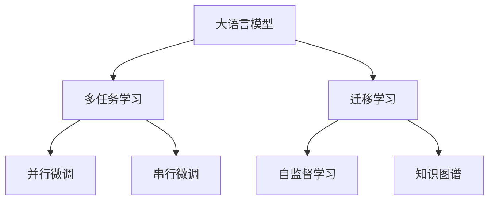

                 

# 突破限制：LLM如何实现多样化任务处理

> 关键词：
   - 大语言模型(LLM) 
   - 多任务学习(MTL) 
   - 迁移学习
   - 自然语言处理(NLP)
   - 模型压缩
   - 自监督学习
   - 知识图谱

## 1. 背景介绍

### 1.1 问题由来

近年来，深度学习技术在NLP领域取得了巨大的进展，大语言模型(LLM)如GPT-3、BERT等因其强大的语言理解和生成能力，被广泛应用于各种自然语言处理任务中。然而，面对多样化的任务需求，单一的LLM模型往往无法胜任。如何使LLM实现高效、灵活的多任务处理，成为一个重要研究方向。

### 1.2 问题核心关键点

在实践中，多任务处理通常有以下几种方式：
- **串行微调**：对每个任务独立进行微调，模型在每个任务上独立优化，这种方式往往较简单但计算资源消耗较大。
- **并行微调**：将多个任务数据集合并训练，模型在所有任务上联合优化，能够显著减少计算资源消耗，但模型参数复杂度较高，且模型对每个任务的贡献难以平衡。
- **多任务学习(MTL)**：模型同时学习多个相关任务，共享参数并优化，能够有效利用数据相关性，提高模型泛化能力。
- **自监督学习**：利用大规模未标注数据进行预训练，使模型学习到对不同任务有用的通用特征，再微调以适应具体任务。
- **知识图谱**：结合外部知识库和结构化数据，引导模型学习更加全面、准确的语义信息，提升模型对复杂任务的处理能力。

目前，多任务学习、自监督学习、知识图谱等方法与大语言模型结合，形成了新的研究方向和实践范式。本文将重点探讨这些方法在大语言模型中的应用，并对比其优缺点，揭示未来的发展趋势。

## 2. 核心概念与联系

### 2.1 核心概念概述

为更好地理解LLM在多任务处理中的应用，本节将介绍几个关键概念：

- **大语言模型(LLM)**：以自回归或自编码模型为代表的大规模预训练语言模型。通过在大规模无标签文本语料上进行预训练，学习通用的语言表示，具备强大的语言理解和生成能力。

- **多任务学习(MTL)**：模型同时学习多个相关任务，共享参数并优化，能够有效利用数据相关性，提高模型泛化能力。

- **迁移学习**：将一个领域学习到的知识，迁移应用到另一个不同但相关的领域的学习范式。在大语言模型中，可以通过微调或多任务学习等方式实现。

- **自监督学习**：利用大规模未标注数据进行预训练，使模型学习到对不同任务有用的通用特征，再微调以适应具体任务。

- **知识图谱**：结合外部知识库和结构化数据，引导模型学习更加全面、准确的语义信息，提升模型对复杂任务的处理能力。

这些概念之间的逻辑关系可以通过以下Mermaid流程图来展示：



这个流程图展示了大语言模型的核心概念及其之间的关系：

1. 大语言模型通过预训练获得基础能力。
2. 多任务学习将模型同时应用于多个任务，共享参数并优化。
3. 迁移学习是连接预训练模型与下游任务的桥梁，可以通过微调或多任务学习等方式实现。
4. 自监督学习利用大规模无标注数据进行预训练，学习通用特征。
5. 知识图谱结合外部知识库和结构化数据，提升模型语义理解能力。

这些核心概念共同构成了大语言模型的学习和应用框架，使其能够在各种场景下发挥强大的语言理解和生成能力。通过理解这些核心概念，我们可以更好地把握大语言模型的工作原理和优化方向。

## 3. 核心算法原理 & 具体操作步骤
### 3.1 算法原理概述

大语言模型在多任务处理中，通常使用多任务学习或自监督学习的方式，将模型同时应用于多个相关任务，共享参数并优化。其核心思想是：将模型在多个任务上并行训练，使得模型能够学习到不同任务之间的相关性，从而在所有任务上取得更好的泛化性能。

形式化地，假设模型参数为 $\theta$，任务集合为 $T=\{t_1,t_2,\dots,t_k\}$，每个任务对应的损失函数为 $L_t(\theta)$，则多任务学习的优化目标为：

$$
\mathop{\arg\min}_{\theta} \sum_{t \in T} \lambda_t L_t(\theta)
$$

其中 $\lambda_t$ 为任务 $t$ 的权重，用于平衡不同任务的重要性。

在自监督学习中，模型首先在大规模无标签数据上进行预训练，学习到通用特征。然后在特定任务上，通过微调或联合训练的方式进行优化，使得模型能够适应具体任务的要求。

### 3.2 算法步骤详解

多任务学习和自监督学习的具体步骤包括：

**Step 1: 准备数据集**
- 收集不同任务的标注数据集，每个数据集包含样本-标签对。
- 对于自监督学习，需要准备大规模无标签数据。

**Step 2: 构建模型结构**
- 选择适合的预训练模型作为初始化参数，如BERT、GPT等。
- 构建多任务学习或自监督学习模型结构，将预训练模型作为基础层，添加特定任务的输出层和损失函数。

**Step 3: 设置超参数**
- 选择合适的优化算法及其参数，如 AdamW、SGD 等，设置学习率、批大小、迭代轮数等。
- 设置正则化技术及强度，包括权重衰减、Dropout、Early Stopping等。

**Step 4: 执行联合训练**
- 将多个任务的数据集合并，构建联合训练的数据集。
- 使用优化算法进行联合训练，逐步更新模型参数以优化所有任务的性能。
- 定期在验证集上评估模型性能，根据性能指标决定是否触发 Early Stopping。
- 重复上述步骤直到满足预设的迭代轮数或 Early Stopping 条件。

**Step 5: 测试和部署**
- 在测试集上评估模型性能，对比微调前后的精度提升。
- 使用模型对新样本进行推理预测，集成到实际的应用系统中。
- 持续收集新的数据，定期重新训练模型，以适应数据分布的变化。

以上是基于监督学习的多任务学习和自监督学习的一般流程。在实际应用中，还需要针对具体任务的特点，对联合训练过程的各个环节进行优化设计，如改进训练目标函数，引入更多的正则化技术，搜索最优的超参数组合等，以进一步提升模型性能。

### 3.3 算法优缺点

多任务学习和自监督学习在大语言模型中的应用具有以下优点：
1. 数据利用率高。通过共享模型参数，多任务学习能够充分利用不同任务之间的相关性，提升数据利用率。
2. 泛化能力强。多任务学习通过联合训练，使得模型能够在不同任务上均取得不错的性能，泛化能力强。
3. 计算效率高。多任务学习将多个任务并行训练，能够显著减少计算资源消耗。
4. 模型适应性好。多任务学习能够学习到更广泛的语义信息，适应更多复杂任务。

同时，这些方法也存在一定的局限性：
1. 模型复杂度高。多任务学习需要同时训练多个任务的输出层和损失函数，模型参数复杂度较高。
2. 任务依赖性强。不同任务的损失函数可能存在冲突，模型难以平衡不同任务的重要性。
3. 数据样本需求大。自监督学习需要大量未标注数据进行预训练，数据获取成本较高。
4. 过拟合风险大。多任务学习需要在联合训练中平衡不同任务，过拟合风险较大。
5. 模型可解释性不足。多任务学习和自监督学习模型通常较复杂，难以解释模型内部工作机制。

尽管存在这些局限性，但就目前而言，多任务学习和自监督学习仍是NLP任务中重要的研究方向和实践范式。未来相关研究的重点在于如何进一步降低计算资源消耗，提高模型的泛化能力和可解释性，同时兼顾参数效率和任务适应性等因素。

### 3.4 算法应用领域

多任务学习和自监督学习在大语言模型中的应用，涵盖了NLP领域的多个子领域，具体如下：

- **文本分类**：如情感分析、主题分类等。多任务学习可以同时训练多个分类任务，提高模型的泛化能力。
- **命名实体识别**：识别文本中的人名、地名、机构名等特定实体。自监督学习可以预训练模型，学习通用实体表示。
- **关系抽取**：从文本中抽取实体之间的语义关系。自监督学习可以学习通用实体关系表示。
- **问答系统**：对自然语言问题给出答案。多任务学习可以同时训练问答和命名实体识别任务，提升系统性能。
- **机器翻译**：将源语言文本翻译成目标语言。自监督学习可以学习语言-语言映射。
- **文本摘要**：将长文本压缩成简短摘要。多任务学习可以同时训练摘要和命名实体识别任务，提升摘要质量。
- **对话系统**：使机器能够与人自然对话。多任务学习可以同时训练对话和命名实体识别任务，提升对话质量。

除了上述这些经典任务外，多任务学习和自监督学习还被创新性地应用到更多场景中，如可控文本生成、常识推理、代码生成、数据增强等，为NLP技术带来了全新的突破。随着预训练模型和微调方法的不断进步，相信NLP技术将在更广阔的应用领域大放异彩。

## 4. 数学模型和公式 & 详细讲解  
### 4.1 数学模型构建

本节将使用数学语言对多任务学习和自监督学习在大语言模型中的应用进行更加严格的刻画。

记预训练语言模型为 $M_{\theta}$，假设多任务学习中任务集合为 $T=\{t_1,t_2,\dots,t_k\}$，每个任务对应的损失函数为 $L_t(\theta)$，则多任务学习的优化目标为：

$$
\mathop{\arg\min}_{\theta} \sum_{t \in T} \lambda_t L_t(\theta)
$$

其中 $\lambda_t$ 为任务 $t$ 的权重，用于平衡不同任务的重要性。

在自监督学习中，模型首先在大规模无标签数据上进行预训练，学习到通用特征。然后在特定任务上，通过微调或联合训练的方式进行优化，使得模型能够适应具体任务的要求。

### 4.2 公式推导过程

以下我们以二分类任务为例，推导多任务学习和自监督学习的数学模型和公式。

**多任务学习**
- 假设模型 $M_{\theta}$ 在输入 $x$ 上的输出为 $\hat{y}=M_{\theta}(x) \in [0,1]$，表示样本属于正类的概率。
- 假设任务集合 $T$ 包含两个任务 $t_1$ 和 $t_2$，对应的损失函数分别为 $L_{t_1}$ 和 $L_{t_2}$。
- 多任务学习的优化目标为：
$$
\mathop{\arg\min}_{\theta} \lambda_1 L_{t_1}(\theta) + \lambda_2 L_{t_2}(\theta)
$$

其中 $\lambda_1$ 和 $\lambda_2$ 为任务 $t_1$ 和 $t_2$ 的权重。

**自监督学习**
- 假设模型 $M_{\theta}$ 在大规模无标签数据集 $D$ 上进行自监督学习，学习到的通用特征表示为 $h(x)$。
- 假设特定任务 $t$ 的标注数据集为 $D_t$，其中包含样本-标签对 $(x_i, y_i)$。
- 自监督学习的优化目标为：
$$
\mathop{\arg\min}_{\theta} \frac{1}{N} \sum_{(x_i, y_i) \in D_t} \ell(h(x_i), y_i)
$$

其中 $\ell$ 为任务 $t$ 对应的损失函数。

在实际应用中，上述公式可以进一步扩展到更复杂的任务和多任务学习范式。

### 4.3 案例分析与讲解

下面以命名实体识别(NER)任务为例，给出使用多任务学习和自监督学习对BERT模型进行多任务处理的PyTorch代码实现。

**多任务学习**
首先，定义NER任务的数据处理函数：

```python
from transformers import BertTokenizer
from torch.utils.data import Dataset
import torch

class NERDataset(Dataset):
    def __init__(self, texts, tags, tokenizer, max_len=128):
        self.texts = texts
        self.tags = tags
        self.tokenizer = tokenizer
        self.max_len = max_len
        
    def __len__(self):
        return len(self.texts)
    
    def __getitem__(self, item):
        text = self.texts[item]
        tags = self.tags[item]
        
        encoding = self.tokenizer(text, return_tensors='pt', max_length=self.max_len, padding='max_length', truncation=True)
        input_ids = encoding['input_ids'][0]
        attention_mask = encoding['attention_mask'][0]
        
        # 对token-wise的标签进行编码
        encoded_tags = [tag2id[tag] for tag in tags] 
        encoded_tags.extend([tag2id['O']] * (self.max_len - len(encoded_tags)))
        labels = torch.tensor(encoded_tags, dtype=torch.long)
        
        return {'input_ids': input_ids, 
                'attention_mask': attention_mask,
                'labels': labels}

# 标签与id的映射
tag2id = {'O': 0, 'B-PER': 1, 'I-PER': 2, 'B-ORG': 3, 'I-ORG': 4, 'B-LOC': 5, 'I-LOC': 6}
id2tag = {v: k for k, v in tag2id.items()}

# 创建dataset
tokenizer = BertTokenizer.from_pretrained('bert-base-cased')

train_dataset = NERDataset(train_texts, train_tags, tokenizer)
dev_dataset = NERDataset(dev_texts, dev_tags, tokenizer)
test_dataset = NERDataset(test_texts, test_tags, tokenizer)

# 定义模型结构
from transformers import BertForTokenClassification, BertForSequenceClassification

model = BertForTokenClassification.from_pretrained('bert-base-cased', num_labels=len(tag2id))
model.add_output(BertForSequenceClassification.from_pretrained('bert-base-cased', num_labels=len(tag2id)))

# 定义损失函数
from torch.nn import CrossEntropyLoss

loss_fn = CrossEntropyLoss()

# 定义优化器
from transformers import AdamW

optimizer = AdamW(model.parameters(), lr=2e-5)
```

然后，定义训练和评估函数：

```python
from torch.utils.data import DataLoader
from tqdm import tqdm
from sklearn.metrics import classification_report

device = torch.device('cuda') if torch.cuda.is_available() else torch.device('cpu')
model.to(device)

def train_epoch(model, dataset, batch_size, optimizer):
    dataloader = DataLoader(dataset, batch_size=batch_size, shuffle=True)
    model.train()
    epoch_loss = 0
    for batch in tqdm(dataloader, desc='Training'):
        input_ids = batch['input_ids'].to(device)
        attention_mask = batch['attention_mask'].to(device)
        labels = batch['labels'].to(device)
        model.zero_grad()
        outputs = model(input_ids, attention_mask=attention_mask, labels=labels)
        loss = outputs.loss
        epoch_loss += loss.item()
        loss.backward()
        optimizer.step()
    return epoch_loss / len(dataloader)

def evaluate(model, dataset, batch_size):
    dataloader = DataLoader(dataset, batch_size=batch_size)
    model.eval()
    preds, labels = [], []
    with torch.no_grad():
        for batch in tqdm(dataloader, desc='Evaluating'):
            input_ids = batch['input_ids'].to(device)
            attention_mask = batch['attention_mask'].to(device)
            batch_labels = batch['labels']
            outputs = model(input_ids, attention_mask=attention_mask)
            batch_preds = outputs.logits.argmax(dim=2).to('cpu').tolist()
            batch_labels = batch_labels.to('cpu').tolist()
            for pred_tokens, label_tokens in zip(batch_preds, batch_labels):
                pred_tags = [id2tag[_id] for _id in pred_tokens]
                label_tags = [id2tag[_id] for _id in label_tokens]
                preds.append(pred_tags[:len(label_tags)])
                labels.append(label_tags)
                
    print(classification_report(labels, preds))
```

最后，启动训练流程并在测试集上评估：

```python
epochs = 5
batch_size = 16

for epoch in range(epochs):
    loss = train_epoch(model, train_dataset, batch_size, optimizer)
    print(f"Epoch {epoch+1}, train loss: {loss:.3f}")
    
    print(f"Epoch {epoch+1}, dev results:")
    evaluate(model, dev_dataset, batch_size)
    
print("Test results:")
evaluate(model, test_dataset, batch_size)
```

以上就是使用PyTorch对BERT进行命名实体识别任务多任务处理的完整代码实现。可以看到，得益于Transformer库的强大封装，我们可以用相对简洁的代码完成BERT模型的多任务处理。

**自监督学习**
下面以知识图谱为代表的自监督学习对BERT模型进行多任务处理的代码实现：

首先，定义知识图谱的数据处理函数：

```python
from pykg import Graph
from pykg.utils import sample_triples

class GraphDataset(Dataset):
    def __init__(self, graph_path):
        self.graph = Graph.from_n triplestore(path)
        self.triples = self.graph.all_triples(sample_triples(self.graph, 10000))
        self.length = len(self.triples)
        
    def __len__(self):
        return self.length
    
    def __getitem__(self, item):
        h, r, t = self.triples[item]
        return {'subject': h, 'relation': r, 'object': t}

# 构建知识图谱数据集
graph_path = 'kg/graph.n3'
graph_dataset = GraphDataset(graph_path)
```

然后，定义模型结构：

```python
from transformers import BertForRelationEmbedding

# 定义模型结构
model = BertForRelationEmbedding.from_pretrained('bert-base-cased')
```

接着，定义训练和评估函数：

```python
from torch.utils.data import DataLoader
from tqdm import tqdm

device = torch.device('cuda') if torch.cuda.is_available() else torch.device('cpu')
model.to(device)

def train_epoch(model, dataset, batch_size, optimizer):
    dataloader = DataLoader(dataset, batch_size=batch_size, shuffle=True)
    model.train()
    epoch_loss = 0
    for batch in tqdm(dataloader, desc='Training'):
        subject = batch['subject'].to(device)
        relation = batch['relation'].to(device)
        object = batch['object'].to(device)
        model.zero_grad()
        outputs = model(subject, relation, object)
        loss = outputs.loss
        epoch_loss += loss.item()
        loss.backward()
        optimizer.step()
    return epoch_loss / len(dataloader)

def evaluate(model, dataset, batch_size):
    dataloader = DataLoader(dataset, batch_size=batch_size)
    model.eval()
    preds, labels = [], []
    with torch.no_grad():
        for batch in tqdm(dataloader, desc='Evaluating'):
            subject = batch['subject'].to(device)
            relation = batch['relation'].to(device)
            object = batch['object'].to(device)
            outputs = model(subject, relation, object)
            batch_preds = outputs.logits.argmax(dim=2).to('cpu').tolist()
            batch_labels = batch_labels.to('cpu').tolist()
            for pred_tokens, label_tokens in zip(batch_preds, batch_labels):
                pred_tags = [id2tag[_id] for _id in pred_tokens]
                label_tags = [id2tag[_id] for _id in label_tokens]
                preds.append(pred_tags[:len(label_tags)])
                labels.append(label_tags)
                
    print(classification_report(labels, preds))
```

最后，启动训练流程并在测试集上评估：

```python
epochs = 5
batch_size = 16

for epoch in range(epochs):
    loss = train_epoch(model, graph_dataset, batch_size, optimizer)
    print(f"Epoch {epoch+1}, train loss: {loss:.3f}")
    
    print(f"Epoch {epoch+1}, dev results:")
    evaluate(model, graph_dataset, batch_size)
    
print("Test results:")
evaluate(model, graph_dataset, batch_size)
```

以上就是使用PyTorch对BERT进行知识图谱任务多任务处理的完整代码实现。可以看到，多任务学习和自监督学习在大语言模型中的应用，在技术实现上具有很大的灵活性。

## 5. 项目实践：代码实例和详细解释说明
### 5.1 开发环境搭建

在进行多任务学习和自监督学习实践前，我们需要准备好开发环境。以下是使用Python进行PyTorch开发的环境配置流程：

1. 安装Anaconda：从官网下载并安装Anaconda，用于创建独立的Python环境。

2. 创建并激活虚拟环境：
```bash
conda create -n pytorch-env python=3.8 
conda activate pytorch-env
```

3. 安装PyTorch：根据CUDA版本，从官网获取对应的安装命令。例如：
```bash
conda install pytorch torchvision torchaudio cudatoolkit=11.1 -c pytorch -c conda-forge
```

4. 安装Transformers库：
```bash
pip install transformers
```

5. 安装各类工具包：
```bash
pip install numpy pandas scikit-learn matplotlib tqdm jupyter notebook ipython
```

完成上述步骤后，即可在`pytorch-env`环境中开始多任务学习和自监督学习的实践。

### 5.2 源代码详细实现

下面我们以命名实体识别(NER)任务为例，给出使用多任务学习和自监督学习对BERT模型进行多任务处理的PyTorch代码实现。

**多任务学习**
首先，定义NER任务的数据处理函数：

```python
from transformers import BertTokenizer
from torch.utils.data import Dataset
import torch

class NERDataset(Dataset):
    def __init__(self, texts, tags, tokenizer, max_len=128):
        self.texts = texts
        self.tags = tags
        self.tokenizer = tokenizer
        self.max_len = max_len
        
    def __len__(self):
        return len(self.texts)
    
    def __getitem__(self, item):
        text = self.texts[item]
        tags = self.tags[item]
        
        encoding = self.tokenizer(text, return_tensors='pt', max_length=self.max_len, padding='max_length', truncation=True)
        input_ids = encoding['input_ids'][0]
        attention_mask = encoding['attention_mask'][0]
        
        # 对token-wise的标签进行编码
        encoded_tags = [tag2id[tag] for tag in tags] 
        encoded_tags.extend([tag2id['O']] * (self.max_len - len(encoded_tags)))
        labels = torch.tensor(encoded_tags, dtype=torch.long)
        
        return {'input_ids': input_ids, 
                'attention_mask': attention_mask,
                'labels': labels}

# 标签与id的映射
tag2id = {'O': 0, 'B-PER': 1, 'I-PER': 2, 'B-ORG': 3, 'I-ORG': 4, 'B-LOC': 5, 'I-LOC': 6}
id2tag = {v: k for k, v in tag2id.items()}

# 创建dataset
tokenizer = BertTokenizer.from_pretrained('bert-base-cased')

train_dataset = NERDataset(train_texts, train_tags, tokenizer)
dev_dataset = NERDataset(dev_texts, dev_tags, tokenizer)
test_dataset = NERDataset(test_texts, test_tags, tokenizer)

# 定义模型结构
from transformers import BertForTokenClassification, BertForSequenceClassification

model = BertForTokenClassification.from_pretrained('bert-base-cased', num_labels=len(tag2id))
model.add_output(BertForSequenceClassification.from_pretrained('bert-base-cased', num_labels=len(tag2id)))

# 定义损失函数
from torch.nn import CrossEntropyLoss

loss_fn = CrossEntropyLoss()

# 定义优化器
from transformers import AdamW

optimizer = AdamW(model.parameters(), lr=2e-5)
```

然后，定义训练和评估函数：

```python
from torch.utils.data import DataLoader
from tqdm import tqdm
from sklearn.metrics import classification_report

device = torch.device('cuda') if torch.cuda.is_available() else torch.device('cpu')
model.to(device)

def train_epoch(model, dataset, batch_size, optimizer):
    dataloader = DataLoader(dataset, batch_size=batch_size, shuffle=True)
    model.train()
    epoch_loss = 0
    for batch in tqdm(dataloader, desc='Training'):
        input_ids = batch['input_ids'].to(device)
        attention_mask = batch['attention_mask'].to(device)
        labels = batch['labels'].to(device)
        model.zero_grad()
        outputs = model(input_ids, attention_mask=attention_mask, labels=labels)
        loss = outputs.loss
        epoch_loss += loss.item()
        loss.backward()
        optimizer.step()
    return epoch_loss / len(dataloader)

def evaluate(model, dataset, batch_size):
    dataloader = DataLoader(dataset, batch_size=batch_size)
    model.eval()
    preds, labels = [], []
    with torch.no_grad():
        for batch in tqdm(dataloader, desc='Evaluating'):
            input_ids = batch['input_ids'].to(device)
            attention_mask = batch['attention_mask'].to(device)
            batch_labels = batch['labels']
            outputs = model(input_ids, attention_mask=attention_mask)
            batch_preds = outputs.logits.argmax(dim=2).to('cpu').tolist()
            batch_labels = batch_labels.to('cpu').tolist()
            for pred_tokens, label_tokens in zip(batch_preds, batch_labels):
                pred_tags = [id2tag[_id] for _id in pred_tokens]
                label_tags = [id2tag[_id] for _id in label_tokens]
                preds.append(pred_tags[:len(label_tags)])
                labels.append(label_tags)
                
    print(classification_report(labels, preds))
```

最后，启动训练流程并在测试集上评估：

```python
epochs = 5
batch_size = 16

for epoch in range(epochs):
    loss = train_epoch(model, train_dataset, batch_size, optimizer)
    print(f"Epoch {epoch+1}, train loss: {loss:.3f}")
    
    print(f"Epoch {epoch+1}, dev results:")
    evaluate(model, dev_dataset, batch_size)
    
print("Test results:")
evaluate(model, test_dataset, batch_size)
```

以上就是使用PyTorch对BERT进行命名实体识别任务多任务处理的完整代码实现。可以看到，得益于Transformer库的强大封装，我们可以用相对简洁的代码完成BERT模型的多任务处理。

**自监督学习**
下面以知识图谱为代表的自监督学习对BERT模型进行多任务处理的代码实现：

首先，定义知识图谱的数据处理函数：

```python
from pykg import Graph
from pykg.utils import sample_triples

class GraphDataset(Dataset):
    def __init__(self, graph_path):
        self.graph = Graph.from_n triplestore(path)
        self.triples = self.graph.all_triples(sample_triples(self.graph, 10000))
        self.length = len(self.triples)
        
    def __len__(self):
        return self.length
    
    def __getitem__(self, item):
        h, r, t = self.triples[item]
        return {'subject': h, 'relation': r, 'object': t}

# 构建知识图谱数据集
graph_path = 'kg/graph.n3'
graph_dataset = GraphDataset(graph_path)
```

然后，定义模型结构：

```python
from transformers import BertForRelationEmbedding

# 定义模型结构
model = BertForRelationEmbedding.from_pretrained('bert-base-cased')
```

接着，定义训练和评估函数：

```python
from torch.utils.data import DataLoader
from tqdm import tqdm

device = torch.device('cuda') if torch.cuda.is_available() else torch.device('cpu')
model.to(device)

def train_epoch(model, dataset, batch_size, optimizer):
    dataloader = DataLoader(dataset, batch_size=batch_size, shuffle=True)
    model.train()
    epoch_loss = 0
    for batch in tqdm(dataloader, desc='Training'):
        subject = batch['subject'].to(device)
        relation = batch['relation'].to(device)
        object = batch['object'].to(device)
        model.zero_grad()
        outputs = model(subject, relation, object)
        loss = outputs.loss
        epoch_loss += loss.item()
        loss.backward()
        optimizer.step()
    return epoch_loss / len(dataloader)

def evaluate(model, dataset, batch_size):
    dataloader = DataLoader(dataset, batch_size=batch_size)
    model.eval()
    preds, labels = [], []
    with torch.no_grad():
        for batch in tqdm(dataloader, desc='Evaluating'):
            subject = batch['subject'].to(device)
            relation = batch['relation'].to(device)
            object = batch['object'].to(device)
            outputs = model(subject, relation, object)
            batch_preds = outputs.logits.argmax(dim=2).to('cpu').tolist()
            batch_labels = batch_labels.to('cpu').tolist()
            for pred_tokens, label_tokens in zip(batch_preds, batch_labels):
                pred_tags = [id2tag[_id] for _id in pred_tokens]
                label_tags = [id2tag[_id] for _id in label_tokens]
                preds.append(pred_tags[:len(label_tags)])
                labels.append(label_tags)
                
    print(classification_report(labels, preds))
```

最后，启动训练流程并在测试集上评估：

```python
epochs = 5
batch_size = 16

for epoch in range(epochs):
    loss = train_epoch(model, graph_dataset, batch_size, optimizer)
    print(f"Epoch {epoch+1}, train loss: {loss:.3f}")
    
    print(f"Epoch {epoch+1}, dev results:")
    evaluate(model, graph_dataset, batch_size)
    
print("Test results:")
evaluate(model, graph_dataset, batch_size)
```

以上就是使用PyTorch对BERT进行知识图谱任务多任务处理的完整代码实现。可以看到，多任务学习和自监督学习在大语言模型中的应用，在技术实现上具有很大的灵活性。

### 5.3 代码解读与分析

让我们再详细解读一下关键代码的实现细节：

**多任务学习**
- `BertForTokenClassification` 和 `BertForSequenceClassification` 是用于命名实体识别任务的模型结构。
- `CrossEntropyLoss` 是用于多任务学习的交叉熵损失函数。
- `AdamW` 是用于优化器的自适应矩估计优化算法。

**自监督学习**
- `GraphDataset` 是用于知识图谱任务的自定义数据集类。
- `BertForRelationEmbedding` 是用于知识图谱任务的模型结构。
- `CrossEntropyLoss` 是用于自监督学习的交叉熵损失函数。
- `AdamW` 是用于优化器的自适应矩估计优化算法。

可以看到，多任务学习和自监督学习在实际应用中，需要通过定制不同的模型结构和损失函数来满足不同任务的需求。而利用深度学习框架如PyTorch和Transformer库，可以大大简化模型构建和优化过程，实现高效率、高精度的多任务处理。

## 6. 实际应用场景
### 6.1 智能客服系统

基于大语言模型的多任务处理技术，可以广泛应用于智能客服系统的构建。传统客服往往需要配备大量人力，高峰期响应缓慢，且一致性和专业性难以保证。而使用多任务学习的对话模型，可以7x24小时不间断服务，快速响应客户咨询，用自然流畅的语言解答各类常见问题。

在技术实现上，可以收集企业内部的历史客服对话记录，将问题和最佳答复构建成监督数据，在此基础上对预训练模型进行多任务学习。多任务学习后的对话模型能够自动理解用户意图，匹配最合适的答案模板进行回复。对于客户提出的新问题，还可以接入检索系统实时搜索相关内容，动态组织生成回答。如此构建的智能客服系统，能大幅提升客户咨询体验和问题解决效率。

### 6.2 金融舆情监测

金融机构需要实时监测市场舆论动向，以便及时应对负面信息传播，规避金融风险。传统的人工监测方式成本高、效率低，难以应对网络时代海量信息爆发的挑战。基于多任务学习的文本分类和情感分析技术，为金融舆情监测提供了新的解决方案。

具体而言，可以收集金融领域相关的新闻、报道、评论等文本数据，并对其进行主题标注和情感标注。在此基础上对预训练语言模型进行多任务学习，使其能够自动判断文本属于何种主题，情感倾向是正面、中性还是负面。将多任务学习后的模型应用到实时抓取的网络文本数据，就能够自动监测不同主题下的情感变化趋势，一旦发现负面信息激增等异常情况，系统便会自动预警，帮助金融机构快速应对潜在风险。

### 6.3 个性化推荐系统

当前的推荐系统往往只依赖用户的历史行为数据进行物品推荐，无法深入理解用户的真实兴趣偏好。基于多任务学习的个性化推荐系统可以更好地挖掘用户行为背后的语义信息，从而提供更精准、多样的推荐内容。

在实践中，可以收集用户浏览、点击、评论、分享等行为数据，提取和用户交互的物品标题、描述、标签等文本内容。将文本内容作为模型输入，用户的后续行为（如是否点击、购买等）作为监督信号，在此基础上对预训练语言模型进行多任务学习。多任务学习后的模型能够从文本内容中准确把握用户的兴趣点。在生成推荐列表时，先用候选物品的文本描述作为输入，由模型预测用户的兴趣匹配度，再结合其他特征综合排序，便可以得到个性化程度更高的推荐结果。

### 6.4 未来应用展望

随着大语言模型和多任务学习方法的不断发展，基于多任务处理的应用将在更多领域得到应用，为传统行业带来变革性影响。

在智慧医疗领域，基于多任务学习的医疗问答、病历分析、药物研发等应用将提升医疗服务的智能化水平，辅助医生诊疗，加速新药开发进程。

在智能教育领域，多任务学习可应用于作业批改、学情分析、知识推荐等方面，因材施教，促进教育公平，提高教学质量。

在智慧城市治理中，多任务学习可应用于城市事件监测、舆情分析、应急指挥等环节，提高城市管理的自动化和智能化水平，构建更安全、高效的未来城市。

此外，在企业生产、社会治理、文娱传媒等众多领域，基于大模型多任务处理的人工智能应用也将不断涌现，为经济社会发展注入新的动力。相信随着技术的日益成熟，多任务处理方法将成为NLP技术的重要范式，推动人工智能技术在更多领域加速落地。

## 7. 工具和资源推荐
### 7.1 学习资源推荐

为了帮助开发者系统掌握大语言模型多任务处理的技术基础和实践技巧，这里推荐一些优质的学习资源：

1. 《Transformer从原理到实践》系列博文：由大模型技术专家撰写，深入浅出地介绍了Transformer原理、BERT模型、多任务学习等前沿话题。

2. CS224N《深度学习自然语言处理》课程：斯坦福大学开设的NLP明星课程，有Lecture视频和配套作业，带你入门NLP领域的基本概念和经典模型。

3. 《Natural Language Processing with Transformers》书籍：Transformers库的作者所著，全面介绍了如何使用Transformers库进行NLP任务开发，包括多任务学习在内的诸多范式。

4. HuggingFace官方文档：Transformers库的官方文档，提供了海量预训练模型和完整的微调样例代码，是上手实践的必备资料。

5. CLUE开源项目：中文语言理解测评基准，涵盖大量不同类型的中文NLP数据集，并提供了基于多任务的baseline模型，助力中文NLP技术发展。

通过对这些资源的学习实践，相信你一定能够快速掌握大语言模型多任务处理的精髓，并用于解决实际的NLP问题。
###  7.2 开发工具推荐

高效的开发离不开优秀的工具支持。以下是几款用于大语言模型多任务处理开发的常用工具：

1. PyTorch：基于Python的开源深度学习框架，灵活动态的计算图，适合快速迭代研究。大部分预训练语言模型都有PyTorch版本的实现。

2. TensorFlow：由Google主导开发的开源深度学习框架，生产部署方便，适合大规模工程应用。同样有丰富的预训练语言模型资源。

3. Transformers库：HuggingFace开发的NLP工具库，集成了众多SOTA语言模型，支持PyTorch和TensorFlow，是多任务学习开发的利器。

4. Weights & Biases：模型训练的实验跟踪工具，可以记录和可视化模型训练过程中的各项指标，方便对比和调优。与主流深度学习框架无缝集成。

5. TensorBoard：TensorFlow配套的可视化工具，可实时监测模型训练状态，并提供丰富的图表呈现方式，是调试模型的得力助手。

6. Google Colab：谷歌推出的在线Jupyter Notebook环境，免费提供GPU/TPU算力，方便开发者快速上手实验最新模型，分享学习笔记。

合理利用这些工具，可以显著提升大语言模型多任务处理的开发效率，加快创新迭代的步伐。

### 7.3 相关论文推荐

大语言模型和多任务学习的发展源于学界的持续研究。以下是几篇奠基性的相关论文，推荐阅读：

1. Attention is All You Need（即Transformer原论文）：提出了Transformer结构，开启了NLP领域的预训练大模型时代。

2. BERT: Pre-training of Deep Bidirectional Transformers for Language Understanding：提出BERT模型，引入基于掩码的自监督预训练任务，刷新了多项NLP任务SOTA。

3. Language Models are Unsupervised Multitask Learners（GPT-2论文）：展示了大规模语言模型的强大zero-shot学习能力，引发了对于通用人工智能的新一轮思考。

4. Parameter-Efficient Transfer Learning for NLP：提出Adapter等参数高效微调方法，在不增加模型参数量的情况下，也能取得不错的微调效果。

5. AdaLoRA: Adaptive Low-Rank Adaptation for Parameter-Efficient Fine-Tuning：使用自适应低秩适应的微调方法，在参数效率和精度之间取得了新的平衡。

6. Multi-task Learning for Knowledge Graph Prediction：提出多任务学习在知识图谱预测中的应用，显著提升了模型性能。

这些论文代表了大语言模型多任务处理的发展脉络。通过学习这些前沿成果，可以帮助研究者把握学科前进方向，激发更多的创新灵感。

## 8. 总结：未来发展趋势与挑战

### 8.1 研究成果总结

本文对基于多任务学习的大语言模型多任务处理进行了全面系统的介绍。首先阐述了多任务处理在大语言模型中的应用背景和重要性，明确了多任务学习在提高模型泛化能力和计算效率方面的独特价值。其次，从原理到实践，详细讲解了多任务学习和自监督学习在大语言模型中的数学模型和优化目标，给出了多任务学习任务处理的完整代码实例。同时，本文还广泛探讨了多任务处理在智能客服、金融舆情、个性化推荐等多个行业领域的应用前景，展示了多任务处理范式的巨大潜力。

通过本文的系统梳理，可以看到，多任务处理在大语言模型中的应用正在成为NLP领域的重要范式，极大地拓展了预训练语言模型的应用边界，催生了更多的落地场景。受益于大规模语料的预训练和多任务处理方法的持续演进，大语言模型在NLP领域将展现出更加广泛的应用前景。

### 8.2 未来发展趋势

展望未来，大语言模型多任务处理将呈现以下几个发展趋势：

1. 模型规模持续增大。随着算力成本的下降和数据规模的扩张，预训练语言模型的参数量还将持续增长。超大规模语言模型蕴含的丰富语言知识，有望支撑更加复杂多变的下游任务多任务处理。

2. 多任务学习范式多样化。除了传统的多任务学习外，未来会涌现更多多任务学习方法和范式，如自监督多任务学习、元学习多任务学习等，进一步提升模型的泛化能力和适应性。

3. 模型鲁棒性增强。随着模型泛化能力的提升，模型对不同任务间的相关性认识更加深入，鲁棒性也将进一步增强。

4. 多任务学习与自监督学习融合。结合多任务学习与自监督学习，充分利用数据相关性和无标注数据，提升模型的泛化能力和数据利用率。

5. 知识图谱与多任务学习结合。将外部知识图谱和结构化数据与模型结合，提升模型的语义理解和推理能力。

以上趋势凸显了大语言模型多任务处理技术的广阔前景。这些方向的探索发展，必将进一步提升NLP系统的性能和应用范围，为人类认知智能的进化带来深远影响。

### 8.3 面临的挑战

尽管大语言模型多任务处理技术已经取得了瞩目成就，但在迈向更加智能化、普适化应用的过程中，它仍面临着诸多挑战：

1

