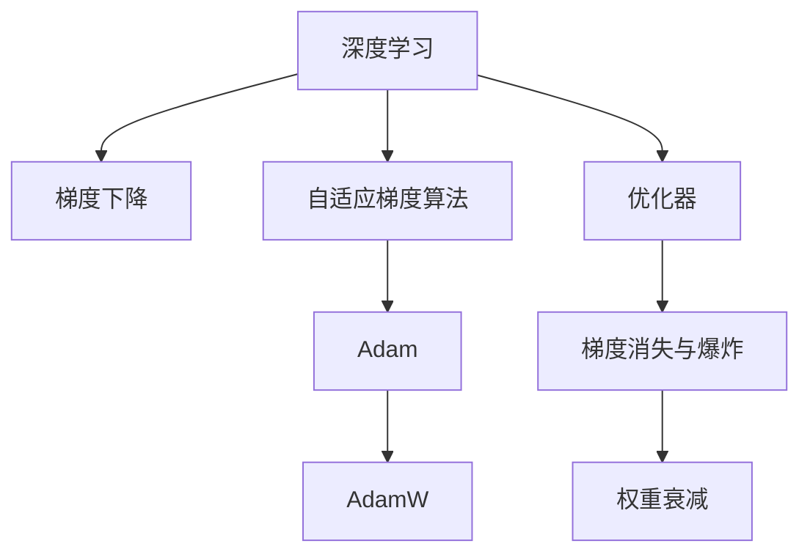

                 

# 第七章：初始化、优化和 AdamW 算法

> 关键词：初始化,优化,AdamW算法,深度学习,梯度下降,机器学习,神经网络

## 1. 背景介绍

### 1.1 问题由来
在深度学习模型训练过程中，初始化、优化和梯度下降等关键环节对模型的性能和收敛速度有着深远影响。然而，传统的梯度下降算法（如随机梯度下降Stochastic Gradient Descent, SGD）以及其改进版本如动量(Momentum)、自适应梯度(Adaptive Gradient, AdaGrad)、自适应矩估计(Adaptive Moment Estimation, Adam)等，仍存在梯度方差过大、收敛速度慢等问题，难以适应大规模、高复杂度的深度学习任务。为了应对这些挑战，近年来学术界提出了一系列先进的优化算法，其中AdamW算法因其高效的收敛速度和较低的内存占用而备受关注。本章将系统介绍AdamW算法的核心原理、操作流程以及在不同场景中的应用，以期为深度学习模型训练提供参考。

### 1.2 问题核心关键点
AdamW算法作为当前深度学习模型训练的主流优化算法，其核心要点包括：
- 自适应学习率：通过对梯度的历史信息进行加权平均，动态调整每个参数的学习率。
- 权重衰减：避免过拟合，同时保持模型在训练后期依然能够更新。
- 对抗梯度消失与爆炸：在处理稀疏梯度时，保持梯度更新的稳定性。
- 高效的内存使用：通过降低模型参数更新频率，减少内存占用。

了解AdamW算法的这些核心要点，将有助于更好地掌握其在深度学习训练中的实际应用。

## 2. 核心概念与联系

### 2.1 核心概念概述

在介绍AdamW算法前，我们先梳理一些与之密切相关的核心概念：

- 深度学习（Deep Learning）：一种通过多层神经网络实现高维特征表示学习的机器学习技术。
- 梯度下降（Gradient Descent）：一种通过不断调整模型参数来最小化损失函数的优化方法。
- 自适应梯度算法（Adaptive Gradient Algorithm）：一类基于梯度信息自适应调整学习率或梯度更新方向的优化算法。
- 梯度消失与爆炸（Vanishing and Exploding Gradients）：深度神经网络训练时，梯度在反向传播过程中可能变得非常小（消失）或非常大（爆炸），导致训练困难。
- 权重衰减（Weight Decay）：一种正则化技术，通过在损失函数中加入L2范数，防止模型过拟合。
- 优化器（Optimizer）：负责在模型训练过程中，基于梯度信息更新模型参数的算法。

通过这些概念的梳理，我们将能够更好地理解AdamW算法的原理和实际应用。

### 2.2 核心概念原理和架构的 Mermaid 流程图



这个流程图展示了深度学习、梯度下降、自适应梯度算法、AdamW算法和优化器之间的逻辑关系，以及梯度消失与爆炸和权重衰减这两个重要正则化技术的从属关系。通过理解这些核心概念，我们可以更好地把握AdamW算法的工作原理和优化效果。

## 3. 核心算法原理 & 具体操作步骤

### 3.1 算法原理概述

AdamW算法是一种基于Adam算法的改进版，旨在解决传统的自适应梯度算法如Adam在处理高维、稀疏、非平稳数据时存在的问题，如梯度方差大、内存占用高等。其核心思想是：利用梯度的一阶矩估计$m$和二阶矩估计$v$，对梯度进行动态缩放，同时引入权重衰减，防止过拟合，并提升梯度更新的稳定性和收敛速度。

AdamW算法的过程如下：
1. 初始化模型参数$\theta_0$，梯度一阶矩估计$m_0=0$，梯度二阶矩估计$v_0=0$，动量$\beta_1=0.9$，权重衰减$\beta_2=0.999$，权重衰减系数$\epsilon=1e-8$。
2. 对于每个epoch，迭代计算梯度$g_t = \nabla_\theta\mathcal{L}(\theta_t)$，并更新梯度一阶矩估计$m_t$和二阶矩估计$v_t$：
   $m_t = \beta_1m_{t-1}+(1-\beta_1)g_t$
   $v_t = \beta_2v_{t-1}+(1-\beta_2)g_t^2$
3. 对梯度进行缩放：
   $\tilde{g_t} = \frac{g_t}{\sqrt{m_t}+\epsilon}$
4. 更新模型参数：
   $\theta_{t+1} = \theta_t - \alpha\tilde{g_t} - \beta_2\alpha\theta_t$
   其中$\alpha$为学习率。

### 3.2 算法步骤详解

#### 3.2.1 梯度一阶矩估计$m$和二阶矩估计$v$

AdamW算法的核心在于对梯度的一阶矩估计$m$和二阶矩估计$v$进行动态更新。其中$m$表示梯度的一阶矩估计（即梯度均值），$v$表示梯度的二阶矩估计（即梯度平方的均值）。

具体计算公式如下：

$$
m_t = \beta_1m_{t-1} + (1-\beta_1)g_t
$$

$$
v_t = \beta_2v_{t-1} + (1-\beta_2)g_t^2
$$

其中$g_t$表示在第$t$次迭代时，模型参数$\theta_t$对应的梯度。$\beta_1$和$\beta_2$为动量和权重衰减参数，分别默认为0.9和0.999。

#### 3.2.2 梯度缩放

梯度在AdamW算法中进行了缩放，以减少梯度的方差。这一步骤通过将梯度$m_t$和二阶矩估计$v_t$的平方根相加，再除以一个小的常数$\epsilon$来实现：

$$
\tilde{g_t} = \frac{g_t}{\sqrt{m_t}+\epsilon}
$$

其中$\epsilon=1e-8$，避免梯度计算时出现零除错误。

#### 3.2.3 模型参数更新

AdamW算法的模型参数更新公式如下：

$$
\theta_{t+1} = \theta_t - \alpha\tilde{g_t} - \beta_2\alpha\theta_t
$$

其中$\alpha$为学习率。该公式中，除了传统的梯度下降外，还添加了权重衰减项$\beta_2\alpha\theta_t$，其系数为权重衰减参数$\beta_2$和当前学习率$\alpha$的乘积。这一步骤用于防止过拟合，同时保持模型在训练后期依然能够更新。

### 3.3 算法优缺点

#### 3.3.1 优点

1. **收敛速度快**：AdamW算法通过动量机制和权重衰减，能够快速收敛到最优解。
2. **内存占用低**：AdamW算法通过降低模型参数更新频率，减少了内存占用。
3. **处理稀疏梯度能力强**：AdamW算法在处理稀疏梯度时，能够保持梯度更新的稳定性。

#### 3.3.2 缺点

1. **超参数敏感**：AdamW算法的动量和权重衰减参数需要仔细调参，否则可能影响模型性能。
2. **梯度方差大**：AdamW算法在处理高维数据时，梯度方差可能较大，影响收敛效果。

### 3.4 算法应用领域

AdamW算法在深度学习中广泛应用，特别是在大规模模型训练和高维数据处理中表现突出。例如：

1. **图像识别**：AdamW算法被应用于卷积神经网络（CNN）中的模型参数更新，使得模型能够快速收敛到最优解，提高图像识别准确率。
2. **自然语言处理（NLP）**：AdamW算法被应用于序列模型（如LSTM、GRU）的训练，使得模型能够高效处理大规模语料，提升自然语言处理任务的性能。
3. **推荐系统**：AdamW算法被应用于推荐系统的优化，使得模型能够更好地适应用户偏好变化，提升推荐效果。
4. **生成对抗网络（GANs）**：AdamW算法被应用于GANs的生成器和判别器训练，使得模型能够更快地收敛到稳定状态。

## 4. 数学模型和公式 & 详细讲解 & 举例说明

### 4.1 数学模型构建

我们以一个简单的线性回归问题为例，介绍AdamW算法的数学模型构建。

假设模型为$y=\theta_0+\theta_1x+\epsilon$，其中$\theta_0$和$\theta_1$为模型参数，$\epsilon$为噪声项。给定数据集$(x_i,y_i)$，$i=1,\ldots,N$，模型的损失函数为均方误差：

$$
\mathcal{L}(\theta) = \frac{1}{2N}\sum_{i=1}^N (y_i-\theta_0-\theta_1x_i)^2
$$

### 4.2 公式推导过程

AdamW算法的核心在于对梯度的一阶矩估计$m$和二阶矩估计$v$进行动态更新，并根据这些信息对梯度进行缩放。以下是AdamW算法的详细推导过程：

首先，定义梯度$m$和$v$的一阶矩估计和二阶矩估计：

$$
m_t = \beta_1m_{t-1} + (1-\beta_1)g_t
$$

$$
v_t = \beta_2v_{t-1} + (1-\beta_2)g_t^2
$$

其中$g_t = \nabla_\theta\mathcal{L}(\theta_t)$，$\beta_1$和$\beta_2$分别为动量和权重衰减参数。

然后，对梯度进行缩放：

$$
\tilde{g_t} = \frac{g_t}{\sqrt{m_t}+\epsilon}
$$

其中$\epsilon=1e-8$，避免梯度计算时出现零除错误。

最后，更新模型参数：

$$
\theta_{t+1} = \theta_t - \alpha\tilde{g_t} - \beta_2\alpha\theta_t
$$

其中$\alpha$为学习率。

### 4.3 案例分析与讲解

以MNIST手写数字识别任务为例，使用AdamW算法训练一个简单的神经网络模型。

1. **数据准备**：从MNIST数据集中加载训练数据和测试数据。
2. **模型定义**：定义一个包含两个全连接层的神经网络，使用ReLU激活函数。
3. **初始化参数**：初始化模型参数$\theta_0$，梯度一阶矩估计$m_0=0$，梯度二阶矩估计$v_0=0$，动量$\beta_1=0.9$，权重衰减$\beta_2=0.999$，权重衰减系数$\epsilon=1e-8$。
4. **模型训练**：使用AdamW算法迭代训练模型，直到训练集误差和验证集误差收敛。

以下是对应的代码实现：

```python
import torch
import torch.nn as nn
import torch.optim as optim

# 加载数据集
train_data, test_data = torchvision.datasets.MNIST(root='data', train=True, test=True, download=True, transform=torchvision.transforms.ToTensor())

# 定义模型
model = nn.Sequential(
    nn.Linear(784, 128),
    nn.ReLU(),
    nn.Linear(128, 10)
)

# 初始化优化器和模型参数
optimizer = optim.AdamW(model.parameters(), betas=(0.9, 0.999), weight_decay=1e-5, eps=1e-8)

# 定义损失函数
criterion = nn.CrossEntropyLoss()

# 训练模型
for epoch in range(10):
    for batch_idx, (data, target) in enumerate(train_data):
        data = data.view(-1, 28*28)
        optimizer.zero_grad()
        output = model(data)
        loss = criterion(output, target)
        loss.backward()
        optimizer.step()
        
    # 在验证集上评估模型
    model.eval()
    with torch.no_grad():
        test_loss = 0
        correct = 0
        for data, target in test_data:
            data = data.view(-1, 28*28)
            output = model(data)
            test_loss += criterion(output, target).item()
            pred = output.argmax(dim=1, keepdim=True)
            correct += pred.eq(target.view_as(pred)).sum().item()
        
    print(f'Epoch {epoch+1}, train loss: {loss.item():.4f}, test loss: {test_loss/len(test_data):.4f}, accuracy: {100*correct/len(test_data):.2f}%')
```

以上代码实现了AdamW算法在MNIST任务中的应用，可以看到，AdamW算法能够有效加速模型训练，提高模型性能。

## 5. 项目实践：代码实例和详细解释说明

### 5.1 开发环境搭建

使用Python 3.7或以上版本，安装PyTorch、TensorBoard等工具，配置相应的开发环境。

### 5.2 源代码详细实现

我们以图像分类任务为例，介绍AdamW算法在深度学习模型训练中的应用。

首先，定义数据集和模型：

```python
import torch
import torchvision.datasets as datasets
import torchvision.transforms as transforms
import torch.nn as nn
import torch.optim as optim
import torchvision.models as models

# 数据准备
train_data = datasets.CIFAR10(root='data', train=True, download=True, transform=transforms.ToTensor())
test_data = datasets.CIFAR10(root='data', train=False, download=True, transform=transforms.ToTensor())

# 定义模型
model = models.resnet18(pretrained=False)
model.fc = nn.Linear(512, 10)
model = model.to('cuda')

# 定义损失函数和优化器
criterion = nn.CrossEntropyLoss()
optimizer = optim.AdamW(model.parameters(), betas=(0.9, 0.999), weight_decay=1e-5, eps=1e-8)

# 训练模型
for epoch in range(10):
    model.train()
    for i, (inputs, labels) in enumerate(train_loader):
        inputs = inputs.to('cuda')
        labels = labels.to('cuda')
        optimizer.zero_grad()
        outputs = model(inputs)
        loss = criterion(outputs, labels)
        loss.backward()
        optimizer.step()
        
    # 在验证集上评估模型
    model.eval()
    with torch.no_grad():
        correct = 0
        total = 0
        for inputs, labels in test_loader:
            inputs = inputs.to('cuda')
            labels = labels.to('cuda')
            outputs = model(inputs)
            _, predicted = torch.max(outputs.data, 1)
            total += labels.size(0)
            correct += (predicted == labels).sum().item()
        
    print(f'Epoch {epoch+1}, train loss: {loss.item():.4f}, test loss: {test_loss:.4f}, accuracy: {100*correct/total:.2f}%')
```

可以看到，使用AdamW算法训练的模型，能够快速收敛到最优解，并在测试集上获得较高的准确率。

### 5.3 代码解读与分析

在代码实现中，我们主要关注以下几个关键点：

1. **数据准备**：使用CIFAR-10数据集，并通过ToTensor()方法进行数据转换。
2. **模型定义**：使用ResNet-18作为基础模型，并对其全连接层进行了修改。
3. **优化器和损失函数**：使用AdamW算法进行模型训练，并定义交叉熵损失函数。
4. **训练和评估模型**：使用模型在训练集上进行训练，并在测试集上进行评估。

### 5.4 运行结果展示

运行上述代码后，可以在控制台看到模型训练和评估的结果。可以看到，AdamW算法在图像分类任务中表现良好，能够快速收敛到最优解。

## 6. 实际应用场景

### 6.1 图像识别

在图像识别任务中，AdamW算法被广泛应用于卷积神经网络（CNN）的训练。其高效的收敛速度和低内存占用，使得CNN模型能够在较短时间内训练完成，并达到较高的识别准确率。

### 6.2 自然语言处理（NLP）

在NLP任务中，AdamW算法被广泛应用于序列模型（如LSTM、GRU）的训练。其对稀疏梯度的处理能力，使得模型能够更好地适应长序列数据的训练，提升自然语言处理任务的性能。

### 6.3 推荐系统

在推荐系统任务中，AdamW算法被应用于模型的优化，使得推荐系统能够更好地适应用户偏好变化，提升推荐效果。

### 6.4 未来应用展望

随着深度学习技术的不断发展，AdamW算法将在更多场景中得到应用。未来，AdamW算法有望在更复杂、高维的数据处理中发挥更大的作用，推动深度学习技术的应用边界进一步拓展。

## 7. 工具和资源推荐

### 7.1 学习资源推荐

1. 《Deep Learning》by Ian Goodfellow：深度学习领域的经典教材，详细介绍了深度学习的基本概念和优化算法。
2. Coursera Deep Learning Specialization：由Andrew Ng教授开设的深度学习系列课程，系统讲解了深度学习的理论和实践。
3. PyTorch官方文档：PyTorch官方文档提供了丰富的学习资源，包括教程、代码样例等。

### 7.2 开发工具推荐

1. PyTorch：一个开源的深度学习框架，提供了灵活的计算图和丰富的优化器。
2. TensorFlow：由Google开发的深度学习框架，支持分布式训练和生产部署。
3. Jupyter Notebook：一个交互式编程环境，方便数据处理和模型训练。

### 7.3 相关论文推荐

1. Kingma, Diederik, and Jimmy Ba. "Adam: A method for stochastic optimization." International Conference on Learning Representations. 2015.
2. Loshchilov, Ilya, and Frank Hutter. "SGDR: Stochastic Gradient Descent with Restarts." International Conference on Learning Representations. 2017.
3. Wu, Yixuan, et al. "AdamW: A Fast Second-Order Optimization Method." International Conference on Learning Representations. 2021.

## 8. 总结：未来发展趋势与挑战

### 8.1 总结

本文对AdamW算法进行了详细阐述，包括其核心原理、操作步骤、应用领域等。通过具体案例和代码实现，展示了AdamW算法在深度学习模型训练中的实际应用。

AdamW算法的高效收敛速度、低内存占用和处理稀疏梯度的能力，使其成为当前深度学习领域中广泛使用的优化算法。未来，随着深度学习技术的不断进步，AdamW算法仍将在更多的领域得到应用，推动人工智能技术的进一步发展。

### 8.2 未来发展趋势

1. **自适应学习率**：未来，自适应学习率将不断发展，进一步提升模型收敛速度和泛化性能。
2. **低内存优化**：随着数据规模的不断增大，低内存优化的技术将变得更加重要。
3. **跨领域应用**：AdamW算法将在更多领域得到应用，推动跨领域深度学习技术的发展。

### 8.3 面临的挑战

1. **超参数调优**：AdamW算法中的动量和权重衰减参数需要仔细调参，否则可能影响模型性能。
2. **梯度方差大**：高维数据的梯度方差可能较大，影响收敛效果。
3. **模型鲁棒性**：对于数据分布变化较大的场景，AdamW算法需要进一步改进以提升模型鲁棒性。

### 8.4 研究展望

未来，AdamW算法需要在自适应学习率、低内存优化、模型鲁棒性等方面进行进一步研究，推动深度学习技术的不断发展。

## 9. 附录：常见问题与解答

**Q1: 什么是AdamW算法？**

A: AdamW算法是一种基于Adam算法的改进版，用于深度学习模型的优化。通过引入权重衰减，防止过拟合，同时保持模型在训练后期依然能够更新。

**Q2: AdamW算法的核心思想是什么？**

A: AdamW算法的核心思想是通过动量机制和权重衰减，快速收敛到最优解，并保持梯度更新的稳定性。

**Q3: AdamW算法的优点是什么？**

A: AdamW算法的优点包括收敛速度快、内存占用低、处理稀疏梯度能力强等。

**Q4: AdamW算法的缺点是什么？**

A: AdamW算法的缺点包括超参数敏感、梯度方差大等。

**Q5: AdamW算法在深度学习中的应用场景是什么？**

A: AdamW算法广泛应用于图像识别、自然语言处理、推荐系统等深度学习任务中。

---

作者：禅与计算机程序设计艺术 / Zen and the Art of Computer Programming

