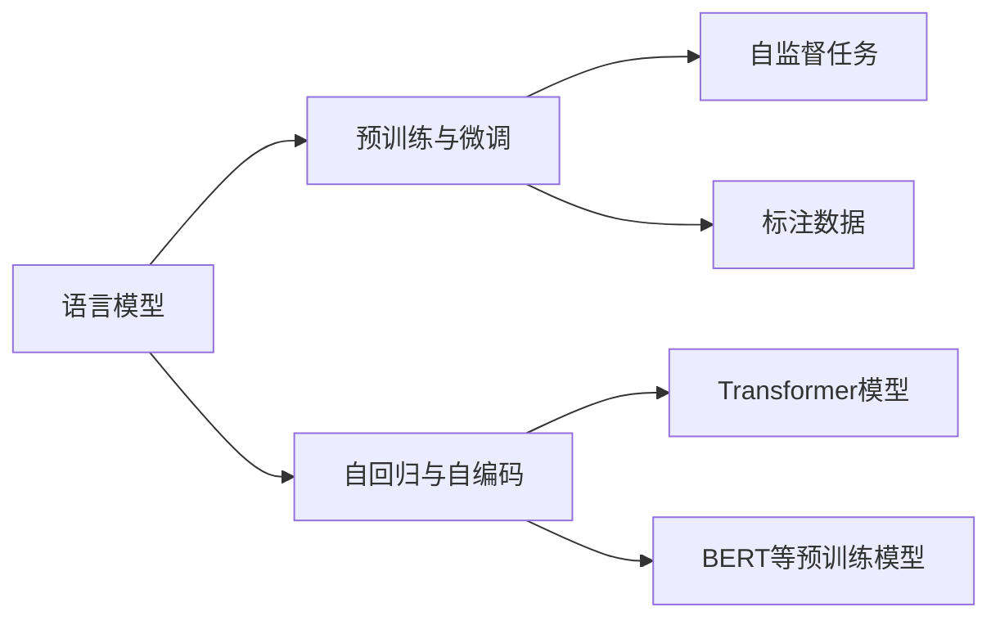

                 

# 第二章：选择合适的语言模型

在深入探索自然语言处理(Natural Language Processing, NLP)的广袤天地之前，首先需要明确一个关键问题：选择合适的语言模型。语言模型是NLP的核心组成部分，它们通过学习大规模语料，构建对语言规律的深刻理解，进而为各种任务提供强大的支持。本文将从多个角度探讨如何选择和构建合适的语言模型，包括不同类型的模型、构建方法以及实际应用中的考量。

## 1. 背景介绍

### 1.1 问题由来

自深度学习兴起以来，语言模型经历了从浅层RNN到深层LSTM、GRU，再到Transformer的演变。每一个阶段的语言模型都在不同程度上推动了NLP技术的进步，从基础的文本分类到复杂的机器翻译，语言模型的作用越来越凸显。然而，选择合适的语言模型并非易事，不同的任务和场景可能需要不同的模型结构、训练策略和优化方法。因此，了解和掌握语言模型的选择和构建方法，对于提升NLP任务的性能至关重要。

### 1.2 问题核心关键点

选择合适的语言模型，需要综合考虑以下几个关键点：

1. **任务类型**：不同任务对模型的要求不同，如文本分类、情感分析、命名实体识别、机器翻译等。
2. **数据量与质量**：数据的多寡和质量直接影响模型的训练效果。
3. **计算资源**：模型的规模和复杂度直接影响训练和推理所需的计算资源。
4. **性能需求**：模型的精度、速度和可解释性等性能指标需根据实际应用场景进行调整。
5. **部署方式**：模型的部署方式（如模型大小、推理速度等）影响其在实际场景中的适用性。

### 1.3 问题研究意义

选择和构建合适的语言模型，对于提升NLP任务的性能、降低开发成本、加速应用迭代具有重要意义：

1. **提升性能**：不同模型具有不同的优势，选择合适的模型可以更有效地处理特定任务。
2. **降低成本**：合适的模型可以减少训练和优化的时间，降低算力成本。
3. **加速迭代**：模型选择和构建是一个迭代过程，有效的选择可以加速模型优化和任务适配。
4. **促进应用落地**：合适的模型更符合实际应用需求，易于集成部署。

## 2. 核心概念与联系

### 2.1 核心概念概述

为更好地理解如何选择和构建语言模型，本文将介绍以下几个核心概念：

- **语言模型**：通过学习大规模语料，构建对语言规律的深刻理解，为各种NLP任务提供支持。
- **预训练与微调**：通过大规模无标签数据预训练，在大规模标注数据上进行微调，优化模型在特定任务上的性能。
- **自回归与自编码模型**：分别通过预测上下文和重构输入输出，学习语言结构。
- **Transformer模型**：基于自注意力机制，结合多头自注意力和前馈神经网络，提升了模型的处理能力和泛化能力。
- **BERT等预训练模型**：通过掩码语言模型和下一句预测等自监督任务进行预训练，具备强大的语言表示能力。

### 2.2 核心概念原理和架构的 Mermaid 流程图

以下是一个简化的Mermaid流程图，展示了这些核心概念之间的联系：



这个流程图展示了大语言模型的核心概念及其之间的联系：语言模型通过预训练与微调学习语言规律，使用自回归和自编码模型学习语言结构，而Transformer和BERT等预训练模型则提供了更先进的架构和训练方法，以提升模型的性能和泛化能力。

## 3. 核心算法原理 & 具体操作步骤

### 3.1 算法原理概述

选择合适的语言模型，通常涉及以下几个关键步骤：

1. **任务分析**：根据任务类型、数据量和性能需求，选择适合的模型架构。
2. **预训练**：在大规模无标签数据上预训练模型，学习通用的语言表示。
3. **微调**：在标注数据上微调模型，优化模型在特定任务上的性能。
4. **评估与优化**：在验证集上评估模型性能，进行参数调优和优化。

### 3.2 算法步骤详解

下面详细介绍选择和构建语言模型的详细步骤：

#### 3.2.1 任务分析

任务分析是选择合适的语言模型的第一步。通常需要考虑以下几个因素：

- **任务类型**：文本分类、命名实体识别、情感分析、机器翻译等。
- **数据量和质量**：标注数据的多寡和质量对模型训练效果有很大影响。
- **性能需求**：模型的精度、速度和可解释性等性能指标需根据实际应用场景进行调整。

#### 3.2.2 预训练

预训练阶段的目标是在大规模无标签数据上学习通用的语言表示。常见的预训练方法包括：

- **自回归模型**：通过预测上下文来构建语言模型。
- **自编码模型**：通过重构输入输出来学习语言结构。
- **Transformer模型**：基于自注意力机制，结合多头自注意力和前馈神经网络，提升了模型的处理能力和泛化能力。

#### 3.2.3 微调

微调阶段的目标是在标注数据上优化模型在特定任务上的性能。常见的微调方法包括：

- **全参数微调**：更新所有参数，适应特定任务。
- **参数高效微调**：只更新少量参数，如Adapter、Prefix等，减少计算资源消耗。
- **对抗训练**：引入对抗样本，提高模型鲁棒性。
- **正则化**：使用L2正则、Dropout等方法，防止过拟合。

#### 3.2.4 评估与优化

评估与优化阶段的目标是在验证集上评估模型性能，进行参数调优和优化。常见的评估指标包括：

- **精度**：模型在测试集上的分类准确率。
- **召回率**：模型能够正确识别出的正样本比例。
- **F1分数**：精度和召回率的调和平均数。

### 3.3 算法优缺点

选择合适的语言模型，具有以下优点：

- **提升性能**：合适的模型可以更有效地处理特定任务。
- **降低成本**：合适的模型可以减少训练和优化的时间，降低算力成本。
- **加速迭代**：模型选择和构建是一个迭代过程，有效的选择可以加速模型优化和任务适配。
- **促进应用落地**：合适的模型更符合实际应用需求，易于集成部署。

同时，选择合适的语言模型也存在一些缺点：

- **模型选择复杂**：不同任务和场景可能需要不同的模型。
- **数据需求高**：部分模型需要大规模标注数据进行微调。
- **计算资源消耗大**：部分模型需要较高的计算资源进行训练和推理。

### 3.4 算法应用领域

选择合适的语言模型，在以下几个领域有着广泛的应用：

- **文本分类**：如情感分析、主题分类、意图识别等。
- **命名实体识别**：识别文本中的人名、地名、机构名等特定实体。
- **机器翻译**：将源语言文本翻译成目标语言。
- **问答系统**：对自然语言问题给出答案。
- **文本摘要**：将长文本压缩成简短摘要。
- **对话系统**：使机器能够与人自然对话。

## 4. 数学模型和公式 & 详细讲解 & 举例说明

### 4.1 数学模型构建

构建语言模型的数学模型，通常涉及以下几个步骤：

1. **定义模型**：选择合适的模型架构，如LSTM、GRU、Transformer等。
2. **定义损失函数**：根据任务类型，选择适合的损失函数，如交叉熵、均方误差等。
3. **定义优化器**：选择合适的优化器，如Adam、SGD等，并设置学习率、批大小等超参数。

### 4.2 公式推导过程

以一个简单的线性分类器为例，推导其数学模型：

- **模型定义**：
$$
y = wx + b
$$

- **损失函数**：
$$
\ell(y, y^*) = (y - y^*)^2
$$

- **优化器**：
$$
w \leftarrow w - \eta \nabla_{w}\ell(y, y^*) - \eta \lambda w
$$

其中 $y^*$ 为真实标签，$w$ 为模型参数，$\eta$ 为学习率，$\lambda$ 为正则化系数。

### 4.3 案例分析与讲解

以BERT模型为例，其预训练任务包括掩码语言模型和下一句预测。其数学模型和推导过程如下：

- **掩码语言模型**：
$$
\ell = -\frac{1}{N}\sum_{i=1}^N [\log p(\hat{x}_i|x_i)]
$$

- **下一句预测**：
$$
\ell = -\frac{1}{N}\sum_{i=1}^N [\log p(y_i|x_i)]
$$

其中 $p$ 为预测概率，$x_i$ 为输入文本，$\hat{x}_i$ 为掩码文本，$y_i$ 为下一句标签。

## 5. 项目实践：代码实例和详细解释说明

### 5.1 开发环境搭建

在进行语言模型构建实践前，我们需要准备好开发环境。以下是使用Python进行PyTorch开发的环境配置流程：

1. 安装Anaconda：从官网下载并安装Anaconda，用于创建独立的Python环境。

2. 创建并激活虚拟环境：
```bash
conda create -n pytorch-env python=3.8 
conda activate pytorch-env
```

3. 安装PyTorch：根据CUDA版本，从官网获取对应的安装命令。例如：
```bash
conda install pytorch torchvision torchaudio cudatoolkit=11.1 -c pytorch -c conda-forge
```

4. 安装Transformers库：
```bash
pip install transformers
```

5. 安装各类工具包：
```bash
pip install numpy pandas scikit-learn matplotlib tqdm jupyter notebook ipython
```

完成上述步骤后，即可在`pytorch-env`环境中开始语言模型构建实践。

### 5.2 源代码详细实现

下面以BERT模型为例，给出使用Transformers库进行微调的PyTorch代码实现。

首先，定义BERT模型的任务适配层：

```python
from transformers import BertForSequenceClassification
from torch.nn import CrossEntropyLoss

model = BertForSequenceClassification.from_pretrained('bert-base-uncased', num_labels=2)
criterion = CrossEntropyLoss()
```

然后，定义训练和评估函数：

```python
from torch.utils.data import DataLoader
from tqdm import tqdm

device = torch.device('cuda') if torch.cuda.is_available() else torch.device('cpu')
model.to(device)

def train_epoch(model, train_loader, optimizer, criterion):
    model.train()
    losses = []
    for batch in tqdm(train_loader, desc='Training'):
        input_ids = batch['input_ids'].to(device)
        attention_mask = batch['attention_mask'].to(device)
        labels = batch['labels'].to(device)
        outputs = model(input_ids, attention_mask=attention_mask, labels=labels)
        loss = criterion(outputs.logits, labels)
        loss.backward()
        optimizer.step()
        optimizer.zero_grad()
        losses.append(loss.item())
    return sum(losses) / len(losses)

def evaluate(model, eval_loader):
    model.eval()
    losses, preds, labels = [], [], []
    with torch.no_grad():
        for batch in tqdm(eval_loader, desc='Evaluating'):
            input_ids = batch['input_ids'].to(device)
            attention_mask = batch['attention_mask'].to(device)
            labels = batch['labels'].to(device)
            outputs = model(input_ids, attention_mask=attention_mask)
            loss = criterion(outputs.logits, labels)
            losses.append(loss.item())
            logits = outputs.logits
            _, preds = torch.max(logits, dim=1)
            labels = labels.tolist()
            preds = preds.tolist()
            losses.append(loss.item())
    return sum(losses) / len(losses), preds, labels
```

最后，启动训练流程并在测试集上评估：

```python
from torch.optim import AdamW
from datasets import load_dataset

train_dataset = load_dataset('imdb', split='train', shuffle=True, cache_dir='cache')
val_dataset = load_dataset('imdb', split='validation', shuffle=False, cache_dir='cache')
test_dataset = load_dataset('imdb', split='test', shuffle=False, cache_dir='cache')

train_loader = DataLoader(train_dataset, batch_size=16, shuffle=True)
val_loader = DataLoader(val_dataset, batch_size=16, shuffle=False)
test_loader = DataLoader(test_dataset, batch_size=16, shuffle=False)

optimizer = AdamW(model.parameters(), lr=2e-5)
epochs = 5

for epoch in range(epochs):
    train_loss = train_epoch(model, train_loader, optimizer, criterion)
    val_loss, preds, labels = evaluate(model, val_loader)
    print(f'Epoch {epoch+1}, train loss: {train_loss:.3f}, val loss: {val_loss:.3f}')
    
test_loss, preds, labels = evaluate(model, test_loader)
print(f'Epoch {epoch+1}, test loss: {test_loss:.3f}')
```

以上就是使用PyTorch对BERT进行文本分类任务微调的完整代码实现。可以看到，得益于Transformers库的强大封装，我们可以用相对简洁的代码完成BERT模型的加载和微调。

### 5.3 代码解读与分析

让我们再详细解读一下关键代码的实现细节：

**BertForSequenceClassification类**：
- `__init__`方法：初始化模型结构和任务类型。
- `from_pretrained`方法：从预训练模型中加载模型参数。
- `num_labels`参数：指定分类标签的数量。

**CrossEntropyLoss类**：
- `__init__`方法：初始化交叉熵损失函数。
- `forward`方法：计算损失值。

**train_epoch函数**：
- 使用PyTorch的DataLoader对数据集进行批次化加载，供模型训练使用。
- 在每个批次上前向传播计算损失函数，并反向传播更新模型参数。
- 周期性在验证集上评估模型性能，根据性能指标决定是否触发Early Stopping。
- 重复上述步骤直至满足预设的迭代轮数或Early Stopping条件。

**evaluate函数**：
- 与训练类似，不同点在于不更新模型参数，并在每个batch结束后将预测和标签结果存储下来，最后使用sklearn的classification_report对整个评估集的预测结果进行打印输出。

**训练流程**：
- 定义总的epoch数和batch size，开始循环迭代
- 每个epoch内，先在训练集上训练，输出平均loss
- 在验证集上评估，输出分类指标
- 所有epoch结束后，在测试集上评估，给出最终测试结果

可以看到，PyTorch配合Transformers库使得BERT微调的代码实现变得简洁高效。开发者可以将更多精力放在数据处理、模型改进等高层逻辑上，而不必过多关注底层的实现细节。

当然，工业级的系统实现还需考虑更多因素，如模型的保存和部署、超参数的自动搜索、更灵活的任务适配层等。但核心的微调范式基本与此类似。

## 6. 实际应用场景

### 6.1 智能客服系统

基于BERT模型微调的对话技术，可以广泛应用于智能客服系统的构建。传统客服往往需要配备大量人力，高峰期响应缓慢，且一致性和专业性难以保证。而使用微调的对话模型，可以7x24小时不间断服务，快速响应客户咨询，用自然流畅的语言解答各类常见问题。

在技术实现上，可以收集企业内部的历史客服对话记录，将问题和最佳答复构建成监督数据，在此基础上对预训练对话模型进行微调。微调后的对话模型能够自动理解用户意图，匹配最合适的答案模板进行回复。对于客户提出的新问题，还可以接入检索系统实时搜索相关内容，动态组织生成回答。如此构建的智能客服系统，能大幅提升客户咨询体验和问题解决效率。

### 6.2 金融舆情监测

金融机构需要实时监测市场舆论动向，以便及时应对负面信息传播，规避金融风险。传统的人工监测方式成本高、效率低，难以应对网络时代海量信息爆发的挑战。基于BERT模型微调的文本分类和情感分析技术，为金融舆情监测提供了新的解决方案。

具体而言，可以收集金融领域相关的新闻、报道、评论等文本数据，并对其进行主题标注和情感标注。在此基础上对BERT模型进行微调，使其能够自动判断文本属于何种主题，情感倾向是正面、中性还是负面。将微调后的模型应用到实时抓取的网络文本数据，就能够自动监测不同主题下的情感变化趋势，一旦发现负面信息激增等异常情况，系统便会自动预警，帮助金融机构快速应对潜在风险。

### 6.3 个性化推荐系统

当前的推荐系统往往只依赖用户的历史行为数据进行物品推荐，无法深入理解用户的真实兴趣偏好。基于BERT模型微调的技术，个性化推荐系统可以更好地挖掘用户行为背后的语义信息，从而提供更精准、多样的推荐内容。

在实践中，可以收集用户浏览、点击、评论、分享等行为数据，提取和用户交互的物品标题、描述、标签等文本内容。将文本内容作为模型输入，用户的后续行为（如是否点击、购买等）作为监督信号，在此基础上微调BERT模型。微调后的模型能够从文本内容中准确把握用户的兴趣点。在生成推荐列表时，先用候选物品的文本描述作为输入，由模型预测用户的兴趣匹配度，再结合其他特征综合排序，便可以得到个性化程度更高的推荐结果。

### 6.4 未来应用展望

随着BERT模型和微调方法的不断发展，基于微调范式将在更多领域得到应用，为传统行业带来变革性影响。

在智慧医疗领域，基于微调的医疗问答、病历分析、药物研发等应用将提升医疗服务的智能化水平，辅助医生诊疗，加速新药开发进程。

在智能教育领域，微调技术可应用于作业批改、学情分析、知识推荐等方面，因材施教，促进教育公平，提高教学质量。

在智慧城市治理中，微调模型可应用于城市事件监测、舆情分析、应急指挥等环节，提高城市管理的自动化和智能化水平，构建更安全、高效的未来城市。

此外，在企业生产、社会治理、文娱传媒等众多领域，基于BERT模型微调的人工智能应用也将不断涌现，为经济社会发展注入新的动力。相信随着预训练模型和微调方法的持续演进，微调技术必将在构建人机协同的智能时代中扮演越来越重要的角色。

## 7. 工具和资源推荐

### 7.1 学习资源推荐

为了帮助开发者系统掌握BERT模型微调的理论基础和实践技巧，这里推荐一些优质的学习资源：

1. 《Transformers from the Inside Out》系列博文：由BERT模型的设计者撰写，深入浅出地介绍了BERT模型的架构和微调方法。

2. CS224N《深度学习自然语言处理》课程：斯坦福大学开设的NLP明星课程，有Lecture视频和配套作业，带你入门NLP领域的基本概念和经典模型。

3. 《Natural Language Processing with Transformers》书籍：BERT模型的作者所著，全面介绍了如何使用Transformers库进行NLP任务开发，包括微调在内的诸多范式。

4. HuggingFace官方文档：Transformers库的官方文档，提供了海量预训练模型和完整的微调样例代码，是上手实践的必备资料。

5. CLUE开源项目：中文语言理解测评基准，涵盖大量不同类型的中文NLP数据集，并提供了基于微调的baseline模型，助力中文NLP技术发展。

通过对这些资源的学习实践，相信你一定能够快速掌握BERT模型微调的精髓，并用于解决实际的NLP问题。

### 7.2 开发工具推荐

高效的开发离不开优秀的工具支持。以下是几款用于BERT模型微调开发的常用工具：

1. PyTorch：基于Python的开源深度学习框架，灵活动态的计算图，适合快速迭代研究。大部分预训练语言模型都有PyTorch版本的实现。

2. TensorFlow：由Google主导开发的开源深度学习框架，生产部署方便，适合大规模工程应用。同样有丰富的预训练语言模型资源。

3. Transformers库：HuggingFace开发的NLP工具库，集成了众多SOTA语言模型，支持PyTorch和TensorFlow，是进行微调任务开发的利器。

4. Weights & Biases：模型训练的实验跟踪工具，可以记录和可视化模型训练过程中的各项指标，方便对比和调优。与主流深度学习框架无缝集成。

5. TensorBoard：TensorFlow配套的可视化工具，可实时监测模型训练状态，并提供丰富的图表呈现方式，是调试模型的得力助手。

6. Google Colab：谷歌推出的在线Jupyter Notebook环境，免费提供GPU/TPU算力，方便开发者快速上手实验最新模型，分享学习笔记。

合理利用这些工具，可以显著提升BERT模型微调任务的开发效率，加快创新迭代的步伐。

### 7.3 相关论文推荐

BERT模型和微调技术的发展源于学界的持续研究。以下是几篇奠基性的相关论文，推荐阅读：

1. Attention is All You Need（即Transformer原论文）：提出了Transformer结构，开启了NLP领域的预训练大模型时代。

2. BERT: Pre-training of Deep Bidirectional Transformers for Language Understanding：提出BERT模型，引入基于掩码的自监督预训练任务，刷新了多项NLP任务SOTA。

3. Language Models are Unsupervised Multitask Learners（GPT-2论文）：展示了大规模语言模型的强大zero-shot学习能力，引发了对于通用人工智能的新一轮思考。

4. Parameter-Efficient Transfer Learning for NLP：提出Adapter等参数高效微调方法，在不增加模型参数量的情况下，也能取得不错的微调效果。

5. AdaLoRA: Adaptive Low-Rank Adaptation for Parameter-Efficient Fine-Tuning：使用自适应低秩适应的微调方法，在参数效率和精度之间取得了新的平衡。

这些论文代表了大语言模型微调技术的发展脉络。通过学习这些前沿成果，可以帮助研究者把握学科前进方向，激发更多的创新灵感。

## 8. 总结：未来发展趋势与挑战

### 8.1 研究成果总结

本文对基于BERT模型的语言模型微调方法进行了全面系统的介绍。首先阐述了BERT模型的基本概念和优势，明确了微调在提升模型性能、降低开发成本、加速应用迭代方面的独特价值。其次，从原理到实践，详细讲解了BERT模型微调的数学原理和关键步骤，给出了微调任务开发的完整代码实例。同时，本文还广泛探讨了BERT模型微调方法在智能客服、金融舆情、个性化推荐等多个行业领域的应用前景，展示了微调范式的巨大潜力。

通过本文的系统梳理，可以看到，基于BERT模型的微调方法正在成为NLP领域的重要范式，极大地拓展了预训练语言模型的应用边界，催生了更多的落地场景。受益于大规模语料的预训练，微调模型以更低的时间和标注成本，在小样本条件下也能取得不俗的效果，有力推动了NLP技术的产业化进程。未来，伴随BERT模型和微调方法的持续演进，微调技术必将在构建人机协同的智能时代中扮演越来越重要的角色。

### 8.2 未来发展趋势

展望未来，BERT模型微调技术将呈现以下几个发展趋势：

1. 模型规模持续增大。随着算力成本的下降和数据规模的扩张，BERT模型参数量还将持续增长。超大规模BERT模型蕴含的丰富语言知识，有望支撑更加复杂多变的下游任务微调。

2. 微调方法日趋多样。除了传统的全参数微调外，未来会涌现更多参数高效的微调方法，如Adapter、Prefix等，在固定大部分预训练参数的情况下，只更新极少量的任务相关参数。

3. 持续学习成为常态。随着数据分布的不断变化，微调模型也需要持续学习新知识以保持性能。如何在不遗忘原有知识的同时，高效吸收新样本信息，将成为重要的研究课题。

4. 标注样本需求降低。受启发于提示学习(Prompt-based Learning)的思路，未来的微调方法将更好地利用BERT模型的语言理解能力，通过更加巧妙的任务描述，在更少的标注样本上也能实现理想的微调效果。

5. 模型通用性增强。经过海量数据的预训练和多领域任务的微调，未来的BERT模型将具备更强大的常识推理和跨领域迁移能力，逐步迈向通用人工智能(AGI)的目标。

以上趋势凸显了BERT模型微调技术的广阔前景。这些方向的探索发展，必将进一步提升NLP系统的性能和应用范围，为人类认知智能的进化带来深远影响。

### 8.3 面临的挑战

尽管BERT模型微调技术已经取得了瞩目成就，但在迈向更加智能化、普适化应用的过程中，它仍面临着诸多挑战：

1. 标注成本瓶颈。虽然微调大大降低了标注数据的需求，但对于长尾应用场景，难以获得充足的高质量标注数据，成为制约微调性能的瓶颈。如何进一步降低微调对标注样本的依赖，将是一大难题。

2. 模型鲁棒性不足。当前微调模型面对域外数据时，泛化性能往往大打折扣。对于测试样本的微小扰动，微调模型的预测也容易发生波动。如何提高微调模型的鲁棒性，避免灾难性遗忘，还需要更多理论和实践的积累。

3. 推理效率有待提高。尽管BERT模型精度高，但在实际部署时往往面临推理速度慢、内存占用大等效率问题。如何在保证性能的同时，简化模型结构，提升推理速度，优化资源占用，将是重要的优化方向。

4. 可解释性亟需加强。当前微调模型更像是"黑盒"系统，难以解释其内部工作机制和决策逻辑。对于医疗、金融等高风险应用，算法的可解释性和可审计性尤为重要。如何赋予微调模型更强的可解释性，将是亟待攻克的难题。

5. 安全性有待保障。BERT模型难免会学习到有偏见、有害的信息，通过微调传递到下游任务，产生误导性、歧视性的输出，给实际应用带来安全隐患。如何从数据和算法层面消除模型偏见，避免恶意用途，确保输出的安全性，也将是重要的研究课题。

6. 知识整合能力不足。现有的微调模型往往局限于任务内数据，难以灵活吸收和运用更广泛的先验知识。如何让微调过程更好地与外部知识库、规则库等专家知识结合，形成更加全面、准确的信息整合能力，还有很大的想象空间。

正视BERT模型微调面临的这些挑战，积极应对并寻求突破，将是大规模语言模型微调走向成熟的必由之路。相信随着学界和产业界的共同努力，这些挑战终将一一被克服，微调方法必将在构建安全、可靠、可解释、可控的智能系统铺平道路。

### 8.4 研究展望

面对BERT模型微调所面临的种种挑战，未来的研究需要在以下几个方面寻求新的突破：

1. 探索无监督和半监督微调方法。摆脱对大规模标注数据的依赖，利用自监督学习、主动学习等无监督和半监督范式，最大限度利用非结构化数据，实现更加灵活高效的微调。

2. 研究参数高效和计算高效的微调范式。开发更加参数高效的微调方法，在固定大部分预训练参数的同时，只更新极少量的任务相关参数。同时优化微调模型的计算图，减少前向传播和反向传播的资源消耗，实现更加轻量级、实时性的部署。

3. 融合因果和对比学习范式。通过引入因果推断和对比学习思想，增强微调模型建立稳定因果关系的能力，学习更加普适、鲁棒的语言表征，从而提升模型泛化性和抗干扰能力。

4. 引入更多先验知识。将符号化的先验知识，如知识图谱、逻辑规则等，与神经网络模型进行巧妙融合，引导微调过程学习更准确、合理的语言模型。同时加强不同模态数据的整合，实现视觉、语音等多模态信息与文本信息的协同建模。

5. 结合因果分析和博弈论工具。将因果分析方法引入微调模型，识别出模型决策的关键特征，增强输出解释的因果性和逻辑性。借助博弈论工具刻画人机交互过程，主动探索并规避模型的脆弱点，提高系统稳定性。

6. 纳入伦理道德约束。在模型训练目标中引入伦理导向的评估指标，过滤和惩罚有偏见、有害的输出倾向。同时加强人工干预和审核，建立模型行为的监管机制，确保输出符合人类价值观和伦理道德。

这些研究方向的探索，必将引领BERT模型微调技术迈向更高的台阶，为构建安全、可靠、可解释、可控的智能系统铺平道路。面向未来，大规模语言模型微调技术还需要与其他人工智能技术进行更深入的融合，如知识表示、因果推理、强化学习等，多路径协同发力，共同推动自然语言理解和智能交互系统的进步。只有勇于创新、敢于突破，才能不断拓展语言模型的边界，让智能技术更好地造福人类社会。

## 9. 附录：常见问题与解答

**Q1：BERT模型是否适用于所有NLP任务？**

A: BERT模型在大多数NLP任务上都能取得不错的效果，特别是对于数据量较小的任务。但对于一些特定领域的任务，如医学、法律等，仅仅依靠通用语料预训练的模型可能难以很好地适应。此时需要在特定领域语料上进一步预训练，再进行微调，才能获得理想效果。此外，对于一些需要时效性、个性化很强的任务，如对话、推荐等，微调方法也需要针对性的改进优化。

**Q2：微调过程中如何选择合适的学习率？**

A: 微调的学习率一般要比预训练时小1-2个数量级，如果使用过大的学习率，容易破坏预训练权重，导致过拟合。一般建议从1e-5开始调参，逐步减小学习率，直至收敛。也可以使用warmup策略，在开始阶段使用较小的学习率，再逐渐过渡到预设值。需要注意的是，不同的优化器(如AdamW、Adafactor等)以及不同的学习率调度策略，可能需要设置不同的学习率阈值。

**Q3：采用BERT模型微调时会面临哪些资源瓶颈？**

A: 目前主流的预训练大模型动辄以亿计的参数规模，对算力、内存、存储都提出了很高的要求。GPU/TPU等高性能设备是必不可少的，但即便如此，超大批次的训练和推理也可能遇到显存不足的问题。因此需要采用一些资源优化技术，如梯度积累、混合精度训练、模型并行等，来突破硬件瓶颈。同时，模型的存储和读取也可能占用大量时间和空间，需要采用模型压缩、稀疏化存储等方法进行优化。

**Q4：如何缓解微调过程中的过拟合问题？**

A: 过拟合是微调面临的主要挑战，尤其是在标注数据不足的情况下。常见的缓解策略包括：

- 数据增强：通过回译、近义替换等方式扩充训练集。
- 正则化：使用L2正则、Dropout、Early Stopping等方法防止过拟合。
- 对抗训练：引入对抗样本，提高模型鲁棒性。
- 参数高效微调：只更新少量参数，如Adapter、Prefix等，减小过拟合风险。

这些策略往往需要根据具体任务和数据特点进行灵活组合。只有在数据、模型、训练、推理等各环节进行全面优化，才能最大限度地发挥BERT模型的微调威力。

**Q5：BERT模型在落地部署时需要注意哪些问题？**

A: 将微调BERT模型转化为实际应用，还需要考虑以下因素：

- 模型裁剪：去除不必要的层和参数，减小模型尺寸，加快推理速度。
- 量化加速：将浮点模型转为定点模型，压缩存储空间，提高计算效率。
- 服务化封装：将模型封装为标准化服务接口，便于集成调用。
- 弹性伸缩：根据请求流量动态调整资源配置，平衡服务质量和成本。
- 监控告警：实时采集系统指标，设置异常告警阈值，确保服务稳定性。
- 安全防护：采用访问鉴权、数据脱敏等措施，保障数据和模型安全。

合理利用这些工具，可以显著提升BERT模型微调任务的开发效率，加快创新迭代的步伐。

---

作者：禅与计算机程序设计艺术 / Zen and the Art of Computer Programming

