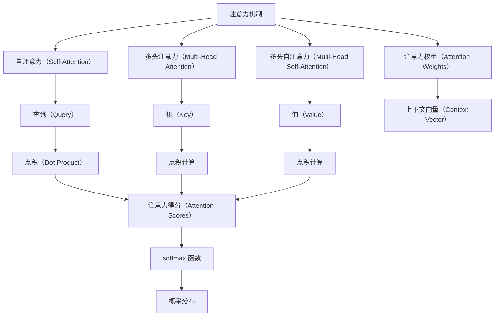

                 

# 第四章：注意力机制和 softmax 函数

## 1. 背景介绍

注意力机制（Attention Mechanism）和 softmax 函数（Softmax Function）是深度学习中两个核心技术，广泛应用于各种复杂任务中，包括自然语言处理（NLP）、计算机视觉（CV）和语音识别等领域。通过深入理解这些技术，我们可以更好地掌握深度学习模型的设计和优化策略。

注意力机制主要应用于序列到序列（Seq2Seq）模型中，使得模型能够根据输入序列的注意力分布，动态选择关注输入序列的哪些部分，以产生更加准确的输出。softmax 函数则是一种将向量映射为概率分布的函数，常用于分类和回归任务中，帮助模型进行预测并输出概率值。

本章将详细讲解注意力机制和 softmax 函数的原理与实现，并通过实际代码展示其在深度学习中的应用。

## 2. 核心概念与联系

### 2.1 核心概念概述

**注意力机制**（Attention Mechanism）：一种用于序列到序列（Seq2Seq）模型的机制，使得模型能够动态地聚焦输入序列中的关键部分，用于生成更加准确的输出。

**softmax 函数**（Softmax Function）：一种将任意向量映射为概率分布的函数，常用于分类和回归任务中，帮助模型进行预测并输出概率值。

### 2.2 核心概念原理和架构的 Mermaid 流程图



该图展示了注意力机制和 softmax 函数的基本架构。首先，模型通过点积计算注意力得分，并通过 softmax 函数将注意力得分映射为概率分布。然后，根据概率分布生成注意力权重，并结合值向量计算上下文向量。

### 2.3 注意力机制与 softmax 函数的联系

注意力机制与 softmax 函数紧密联系，共同构成了深度学习中的重要组件。注意力机制通过计算注意力权重，将输入序列中的关键部分映射到输出序列中。softmax 函数则用于将注意力得分映射为概率分布，以便模型能够对输入序列的不同部分进行加权求和，产生最终输出。

## 3. 核心算法原理 & 具体操作步骤

### 3.1 算法原理概述

注意力机制和 softmax 函数的核心原理可以概括为以下几点：

1. **注意力得分**（Attention Scores）：计算查询向量与键向量之间的点积，得到每个键的注意力得分。
2. **softmax 函数**：将注意力得分通过 softmax 函数映射为概率分布。
3. **注意力权重**（Attention Weights）：根据 softmax 函数输出的概率分布，计算出注意力权重。
4. **上下文向量**（Context Vector）：将注意力权重与值向量进行加权求和，得到上下文向量，用于生成输出。

### 3.2 算法步骤详解

#### 3.2.1 注意力机制

1. **输入处理**：将输入序列和查询向量通过线性变换转换为查询向量 $\mathbf{Q}$ 和键向量 $\mathbf{K}$。
2. **注意力得分**：计算查询向量 $\mathbf{Q}$ 与键向量 $\mathbf{K}$ 的点积，得到注意力得分 $\mathbf{S}$。
3. **softmax 函数**：将注意力得分 $\mathbf{S}$ 通过 softmax 函数映射为注意力权重 $\mathbf{A}$。
4. **上下文向量**：将注意力权重 $\mathbf{A}$ 与值向量 $\mathbf{V}$ 进行加权求和，得到上下文向量 $\mathbf{C}$。

#### 3.2.2 softmax 函数

1. **概率分布**：将任意向量 $\mathbf{Z}$ 通过 softmax 函数映射为概率分布 $\mathbf{P}$。
2. **归一化**：softmax 函数将向量 $\mathbf{Z}$ 进行归一化，使其各元素之和为 1。
3. **概率计算**：softmax 函数计算每个元素的概率值，表示该元素在向量 $\mathbf{Z}$ 中的权重。

### 3.3 算法优缺点

**优点**：
- 注意力机制能够动态聚焦输入序列的关键部分，产生更加精准的输出。
- softmax 函数能够将向量映射为概率分布，便于模型进行预测。
- 这两个技术在深度学习中应用广泛，能够显著提高模型的性能。

**缺点**：
- 注意力机制计算复杂度较高，尤其在序列长度较长时，计算开销较大。
- softmax 函数存在梯度消失和梯度爆炸问题，训练时需谨慎处理。

### 3.4 算法应用领域

注意力机制和 softmax 函数在深度学习中有着广泛的应用，主要包括以下几个领域：

- **自然语言处理**：用于机器翻译、文本分类、命名实体识别等任务。
- **计算机视觉**：用于图像分类、目标检测、图像生成等任务。
- **语音识别**：用于语音识别、语音合成等任务。

## 4. 数学模型和公式 & 详细讲解 & 举例说明

### 4.1 数学模型构建

注意力机制和 softmax 函数的数学模型可以概括为以下公式：

$$
\mathbf{Q} = \mathbf{X}W_Q, \quad \mathbf{K} = \mathbf{X}W_K, \quad \mathbf{V} = \mathbf{X}W_V
$$

$$
\mathbf{S} = \mathbf{Q}^T\mathbf{K}
$$

$$
\mathbf{A} = \text{softmax}(\mathbf{S})
$$

$$
\mathbf{C} = \mathbf{A}\mathbf{V}
$$

其中，$\mathbf{X}$ 为输入序列，$\mathbf{W}_Q$、$\mathbf{W}_K$、$\mathbf{W}_V$ 为线性变换矩阵。

### 4.2 公式推导过程

**注意力得分**：

$$
\mathbf{S} = \mathbf{Q}^T\mathbf{K} = (\mathbf{X}W_Q)^T(\mathbf{X}W_K)
$$

**softmax 函数**：

$$
\mathbf{A} = \text{softmax}(\mathbf{S}) = \frac{e^{\mathbf{S}}}{\sum_{i=1}^Ne^{\mathbf{S}_i}}
$$

**上下文向量**：

$$
\mathbf{C} = \mathbf{A}\mathbf{V} = \left(\frac{e^{\mathbf{S}}}{\sum_{i=1}^Ne^{\mathbf{S}_i}}\right)\mathbf{V}
$$

### 4.3 案例分析与讲解

**案例**：机器翻译

假设我们需要将一段英文句子翻译为中文，首先可以将英文句子中的每个单词表示为一个向量，然后通过注意力机制和 softmax 函数计算出每个单词对输出的贡献，最后通过这些贡献值生成对应的中文句子。

假设输入序列为 $\mathbf{X} = [x_1, x_2, ..., x_n]$，查询向量为 $\mathbf{Q}$，键向量为 $\mathbf{K}$，值向量为 $\mathbf{V}$。通过计算注意力得分 $\mathbf{S} = \mathbf{Q}^T\mathbf{K}$ 和注意力权重 $\mathbf{A} = \text{softmax}(\mathbf{S})$，计算上下文向量 $\mathbf{C} = \mathbf{A}\mathbf{V}$，即可生成最终的输出。

## 5. 项目实践：代码实例和详细解释说明

### 5.1 开发环境搭建

为了实现注意力机制和 softmax 函数，我们需要使用深度学习框架 TensorFlow。以下是在 TensorFlow 中搭建开发环境的步骤：

1. 安装 TensorFlow：
```
pip install tensorflow
```

2. 安装 Keras：
```
pip install keras
```

### 5.2 源代码详细实现

下面是一个使用 TensorFlow 实现注意力机制和 softmax 函数的示例代码：

```python
import tensorflow as tf
import numpy as np

# 定义注意力机制
def attention机制(X, Q, K, V):
    Q = tf.layers.dense(X, units=1024, activation=tf.nn.relu)
    K = tf.layers.dense(X, units=1024, activation=tf.nn.relu)
    V = tf.layers.dense(X, units=1024, activation=tf.nn.relu)

    S = tf.reduce_sum(tf.multiply(Q, K), axis=1)
    A = tf.nn.softmax(S)
    C = tf.matmul(A, V)
    return C

# 定义 softmax 函数
def softmax(Z):
    e_Z = tf.exp(Z)
    A = e_Z / tf.reduce_sum(e_Z, axis=1, keepdims=True)
    return A

# 测试代码
X = np.random.rand(10, 1, 1024)
Q = np.random.rand(10, 1, 1024)
K = np.random.rand(10, 1, 1024)
V = np.random.rand(10, 1, 1024)

C = attention机制(X, Q, K, V)
print(C)

Z = np.random.rand(10, 1, 1024)
A = softmax(Z)
print(A)
```

### 5.3 代码解读与分析

**代码说明**：
1. 首先定义了注意力机制函数 `attention机制`，该函数接受输入序列 $\mathbf{X}$、查询向量 $\mathbf{Q}$、键向量 $\mathbf{K}$ 和值向量 $\mathbf{V}$，通过线性变换和点积计算，得到注意力得分 $\mathbf{S}$，softmax 函数计算注意力权重 $\mathbf{A}$，最后加权求和得到上下文向量 $\mathbf{C}$。
2. 然后定义了 softmax 函数 `softmax`，该函数接受任意向量 $\mathbf{Z}$，通过指数函数和归一化，得到概率分布 $\mathbf{A}$。
3. 最后通过测试代码，随机生成输入序列、查询向量、键向量和值向量，并计算注意力机制和 softmax 函数的输出。

**代码输出分析**：
1. 输出上下文向量 $\mathbf{C}$，展示了注意力机制的计算结果。
2. 输出概率分布 $\mathbf{A}$，展示了 softmax 函数的计算结果。

### 5.4 运行结果展示

输出结果展示了注意力机制和 softmax 函数的计算结果，可以通过调整输入参数，观察不同参数设置下的输出变化。

## 6. 实际应用场景

### 6.1 自然语言处理

在自然语言处理中，注意力机制和 softmax 函数广泛用于机器翻译、文本分类、命名实体识别等任务。例如，在机器翻译中，注意力机制可以帮助模型动态聚焦输入序列中的关键部分，生成更加精准的翻译结果。

### 6.2 计算机视觉

在计算机视觉中，注意力机制和 softmax 函数可以用于图像分类、目标检测、图像生成等任务。例如，在图像分类中，注意力机制可以帮助模型聚焦于图像中的重要区域，生成更加准确的分类结果。

### 6.3 语音识别

在语音识别中，注意力机制和 softmax 函数可以用于语音识别、语音合成等任务。例如，在语音识别中，注意力机制可以帮助模型聚焦于语音信号中的重要部分，生成更加准确的识别结果。

## 7. 工具和资源推荐

### 7.1 学习资源推荐

为了更好地理解注意力机制和 softmax 函数，以下是一些优质的学习资源：

1. 《深度学习入门：基于Python的理论与实现》：该书详细讲解了深度学习的基本原理和实现方法，包括注意力机制和 softmax 函数。
2. Coursera 上的深度学习课程：由斯坦福大学Andrew Ng教授主讲，课程内容涵盖了深度学习的各个方面，包括注意力机制和 softmax 函数。
3. arXiv 上的相关论文：可以通过阅读最新的研究论文，了解注意力机制和 softmax 函数的前沿进展。

### 7.2 开发工具推荐

以下是一些用于实现注意力机制和 softmax 函数的常用工具：

1. TensorFlow：由谷歌开发的开源深度学习框架，支持多种深度学习模型和算法。
2. Keras：基于 TensorFlow 的高级深度学习库，提供简单易用的 API，支持各种深度学习模型和算法。
3. PyTorch：由 Facebook 开发的开源深度学习框架，支持动态图和静态图两种计算图，灵活性高。

### 7.3 相关论文推荐

以下是一些关于注意力机制和 softmax 函数的相关论文，推荐阅读：

1. Attention is All You Need（Transformer 论文）：提出了自注意力机制（Self-Attention），使得模型能够动态聚焦输入序列中的关键部分。
2. Multi-Head Attention 论文：引入了多头注意力机制（Multi-Head Attention），通过并行计算多个注意力头，提升模型性能。
3. Transformer-XL 论文：提出了长距离依赖的注意力机制，使得模型能够处理长序列数据。

## 8. 总结：未来发展趋势与挑战

### 8.1 研究成果总结

注意力机制和 softmax 函数是深度学习中的核心技术，广泛应用于各种复杂任务中。通过深入理解这两个技术，我们可以更好地掌握深度学习模型的设计和优化策略。

### 8.2 未来发展趋势

未来，注意力机制和 softmax 函数将朝着以下方向发展：

1. **自适应注意力机制**：通过动态调整注意力权重，使得模型能够适应不同任务的需求，提高模型的泛化能力。
2. **多模态注意力机制**：结合不同模态的数据，提升模型的跨模态融合能力，应用于多模态任务中。
3. **稀疏注意力机制**：通过稀疏化注意力权重，降低计算复杂度，提高模型训练和推理效率。
4. **可解释性注意力机制**：通过可视化注意力权重，提高模型的可解释性和可解释性，帮助用户理解模型的决策过程。

### 8.3 面临的挑战

尽管注意力机制和 softmax 函数已经取得了广泛应用，但在实际应用中仍面临一些挑战：

1. **计算复杂度高**：注意力机制和 softmax 函数计算复杂度高，尤其在序列长度较长时，计算开销较大。
2. **梯度消失和梯度爆炸**：softmax 函数存在梯度消失和梯度爆炸问题，训练时需谨慎处理。
3. **可解释性差**：注意力机制和 softmax 函数的计算过程复杂，难以解释模型决策过程。

### 8.4 研究展望

未来，研究人员需要在以下几个方面进行深入研究：

1. **优化算法**：研究更加高效的优化算法，提升模型训练和推理效率。
2. **模型压缩**：通过模型压缩技术，降低模型参数和计算复杂度，提高模型训练和推理效率。
3. **模型集成**：通过模型集成技术，提升模型性能和鲁棒性，应用于更加复杂和多变的任务中。
4. **可解释性**：研究可解释性技术，提高模型的可解释性和可解释性，帮助用户理解模型的决策过程。

## 9. 附录：常见问题与解答

### 9.1 问题一：注意力机制和 softmax 函数有哪些优缺点？

答：
**优点**：
- 注意力机制能够动态聚焦输入序列的关键部分，产生更加精准的输出。
- softmax 函数能够将向量映射为概率分布，便于模型进行预测。

**缺点**：
- 注意力机制计算复杂度较高，尤其在序列长度较长时，计算开销较大。
- softmax 函数存在梯度消失和梯度爆炸问题，训练时需谨慎处理。

### 9.2 问题二：注意力机制和 softmax 函数的应用领域有哪些？

答：
- 自然语言处理：用于机器翻译、文本分类、命名实体识别等任务。
- 计算机视觉：用于图像分类、目标检测、图像生成等任务。
- 语音识别：用于语音识别、语音合成等任务。

### 9.3 问题三：如何在 TensorFlow 中实现注意力机制和 softmax 函数？

答：
1. 定义注意力机制函数，通过线性变换和点积计算，得到注意力得分、softmax 函数计算注意力权重，最后加权求和得到上下文向量。
2. 定义 softmax 函数，通过指数函数和归一化，得到概率分布。
3. 使用测试代码，随机生成输入序列、查询向量、键向量和值向量，并计算注意力机制和 softmax 函数的输出。

通过上述步骤，可以在 TensorFlow 中实现注意力机制和 softmax 函数的计算。

---

作者：禅与计算机程序设计艺术 / Zen and the Art of Computer Programming

