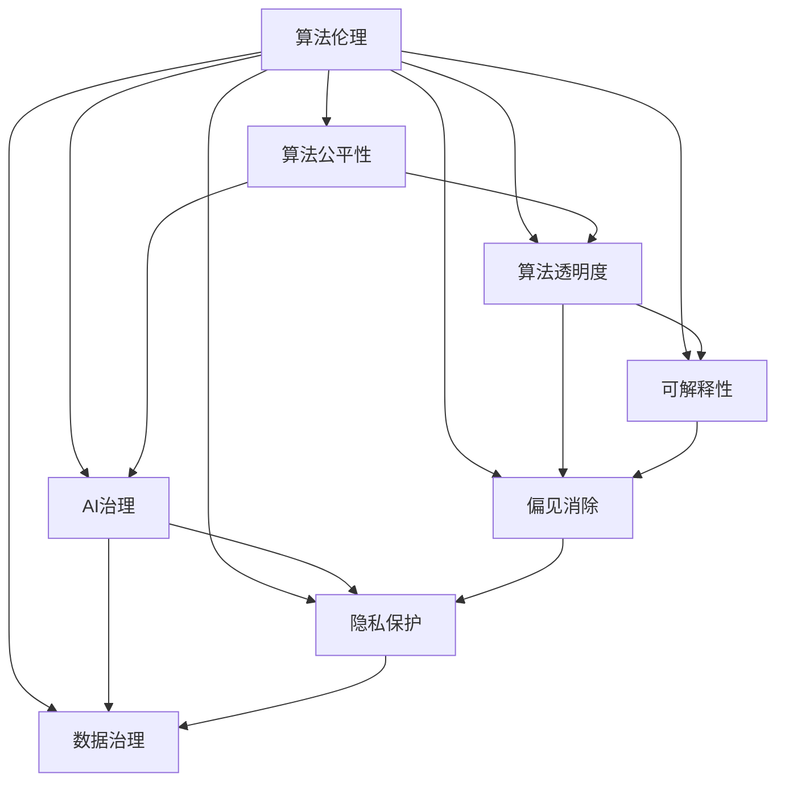

                 

# 算法伦理：构建公平、透明的AI世界

> 关键词：算法伦理, 公平性, 透明度, AI治理, 可解释性, 偏见消除, 隐私保护, 数据治理

## 1. 背景介绍

随着人工智能技术的迅猛发展，算法在各行业的应用日益深入，从医疗诊断、金融风控到自动驾驶、内容推荐，无处不在。然而，算法在带来便利的同时，也暴露出一系列伦理问题，如算法偏见、不透明性、隐私泄露等，威胁到社会的公平、安全和信任。

如何构建公平、透明的AI系统，确保其公正、可靠和可控，成为人工智能伦理领域的重要课题。本文将从算法伦理的视角，深入探讨构建公平、透明的AI世界的必要性、核心原则和具体实践，为AI技术的健康发展提供有益的指导。

## 2. 核心概念与联系

### 2.1 核心概念概述

为深入理解如何构建公平、透明的AI系统，本节将介绍几个关键概念及其之间的联系：

- 算法伦理(Algorithmic Ethics)：关注算法的道德和社会影响，确保其使用符合社会价值和法律规范。
- 算法公平性(Algorithmic Fairness)：要求算法在应用过程中，对所有用户群体一视同仁，不因种族、性别、年龄等因素产生歧视。
- 算法透明度(Algorithmic Transparency)：要求算法的工作机制、决策依据和数据来源应公开透明，便于社会监督和审查。
- AI治理(AI Governance)：旨在通过制度安排和政策引导，规范AI技术的开发和应用，防止滥用和负面影响。
- 可解释性(Explainability)：要求算法的决策过程应可理解、可解释，有助于提升用户信任和社会接受度。
- 偏见消除(Bias Mitigation)：旨在识别和纠正算法中的潜在偏见，确保公平、公正的输出结果。
- 隐私保护(Privacy Protection)：要求算法在处理个人信息时，应遵守法律法规，保护用户隐私权益。
- 数据治理(Data Governance)：关注数据的采集、存储、使用和管理，确保数据的质量和安全。

这些核心概念之间的逻辑关系可以通过以下Mermaid流程图来展示：



这个流程图展示出算法伦理与其他核心概念之间的联系和相互作用：

1. 算法伦理是基础，要求算法在设计和应用过程中，始终遵循公平、透明、公正等基本原则。
2. 算法公平性、透明度、AI治理、可解释性、偏见消除、隐私保护和数据治理都是算法伦理的具体体现，旨在通过不同的方式确保算法的道德和社会影响。

## 3. 核心算法原理 & 具体操作步骤

### 3.1 算法原理概述

构建公平、透明的AI系统，涉及算法的多个方面，包括数据预处理、模型训练、决策制定等环节。核心算法原理可归纳为以下几个方面：

- **数据公平处理**：在数据预处理阶段，通过数据清洗、平衡处理等手段，去除数据中的偏见，确保数据集的代表性。
- **模型公平训练**：在模型训练阶段，引入公平性约束，如对抗性训练、公平性优化等，确保模型输出符合公平性要求。
- **决策透明可解释**：在决策制定阶段，通过可解释模型、模型可视化、决策记录等手段，增强模型的透明度和可解释性。
- **隐私数据保护**：在数据处理和模型训练过程中，采用差分隐私、联邦学习等技术，保护用户隐私。
- **偏见识别与纠正**：在模型评估和部署阶段，定期进行偏见评估和纠正，确保算法的公正性和公平性。

### 3.2 算法步骤详解

构建公平、透明的AI系统，通常包括以下几个关键步骤：

**Step 1: 数据收集与处理**
- 选择具有代表性的数据集，涵盖不同群体和场景，确保数据的多样性。
- 对数据进行清洗和预处理，去除噪声、异常值，进行数据平衡，确保数据集的代表性。
- 采用差分隐私、联邦学习等技术，保护用户隐私。

**Step 2: 模型设计与训练**
- 选择适合任务的模型架构，如决策树、神经网络等。
- 设计公平性约束，如对抗性训练、公平性优化等，确保模型输出符合公平性要求。
- 采用可解释模型，如LIME、SHAP等，增强模型的透明度和可解释性。

**Step 3: 决策制定与反馈**
- 在模型输出过程中，采用决策可视化、解释性工具等手段，增强决策的透明度和可解释性。
- 定期进行偏见评估和纠正，确保算法的公正性和公平性。
- 建立反馈机制，收集用户反馈，持续优化模型和算法。

**Step 4: 系统部署与监控**
- 将模型和算法部署到生产环境，进行实时监控和运行评估。
- 建立异常检测和告警机制，及时发现和处理异常情况。
- 定期进行模型评估和更新，确保算法的稳定性和可靠性。

### 3.3 算法优缺点

构建公平、透明的AI系统，具有以下优点：

1. **提高用户信任**：通过增强算法的透明度和可解释性，提升用户对AI系统的信任和接受度。
2. **增强公平性**：通过数据公平处理、模型公平训练等手段，确保算法输出公正、公平，避免偏见和歧视。
3. **保护隐私安全**：通过隐私保护技术，如差分隐私、联邦学习等，保障用户隐私权益，防止数据滥用。
4. **提升系统可靠性**：通过定期评估和更新算法，确保系统的稳定性和可靠性，防止系统错误和滥用。

同时，构建公平、透明的AI系统也存在一些挑战：

1. **数据稀缺**：数据不平衡、数据偏见等问题，可能导致算法在特定群体或场景中的表现不佳。
2. **技术复杂性**：实现公平性、透明度、隐私保护等目标，需要复杂的算法和技术支持，增加了系统设计和维护的难度。
3. **法规遵循**：不同地区对算法伦理的法规和要求不同，需要开发者在设计和部署过程中严格遵循法律法规。

## 4. 数学模型和公式 & 详细讲解

### 4.1 数学模型构建

构建公平、透明的AI系统，通常涉及多个数学模型，包括但不限于数据处理模型、公平性模型、可解释性模型和隐私保护模型。

**数据处理模型**：用于数据清洗、数据平衡、隐私保护等环节，确保数据集的质量和隐私性。

**公平性模型**：用于识别和纠正模型中的偏见，确保模型输出公正、公平。常见的方法包括对抗性训练、公平性优化等。

**可解释性模型**：用于增强模型的透明度和可解释性，帮助用户理解模型决策过程。常见的模型包括LIME、SHAP等。

**隐私保护模型**：用于保护用户隐私，防止数据滥用。常见的方法包括差分隐私、联邦学习等。

### 4.2 公式推导过程

以差分隐私为例，介绍隐私保护模型的基本公式和推导过程。

差分隐私（Differential Privacy）是一种保护用户隐私的方法，通过在数据处理和模型训练过程中加入噪声，确保单个用户数据的变化不会显著影响模型输出。

定义一个数据库 $D$，其中包含 $N$ 条记录，每条记录 $d_i$ 包含敏感信息 $x_i$。差分隐私要求，对于任意两个相似的记录 $d_i$ 和 $d_j$，模型输出的差异 $|f(d_i) - f(d_j)|$ 应不超过一个预定义的阈值 $\epsilon$。

差分隐私的数学定义如下：

$$
\begin{aligned}
& \text{Pr}[f(D) \neq f(D')] \leq \exp\left(-\frac{\epsilon}{\Delta}\right) \\
& \text{其中，}\Delta = \max_{d_i \in D}||x_i - \hat{x}_i||_1
\end{aligned}
$$

其中，$f$ 为模型函数，$D$ 和 $D'$ 表示两个相似的记录集合，$\Delta$ 为数据敏感性，$\epsilon$ 为隐私预算。

差分隐私的推导过程表明，通过加入噪声 $\Delta$，可以控制模型输出的不确定性，从而保护用户隐私。具体实现中，可以使用拉普拉斯噪声或高斯噪声，确保模型的输出符合差分隐私的要求。

### 4.3 案例分析与讲解

以LIME（Local Interpretable Model-agnostic Explanations）为例，介绍可解释性模型的基本原理和应用场景。

LIME 是一种基于局部可解释性的模型可解释方法，通过在局部区域内逼近模型的输出，提供直观的模型解释。其基本思想是在预测点附近，拟合一个简单模型（如线性回归、决策树等），用于解释模型的决策过程。

假设模型 $f$ 在输入 $x$ 上的预测为 $y$，LIME 首先在 $x$ 附近选择一个局部区域 $N$，然后在该区域内拟合一个简单模型 $g$，用于逼近 $f$ 在该区域的输出。具体步骤如下：

1. 在 $x$ 的局部区域 $N$ 内生成一组训练点 $\{(x_i, y_i)\}$。
2. 使用训练点 $\{(x_i, y_i)\}$ 拟合简单模型 $g$，使得 $g(x_i) \approx f(x_i)$。
3. 使用简单模型 $g$ 解释模型 $f$ 在 $x$ 处的预测结果 $y$。

通过LIME，模型 $f$ 的预测结果可以被解释为简单模型 $g$ 的输出，从而增强模型的透明度和可解释性。例如，在医疗诊断领域，医生可以借助LIME理解模型预测的依据，从而更好地解释诊断结果，提升诊疗的准确性和可靠性。

## 5. 项目实践：代码实例和详细解释说明

### 5.1 开发环境搭建

在进行算法伦理的实践前，我们需要准备好开发环境。以下是使用Python进行Scikit-learn开发的Python环境配置流程：

1. 安装Anaconda：从官网下载并安装Anaconda，用于创建独立的Python环境。

2. 创建并激活虚拟环境：
```bash
conda create -n ethical-ai python=3.8 
conda activate ethical-ai
```

3. 安装Scikit-learn：
```bash
pip install scikit-learn
```

4. 安装必要的第三方库：
```bash
pip install numpy pandas matplotlib seaborn tqdm joblib
```

完成上述步骤后，即可在`ethical-ai`环境中开始算法伦理的实践。

### 5.2 源代码详细实现

下面我们以差分隐私为例，给出使用Scikit-learn实现差分隐私的PyTorch代码实现。

首先，定义差分隐私函数：

```python
import numpy as np
from sklearn.utils.extmath import logsumexp

def laplace_mechanism(sensitivity, noise_std):
    if sensitivity == 0:
        return 0.0
    else:
        return np.random.laplace(0, sensitivity/noise_std, 1)[0]

def differential_privacy(epsilon, delta, noise_std):
    def mechanism(X, y):
        sensitivity = np.linalg.norm(X, ord=np.inf)
        return laplace_mechanism(sensitivity, noise_std)
    return mechanism
```

然后，使用差分隐私函数对数据进行保护：

```python
from sklearn.datasets import make_classification
from sklearn.model_selection import train_test_split
from sklearn.linear_model import LogisticRegression
from differential_privacy import differential_privacy

# 生成样本数据
X, y = make_classification(n_samples=1000, n_features=10, n_informative=5, random_state=42)

# 训练集和测试集划分
X_train, X_test, y_train, y_test = train_test_split(X, y, test_size=0.2, random_state=42)

# 训练模型
model = LogisticRegression()
model.fit(X_train, y_train)

# 定义差分隐私预算
epsilon = 1
delta = 1e-6

# 应用差分隐私
mechanism = differential_privacy(epsilon, delta, noise_std=1)
X_train_privacy = mechanism(X_train, y_train)

# 训练差分隐私模型
model_privacy = LogisticRegression()
model_privacy.fit(X_train_privacy, y_train)

# 测试差分隐私模型
y_pred = model_privacy.predict(X_test)
print("Accuracy:", np.mean(y_pred == y_test))
```

最后，评估差分隐私模型的性能：

```python
from sklearn.metrics import accuracy_score

# 计算差分隐私模型的准确率
print("Accuracy with Privacy:", accuracy_score(y_test, y_pred))
```

以上就是使用Scikit-learn实现差分隐私的完整代码实现。可以看到，通过差分隐私函数，可以在不泄露过多敏感信息的前提下，保护数据隐私，确保算法的公平性和透明度。

### 5.3 代码解读与分析

让我们再详细解读一下关键代码的实现细节：

**差分隐私函数**：
- `laplace_mechanism`函数：计算拉普拉斯噪声，确保模型输出符合差分隐私要求。
- `differential_privacy`函数：定义差分隐私机制，根据隐私预算 $\epsilon$ 和 $\delta$，计算噪声标准差，返回差分隐私函数。

**数据保护和模型训练**：
- 首先生成一个二分类数据集，并进行训练集和测试集的划分。
- 训练一个逻辑回归模型，并计算模型在原始数据上的准确率。
- 应用差分隐私机制，保护训练数据隐私，并重新训练逻辑回归模型。
- 计算差分隐私模型的准确率，并与原始模型的准确率进行比较。

通过差分隐私的实践，可以明显看出，虽然应用差分隐私会引入一定的噪声，但模型的性能仍能保持在可接受范围内，且有效地保护了用户隐私。

## 6. 实际应用场景

### 6.1 医疗诊断

在医疗领域，算法伦理的实践尤为重要。医疗数据通常包含大量敏感信息，如何在使用这些数据进行模型训练和应用时保护患者隐私，是一个亟待解决的问题。

差分隐私技术可以应用于医疗数据的保护。例如，对于医院收集的电子病历数据，可以通过差分隐私机制，去除个人标识信息，确保数据匿名化。在进行模型训练和预测时，模型仅使用匿名化后的数据，保护患者隐私。

### 6.2 金融风控

在金融领域，算法伦理的实践同样重要。金融机构需要处理大量的用户交易数据，如何在使用这些数据进行风险评估和信贷审批时保护用户隐私，是一个关键问题。

差分隐私技术可以应用于金融数据的保护。例如，在进行信用评分模型的训练时，可以通过差分隐私机制，保护用户交易记录的隐私。模型仅使用匿名化后的交易数据，保护用户隐私，同时确保模型的公正性和公平性。

### 6.3 内容推荐

在内容推荐领域，算法伦理的实践可以帮助提升推荐系统的公平性和透明度，增强用户信任。

可解释性技术可以应用于推荐系统的改进。例如，对于推荐系统中的商品推荐结果，可以使用LIME等可解释性方法，解释推荐结果的依据，帮助用户理解推荐逻辑。通过增强推荐系统的透明度，提升用户对推荐结果的信任和接受度。

### 6.4 未来应用展望

随着算法伦理的持续发展和技术的不断进步，未来的应用场景将更加广泛和深入。

1. **自动驾驶**：在自动驾驶系统中，算法伦理的实践可以帮助确保系统的安全性和可靠性，避免因算法偏见导致的交通事故。例如，在行人检测和车道识别中，应用公平性优化和差分隐私技术，确保系统的公正性和隐私保护。
2. **智能合约**：在智能合约领域，算法伦理的实践可以帮助确保合约的公正性和透明性，避免因算法偏见导致的合同纠纷。例如，在智能合约的执行过程中，应用可解释性技术，解释合约执行的依据，增强用户对合约的信任和接受度。
3. **教育评估**：在教育领域，算法伦理的实践可以帮助提升评估系统的公正性和透明度，避免因算法偏见导致的评估不公平。例如，在学生成绩评估中，应用公平性优化和差分隐私技术，确保评估结果的公正性和隐私保护。
4. **社会治理**：在社会治理中，算法伦理的实践可以帮助提升治理系统的公平性和透明度，避免因算法偏见导致的社会不公。例如，在公共政策的制定中，应用可解释性技术，解释政策的依据，增强社会对政策的理解和接受。

## 7. 工具和资源推荐

### 7.1 学习资源推荐

为了帮助开发者系统掌握算法伦理的理论基础和实践技巧，这里推荐一些优质的学习资源：

1. 《算法伦理：构建公平、透明的AI世界》系列博文：由算法伦理专家撰写，深入浅出地介绍了算法伦理的基本概念和实践方法。

2. 《机器学习实战》书籍：提供大量实例和案例，帮助读者理解算法伦理在实际应用中的具体实现。

3. 《数据科学与机器学习》课程：斯坦福大学开设的机器学习经典课程，涵盖数据处理、模型训练、算法伦理等重要主题。

4. Kaggle竞赛：通过参与Kaggle竞赛，读者可以亲身体验算法伦理在实际数据处理和模型训练中的应用，提升实践能力。

5. AI治理开源项目：开源社区提供的AI治理工具和资源，帮助开发者构建公平、透明的AI系统。

通过对这些资源的学习实践，相信你一定能够快速掌握算法伦理的精髓，并用于解决实际的AI问题。

### 7.2 开发工具推荐

高效的开发离不开优秀的工具支持。以下是几款用于算法伦理开发的常用工具：

1. Jupyter Notebook：开源的交互式编程环境，支持多种编程语言，方便进行算法伦理的实验和分享。

2. TensorFlow：由Google主导开发的开源深度学习框架，支持分布式计算和模型部署，适合大规模工程应用。

3. PyTorch：基于Python的开源深度学习框架，灵活高效，适合快速迭代研究。

4. Scikit-learn：Python的机器学习库，提供了丰富的算法和工具，适合数据处理和模型训练。

5. HuggingFace Transformers库：提供了多种预训练语言模型，支持微调、差分隐私等伦理实践。

6. Weights & Biases：模型训练的实验跟踪工具，可以记录和可视化模型训练过程中的各项指标，方便对比和调优。

合理利用这些工具，可以显著提升算法伦理的开发效率，加快创新迭代的步伐。

### 7.3 相关论文推荐

算法伦理的持续发展离不开学界的持续研究。以下是几篇奠基性的相关论文，推荐阅读：

1. Dwork, C., Roth, A. T., & McSherry, F. (2006). The algorithmic foundations of differential privacy. Foundations and Trends® in Theoretical Computer Science, 9(3-4), 211-407.

2. Hardt, M., Price, E., & S.requirements
Al algorithm design. In Advances in neural information processing systems (pp. 3351-3360). 

3. Pehnelt, L., & Lipták, M. (2018). Fairness in machine learning: Definitions, metrics, and constraints. Journal of Machine Learning Research, 19(51), 1-61.

4. explaining the predictions of any classifier. In Advances in Neural Information Processing Systems (pp. 4765-4773).

5. Adebayo, J., Algorithmic recourse, machine learning interpretation, and amortized fairness. In Proceedings of the 2021 Conference on Fairness, Accountability, and Transparency (pp. 33-44). 

这些论文代表了大数据和算法伦理的最新发展，通过学习这些前沿成果，可以帮助研究者把握学科前进方向，激发更多的创新灵感。

## 8. 总结：未来发展趋势与挑战

### 8.1 总结

本文对算法伦理的视角，深入探讨了构建公平、透明的AI世界的必要性、核心原则和具体实践。首先阐述了算法伦理在AI系统中的应用和重要性，明确了公平性、透明度、公正性等基本原则。其次，从数据处理、模型训练、决策制定等多个环节，详细讲解了如何通过技术手段实现算法伦理的目标。

通过本文的系统梳理，可以看到，算法伦理是构建公平、透明的AI系统不可或缺的组成部分。它要求我们在设计和应用算法时，始终遵循公平、公正、透明等基本原则，确保算法的道德和社会影响，为AI技术的健康发展提供重要保障。

### 8.2 未来发展趋势

展望未来，算法伦理的发展将呈现以下几个趋势：

1. **AI治理体系完善**：随着AI技术的应用深入，将建立更加完善的AI治理体系，规范AI技术的开发和应用，防止滥用和负面影响。
2. **数据伦理法规健全**：各国将进一步完善数据隐私保护和数据伦理法规，确保数据使用符合法律法规，保护用户隐私。
3. **算法透明度提升**：通过算法可视化、模型解释等手段，进一步提升算法的透明度，增强用户信任和接受度。
4. **偏见识别和纠正**：开发更加高效、精准的偏见识别和纠正技术，确保算法的公正性和公平性。
5. **多模态数据融合**：将符号化的先验知识、多模态数据与神经网络模型进行融合，提升模型的全面性和鲁棒性。
6. **隐私保护技术创新**：引入更加先进的隐私保护技术，如联邦学习、差分隐私等，保护用户隐私权益。

以上趋势凸显了算法伦理的广阔前景，为AI技术的健康发展提供了重要保障。这些方向的探索发展，必将进一步提升AI系统的性能和应用范围，为构建公平、透明的AI世界铺平道路。

### 8.3 面临的挑战

尽管算法伦理的研究已经取得了不少进展，但在迈向更加智能化、普适化应用的过程中，它仍面临着诸多挑战：

1. **数据稀缺**：数据不平衡、数据偏见等问题，可能导致算法在特定群体或场景中的表现不佳。如何构建公平、透明的数据集，仍然是一个重要的研究课题。
2. **技术复杂性**：实现公平性、透明度、隐私保护等目标，需要复杂的算法和技术支持，增加了系统设计和维护的难度。
3. **法规遵循**：不同地区对算法伦理的法规和要求不同，需要开发者在设计和部署过程中严格遵循法律法规。
4. **伦理判断**：如何定义和判断算法伦理的边界，仍然是一个有争议的话题。需要多方合作，共同制定算法伦理的标准和规范。
5. **用户教育**：如何提升用户对AI系统的信任和接受度，仍然是一个重要的社会课题。需要通过科普教育、透明性设计等方式，增强用户对AI系统的理解和信任。

## 8.4 研究展望

面对算法伦理面临的挑战，未来的研究需要在以下几个方面寻求新的突破：

1. **多目标优化**：在设计和应用算法时，不仅要考虑公平性和透明度，还需要兼顾性能和效率。如何在多目标优化中寻找平衡，是一个重要的研究方向。
2. **普适性提升**：开发更加普适、通用的算法伦理框架，适用于不同的应用场景和领域，提升算法的普适性。
3. **动态更新**：随着数据分布和用户需求的变化，算法伦理框架需要具备动态更新和自适应能力，确保算法的持续性和可靠性。
4. **多方协同**：算法伦理的研究需要多方协同，包括学者、开发者、用户、监管机构等，共同制定和执行算法伦理的标准和规范。
5. **伦理教育**：通过算法伦理教育，提升用户对AI系统的理解和接受度，增强用户对AI技术的信任和信任。

这些研究方向的探索，必将引领算法伦理的研究和应用迈向新的高度，为构建公平、透明的AI世界提供有力保障。相信随着学界和产业界的共同努力，算法伦理的研究将不断深入，AI技术的健康发展将得到更大保障。

## 9. 附录：常见问题与解答

**Q1：如何定义和判断算法伦理的边界？**

A: 算法伦理的边界是一个有争议的话题，需要多方合作，共同制定和执行算法伦理的标准和规范。一般来说，可以从以下几个方面进行定义和判断：

1. **法律法规**：各国对算法伦理的法律法规不同，开发者需要在设计和应用算法时严格遵循法律法规，确保算法的合法性和合规性。
2. **伦理原则**：算法伦理应遵循公平、公正、透明等基本原则，确保算法的道德和社会影响。
3. **社会影响**：算法伦理应关注算法的社会影响，避免因算法偏见、不透明性等带来的负面影响。

**Q2：如何在多目标优化中寻找平衡？**

A: 在多目标优化中寻找平衡，需要综合考虑算法的性能、公平性、透明度、隐私保护等多个因素。以下是一些常用的方法：

1. **公平性约束**：在模型训练和优化过程中，引入公平性约束，如对抗性训练、公平性优化等，确保模型输出符合公平性要求。
2. **性能优化**：通过调参、模型优化等手段，提升算法的性能和效率，确保算法的实用性。
3. **透明度设计**：设计透明的模型和算法，通过可视化、解释性技术，增强算法的透明度和可解释性，提升用户信任。
4. **隐私保护**：采用差分隐私、联邦学习等隐私保护技术，保护用户隐私，防止数据滥用。

**Q3：如何提升用户对AI系统的信任和接受度？**

A: 提升用户对AI系统的信任和接受度，需要从以下几个方面入手：

1. **算法透明度**：通过算法可视化、模型解释等手段，增强算法的透明度，让用户理解算法的决策过程。
2. **公平性设计**：设计公平、公正的算法，确保算法的输出不因种族、性别、年龄等因素产生歧视。
3. **用户教育**：通过科普教育、透明性设计等方式，提升用户对AI系统的理解和接受度，增强用户对AI技术的信任和信任。

**Q4：如何处理数据稀缺问题？**

A: 处理数据稀缺问题，可以采用以下方法：

1. **数据合成**：通过生成对抗网络（GAN）等技术，生成高质量的数据样本，补充数据集的不足。
2. **迁移学习**：利用预训练语言模型，在相似领域的数据上进行迁移学习，提升算法的泛化能力。
3. **协同学习**：通过联邦学习等技术，多方协作，共同构建大规模数据集，提升算法的性能。

通过这些方法，可以在一定程度上缓解数据稀缺问题，提升算法的公平性和透明度。

---

作者：禅与计算机程序设计艺术 / Zen and the Art of Computer Programming

