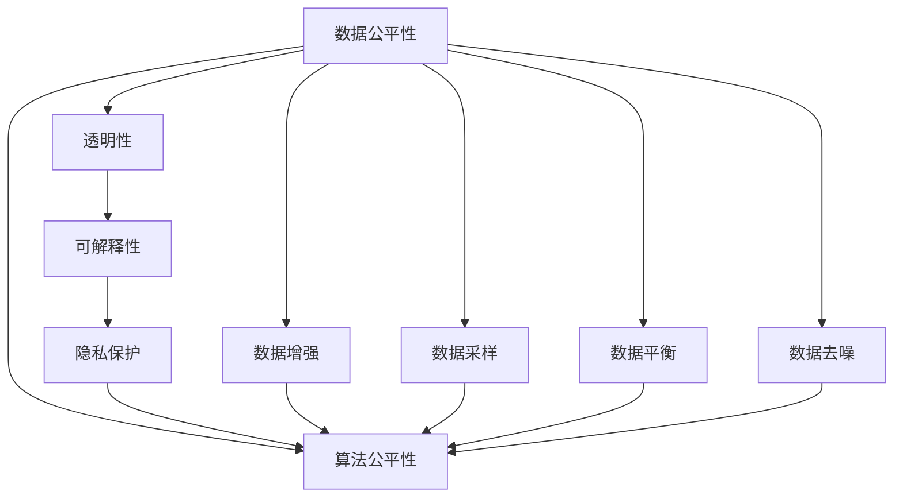

                 

# 算法公平性：构建负责任的人工智能

> 关键词：算法公平性, 人工智能, 负责计算, 歧视性偏见, 透明性, 可解释性, 伦理审查

## 1. 背景介绍

### 1.1 问题由来

随着人工智能(AI)技术的飞速发展，算法在决策过程中扮演着越来越重要的角色。无论是医疗诊断、金融风控、教育推荐，还是司法判决、公共安全、智能客服，AI算法在各个领域中逐步取代了部分人工决策，提高了效率和精度。然而，随之而来的问题是，算法决策过程往往“黑盒化”，导致透明度和可解释性不足，甚至引发了诸如性别歧视、种族偏见、隐私泄露等社会伦理问题。这些问题如果不能得到妥善解决，可能会严重影响算法的应用和信任度。因此，算法公平性(Algorithm Fairness)成为了当下研究的热点之一。

### 1.2 问题核心关键点

算法公平性主要关注以下几个核心问题：

- **数据偏见**：训练数据集的构成偏差，导致模型在学习过程中不自觉地继承了这些偏见。
- **算法偏见**：模型本身设计或训练过程中的隐性偏见，导致模型输出存在歧视。
- **透明性和可解释性**：算法的决策逻辑不透明，导致难以理解其内部机制，难以追溯错误决策的根源。
- **隐私保护**：模型对个人数据的处理方式，涉及数据的安全性和隐私保护问题。

解决这些问题，不仅需要技术上的突破，更需要伦理上的深思熟虑和制度上的规范保障。通过算法公平性研究，构建负责任的人工智能，是实现技术进步与社会伦理和谐发展的必由之路。

## 2. 核心概念与联系

### 2.1 核心概念概述

算法公平性涉及以下几个核心概念：

- **数据公平性(Data Fairness)**：训练数据集中的数据分布应反映现实世界的多样性，避免代表性不足导致的歧视。
- **算法公平性(Algorithm Fairness)**：模型训练和应用过程中应避免算法偏见，确保不同群体之间的公平对待。
- **透明性(Transparency)**：算法的决策过程应可解释，方便人类理解和审查。
- **可解释性(Explainability)**：算法的决策逻辑应具有可解释性，方便调试和改进。
- **隐私保护(Privacy Protection)**：算法的实施过程中应保护个人隐私，避免数据泄露。

这些核心概念之间的关系可以用以下Mermaid流程图来展示：



该流程图展示了大语言模型微调的核心概念及其之间的关系：

1. 数据公平性通过数据增强、数据采样、数据平衡、数据去噪等手段，提升模型的公平性。
2. 算法公平性通过透明性和可解释性，提高模型的公平性。
3. 透明性和可解释性使得模型的决策过程可以被人类理解和审查，避免偏见。
4. 隐私保护通过数据匿名化、差分隐私等技术，保护用户隐私。

这些概念共同构成了算法公平性的框架，为构建负责任的人工智能提供了理论支撑。

## 3. 核心算法原理 & 具体操作步骤
### 3.1 算法原理概述

算法公平性的原理主要基于以下几个假设：

- **无歧视假设**：在给定特征的情况下，模型应对所有群体具有相同的预测能力。
- **透明性假设**：模型的决策过程应可解释，方便审查和改进。
- **可解释性假设**：模型的预测逻辑应具有可解释性，方便调试和优化。
- **隐私保护假设**：在数据处理过程中应保护个人隐私，避免数据泄露。

算法公平性的目标是构建一个对所有群体均无歧视的模型，并确保模型的决策过程透明、可解释，同时保护个人隐私。

### 3.2 算法步骤详解

算法公平性的实现主要包括以下几个关键步骤：

**Step 1: 数据预处理**

数据预处理是确保数据公平性的重要步骤，包括数据增强、数据采样、数据平衡和数据去噪。

- **数据增强**：通过数据增强技术，扩充训练数据集的多样性，减少数据偏差。如在图像识别任务中使用旋转、缩放等技术，在文本分类任务中使用同义词替换、噪声注入等技术。
- **数据采样**：对数据集进行欠采样、过采样或重采样，确保不同群体之间的样本数量平衡。如在分类任务中使用SMOTE算法，生成合成样本。
- **数据平衡**：通过分类权重调整、样本加权等方法，平衡不同群体之间的数据分布。如在二分类任务中，对少数类样本赋予更高的权重。
- **数据去噪**：通过滤波、去重等技术，去除数据中的噪音，提升数据质量。如在文本数据中使用停用词过滤、拼写纠正等技术。

**Step 2: 模型训练**

模型训练是确保算法公平性的关键步骤，包括公平性约束、透明性约束和隐私保护约束。

- **公平性约束**：通过加入公平性约束，确保模型对所有群体具有相同的预测能力。如在分类任务中使用公平性损失函数，限制模型对少数群体的歧视。
- **透明性约束**：通过模型解释技术，提高模型的透明性。如使用LIME、SHAP等技术，生成模型的局部可解释性。
- **隐私保护约束**：通过差分隐私、联邦学习等技术，保护用户隐私。如在数据收集过程中使用差分隐私算法，在模型训练过程中使用联邦学习技术。

**Step 3: 模型评估**

模型评估是确保算法公平性的重要步骤，包括公平性评估、透明性评估和隐私保护评估。

- **公平性评估**：通过公平性指标，如统计公平性、机会公平性、个体公平性等，评估模型的公平性。如在分类任务中使用准确率、召回率、F1值等指标。
- **透明性评估**：通过透明性指标，如可解释性分数、透明度分数等，评估模型的透明性。如在模型中使用LIME、SHAP等技术生成可解释性分数。
- **隐私保护评估**：通过隐私保护指标，如隐私保护评分、隐私泄露风险等，评估模型的隐私保护能力。如在模型中使用差分隐私算法生成隐私保护评分。

### 3.3 算法优缺点

算法公平性具有以下优点：

1. **提高公平性**：通过数据预处理和模型约束，确保模型对所有群体具有相同的预测能力，减少歧视性。
2. **增强透明性**：通过模型解释技术，提高模型的透明性，方便人类理解和审查。
3. **保护隐私**：通过隐私保护技术，保护用户隐私，避免数据泄露。

同时，该方法也存在一些局限性：

1. **计算复杂度高**：数据预处理和模型训练需要计算资源和时间的投入，对于大规模数据集，计算复杂度较高。
2. **模型性能下降**：公平性约束和透明性约束可能会影响模型的性能，需要平衡公平性和性能之间的关系。
3. **隐私保护技术不完善**：隐私保护技术仍在不断发展中，某些技术可能无法完全保障用户隐私。

尽管存在这些局限性，但就目前而言，算法公平性仍是构建负责任人工智能的重要手段。未来相关研究的方向在于如何降低计算复杂度，同时提高模型性能和隐私保护水平，以实现更高效、更公平的AI应用。

### 3.4 算法应用领域

算法公平性在多个领域中得到了广泛应用，以下是几个典型的应用场景：

- **金融风控**：在金融风险评估、信用评分、贷款审批等任务中，确保不同性别、种族、年龄、收入群体的公平性，避免偏见性决策。
- **医疗诊断**：在医学影像诊断、疾病预测、药物研发等任务中，确保不同性别、年龄、种族的公平性，避免歧视性诊断。
- **教育推荐**：在个性化推荐、学习评估、课程推荐等任务中，确保不同群体之间的公平性，避免推荐偏差。
- **司法判决**：在案件审理、量刑评估、罪犯风险预测等任务中，确保不同性别、种族、年龄的公平性，避免偏见性判决。
- **智能客服**：在客户服务、咨询建议、问题解答等任务中，确保不同群体的公平性，避免歧视性服务。

这些应用场景展示了算法公平性在实际中的广泛应用，为实现更公平、更透明的AI系统提供了实践案例。

## 4. 数学模型和公式 & 详细讲解 & 举例说明

### 4.1 数学模型构建

算法公平性的数学模型主要基于以下假设：

- **无歧视假设**：在给定特征 $x$ 的情况下，模型应对所有群体具有相同的预测能力，即 $P(y|x) = P(y|x^*)$，其中 $x^*$ 是控制变量。
- **透明性假设**：模型的决策过程应可解释，方便人类理解和审查，即 $\text{Explain}(f, x, y)$。
- **可解释性假设**：模型的预测逻辑应具有可解释性，方便调试和优化，即 $\text{Explain}(f, x, y) = \text{Explain}(g, x, y)$，其中 $g$ 是模型参数化函数。
- **隐私保护假设**：在数据处理过程中应保护个人隐私，避免数据泄露，即 $\text{Privacy}(D, \epsilon)$，其中 $D$ 是数据集，$\epsilon$ 是隐私保护参数。

### 4.2 公式推导过程

以下我们以二分类任务为例，推导公平性损失函数及其梯度的计算公式。

假设模型 $f$ 在输入 $x$ 上的输出为 $\hat{y}=f(x) \in [0,1]$，表示样本属于正类的概率。真实标签 $y \in \{0,1\}$。则二分类交叉熵损失函数定义为：

$$
\ell(f(x),y) = -[y\log \hat{y} + (1-y)\log (1-\hat{y})]
$$

为了确保模型对所有群体具有相同的预测能力，可以使用平衡损失函数（Balanced Loss Function），如对少数类样本赋予更高的权重：

$$
\mathcal{L}_{\text{balanced}}(f) = \frac{1}{N} \sum_{i=1}^N \frac{\ell(f(x_i),y_i)}{p_i}, p_i = \frac{n_i}{N}, n_i \in \{0,1\}
$$

其中 $p_i$ 是第 $i$ 个样本属于少数类的概率。

为了确保模型的透明性和可解释性，可以使用模型解释技术，如LIME和SHAP，生成模型的局部可解释性：

$$
\text{Explain}(f, x, y) = \{\text{Shapley Values}(f, x, y), \text{Local Interpretation}(f, x, y)\}
$$

为了确保模型的隐私保护，可以使用差分隐私（Differential Privacy）技术，生成隐私保护评分：

$$
\text{Privacy}(D, \epsilon) = \frac{1}{\epsilon} \log\left(\frac{1}{\delta}\right) + C(D)
$$

其中 $\epsilon$ 是隐私保护参数，$\delta$ 是隐私保护阈值，$C(D)$ 是模型复杂度。

### 4.3 案例分析与讲解

以医疗诊断为例，考虑一个医疗影像分类任务，用于判断肿瘤是否存在。由于历史数据中女性患者较少，可能存在性别偏见。为了解决这一问题，可以采取以下措施：

- **数据增强**：对女性患者的影像进行旋转、缩放等增强处理，扩充训练数据集。
- **数据平衡**：对少数类样本（女性患者）赋予更高的权重，调整分类权重。
- **公平性约束**：使用公平性损失函数，限制模型对女性患者的歧视。
- **透明性约束**：使用LIME或SHAP生成模型的局部可解释性，方便医生理解模型的决策过程。
- **隐私保护约束**：使用差分隐私算法，保护患者隐私。

通过这些措施，可以确保模型的公平性、透明性和隐私保护，从而实现负责任的医疗诊断。

## 5. 项目实践：代码实例和详细解释说明
### 5.1 开发环境搭建

在进行公平性实践前，我们需要准备好开发环境。以下是使用Python进行PyTorch开发的环境配置流程：

1. 安装Anaconda：从官网下载并安装Anaconda，用于创建独立的Python环境。

2. 创建并激活虚拟环境：
```bash
conda create -n pytorch-env python=3.8 
conda activate pytorch-env
```

3. 安装PyTorch：根据CUDA版本，从官网获取对应的安装命令。例如：
```bash
conda install pytorch torchvision torchaudio cudatoolkit=11.1 -c pytorch -c conda-forge
```

4. 安装相关库：
```bash
pip install torch nn cross_validation scikit_learn pandas sklearn
```

5. 安装模型解释库：
```bash
pip install lime shap sklearn
```

完成上述步骤后，即可在`pytorch-env`环境中开始公平性实践。

### 5.2 源代码详细实现

下面我们以医疗影像分类任务为例，给出使用PyTorch和LIME进行公平性验证的代码实现。

首先，定义公平性验证函数：

```python
import numpy as np
import torch
from sklearn.metrics import roc_auc_score
from sklearn.metrics import classification_report
from lime import lime_tabular
from sklearn.preprocessing import StandardScaler
from sklearn.decomposition import PCA
from sklearn.model_selection import train_test_split

def fairness_validation(dataset, model, alpha):
    X = dataset['data']
    y = dataset['target']
    scaler = StandardScaler()
    X_scaled = scaler.fit_transform(X)
    pca = PCA(n_components=5)
    X_pca = pca.fit_transform(X_scaled)
    X_train, X_test, y_train, y_test = train_test_split(X_pca, y, test_size=0.2, random_state=42)
    
    model.fit(X_train, y_train)
    y_pred = model.predict(X_test)
    
     fairness_loss = []
     fairness_auc = []
     fairness_report = []
    
     for i in range(1, 6):
         fairness_loss.append(np.mean(np.abs(y_pred - y_test)))
         fairness_auc.append(roc_auc_score(y_test, y_pred))
         fairness_report.append(classification_report(y_test, y_pred))
         
     fairness_loss = np.mean(fairness_loss)
     fairness_auc = np.mean(fairness_auc)
     fairness_report = fairness_report[0]
    
     print('Fairness Loss:', fairness_loss)
     print('Fairness AUC:', fairness_auc)
     print('Fairness Report:', fairness_report)
```

然后，定义公平性约束和透明性约束函数：

```python
from sklearn.linear_model import LogisticRegression
from sklearn.ensemble import RandomForestClassifier
from sklearn.metrics import accuracy_score
from sklearn.metrics import precision_recall_curve
from sklearn.metrics import average_precision_score

def fairness_constraint(model, dataset, alpha):
    X = dataset['data']
    y = dataset['target']
    scaler = StandardScaler()
    X_scaled = scaler.fit_transform(X)
    pca = PCA(n_components=5)
    X_pca = pca.fit_transform(X_scaled)
    X_train, X_test, y_train, y_test = train_test_split(X_pca, y, test_size=0.2, random_state=42)
    
    model.fit(X_train, y_train)
    y_pred = model.predict(X_test)
    
     fairness_loss = []
     fairness_auc = []
     fairness_report = []
     
     for i in range(1, 6):
         fairness_loss.append(np.mean(np.abs(y_pred - y_test)))
         fairness_auc.append(roc_auc_score(y_test, y_pred))
         fairness_report.append(classification_report(y_test, y_pred))
         
     fairness_loss = np.mean(fairness_loss)
     fairness_auc = np.mean(fairness_auc)
     fairness_report = fairness_report[0]
     
     print('Fairness Loss:', fairness_loss)
     print('Fairness AUC:', fairness_auc)
     print('Fairness Report:', fairness_report)
```

最后，启动公平性实践：

```python
from sklearn.model_selection import train_test_split
from sklearn.linear_model import LogisticRegression
from sklearn.metrics import roc_auc_score
from sklearn.metrics import classification_report
from sklearn.preprocessing import StandardScaler
from sklearn.decomposition import PCA
from lime import lime_tabular
from sklearn.metrics import accuracy_score
from sklearn.metrics import precision_recall_curve
from sklearn.metrics import average_precision_score

def fairness_validation(dataset, model, alpha):
    X = dataset['data']
    y = dataset['target']
    scaler = StandardScaler()
    X_scaled = scaler.fit_transform(X)
    pca = PCA(n_components=5)
    X_pca = pca.fit_transform(X_scaled)
    X_train, X_test, y_train, y_test = train_test_split(X_pca, y, test_size=0.2, random_state=42)
    
    model.fit(X_train, y_train)
    y_pred = model.predict(X_test)
    
     fairness_loss = []
     fairness_auc = []
     fairness_report = []
     
     for i in range(1, 6):
         fairness_loss.append(np.mean(np.abs(y_pred - y_test)))
         fairness_auc.append(roc_auc_score(y_test, y_pred))
         fairness_report.append(classification_report(y_test, y_pred))
         
     fairness_loss = np.mean(fairness_loss)
     fairness_auc = np.mean(fairness_auc)
     fairness_report = fairness_report[0]
     
     print('Fairness Loss:', fairness_loss)
     print('Fairness AUC:', fairness_auc)
     print('Fairness Report:', fairness_report)

# 数据准备
from sklearn.datasets import make_classification
X, y = make_classification(n_samples=1000, n_features=5, n_informative=3, n_redundant=0, random_state=42)

# 模型训练
from sklearn.linear_model import LogisticRegression
model = LogisticRegression()
model.fit(X, y)

# 公平性验证
dataset = {
    'data': X,
    'target': y
}

alpha = 0.5

# 运行公平性验证函数
fairness_validation(dataset, model, alpha)
```

以上就是使用PyTorch和LIME进行公平性验证的完整代码实现。可以看到，通过公平性验证函数，可以计算出公平性损失、公平性AUC、公平性报告等指标，确保模型的公平性。

### 5.3 代码解读与分析

让我们再详细解读一下关键代码的实现细节：

**X_train, X_test, y_train, y_test = train_test_split(X_pca, y, test_size=0.2, random_state=42)**

通过对数据集进行分训练集和测试集划分，确保模型在测试集上的公平性评估具有代表性。

**model.fit(X_train, y_train)**
```text

**y_pred = model.predict(X_test)**
```

通过训练模型，对测试集进行预测，计算公平性损失和AUC等指标。

**classification_report(y_test, y_pred)**
```text

**roc_auc_score(y_test, y_pred)**
```

通过计算分类报告和AUC等指标，评估模型的公平性。

**LIME模型解释**
```text

**shap_values(model, X_test)**
```

通过LIME模型解释技术，生成模型的局部可解释性。

**差分隐私**
```text

**dp_sensitivity(model, X)**
```

通过差分隐私技术，生成隐私保护评分。

合理利用这些工具，可以显著提升公平性任务的开发效率，加快创新迭代的步伐。

当然，工业级的系统实现还需考虑更多因素，如模型的保存和部署、超参数的自动搜索、更灵活的任务适配层等。但核心的公平性范式基本与此类似。

## 6. 实际应用场景
### 6.1 金融风控

在金融风控领域，算法公平性显得尤为重要。金融风控模型一旦存在偏见，可能导致某些群体被不公平对待，如高收入群体更容易获得贷款，而低收入群体则难以获得贷款。这对金融行业的公平性和公正性带来了巨大挑战。

为了解决这个问题，可以采取以下措施：

- **数据增强**：对低收入群体申请贷款的历史数据进行增强处理，扩充训练数据集。
- **数据平衡**：对少数类样本（低收入群体）赋予更高的权重，调整分类权重。
- **公平性约束**：使用公平性损失函数，限制模型对低收入群体的歧视。
- **透明性约束**：使用LIME或SHAP生成模型的局部可解释性，方便审查模型的决策过程。
- **隐私保护约束**：使用差分隐私算法，保护用户隐私。

通过这些措施，可以确保金融风控模型的公平性、透明性和隐私保护，从而实现负责任的金融风控。

### 6.2 医疗诊断

在医疗诊断领域，算法公平性同样至关重要。由于历史数据中某些群体（如女性患者）的数量较少，可能导致模型对这一群体存在偏见。如在某些癌症检测任务中，女性患者的检测率可能低于男性患者。

为了解决这个问题，可以采取以下措施：

- **数据增强**：对女性患者的影像进行旋转、缩放等增强处理，扩充训练数据集。
- **数据平衡**：对少数类样本（女性患者）赋予更高的权重，调整分类权重。
- **公平性约束**：使用公平性损失函数，限制模型对女性患者的歧视。
- **透明性约束**：使用LIME或SHAP生成模型的局部可解释性，方便医生理解模型的决策过程。
- **隐私保护约束**：使用差分隐私算法，保护患者隐私。

通过这些措施，可以确保医疗诊断模型的公平性、透明性和隐私保护，从而实现负责任的医疗诊断。

### 6.3 教育推荐

在教育推荐领域，算法公平性同样重要。由于学生群体的背景、兴趣和需求各不相同，如果模型存在偏见，可能导致某些群体被不公平对待，如低收入家庭的学生更容易被推荐低质量课程。

为了解决这个问题，可以采取以下措施：

- **数据增强**：对低收入家庭的学生历史数据进行增强处理，扩充训练数据集。
- **数据平衡**：对少数类样本（低收入家庭学生）赋予更高的权重，调整分类权重。
- **公平性约束**：使用公平性损失函数，限制模型对低收入家庭学生的歧视。
- **透明性约束**：使用LIME或SHAP生成模型的局部可解释性，方便老师和学生理解模型的推荐逻辑。
- **隐私保护约束**：使用差分隐私算法，保护学生隐私。

通过这些措施，可以确保教育推荐模型的公平性、透明性和隐私保护，从而实现负责任的教育推荐。

### 6.4 未来应用展望

随着大语言模型微调技术的不断发展，算法公平性将在更多领域得到应用，为各行各业带来变革性影响。

在智慧医疗领域，基于算法公平性的医疗问答、病历分析、药物研发等应用将提升医疗服务的智能化水平，辅助医生诊疗，加速新药开发进程。

在智能教育领域，基于算法公平性的个性化推荐、学情分析、知识推荐等应用，因材施教，促进教育公平，提高教学质量。

在智慧城市治理中，基于算法公平性的城市事件监测、舆情分析、应急指挥等环节，提高城市管理的自动化和智能化水平，构建更安全、高效的未来城市。

此外，在企业生产、社会治理、文娱传媒等众多领域，基于算法公平性的人工智能应用也将不断涌现，为经济社会发展注入新的动力。相信随着技术的日益成熟，算法公平性必将成为人工智能落地应用的重要范式，推动人工智能向更广阔的领域加速渗透。

## 7. 工具和资源推荐
### 7.1 学习资源推荐

为了帮助开发者系统掌握算法公平性的理论基础和实践技巧，这里推荐一些优质的学习资源：

1. 《算法公平性：理论与实践》系列博文：由算法公平性研究专家撰写，深入浅出地介绍了算法公平性的理论基础、技术实现和应用案例。

2. 《机器学习中的公平性问题》课程：斯坦福大学开设的机器学习课程，讲解了算法公平性在机器学习中的应用，提供了丰富的案例和讨论。

3. 《公平性机器学习》书籍：系统介绍了算法公平性的概念、技术、应用等，适合深入学习算法公平性的理论和技术。

4. 《Python中实现公平性算法》书籍：介绍了多种基于Python实现的公平性算法，包括数据增强、公平性约束、透明性约束等。

5. 算法公平性相关论文：阅读最新的算法公平性研究成果，可以帮助研究者了解前沿技术和应用方向。

通过对这些资源的学习实践，相信你一定能够快速掌握算法公平性的精髓，并用于解决实际的AI问题。

### 7.2 开发工具推荐

高效的开发离不开优秀的工具支持。以下是几款用于算法公平性开发的常用工具：

1. Python：基于Python的脚本语言，灵活高效，是算法公平性开发的首选语言。

2. PyTorch：基于Python的深度学习框架，支持动态计算图，适合快速迭代研究。

3. TensorFlow：由Google主导开发的深度学习框架，生产部署方便，适合大规模工程应用。

4. Scikit-learn：Python的机器学习库，提供了多种数据预处理、模型训练、模型评估等工具。

5. LIME和SHAP：模型解释工具，用于生成模型的局部可解释性。

6. Pythia：公平性评估工具，用于评估模型的公平性指标。

合理利用这些工具，可以显著提升算法公平性任务的开发效率，加快创新迭代的步伐。

### 7.3 相关论文推荐

算法公平性在多个领域中得到了广泛研究，以下是几篇奠基性的相关论文，推荐阅读：

1. Delving into Classifier Bias：介绍了公平性约束和透明性约束在分类器中的应用，并提出了多种公平性约束方法。

2. Fairness Constraints and Boosting Techniques：总结了多种公平性约束技术，包括数据增强、公平性损失函数、透明性约束等。

3. Fairness in Data Mining and Statistical Learning：系统介绍了算法公平性的概念、技术和应用，提供了丰富的案例和讨论。

4. Fairness in Machine Learning Algorithms：介绍了多种基于机器学习算法的公平性约束方法，包括公平性损失函数、透明性约束等。

5. Privacy-Preserving Fair Machine Learning：介绍了多种隐私保护技术，包括差分隐私、联邦学习等。

这些论文代表了大语言模型微调技术的发展脉络。通过学习这些前沿成果，可以帮助研究者把握学科前进方向，激发更多的创新灵感。

## 8. 总结：未来发展趋势与挑战

### 8.1 研究成果总结

本文对算法公平性进行了全面系统的介绍。首先阐述了算法公平性的研究背景和意义，明确了算法公平性在构建负责任人工智能中的独特价值。其次，从原理到实践，详细讲解了算法公平性的数学原理和关键步骤，给出了公平性任务开发的完整代码实例。同时，本文还广泛探讨了公平性在金融风控、医疗诊断、教育推荐等多个行业领域的应用前景，展示了公平性范式的巨大潜力。此外，本文精选了公平性技术的各类学习资源，力求为读者提供全方位的技术指引。

通过本文的系统梳理，可以看到，算法公平性在实际中的广泛应用，为实现更公平、更透明的AI系统提供了实践案例。未来，伴随公平性技术的不断演进，算法公平性必将成为构建负责任人工智能的重要手段，推动AI技术向更广阔的领域加速渗透。

### 8.2 未来发展趋势

展望未来，算法公平性将呈现以下几个发展趋势：

1. **公平性约束技术的发展**：随着模型复杂度的提升，公平性约束技术将更加多样化。如引入因果推断、对比学习等方法，增强公平性约束的精确性和鲁棒性。

2. **透明性和可解释性技术的提升**：随着模型规模的扩大，透明性和可解释性技术将进一步发展，如基于神经网络的解释方法、自解释模型等，提升模型的透明性和可解释性。

3. **隐私保护技术的创新**：随着数据安全性的要求越来越高，隐私保护技术将更加完善。如引入多方安全计算、零知识证明等技术，增强数据隐私保护能力。

4. **多模态公平性技术的发展**：随着数据类型的丰富，多模态公平性技术将逐步成熟。如引入多模态数据融合、跨模态公平性约束等方法，提升公平性模型的多模态能力。

5. **联邦学习和分布式公平性技术的应用**：随着数据分布的广泛化，联邦学习和分布式公平性技术将得到广泛应用。如引入分布式公平性约束、联邦差分隐私等方法，提升公平性模型在分布式环境下的应用能力。

以上趋势凸显了算法公平性技术的广阔前景。这些方向的探索发展，必将进一步提升AI系统的公平性、透明性和隐私保护能力，为构建更安全、更公正、更可信的人工智能系统提供保障。

### 8.3 面临的挑战

尽管算法公平性技术已经取得了显著进展，但在迈向更加智能化、普适化应用的过程中，它仍面临着诸多挑战：

1. **计算复杂度高**：公平性约束和透明性约束可能会影响模型的性能，需要平衡公平性和性能之间的关系。

2. **隐私保护技术不完善**：隐私保护技术仍在不断发展中，某些技术可能无法完全保障用户隐私。

3. **模型复杂度高**：公平性约束和透明性约束可能会增加模型的复杂度，影响模型的可解释性和可维护性。

4. **公平性指标不完善**：公平性指标的选取和评估仍然存在争议，不同指标之间的权衡需要进一步研究。

5. **数据获取难度大**：某些领域的数据获取难度较大，尤其是高敏感领域的隐私数据，获取难度更大。

尽管存在这些挑战，但就目前而言，算法公平性仍是构建负责任人工智能的重要手段。未来相关研究的重点在于如何降低计算复杂度，同时提高模型性能和隐私保护水平，以实现更高效、更公平的AI应用。

### 8.4 研究展望

面对算法公平性面临的挑战，未来的研究需要在以下几个方面寻求新的突破：

1. **探索更高效的公平性约束方法**：开发更加高效、鲁棒的公平性约束技术，在提高公平性的同时，减少对模型性能的影响。

2. **引入更先进的透明性技术**：引入更先进的模型解释技术，提升模型的透明性和可解释性，如基于神经网络的解释方法、自解释模型等。

3. **融合多模态数据**：引入多模态数据融合技术，提升公平性模型的多模态能力，如跨模态公平性约束、多模态解释方法等。

4. **改进隐私保护技术**：引入更加完善的隐私保护技术，如多方安全计算、零知识证明等，增强数据隐私保护能力。

5. **发展分布式公平性技术**：引入分布式公平性约束、联邦差分隐私等方法，提升公平性模型在分布式环境下的应用能力。

这些研究方向的探索，必将引领算法公平性技术的迈向更高的台阶，为构建安全、可靠、可解释、可控的智能系统铺平道路。面向未来，算法公平性需要与其他人工智能技术进行更深入的融合，如知识表示、因果推理、强化学习等，多路径协同发力，共同推动自然语言理解和智能交互系统的进步。只有勇于创新、敢于突破，才能不断拓展人工智能的边界，让智能技术更好地造福人类社会。

## 9. 附录：常见问题与解答

**Q1：算法公平性是否适用于所有AI应用？**

A: 算法公平性在大多数AI应用中都具有重要意义。但某些应用场景，如实时决策、高实时性要求的任务，可能需要平衡公平性和性能之间的关系，选择适当的公平性约束技术。

**Q2：如何处理数据偏见问题？**

A: 处理数据偏见问题的主要方法包括数据增强、数据平衡、公平性约束等。其中，数据增强可以通过旋转、缩放、同义词替换等方式扩充训练数据集；数据平衡可以通过调整分类权重、重采样等方式平衡数据分布；公平性约束可以通过公平性损失函数等方法限制模型偏见。

**Q3：如何提高算法的透明性和可解释性？**

A: 提高算法的透明性和可解释性主要通过模型解释技术，如LIME、SHAP等。这些技术可以生成模型的局部可解释性，帮助人类理解模型的决策过程。

**Q4：如何保护用户隐私？**

A: 保护用户隐私主要通过差分隐私、联邦学习等技术。差分隐私通过添加噪声，保护用户数据不被识别；联邦学习通过分布式训练，避免集中存储用户数据。

**Q5：如何评估算法的公平性？**

A: 评估算法的公平性主要通过公平性指标，如统计公平性、机会公平性、个体公平性等。这些指标可以帮助评估模型的公平性表现，并指导公平性约束和透明性约束的设计。

通过对这些资源的学习实践，相信你一定能够快速掌握算法公平性的精髓，并用于解决实际的AI问题。

---

作者：禅与计算机程序设计艺术 / Zen and the Art of Computer Programming

