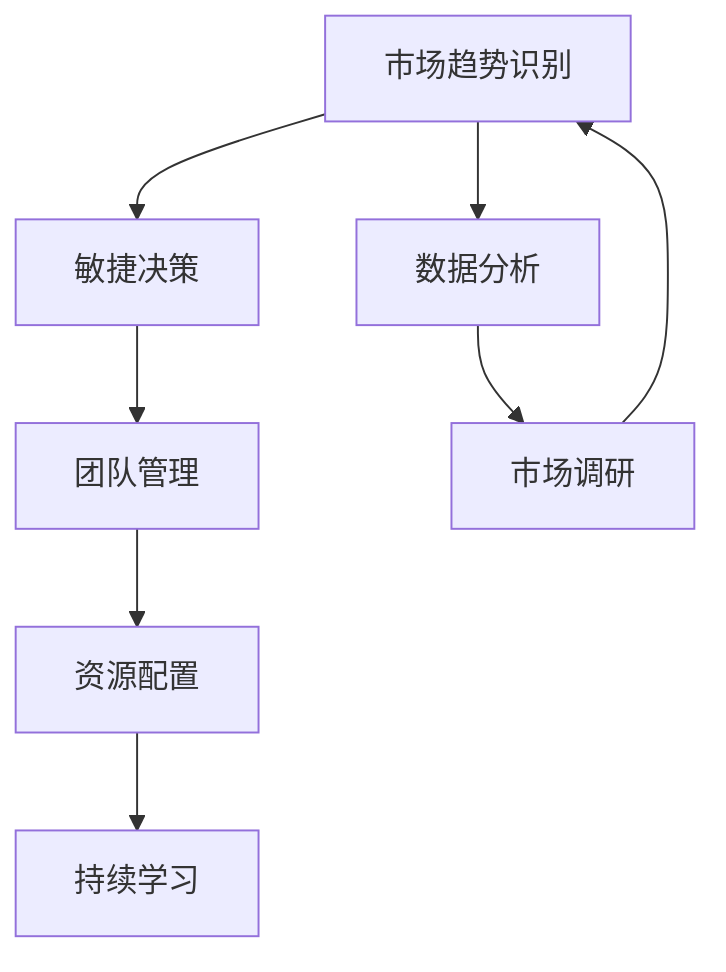

                 

# 管理者如何应对快速变化的商业环境

## 1. 背景介绍

### 1.1 问题由来

在当今数字化和全球化的商业环境中，企业面临的竞争压力越来越大，市场需求变化的速度也在不断加快。快速变化的市场环境要求企业不仅要在技术上保持领先，更需要在管理上具备高度的灵活性和应变能力。管理者需要具备敏捷的思维，善于识别市场趋势，能够快速调整策略，以适应不断变化的外部环境。然而，传统管理模式往往难以应对这种变化，导致许多企业在市场竞争中处于被动状态。

### 1.2 问题核心关键点

面对快速变化的商业环境，管理者需要重点关注以下几个关键点：

1. **市场趋势识别**：管理者需要具备敏锐的洞察力，能够及时发现市场变化趋势。
2. **敏捷决策**：管理者需要快速做出决策，以适应市场变化。
3. **团队管理**：管理者需要建立高效的团队，确保团队能够迅速执行决策。
4. **资源配置**：管理者需要优化资源配置，确保有限的资源能够高效利用。
5. **持续学习**：管理者需要不断学习新知识，保持自己的竞争力。

## 2. 核心概念与联系

### 2.1 核心概念概述

为了更好地理解如何应对快速变化的商业环境，本节将介绍几个关键概念：

- **市场趋势识别**：通过数据分析、市场调研等手段，识别市场变化的趋势。
- **敏捷决策**：快速做出决策并执行，以应对市场变化。
- **团队管理**：构建高效的团队，确保团队能够迅速响应市场需求。
- **资源配置**：优化资源分配，确保资源利用最大化。
- **持续学习**：不断学习新知识，提升个人和团队的能力。

### 2.2 核心概念原理和架构的 Mermaid 流程图



这个流程图展示了市场趋势识别、敏捷决策、团队管理、资源配置和持续学习之间的关系：

1. 通过数据分析和市场调研识别市场趋势。
2. 根据识别出的市场趋势进行敏捷决策，快速调整策略。
3. 建立高效的团队，确保决策能够迅速执行。
4. 优化资源配置，确保资源高效利用。
5. 通过持续学习，不断提升个人和团队的能力。

## 3. 核心算法原理 & 具体操作步骤

### 3.1 算法原理概述

管理者应对快速变化的商业环境，可以采用基于监督学习的方法。该方法通过训练一个预测模型，对市场趋势进行识别和预测。模型通过分析历史数据，识别出市场变化的规律和趋势，从而指导管理者做出快速、准确的决策。

### 3.2 算法步骤详解

1. **数据收集**：收集市场相关的数据，如市场规模、增长率、竞争者动态等。
2. **数据预处理**：对数据进行清洗、归一化等预处理步骤。
3. **特征工程**：根据市场数据的特点，选择合适的特征，如市场规模、增长率、价格变化等。
4. **模型训练**：选择合适的模型，如线性回归、决策树、随机森林等，对历史数据进行训练。
5. **模型评估**：使用测试数据集对模型进行评估，确保模型的准确性和可靠性。
6. **模型应用**：将训练好的模型应用于实际的市场分析中，提供市场趋势预测。

### 3.3 算法优缺点

#### 优点

- **高准确性**：基于监督学习的模型能够提供较为准确的市场趋势预测。
- **自动化**：模型可以自动进行数据分析和趋势预测，减轻管理者的工作量。
- **可解释性**：模型能够提供详细的预测结果和分析报告，帮助管理者理解市场变化的原因。

#### 缺点

- **数据依赖性**：模型的预测效果依赖于数据的质量和完整性。
- **模型复杂性**：模型的训练和调参过程较为复杂，需要一定的技术支持。
- **动态变化**：市场环境变化较快，模型需要定期更新和重新训练。

### 3.4 算法应用领域

基于监督学习的方法可以应用于多个领域，如市场预测、产品定价、客户行为分析等。通过市场趋势预测，管理者可以及时调整产品线、营销策略，优化资源配置，提升企业竞争力。

## 4. 数学模型和公式 & 详细讲解 & 举例说明

### 4.1 数学模型构建

假设市场数据为 $(x_i, y_i)$，其中 $x_i$ 表示第 $i$ 个时间点的市场数据，$y_i$ 表示市场变化的方向（如上升、下降、稳定）。市场趋势预测的目标是找到函数 $f(x)$，使得 $f(x_i) = y_i$。

### 4.2 公式推导过程

采用线性回归模型进行市场趋势预测。假设 $f(x)$ 为线性函数：

$$
f(x) = \beta_0 + \beta_1 x
$$

其中 $\beta_0$ 和 $\beta_1$ 为模型参数。根据最小二乘法，模型的参数可以通过以下公式求解：

$$
\hat{\beta}_1 = \frac{\sum_{i=1}^n (x_i - \bar{x})(y_i - \bar{y})}{\sum_{i=1}^n (x_i - \bar{x})^2}
$$

$$
\hat{\beta}_0 = \bar{y} - \hat{\beta}_1 \bar{x}
$$

其中 $\bar{x}$ 和 $\bar{y}$ 分别为 $x$ 和 $y$ 的均值。

### 4.3 案例分析与讲解

以电商行业为例，假设某电商平台收集了过去一年的销售数据，包括时间点、销售额和库存量。利用线性回归模型，预测下个月的销售趋势。

- **数据收集**：收集过去一年的销售数据，包括时间点、销售额和库存量。
- **数据预处理**：对数据进行清洗，去除异常值，归一化处理。
- **特征工程**：选择时间点和库存量作为特征，预测下个月的销售额。
- **模型训练**：使用线性回归模型对历史数据进行训练，得到模型参数 $\hat{\beta}_0$ 和 $\hat{\beta}_1$。
- **模型评估**：使用测试数据集对模型进行评估，计算均方误差等指标。
- **模型应用**：将训练好的模型应用于实际的市场分析中，预测下个月的销售趋势。

## 5. 项目实践：代码实例和详细解释说明

### 5.1 开发环境搭建

在进行市场趋势预测时，需要使用Python和相关库，如Pandas、Numpy、Scikit-learn等。以下是安装和配置Python环境的步骤：

1. 安装Anaconda：从官网下载并安装Anaconda，用于创建独立的Python环境。
2. 创建并激活虚拟环境：
```bash
conda create -n market-analysis python=3.8 
conda activate market-analysis
```

3. 安装所需库：
```bash
pip install pandas numpy scikit-learn matplotlib seaborn
```

### 5.2 源代码详细实现

以下是使用Python和Scikit-learn库进行市场趋势预测的代码实现：

```python
import pandas as pd
from sklearn.linear_model import LinearRegression
import matplotlib.pyplot as plt

# 读取数据
data = pd.read_csv('sales_data.csv')

# 数据预处理
data['time'] = pd.to_datetime(data['time'])
data.set_index('time', inplace=True)
data = data.resample('M').mean()

# 特征工程
X = data[['inventory']]
y = data['sales']

# 模型训练
model = LinearRegression()
model.fit(X, y)

# 模型评估
y_pred = model.predict(X)
mse = ((y_pred - y) ** 2).mean()

# 结果可视化
plt.scatter(y, y_pred)
plt.xlabel('True Sales')
plt.ylabel('Predicted Sales')
plt.show()

# 结果输出
print(f'Mean Squared Error: {mse:.2f}')
```

### 5.3 代码解读与分析

代码实现主要分为以下几个步骤：

- **数据读取**：使用Pandas库读取销售数据，将其转换为时间序列数据。
- **数据预处理**：将时间序列数据按月进行平均处理。
- **特征工程**：选择库存量作为预测特征。
- **模型训练**：使用线性回归模型对历史数据进行训练，得到模型参数。
- **模型评估**：计算均方误差，评估模型预测效果。
- **结果可视化**：将真实值与预测值进行散点图可视化，直观展示预测效果。
- **结果输出**：输出均方误差，进一步分析模型性能。

## 6. 实际应用场景

### 6.1 智能客服系统

基于市场趋势预测的智能客服系统可以提升客户服务质量。通过分析用户咨询数据，预测市场需求变化，智能客服系统可以主动调整回答策略，优化服务流程。

例如，电商平台的客服系统可以实时分析用户咨询内容，预测用户购买需求，自动推送相关产品推荐。通过市场趋势预测，智能客服系统能够更准确地理解用户需求，提升用户满意度。

### 6.2 金融舆情监测

在金融领域，基于市场趋势预测的舆情监测系统可以及时发现市场变化，帮助金融从业者做出快速决策。

例如，股票交易平台可以实时分析市场数据，预测股市趋势，自动调整交易策略。通过市场趋势预测，金融从业者可以更准确地把握市场机会，减少投资风险。

### 6.3 个性化推荐系统

在电商和媒体领域，基于市场趋势预测的个性化推荐系统可以提升用户体验，增加用户粘性。

例如，电商平台可以实时分析用户浏览和购买数据，预测用户兴趣变化，动态调整推荐内容。通过市场趋势预测，个性化推荐系统能够更准确地匹配用户需求，提升用户转化率。

### 6.4 未来应用展望

随着市场趋势预测技术的不断发展，其应用领域将不断扩大。未来，基于市场趋势预测的智能系统将广泛应用于更多行业，带来更高效、更智能的服务。

- **智能制造**：通过市场趋势预测，智能制造系统可以优化生产计划，提升生产效率。
- **智慧城市**：通过市场趋势预测，智慧城市系统可以优化资源配置，提升城市管理效率。
- **医疗健康**：通过市场趋势预测，医疗健康系统可以优化资源分配，提升医疗服务质量。

## 7. 工具和资源推荐

### 7.1 学习资源推荐

为帮助管理者掌握市场趋势预测的理论基础和实践技巧，推荐以下学习资源：

1. **《Python数据科学手册》**：介绍Python在数据科学中的应用，适合初学者入门。
2. **《机器学习实战》**：讲解机器学习的基本概念和实际应用，适合有基础的读者。
3. **Kaggle**：数据科学竞赛平台，提供丰富的数据集和竞赛机会，适合实践练习。
4. **Coursera**：在线课程平台，提供大量数据分析和机器学习课程，适合系统学习。
5. **Scikit-learn官方文档**：详细介绍了Scikit-learn库的使用方法和算法原理，适合深入学习。

### 7.2 开发工具推荐

为提高市场趋势预测的开发效率，推荐以下开发工具：

1. **Jupyter Notebook**：支持Python代码编写和数据可视化，适合快速迭代和调试。
2. **PyCharm**：Python集成开发环境，提供丰富的功能和插件，适合长期开发。
3. **Anaconda Navigator**：图形化界面，方便管理虚拟环境和安装库。
4. **Visual Studio Code**：轻量级代码编辑器，支持多种语言和扩展，适合多种开发场景。
5. **Git**：版本控制系统，方便团队协作和代码管理。

### 7.3 相关论文推荐

为深入理解市场趋势预测的理论和实践，推荐以下相关论文：

1. **A Survey of Forecasting Methods for Sales Data**：综述了各种销售预测方法，适合全面了解。
2. **Time Series Forecasting with Long Short-Term Memory Networks**：介绍长短期记忆网络在时间序列预测中的应用，适合技术进阶。
3. **Machine Learning for Market Prediction**：介绍机器学习在市场预测中的应用，适合实战练习。
4. **Deep Learning for Financial Time Series Analysis**：介绍深度学习在金融时间序列分析中的应用，适合深入研究。

## 8. 总结：未来发展趋势与挑战

### 8.1 总结

本文系统介绍了如何利用基于监督学习的方法进行市场趋势预测，帮助管理者应对快速变化的商业环境。通过数据分析、模型训练和结果评估，管理者能够及时了解市场变化，做出快速、准确的决策。具体步骤如下：

1. **数据收集**：收集市场相关的数据。
2. **数据预处理**：对数据进行清洗和归一化处理。
3. **特征工程**：选择合适的特征，构建数据集。
4. **模型训练**：使用线性回归等模型对数据进行训练。
5. **模型评估**：使用测试数据集评估模型性能。
6. **模型应用**：将训练好的模型应用于市场分析中，预测未来趋势。

通过以上步骤，管理者可以高效地应对市场变化，提升决策的科学性和准确性。

### 8.2 未来发展趋势

未来，市场趋势预测技术将呈现以下几个发展趋势：

1. **模型自动化**：自动化模型训练和调参过程，降低技术门槛。
2. **多模态预测**：结合多种数据源，提升预测准确性。
3. **实时预测**：实时分析和预测市场变化，提高决策效率。
4. **智能推荐**：结合推荐系统，提升用户体验。
5. **跨行业应用**：在更多行业领域中推广应用，提升企业竞争力。

### 8.3 面临的挑战

在应用市场趋势预测技术时，面临以下挑战：

1. **数据质量问题**：数据不完整、不准确，影响模型效果。
2. **模型复杂性**：模型训练和调参过程复杂，需要技术支持。
3. **市场变化**：市场环境变化快，模型需要定期更新。
4. **隐私保护**：保护用户数据隐私，避免数据泄露。
5. **技术融合**：将市场趋势预测技术与业务系统整合，提升应用效果。

### 8.4 研究展望

未来，市场趋势预测技术的研究方向将集中在以下几个方面：

1. **大数据处理**：处理大规模数据，提升预测精度。
2. **深度学习**：使用深度学习模型提升预测效果。
3. **强化学习**：结合强化学习优化模型训练过程。
4. **联邦学习**：在保护隐私的前提下，共享数据和模型。
5. **解释性模型**：提升模型的可解释性，增强信任度。

通过不断探索和创新，市场趋势预测技术将更好地服务于企业决策，助力企业应对快速变化的商业环境。

## 9. 附录：常见问题与解答

**Q1：市场趋势预测的准确性受哪些因素影响？**

A: 市场趋势预测的准确性主要受以下因素影响：

1. **数据质量**：数据不完整、不准确，会影响模型效果。
2. **特征选择**：选择合适的特征，提升模型预测能力。
3. **模型选择**：选择适合的模型，提升预测准确性。
4. **时间序列长度**：时间序列长度越长，预测效果越好。
5. **外部因素**：市场环境、政策变化等外部因素也会影响预测结果。

**Q2：如何处理异常值和缺失值？**

A: 处理异常值和缺失值的方法如下：

1. **异常值处理**：使用统计方法或可视化工具，识别并处理异常值。
2. **缺失值处理**：使用插值方法或填补方法，处理缺失值。
3. **数据清洗**：对数据进行清洗，去除不合法、不合理的值。
4. **数据预处理**：对数据进行归一化、标准化等预处理步骤。

**Q3：市场趋势预测的局限性有哪些？**

A: 市场趋势预测的局限性包括：

1. **数据依赖性**：模型的预测效果依赖于数据的质量和完整性。
2. **模型复杂性**：模型的训练和调参过程较为复杂，需要一定的技术支持。
3. **动态变化**：市场环境变化快，模型需要定期更新和重新训练。
4. **外部因素**：市场环境、政策变化等外部因素也会影响预测结果。

**Q4：如何提升市场趋势预测的模型性能？**

A: 提升市场趋势预测的模型性能的方法如下：

1. **数据增强**：使用数据增强技术，提升数据多样性。
2. **特征工程**：选择和构造合适的特征，提升模型预测能力。
3. **模型优化**：使用更复杂的模型，如深度学习模型，提升预测效果。
4. **超参数调优**：使用网格搜索或随机搜索，优化模型超参数。
5. **集成学习**：使用集成学习方法，提升模型泛化能力。

**Q5：市场趋势预测在实际应用中需要注意哪些问题？**

A: 在实际应用中，需要注意以下问题：

1. **数据隐私**：保护用户数据隐私，避免数据泄露。
2. **模型解释性**：提升模型的可解释性，增强信任度。
3. **实时性**：保证模型的实时性，提高决策效率。
4. **跨行业应用**：将市场趋势预测技术与业务系统整合，提升应用效果。
5. **技术支持**：提供技术支持，帮助用户理解和使用模型。

---

作者：禅与计算机程序设计艺术 / Zen and the Art of Computer Programming

