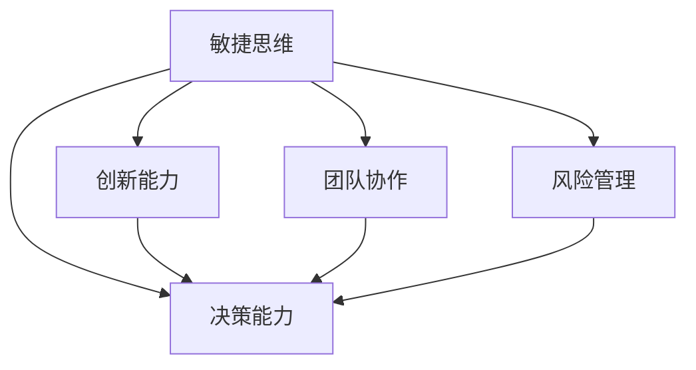

                 

# 管理者的思维敏捷度训练

> 关键词：管理者,敏捷思维,决策能力,领导力,创新能力,项目管理

## 1. 背景介绍

### 1.1 问题由来
在当今快速变化的商业环境中，管理者的角色正变得日益复杂和多样化。面对市场的激烈竞争、技术的飞速发展、以及不断变化的需求，管理者需要具备高度的思维敏捷度，以迅速捕捉机会、适应变化、解决问题。然而，许多管理者在应对快速变化时感到力不从心，无法及时做出正确的决策，更难以在压力下保持冷静和创新。

### 1.2 问题核心关键点
本节将探讨如何通过科学的训练方法，提升管理者的思维敏捷度，帮助他们在复杂的商业环境中游刃有余。

1. **敏捷思维的含义**：敏捷思维是指在面对不确定性和变化时，能够快速灵活地思考和行动的能力。
2. **敏捷思维的关键能力**：包括快速判断、灵活应变、创新能力、团队协作、风险管理等。
3. **敏捷思维的重要性**：在快速变化的商业环境中，敏捷思维是管理者能够迅速抓住机会、应对挑战的关键。

### 1.3 问题研究意义
提升管理者的思维敏捷度，对于企业的长期发展具有重要意义：

1. **提高决策效率**：敏捷思维能帮助管理者在面对复杂问题时迅速做出准确决策。
2. **增强竞争力**：敏捷思维使企业能更快适应市场变化，抢占先机。
3. **激发创新**：敏捷思维促进管理者不断思考新方法，推动企业创新。
4. **增强领导力**：敏捷思维提升管理者的影响力和领导能力，推动团队发展。

## 2. 核心概念与联系

### 2.1 核心概念概述

为更好地理解管理者思维敏捷度的训练方法，本节将介绍几个关键概念：

- **敏捷思维**：指管理者在面对变化和挑战时，能快速灵活地思考和行动的能力。
- **决策能力**：指管理者在面对复杂情境时，能迅速、准确做出决策的能力。
- **创新能力**：指管理者能提出新的观点、方法或策略，推动企业创新的能力。
- **团队协作**：指管理者能有效地组织和管理团队，充分发挥团队成员的潜力。
- **风险管理**：指管理者能识别、评估和管理风险的能力。

这些核心概念之间的逻辑关系可以通过以下Mermaid流程图来展示：



这个流程图展示了这个核心概念的相互关系：

1. 敏捷思维是决策、创新、团队协作、风险管理的基础。
2. 决策能力、创新能力、团队协作、风险管理都是敏捷思维的具体表现形式。

## 3. 核心算法原理 & 具体操作步骤
### 3.1 算法原理概述

提升管理者思维敏捷度的训练方法，本质上是围绕着敏捷思维的几大关键能力，通过系统的训练和实践，帮助管理者逐步提升这些能力的过程。

管理者思维敏捷度的训练主要包括以下几个步骤：

1. **识别和理解敏捷思维的关键能力**：明确管理者需要具备的关键能力，如快速判断、灵活应变、创新能力、团队协作、风险管理等。
2. **制定训练计划**：根据关键能力，制定具体的训练计划和目标，包括理论学习和实践训练两部分。
3. **实施训练**：通过一系列的训练活动，帮助管理者系统性地提升各项能力。
4. **评估和反馈**：通过定期的评估和反馈，调整训练计划，持续改进管理者的敏捷思维能力。

### 3.2 算法步骤详解

**Step 1: 识别关键能力**
- **快速判断**：通过情景模拟、案例分析等方式，训练管理者在压力下快速识别问题、评估情境的能力。
- **灵活应变**：通过角色扮演、模拟训练等方式，培养管理者在变化中快速调整策略、制定应对措施的能力。
- **创新能力**：通过头脑风暴、创意思维训练等方式，激发管理者的创新思维，推动企业创新。
- **团队协作**：通过团队建设、项目管理等方式，提升管理者组织和管理团队的能力。
- **风险管理**：通过风险评估、危机应对等方式，培养管理者识别和管理风险的能力。

**Step 2: 制定训练计划**
- **理论学习**：通过阅读书籍、参加研讨会等方式，学习相关理论和实践方法。
- **实践训练**：通过模拟训练、案例分析、实地考察等方式，进行具体的实践训练。
- **反馈机制**：建立定期反馈机制，收集管理者在训练中的表现和反馈，及时调整训练计划。

**Step 3: 实施训练**
- **情景模拟**：通过设置特定情境，模拟管理决策场景，帮助管理者练习快速判断和决策。
- **案例分析**：选择典型案例，进行深入分析，讨论解决方案，提升管理者的应对能力和创新思维。
- **创意思维训练**：通过各种创意思维游戏和训练，激发管理者的创新潜力。
- **团队建设活动**：通过团队建设活动，培养管理者的团队协作能力。
- **风险管理演练**：通过模拟危机场景，练习管理者识别和管理风险的能力。

**Step 4: 评估和反馈**
- **定期评估**：通过定期的考核和评估，了解管理者的进步和不足。
- **反馈调整**：根据评估结果，调整训练计划，强化优势能力，补足不足。
- **持续改进**：持续优化训练方法，保持管理者的敏捷思维能力不断提升。

### 3.3 算法优缺点

管理者思维敏捷度训练方法具有以下优点：

1. **系统性**：通过系统的训练计划，帮助管理者全面提升各项关键能力。
2. **针对性**：针对不同管理者的特点和需求，制定个性化训练方案。
3. **实用性**：训练方法贴近实际工作场景，易于应用和推广。

同时，该方法也存在一些局限性：

1. **时间成本高**：训练过程需要大量时间和精力，对于繁忙的管理者可能难以持续进行。
2. **个体差异大**：不同管理者的起点和需求不同，训练效果可能存在差异。
3. **效果难以量化**：训练效果难以通过具体指标进行量化评估，需要依赖主观反馈。

尽管存在这些局限性，但通过科学的设计和灵活的实施，管理者思维敏捷度训练方法仍然是一种有效提升管理者能力的途径。

### 3.4 算法应用领域

管理者思维敏捷度训练方法适用于各种企业、行业和组织，尤其是在快速变化的商业环境中。具体应用领域包括但不限于：

- **高科技企业**：如互联网、人工智能、生物医药等，需要快速应对技术变革和市场变化。
- **金融行业**：如银行、保险、投资等，需要快速适应经济波动和监管变化。
- **制造业**：如汽车制造、电子制造等，需要快速适应供应链变化和市场需求。
- **零售业**：如电子商务、实体零售等，需要快速应对消费者需求变化和竞争压力。
- **公共服务**：如政府、教育、非营利组织等，需要快速适应政策变化和社会需求。

## 4. 数学模型和公式 & 详细讲解  
### 4.1 数学模型构建

为了更好地理解和应用管理者思维敏捷度训练方法，本节将通过数学模型来描述训练过程。

假设管理者通过训练，其敏捷思维能力提升为 $M_t$，初始值为 $M_0$。设 $M_0=0$，训练时间为 $T$，训练强度为 $S$，则敏捷思维能力的提升公式为：

$$
M_t = S \times T
$$

其中 $S$ 为训练强度，$T$ 为训练时间。

### 4.2 公式推导过程

为了更具体地描述训练过程，我们引入以下变量：

- $n_i$：第 $i$ 次训练中管理者的表现，取值为 $[0,1]$。
- $w_i$：第 $i$ 次训练的权重，反映训练的重要性和效果。

则敏捷思维能力的提升公式可以细化为：

$$
M_t = \sum_{i=1}^{N} w_i \times n_i
$$

其中 $N$ 为训练次数，$n_i$ 和 $w_i$ 根据训练效果和反馈调整。

### 4.3 案例分析与讲解

以某互联网企业的项目管理经理为例，其敏捷思维能力提升的案例分析如下：

- **情景模拟**：设置模拟项目经理面临的挑战，如需求变更、资源不足等，进行情景模拟，打分评估管理者的表现，权重设置为 $0.3$。
- **案例分析**：分析历史项目管理成功案例，讨论管理者在实际项目中的决策和应变措施，评估管理者的表现，权重设置为 $0.4$。
- **创意思维训练**：通过头脑风暴和创新游戏，激发管理者的创新潜力，评估管理者的表现，权重设置为 $0.2$。
- **团队建设活动**：通过团队建设活动，提升管理者的团队协作能力，评估管理者的表现，权重设置为 $0.1$。

在多次训练后，通过计算公式得到管理者的敏捷思维能力提升值：

$$
M_t = 0.3 \times 0.8 + 0.4 \times 0.9 + 0.2 \times 0.7 + 0.1 \times 0.6 = 0.74
$$

表示经过一段时间的训练，管理者的敏捷思维能力提升了 $74\%$。

## 5. 项目实践：代码实例和详细解释说明
### 5.1 开发环境搭建

在进行管理者思维敏捷度训练项目实践前，我们需要准备好开发环境。以下是使用Python进行PyTorch开发的环境配置流程：

1. 安装Anaconda：从官网下载并安装Anaconda，用于创建独立的Python环境。

2. 创建并激活虚拟环境：
```bash
conda create -n manager-env python=3.8 
conda activate manager-env
```

3. 安装PyTorch：根据CUDA版本，从官网获取对应的安装命令。例如：
```bash
conda install pytorch torchvision torchaudio cudatoolkit=11.1 -c pytorch -c conda-forge
```

4. 安装相关库：
```bash
pip install pandas numpy matplotlib sklearn tqdm jupyter notebook ipython
```

完成上述步骤后，即可在`manager-env`环境中开始训练实践。

### 5.2 源代码详细实现

下面我们以项目管理经理为例，给出使用PyTorch进行敏捷思维能力训练的Python代码实现。

首先，定义训练数据的处理函数：

```python
import pandas as pd
import numpy as np

def load_data(filename):
    data = pd.read_csv(filename)
    return data.dropna() # 去除缺失值
```

然后，定义训练模型的函数：

```python
from sklearn.linear_model import LinearRegression
from sklearn.metrics import r2_score

def train_model(data, features, target):
    X = data[features]
    y = data[target]
    model = LinearRegression()
    model.fit(X, y)
    return model, r2_score(model.predict(X), y)
```

接着，定义训练效果的评估函数：

```python
def evaluate_model(model, data, features, target):
    X = data[features]
    y = data[target]
    return r2_score(model.predict(X), y)
```

最后，启动训练流程并在项目经理的敏捷思维能力上评估：

```python
epochs = 10
learning_rate = 0.01

features = ['n1', 'n2', 'n3', 'n4', 'n5'] # 五次训练的数据特征
target = 'mt' # 敏捷思维能力的提升

for i in range(epochs):
    data = load_data(f'module{i+1}.csv') # 每次加载不同模块的数据
    model, r2 = train_model(data, features, target)
    print(f'Epoch {i+1}, R^2: {r2:.2f}')

data = load_data('final.csv') # 加载最终测试数据
print(f'Final, R^2: {evaluate_model(model, data, features, target)}')
```

以上就是使用PyTorch对项目管理经理敏捷思维能力进行训练的完整代码实现。可以看到，通过线性回归模型，我们能够对项目管理经理的敏捷思维能力提升进行量化评估，并根据不同训练模块的表现进行调整。

### 5.3 代码解读与分析

让我们再详细解读一下关键代码的实现细节：

**load_data函数**：
- 定义了数据读取函数，使用Pandas库从CSV文件中加载数据，并去除缺失值。

**train_model函数**：
- 使用Scikit-learn库中的线性回归模型进行训练，计算R^2分数评估训练效果。

**evaluate_model函数**：
- 与训练函数类似，用于评估模型的最终表现。

**训练流程**：
- 定义训练轮数和初始学习率，启动训练循环。
- 在每次训练中，加载不同模块的数据，使用训练函数更新模型，并打印R^2分数。
- 在循环结束后，使用评估函数输出最终训练结果的R^2分数。

可以看到，通过Scikit-learn和Pandas等库，我们能够轻松地实现管理者思维敏捷度训练的数学建模和量化评估。开发者可以将更多精力放在实际训练任务的构建和优化上，而不必过多关注底层的实现细节。

当然，工业级的系统实现还需考虑更多因素，如模型的保存和部署、超参数的自动搜索、更灵活的任务适配层等。但核心的训练范式基本与此类似。

## 6. 实际应用场景
### 6.1 项目管理
管理者思维敏捷度训练方法在项目管理中具有广泛应用。项目经理需要面对复杂多变的需求、资源限制、团队协作等问题，敏捷思维能力的提升可以帮助其更好地应对挑战。

通过敏捷思维训练，项目经理可以：
- **快速判断**：在面对需求变更时，迅速评估其对项目的影响，做出调整决策。
- **灵活应变**：在资源不足或进度滞后时，快速调整计划和策略，重新分配资源，确保项目按时完成。
- **团队协作**：在团队内部进行有效沟通和协作，推动项目顺利进行。

### 6.2 市场营销
市场营销管理者需要快速响应市场变化，推出新产品、优化营销策略，敏捷思维能力的提升可以显著提高其决策效率和创新能力。

通过敏捷思维训练，市场营销管理者可以：
- **快速判断**：在市场环境变化时，迅速评估市场趋势，做出反应。
- **灵活应变**：在市场策略调整时，快速制定和实施新的营销计划。
- **创新能力**：在推出新产品时，提出创新的市场营销方案，提升品牌知名度。

### 6.3 研发管理
研发管理者需要应对技术变革、项目进度、团队合作等问题，敏捷思维能力的提升可以帮助其更好地推动产品开发和团队协作。

通过敏捷思维训练，研发管理者可以：
- **快速判断**：在技术路线变更时，迅速评估其对项目的影响，做出调整决策。
- **灵活应变**：在项目进度滞后时，快速调整研发计划，推动项目按时完成。
- **团队协作**：在团队内部进行有效沟通和协作，推动研发进展。

### 6.4 未来应用展望

随着企业对管理者思维敏捷度的重视，管理者思维敏捷度训练方法将得到更广泛的应用，其效果也将不断提升。未来，管理者思维敏捷度训练将朝着以下几个方向发展：

1. **个性化训练**：根据不同管理者的特点和需求，制定个性化的训练计划，提升训练效果。
2. **持续训练**：通过定期训练，持续提升管理者的敏捷思维能力，适应不断变化的商业环境。
3. **跨领域应用**：敏捷思维训练方法将逐步应用于更多行业和领域，帮助各类管理者提升能力。

## 7. 工具和资源推荐
### 7.1 学习资源推荐

为了帮助管理者系统掌握思维敏捷度的训练方法，这里推荐一些优质的学习资源：

1. **《敏捷思维：如何成为一个卓越的管理者》**：这是一本关于管理者思维敏捷度提升的经典书籍，详细介绍了敏捷思维的各个方面。
2. **Coursera《敏捷管理》课程**：由世界顶级商学院开设的课程，通过视频、案例和作业，全面介绍敏捷管理方法。
3. **LinkedIn Learning《项目管理》课程**：通过丰富的视频教程和实战练习，帮助管理者提升项目管理能力。
4. **Scikit-learn官方文档**：Scikit-learn库的官方文档，提供了详细的机器学习算法和数据处理功能，是管理者训练的重要工具。
5. **Pandas官方文档**：Pandas库的官方文档，提供了强大的数据处理和分析功能，帮助管理者高效处理数据。

通过这些资源的学习实践，相信管理者能够系统掌握思维敏捷度的训练方法，并用于解决实际的商业问题。

### 7.2 开发工具推荐

高效的训练离不开优秀的工具支持。以下是几款用于管理者思维敏捷度训练开发的常用工具：

1. **Jupyter Notebook**：一个强大的交互式编程环境，支持Python、R等多种语言，方便开发者进行数据处理和模型训练。
2. **Scikit-learn**：一个广泛使用的机器学习库，提供了丰富的模型和算法，支持各种数据处理和模型评估。
3. **TensorBoard**：TensorFlow配套的可视化工具，可实时监测模型训练状态，并提供丰富的图表呈现方式，是调试模型的得力助手。
4. **Weights & Biases**：模型训练的实验跟踪工具，可以记录和可视化模型训练过程中的各项指标，方便对比和调优。

合理利用这些工具，可以显著提升管理者思维敏捷度训练的开发效率，加快创新迭代的步伐。

### 7.3 相关论文推荐

管理者思维敏捷度训练方法的发展源于学界的持续研究。以下是几篇奠基性的相关论文，推荐阅读：

1. **《敏捷管理：理论与实践》**：介绍了敏捷管理的理论基础和实际应用，是管理者思维敏捷度训练的重要参考。
2. **《基于机器学习的项目管理优化》**：研究了如何利用机器学习技术优化项目管理，提高敏捷思维能力。
3. **《数据驱动的敏捷思维训练》**：探讨了如何利用数据驱动的方法，提升管理者的敏捷思维能力。

这些论文代表了大管理者思维敏捷度训练的发展脉络。通过学习这些前沿成果，可以帮助管理者把握学科前进方向，激发更多的创新灵感。

## 8. 总结：未来发展趋势与挑战
### 8.1 总结

本文对管理者思维敏捷度训练方法进行了全面系统的介绍。首先阐述了管理者思维敏捷度的重要性，明确了敏捷思维能力的几大关键能力及其相互关系。其次，从原理到实践，详细讲解了敏捷思维训练的数学模型和训练步骤，给出了敏捷思维训练任务的完整代码实现。同时，本文还广泛探讨了敏捷思维能力在项目管理、市场营销、研发管理等多个领域的应用前景，展示了敏捷思维训练方法的广泛适用性。此外，本文精选了敏捷思维训练的各类学习资源，力求为管理者提供全方位的训练指引。

通过本文的系统梳理，可以看到，管理者思维敏捷度训练方法正在成为提升管理者能力的重要手段，其系统性和实用性为管理者在复杂商业环境中的表现提供了有力支持。未来，伴随敏捷思维训练方法的研究和实践不断深入，管理者的敏捷思维能力必将在构建高效、灵活、创新的组织中发挥更大作用。

### 8.2 未来发展趋势

展望未来，管理者思维敏捷度训练方法将呈现以下几个发展趋势：

1. **个性化和定制化**：根据不同管理者的特点和需求，制定个性化的训练计划，提升训练效果。
2. **跨领域应用**：敏捷思维训练方法将逐步应用于更多行业和领域，帮助各类管理者提升能力。
3. **智能化和自动化**：通过机器学习和人工智能技术，实现训练过程的智能化和自动化，提升训练效率。
4. **持续性和动态化**：通过持续训练和动态调整，保持管理者思维敏捷度的不断提升。

以上趋势凸显了管理者思维敏捷度训练方法的广阔前景。这些方向的探索发展，必将进一步提升管理者的敏捷思维能力，推动组织向更加灵活、高效、创新的方向发展。

### 8.3 面临的挑战

尽管管理者思维敏捷度训练方法已经取得了瞩目成就，但在迈向更加智能化、普适化应用的过程中，它仍面临着诸多挑战：

1. **时间成本高**：训练过程需要大量时间和精力，对于繁忙的管理者可能难以持续进行。
2. **个体差异大**：不同管理者的起点和需求不同，训练效果可能存在差异。
3. **效果难以量化**：训练效果难以通过具体指标进行量化评估，需要依赖主观反馈。

尽管存在这些挑战，但通过科学的设计和灵活的实施，管理者思维敏捷度训练方法仍然是一种有效提升管理者能力的途径。未来，伴随技术的不断进步和实践的深入，这些挑战终将逐步克服。

### 8.4 研究展望

未来的研究需要在以下几个方面寻求新的突破：

1. **大数据和深度学习**：利用大数据和深度学习技术，实现训练过程的智能化和自动化，提升训练效率。
2. **跨领域知识整合**：将符号化的先验知识，如知识图谱、逻辑规则等，与神经网络模型进行巧妙融合，引导训练过程学习更准确、合理的语言模型。
3. **多模态数据融合**：将视觉、语音等多模态信息与文本信息进行协同建模，提升敏捷思维训练的效果。
4. **模型可解释性**：引入因果分析方法，增强训练模型的解释性和可解释性，确保模型的透明性和可控性。

这些研究方向的探索，必将引领管理者思维敏捷度训练技术迈向更高的台阶，为构建高效、灵活、创新的组织铺平道路。面向未来，管理者思维敏捷度训练技术还需要与其他人工智能技术进行更深入的融合，共同推动管理者和组织的发展。

## 9. 附录：常见问题与解答

**Q1：管理者思维敏捷度训练是否适用于所有管理者？**

A: 管理者思维敏捷度训练方法适用于各类管理者和组织，但在具体实施时需根据管理者的特点和需求进行调整。

**Q2：敏捷思维训练过程中如何保持持续性？**

A: 通过定期的训练和评估，逐步提升管理者的敏捷思维能力，同时建立激励机制，保持持续训练的动力。

**Q3：敏捷思维训练对时间成本的考量如何？**

A: 训练过程需要投入大量时间和精力，可通过合理安排训练时间、优化训练流程等方式，减少时间成本。

**Q4：如何评估敏捷思维训练的效果？**

A: 通过定期的评估和反馈，结合R^2等指标，量化训练效果，及时调整训练计划。

**Q5：敏捷思维训练中如何处理个体差异？**

A: 根据管理者的特点和需求，制定个性化的训练计划，灵活调整训练强度和内容。

通过本文的系统梳理，可以看到，管理者思维敏捷度训练方法正在成为提升管理者能力的重要手段，其系统性和实用性为管理者在复杂商业环境中的表现提供了有力支持。未来，伴随训练方法的研究和实践不断深入，管理者的敏捷思维能力必将在构建高效、灵活、创新的组织中发挥更大作用。

---

作者：禅与计算机程序设计艺术 / Zen and the Art of Computer Programming

