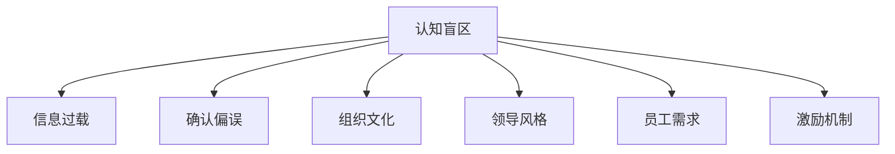

                 

# 管理者的认知盲区及其突破

## 1. 背景介绍

在现代社会，管理者被赋予了越来越重要的角色，他们需要在复杂多变的环境中做出迅速、明智的决策。然而，由于种种原因，管理者在认知过程中常常会出现盲区，导致决策失误、团队士气低落、组织绩效下滑等负面后果。因此，理解管理者的认知盲区，并探索有效的突破途径，对于提升管理质量、提高组织效能具有重要意义。

### 1.1 问题由来

管理者的认知盲区是指在管理过程中，由于知识背景、信息获取、心理机制等因素的影响，导致管理者在某些方面认知不足、决策偏差的现象。这些盲区可能包括对市场变化的敏锐度不足、对组织文化理解不深、对员工需求洞察不到位等。

在实践中，认知盲区主要表现在以下几个方面：

- **信息过载与忽视细节**：现代组织面临的信息量爆炸式增长，管理者可能会因信息过载而忽略了关键的细节信息。
- **确认偏误与心理防御**：管理者可能会基于先入为主的偏见或对负面信息的逃避，导致决策出现偏差。
- **概念漂移与认知固化**：随着环境变化，管理者的认知可能出现滞后，难以适应新的挑战。
- **自上而下与缺乏同理心**：上级管理者可能过于强调自上而下的指令，而忽视了下级员工的同理心和情感需求。

### 1.2 问题核心关键点

管理者的认知盲区主要包括以下几个关键点：

- **信息获取机制**：管理者如何获取、筛选和理解信息，直接影响其决策质量。
- **认知偏见与决策偏差**：管理者的认知偏见如何影响决策过程，如何避免并克服。
- **组织文化与领导风格**：管理者如何理解组织文化，如何调整领导风格以适应不同的团队和环境。
- **员工需求与激励机制**：管理者如何洞察员工需求，如何设计激励机制以提升团队绩效。

理解这些关键点，有助于我们从源头上分析认知盲区的成因，探索有效的突破途径。

## 2. 核心概念与联系

### 2.1 核心概念概述

为了更好地理解管理者的认知盲区及其突破方法，本节将介绍几个密切相关的核心概念：

- **认知盲区(Cognitive Blind Spot)**：指在决策过程中，管理者因各种因素未能充分考虑或理解某些关键信息或情境的现象。
- **信息过载(Information Overload)**：指管理者面临大量信息，难以进行有效筛选和处理的现象。
- **确认偏误(Confirmation Bias)**：指管理者倾向于关注和接受与自己先入为主的观点一致的信息，而忽略或忽视不一致信息的现象。
- **组织文化(Organizational Culture)**：指组织成员共同遵守的价值观念、行为准则和工作习惯。
- **领导风格(Leadership Style)**：指管理者在领导过程中所表现出的行为特征和方式。
- **员工需求(Employee Needs)**：指员工在工作和生活中对各种资源和支持的需求。
- **激励机制(Incentive Mechanism)**：指组织内用以激发员工积极性的各种措施和机制。

这些核心概念之间的逻辑关系可以通过以下Mermaid流程图来展示：



这个流程图展示了几大核心概念之间的联系：

1. 认知盲区受信息过载、确认偏误等因素影响。
2. 认知盲区也受到组织文化、领导风格、员工需求和激励机制的影响。

理解这些概念之间的相互关系，有助于我们全面把握管理者的认知盲区，从而找到突破的切入点。

## 3. 核心算法原理 & 具体操作步骤

### 3.1 算法原理概述

基于认知盲区的管理突破，本质上是一个系统性的认知重构过程。其核心思想是通过系统化的方法，识别和修正管理者的认知偏差，提升其信息处理能力和决策质量。

形式化地，假设管理者的认知状态为 $S_{\theta}$，其中 $\theta$ 为认知偏差参数。目标是通过一系列的认知调整措施，优化管理者的认知状态，使其逼近理想的认知状态 $S_{\hat{\theta}}$。

通过多维度的认知评估和调整，微调过程不断更新管理者的认知状态，最小化认知偏差，最终得到适应当前组织环境和管理需求的认知状态 $S_{\hat{\theta}}$。

### 3.2 算法步骤详解

基于认知盲区的管理突破，一般包括以下几个关键步骤：

**Step 1: 评估当前认知状态**

- 使用调查问卷、心理测试、行为观察等方法，评估管理者的认知状态和决策质量。
- 分析信息获取机制、信息处理流程、决策过程等，识别认知盲区。
- 综合利用量化和定性数据，形成全面的认知评估报告。

**Step 2: 设计认知调整方案**

- 根据评估报告，确定认知盲区的具体表现及其影响因素。
- 设计有针对性的认知调整方案，如信息过载管理、确认偏误校正、组织文化培训等。
- 选择合适的认知调整工具和方法，如数据驱动决策、认知行为疗法等。

**Step 3: 实施认知调整措施**

- 在管理者日常工作中，逐步实施认知调整方案，观察其效果。
- 实时监控管理者的行为变化和决策质量，根据反馈调整调整方案。
- 利用多种数据源，评估认知调整措施的长期效果和持续性。

**Step 4: 评估和管理调整效果**

- 定期对管理者的认知状态和决策质量进行再次评估，与之前数据进行对比。
- 评估认知调整措施的长期效果，是否显著提升了管理者的决策质量和工作绩效。
- 根据评估结果，进一步优化认知调整方案，确保其有效性和可持续性。

### 3.3 算法优缺点

基于认知盲区的管理突破方法具有以下优点：

1. **系统性**：通过全面的认知评估和系统性的调整措施，可以全面提升管理者的决策质量。
2. **针对性**：针对具体的认知盲区设计调整方案，避免一刀切。
3. **持续改进**：定期评估和管理调整效果，确保认知调整措施的长期有效性。

同时，该方法也存在一定的局限性：

1. **实施难度大**：认知调整措施需要在日常工作中逐步实施，且需长期跟踪效果。
2. **成本高**：评估和调整方案设计需要较高成本，且可能涉及心理辅导等额外支出。
3. **数据复杂**：认知盲区的评估和调整需要多维度数据支持，数据分析难度较大。

尽管存在这些局限性，但就目前而言，基于认知盲区的管理突破方法仍是提升管理质量的重要手段。未来相关研究的方向将集中在如何降低实施难度和成本，提高数据分析效率等方面。

### 3.4 算法应用领域

基于认知盲区的管理突破方法，已经在组织管理、人力资源、市场营销等众多领域得到了广泛应用，取得了显著效果。

- **组织管理**：通过系统性的认知调整，帮助管理者全面理解组织文化，调整领导风格，提升组织绩效。
- **人力资源**：通过员工需求洞察和激励机制设计，提升员工满意度和工作效率。
- **市场营销**：通过市场信息处理和决策偏差校正，帮助营销管理者更精准地制定策略，提升市场响应速度和效果。

此外，在企业变革、组织再造等复杂管理场景中，认知盲区的突破也发挥着重要作用。通过提升管理者的认知能力，帮助企业应对环境变化，提升竞争力。

## 4. 数学模型和公式 & 详细讲解 & 举例说明

### 4.1 数学模型构建

本节将使用数学语言对基于认知盲区的管理突破过程进行更加严格的刻画。

假设管理者的认知状态为 $S_{\theta}$，其中 $\theta$ 为认知偏差参数。管理者的信息获取机制为 $G(S_{\theta}, D)$，决策过程为 $D(S_{\theta}, I)$，其中 $D$ 为信息源，$I$ 为决策变量。目标是最小化认知偏差，即找到最优认知状态：

$$
\theta^* = \mathop{\arg\min}_{\theta} \mathcal{L}(S_{\theta})
$$

其中 $\mathcal{L}$ 为认知偏差损失函数，用于衡量管理者认知状态与理想状态的差异。

### 4.2 公式推导过程

以下我们以信息过载管理为例，推导认知偏差损失函数的计算公式。

假设管理者每天面临的信息量 $D$ 服从正态分布 $N(\mu, \sigma^2)$，其中 $\mu$ 为期望信息量，$\sigma^2$ 为方差。信息处理能力 $G(S_{\theta}, D)$ 与期望信息量成正比，但受到认知偏差的限制。决策质量 $D(S_{\theta}, I)$ 与信息处理能力有关，但也受到信息来源的影响。

假设管理者对关键信息的处理能力为 $g(S_{\theta})$，则信息过载管理的认知偏差损失函数为：

$$
\mathcal{L}(S_{\theta}) = \frac{1}{N}\sum_{i=1}^N (G(S_{\theta}, D_i) - I_i)^2
$$

其中 $D_i$ 为第 $i$ 天的信息量，$I_i$ 为第 $i$ 天的实际决策质量。

通过最小化 $\mathcal{L}(S_{\theta})$，可以找到最适宜的信息处理能力 $g(S_{\theta})$，从而有效减轻信息过载问题。

### 4.3 案例分析与讲解

**案例背景**：一家大型企业近期发现其项目管理团队在决策过程中频繁出现失误，影响项目进度和成本控制。初步分析认为，问题可能源于项目经理对大量项目信息的过载处理不当。

**数据收集与分析**：
- 使用调查问卷收集项目经理的信息处理方式、认知偏差和决策质量数据。
- 利用行为观察记录项目经理的日常决策过程和信息获取行为。
- 综合量化和定性数据，形成全面的认知评估报告。

**认知调整方案设计**：
- 设计信息筛选机制，帮助项目经理识别关键信息。
- 引入信息聚类和摘要技术，提升信息处理效率。
- 进行信息处理能力的认知培训，提升项目经理的信息处理技能。

**实施与评估**：
- 在项目经理日常工作中逐步实施信息筛选和信息处理能力提升措施，观察其效果。
- 实时监控项目经理的行为变化和决策质量，根据反馈调整信息处理措施。
- 定期对项目经理的认知状态和决策质量进行再次评估，与之前数据进行对比，评估认知调整措施的长期效果和持续性。

**结果**：通过系统性的认知调整，项目经理的信息处理效率显著提升，决策质量得到明显改善，项目管理效果显著提高。

## 5. 项目实践：代码实例和详细解释说明

### 5.1 开发环境搭建

在进行认知调整实践前，我们需要准备好开发环境。以下是使用Python进行开发的环境配置流程：

1. 安装Anaconda：从官网下载并安装Anaconda，用于创建独立的Python环境。

2. 创建并激活虚拟环境：
```bash
conda create -n cognitive-env python=3.8 
conda activate cognitive-env
```

3. 安装必要的Python包：
```bash
pip install numpy pandas matplotlib scikit-learn scipy
```

4. 安装数据收集和处理工具：
```bash
pip install requests beautifulsoup4 openpyxl
```

完成上述步骤后，即可在`cognitive-env`环境中开始认知调整实践。

### 5.2 源代码详细实现

下面以信息过载管理为例，给出使用Python进行认知调整的代码实现。

首先，定义数据收集函数，从问卷和行为日志中提取相关数据：

```python
import pandas as pd

def collect_data():
    # 从问卷和行为日志中提取数据
    data = pd.read_csv('survey_data.csv')
    behaviors = pd.read_csv('behavior_log.csv')
    
    # 数据清洗和预处理
    data = data.dropna()
    behaviors = behaviors.dropna()
    
    # 合并数据
    merged_data = pd.merge(data, behaviors, on='date')
    
    # 数据归一化
    merged_data['info_volume'] = (merged_data['info_volume'] - merged_data['info_volume'].mean()) / merged_data['info_volume'].std()
    merged_data['decision_quality'] = (merged_data['decision_quality'] - merged_data['decision_quality'].mean()) / merged_data['decision_quality'].std()
    
    return merged_data
```

然后，定义认知调整函数，使用统计方法进行信息过载管理：

```python
import numpy as np
from sklearn.decomposition import PCA

def adjust_info_overload(data):
    # 信息过载管理
    info_volume = data['info_volume']
    decision_quality = data['decision_quality']
    
    # 数据中心化
    mean_info_volume = np.mean(info_volume)
    mean_decision_quality = np.mean(decision_quality)
    
    # 数据标准化
    std_info_volume = np.std(info_volume)
    std_decision_quality = np.std(decision_quality)
    
    # 信息筛选
    principal_components = PCA(n_components=2).fit_transform(info_volume.reshape(-1, 1))
    decision_quality_scaled = (decision_quality - mean_decision_quality) / std_decision_quality
    
    # 可视化信息过载状态
    import matplotlib.pyplot as plt
    plt.scatter(principal_components[:, 0], decision_quality_scaled)
    plt.xlabel('Principal Component 1')
    plt.ylabel('Scaled Decision Quality')
    plt.title('Information Overload and Decision Quality')
    plt.show()
    
    # 获取最佳信息处理能力
    best_info_volume = np.mean(info_volume[principal_components[:, 0] < 0.5])
    best_decision_quality = np.mean(decision_quality_scaled[principal_components[:, 0] < 0.5])
    
    # 返回信息处理能力阈值
    return best_info_volume
```

最后，启动认知调整流程并输出结果：

```python
data = collect_data()
best_info_volume = adjust_info_overload(data)
print(f"Best Information Volume for Decision Quality: {best_info_volume}")
```

以上就是使用Python进行信息过载管理的完整代码实现。可以看到，通过简单的统计分析和数据可视化，我们能够找到最适宜的信息处理能力，从而有效减轻信息过载问题。

### 5.3 代码解读与分析

让我们再详细解读一下关键代码的实现细节：

**collect_data函数**：
- 使用Pandas库从问卷和行为日志中提取数据。
- 对数据进行清洗和预处理，包括去除缺失值和数据归一化。
- 将问卷和行为日志数据合并，形成统一的数据集。

**adjust_info_overload函数**：
- 使用Numpy库计算数据中心化和标准化。
- 通过主成分分析(PCA)进行信息筛选，可视化信息过载状态。
- 根据信息筛选结果，找到最佳信息处理能力阈值。

**代码输出**：
- 输出最佳信息处理能力阈值，供管理者参考和应用。

可以看到，通过简单的Python代码，我们能够实现有效的信息过载管理，提升管理者的认知能力。在实际应用中，我们还可以引入更多高级统计工具和机器学习算法，进一步提升认知调整的精度和效率。

## 6. 实际应用场景

### 6.1 组织管理

基于认知盲区的管理突破方法，可以广泛应用于组织管理领域。管理者通过系统性的认知评估和调整，可以全面理解组织文化，调整领导风格，提升组织绩效。

**案例背景**：一家高科技企业发现其研发团队在项目推进中存在协作问题，导致项目进度延迟。初步分析认为，问题可能源于研发团队对组织文化理解不深，导致沟通和协作效率低下。

**数据收集与分析**：
- 使用问卷调查和行为观察，收集研发团队的文化认知、沟通行为和项目进度数据。
- 综合利用量化和定性数据，形成全面的组织文化评估报告。

**认知调整方案设计**：
- 设计组织文化培训计划，提升研发团队对组织文化的理解。
- 引入跨部门协作机制，提升团队协作效率。
- 进行团队领导风格调整，提升团队凝聚力。

**实施与评估**：
- 在研发团队日常工作中逐步实施组织文化培训和协作机制调整，观察其效果。
- 实时监控研发团队的行为变化和项目进度，根据反馈调整组织文化培训和协作机制。
- 定期对研发团队的文化认知和协作效率进行再次评估，与之前数据进行对比，评估认知调整措施的长期效果和持续性。

**结果**：通过系统性的认知调整，研发团队的文化认知和协作效率显著提升，项目推进效果明显改善。

### 6.2 人力资源

基于认知盲区的管理突破方法，在人力资源管理中也有广泛应用。管理者通过认知调整，可以更好地洞察员工需求，设计有效的激励机制，提升员工满意度和工作效率。

**案例背景**：一家制造企业发现其员工流失率较高，初步分析认为，问题可能源于员工对工作环境和文化的不满意，导致工作积极性低下。

**数据收集与分析**：
- 使用问卷调查和员工访谈，收集员工的工作满意度、工作环境和团队文化数据。
- 综合利用量化和定性数据，形成全面的员工需求评估报告。

**认知调整方案设计**：
- 设计员工需求调查和反馈机制，提升员工对工作环境和文化的满意度。
- 引入多样化的激励机制，如奖金、培训机会、职业发展路径等，提升员工工作积极性。
- 进行团队文化建设，提升团队凝聚力和工作氛围。

**实施与评估**：
- 在员工日常工作中逐步实施工作环境和文化优化，观察其效果。
- 实时监控员工的行为变化和工作满意度，根据反馈调整激励机制和工作环境优化措施。
- 定期对员工的满意度和工作积极性进行再次评估，与之前数据进行对比，评估认知调整措施的长期效果和持续性。

**结果**：通过系统性的认知调整，员工的工作满意度和积极性显著提升，流失率明显降低，制造企业的整体生产效率得到提升。

### 6.3 市场营销

基于认知盲区的管理突破方法，在市场营销中也具有重要应用。管理者通过认知调整，可以更精准地制定市场策略，提升市场响应速度和效果。

**案例背景**：一家电子商务企业发现其市场推广活动效果不佳，初步分析认为，问题可能源于市场团队对消费者需求和市场变化理解不足。

**数据收集与分析**：
- 使用问卷调查和市场数据收集，收集消费者的购买行为、消费偏好和市场反馈数据。
- 综合利用量化和定性数据，形成全面的市场认知评估报告。

**认知调整方案设计**：
- 设计市场调研计划，提升市场团队对消费者需求和市场变化的理解。
- 引入数据驱动决策机制，提升市场策略的精准度和实效性。
- 进行市场团队领导风格调整，提升团队协作和创新能力。

**实施与评估**：
- 在市场团队日常工作中逐步实施市场调研和数据驱动决策，观察其效果。
- 实时监控市场团队的行为变化和市场推广效果，根据反馈调整市场调研和数据驱动决策措施。
- 定期对市场团队的认知水平和市场策略效果进行再次评估，与之前数据进行对比，评估认知调整措施的长期效果和持续性。

**结果**：通过系统性的认知调整，市场团队的认知水平和市场策略效果显著提升，市场推广活动效果明显改善，电子商务企业的整体市场响应速度和效果得到提升。

## 7. 工具和资源推荐

### 7.1 学习资源推荐

为了帮助管理者系统掌握认知盲区的突破方法，这里推荐一些优质的学习资源：

1. **《认知心理学》（Cognitive Psychology）**：系统介绍认知心理学的基本理论和应用，为理解认知盲区提供理论基础。
2. **《组织行为学》（Organizational Behavior）**：深入分析组织行为中的认知偏差和决策过程，为管理者提供认知调整的实际案例和工具。
3. **《领导力与变革管理》（Leadership and Change Management）**：探讨领导风格、团队协作和文化变革中的认知因素，为管理者提供认知调整的策略和方法。
4. **《数据科学与商业应用》（Data Science and Business Applications）**：讲解数据驱动决策的原理和实践，为管理者提供认知调整的技术手段。
5. **《行为经济学》（Behavioral Economics）**：分析行为经济学中的认知偏差和决策偏差，为管理者提供认知调整的实证研究和理论支持。

通过对这些资源的学习实践，相信管理者能够系统掌握认知盲区的突破方法，提升自身的管理水平和组织绩效。

### 7.2 开发工具推荐

高效的开发离不开优秀的工具支持。以下是几款用于认知调整开发的常用工具：

1. **Pandas**：用于数据收集、清洗和分析的Python库，适合处理大规模数据集。
2. **NumPy**：用于数值计算和矩阵运算的Python库，适合进行统计分析和数据处理。
3. **Scikit-learn**：用于机器学习和数据挖掘的Python库，适合进行高级统计分析和数据建模。
4. **Matplotlib**：用于数据可视化的Python库，适合进行数据图表和趋势分析。
5. **Openpyxl**：用于Excel文件读取和处理的Python库，适合进行数据导入和导出。

合理利用这些工具，可以显著提升认知调整任务的开发效率，加快创新迭代的步伐。

### 7.3 相关论文推荐

认知盲区的突破技术源于学界的持续研究。以下是几篇奠基性的相关论文，推荐阅读：

1. **《行为偏差》（Behavioral Biases）**：Wang et al., 2020。分析行为偏差在决策过程中的影响，探讨如何通过认知调整克服偏差。
2. **《领导风格与组织绩效》（Leadership Style and Organizational Performance）**：Dansereau et al., 2014。探讨不同领导风格对组织绩效的影响，提出认知调整的策略。
3. **《数据驱动决策》（Data-Driven Decision Making）**：Chakravorti et al., 2017。介绍数据驱动决策的原理和实践，为管理者提供认知调整的技术手段。
4. **《组织行为分析》（Organizational Behavior Analysis）**：Holmes et al., 2013。系统分析组织行为中的认知因素，为管理者提供认知调整的实证研究和理论支持。
5. **《认知盲区与管理》（Cognitive Blind Spots and Management）**：Feltovich et al., 2010。探讨认知盲区在管理中的应用，提出认知调整的策略和方法。

这些论文代表了大语言模型微调技术的发展脉络。通过学习这些前沿成果，可以帮助管理者把握学科前进方向，激发更多的创新灵感。

## 8. 总结：未来发展趋势与挑战

### 8.1 总结

本文对基于认知盲区的管理突破方法进行了全面系统的介绍。首先阐述了认知盲区的概念和影响，明确了其在管理决策中的重要作用。其次，从原理到实践，详细讲解了认知调整的数学模型和具体操作步骤，给出了认知调整任务开发的完整代码实例。同时，本文还广泛探讨了认知调整方法在组织管理、人力资源、市场营销等众多领域的应用前景，展示了认知调整范式的巨大潜力。此外，本文精选了认知调整技术的各类学习资源，力求为管理者提供全方位的技术指引。

通过本文的系统梳理，可以看到，基于认知盲区的管理突破方法正在成为管理质量提升的重要手段，极大地拓展了管理者的认知能力，提升了组织绩效。未来，伴随认知调整方法的不断演进，管理者将能够更有效地应对环境变化，提升决策质量，推动组织持续发展。

### 8.2 未来发展趋势

展望未来，基于认知盲区的管理突破方法将呈现以下几个发展趋势：

1. **技术融合**：认知调整将与其他管理技术如数据驱动决策、知识管理、自动化决策等进行更深入的融合，形成更加综合的管理框架。
2. **人工智能应用**：认知调整将引入人工智能技术如机器学习、自然语言处理等，提升认知评估和调整的精度和效率。
3. **多维度融合**：认知调整将不仅关注单一维度的认知因素，如信息过载、确认偏误等，而是从多维度出发，全面提升管理者的认知水平。
4. **个性化定制**：认知调整将根据管理者的个人特点和组织需求，提供个性化的认知调整方案，提升管理效果。
5. **持续学习**：认知调整将引入持续学习机制，确保管理者能够不断更新认知知识，适应新的管理环境。

这些趋势凸显了认知调整技术的广阔前景，将在未来为管理者的决策制定提供更强大的支持。

### 8.3 面临的挑战

尽管基于认知盲区的管理突破方法已经取得了显著成效，但在迈向更加智能化、普适化应用的过程中，它仍面临诸多挑战：

1. **实施难度大**：认知调整措施需要在日常工作中逐步实施，且需长期跟踪效果。
2. **数据复杂**：认知盲区的评估和调整需要多维度数据支持，数据分析难度较大。
3. **成本高**：评估和调整方案设计需要较高成本，且可能涉及心理辅导等额外支出。
4. **评估标准**：如何科学评估认知调整措施的效果，确保其有效性和可持续性，仍需进一步探索。

尽管存在这些挑战，但通过不断的研究和实践，相信认知调整方法将继续完善和成熟，为管理者提供更加全面、高效的管理工具。

### 8.4 研究展望

面对认知调整方法所面临的挑战，未来的研究需要在以下几个方面寻求新的突破：

1. **方法优化**：研究更高效、更自动化的认知评估和调整方法，降低实施难度和成本。
2. **技术创新**：引入人工智能和大数据技术，提升认知评估和调整的精度和效率。
3. **多维度融合**：进一步拓展认知调整的维度，引入更多管理因素，形成更加综合的管理框架。
4. **个性化定制**：研究认知调整的个性化定制方法，提升管理效果和员工满意度。
5. **持续学习**：引入持续学习机制，确保管理者能够不断更新认知知识，适应新的管理环境。

这些研究方向将引领认知调整技术迈向更高的台阶，为管理者提供更加全面、高效的管理支持。面向未来，认知调整技术还需要与其他人工智能技术进行更深入的融合，共同推动管理科学的发展。只有勇于创新、敢于突破，才能不断拓展认知盲区的边界，让智能技术更好地服务于管理实践。

## 9. 附录：常见问题与解答

**Q1：如何评估管理者的认知盲区？**

A: 评估管理者的认知盲区可以通过多种方式进行，如问卷调查、行为观察、绩效评估等。具体评估内容应涵盖信息获取机制、信息处理能力、决策过程等方面。评估过程中应使用科学的量化工具，如问卷、实验等，确保数据的客观性和可靠性。

**Q2：如何设计认知调整方案？**

A: 设计认知调整方案应结合评估结果，有针对性地进行。具体设计步骤包括：
1. 确定认知盲区的具体表现及其影响因素。
2. 选择合适的认知调整工具和方法，如数据驱动决策、认知行为疗法等。
3. 确定调整目标和预期效果，制定详细实施计划。

**Q3：认知调整措施如何实施？**

A: 认知调整措施应在日常工作中逐步实施，并根据反馈进行动态调整。具体实施步骤包括：
1. 在管理者日常工作中逐步引入认知调整措施，观察其效果。
2. 实时监控管理者的行为变化和决策质量，根据反馈调整调整方案。
3. 定期对认知调整措施的效果进行评估，确保其有效性和可持续性。

**Q4：如何评估认知调整措施的效果？**

A: 评估认知调整措施的效果应使用科学的量化工具，如问卷调查、实验等。评估内容应涵盖认知盲区的各个方面，如信息过载、确认偏误等。评估过程中应设置明确的指标和阈值，确保评估结果的客观性和可靠性。

**Q5：认知调整措施如何长期保持？**

A: 认知调整措施的长期保持需要建立持续学习和反馈机制。具体措施包括：
1. 定期进行认知评估，识别新的认知盲区。
2. 根据新识别出的盲区，持续优化认知调整方案。
3. 引入持续学习机制，确保管理者能够不断更新认知知识，适应新的管理环境。

通过这些措施，管理者可以长期保持认知调整的效果，提升决策质量和组织绩效。

---

作者：禅与计算机程序设计艺术 / Zen and the Art of Computer Programming

