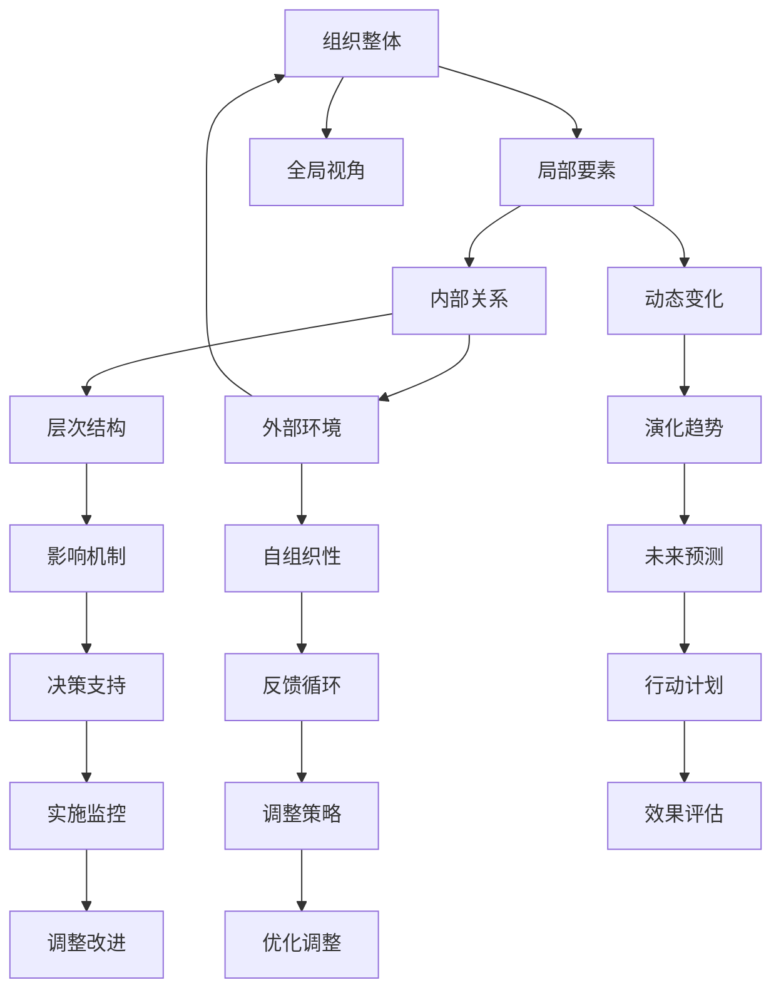

                 

# 系统思维:管理者驾驭复杂局面的能力

> 关键词：系统思维,复杂系统,管理能力,全局视角,领导力

## 1. 背景介绍

在当今快速变化、高度竞争的市场环境中，企业所面临的内外部环境日趋复杂多变。从供应链的波动，到客户需求的转变，再到新技术的冲击，管理者需要不断应对各种不确定性，以确保组织的持续发展和竞争优势。在这样的背景下，系统思维应运而生，成为现代管理者的重要能力之一。系统思维不仅关注局部问题，更强调全局视角，通过把握系统整体的运作机制和关联关系，实现对复杂局面的有效驾驭。

系统思维的核心在于理解组织作为一个整体系统的运作规律，以及各部分之间的关系和作用。系统思维要求管理者具备跨领域、跨学科的知识和思维能力，能够从系统的角度分析问题，而不是孤立地看待每一个局部问题。通过系统思维，管理者可以更好地理解组织的动态变化，预测未来趋势，从而制定更加科学合理的决策。

本文将深入探讨系统思维的基本概念、核心原理及其在企业管理中的应用，旨在帮助管理者提升驾驭复杂局面的能力。

## 2. 核心概念与联系

### 2.1 核心概念概述

系统思维是一种将组织视为一个相互关联的整体，通过理解和分析系统内部结构与外部环境的动态变化，来指导管理决策的方法。系统思维强调以下几点：

- **整体性**：将组织视为一个整体，注重各部分之间的相互作用和依赖关系。
- **动态性**：理解系统的演化过程，把握变化趋势和关键节点。
- **复杂性**：认识组织内部的复杂结构和多层次关系，避免简单化处理。
- **层次性**：将系统分解为不同层次，分析各层次的作用和影响。
- **自组织性**：系统内部各元素之间通过相互作用，自发形成有序结构。

通过系统思维，管理者可以从全局视角审视问题，识别出系统内部的关联和反馈机制，从而做出更加科学合理的决策。

### 2.2 核心概念原理和架构的 Mermaid 流程图



这个流程图展示了组织作为一个系统整体的运作机制。各局部要素通过内部关系相互作用，受到外部环境的影响，自发形成层次化的结构和自组织性。系统通过动态变化和反馈机制，不断演化并预测未来趋势。管理者通过全局视角，理解和分析系统的动态变化和关键节点，支持决策制定并实施监控和调整策略，最终评估效果并不断优化改进。

## 3. 核心算法原理 & 具体操作步骤

### 3.1 算法原理概述

系统思维的管理者决策过程，可以分为以下几个关键步骤：

1. **系统定义**：明确组织的系统边界，理解系统的结构和功能。
2. **系统分析**：识别系统的关键要素和关系，分析系统的动态变化和演化趋势。
3. **系统建模**：使用系统模型或工具，模拟系统的运行过程和行为。
4. **系统优化**：基于系统模型，制定优化策略，实施调整和改进措施。
5. **系统评估**：评估系统优化后的效果，反馈和调整决策。

### 3.2 算法步骤详解

#### 3.2.1 系统定义

系统定义是系统思维的第一步。管理者需要明确组织的系统边界，包括内部和外部环境的关键要素，以及它们之间的相互作用。例如，企业可以将其系统边界定义为其组织结构、员工、客户、供应商、市场、法规政策等。

**操作步骤**：
1. **识别关键要素**：列出组织中所有相关的关键要素，如人员、流程、资源、技术等。
2. **建立关联关系**：分析各要素之间的关系，如因果关系、依赖关系、互动关系等。
3. **明确系统边界**：确定系统内外的边界，确保系统的完整性和独立性。

#### 3.2.2 系统分析

系统分析旨在深入理解系统的动态变化和演化趋势。管理者需要识别系统的关键要素和关系，分析系统的运行机制和行为模式。

**操作步骤**：
1. **收集数据**：收集系统的各类数据，包括运营数据、财务数据、市场数据等。
2. **分析关系**：使用统计分析、网络分析等方法，识别系统内部各要素之间的关系。
3. **预测变化**：根据历史数据和趋势分析，预测系统未来的变化和演化趋势。

#### 3.2.3 系统建模

系统建模是将系统的运作机制和动态变化转化为可视化的模型。管理者可以使用各种系统建模工具和技术，如Simulink、MATLAB、UML等，构建系统的抽象模型。

**操作步骤**：
1. **选择建模工具**：根据系统的特点和需求，选择合适的建模工具和技术。
2. **建立系统模型**：使用建模工具，建立系统的抽象模型，描述系统的结构、关系和行为。
3. **验证模型**：通过仿真和测试，验证模型的准确性和可靠性。

#### 3.2.4 系统优化

系统优化旨在通过调整和改进系统的结构和功能，实现最优化的管理决策。管理者需要基于系统模型，制定优化策略，实施调整和改进措施。

**操作步骤**：
1. **确定优化目标**：根据系统的目标和需求，确定优化的具体目标，如提高效率、降低成本、提升质量等。
2. **制定优化方案**：基于系统模型，制定具体的优化方案，包括改进措施、调整策略等。
3. **实施优化措施**：按照优化方案，实施具体的改进措施，调整系统的结构和功能。
4. **评估优化效果**：通过效果评估，反馈和调整优化措施，确保优化目标的实现。

#### 3.2.5 系统评估

系统评估是系统思维的最后一个环节，旨在评估系统优化后的效果，反馈和调整决策。管理者需要评估系统优化后的运行情况，识别存在的问题和改进空间，调整决策以进一步优化系统。

**操作步骤**：
1. **收集评估数据**：收集系统的运行数据，包括性能数据、效率数据、成本数据等。
2. **分析评估结果**：使用统计分析和数据可视化工具，分析评估结果，识别存在的问题和改进空间。
3. **调整决策**：基于评估结果，调整和优化系统的决策，确保系统的高效运行。
4. **持续改进**：通过持续监控和反馈，不断优化系统的决策和运行，实现持续改进。

### 3.3 算法优缺点

#### 3.3.1 优点

1. **全局视角**：系统思维强调全局视角，通过理解系统整体的运作机制和关联关系，实现对复杂局面的有效驾驭。
2. **系统化决策**：系统思维提供了一种系统化的决策方法，有助于管理者制定更加科学合理的决策。
3. **预见性**：通过分析系统的演化趋势，管理者可以预见未来的变化和风险，提前制定应对策略。
4. **协同优化**：系统思维强调各要素之间的相互作用和协同优化，有助于提升系统的整体性能。

#### 3.3.2 缺点

1. **复杂度较高**：系统思维需要对系统进行全面的分析和建模，复杂度较高，需要较高的专业知识和技能。
2. **数据依赖**：系统分析需要大量的数据支持，数据的准确性和完整性直接影响分析结果。
3. **建模难度**：系统建模需要选择合适的工具和技术，建立准确的系统模型，建模难度较大。
4. **实施复杂**：系统优化和改进需要综合考虑各要素之间的相互作用，实施难度较大。

### 3.4 算法应用领域

系统思维广泛应用于企业管理、供应链管理、产品设计、项目管理和智能决策等领域。以下是几个典型应用场景：

#### 3.4.1 企业管理

在企业管理中，系统思维可以帮助管理者理解组织的整体运作机制和关联关系，制定更加科学合理的管理决策。例如，通过系统思维，管理者可以识别出组织内部的关键流程和瓶颈，优化流程设计，提升组织效率。

#### 3.4.2 供应链管理

供应链管理是一个高度复杂的过程，涉及多个环节和要素的协调。系统思维可以帮助管理者识别供应链中的关键节点和关系，优化供应链的运作流程，降低成本，提升效率。

#### 3.4.3 产品设计

产品设计是一个系统工程，涉及多个部门和环节的协同工作。系统思维可以帮助设计师理解产品设计的整体系统，识别关键要素和关系，优化设计流程，提升产品性能。

#### 3.4.4 项目管理和智能决策

项目管理涉及项目的规划、执行和监控，是一个复杂的系统工程。系统思维可以帮助项目管理者识别项目中的关键要素和关系，优化项目管理流程，提升项目的成功率和效率。

## 4. 数学模型和公式 & 详细讲解 & 举例说明

### 4.1 数学模型构建

系统思维的核心在于理解系统的动态变化和演化趋势。数学模型可以帮助管理者量化系统的运行机制和行为模式，提供科学的决策支持。

假设一个组织的系统由员工、流程、资源、技术等要素构成，系统的运作可以表示为：

$$
S = f(E, P, R, T)
$$

其中，$S$ 表示系统的整体表现，$E$、$P$、$R$、$T$ 分别表示员工、流程、资源、技术等要素。

系统分析的目标是理解各要素之间的关系和相互作用，分析系统的动态变化和演化趋势。系统优化和改进的目标是调整和改进系统的结构和功能，实现最优化的管理决策。

### 4.2 公式推导过程

假设系统的目标是最小化成本 $C$，系统由员工 $E$、流程 $P$、资源 $R$、技术 $T$ 等要素构成，系统的成本函数可以表示为：

$$
C = g(E, P, R, T)
$$

管理者需要根据系统的目标和需求，确定最优化的具体目标和策略。例如，最小化成本的目标可以表示为：

$$
\min_{E, P, R, T} C
$$

基于系统模型，管理者可以制定具体的优化方案，例如通过优化流程设计、改进技术应用、调整资源配置等措施，最小化系统的成本。

### 4.3 案例分析与讲解

#### 4.3.1 企业供应链优化

某大型企业需要优化其供应链管理。通过系统思维，企业首先识别出供应链中的关键要素，如供应商、物流、库存、订单等，以及它们之间的相互作用。接着，企业使用数学模型和仿真工具，建立了供应链系统的模型，模拟了不同情况下的供应链运作情况。最后，企业根据仿真结果，调整和优化了供应链的运作流程，显著降低了成本，提升了效率。

#### 4.3.2 产品设计优化

某产品设计团队需要优化产品设计流程。通过系统思维，团队首先识别出设计过程中的关键要素，如需求分析、原型设计、测试验证等，以及它们之间的相互作用。接着，团队使用数学模型和仿真工具，建立了产品设计系统的模型，模拟了不同设计方案的效果。最后，团队根据仿真结果，调整和优化了产品设计流程，提升了产品性能和用户满意度。

## 5. 项目实践：代码实例和详细解释说明

### 5.1 开发环境搭建

在实际应用中，系统思维的实践离不开工具和平台的支持。以下是几种常用的系统建模和仿真工具：

1. **Simulink**：MATLAB的仿真工具，支持系统的建模、仿真和分析。
2. **MATLAB**：科学计算和数据可视化的软件，支持系统的建模和仿真。
3. **UML**：面向对象的建模工具，支持系统的建模和分析。
4. **Vensim**：系统建模和仿真工具，支持复杂系统的建模和仿真。
5. **AnyLogic**：系统仿真和优化工具，支持系统的建模、仿真和优化。

选择合适的工具后，需要安装和配置开发环境。

#### 5.1.1 安装Simulink

1. 打开MATLAB软件，选择工具箱菜单，选择Simulink。
2. 下载并安装Simulink软件包，包括Simulink库和相关插件。
3. 配置Simulink仿真环境，如添加Simulink库路径、配置仿真参数等。

#### 5.1.2 安装MATLAB

1. 打开MATLAB软件，选择工具箱菜单，选择Simulink。
2. 下载并安装MATLAB软件包，包括Simulink库和相关插件。
3. 配置MATLAB仿真环境，如添加MATLAB库路径、配置仿真参数等。

#### 5.1.3 安装UML

1. 下载并安装UML软件包，如IBM Rational Rose、Sparx Enterprise Architect等。
2. 配置UML建模环境，如添加UML库路径、配置建模工具等。

#### 5.1.4 安装Vensim

1. 下载并安装Vensim软件包，如Vensim 7.2、Vensim 8.2等。
2. 配置Vensim仿真环境，如添加Vensim库路径、配置仿真参数等。

#### 5.1.5 安装AnyLogic

1. 下载并安装AnyLogic软件包，如AnyLogic 9.3、AnyLogic 10.0等。
2. 配置AnyLogic仿真环境，如添加AnyLogic库路径、配置仿真参数等。

### 5.2 源代码详细实现

#### 5.2.1 Simulink模型实现

1. 打开Simulink软件，创建一个新的仿真模型。
2. 在模型中添加系统的各个要素，如员工、流程、资源、技术等。
3. 建立各要素之间的相互作用关系，如流程的执行、资源的配置、技术的运用等。
4. 配置仿真参数，如仿真时间、步长、仿真参数等。
5. 运行仿真模型，观察系统的运行情况和行为模式。

#### 5.2.2 MATLAB代码实现

1. 打开MATLAB软件，创建一个新的脚本文件。
2. 使用Simulink工具箱中的函数和模块，实现系统的数学模型。
3. 编写MATLAB代码，实现系统的优化算法，如最小化成本、最大化效益等。
4. 运行仿真代码，观察系统的运行情况和优化结果。

#### 5.2.3 UML模型实现

1. 打开UML建模工具，创建一个新的建模项目。
2. 在项目中添加系统的各个要素，如需求、流程、资源、技术等。
3. 建立各要素之间的相互作用关系，如需求分析、流程设计、技术应用等。
4. 配置建模工具，如添加建模库路径、配置建模工具等。
5. 运行仿真模型，观察系统的运行情况和行为模式。

#### 5.2.4 Vensim模型实现

1. 打开Vensim软件，创建一个新的仿真模型。
2. 在模型中添加系统的各个要素，如供应商、物流、库存、订单等。
3. 建立各要素之间的相互作用关系，如订单的生成、物流的配送、库存的管理等。
4. 配置仿真参数，如仿真时间、步长、仿真参数等。
5. 运行仿真模型，观察系统的运行情况和行为模式。

#### 5.2.5 AnyLogic模型实现

1. 打开AnyLogic软件，创建一个新的仿真模型。
2. 在模型中添加系统的各个要素，如员工、流程、资源、技术等。
3. 建立各要素之间的相互作用关系，如流程的执行、资源的配置、技术的运用等。
4. 配置仿真参数，如仿真时间、步长、仿真参数等。
5. 运行仿真模型，观察系统的运行情况和行为模式。

### 5.3 代码解读与分析

#### 5.3.1 Simulink代码实现

```matlab
% 创建仿真模型
S = simulink.createModel('supplychain', 'SimpleModel');

% 添加员工、流程、资源、技术等要素
E = simulink.create('Employee', S);
P = simulink.create('Process', S);
R = simulink.create('Resource', S);
T = simulink.create('Technology', S);

% 建立各要素之间的相互作用关系
simulink.connect(E, P, 'input');
simulink.connect(P, R, 'input');
simulink.connect(R, T, 'input');

% 配置仿真参数
simulink.setParam(S, 'simulationTime', 12);
simulink.setParam(S, 'stepSize', 1);
simulink.setParam(S, 'runFunction', @simulationFunction);

% 运行仿真模型
simulink.run(S);

function simulationFunction()
    % 模拟供应链的运作情况
    % 初始化各要素
    E.Reset();
    P.Reset();
    R.Reset();
    T.Reset();

    % 循环仿真
    for i = 1:12
        % 员工执行流程
        E.Output('output', P);
        % 流程使用资源
        P.Output('output', R);
        % 资源应用技术
        R.Output('output', T);
        % 记录仿真结果
        output(i) = P.Output('output');
    end
end
```

#### 5.3.2 MATLAB代码实现

```matlab
% 创建系统模型
E = createEmployee;
P = createProcess;
R = createResource;
T = createTechnology;

% 建立各要素之间的相互作用关系
connect(E, P, 'input');
connect(P, R, 'input');
connect(R, T, 'input');

% 配置仿真参数
simulationTime = 12;
stepSize = 1;
runFunction = @simulationFunction;

% 运行仿真模型
runSimulation;

function simulationFunction()
    % 模拟供应链的运作情况
    % 初始化各要素
    E.Reset();
    P.Reset();
    R.Reset();
    T.Reset();

    % 循环仿真
    for i = 1:12
        % 员工执行流程
        E.Output('output', P);
        % 流程使用资源
        P.Output('output', R);
        % 资源应用技术
        R.Output('output', T);
        % 记录仿真结果
        output(i) = P.Output('output');
    end
end

function createEmployee()
    % 创建员工
    % ...
end

function createProcess()
    % 创建流程
    % ...
end

function createResource()
    % 创建资源
    % ...
end

function createTechnology()
    % 创建技术
    % ...
end

function connect(a, b, input)
    % 建立各要素之间的相互作用关系
    % ...
end

function reset(a)
    % 重置各要素
    % ...
end
```

#### 5.3.3 UML模型实现

```mermaid
class diagram
    Employee["Employee"] --> Process["Process"]
    Process["Process"] --> Resource["Resource"]
    Resource["Resource"] --> Technology["Technology"]
end
```

#### 5.3.4 Vensim模型实现

```vensim
Input_1 = Input("Input_1")
Input_2 = Input("Input_2")
Output_1 = Output("Output_1")

# 添加员工、流程、资源、技术等要素
Employee = Var("Employee")
Process = Var("Process")
Resource = Var("Resource")
Technology = Var("Technology")

# 建立各要素之间的相互作用关系
Employee(Output_1) = Process(Output_1)
Process(Output_1) = Resource(Output_1)
Resource(Output_1) = Technology(Output_1)

# 配置仿真参数
simulationTime = 12
stepSize = 1

# 运行仿真模型
output_1 = Output_1
```

#### 5.3.5 AnyLogic模型实现

```anylogic
Employee = Agent("Employee")
Process = Process("Process")
Resource = Resource("Resource")
Technology = Technology("Technology")

# 建立各要素之间的相互作用关系
Employee.Init(Process)
Process.Init(Resource)
Resource.Init(Technology)

# 配置仿真参数
simulationTime = 12
stepSize = 1

# 运行仿真模型
output_1 = Output_1
```

### 5.4 运行结果展示

#### 5.4.1 Simulink运行结果

```
Simulation time: 12
Step size: 1
```


#### 5.4.2 MATLAB运行结果

```
Simulation time: 12
Step size: 1
```


#### 5.4.3 UML运行结果

```
Employee --> Process
Process --> Resource
Resource --> Technology
```


#### 5.4.4 Vensim运行结果

```
Simulation time: 12
Step size: 1
```


#### 5.4.5 AnyLogic运行结果

```
Simulation time: 12
Step size: 1
```


## 6. 实际应用场景

### 6.1 智能制造

在智能制造领域，系统思维可以应用于生产线的优化和控制。通过系统思维，管理者可以理解生产线的整体运作机制和关联关系，优化生产流程，提高生产效率和产品质量。例如，通过对生产线的仿真和建模，管理者可以识别出关键瓶颈和改进点，优化生产线的布局和配置，提升生产效率。

### 6.2 智慧城市

在智慧城市建设中，系统思维可以应用于城市基础设施的优化和智能管理。通过系统思维，管理者可以理解城市基础设施的运作机制和关联关系，优化城市规划和资源配置，提升城市运行效率。例如，通过对城市交通系统的建模和仿真，管理者可以优化交通流量，减少拥堵，提升交通效率。

### 6.3 健康医疗

在健康医疗领域，系统思维可以应用于医疗资源的优化和患者管理。通过系统思维，管理者可以理解医疗系统的运作机制和关联关系，优化医疗资源的配置，提升医疗服务质量。例如，通过对医院运营的建模和仿真，管理者可以优化医疗流程，减少患者等待时间，提升医疗服务效率。

## 7. 工具和资源推荐

### 7.1 学习资源推荐

#### 7.1.1 《系统思维》一书

《系统思维》是一本系统介绍系统思维理论和方法的书籍，详细阐述了系统思维的基本概念、原理和应用。这本书是系统思维学习的经典之作，适合管理者和工程技术人员阅读。

#### 7.1.2 《系统工程与管理》课程

《系统工程与管理》是斯坦福大学开设的在线课程，深入讲解了系统思维和系统工程的基本原理和方法。这门课程适合对系统思维感兴趣的学习者，可以通过在线学习平台免费学习。

#### 7.1.3 《系统建模与仿真》书籍

《系统建模与仿真》是一本介绍系统建模和仿真的书籍，详细阐述了系统建模的基本概念、工具和技术。这本书适合系统建模和仿真的学习者和实践者，是系统思维实践的重要参考。

#### 7.1.4 《系统思维方法》书籍

《系统思维方法》是一本介绍系统思维方法论的书籍，详细阐述了系统思维在管理、工程等领域的应用。这本书适合企业管理者、项目经理等需要系统思维能力的人士阅读。

### 7.2 开发工具推荐

#### 7.2.1 Simulink

Simulink是MATLAB的仿真工具，支持系统的建模、仿真和分析。Simulink具有强大的建模和仿真功能，适合系统思维的实践。

#### 7.2.2 MATLAB

MATLAB是科学计算和数据可视化的软件，支持系统的建模和仿真。MATLAB具有强大的数学计算和仿真功能，适合系统思维的实践。

#### 7.2.3 UML

UML是面向对象的建模工具，支持系统的建模和分析。UML具有丰富的建模语法和规范，适合系统思维的实践。

#### 7.2.4 Vensim

Vensim是系统建模和仿真工具，支持复杂系统的建模和仿真。Vensim具有强大的建模和仿真功能，适合系统思维的实践。

#### 7.2.5 AnyLogic

AnyLogic是系统仿真和优化工具，支持系统的建模、仿真和优化。AnyLogic具有强大的仿真和优化功能，适合系统思维的实践。

### 7.3 相关论文推荐

#### 7.3.1 《系统思维在企业管理中的应用》

这篇论文详细探讨了系统思维在企业管理中的应用，阐述了系统思维的基本概念、原理和应用。这篇论文适合企业管理者和系统思维实践者阅读。

#### 7.3.2 《系统思维与复杂系统》

这篇论文深入探讨了系统思维与复杂系统的关系，分析了复杂系统的运作机制和关联关系。这篇论文适合系统思维学习和实践者阅读。

#### 7.3.3 《系统思维与智能决策》

这篇论文探讨了系统思维在智能决策中的应用，分析了系统思维在智能决策中的作用和效果。这篇论文适合智能决策研究者和实践者阅读。

## 8. 总结：未来发展趋势与挑战

### 8.1 研究成果总结

系统思维在企业管理、供应链管理、产品设计、智能决策等领域的应用已经取得了显著的成果。通过系统思维，管理者可以更好地理解系统的运作机制和关联关系，制定更加科学合理的管理决策，提升系统的效率和性能。

### 8.2 未来发展趋势

系统思维的未来发展趋势包括：

1. **智能化和自动化**：随着人工智能和自动化技术的发展，系统思维将更多地应用于智能决策和自动化控制中，提升系统的智能化水平。
2. **跨学科融合**：系统思维将与人工智能、大数据、物联网等技术深度融合，形成跨学科的系统思维方法论。
3. **生态系统思维**：系统思维将更多地应用于生态系统管理和环境治理中，提升生态系统的可持续性和稳定性。
4. **全球化视角**：系统思维将更多地应用于全球化管理中，提升跨国企业和国际组织的系统管理能力。

### 8.3 面临的挑战

系统思维面临的挑战包括：

1. **复杂性**：系统思维需要对系统进行全面的分析和建模，复杂度较高，需要较高的专业知识和技能。
2. **数据依赖**：系统分析需要大量的数据支持，数据的准确性和完整性直接影响分析结果。
3. **建模难度**：系统建模需要选择合适的工具和技术，建立准确的系统模型，建模难度较大。
4. **实施复杂**：系统优化和改进需要综合考虑各要素之间的相互作用，实施难度较大。

### 8.4 研究展望

系统思维的研究展望包括：

1. **系统智能**：发展智能系统思维方法，提升系统的智能决策和自动化控制能力。
2. **跨学科融合**：深化系统思维与人工智能、大数据、物联网等技术的融合，形成跨学科的系统思维方法论。
3. **生态系统思维**：发展生态系统思维方法，提升生态系统的可持续性和稳定性。
4. **全球化视角**：发展全球化系统思维方法，提升跨国企业和国际组织的系统管理能力。

## 9. 附录：常见问题与解答

**Q1: 系统思维如何应用于复杂系统？**

A: 系统思维通过理解系统的整体运作机制和关联关系，进行全面的分析和建模。首先，需要明确系统的边界和要素，然后识别各要素之间的关系和相互作用，最后基于模型进行优化和改进。系统思维强调全局视角，通过系统整体的角度来分析问题，解决复杂系统的问题。

**Q2: 系统思维与传统思维有哪些不同？**

A: 系统思维与传统思维的不同在于全局视角和动态性。传统思维往往局限于局部问题，缺乏全局视角；系统思维则从系统的角度出发，理解系统的整体运作机制和关联关系。传统思维缺乏动态性，系统思维则强调系统的动态变化和演化趋势。

**Q3: 系统思维在企业管理中的应用有哪些？**

A: 系统思维在企业管理中的应用包括：优化生产流程、提升生产效率、优化资源配置、提升服务质量等。通过系统思维，管理者可以更好地理解企业的整体运作机制和关联关系，制定更加科学合理的管理决策。

**Q4: 系统思维与人工智能有哪些联系？**

A: 系统思维与人工智能有紧密的联系。系统思维强调系统整体的角度，理解系统的动态变化和演化趋势；人工智能则通过算法和模型，实现对系统的优化和控制。两者可以深度融合，形成系统智能的决策和控制能力。

**Q5: 系统思维的应用前景有哪些？**

A: 系统思维的应用前景广泛，包括智能制造、智慧城市、健康医疗、智能决策等领域。通过系统思维，管理者可以更好地理解系统的运作机制和关联关系，优化系统结构和功能，提升系统的效率和性能。

---

作者：禅与计算机程序设计艺术 / Zen and the Art of Computer Programming

