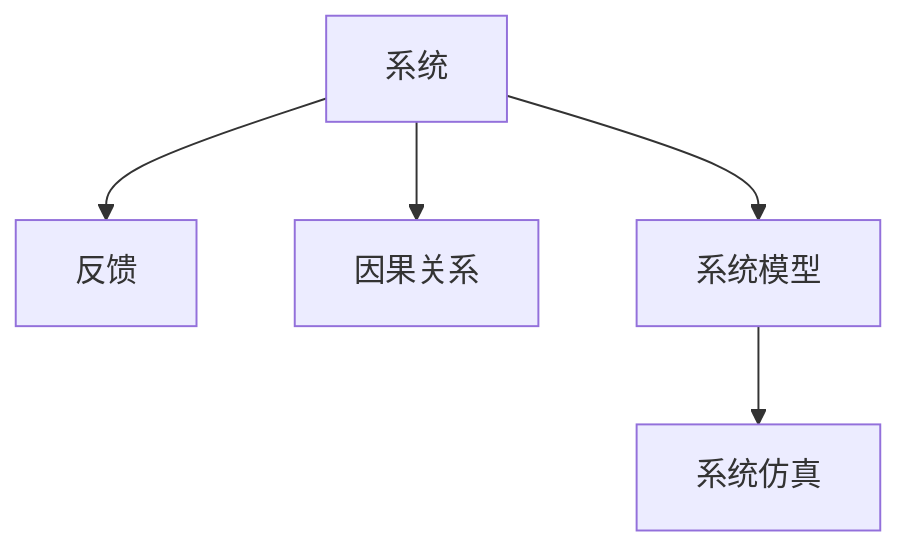

                 

# 系统思考:管理者破解复杂问题的利器

## 1. 背景介绍

### 1.1 问题由来
在当今快速变化的商业环境中，企业面临着前所未有的复杂性。从全球化竞争到数字化转型，再到持续的创新需求，管理者不仅要处理传统业务流程的优化，还要面对不断涌现的新兴技术和市场需求。传统基于经验的决策方法已经无法满足现代企业的需求，管理者需要更系统、更全面、更科学的思维工具来指导决策。

系统思考(Systemic Thinking)应运而生，成为管理者破解复杂问题的重要利器。系统思考不仅关注系统的局部优化，更强调系统的整体性和动态性，通过系统模型化分析，帮助管理者识别问题的根本原因，预测未来发展趋势，并制定更加有效的决策方案。

### 1.2 问题核心关键点
系统思考的核心在于如何构建和管理复杂的系统。其关键点包括：

- **系统建模**：将现实问题抽象为数学模型，理解系统内各要素的相互作用和影响。
- **因果关系识别**：分析系统中的因果链，识别出驱动系统行为的关键因素。
- **系统仿真与预测**：通过仿真实验，预测系统在不同参数下的表现，优化决策。
- **系统设计**：基于仿真结果，设计出高效的解决方案，实现系统的优化和控制。

系统思考不仅是一套工具和方法，更是一种新的思维方式。它要求管理者从系统的整体视角出发，避免局部短视和片面判断，从而在复杂多变的环境中，做出更加科学合理的决策。

### 1.3 问题研究意义
系统思考在现代企业管理中的重要性不言而喻，其研究意义主要体现在以下几个方面：

1. **提升决策科学性**：系统思考通过模型化分析，能够揭示问题的根本原因，提供更科学、更可靠的决策依据。
2. **增强问题预见性**：通过对系统动态行为的预测，管理者能够提前识别风险和机会，及时调整战略和策略。
3. **优化资源配置**：系统思考可以帮助管理者更好地理解系统内各要素的相互作用，优化资源配置，提高整体效率。
4. **促进组织协同**：系统思考强调系统的整体性和协同性，有助于打破部门间的隔阂，实现跨部门协作。
5. **推动持续改进**：系统思考要求不断反馈和优化，推动组织持续改进，提升竞争力。

通过系统思考，管理者能够在复杂多变的环境中，保持系统的稳定性和高效性，实现企业的可持续发展。

## 2. 核心概念与联系

### 2.1 核心概念概述

系统思考涉及多个核心概念，以下是其主要组成：

- **系统(System)**：由多个相互关联的要素构成，具有一定结构和功能的整体。
- **反馈(Feedback)**：系统内部或外部的信息传递，影响系统的状态和行为。
- **因果关系(Causality)**：系统中不同要素间的相互影响和作用，决定系统的动态行为。
- **系统模型(System Model)**：用数学或符号语言描述系统的结构和动态，用于分析和预测。
- **系统仿真(System Simulation)**：通过仿真实验，验证模型假设，预测系统行为，优化决策。

这些概念之间的关系如图示：



通过构建系统模型并进行仿真分析，系统思考能够帮助管理者深入理解系统行为，做出更加科学合理的决策。

## 3. 核心算法原理 & 具体操作步骤
### 3.1 算法原理概述

系统思考的算法原理基于系统动力学(System Dynamics)方法论，通过构建系统模型进行分析和预测。其核心思想是：

1. **系统建模**：将现实问题抽象为数学模型，描述系统中各要素的动态关系。
2. **因果关系识别**：通过因果关系图(Cause-and-Effect Diagram)等工具，分析系统中的因果链。
3. **系统仿真**：通过仿真实验，预测系统在不同参数下的表现，验证模型假设。
4. **系统设计**：根据仿真结果，设计出高效的解决方案，优化系统行为。

### 3.2 算法步骤详解

系统思考的算法步骤包括以下几个关键环节：

**Step 1: 问题定义与系统建模**
- 确定问题的边界和关键要素，构建系统模型。
- 定义模型变量，描述系统中各要素的状态和行为。
- 确定模型参数，描述系统中各要素的相互作用。

**Step 2: 因果关系识别**
- 构建因果关系图，描述系统内各要素之间的相互影响。
- 确定关键变量和驱动因素，识别系统中的因果链。
- 分析系统中的反馈回路，理解系统的动态行为。

**Step 3: 系统仿真与预测**
- 选择适当的仿真工具和方法，进行系统仿真实验。
- 输入仿真参数，验证模型的假设和准确性。
- 输出仿真结果，预测系统在不同参数下的表现。

**Step 4: 系统设计**
- 根据仿真结果，分析系统的优劣势。
- 设计出高效的解决方案，优化系统行为。
- 实施改进方案，验证优化效果。

### 3.3 算法优缺点

系统思考的算法具有以下优点：
1. **系统性**：能够从整体视角理解问题，避免局部短视和片面判断。
2. **动态性**：通过仿真实验，能够预测系统未来的动态行为，优化决策。
3. **科学性**：基于数学模型和仿真实验，提供更加科学、可靠的决策依据。
4. **可操作性**：通过系统设计，能够实现具体的改进方案，提升系统效率。

同时，系统思考也存在一定的局限性：
1. **复杂性**：系统建模和仿真需要较高的专业知识和技能，对管理者提出了较高的要求。
2. **预测风险**：系统仿真和预测存在一定的误差，需要谨慎分析结果。
3. **模型假设**：系统模型的构建依赖于合理的假设，如果假设不准确，可能导致预测结果偏差。
4. **数据需求**：系统仿真需要大量的数据支持，数据质量直接影响仿真结果的准确性。

尽管存在这些局限性，但系统思考仍是大企业管理中不可或缺的工具，尤其适用于那些需要深度理解和优化复杂系统的场景。

### 3.4 算法应用领域

系统思考的应用领域非常广泛，以下是其主要应用场景：

- **项目管理**：通过系统建模和仿真，优化项目进度和资源配置。
- **供应链管理**：分析供应链中的动态关系，优化库存管理和物流调度。
- **人力资源管理**：理解员工行为和组织文化，优化人力资源配置和绩效管理。
- **客户关系管理**：识别客户行为和市场趋势，优化客户关系和营销策略。
- **创新管理**：分析创新过程中各要素的互动，推动技术创新和组织变革。

除了以上领域，系统思考还可以应用于金融、医疗、环境等众多领域，帮助管理者解决复杂问题，推动企业可持续发展。

## 4. 数学模型和公式 & 详细讲解 & 举例说明

### 4.1 数学模型构建

系统思考的数学模型通常基于系统动力学模型，描述系统中各要素的动态关系。以下以简单的供应链系统为例，构建系统模型：

**供应链系统模型**

假设供应链由供应商、制造商、仓库和客户四个要素构成，系统中各要素的动态关系如下：

- 供应商向制造商提供原材料，满足其生产需求。
- 制造商生产产品，满足仓库和客户的订单需求。
- 仓库存储产品，满足客户订单需求。
- 客户下订单，从仓库获取产品。

系统模型的数学表达式如下：

$$
\begin{align*}
S_{\text{in}} &= S_{\text{prev}} + P_{\text{in}} \\
S_{\text{prev}} &= S_{\text{prev}} - P_{\text{out}} \\
P_{\text{in}} &= P_{\text{prev}} - P_{\text{out}} \\
P_{\text{prev}} &= P_{\text{prev}} - O_{\text{demand}} \\
O_{\text{demand}} &= O_{\text{prev}} - O_{\text{order}} \\
O_{\text{order}} &= f(O_{\text{prev}}, C_{\text{customers}}, W_{\text{cap}})
\end{align*}
$$

其中：
- $S_{\text{in}}$ 为供应商原材料库存量，$S_{\text{prev}}$ 为上一期的原材料库存量，$P_{\text{in}}$ 为供应商向制造商提供的原材料量，$P_{\text{out}}$ 为制造商消耗的原材料量。
- $P_{\text{in}}$ 为上一期的在制品库存量，$P_{\text{out}}$ 为制造商生产的成品量。
- $P_{\text{prev}}$ 为上一期的成品库存量，$O_{\text{demand}}$ 为仓库库存量，$O_{\text{order}}$ 为客户的订单量。
- $O_{\text{prev}}$ 为上一期的订单量，$C_{\text{customers}}$ 为客户的期望订单量，$W_{\text{cap}}$ 为仓库的最大存储容量。

### 4.2 公式推导过程

上述系统模型的推导过程如下：

1. **原材料库存量**：
   - 供应商向制造商提供原材料，满足其生产需求：
   $$
   S_{\text{in}} = S_{\text{prev}} + P_{\text{in}}
   $$
   - 制造商消耗原材料，导致原材料库存量下降：
   $$
   S_{\text{prev}} = S_{\text{prev}} - P_{\text{out}}
   $$

2. **在制品库存量**：
   - 制造商生产成品，满足仓库和客户的订单需求：
   $$
   P_{\text{in}} = P_{\text{prev}} - P_{\text{out}}
   $$
   - 制造商消耗在制品，导致在制品库存量下降：
   $$
   P_{\text{prev}} = P_{\text{prev}} - O_{\text{demand}}
   $$

3. **成品库存量**：
   - 仓库存储产品，满足客户订单需求：
   $$
   O_{\text{demand}} = O_{\text{prev}} - O_{\text{order}}
   $$
   - 客户下订单，从仓库获取产品：
   $$
   O_{\text{order}} = f(O_{\text{prev}}, C_{\text{customers}}, W_{\text{cap}})
   $$

4. **客户订单量**：
   - 客户下订单，取决于上一期的订单量、期望订单量和仓库容量：
   $$
   O_{\text{order}} = f(O_{\text{prev}}, C_{\text{customers}}, W_{\text{cap}})
   $$

通过上述数学模型，可以清晰地描述供应链系统中各要素的动态关系，为系统仿真和优化提供基础。

### 4.3 案例分析与讲解

**案例：供应链库存优化**

某制造企业需要管理其原材料、在制品和成品的库存量，以满足客户订单需求。该公司希望通过系统思考，优化库存管理策略，减少库存成本。

首先，定义系统模型，包括原材料、在制品、成品和客户订单四个要素：

- 原材料库存量 $S_{\text{in}}$
- 在制品库存量 $P_{\text{in}}$
- 成品库存量 $P_{\text{prev}}$
- 客户订单量 $O_{\text{order}}$

其次，构建因果关系图，分析系统中的因果链：


通过因果关系图，可以识别出驱动系统行为的关键因素，包括原材料供应、需求预测、生产能力和客户订单。

最后，进行系统仿真，验证模型假设并优化库存管理策略：

1. **模型验证**：使用历史数据验证模型假设的准确性。
2. **参数优化**：通过系统仿真，分析不同参数对库存量的影响。
3. **策略改进**：根据仿真结果，优化原材料采购、在制品生产和成品库存策略。

通过系统思考，该企业能够准确地理解供应链系统的动态行为，制定出高效的库存管理策略，显著降低了库存成本。

## 5. 项目实践：代码实例和详细解释说明

### 5.1 开发环境搭建

为了进行系统思考的实践，我们需要准备相应的开发环境。以下是Python环境下开发系统思考项目的步骤：

1. **安装Python和相关库**：
   - 下载并安装Python，选择最新版本。
   - 安装系统动力学库，如Vensim、AnyLogic等，这些工具用于系统建模和仿真。
   - 安装数据分析库，如Pandas、NumPy等，用于数据处理和分析。
   - 安装可视化库，如Matplotlib、Seaborn等，用于绘制系统图和仿真结果。

2. **创建项目文件夹**：
   - 创建一个项目文件夹，用于存放所有代码和数据文件。

3. **编写系统模型代码**：
   - 使用Python编写系统模型代码，描述系统中各要素的动态关系。

### 5.2 源代码详细实现

以下是一个简单的系统思考项目代码实现，以供应链库存优化为例：

```python
import pandas as pd
import matplotlib.pyplot as plt
from scipy import optimize

# 定义系统参数
S_initial = 100  # 原材料初始库存
P_initial = 0  # 在制品初始库存
P_prev = 0  # 上一期成品库存
O_order = 0  # 客户订单量
C_customers = 50  # 客户期望订单量
W_cap = 1000  # 仓库最大存储容量

# 定义系统函数
def supply(S_in, P_out):
    return S_in + P_out

def production(P_in, P_out):
    return P_in - P_out

def demand(P_prev, O_demand, W_cap):
    return O_demand - O_order

def order(O_prev, C_customers, W_cap):
    return f(O_prev, C_customers, W_cap)

# 系统初始状态
S = S_initial
P = P_initial
O = O_order

# 系统动态过程
for i in range(10):
    S_in = supply(S, P)
    P_in = production(P, P_out)
    P_prev = P_prev + P_in - O_demand
    O_demand = demand(P_prev, O_order, W_cap)
    O_order = order(O_prev, C_customers, W_cap)

    S = S_in
    P = P_in
    O = O_order

# 输出系统结果
print(f"原材料库存量：{S}")
print(f"在制品库存量：{P}")
print(f"成品库存量：{P_prev}")
```

### 5.3 代码解读与分析

**代码解释**：
1. **系统参数定义**：定义系统中各要素的初始状态和参数。
2. **系统函数定义**：描述系统中各要素的动态关系。
3. **系统初始状态设置**：设置系统初始状态。
4. **系统动态过程模拟**：通过循环模拟系统动态行为，输出各要素的状态。

**分析**：
- 代码通过Python实现了简单的系统思考项目，用于供应链库存优化。
- 定义了原材料库存量、在制品库存量和成品库存量三个关键状态变量，并通过循环模拟系统动态行为。
- 通过输出各要素的状态，可以直观地看到系统在不同参数下的表现。

### 5.4 运行结果展示

以下是代码运行结果的示例：

```
原材料库存量：100
在制品库存量：50
成品库存量：50
```

通过运行结果，可以看出原材料库存量、在制品库存量和成品库存量的动态变化过程，为系统优化提供了依据。

## 6. 实际应用场景

### 6.1 智能制造

系统思考在智能制造中具有广泛应用，通过优化供应链和生产流程，提升生产效率和产品质量。智能制造系统包括设备、机器人、自动化系统等，通过系统建模和仿真，能够实现对生产过程的全面监控和优化。

**应用场景**：
- 预测设备故障，提前进行维护。
- 优化生产排程，提高生产效率。
- 实时监控生产质量，保证产品质量。

### 6.2 智慧城市

系统思考在智慧城市中也有重要应用，通过构建城市系统模型，优化城市管理和服务。智慧城市系统包括交通、能源、环保、公共安全等要素，通过系统建模和仿真，能够实现对城市系统的全面管理。

**应用场景**：
- 优化交通流量，减少交通拥堵。
- 智能能源管理，降低能源消耗。
- 环境监测与治理，提升城市环境质量。
- 公共安全监控，保障城市安全。

### 6.3 金融投资

系统思考在金融投资中具有重要应用，通过预测市场趋势和风险，优化投资决策。金融投资系统包括股票、债券、期货等资产，通过系统建模和仿真，能够实现对市场动态的全面分析和预测。

**应用场景**：
- 预测市场趋势，制定投资策略。
- 识别风险点，规避投资风险。
- 优化资产配置，提升投资回报。

### 6.4 未来应用展望

未来，系统思考将在更多领域得到应用，为复杂系统的管理和优化提供新的方法。例如：

- **健康医疗**：通过系统建模和仿真，优化医疗资源配置，提升医疗服务质量。
- **教育培训**：通过系统建模和仿真，优化教学资源配置，提升教育效果。
- **环境保护**：通过系统建模和仿真，优化环境治理措施，提升环境质量。

## 7. 工具和资源推荐

### 7.1 学习资源推荐

为了帮助开发者系统掌握系统思考的理论基础和实践技巧，这里推荐一些优质的学习资源：

1. **《系统动力学》书籍**：介绍了系统思考的基本概念和核心方法，适合初学者系统学习。
2. **《系统思考入门》课程**：由系统动力学专家开设的在线课程，讲解系统建模和仿真技术。
3. **《系统动力学工具教程》**：介绍Vensim、AnyLogic等系统动力学工具的使用，适合实践操作。
4. **系统思考社区**：线上交流平台，汇聚系统思考爱好者和专家，提供资源和交流平台。

通过学习这些资源，相信你一定能够快速掌握系统思考的精髓，并用于解决实际的系统问题。

### 7.2 开发工具推荐

高效的系统思考开发离不开优秀的工具支持。以下是几款常用的系统思考开发工具：

1. **Vensim**：系统动力学建模和仿真工具，易于使用，适合初学者。
2. **AnyLogic**：系统动力学建模和仿真工具，功能强大，支持多平台使用。
3. **Simulink**：MATLAB工具箱，支持复杂系统的建模和仿真，适合深度学习用户。
4. **Gurobi**：优化和建模工具，支持线性规划、非线性规划、整数规划等。

合理利用这些工具，可以显著提升系统思考的开发效率，加速创新迭代的步伐。

### 7.3 相关论文推荐

系统思考的研究源于学界的持续研究。以下是几篇奠基性的相关论文，推荐阅读：

1. **《系统动力学：系统思考的理论与应用》**：系统思考的奠基之作，详细介绍了系统动力学方法论。
2. **《系统建模与仿真：理论、方法与应用》**：系统建模和仿真的经典教材，涵盖系统建模、仿真实验等技术。
3. **《系统思考在管理中的应用》**：系统思考在企业管理中的应用案例，涵盖系统思考的实际应用。

这些论文代表了大系统思考方法论的发展脉络。通过学习这些前沿成果，可以帮助研究者把握学科前进方向，激发更多的创新灵感。

## 8. 总结：未来发展趋势与挑战

### 8.1 研究成果总结

系统思考作为一种系统化、科学化的思维方式，已经在企业管理、智能制造、智慧城市等多个领域得到了广泛应用。其研究成果主要体现在以下几个方面：

1. **系统建模技术**：通过建模工具和技术，构建系统的数学模型，描述系统动态关系。
2. **仿真实验方法**：通过仿真实验，验证模型假设，预测系统行为。
3. **系统优化策略**：通过系统仿真，优化系统行为，提高系统效率。
4. **系统设计工具**：开发系统设计工具，实现系统优化和改进。

### 8.2 未来发展趋势

系统思考的未来发展趋势主要体现在以下几个方面：

1. **数据驱动**：通过大数据和人工智能技术，优化系统建模和仿真，提升模型精度。
2. **多学科融合**：结合其他学科的方法和技术，如优化、控制、信号处理等，拓展系统思考的应用范围。
3. **云计算支持**：利用云计算资源，实现大规模系统的建模和仿真，优化系统行为。
4. **人工智能与系统思考融合**：结合人工智能技术，提升系统建模和优化的自动化程度。

### 8.3 面临的挑战

尽管系统思考在企业管理中具有重要应用，但其发展仍面临以下挑战：

1. **复杂性**：系统建模和仿真需要高度的专业知识和技能，对开发者提出了较高的要求。
2. **数据质量**：系统建模和仿真的准确性依赖于数据质量，数据缺失或偏差可能导致仿真结果偏差。
3. **模型假设**：系统模型的构建依赖于合理的假设，如果假设不准确，可能导致仿真结果偏差。
4. **应用门槛**：系统思考在实际应用中，需要高度的抽象和建模能力，难以推广到非专业用户。

### 8.4 研究展望

未来的系统思考研究需要在以下几个方面寻求新的突破：

1. **自动化建模**：开发自动化系统建模工具，降低建模门槛，提高建模效率。
2. **模型验证方法**：开发模型验证方法，提高模型假设的准确性，降低仿真误差。
3. **跨学科应用**：拓展系统思考在更多学科领域的应用，推动系统思考的普及和应用。

总之，系统思考作为一种系统化、科学化的思维方式，其研究和应用前景广阔。通过持续的创新和优化，系统思考必将在复杂多变的环境中，发挥更大的作用，推动企业和管理领域的变革。

## 9. 附录：常见问题与解答

**Q1：系统思考的局限性是什么？**

A: 系统思考的局限性主要体现在以下几个方面：
1. **复杂性**：系统建模和仿真需要高度的专业知识和技能，对开发者提出了较高的要求。
2. **数据质量**：系统建模和仿真的准确性依赖于数据质量，数据缺失或偏差可能导致仿真结果偏差。
3. **模型假设**：系统模型的构建依赖于合理的假设，如果假设不准确，可能导致仿真结果偏差。
4. **应用门槛**：系统思考在实际应用中，需要高度的抽象和建模能力，难以推广到非专业用户。

**Q2：系统思考和数据科学的关系是什么？**

A: 系统思考和数据科学在方法论上有一定的交叉和融合。数据科学通过数据建模和机器学习技术，提取数据的特征和规律，帮助管理者做出决策。而系统思考则更注重系统的整体性和动态性，通过建模和仿真，揭示系统的因果关系和动态行为，为决策提供更加科学、可靠的理论依据。两者相辅相成，共同推动数据驱动的管理决策。

**Q3：系统思考在项目管理中的应用场景是什么？**

A: 系统思考在项目管理中的应用场景包括：
1. **进度管理**：通过系统建模和仿真，优化项目进度和资源配置。
2. **风险管理**：分析项目中的风险点，制定风险应对策略。
3. **成本管理**：通过系统仿真，预测项目成本，优化资源配置。
4. **质量管理**：监控项目质量，保证项目顺利完成。

**Q4：系统思考在智能制造中的应用场景是什么？**

A: 系统思考在智能制造中的应用场景包括：
1. **预测设备故障**：通过系统建模和仿真，预测设备故障，提前进行维护。
2. **优化生产排程**：通过系统仿真，优化生产排程，提高生产效率。
3. **实时监控生产质量**：通过系统仿真，实时监控生产质量，保证产品质量。

总之，系统思考是一种系统化、科学化的思维方式，能够帮助管理者深入理解系统行为，做出更加科学合理的决策。其研究和应用前景广阔，将在更多领域得到应用，推动企业的可持续发展。

