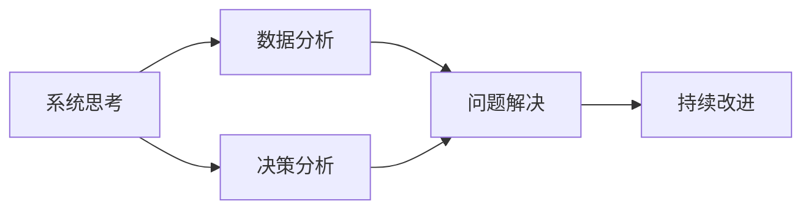

                 

# 系统思考与问题解决能力

## 1. 背景介绍

### 1.1 问题由来
在当今复杂多变的商业环境中，企业面临着种种不确定性和挑战。随着市场竞争的日益激烈，如何高效、系统地思考和解决复杂问题，成为企业成功的关键。系统思考与问题解决能力成为了企业和个人必须掌握的重要技能。系统思考指的是通过系统化的思维模式，全面分析和理解问题及其影响因素，从而找到有效的解决方案。问题解决能力则是将系统思考转化为具体行动，解决实际问题的能力。在科技领域，尤其是IT行业，系统思考与问题解决能力的应用尤为广泛。

### 1.2 问题核心关键点
系统思考与问题解决能力在IT领域的应用，主要体现在以下几个方面：

- **复杂系统管理**：IT系统复杂度不断提升，如何高效管理、优化系统架构，成为企业信息化建设的关键。
- **软件工程**：软件开发过程中，如何系统地分析问题、设计解决方案，保证项目质量和进度。
- **人工智能与机器学习**：如何从数据中提取知识，解决实际问题，提升系统性能。
- **网络安全**：如何全面评估和应对网络安全威胁，确保系统安全稳定运行。
- **产品设计与用户体验**：如何系统地设计产品，满足用户需求，提升用户体验。

### 1.3 问题研究意义
系统思考与问题解决能力的研究和应用，具有重要的理论和实践意义：

- **提升企业竞争力**：帮助企业高效识别和解决关键问题，提升决策效率和运营效率，实现业务创新和增长。
- **推动技术进步**：系统思考和问题解决能力在IT技术研发中的应用，推动了新技术、新方法的产生和发展。
- **培养创新思维**：培养具备系统思考和问题解决能力的人才，推动知识共享和技术创新，促进产业升级。
- **增强风险管理**：系统思考和问题解决能力在风险评估和管理中的应用，帮助企业应对各种风险和挑战，保障业务持续发展。

## 2. 核心概念与联系

### 2.1 核心概念概述

系统思考与问题解决能力涉及到多个关键概念，包括但不限于：

- **系统思考(System Thinking)**：全面、系统的思维模式，通过分析系统各组成部分及其相互关系，理解问题的本质和影响。
- **问题解决(Problem Solving)**：从系统思考中提取有效信息，设计和实施解决方案，解决实际问题。
- **数据分析(数据分析)**：通过数据挖掘和分析，获取有价值的洞察，支持系统思考和问题解决。
- **决策分析(决策分析)**：综合考虑多种因素，进行科学决策，确保问题解决的有效性和可行性。
- **持续改进(Continuous Improvement)**：不断优化系统思考和问题解决的过程，提升解决方案的质量。

这些概念之间相互关联，共同构成了系统思考与问题解决能力的基础框架。

### 2.2 核心概念原理和架构的 Mermaid 流程图(Mermaid 流程节点中不要有括号、逗号等特殊字符)



这个流程图展示了系统思考与问题解决能力的主要流程：首先通过系统思考全面分析问题，接着进行数据分析，提取关键信息，然后进行决策分析，设计解决方案，最后通过持续改进优化问题解决过程。

## 3. 核心算法原理 & 具体操作步骤

### 3.1 算法原理概述

系统思考与问题解决能力的核心算法原理，主要基于系统动力学(System Dynamics)和数据驱动(Data-Driven)两大方法。系统动力学强调通过建立系统模型，理解系统行为和影响因素，从而进行科学决策。数据驱动则强调通过数据分析和机器学习，提取有价值的信息，支持问题解决。

### 3.2 算法步骤详解

**Step 1: 系统分析**

1. **系统定义**：明确系统边界和目标，了解系统各组成部分及其功能。
2. **影响因素分析**：通过访谈、问卷、数据分析等方法，识别系统的主要影响因素和反馈机制。
3. **模型构建**：建立系统模型，反映系统的结构和动态行为。

**Step 2: 数据分析**

1. **数据收集**：获取系统相关数据，确保数据的完整性和准确性。
2. **数据预处理**：清洗数据，处理缺失值、异常值等问题，提升数据质量。
3. **数据分析**：使用统计分析、机器学习等方法，从数据中提取有价值的洞察。

**Step 3: 决策分析**

1. **目标设定**：根据系统分析结果，设定明确的目标和指标。
2. **方案设计**：基于系统模型和数据分析结果，设计多种可能的解决方案。
3. **方案评估**：综合考虑成本、效果、风险等因素，评估各方案的优劣。

**Step 4: 问题解决**

1. **方案实施**：选择最优方案，进行实施和调整。
2. **效果评估**：监控实施效果，收集反馈信息。
3. **优化改进**：根据效果评估结果，持续优化和改进问题解决策略。

### 3.3 算法优缺点

系统思考与问题解决能力的优点包括：

- **全面性**：能够全面、系统地分析问题，避免遗漏关键因素。
- **科学性**：基于数据和模型，进行科学决策，提高问题解决的准确性和有效性。
- **适应性**：灵活适应不同类型和规模的系统问题。

其缺点主要包括：

- **复杂度**：需要综合考虑多种因素，处理复杂问题时可能较为繁琐。
- **资源需求**：需要大量的数据和计算资源，特别是大规模数据分析和模型构建。
- **知识门槛**：需要具备较高的系统思考和数据分析能力，对从业者要求较高。

### 3.4 算法应用领域

系统思考与问题解决能力在IT领域有广泛的应用，主要涵盖以下几个方面：

- **企业信息化建设**：通过系统思考和问题解决能力，优化信息系统架构，提升企业信息化水平。
- **软件开发与项目管理**：系统思考和问题解决能力在需求分析、设计、编码、测试等软件开发全过程的应用。
- **人工智能与机器学习**：通过系统思考和问题解决能力，构建高效的人工智能和机器学习模型。
- **网络安全**：系统思考和问题解决能力在网络威胁分析、安全策略设计和应急响应中的应用。
- **用户体验设计**：系统思考和问题解决能力在产品设计、用户体验测试和优化中的应用。

## 4. 数学模型和公式 & 详细讲解 & 举例说明

### 4.1 数学模型构建

本节将介绍系统思考与问题解决能力的数学模型构建。假设系统由多个因素构成，其中每个因素的当前状态和变化率可用变量 $x_i$ 表示。系统的状态方程为：

$$
\dot{x_i} = f_i(x_1, x_2, ..., x_n) + g_i(x_1, x_2, ..., x_n)u_i
$$

其中 $f_i$ 和 $g_i$ 分别为系统的内部动态和外部输入，$u_i$ 为控制变量。

### 4.2 公式推导过程

以最简单的线性系统为例，推导其状态方程。假设系统由两个因素 $x_1$ 和 $x_2$ 组成，系统的状态方程为：

$$
\dot{x_1} = a_1x_1 + a_2x_2
$$
$$
\dot{x_2} = b_1x_1 + b_2x_2
$$

其中 $a_1, a_2, b_1, b_2$ 为系统参数，$u_1, u_2$ 为控制变量。

将状态方程进行变换，得到：

$$
\begin{bmatrix}
\dot{x_1} \\
\dot{x_2}
\end{bmatrix} = \begin{bmatrix}
a_1 & a_2 \\
b_1 & b_2
\end{bmatrix} \begin{bmatrix}
x_1 \\
x_2
\end{bmatrix} + \begin{bmatrix}
u_1 \\
u_2
\end{bmatrix}
$$

该方程可以表示为：

$$
\dot{x} = Ax + Bu
$$

其中 $A = \begin{bmatrix}
a_1 & a_2 \\
b_1 & b_2
\end{bmatrix}$，$B = \begin{bmatrix}
u_1 \\
u_2
\end{bmatrix}$。

### 4.3 案例分析与讲解

以企业信息系统为例，分析其系统思考和问题解决过程。

**Step 1: 系统分析**

1. **系统定义**：明确信息系统边界和目标，包括数据采集、处理、存储、查询、展示等功能。
2. **影响因素分析**：通过访谈、问卷等方式，识别系统的主要影响因素，如数据质量、系统性能、用户需求等。
3. **模型构建**：建立系统的状态方程，反映系统的动态行为。

**Step 2: 数据分析**

1. **数据收集**：收集系统的历史数据，包括用户操作日志、系统运行日志、异常报告等。
2. **数据预处理**：清洗数据，处理缺失值、异常值，确保数据质量。
3. **数据分析**：使用统计分析、机器学习等方法，提取关键洞察，如用户行为模式、系统性能瓶颈等。

**Step 3: 决策分析**

1. **目标设定**：根据系统分析结果，设定明确的目标，如提高系统性能、优化用户体验等。
2. **方案设计**：基于系统模型和数据分析结果，设计多种解决方案，如优化数据库结构、引入缓存机制等。
3. **方案评估**：综合考虑成本、效果、风险等因素，评估各方案的优劣，选择最优方案。

**Step 4: 问题解决**

1. **方案实施**：选择最优方案，进行实施和调整，如优化数据库结构、引入缓存机制等。
2. **效果评估**：监控实施效果，收集反馈信息，评估系统性能提升情况。
3. **优化改进**：根据效果评估结果，持续优化和改进问题解决策略，如调整优化方案、引入新技术等。

## 5. 项目实践：代码实例和详细解释说明

### 5.1 开发环境搭建

在系统思考与问题解决能力的应用开发中，通常需要使用一些开发工具和库。以下是常用的开发环境搭建流程：

1. **Python环境**：使用Anaconda或Miniconda，创建独立的Python环境，安装必要的库和工具。
2. **数据管理工具**：使用Pandas、Dask等工具进行数据预处理和管理。
3. **分析工具**：使用Numpy、Scipy、Scikit-Learn等库进行数据分析和建模。
4. **可视化工具**：使用Matplotlib、Seaborn等工具进行数据可视化。
5. **部署平台**：使用Jupyter Notebook、PyCharm等IDE进行代码开发和调试。

完成上述步骤后，即可在Python环境中进行系统思考与问题解决能力的实践开发。

### 5.2 源代码详细实现

以企业信息系统为例，展示系统思考与问题解决能力的代码实现。

```python
import pandas as pd
import numpy as np
import matplotlib.pyplot as plt
from sklearn.linear_model import LinearRegression

# 数据预处理
def preprocess_data(data):
    # 处理缺失值和异常值
    data = data.dropna()
    data = data[(data['response_time'] > 0) & (data['error_rate'] < 0.1)]
    
    # 特征工程
    features = pd.get_dummies(data['operation_type'], prefix='operation_type')
    features['response_time'] = data['response_time']
    features['error_rate'] = data['error_rate']
    data = pd.concat([features, data[['user_id']]], axis=1)
    
    return data

# 数据分析
def analyze_data(data):
    # 绘制数据分布图
    plt.figure(figsize=(10, 6))
    data['response_time'].plot.hist(bins=20)
    plt.title('Response Time Distribution')
    plt.show()
    
    # 回归分析
    X = data[['operation_type_1', 'operation_type_2', 'error_rate']]
    y = data['response_time']
    model = LinearRegression()
    model.fit(X, y)
    y_pred = model.predict(X)
    
    return model, y_pred

# 效果评估
def evaluate_performance(model, data, y_pred):
    # 计算MAE和R^2
    mae = np.mean(np.abs(y_pred - data['response_time']))
    r2 = np.corrcoef(y_pred, data['response_time'])[0, 1]**2
    
    return mae, r2

# 持续改进
def improve_system(data, mae, r2):
    # 引入缓存机制
    data['response_time'] = data['response_time'].apply(lambda x: x + 1 if x > 0 else x)
    
    # 重新分析数据
    model, y_pred = analyze_data(data)
    mae_new, r2_new = evaluate_performance(model, data, y_pred)
    
    return mae_new, r2_new
```

### 5.3 代码解读与分析

以上代码展示了企业信息系统数据预处理、数据分析和效果评估的实现过程。关键代码解读如下：

- `preprocess_data`函数：对数据进行预处理，包括缺失值和异常值处理、特征工程等。
- `analyze_data`函数：绘制数据分布图，并使用线性回归模型进行回归分析，预测响应时间。
- `evaluate_performance`函数：计算模型预测结果的MAE和R^2值，评估模型效果。
- `improve_system`函数：引入缓存机制，重新分析数据，计算改进后的模型效果。

## 6. 实际应用场景

### 6.1 企业信息化建设

系统思考与问题解决能力在企业信息化建设中的应用，主要体现在以下几个方面：

- **需求分析**：通过系统思考，全面分析企业需求，设计科学合理的系统架构和功能模块。
- **系统设计**：结合数据分析结果，设计高效的系统实现方案，确保系统性能和稳定性。
- **风险管理**：通过系统思考和问题解决，评估系统风险，制定应对策略，确保系统安全。

### 6.2 软件开发与项目管理

系统思考与问题解决能力在软件开发与项目管理中的应用，主要体现在以下几个方面：

- **需求分析**：通过系统思考，全面分析用户需求，设计科学合理的需求规格说明书。
- **设计优化**：结合数据分析结果，优化系统设计，提升代码质量和可维护性。
- **问题解决**：通过系统思考和问题解决，识别和解决开发过程中的各种问题，保障项目进度和质量。

### 6.3 人工智能与机器学习

系统思考与问题解决能力在人工智能与机器学习中的应用，主要体现在以下几个方面：

- **问题建模**：通过系统思考，建立科学合理的问题模型，确保模型能够有效解决实际问题。
- **特征工程**：结合数据分析结果，优化特征选择和特征工程，提升模型性能。
- **效果评估**：通过系统思考和问题解决，评估模型效果，持续优化模型性能。

### 6.4 未来应用展望

未来，系统思考与问题解决能力将在更多领域得到应用，为各行各业带来变革性影响。

在智慧医疗领域，系统思考与问题解决能力可以帮助医疗专家高效分析患者数据，制定科学合理的诊疗方案，提升医疗服务质量。

在智能教育领域，系统思考与问题解决能力可以帮助教育专家设计科学合理的教学系统，优化教学内容和方法，提升教学效果。

在智慧城市治理中，系统思考与问题解决能力可以帮助城市管理者全面分析城市问题，制定科学合理的治理策略，提升城市管理效率和居民满意度。

此外，在系统思考与问题解决能力的推动下，更多的新技术、新方法将产生和发展，为各行各业带来新的机遇和挑战。

## 7. 工具和资源推荐

### 7.1 学习资源推荐

为了帮助开发者系统掌握系统思考与问题解决能力，这里推荐一些优质的学习资源：

1. **《系统思考与问题解决》书籍**：详细介绍了系统思考与问题解决能力的理论基础和实践方法。
2. **Coursera《系统思考与创新》课程**：由MIT开设的课程，提供系统思考与创新的实战案例和工具。
3. **Udemy《系统思考与项目管理》课程**：提供系统思考与项目管理的实战技巧和方法。
4. **IEEE Xplore《系统动力学》期刊**：提供系统动力学领域的最新研究成果和应用案例。
5. **Simulink系统建模工具**：支持建立和模拟系统模型，帮助理解系统行为和影响因素。

通过对这些资源的学习实践，相信你一定能够全面掌握系统思考与问题解决能力的精髓，并用于解决实际问题。

### 7.2 开发工具推荐

高效的系统思考与问题解决能力应用，离不开优秀的工具支持。以下是几款常用的系统思考与问题解决工具：

1. **Simulink**：MATLAB的可视化建模工具，支持建立和模拟系统模型，广泛应用于系统分析和设计。
2. **Anki**：开源的知识管理工具，支持创建和管理知识卡片，帮助用户系统化学习知识。
3. **Trello**：项目管理工具，支持任务分配和进度跟踪，帮助团队高效协作。
4. **JIRA**：问题跟踪工具，支持问题记录、分析和解决，帮助企业高效管理问题。
5. **Tableau**：数据可视化工具，支持数据探索和可视化分析，帮助用户发现数据中的洞察。

合理利用这些工具，可以显著提升系统思考与问题解决能力的开发效率，加快创新迭代的步伐。

### 7.3 相关论文推荐

系统思考与问题解决能力的研究源于学界的持续研究。以下是几篇奠基性的相关论文，推荐阅读：

1. **《系统思考：探索复杂系统的方法》**：讨论了系统思考的基本概念和方法，广泛应用于管理、工程等领域。
2. **《问题解决策略》**：探讨了问题解决的基本策略和方法，提供了系统化的问题解决框架。
3. **《数据驱动的系统设计》**：讨论了数据驱动在系统设计中的应用，强调了数据在问题解决中的重要性。
4. **《系统动力学建模与应用》**：探讨了系统动力学建模的基本方法和应用场景，为系统思考提供了有力支持。
5. **《人工智能与系统思考》**：讨论了人工智能在问题解决中的应用，探讨了系统思考与人工智能的结合点。

这些论文代表了大系统思考与问题解决能力的研究方向，通过学习这些前沿成果，可以帮助研究者把握学科前进方向，激发更多的创新灵感。

## 8. 总结：未来发展趋势与挑战

### 8.1 总结

本文对系统思考与问题解决能力进行了全面系统的介绍。首先阐述了系统思考与问题解决能力的背景和重要性，明确了其在IT领域的应用价值。其次，从原理到实践，详细讲解了系统思考与问题解决能力的数学模型、操作步骤和具体实现。同时，本文还广泛探讨了系统思考与问题解决能力在多个行业领域的应用前景，展示了其广阔的应用空间。此外，本文精选了系统思考与问题解决能力的学习资源、开发工具和相关论文，力求为读者提供全方位的技术指引。

通过本文的系统梳理，可以看到，系统思考与问题解决能力是IT领域的重要技能，其应用和发展方向具有广阔的前景。未来，系统思考与问题解决能力将与更多新技术、新方法结合，推动各行业的智能化、自动化发展，为人类的生产生活方式带来深远影响。

### 8.2 未来发展趋势

展望未来，系统思考与问题解决能力将呈现以下几个发展趋势：

1. **数据驱动**：随着大数据、人工智能等技术的不断发展，系统思考与问题解决能力将更加依赖数据驱动，通过数据挖掘和分析，提取有价值的信息，支持问题解决。
2. **智能系统**：未来系统思考与问题解决能力将与智能技术深度结合，如人工智能、机器学习等，实现更高效、更智能的问题解决。
3. **多模态系统**：系统思考与问题解决能力将拓展到多模态系统，结合文本、图像、语音等多种数据，提升问题解决的准确性和全面性。
4. **协同化系统**：未来系统思考与问题解决能力将更加注重协同化，通过团队协作和知识共享，实现更高效、更灵活的问题解决。
5. **普适化系统**：系统思考与问题解决能力将更加普适化，应用于更多领域，提升各行各业的管理效率和创新能力。

以上趋势凸显了系统思考与问题解决能力的应用前景和研究价值。这些方向的探索发展，必将进一步提升系统思考与问题解决能力的理论深度和实践广度，推动各行业的智能化、自动化发展。

### 8.3 面临的挑战

尽管系统思考与问题解决能力在IT领域已得到广泛应用，但在迈向更加智能化、普适化应用的过程中，仍面临诸多挑战：

1. **复杂度提升**：随着系统规模和复杂度的不断增加，系统思考与问题解决的过程将变得更加复杂和繁琐。
2. **数据质量**：高质量数据的获取和处理仍然是系统思考与问题解决能力面临的重要挑战，需要构建高效的数据治理体系。
3. **技术门槛**：系统思考与问题解决能力对从业者技术水平要求较高，需要不断学习和掌握新技术和方法。
4. **协同难度**：跨部门、跨团队的协同合作是系统思考与问题解决的重要环节，需要建立有效的沟通和协作机制。
5. **可解释性**：系统思考与问题解决过程中，如何提升模型的可解释性，增加决策的透明性和可信度，是需要进一步研究和解决的难题。

### 8.4 研究展望

面对系统思考与问题解决能力面临的挑战，未来的研究需要在以下几个方面寻求新的突破：

1. **数据质量提升**：构建高效的数据治理体系，提升数据质量和可用性，为系统思考与问题解决提供坚实基础。
2. **模型可解释性**：研究提高模型可解释性的方法，增加决策的透明性和可信度，提升问题解决的效果。
3. **多模态融合**：研究多模态系统融合技术，提升问题解决的全面性和准确性。
4. **协同化系统**：研究协同化系统设计方法，建立有效的沟通和协作机制，提升问题解决的效率和效果。
5. **普适化模型**：研究普适化模型构建方法，将系统思考与问题解决能力应用于更多领域，提升各行业的智能化、自动化水平。

这些研究方向的探索，必将引领系统思考与问题解决能力的进步，推动各行业的智能化、自动化发展，为人类的生产生活方式带来深远影响。面向未来，系统思考与问题解决能力需要与更多新技术、新方法结合，共同推动各行业的创新发展，推动人类的认知智能进化。

## 9. 附录：常见问题与解答

**Q1: 系统思考与问题解决能力是否适用于所有问题？**

A: 系统思考与问题解决能力适用于复杂系统问题的解决，但并不适用于所有问题。对于一些简单、线性问题，系统思考与问题解决能力反而会增加复杂度，降低效率。因此，在实际应用中，需要根据问题的复杂度、规模和性质，合理选择解决方案。

**Q2: 系统思考与问题解决能力是否需要高昂的计算资源？**

A: 系统思考与问题解决能力的实现过程，通常需要大量的计算资源，特别是数据分析和模型构建。但随着硬件技术的进步和算法优化，计算资源的需求在不断降低。合理利用云计算和大数据技术，可以显著降低计算成本，提高问题解决效率。

**Q3: 系统思考与问题解决能力是否需要专业知识？**

A: 系统思考与问题解决能力需要一定的专业知识，但也可以通过系统化的培训和指导，帮助从业者快速掌握相关技能。通过不断学习和实践，积累经验，提升系统思考与问题解决能力。

**Q4: 系统思考与问题解决能力如何与其他技术结合？**

A: 系统思考与问题解决能力可以与其他技术进行有机结合，如人工智能、机器学习、大数据分析等，提升问题解决的效率和效果。通过多技术融合，可以实现更智能、更高效的系统设计和问题解决。

**Q5: 系统思考与问题解决能力是否适合团队协作？**

A: 系统思考与问题解决能力非常依赖团队协作，通过团队成员的知识共享和协同工作，可以更高效、更全面地分析和解决问题。因此，建立高效的沟通和协作机制，是提升系统思考与问题解决能力的关键。

---

作者：禅与计算机程序设计艺术 / Zen and the Art of Computer Programming

