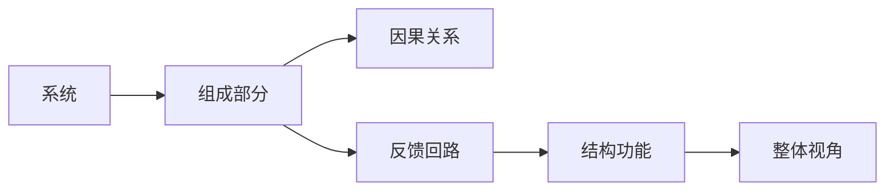
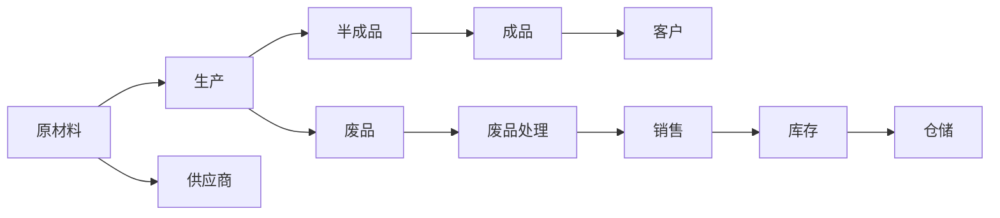

                 

## 1. 背景介绍

系统思考(Systems Thinking)是一种系统化、整体性的思考方法，旨在从整体视角理解系统的结构和运行机制，分析各组成部分之间的相互作用和因果关系。在管理领域，系统思考被广泛应用，帮助管理者以更宏观、更动态的方式分析和解决问题。

### 1.1 问题由来

现代企业的运营越来越复杂，各业务环节之间的依赖性和关联性越来越强。传统的线性思维模式往往难以捕捉系统内部的动态变化和交互影响。系统思考作为一种更全面的管理工具，能帮助管理者识别和理解系统中各组件之间的相互联系，揭示隐藏的依赖关系和反馈循环，从而做出更科学、更有效的决策。

### 1.2 问题核心关键点

系统思考的核心在于以下两个方面：

- **整体性**：强调系统是一个整体，各部分之间相互依存、相互影响。
- **动态性**：系统是一个不断变化的动态过程，需要从时间维度上考虑系统的演化和变迁。

这些关键点构成了系统思考的核心理念，帮助管理者从全局视角审视复杂问题，避免片面、孤立的决策。

### 1.3 问题研究意义

系统思考在管理中的应用，具有以下几方面的重要意义：

1. **增强决策科学性**：通过系统思考，管理者能更全面地分析问题，考虑系统内部和外部的影响因素，提高决策的科学性和准确性。
2. **提升系统管理能力**：系统思考帮助管理者理解系统的动态变化和反馈机制，优化系统的结构和流程，提升整体运行效率。
3. **促进跨部门协作**：系统思考强调整体性，促使不同部门之间建立更紧密的联系，促进跨部门协作，实现资源和信息的高效共享。
4. **强化可持续发展意识**：系统思考关注长期影响和整体利益，帮助管理者制定符合可持续发展目标的管理策略，平衡短期利益和长期发展。

## 2. 核心概念与联系

### 2.1 核心概念概述

系统思考涉及多个关键概念，包括系统、因果关系、反馈回路、结构功能等。这些概念相互作用，构成了一个系统的整体框架。

- **系统(System)**：由多个组成部分（如人员、部门、流程等）组成，各部分之间通过相互作用构成一个整体。
- **因果关系(Causality)**：系统内各部分之间的影响和作用机制，是系统思考的基础。
- **反馈回路(Feedback Loops)**：系统内部或系统与外部环境之间的信息传递和反应机制，影响系统的稳定性和动态变化。
- **结构功能(Structure-Function)**：系统结构和功能之间的关系，强调结构对功能的支撑作用。

### 2.2 核心概念原理和架构的 Mermaid 流程图



这个流程图展示了系统思考的基本结构，其中：

- A: 系统
- B: 组成部分
- C: 因果关系
- D: 反馈回路
- E: 结构功能
- F: 整体视角

箭头表示各概念之间的相互作用和关系。

## 3. 核心算法原理 & 具体操作步骤

### 3.1 算法原理概述

系统思考的管理应用，主要通过以下步骤实现：

1. **系统建模**：使用系统动力学(System Dynamics)方法，建立系统的结构模型。
2. **因果映射**：识别系统中的关键因果关系，绘制因果图。
3. **反馈分析**：分析系统的反馈回路，识别潜在的稳定性和动态变化。
4. **结构优化**：通过调整系统结构，优化系统功能和表现。
5. **系统仿真**：使用系统动力学仿真工具，验证模型的正确性和优化方案的有效性。

### 3.2 算法步骤详解

#### 3.2.1 系统建模

1. **系统定义**：明确系统的边界和目标，确定系统的关键组成部分。
2. **数据收集**：收集系统相关的数据，包括流程、人员、资源等相关信息。
3. **结构构建**：根据系统定义和数据，构建系统的结构模型，使用流图、存量图等表示。

#### 3.2.2 因果映射

1. **因果识别**：识别系统中的关键因果关系，如需求与供应、成本与收益等。
2. **因果图绘制**：使用因果图(Cause-Effect Diagram)绘制系统的因果关系图，标明因果链路和影响因素。

#### 3.2.3 反馈分析

1. **反馈回路识别**：识别系统中的反馈回路，包括正反馈和负反馈回路。
2. **反馈回路分析**：分析反馈回路的动态特性，识别潜在的稳定性和动态变化。

#### 3.2.4 结构优化

1. **结构调整**：根据反馈分析结果，调整系统的结构，优化系统功能和表现。
2. **模拟验证**：使用系统动力学仿真工具，验证结构优化方案的有效性。

#### 3.2.5 系统仿真

1. **仿真设置**：设置系统的仿真参数和条件，包括初始状态、边界条件等。
2. **仿真运行**：运行系统仿真，观察系统的动态变化和表现。
3. **仿真分析**：分析仿真结果，验证模型的正确性和优化方案的有效性。

### 3.3 算法优缺点

系统思考在管理中的应用，具有以下优点：

1. **全局视角**：通过系统建模和因果映射，管理者能从整体视角理解系统的结构和运行机制。
2. **动态分析**：通过反馈分析和仿真，管理者能理解系统的动态变化和反馈机制，优化系统运行。
3. **协作优化**：通过系统建模和因果映射，促进不同部门之间的协作，实现资源和信息的高效共享。
4. **科学决策**：通过系统思考，管理者能更全面地分析问题，提高决策的科学性和准确性。

同时，系统思考也存在一些缺点：

1. **复杂性高**：系统思考需要综合考虑多个因素，具有较高的复杂性和难度。
2. **建模难度大**：系统建模需要专业知识和技术工具，对于非专业管理者来说有一定门槛。
3. **仿真成本高**：系统仿真需要一定的计算资源和时间成本，对于资源有限的组织来说可能不经济。

### 3.4 算法应用领域

系统思考在管理中的应用，广泛涵盖以下几个领域：

1. **组织变革**：帮助组织识别和理解系统中的关键问题，优化组织结构和流程，实现组织变革。
2. **流程优化**：通过系统思考，识别和分析流程中的瓶颈和问题，优化流程设计，提升流程效率。
3. **风险管理**：系统思考帮助管理者识别和分析系统中的潜在风险，制定应对策略，提升风险管理能力。
4. **绩效提升**：通过系统思考，优化系统结构和功能，提升整体绩效和竞争力。
5. **资源管理**：帮助管理者优化资源配置和利用，提升资源利用效率。

## 4. 数学模型和公式 & 详细讲解 & 举例说明

### 4.1 数学模型构建

系统思考的数学模型，主要基于系统动力学(System Dynamics)理论，通过建立系统结构模型，描述系统各组成部分之间的关系和动态变化。系统动力学模型通常由以下几个要素构成：

1. **状态变量(State Variables)**：表示系统中的关键状态或存量。
2. **流率(Flow Rates)**：表示状态变量之间的相互作用和变化速率。
3. **控制变量(Control Variables)**：表示系统中的控制和决策变量。

### 4.2 公式推导过程

系统动力学模型的一个核心公式是流率方程(Flow Rate Equation)：

$$
\dot{S} = \sum_{i=1}^{n} f_i(S, P)
$$

其中，$S$ 表示状态变量，$f_i(S, P)$ 表示状态变量之间的相互作用和变化速率，$P$ 表示控制变量。

此外，系统动力学模型还包含反馈回路方程，描述系统内部的动态变化和反馈机制：

$$
\dot{S} = f(S, P) + g(P, Y)
$$

其中，$Y$ 表示系统输出，$g(P, Y)$ 表示系统内部或系统与外部环境之间的反馈机制。

### 4.3 案例分析与讲解

**案例：一家制造企业的生产流程优化**

一家制造企业面临着生产效率低、资源浪费严重的问题。通过系统思考，该企业首先构建了生产流程的系统结构模型，识别了关键的因果关系和反馈回路，如下图所示：



通过因果图，企业识别了生产过程中原材料供应、生产效率、废品处理等关键因果关系。进一步分析反馈回路，发现废品处理对生产效率的负反馈，以及库存水平对生产需求的正反馈。

基于上述分析，企业通过优化生产流程、调整废品处理策略、控制库存水平等措施，显著提升了生产效率和资源利用率，实现了成本和绩效的显著改善。

## 5. 项目实践：代码实例和详细解释说明

### 5.1 开发环境搭建

系统思考的实践，通常需要借助专业的系统动力学建模工具。这里以Vensim软件为例，介绍系统思考的开发环境搭建。

1. **安装Vensim**：从Vensim官网下载并安装Vensim软件。
2. **数据准备**：收集系统相关的数据，包括流程、人员、资源等相关信息。
3. **建立模型**：使用Vensim界面，建立系统的结构模型，添加状态变量、流率和控制变量。
4. **运行仿真**：使用Vensim的仿真功能，运行系统仿真，观察系统的动态变化和表现。

### 5.2 源代码详细实现

由于系统思考的实践更多依赖于专业软件，以下是使用Vensim软件进行系统建模和仿真的基本步骤：

1. **打开Vensim**：启动Vensim软件，创建新的系统动力学模型。
2. **添加状态变量**：在模型中创建状态变量，表示系统的关键状态或存量。
3. **设置流率方程**：为状态变量设置流率方程，描述状态变量之间的相互作用和变化速率。
4. **添加控制变量**：在模型中创建控制变量，表示系统中的控制和决策变量。
5. **仿真运行**：运行仿真，观察系统的动态变化和表现。
6. **分析结果**：分析仿真结果，验证模型的正确性和优化方案的有效性。

### 5.3 代码解读与分析

**代码示例**：

```python
import vensim
import vensim.context as vc
from vensim import Input

# 创建Vensim模型
model = vensim.Model()
model.from_file('system_model.vensim')

# 获取状态变量和流率方程
state_variables = model.state_variables
flow_rates = model.flow_rates

# 运行仿真
model_sim = vc.Simulator(model)
model_sim.run(1000)

# 分析结果
results = model_sim.results
```

在上述代码中，我们首先创建了一个Vensim模型，从文件中加载模型数据。然后，获取模型中的状态变量和流率方程，设置仿真参数并运行仿真。最后，获取仿真结果，进行分析和验证。

### 5.4 运行结果展示

运行仿真后，Vensim软件会生成一系列图表，展示系统在不同时间段的动态变化。以下是一个简化的仿真结果示例：


该图展示了系统状态变量随时间的变化趋势，帮助管理者理解系统的动态变化和反馈机制。

## 6. 实际应用场景

### 6.1 组织变革

系统思考在组织变革中的应用，通过识别和理解系统中的关键问题，优化组织结构和流程，实现组织变革。

**案例：一家科技公司的组织变革**

一家科技公司面临着业务增长和组织结构不合理的问题。通过系统思考，该公司在识别了业务流程和组织结构中的关键因果关系后，进行了以下优化：

1. **优化流程设计**：识别并优化了生产流程和研发流程中的瓶颈，提升了流程效率。
2. **调整组织架构**：重组了部门结构，加强了跨部门协作，提高了资源利用效率。
3. **改进决策机制**：优化了决策机制，加强了信息共享和反馈机制，提升了整体管理水平。

这些优化措施显著提升了公司的业务效率和组织绩效，实现了快速增长。

### 6.2 流程优化

系统思考在流程优化中的应用，通过识别和分析流程中的瓶颈和问题，优化流程设计，提升流程效率。

**案例：一家物流公司的流程优化**

一家物流公司面临着订单处理效率低、配送成本高的问题。通过系统思考，该公司在识别了订单处理和配送流程中的关键因果关系后，进行了以下优化：

1. **优化订单处理流程**：通过流程再造，减少了订单处理环节，提升了处理效率。
2. **改进配送路线设计**：通过路线优化，减少了配送时间和成本。
3. **引入智能调度系统**：使用智能调度系统，提升了配送车辆的利用率。

这些优化措施显著提高了公司的订单处理效率和配送效率，降低了成本，提升了客户满意度。

### 6.3 风险管理

系统思考在风险管理中的应用，通过识别和分析系统中的潜在风险，制定应对策略，提升风险管理能力。

**案例：一家金融公司的风险管理**

一家金融公司面临着市场波动和信用风险问题。通过系统思考，该公司在识别了市场和信用风险中的关键因果关系后，进行了以下风险管理：

1. **优化投资组合**：通过投资组合优化，降低了市场波动风险。
2. **加强信用评估**：通过信用评估模型，提升了信用风险管理能力。
3. **建立预警机制**：通过预警系统，及时发现和应对潜在风险。

这些风险管理措施显著提升了公司的风险控制能力，降低了潜在损失，保障了公司运营稳定。

### 6.4 绩效提升

系统思考在绩效提升中的应用，通过优化系统结构和功能，提升整体绩效和竞争力。

**案例：一家零售公司的绩效提升**

一家零售公司面临着库存管理和销售效率低的问题。通过系统思考，该公司在识别了库存管理和销售流程中的关键因果关系后，进行了以下优化：

1. **优化库存管理**：通过库存优化，降低了库存成本，提升了库存周转率。
2. **改进销售策略**：通过销售策略优化，提升了销售效率和客户满意度。
3. **引入数据分析**：通过数据分析，提升了决策的科学性和准确性。

这些优化措施显著提升了公司的销售效率和客户满意度，实现了绩效提升。

### 6.5 资源管理

系统思考在资源管理中的应用，帮助管理者优化资源配置和利用，提升资源利用效率。

**案例：一家建筑公司的资源管理**

一家建筑公司面临着资源浪费和效率低的问题。通过系统思考，该公司在识别了资源配置和利用中的关键因果关系后，进行了以下优化：

1. **优化资源分配**：通过资源优化分配，提升了资源利用效率。
2. **改进项目管理**：通过项目管理优化，提升了项目执行效率。
3. **引入数字化管理**：通过数字化管理，提升了资源监控和分析能力。

这些优化措施显著提升了公司的资源利用效率和项目管理水平，实现了成本控制和效率提升。

## 7. 工具和资源推荐

### 7.1 学习资源推荐

为了帮助管理者系统掌握系统思考的理论基础和实践技巧，这里推荐一些优质的学习资源：

1. **《系统动力学》系列书籍**：介绍系统动力学的基本概念和应用方法，帮助读者建立系统思考的框架。
2. **《系统思考》培训课程**：提供系统思考的培训和认证，帮助管理者掌握系统思考的技能。
3. **《系统思考案例研究》**：通过案例研究，展示系统思考在不同领域的应用，帮助读者理解系统思考的实际应用。

通过对这些资源的学习实践，相信管理者一定能够快速掌握系统思考的精髓，并用于解决实际的业务问题。

### 7.2 开发工具推荐

高效的系统思考实践，离不开优秀的工具支持。以下是几款常用的系统动力学建模工具：

1. **Vensim**：全球领先的系统动力学建模软件，支持复杂的系统仿真和优化分析。
2. **AnyLogic**：集成了多种建模方法的系统动力学软件，支持大规模仿真和动态分析。
3. **Python系统动力学库**：使用Python语言编写的系统动力学库，支持数据驱动的模型构建和仿真分析。

合理利用这些工具，可以显著提升系统思考的建模效率和仿真精度，加速系统优化过程。

### 7.3 相关论文推荐

系统思考在管理中的应用，来源于学界的持续研究。以下是几篇奠基性的相关论文，推荐阅读：

1. **《系统动力学：建模与管理》**：介绍了系统动力学的基本原理和应用方法，帮助读者建立系统思考的框架。
2. **《系统思考在企业中的应用》**：通过案例研究，展示系统思考在不同领域的应用，帮助读者理解系统思考的实际应用。
3. **《系统动力学模型与仿真》**：介绍系统动力学的建模方法和仿真技术，帮助读者掌握系统思考的实践技巧。

这些论文代表了大系统思考的发展脉络，通过学习这些前沿成果，可以帮助管理者把握学科前进方向，激发更多的创新灵感。

## 8. 总结：未来发展趋势与挑战

### 8.1 总结

本文对系统思考在管理中的应用进行了全面系统的介绍。首先阐述了系统思考的研究背景和意义，明确了系统思考在全局视角和动态分析方面的独特价值。其次，从原理到实践，详细讲解了系统思考的数学模型和仿真过程，给出了系统思考任务开发的完整代码实例。同时，本文还广泛探讨了系统思考在组织变革、流程优化、风险管理等多个管理场景中的应用前景，展示了系统思考范式的巨大潜力。此外，本文精选了系统思考学习的资源，力求为管理者提供全方位的技术指引。

通过本文的系统梳理，可以看到，系统思考在管理中的应用，能够帮助管理者从整体视角理解和解决复杂问题，提升系统的效率和稳定性。未来，伴随系统思考方法和工具的不断演进，相信系统思考必将在管理实践中发挥更大的作用，成为现代管理的重要工具。

### 8.2 未来发展趋势

展望未来，系统思考在管理中的应用将呈现以下几个发展趋势：

1. **智能化发展**：结合人工智能技术，通过数据分析和机器学习，提升系统思考的自动化和智能化水平。
2. **可视化增强**：通过数据可视化技术，增强系统思考的可视化和理解能力，帮助管理者更好地掌握系统动态。
3. **多模态融合**：结合多模态数据（如文本、图像、声音等），提升系统思考的数据驱动能力和综合分析能力。
4. **跨领域应用**：系统思考的应用范围将进一步拓展，从单一领域向跨领域、跨行业方向发展。
5. **实时优化**：通过实时数据监测和反馈机制，实现系统的动态优化和实时调整。

以上趋势凸显了系统思考在管理中的应用前景，这些方向的探索发展，必将进一步提升管理的科学性和系统性。

### 8.3 面临的挑战

尽管系统思考在管理中的应用已经取得显著成效，但在实现全局视角和动态分析的过程中，仍面临诸多挑战：

1. **复杂性高**：系统思考涉及多个因素和多个层次，具有较高的复杂性和难度。
2. **建模难度大**：系统建模需要专业知识和技术工具，对于非专业管理者来说有一定门槛。
3. **仿真成本高**：系统仿真需要一定的计算资源和时间成本，对于资源有限的组织来说可能不经济。
4. **数据获取难**：系统思考需要大量数据作为输入，数据获取和处理过程较为复杂。
5. **模型验证难**：系统模型需要经过反复验证和优化，才能确保其正确性和可靠性。

这些挑战需要在未来的研究中加以突破，才能更好地推广系统思考的应用。

### 8.4 研究展望

未来，系统思考在管理中的应用需要在以下几个方面寻求新的突破：

1. **智能化建模**：结合人工智能技术，开发更加智能化的系统思考建模工具，降低建模难度和仿真成本。
2. **实时仿真**：开发实时数据监测和反馈机制，实现系统的动态优化和实时调整。
3. **多模态数据融合**：结合多模态数据（如文本、图像、声音等），提升系统思考的数据驱动能力和综合分析能力。
4. **跨领域应用**：拓展系统思考的应用范围，从单一领域向跨领域、跨行业方向发展。
5. **决策支持**：结合决策支持系统，提升系统思考在实际管理中的应用效果。

这些研究方向的探索，必将引领系统思考在管理中的应用迈向更高的台阶，为现代管理提供更全面、更科学的支持。

## 9. 附录：常见问题与解答

**Q1：系统思考的建模步骤是什么？**

A: 系统思考的建模步骤主要包括以下几个环节：

1. **系统定义**：明确系统的边界和目标，确定系统的关键组成部分。
2. **数据收集**：收集系统相关的数据，包括流程、人员、资源等相关信息。
3. **结构构建**：根据系统定义和数据，构建系统的结构模型，使用流图、存量图等表示。
4. **因果映射**：识别系统中的关键因果关系，绘制因果图。
5. **反馈分析**：分析系统的反馈回路，识别潜在的稳定性和动态变化。
6. **结构优化**：通过调整系统结构，优化系统功能和表现。

这些步骤帮助管理者系统化地理解和构建系统的结构模型，为后续分析和优化提供基础。

**Q2：系统思考在管理中的应用有哪些具体方法？**

A: 系统思考在管理中的应用具体方法包括：

1. **系统建模**：使用系统动力学方法，建立系统的结构模型。
2. **因果映射**：识别系统中的关键因果关系，绘制因果图。
3. **反馈分析**：分析系统的反馈回路，识别潜在的稳定性和动态变化。
4. **结构优化**：通过调整系统结构，优化系统功能和表现。
5. **系统仿真**：使用系统动力学仿真工具，验证模型的正确性和优化方案的有效性。

这些方法帮助管理者从整体视角和动态角度，理解和优化系统结构和行为。

**Q3：系统思考的仿真工具有哪些？**

A: 系统思考的仿真工具包括：

1. **Vensim**：全球领先的系统动力学建模软件，支持复杂的系统仿真和优化分析。
2. **AnyLogic**：集成了多种建模方法的系统动力学软件，支持大规模仿真和动态分析。
3. **Python系统动力学库**：使用Python语言编写的系统动力学库，支持数据驱动的模型构建和仿真分析。

这些工具提供了强大的系统仿真功能，帮助管理者更好地理解和优化系统行为。

**Q4：系统思考的建模难度大，如何克服这一挑战？**

A: 系统思考的建模难度大，主要通过以下几种方式进行克服：

1. **专业培训**：通过系统思考的专业培训，提高管理者的建模能力。
2. **工具支持**：使用系统动力学建模工具，降低建模难度和仿真成本。
3. **跨学科合作**：结合不同学科的专家，共同参与建模和仿真过程。
4. **迭代优化**：通过迭代优化，不断改进和完善系统模型。

这些方式能够有效降低系统思考的建模难度，提升系统建模和仿真的准确性和可靠性。

**Q5：系统思考的应用有哪些成功案例？**

A: 系统思考的应用成功案例包括：

1. **某制造企业的生产流程优化**：通过系统思考，识别并优化了生产流程中的瓶颈，提升了生产效率和资源利用率。
2. **某金融公司的风险管理**：通过系统思考，识别和分析了市场和信用风险中的关键因果关系，制定了有效的风险管理策略。
3. **某零售公司的绩效提升**：通过系统思考，识别了库存管理和销售流程中的关键因果关系，提升了销售效率和客户满意度。

这些成功案例展示了系统思考在实际管理中的应用效果和价值。

---

作者：禅与计算机程序设计艺术 / Zen and the Art of Computer Programming

