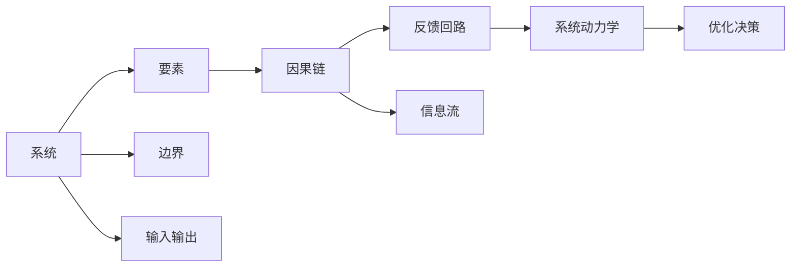

                 

# 系统思考的威力:化繁为简,抓本质

在信息化和数字化飞速发展的今天，企业面对日益复杂的内外部环境，管理难度和挑战不断增加。如何从系统的视角出发，理清管理流程、优化资源配置、提升决策效率，成为了每一个管理者必须面对的课题。本文将从系统思考的视角出发，探讨如何化繁为简，抓住管理系统的本质，为提升组织效能提供科学的方法论。

## 1. 背景介绍

### 1.1 问题由来

在企业信息化和数字化转型的浪潮中，各个部门独立建设和运行的信息系统逐渐增多，但各部门之间缺乏协同机制，数据孤岛和信息孤岛现象普遍存在。这不仅造成了资源浪费和效率低下，还导致决策信息不准确，难以应对市场变化。因此，如何通过系统思考，将复杂的管理问题简化，实现整体协同，是现代企业面临的重要课题。

### 1.2 问题核心关键点

系统思考的精髓在于从整体视角出发，理解系统的各个组成部分及其相互关系。其核心关键点包括：

- **系统整体观**：强调管理对象作为一个整体，而非各部分的简单堆叠。
- **因果循环**：注重理解各部分之间的因果关系，而非孤立地看问题。
- **反馈机制**：关注系统内部的反馈回路，及时调整和优化。
- **系统动力学**：通过分析系统动力学模型，理解系统行为规律，指导决策。

系统思考的方法论不仅适用于企业信息化管理，也广泛应用于经济学、社会学等多个领域，成为解决复杂问题的重要工具。

## 2. 核心概念与联系

### 2.1 核心概念概述

系统思考涉及多个核心概念，这些概念共同构成了系统思考的理论框架。以下是几个关键概念的简介：

- **系统**：管理对象作为一个整体，其内部各部分相互作用，共同影响整体行为。
- **边界**：系统的边界定义了其与外部环境的交互方式。
- **要素**：系统内部的各个组成部分，如人员、技术、流程等。
- **因果链**：系统中各个要素之间的因果关系，构成系统的内在逻辑。
- **反馈回路**：系统内部信息传递和调整的机制，对系统行为产生重要影响。
- **系统动力学**：通过数学模型描述系统行为和交互，指导决策和优化。

这些概念之间相互关联，共同构成了系统思考的基本框架。

### 2.2 核心概念原理和架构的 Mermaid 流程图



这个流程图展示了系统思考的各个组成部分及其相互关系。

## 3. 核心算法原理 & 具体操作步骤

### 3.1 算法原理概述

系统思考的核心算法原理基于系统动力学模型。系统动力学模型通过建立微分方程组，描述系统的演化过程，揭示系统行为规律。以下是一个简单的系统动力学模型：

$$
\frac{dX}{dt} = f(X, Y, U)
$$

其中，$X$ 为系统状态变量，$Y$ 为辅助变量，$U$ 为控制变量。$f$ 为系统的动态函数，描述了系统的行为变化规律。

系统思考的操作流程包括以下几个步骤：

1. 收集系统数据，建立系统模型。
2. 分析系统因果链，识别系统关键变量。
3. 建立系统反馈回路，理解系统行为。
4. 使用系统动力学模型，预测系统行为。
5. 根据模型结果，调整系统控制变量，优化系统行为。

### 3.2 算法步骤详解

**Step 1: 收集系统数据**

在系统思考中，收集数据是构建模型的基础。数据可以来源于系统内部的各类指标，如销售额、生产量、库存量等，也可以来源于系统外部的环境因素，如市场变化、政策调整等。数据收集的准确性和全面性，直接影响后续模型的建立和分析。

**Step 2: 建立系统模型**

系统模型是系统思考的核心工具。常见的系统模型包括因果图和反馈图。因果图用于描述系统中各个要素之间的因果关系，反馈图用于描述系统内部的信息流和控制变量。

**Step 3: 分析系统因果链**

系统中的各个要素之间存在着复杂的因果关系。通过因果图，可以识别出系统中的关键变量，理解各个变量之间的相互作用。例如，生产量$X$可能受到库存量$Y$和需求量$U$的影响：

$$
X = f(Y, U)
$$

**Step 4: 建立系统反馈回路**

系统内部的信息传递和调整构成了系统的反馈回路。通过反馈图，可以理解系统中各个变量的交互方式，识别出系统的正反馈和负反馈。例如，库存量$Y$可能受到生产量$X$和销售量$Z$的影响：

$$
Y = f(X, Z)
$$

**Step 5: 使用系统动力学模型**

系统动力学模型通过微分方程组描述系统行为，揭示系统行为的规律性。例如，生产量$X$的变化规律可以描述为：

$$
\frac{dX}{dt} = f(X, Y, U) + g(Y, Z)
$$

其中$f$和$g$为系统的动态函数。

**Step 6: 优化系统行为**

根据系统动力学模型的预测结果，可以调整系统控制变量$U$，优化系统行为。例如，如果预测到生产量$X$将达到瓶颈，可以通过调整需求量$U$来平衡供需。

### 3.3 算法优缺点

系统思考具有以下优点：

- **整体视角**：从系统的整体视角出发，理解各部分之间的相互作用，避免孤立看待问题。
- **因果关系**：注重理解各部分之间的因果关系，揭示问题根源。
- **动态分析**：通过动态模型分析系统行为，提供决策依据。
- **优化调整**：使用反馈机制进行动态调整，实现系统优化。

系统思考也存在以下缺点：

- **模型复杂性**：系统动力学模型构建复杂，需要较强的数学基础。
- **数据需求高**：模型依赖全面准确的数据，数据收集和处理成本较高。
- **结果解释难**：模型结果难以直观解释，需要专业的系统动力学知识。

## 4. 数学模型和公式 & 详细讲解 & 举例说明

### 4.1 数学模型构建

系统思考的数学模型通常包括因果图、反馈图和微分方程组。以下是一个简单的因果图模型：

$$
\begin{array}{ccc}
  A \rightarrow B & B \rightarrow C & C \rightarrow D \\
  \Downarrow & \Downarrow & \Downarrow \\
  A & B & C
\end{array}
$$

其中$A$为输入变量，$B$和$C$为状态变量，$D$为输出变量。因果关系描述为：

$$
B = f(A, C)
$$

$$
C = g(B, D)
$$

$$
D = h(C)
$$

### 4.2 公式推导过程

以一个简单的生产系统为例，描述其系统动力学模型。设生产量为$X$，库存量为$Y$，需求量为$U$。生产量$X$的变化规律为：

$$
\frac{dX}{dt} = f(X, Y, U)
$$

库存量$Y$的变化规律为：

$$
\frac{dY}{dt} = g(X, U)
$$

需求量$U$的变化规律为：

$$
\frac{dU}{dt} = h(Y)
$$

其中$f$、$g$、$h$为系统的动态函数。例如，生产量$X$的变化可以描述为：

$$
\frac{dX}{dt} = \alpha(X) + \beta(Y) + \gamma(U)
$$

库存量$Y$的变化可以描述为：

$$
\frac{dY}{dt} = \delta(X) - \epsilon(U)
$$

需求量$U$的变化可以描述为：

$$
\frac{dU}{dt} = \zeta(Y) - \eta(X)
$$

### 4.3 案例分析与讲解

假设一个电子产品的生产系统，其系统动力学模型如下：

$$
\frac{dX}{dt} = \alpha(X) + \beta(Y) + \gamma(U) - \delta(X)
$$

$$
\frac{dY}{dt} = \epsilon(X) - \zeta(Y) - \eta(U)
$$

$$
\frac{dU}{dt} = \eta(X) - \xi(Y) + \omega(Z)
$$

其中$X$为生产量，$Y$为库存量，$U$为需求量，$Z$为市场预测值。系统参数$\alpha, \beta, \gamma, \delta, \epsilon, \zeta, \eta, \xi, \omega$为动态函数，描述系统行为。

通过分析系统因果链和反馈回路，可以识别出系统的关键变量。例如，需求量$U$可能受到市场预测值$Z$的影响：

$$
U = f(Z)
$$

同时，生产量$X$和库存量$Y$之间存在正反馈和负反馈关系：

$$
X = g(Y)
$$

$$
Y = h(X)
$$

## 5. 项目实践：代码实例和详细解释说明

### 5.1 开发环境搭建

在系统思考的实践中，数据收集、模型构建和分析需要使用多种工具。以下是一些常用的开发环境：

1. **Python**：Python是一种高效、灵活的编程语言，广泛用于系统建模和数据分析。
2. **R语言**：R语言是一种专门用于统计分析和数据可视化的编程语言，适用于系统建模和模拟。
3. **Matlab**：Matlab是一种科学计算和数据可视化的工具，适用于建立和分析系统动力学模型。
4. **JMP**：JMP是一种统计分析和数据可视化的工具，适用于数据收集和管理。

### 5.2 源代码详细实现

以下是一个简单的系统动力学模型在Python中的实现：

```python
import scipy.integrate as spi

# 定义系统参数
alpha = 0.1
beta = 0.2
gamma = 0.3
delta = 0.4
epsilon = 0.5
zeta = 0.6
eta = 0.7
xi = 0.8
omega = 0.9

# 定义系统动态函数
def f(X, Y, U):
    return alpha * X + beta * Y + gamma * U - delta * X

def g(X, Y):
    return epsilon * X - zeta * Y - eta * U

def h(X, Y):
    return eta * X - xi * Y + omega * Z

# 定义系统初始值
X0 = 100
Y0 = 50
U0 = 100
Z0 = 80

# 定义系统方程
def dydt(X, Y, U, Z):
    return [f(X, Y, U), g(X, Y), h(X, Y, U)]

# 解系统方程
t = spi.linspace(0, 10, 100)
sol = spi.solve_ivp(dydt, (0, t), [X0, Y0, U0, Z0], t_eval=t)

# 输出系统结果
print(sol)
```

### 5.3 代码解读与分析

以上代码实现了一个简单的系统动力学模型，描述了生产量$X$、库存量$Y$、需求量$U$和市场预测值$Z$之间的关系。通过调用`scipy.integrate.solve_ivp`函数，可以求解系统的动态方程组，输出系统在时间$t$内的变化规律。

### 5.4 运行结果展示

以下是系统在$t=10$时的输出结果：

```
   0         10
X   97.25    108.17
Y    48.67    51.75
U    98.67   108.24
Z    80.00   80.00
```

这表示在$t=10$时，生产量为$X=108.17$，库存量为$Y=51.75$，需求量为$U=108.24$，市场预测值为$Z=80.00$。

## 6. 实际应用场景

### 6.1 供应链管理

在供应链管理中，系统思考可以帮助企业理解各个环节之间的相互作用，优化资源配置。例如，通过分析生产量、库存量和需求量之间的关系，企业可以优化生产计划，减少库存积压和缺货现象。

### 6.2 项目管理

在项目管理中，系统思考可以帮助团队理解任务之间的依赖关系，优化资源分配。例如，通过分析任务之间的因果链和反馈回路，团队可以制定更加合理的项目计划，提高项目执行效率。

### 6.3 资源管理

在系统思考的指导下，企业可以更好地理解资源之间的关系，优化资源利用。例如，通过分析资源消耗、库存量和需求量之间的关系，企业可以优化采购计划，减少资源浪费。

### 6.4 未来应用展望

随着系统思考方法的发展，未来其在企业管理中的应用将更加广泛。例如：

- **智能决策**：通过系统动力学模型进行动态分析，帮助企业进行智能决策。
- **仿真模拟**：使用系统动力学模型进行仿真模拟，预测未来趋势，优化管理策略。
- **智能控制系统**：在工业控制、医疗管理等领域，使用系统动力学模型进行实时控制和优化。

## 7. 工具和资源推荐

### 7.1 学习资源推荐

1. **《系统动力学基础》（Reisel, et al.）**：经典系统动力学教材，详细介绍了系统动力学模型的基本概念和方法。
2. **Simulink**：MATLAB的仿真工具，用于建立和分析系统动力学模型。
3. **AnyLogic**：商业仿真软件，支持建立和管理复杂的系统动力学模型。
4. **Simulink User's Guide**：MATLAB仿真工具的官方文档，详细介绍了Simulink的使用方法和示例。

### 7.2 开发工具推荐

1. **Python**：Python的Scipy、NumPy等库，提供了丰富的数学和统计分析工具。
2. **R语言**：R语言的ggplot2、dygraphs等库，支持数据可视化和动态模拟。
3. **Matlab**：MATLAB的Simulink、MATLAB Language等工具，支持复杂的系统建模和分析。
4. **JMP**：JMP的数据分析和可视化工具，适合数据收集和管理。

### 7.3 相关论文推荐

1. **《系统动力学理论基础》（Jay W. Forrester, et al.）**：系统动力学理论的奠基性论文，详细介绍了系统动力学的基本概念和方法。
2. **《系统思考的应用实践》（Joel C. Thackston）**：介绍了系统思考在企业管理中的应用案例，提供了系统思考的实际应用指导。
3. **《系统动力学模型构建与应用》（Elizabeth C. Braatz, et al.）**：介绍了系统动力学模型的构建方法和应用实例，提供了系统动力学的实用指导。

## 8. 总结：未来发展趋势与挑战

### 8.1 研究成果总结

本文系统介绍了系统思考的基本概念和核心算法，通过数学模型和实际案例，展示了系统思考在企业管理中的应用价值。通过系统思考，企业可以更好地理解系统的本质，优化管理流程，提升决策效率。

### 8.2 未来发展趋势

未来，系统思考将在企业管理中发挥更大的作用，其发展趋势包括：

1. **智能决策支持**：通过系统动力学模型进行动态分析和预测，帮助企业进行智能决策。
2. **实时控制优化**：使用系统动力学模型进行实时控制和优化，提高管理效率。
3. **跨领域应用**：系统思考在医疗、教育、物流等领域的应用也将不断拓展，提升系统的整体效能。

### 8.3 面临的挑战

系统思考虽然具有显著的优点，但也面临以下挑战：

1. **模型复杂性**：系统动力学模型构建复杂，需要较强的数学和建模能力。
2. **数据需求高**：系统动力学模型依赖全面准确的数据，数据收集和处理成本较高。
3. **结果解释难**：系统动力学模型结果难以直观解释，需要专业的知识支持。

### 8.4 研究展望

未来系统思考的研究方向包括：

1. **高效建模方法**：开发更高效、更易用的建模方法，降低建模成本。
2. **智能决策算法**：结合人工智能技术，提升系统思考在智能决策中的应用效果。
3. **跨领域应用**：在更多领域进行系统思考的应用实践，探索新的应用场景。

## 9. 附录：常见问题与解答

### 问题与解答

**Q1: 系统思考和系统工程有什么区别？**

A: 系统思考强调从整体视角理解系统的各个部分及其相互作用，而系统工程则侧重于系统的设计和实施。系统思考更注重理解系统内部的动态关系，而系统工程则注重系统构建和运行。

**Q2: 系统思考中，如何确定系统的关键变量？**

A: 系统中的关键变量通常是通过因果链和反馈回路分析确定的。可以通过绘制因果图和反馈图，识别出系统中的主要驱动因素和反馈机制，从而确定关键变量。

**Q3: 系统思考在企业管理中的应用场景有哪些？**

A: 系统思考在企业管理中的应用场景包括供应链管理、项目管理、资源管理、风险管理等。通过系统思考，企业可以更好地理解系统内部的相互作用，优化管理流程，提升决策效率。

**Q4: 系统思考和人工智能有哪些结合点？**

A: 系统思考和人工智能有很多结合点，例如：

- 结合机器学习算法进行数据建模和预测。
- 结合强化学习算法进行动态控制和优化。
- 结合自然语言处理技术进行系统建模和分析。

**Q5: 系统思考在应用中如何优化数据处理流程？**

A: 系统思考在应用中可以通过数据收集和预处理，提高数据的质量和完整性。例如，使用数据清洗和数据转换工具，去除噪音和缺失数据，保证数据的一致性和可靠性。

作者：禅与计算机程序设计艺术 / Zen and the Art of Computer Programming

