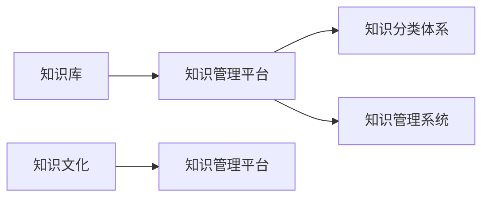

                 

# 经典书籍:管理者构建知识体系的基石

在现代企业管理中，构建一个完整、系统的知识体系是每一位管理者的核心任务。一个有效的知识体系不仅能帮助企业高效运作，还能为员工提供指导，提升企业整体竞争力。本文旨在介绍如何通过构建知识体系来提升企业运营效率和员工能力，从理论到实践，全面深入探讨管理者构建知识体系的基石。

## 1. 背景介绍

### 1.1 问题由来

随着企业的不断发展壮大，管理的复杂度日益增加。信息过载、决策困难、执行偏差等问题变得愈发严重。管理者迫切需要一个有效的知识体系，以确保信息的及时传递和应用，提升决策和执行的精准性。

### 1.2 问题核心关键点

- **知识体系构建**：将零散的知识系统化、结构化，形成易查询、易应用的知识框架。
- **知识管理**：通过有效的知识管理工具，实现知识的收集、存储、共享与重用。
- **知识培训**：定期组织员工培训，提升其业务技能和问题解决能力。
- **知识文化**：营造良好的知识共享氛围，鼓励员工交流与合作。

### 1.3 问题研究意义

构建知识体系对于提升企业运营效率、增强团队协作和提升员工能力具有重要意义：

- **提高运营效率**：通过知识体系，快速获取所需信息，减少信息处理时间。
- **增强团队协作**：知识共享促进信息透明，减少沟通障碍。
- **提升员工能力**：定期培训和知识共享，持续提升员工素质。
- **优化决策支持**：以数据和经验为基础的决策更具科学性和可行性。

## 2. 核心概念与联系

### 2.1 核心概念概述

构建知识体系需要涉及多个核心概念：

- **知识库**：存储和管理知识的中央数据库，提供信息检索和共享。
- **知识管理平台**：集成知识库的高级系统，支持知识编辑、分类、搜索等功能。
- **知识分类体系**：对知识进行分类组织，便于查询和应用。
- **知识管理系统**：管理知识库和知识管理平台，实现知识流监控和优化。
- **知识文化**：企业文化的一部分，涉及知识共享、学习和创新。

这些核心概念之间相互关联，共同构成了知识体系的完整框架。

### 2.2 核心概念原理和架构的 Mermaid 流程图



此流程图展示了知识体系构建的基本流程：

1. 知识库存储和管理知识，是知识体系的基础。
2. 知识管理平台集成知识库，提供高级功能，如编辑、分类和搜索。
3. 知识分类体系帮助知识组织和检索。
4. 知识管理系统监控和优化知识流动。
5. 知识文化促进知识共享和创新。

## 3. 核心算法原理 & 具体操作步骤

### 3.1 算法原理概述

构建知识体系主要遵循以下算法原理：

- **数据建模**：通过结构化数据模型表示知识体系，使知识易于存储和检索。
- **分类与组织**：对知识进行分类和层次化组织，便于信息查询。
- **检索与匹配**：设计高效检索算法，快速定位所需信息。
- **知识链接**：实现不同知识之间的关联，提供更深层次的查询和分析。

### 3.2 算法步骤详解

构建知识体系的主要步骤包括：

1. **需求分析**：明确企业知识管理的目标和需求，设计知识分类体系。
2. **知识收集**：收集企业内部的文档、培训资料、经验总结等，形成初步的知识库。
3. **知识分类**：根据需求分析，对知识进行分类和层次化组织，建立分类体系。
4. **知识存储**：使用知识管理平台存储和管理知识，实现高效检索和共享。
5. **知识应用**：通过培训和指导，将知识应用到实际工作中。
6. **系统优化**：根据使用反馈，持续优化知识体系，提高其适用性和效率。

### 3.3 算法优缺点

构建知识体系的算法具有以下优点：

- **系统化管理**：提升知识管理效率，减少信息丢失和冗余。
- **高效检索**：快速定位所需信息，提升决策和执行速度。
- **知识共享**：促进信息透明，增强团队协作。
- **持续改进**：根据反馈不断优化，提升知识体系的实用性。

其缺点包括：

- **初期投入高**：需要大量时间和资源进行需求分析和知识收集。
- **数据量大**：知识库的建设和维护需要处理大量数据。
- **更新维护难**：随着企业发展，知识库需定期更新和维护。

### 3.4 算法应用领域

构建知识体系的应用领域广泛，涵盖多个行业：

- **制造行业**：通过生产工艺、设备维护等知识库，提升生产效率和设备运行稳定性。
- **金融行业**：构建市场分析、风险控制等知识体系，辅助投资决策。
- **医疗行业**：建立病例分析、诊疗指南等知识库，提高诊疗水平和患者满意度。
- **教育行业**：构建课程设计、教学方法等知识体系，提升教学质量和学生成绩。
- **科技行业**：构建技术文档、产品开发等知识体系，推动产品创新和研发效率。

## 4. 数学模型和公式 & 详细讲解 & 举例说明

### 4.1 数学模型构建

构建知识体系的数学模型主要基于以下几个要素：

- **实体-关系模型**：用图形结构表示知识体系中的实体和关系。
- **基于规则的推理**：使用逻辑推理规则，从已知知识推导出新知识。
- **模糊集合**：用于处理不完全或不精确的知识，提升知识体系的适应性。

### 4.2 公式推导过程

以一个简单的知识体系为例，构建其数学模型：

假设知识体系中的实体集合为 $E$，关系集合为 $R$，则知识体系可以用有向图 $G=(E,R)$ 表示。

其中，$E$ 中的每个节点表示一个知识实体，$R$ 中的每条边表示实体间的关系。例如，生产工艺知识库可以表示为：

```
E = {工艺1, 工艺2, 材料1, 材料2}
R = {采用, 使用}
G = (E, R)
```

其中，工艺1和工艺2通过“采用”关系相关联，表示工艺1采用了材料1。

### 4.3 案例分析与讲解

以一个制造企业为例，展示如何构建知识体系。

1. **需求分析**：明确生产流程、设备维护、质量控制等方面的知识需求。
2. **知识收集**：收集生产图纸、设备说明书、质量手册等文档，形成初步知识库。
3. **知识分类**：将知识分为生产流程、设备维护、质量控制、技术支持等类别。
4. **知识存储**：使用知识管理平台存储知识，建立分类体系，支持快速检索和共享。
5. **知识应用**：通过培训和指导，使员工掌握所需知识，提升工作质量。
6. **系统优化**：根据使用反馈，不断优化知识体系，提高其适应性和实用性。

## 5. 项目实践：代码实例和详细解释说明

### 5.1 开发环境搭建

搭建一个知识管理系统的开发环境需要以下步骤：

1. **选择技术栈**：选择合适的编程语言和技术框架，如Python、Django、Flask等。
2. **安装依赖**：使用pip安装必要的第三方库，如Django、SQLAlchemy、Flask-SQLAlchemy等。
3. **数据库配置**：配置数据库连接，如MySQL、PostgreSQL等。
4. **环境搭建**：搭建开发环境，包括开发机器、服务器、测试环境等。

### 5.2 源代码详细实现

以下是一个简单的知识管理系统的实现示例：

```python
# 导入必要的库
from django.db import models

# 定义知识模型
class Knowledge(models.Model):
    title = models.CharField(max_length=255)
    content = models.TextField()
    category = models.CharField(max_length=255)

# 定义知识分类模型
class Category(models.Model):
    name = models.CharField(max_length=255)

# 定义文章和分类关系模型
class ArticleCategory(models.Model):
    article = models.ForeignKey(Knowledge, on_delete=models.CASCADE)
    category = models.ForeignKey(Category, on_delete=models.CASCADE)
```

### 5.3 代码解读与分析

- **知识模型**：定义了知识的基本信息，包括标题、内容和分类。
- **知识分类模型**：定义了知识的分类信息。
- **文章和分类关系模型**：建立了知识与分类的关系。

## 6. 实际应用场景

### 6.1 制造业

在制造业中，通过构建知识库，可以快速获取工艺流程、设备维护等信息，提升生产效率和设备运行稳定性。

### 6.2 金融业

金融行业通过构建市场分析、风险控制等知识体系，辅助投资决策，提升投资收益和风险控制能力。

### 6.3 医疗行业

医疗行业构建病例分析、诊疗指南等知识体系，提高诊疗水平和患者满意度，优化医疗服务流程。

### 6.4 教育行业

教育行业构建课程设计、教学方法等知识体系，提升教学质量和学生成绩，推动教育创新。

## 7. 工具和资源推荐

### 7.1 学习资源推荐

- **《知识管理与组织》**：该书深入浅出地介绍了知识管理的基本理论和实践，是知识管理领域的经典之作。
- **《企业知识管理》**：该书介绍了企业知识管理的具体实践和案例，适合实际应用。
- **《知识共享》**：该书探讨了知识共享的策略和方法，适合管理者学习。
- **《知识创新》**：该书介绍了知识创新的方法和工具，适合创新型企业管理者。

### 7.2 开发工具推荐

- **Django**：强大的Web开发框架，适合快速构建知识管理系统。
- **Flask**：轻量级Web开发框架，适合快速原型设计和知识库管理。
- **MySQL**：常用的关系型数据库，适合存储结构化数据。
- **Redis**：高性能内存数据库，适合快速读取和存储数据。

### 7.3 相关论文推荐

- **《知识管理与组织：理论与实践》**：介绍了知识管理的理论基础和实际应用。
- **《基于Web的知识管理系统的设计与实现》**：介绍了知识管理系统的设计思路和实现方法。
- **《企业知识管理的策略与技术》**：探讨了企业知识管理的策略和技术。

## 8. 总结：未来发展趋势与挑战

### 8.1 研究成果总结

本文介绍了构建知识体系的基本原理、操作步骤和应用场景，通过理论到实践的全面分析，帮助管理者构建高效的知识体系。

### 8.2 未来发展趋势

知识体系构建的未来趋势包括：

- **智能化**：引入人工智能技术，提升知识推理和决策能力。
- **可视化**：使用图表、仪表盘等可视化工具，提升知识展示效果。
- **协作化**：支持多用户协作编辑和共享，提升知识管理效率。
- **移动化**：支持移动端访问和编辑，提升信息获取便捷性。
- **生态化**：与其他系统集成，实现知识生态化管理。

### 8.3 面临的挑战

构建知识体系面临的挑战包括：

- **数据整合难度**：不同系统之间的数据整合难度大，需要统一的接口和标准。
- **知识更新频率**：知识体系需要定期更新，以反映最新的业务和技术变化。
- **用户接受度**：员工对新系统的适应和接受需要时间，需要进行培训和引导。
- **安全性与隐私**：知识体系中的数据涉及敏感信息，需要确保数据安全和隐私保护。
- **系统复杂性**：知识体系构建的系统复杂，需要专业的技术支持和维护。

### 8.4 研究展望

未来知识体系构建的研究方向包括：

- **AI技术引入**：引入AI技术提升知识推理和决策能力。
- **知识自动化**：使用自动化工具，减少人工干预和提高效率。
- **知识生态构建**：构建知识生态系统，促进知识共享和创新。
- **知识嵌入**：将知识嵌入到业务流程中，实现知识驱动的业务优化。

## 9. 附录：常见问题与解答

**Q1：如何选择合适的知识管理工具？**

A: 选择合适的知识管理工具需要考虑企业的规模、业务特点和需求，常见的工具包括Django、Flask、MySQL等。

**Q2：知识体系如何与业务系统集成？**

A: 知识体系需要与其他系统集成，以实现数据共享和业务驱动。可以使用API接口、消息队列等技术进行集成。

**Q3：知识体系如何保持最新？**

A: 定期更新和维护知识体系，及时反映业务和技术变化。可以通过自动化工具和技术支持，提高知识更新的效率和准确性。

**Q4：如何提升知识共享和协作？**

A: 营造良好的知识共享氛围，通过培训和引导，鼓励员工交流与合作。使用协作工具，如Confluence、Slack等，提升知识共享效率。

**Q5：知识体系如何确保安全性与隐私保护？**

A: 设计严密的安全机制，确保知识体系中的数据安全和隐私保护。使用数据加密、访问控制等技术，防范潜在风险。

---

作者：禅与计算机程序设计艺术 / Zen and the Art of Computer Programming

