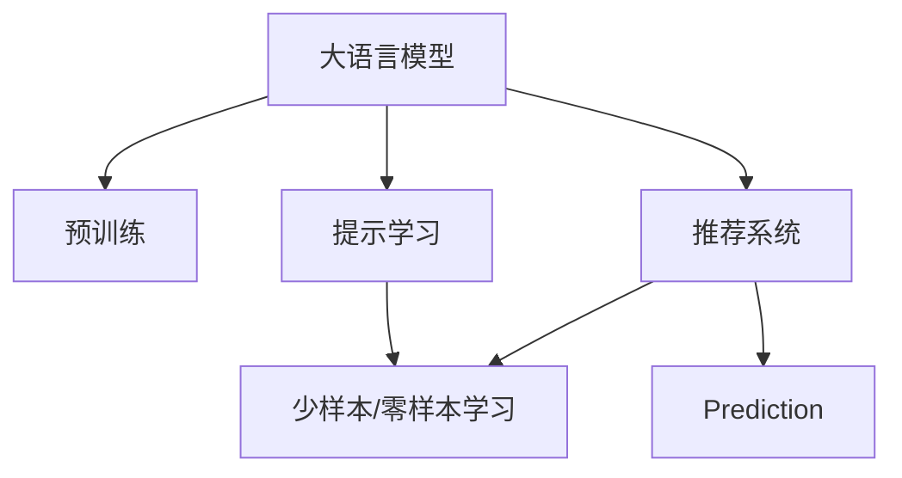

                 

# 统一的大模型推荐范式P5:预训练、提示、预测

> 关键词：大语言模型，推荐系统，预训练，提示学习，预测，统一范式

## 1. 背景介绍

### 1.1 问题由来

推荐系统是人工智能在实际应用中的重要领域，广泛应用在电子商务、社交网络、视频媒体等各行各业。传统推荐系统主要依靠用户的历史行为数据进行推荐，难以应对长尾物品和冷启动问题。而随着深度学习技术的发展，基于大语言模型的推荐系统正在逐步崭露头角。

大语言模型通过在大规模无标签文本数据上进行预训练，学习到丰富的语言知识和常识，具备强大的自然语言理解和生成能力。利用大语言模型的预训练特征，结合少量有标签数据进行微调，可以构建性能更好的推荐系统，解决推荐系统的冷启动和长尾物品推荐难题。

### 1.2 问题核心关键点

当前，大语言模型推荐系统的发展主要依赖于微调方法。其核心在于如何高效利用预训练语言模型，提取用户和物品的语义特征，同时结合用户的少量有标签数据进行微调，以提升推荐效果。以下是几个关键点：

- 预训练：使用大规模无标签文本数据进行预训练，学习语言模型的一般性知识。
- 提示学习(Prompt Learning)：设计巧妙的提示模板，使大语言模型能够快速适应特定任务，提升少样本推荐能力。
- 预测(Prediction)：使用微调后的语言模型对用户和物品进行特征提取和评分计算，进行推荐。

这些关键点共同构成了大语言模型推荐系统的主流范式，通过系统化、模块化的流程实现，可以最大化发挥大语言模型的潜力和优势。

### 1.3 问题研究意义

基于大语言模型的推荐系统，能够充分利用其语言表示能力，通过深度理解用户和物品的语义，提升推荐精度和覆盖率。这对优化用户体验、增加转化率、降低获客成本等具有重要意义：

1. 提升用户体验：通过个性化推荐，提高用户满意度和粘性，增强用户忠诚度。
2. 增加转化率：精准推荐使消费者更容易找到感兴趣的商品，提高购买决策率。
3. 降低获客成本：有效利用用户少量行为数据，减少对昂贵的点击率等数据的依赖。
4. 提供多样化选择：大语言模型具备生成新文本的能力，可以不断丰富推荐内容，提升推荐的多样性和新颖性。
5. 促进产品创新：通过深度挖掘用户需求和兴趣，提供更加精准的产品推荐，促进产品的持续创新和迭代。

通过引入大语言模型推荐系统，将显著提升推荐系统的性能和应用范围，为各行各业的智能化转型提供新的技术路径。

## 2. 核心概念与联系

### 2.1 核心概念概述

为更好地理解基于大语言模型的推荐系统，本节将介绍几个密切相关的核心概念：

- 大语言模型(Large Language Model, LLM)：以自回归(如GPT)或自编码(如BERT)模型为代表的大规模预训练语言模型。通过在大规模无标签文本语料上进行预训练，学习通用的语言表示，具备强大的语言理解和生成能力。

- 预训练(Pre-training)：指在大规模无标签文本语料上，通过自监督学习任务训练通用语言模型的过程。常见的预训练任务包括言语建模、遮挡语言模型等。预训练使得模型学习到语言的通用表示。

- 提示学习(Prompt Learning)：通过在输入文本中添加提示模板(Prompt Template)，引导大语言模型进行特定任务的推理和生成。可以在不更新模型参数的情况下，实现少样本或零样本学习。

- 推荐系统(Recommendation System)：通过分析用户历史行为数据、物品属性等，为用户推荐符合其兴趣和需求的物品的系统。

- 预测(Prediction)：使用训练好的模型对输入数据进行预测，通常包括回归、分类等任务。

这些核心概念之间的逻辑关系可以通过以下Mermaid流程图来展示：



这个流程图展示了大语言模型的核心概念及其之间的关系：

1. 大语言模型通过预训练获得基础能力。
2. 提示学习是一种不更新模型参数的方法，可以在少样本或零样本条件下进行任务学习。
3. 推荐系统使用大语言模型生成的语义特征，结合用户的少量有标签数据进行微调，从而提升推荐效果。
4. 预测是通过微调后的模型对用户和物品进行特征提取和评分计算，进行推荐。

这些概念共同构成了大语言模型推荐系统的工作框架，使其能够在各种推荐任务中发挥强大的语言理解和生成能力。通过理解这些核心概念，我们可以更好地把握大语言模型推荐系统的基本原理和优化方向。

## 3. 核心算法原理 & 具体操作步骤
### 3.1 算法原理概述

基于大语言模型的推荐系统，本质上是一个有监督的推荐范式。其核心思想是：利用大语言模型的预训练特征，提取用户和物品的语义表示，结合少量有标签数据进行微调，使模型能够预测用户对物品的评分，从而进行个性化推荐。

形式化地，假设大语言模型为 $M_{\theta}$，其中 $\theta$ 为预训练得到的模型参数。给定推荐任务 $T$ 的用户行为数据集 $D=\{(x_i, r_i)\}_{i=1}^N, x_i \in \mathcal{X}, r_i \in [0,1]$，推荐任务的目标是找到新的模型参数 $\hat{\theta}$，使得：

$$
\hat{\theta}=\mathop{\arg\min}_{\theta} \mathcal{L}(M_{\theta},D)
$$

其中 $\mathcal{L}$ 为针对任务 $T$ 设计的损失函数，用于衡量模型预测评分与真实评分之间的差异。常见的损失函数包括平均绝对误差、均方误差、对数损失等。

通过梯度下降等优化算法，微调过程不断更新模型参数 $\theta$，最小化损失函数 $\mathcal{L}$，使得模型预测评分逼近真实评分。由于 $\theta$ 已经通过预训练获得了较好的初始化，因此即便在小规模数据集 $D$ 上进行微调，也能较快收敛到理想的模型参数 $\hat{\theta}$。

### 3.2 算法步骤详解

基于大语言模型的推荐系统一般包括以下几个关键步骤：

**Step 1: 准备预训练模型和数据集**
- 选择合适的预训练语言模型 $M_{\theta}$ 作为初始化参数，如 BERT、GPT 等。
- 准备推荐任务 $T$ 的用户行为数据集 $D$，划分为训练集、验证集和测试集。一般要求数据与预训练数据的分布不要差异过大。

**Step 2: 设计任务适配层**
- 根据推荐任务类型，在预训练模型顶层设计合适的输出层和损失函数。
- 对于评分预测任务，通常在顶层添加线性分类器和对数损失函数。
- 对于排序推荐任务，通常使用二分类交叉熵损失函数。

**Step 3: 设置微调超参数**
- 选择合适的优化算法及其参数，如 AdamW、SGD 等，设置学习率、批大小、迭代轮数等。
- 设置正则化技术及强度，包括权重衰减、Dropout、Early Stopping 等。
- 确定冻结预训练参数的策略，如仅微调顶层，或全部参数都参与微调。

**Step 4: 执行梯度训练**
- 将训练集数据分批次输入模型，前向传播计算损失函数。
- 反向传播计算参数梯度，根据设定的优化算法和学习率更新模型参数。
- 周期性在验证集上评估模型性能，根据性能指标决定是否触发 Early Stopping。
- 重复上述步骤直到满足预设的迭代轮数或 Early Stopping 条件。

**Step 5: 测试和部署**
- 在测试集上评估微调后模型 $M_{\hat{\theta}}$ 的性能，对比微调前后的推荐精度提升。
- 使用微调后的模型对新用户进行推荐预测，集成到实际的应用系统中。
- 持续收集新的数据，定期重新微调模型，以适应数据分布的变化。

以上是基于大语言模型推荐系统的一般流程。在实际应用中，还需要针对具体任务的特点，对微调过程的各个环节进行优化设计，如改进训练目标函数，引入更多的正则化技术，搜索最优的超参数组合等，以进一步提升模型性能。

### 3.3 算法优缺点

基于大语言模型的推荐系统具有以下优点：

- 预训练特征丰富：大语言模型预训练过程中学习到的语义表示能力强大，能够提升推荐系统的精度和多样性。
- 通用性：适用于各种推荐任务，如评分预测、排序推荐、兴趣点推荐等，设计简单的任务适配层即可实现微调。
- 参数高效：利用参数高效微调技术，在固定大部分预训练参数的情况下，仍可取得不错的推荐效果。
- 效果显著：在学术界和工业界的诸多推荐任务上，基于微调的方法已经刷新了最先进的性能指标。

同时，该方法也存在一定的局限性：

- 依赖标注数据：微调的效果很大程度上取决于标注数据的质量和数量，获取高质量标注数据的成本较高。
- 迁移能力有限：当目标任务与预训练数据的分布差异较大时，微调的性能提升有限。
- 负面效果传递：预训练模型的固有偏见、有害信息等，可能通过微调传递到下游任务，造成负面影响。
- 可解释性不足：微调模型的决策过程通常缺乏可解释性，难以对其推理逻辑进行分析和调试。

尽管存在这些局限性，但就目前而言，基于大语言模型的推荐方法仍是大规模推荐系统的有效手段。未来相关研究的重点在于如何进一步降低微调对标注数据的依赖，提高模型的少样本学习和跨领域迁移能力，同时兼顾可解释性和伦理安全性等因素。

### 3.4 算法应用领域

基于大语言模型的推荐系统已经在电商推荐、社交媒体、视频推荐等多个领域得到了广泛的应用，覆盖了几乎所有常见推荐任务，例如：

- 评分预测：如电商商品评分预测，根据用户行为数据预测用户对商品的高低评分。
- 排序推荐：如电商商品排序推荐，根据用户行为数据推荐符合其兴趣的商品列表。
- 兴趣点推荐：如旅游兴趣点推荐，根据用户历史访问记录推荐旅游目的地。
- 内容推荐：如视频推荐，根据用户历史观看记录推荐视频内容。
- 商品搭配推荐：如服装搭配推荐，根据用户历史购买记录推荐商品搭配。

除了上述这些经典任务外，大语言模型推荐系统还被创新性地应用到更多场景中，如音乐推荐、新闻推荐、知识图谱推荐等，为推荐系统带来了全新的突破。随着预训练模型和推荐方法的不断进步，相信推荐系统必将在更广阔的应用领域大放异彩。

## 4. 数学模型和公式 & 详细讲解 & 举例说明
### 4.1 数学模型构建

本节将使用数学语言对基于大语言模型的推荐系统进行更加严格的刻画。

记推荐系统为 $T=\{U, I\}$，其中 $U$ 为用户集，$I$ 为物品集。假设模型 $M_{\theta}$ 在用户 $u$ 的物品 $i$ 的评分预测为 $f_{\theta}(u, i)$，其中 $u \in U, i \in I$。

定义模型 $M_{\theta}$ 在用户 $u$ 的物品 $i$ 的评分预测 $f_{\theta}(u, i)$ 的损失函数为 $\ell(M_{\theta}(u, i), r_i)$，则在用户行为数据集 $D=\{(x_i, r_i)\}_{i=1}^N$ 上的经验风险为：

$$
\mathcal{L}(\theta) = \frac{1}{N}\sum_{i=1}^N \ell(M_{\theta}(u_i, i_i), r_i)
$$

其中 $x_i = (u_i, i_i)$ 表示用户 $u_i$ 对物品 $i_i$ 的行为记录。

微调的优化目标是最小化经验风险，即找到最优参数：

$$
\theta^* = \mathop{\arg\min}_{\theta} \mathcal{L}(\theta)
$$

在实践中，我们通常使用基于梯度的优化算法（如SGD、Adam等）来近似求解上述最优化问题。设 $\eta$ 为学习率，$\lambda$ 为正则化系数，则参数的更新公式为：

$$
\theta \leftarrow \theta - \eta \nabla_{\theta}\mathcal{L}(\theta) - \eta\lambda\theta
$$

其中 $\nabla_{\theta}\mathcal{L}(\theta)$ 为损失函数对参数 $\theta$ 的梯度，可通过反向传播算法高效计算。

### 4.2 公式推导过程

以下我们以评分预测任务为例，推导对数损失函数及其梯度的计算公式。

假设模型 $M_{\theta}$ 在输入 $(u, i)$ 上的输出为 $\hat{r}_{\theta}(u, i) \in [0,1]$，表示用户 $u$ 对物品 $i$ 的预测评分。真实评分 $r_i \in [0,1]$。则对数损失函数定义为：

$$
\ell(M_{\theta}(u, i), r_i) = -r_i\log \hat{r}_{\theta}(u, i) - (1-r_i)\log (1-\hat{r}_{\theta}(u, i))
$$

将其代入经验风险公式，得：

$$
\mathcal{L}(\theta) = -\frac{1}{N}\sum_{i=1}^N [r_i\log \hat{r}_{\theta}(u_i, i_i)+(1-r_i)\log(1-\hat{r}_{\theta}(u_i, i_i))]
$$

根据链式法则，损失函数对参数 $\theta_k$ 的梯度为：

$$
\frac{\partial \mathcal{L}(\theta)}{\partial \theta_k} = -\frac{1}{N}\sum_{i=1}^N (\frac{r_i}{\hat{r}_{\theta}(u_i, i_i)}-\frac{1-r_i}{1-\hat{r}_{\theta}(u_i, i_i)}) \frac{\partial \hat{r}_{\theta}(u_i, i_i)}{\partial \theta_k}
$$

其中 $\frac{\partial \hat{r}_{\theta}(u_i, i_i)}{\partial \theta_k}$ 可进一步递归展开，利用自动微分技术完成计算。

在得到损失函数的梯度后，即可带入参数更新公式，完成模型的迭代优化。重复上述过程直至收敛，最终得到适应推荐任务的最优模型参数 $\theta^*$。

### 4.3 案例分析与讲解

以下以一个具体的推荐系统案例进行详细讲解。

假设我们要构建一个电商商品的评分预测推荐系统。首先，需要收集用户 $u$ 对物品 $i$ 的历史行为数据，如浏览、点击、购买等。这些数据可以转换为一个用户物品交互矩阵 $M$，其中 $M_{ui} = 1$ 表示用户 $u$ 对物品 $i$ 有交互，否则为 $0$。

然后，使用一个包含所有用户 $U$ 和物品 $I$ 的语料库进行预训练。假设使用BERT模型，利用其在电商文本语料上的预训练特征，作为大语言模型的输入。同时，将用户物品交互矩阵 $M$ 中的数值作为监督信号，在预训练的基础上进行微调。

微调过程如下：
1. 对用户 $u$ 的物品 $i$ 的评分预测 $f_{\theta}(u, i)$ 进行模型定义，使用BERT的预训练特征作为输入，添加一个线性层进行评分预测。
2. 定义对数损失函数 $\ell(M_{\theta}(u, i), r_i)$ 作为模型的损失函数。
3. 使用AdamW优化器进行梯度训练，通过反向传播更新模型参数。
4. 在验证集上评估模型性能，确定最优超参数组合。
5. 在测试集上评估微调后模型 $M_{\hat{\theta}}$ 的评分预测精度。

通过这种基于大语言模型的推荐系统构建流程，可以充分利用大模型的预训练特征，提升推荐系统的精度和效果。同时，由于大模型具备丰富的语义表示能力，还可以进一步探索提示学习、对抗训练等技术，增强推荐系统的效果和鲁棒性。

## 5. 项目实践：代码实例和详细解释说明
### 5.1 开发环境搭建

在进行推荐系统开发前，我们需要准备好开发环境。以下是使用Python进行PyTorch开发的环境配置流程：

1. 安装Anaconda：从官网下载并安装Anaconda，用于创建独立的Python环境。

2. 创建并激活虚拟环境：
```bash
conda create -n pytorch-env python=3.8 
conda activate pytorch-env
```

3. 安装PyTorch：根据CUDA版本，从官网获取对应的安装命令。例如：
```bash
conda install pytorch torchvision torchaudio cudatoolkit=11.1 -c pytorch -c conda-forge
```

4. 安装Transformers库：
```bash
pip install transformers
```

5. 安装各类工具包：
```bash
pip install numpy pandas scikit-learn matplotlib tqdm jupyter notebook ipython
```

完成上述步骤后，即可在`pytorch-env`环境中开始推荐系统开发。

### 5.2 源代码详细实现

下面以评分预测任务为例，给出使用Transformers库对BERT模型进行微调的PyTorch代码实现。

首先，定义评分预测任务的数据处理函数：

```python
from transformers import BertTokenizer
from torch.utils.data import Dataset
import torch

class RatingDataset(Dataset):
    def __init__(self, texts, ratings, tokenizer, max_len=128):
        self.texts = texts
        self.ratings = ratings
        self.tokenizer = tokenizer
        self.max_len = max_len
        
    def __len__(self):
        return len(self.texts)
    
    def __getitem__(self, item):
        text = self.texts[item]
        rating = self.ratings[item]
        
        encoding = self.tokenizer(text, return_tensors='pt', max_length=self.max_len, padding='max_length', truncation=True)
        input_ids = encoding['input_ids'][0]
        attention_mask = encoding['attention_mask'][0]
        
        # 对标签进行编码
        encoded_ratings = [rating] * self.max_len
        labels = torch.tensor(encoded_ratings, dtype=torch.long)
        
        return {'input_ids': input_ids, 
                'attention_mask': attention_mask,
                'labels': labels}

# 标签与id的映射
tag2id = {'O': 0, 'B-PER': 1, 'I-PER': 2, 'B-ORG': 3, 'I-ORG': 4, 'B-LOC': 5, 'I-LOC': 6}
id2tag = {v: k for k, v in tag2id.items()}

# 创建dataset
tokenizer = BertTokenizer.from_pretrained('bert-base-cased')

train_dataset = RatingDataset(train_texts, train_ratings, tokenizer)
dev_dataset = RatingDataset(dev_texts, dev_ratings, tokenizer)
test_dataset = RatingDataset(test_texts, test_ratings, tokenizer)
```

然后，定义模型和优化器：

```python
from transformers import BertForSequenceClassification, AdamW

model = BertForSequenceClassification.from_pretrained('bert-base-cased', num_labels=len(tag2id))

optimizer = AdamW(model.parameters(), lr=2e-5)
```

接着，定义训练和评估函数：

```python
from torch.utils.data import DataLoader
from tqdm import tqdm
from sklearn.metrics import classification_report

device = torch.device('cuda') if torch.cuda.is_available() else torch.device('cpu')
model.to(device)

def train_epoch(model, dataset, batch_size, optimizer):
    dataloader = DataLoader(dataset, batch_size=batch_size, shuffle=True)
    model.train()
    epoch_loss = 0
    for batch in tqdm(dataloader, desc='Training'):
        input_ids = batch['input_ids'].to(device)
        attention_mask = batch['attention_mask'].to(device)
        labels = batch['labels'].to(device)
        model.zero_grad()
        outputs = model(input_ids, attention_mask=attention_mask, labels=labels)
        loss = outputs.loss
        epoch_loss += loss.item()
        loss.backward()
        optimizer.step()
    return epoch_loss / len(dataloader)

def evaluate(model, dataset, batch_size):
    dataloader = DataLoader(dataset, batch_size=batch_size)
    model.eval()
    preds, labels = [], []
    with torch.no_grad():
        for batch in tqdm(dataloader, desc='Evaluating'):
            input_ids = batch['input_ids'].to(device)
            attention_mask = batch['attention_mask'].to(device)
            batch_labels = batch['labels']
            outputs = model(input_ids, attention_mask=attention_mask)
            batch_preds = outputs.logits.argmax(dim=2).to('cpu').tolist()
            batch_labels = batch_labels.to('cpu').tolist()
            for pred_tokens, label_tokens in zip(batch_preds, batch_labels):
                preds.append(pred_tokens[:len(label_tokens)])
                labels.append(label_tokens)
                
    print(classification_report(labels, preds))
```

最后，启动训练流程并在测试集上评估：

```python
epochs = 5
batch_size = 16

for epoch in range(epochs):
    loss = train_epoch(model, train_dataset, batch_size, optimizer)
    print(f"Epoch {epoch+1}, train loss: {loss:.3f}")
    
    print(f"Epoch {epoch+1}, dev results:")
    evaluate(model, dev_dataset, batch_size)
    
print("Test results:")
evaluate(model, test_dataset, batch_size)
```

以上就是使用PyTorch对BERT进行评分预测任务微调的完整代码实现。可以看到，得益于Transformers库的强大封装，我们可以用相对简洁的代码完成BERT模型的加载和微调。

### 5.3 代码解读与分析

让我们再详细解读一下关键代码的实现细节：

**RatingDataset类**：
- `__init__`方法：初始化文本、评分、分词器等关键组件。
- `__len__`方法：返回数据集的样本数量。
- `__getitem__`方法：对单个样本进行处理，将文本输入编码为token ids，将评分编码为数字，并对其进行定长padding，最终返回模型所需的输入。

**tag2id和id2tag字典**：
- 定义了评分与数字id之间的映射关系，用于将token-wise的预测结果解码回真实的评分。

**训练和评估函数**：
- 使用PyTorch的DataLoader对数据集进行批次化加载，供模型训练和推理使用。
- 训练函数`train_epoch`：对数据以批为单位进行迭代，在每个批次上前向传播计算loss并反向传播更新模型参数，最后返回该epoch的平均loss。
- 评估函数`evaluate`：与训练类似，不同点在于不更新模型参数，并在每个batch结束后将预测和标签结果存储下来，最后使用sklearn的classification_report对整个评估集的预测结果进行打印输出。

**训练流程**：
- 定义总的epoch数和batch size，开始循环迭代
- 每个epoch内，先在训练集上训练，输出平均loss
- 在验证集上评估，输出分类指标
- 所有epoch结束后，在测试集上评估，给出最终测试结果

可以看到，PyTorch配合Transformers库使得BERT微调的代码实现变得简洁高效。开发者可以将更多精力放在数据处理、模型改进等高层逻辑上，而不必过多关注底层的实现细节。

当然，工业级的系统实现还需考虑更多因素，如模型的保存和部署、超参数的自动搜索、更灵活的任务适配层等。但核心的微调范式基本与此类似。

## 6. 实际应用场景
### 6.1 智能客服系统

基于大语言模型的推荐系统，可以广泛应用于智能客服系统的构建。传统客服往往需要配备大量人力，高峰期响应缓慢，且一致性和专业性难以保证。而使用推荐系统推荐合适的客服人员或自动回答，可以7x24小时不间断服务，快速响应客户咨询，提升客户满意度。

在技术实现上，可以收集企业内部的历史客服对话记录，将问题和最佳答复构建成监督数据，在此基础上对预训练对话模型进行微调。微调后的推荐系统能够自动理解用户意图，推荐最合适的客服人员或自动回答，减少人工干预，提高服务效率。

### 6.2 金融舆情监测

金融机构需要实时监测市场舆论动向，以便及时应对负面信息传播，规避金融风险。传统的人工监测方式成本高、效率低，难以应对网络时代海量信息爆发的挑战。基于大语言模型的推荐系统，可以自动监测金融市场舆情变化，预测市场趋势，辅助金融机构快速决策。

具体而言，可以收集金融领域相关的新闻、报道、评论等文本数据，并对其进行情感标注。在此基础上对预训练语言模型进行微调，使其能够自动判断文本的情感倾向。将微调后的模型应用到实时抓取的网络文本数据，就能够自动监测不同情感倾向的舆情变化，一旦发现负面舆情激增等异常情况，系统便会自动预警，帮助金融机构快速应对潜在风险。

### 6.3 个性化推荐系统

当前的推荐系统往往只依赖用户的历史行为数据进行物品推荐，无法深入理解用户的真实兴趣偏好。基于大语言模型推荐系统，可以更好地挖掘用户行为背后的语义信息，从而提供更精准、多样的推荐内容。

在实践中，可以收集用户浏览、点击、评论、分享等行为数据，提取和用户交互的物品标题、描述、标签等文本内容。将文本内容作为模型输入，用户的后续行为（如是否点击、购买等）作为监督信号，在此基础上微调预训练语言模型。微调后的模型能够从文本内容中准确把握用户的兴趣点。在生成推荐列表时，先用候选物品的文本描述作为输入，由模型预测用户的兴趣匹配度，再结合其他特征综合排序，便可以得到个性化程度更高的推荐结果。

### 6.4 未来应用展望

随着大语言模型推荐系统的发展，其在推荐领域的潜力将不断释放。未来，基于大语言模型的推荐系统将在更多领域得到应用，为传统行业带来变革性影响。

在智慧医疗领域，基于推荐系统的医疗推荐、病历分析、药物研发等应用将提升医疗服务的智能化水平，辅助医生诊疗，加速新药开发进程。

在智能教育领域，推荐系统可应用于作业批改、学情分析、知识推荐等方面，因材施教，促进教育公平，提高教学质量。

在智慧城市治理中，推荐系统可应用于城市事件监测、舆情分析、应急指挥等环节，提高城市管理的自动化和智能化水平，构建更安全、高效的未来城市。

此外，在企业生产、社会治理、文娱传媒等众多领域，基于大语言模型的推荐系统也将不断涌现，为经济社会发展注入新的动力。相信随着技术的日益成熟，推荐系统必将在更广阔的应用领域大放异彩。

## 7. 工具和资源推荐
### 7.1 学习资源推荐

为了帮助开发者系统掌握大语言模型推荐系统的理论基础和实践技巧，这里推荐一些优质的学习资源：

1. 《Transformer from Principle to Practice》系列博文：由大模型技术专家撰写，深入浅出地介绍了Transformer原理、BERT模型、推荐系统等前沿话题。

2. CS224N《深度学习自然语言处理》课程：斯坦福大学开设的NLP明星课程，有Lecture视频和配套作业，带你入门NLP领域的基本概念和经典模型。

3. 《Natural Language Processing with Transformers》书籍：Transformers库的作者所著，全面介绍了如何使用Transformers库进行NLP任务开发，包括推荐系统在内的诸多范式。

4. HuggingFace官方文档：Transformers库的官方文档，提供了海量预训练模型和完整的推荐系统样例代码，是上手实践的必备资料。

5. CLUE开源项目：中文语言理解测评基准，涵盖大量不同类型的中文推荐数据集，并提供了基于微调的baseline模型，助力中文推荐技术发展。

通过对这些资源的学习实践，相信你一定能够快速掌握大语言模型推荐系统的精髓，并用于解决实际的推荐问题。
###  7.2 开发工具推荐

高效的开发离不开优秀的工具支持。以下是几款用于大语言模型推荐系统开发的常用工具：

1. PyTorch：基于Python的开源深度学习框架，灵活动态的计算图，适合快速迭代研究。大部分预训练语言模型都有PyTorch版本的实现。

2. TensorFlow：由Google主导开发的开源深度学习框架，生产部署方便，适合大规模工程应用。同样有丰富的预训练语言模型资源。

3. Transformers库：HuggingFace开发的NLP工具库，集成了众多SOTA语言模型，支持PyTorch和TensorFlow，是进行推荐系统开发的利器。

4. Weights & Biases：模型训练的实验跟踪工具，可以记录和可视化模型训练过程中的各项指标，方便对比和调优。与主流深度学习框架无缝集成。

5. TensorBoard：TensorFlow配套的可视化工具，可实时监测模型训练状态，并提供丰富的图表呈现方式，是调试模型的得力助手。

6. Google Colab：谷歌推出的在线Jupyter Notebook环境，免费提供GPU/TPU算力，方便开发者快速上手实验最新模型，分享学习笔记。

合理利用这些工具，可以显著提升大语言模型推荐系统的开发效率，加快创新迭代的步伐。

### 7.3 相关论文推荐

大语言模型和推荐系统的发展源于学界的持续研究。以下是几篇奠基性的相关论文，推荐阅读：

1. Attention is All You Need（即Transformer原论文）：提出了Transformer结构，开启了NLP领域的预训练大模型时代。

2. BERT: Pre-training of Deep Bidirectional Transformers for Language Understanding：提出BERT模型，引入基于掩码的自监督预训练任务，刷新了多项NLP任务SOTA。

3. Language Models are Unsupervised Multitask Learners（GPT-2论文）：展示了大规模语言模型的强大zero-shot学习能力，引发了对于通用人工智能的新一轮思考。

4. Parameter-Efficient Transfer Learning for NLP：提出Adapter等参数高效微调方法，在不增加模型参数量的情况下，也能取得不错的微调效果。

5. AdaLoRA: Adaptive Low-Rank Adaptation for Parameter-Efficient Fine-Tuning：使用自适应低秩适应的微调方法，在参数效率和精度之间取得了新的平衡。

6. Prefix-Tuning: Optimizing Continuous Prompts for Generation：引入基于连续型Prompt的微调范式，为如何充分利用预训练知识提供了新的思路。

这些论文代表了大语言模型推荐系统的发展脉络。通过学习这些前沿成果，可以帮助研究者把握学科前进方向，激发更多的创新灵感。

## 8. 总结：未来发展趋势与挑战

### 8.1 总结

本文对基于大语言模型的推荐系统进行了全面系统的介绍。首先阐述了推荐系统的研究背景和意义，明确了推荐系统在大规模智能应用中的重要作用。其次，从原理到实践，详细讲解了推荐系统的数学模型和关键步骤，给出了推荐任务开发的完整代码实例。同时，本文还广泛探讨了推荐系统在智能客服、金融舆情、个性化推荐等多个领域的应用前景，展示了推荐系统的广泛应用潜力。此外，本文精选了推荐系统的各类学习资源，力求为读者提供全方位的技术指引。

通过本文的系统梳理，可以看到，基于大语言模型的推荐系统正在成为推荐系统领域的重要范式，极大地拓展了推荐系统的应用边界，提升了推荐精度和效果。未来，伴随预训练语言模型和推荐方法的不断进步，相信推荐系统将在更广阔的应用领域大放异彩，为各行各业的智能化转型提供新的技术路径。

### 8.2 未来发展趋势

展望未来，大语言模型推荐系统将呈现以下几个发展趋势：

1. 模型规模持续增大。随着算力成本的下降和数据规模的扩张，预训练语言模型的参数量还将持续增长。超大规模语言模型蕴含的丰富语言知识，有望支撑更加复杂多变的推荐任务。

2. 推荐方法日趋多样。除了传统的全参数微调外，未来会涌现更多参数高效的推荐方法，如Prefix-Tuning、LoRA等，在节省计算资源的同时也能保证推荐精度。

3. 持续学习成为常态。随着数据分布的不断变化，推荐系统也需要持续学习新知识以保持性能。如何在不遗忘原有知识的同时，高效吸收新样本信息，将成为重要的研究课题。

4. 标注样本需求降低。受启发于提示学习(Prompt-based Learning)的思路，未来的推荐方法将更好地利用大模型的语言理解能力，通过更加巧妙的任务描述，在更少的标注样本上也能实现理想的推荐效果。

5. 推荐系统跨模态融合。当前的推荐系统主要聚焦于纯文本数据，未来会进一步拓展到图像、视频、语音等多模态数据推荐。多模态信息的融合，将显著提升推荐系统的性能和泛化能力。

6. 推荐系统知识增强。将符号化的先验知识，如知识图谱、逻辑规则等，与神经网络模型进行巧妙融合，引导推荐过程学习更准确、合理的语义表示。同时加强不同模态数据的整合，实现视觉、语音等多模态信息与文本信息的协同建模。

这些趋势凸显了大语言模型推荐系统的广阔前景。这些方向的探索发展，必将进一步提升推荐系统的性能和应用范围，为各行各业的智能化转型提供新的技术路径。

### 8.3 面临的挑战

尽管大语言模型推荐系统已经取得了瞩目成就，但在迈向更加智能化、普适化应用的过程中，它仍面临着诸多挑战：

1. 标注成本瓶颈。尽管推荐系统比传统的推荐方法依赖标注数据更少，但对于特定领域的长尾物品推荐，仍然需要获取大量的有标签数据，成本较高。如何进一步降低推荐系统对标注数据的依赖，将是一大难题。

2. 模型鲁棒性不足。当前推荐系统面对域外数据时，泛化性能往往大打折扣。对于测试样本的微小扰动，推荐系统的输出也容易发生波动。如何提高推荐系统的鲁棒性，避免灾难性遗忘，还需要更多理论和实践的积累。

3. 资源利用效率。尽管大语言模型推荐系统已经取得了显著的推荐效果，但在实际部署时，模型推理速度和资源利用率仍有待提升。如何在保证性能的同时，简化模型结构，优化资源消耗，是未来的重要研究方向。

4. 推荐系统多样性。当前推荐系统主要依赖于用户历史行为数据进行推荐，如何利用用户多样性的语义特征，实现个性化推荐，是一个值得深入研究的问题。

5. 推荐系统公平性。在实际应用中，推荐系统可能会加剧数据分布不均，导致用户之间的信息不对称。如何构建公平、公正的推荐系统，需要更多的伦理和技术保障。

6. 推荐系统安全性。推荐系统可能会通过用户历史行为数据学习到用户的隐私信息，导致隐私泄露风险。如何保护用户隐私，确保推荐系统安全性，仍需进一步探索。

这些挑战凸显了大语言模型推荐系统的复杂性和多样性，需要未来的研究进一步突破。唯有全面优化数据、模型、算法、部署等多个环节，才能真正实现推荐系统的智能化和普适化。

### 8.4 研究展望

面对大语言模型推荐系统所面临的诸多挑战，未来的研究需要在以下几个方面寻求新的突破：

1. 探索无监督和半监督推荐方法。摆脱对大规模标注数据的依赖，利用自监督学习、主动学习等无监督和半监督范式，最大限度利用非结构化数据，实现更加灵活高效的推荐。

2. 研究参数高效和计算高效的推荐范式。开发更加参数高效的推荐方法，在固定大部分预训练参数的同时，只更新极少量的任务相关参数。同时优化推荐模型的计算图，减少前向传播和反向传播的资源消耗，实现更加轻量级、实时性的部署。

3. 融合因果和对比学习范式。通过引入因果推断和对比学习思想，增强推荐系统建立稳定因果关系的能力，学习更加普适、鲁棒的语言表示，从而提升推荐系统泛化性和抗干扰能力。

4. 引入更多先验知识。将符号化的先验知识，如知识图谱、逻辑规则等，与神经网络模型进行巧妙融合，引导推荐过程学习更准确、合理的语义表示。同时加强不同模态数据的整合，实现视觉、语音等多模态信息与文本信息的协同建模。

5. 结合因果分析和博弈论工具。将因果分析方法引入推荐系统，识别出推荐决策的关键特征，增强推荐系统的因果解释性。借助博弈论工具刻画人机交互过程，主动探索并规避推荐系统的脆弱点，提高系统稳定性。

6. 纳入伦理道德约束。在推荐系统训练目标中引入伦理导向的评估指标，过滤和惩罚有偏见、有害的推荐输出。同时加强人工干预和审核，建立推荐系统的监管机制，确保推荐系统符合人类价值观和伦理道德。

这些研究方向将推动大语言模型推荐系统向更深层次的智能化发展，为构建安全、可靠、可解释、可控的智能推荐系统铺平道路。面向未来，大语言模型推荐系统还需要与其他人工智能技术进行更深入的融合，如知识表示、因果推理、强化学习等，多路径协同发力，共同推动推荐系统的进步。只有勇于创新、敢于突破，才能不断拓展推荐系统的边界，让智能推荐更好地服务于人类社会。

## 9. 附录：常见问题与解答
**Q1：大语言模型推荐系统是否适用于所有推荐任务？**

A: 大语言模型推荐系统在大多数推荐任务上都能取得不错的效果，特别是对于数据量较小的任务。但对于一些特定领域的任务，如医学、法律等，仅仅依靠通用语料预训练的模型可能难以很好地适应。此时需要在特定领域语料上进一步预训练，再进行微调，才能获得理想效果。此外，对于一些需要时效性、个性化很强的任务，如对话、推荐等，微调方法也需要针对性的改进优化。

**Q2：采用大模型推荐时会面临哪些资源瓶颈？**

A: 目前主流的预训练大模型动辄以亿计的参数规模，对算力、内存、存储都提出了很高的要求。GPU/TPU等高性能设备是必不可少的，但即便如此，超大批次的训练和推理也可能遇到显存不足的问题。因此需要采用一些资源优化技术，如梯度积累、混合精度训练、模型并行等，来突破硬件瓶颈。同时，模型的存储和读取也可能占用大量时间和空间，需要采用模型压缩、稀疏化存储等方法进行优化。

**Q3：如何缓解推荐系统中的过拟合问题？**

A: 推荐系统中的过拟合问题主要来源于数据不平衡和模型复杂度。以下是几种缓解策略：

1. 数据增强：通过回译、近义替换等方式扩充训练集。
2. 正则化：使用L2正则、Dropout、Early Stopping等避免过拟合。
3. 对抗训练：引入对抗样本，提高模型鲁棒性。
4. 参数高效推荐：只调整少量参数(如 Adapter、Prefix 等)，减小过拟合风险。

这些策略往往需要根据具体任务和数据特点进行灵活组合。只有在数据、模型、训练、推理等各环节进行全面优化，才能最大限度地发挥大模型推荐系统的威力。

**Q4：推荐系统在落地部署时需要注意哪些问题？**

A: 将推荐系统转化为实际应用，还需要考虑以下因素：

1. 模型裁剪：去除不必要的层和参数，减小模型尺寸，加快推理速度。
2. 量化加速：将浮点模型转为定点模型，压缩存储空间，提高计算效率。
3. 服务化封装：将模型封装为标准化服务接口，便于集成调用。
4. 弹性伸缩：根据请求流量动态调整资源配置，平衡服务质量和成本。
5. 监控告警：实时采集系统指标，设置异常告警阈值，确保服务稳定性。
6. 安全防护：采用访问鉴权、数据脱敏等措施，保障数据和模型安全。

大语言模型推荐系统在实际部署时面临诸多挑战，需要综合考虑模型性能和工程实现的多方面因素。只有在保证推荐系统性能的同时，兼顾工程效率和安全性，才能实现推荐系统的广泛应用。

总之，微调需要开发者根据具体任务，不断迭代和优化模型、数据和算法，方能得到理想的效果。

