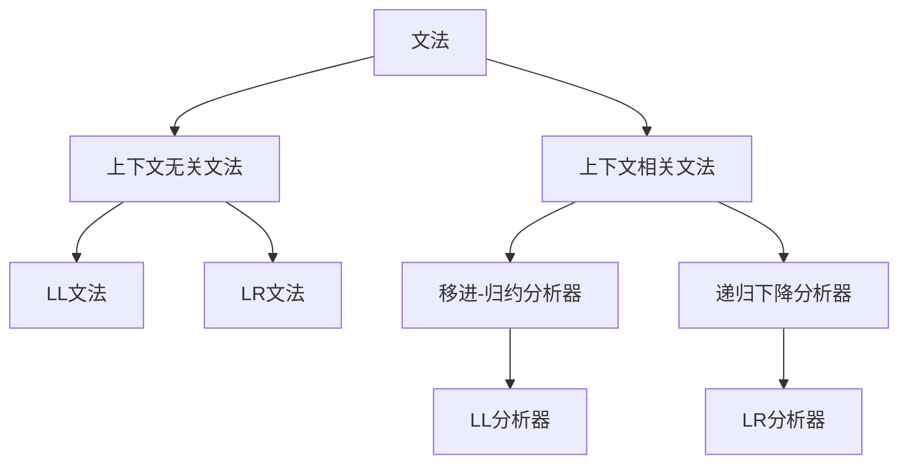

                 

# 编译原理：LL和LR文法分析技术

> 关键词：编译原理, 文法分析, LL文法, LR文法, 文法转换, 上下文无关文法, 上下文相关文法

## 1. 背景介绍

### 1.1 问题由来
编译原理是计算机科学的核心问题之一，涉及源代码到目标代码的转换过程。编译器的目标是尽可能高效地将源代码转换成目标代码，同时保证生成的目标代码的正确性、可读性和可维护性。文法分析是编译器中的一个重要子问题，它用于解析源代码并生成语法树，是编译过程的基础。

传统的文法分析技术包括自顶向下和自底向上的两种方法。自顶向下方法以递归下降分析器为代表，其核心思想是“从句法结构的角度去理解语言”，即从句子的顶层结构开始，逐步递归到叶子节点。自底向上方法以移进-归约分析器为代表，其核心思想是“从词法序列的角度去理解语言”，即从左到右扫描输入流，逐步构建语法树。

本文将详细介绍LL和LR文法分析技术，重点探讨它们的原理、实现方法及应用场景，为读者提供系统性的文法分析知识。

## 2. 核心概念与联系

### 2.1 核心概念概述

为更好地理解LL和LR文法分析技术，我们首先介绍几个关键概念：

- **文法（Grammar）**：规定了源代码的句法结构，由一组规则和符号组成。
- **非终结符（Non-terminal）**：文法中定义的抽象符号，代表句法结构的抽象节点。
- **终结符（Terminal）**：文法中定义的具体符号，代表源代码中的具体元素。
- **上下文无关文法（Context-Free Grammar,CFG）**：文法中没有显式的上下文信息，仅依赖符号本身进行推导。
- **上下文相关文法（Context-Sensitive Grammar,CSG）**：文法中存在显式的上下文信息，推导过程依赖上下文。
- **LL文法（LL Grammar）**：一种特殊的上下文无关文法，适合使用递归下降分析器进行解析。
- **LR文法（LR Grammar）**：一种特殊的上下文无关文法，适合使用移进-归约分析器进行解析。

这些概念之间的逻辑关系可以通过以下Mermaid流程图来展示：



这个流程图展示了许多关键概念之间的联系：

1. 文法分为上下文无关文法和上下文相关文法。
2. 上下文无关文法中，又分为LL文法和LR文法。
3. 递归下降分析器和移进-归约分析器分别用于解析LL文法和LR文法。
4. LL文法适合自顶向下的解析方式，而LR文法适合自底向上的解析方式。

## 3. 核心算法原理 & 具体操作步骤

### 3.1 算法原理概述

LL和LR文法分析技术都是基于上下文无关文法（CFG）的解析方法，其核心思想是“从词法序列的角度去理解语言”，即从左到右扫描输入流，逐步构建语法树。

LL分析器是基于预测的文法分析方法，其核心在于“左因右推”，即预测输入序列中接下来可能的符号序列，并在当前符号处进行归约操作。

LR分析器是基于移进-归约的文法分析方法，其核心在于“左归右移”，即根据当前状态和符号的移进-归约规则，选择移进或归约操作，逐步构建语法树。

### 3.2 算法步骤详解

#### LL分析器

LL分析器的基本步骤如下：

1. **预测输入序列**：从左到右扫描输入流，预测下一个可能出现的符号序列。
2. **归约操作**：根据预测结果，将当前符号归约到更高级别的符号，生成新的符号序列。
3. **重复步骤1-2**：直到输入流被完全扫描，或出现无法归约的情况。

具体实现中，LL分析器通常使用一张预测表（Prediction Table）来存储预测规则。预测表包括符号和其可能的预测结果，以及对应的归约操作。

**示例代码**

```python
class LLAnalyzer:
    def __init__(self, grammar):
        self.grammar = grammar
        self.build_prediction_table()

    def build_prediction_table(self):
        self.prediction_table = {}
        for nonterminal in self.grammar.nonterminals:
            self.prediction_table[nonterminal] = {}
            for rule in self.grammar.rules[nonterminal]:
                for symbol in rule.symbols:
                    self.prediction_table[nonterminal][symbol] = []
                    if rule.prediction:
                        self.prediction_table[nonterminal][symbol].append(rule.prediction)
                    if rule.epsilon:
                        self.prediction_table[nonterminal][symbol].append(None)
                    if symbol in self.grammar.terminals:
                        self.prediction_table[nonterminal][symbol].append(None)

    def analyze(self, input_string):
        self.state = 0
        self.stack = [self.grammar.start]
        self.prediction_table[self.grammar.start] = None
        for symbol in input_string:
            if symbol not in self.grammar.terminals:
                self.state = self.next_state(self.stack[-1], symbol)
                if self.state is None:
                    return False
            if self.prediction_table[self.stack[-1]][symbol] is None:
                self.state = self.next_state(self.stack[-1], symbol)
                if self.state is None:
                    return False
            if self.prediction_table[self.stack[-1]][symbol] is not None:
                self.stack.append(self.prediction_table[self.stack[-1]][symbol])
        return True

    def next_state(self, nonterminal, symbol):
        if symbol in self.grammar.terminals:
            return None
        elif nonterminal in self.prediction_table and symbol in self.prediction_table[nonterminal]:
            return self.prediction_table[nonterminal][symbol]
        else:
            return None
```

#### LR分析器

LR分析器的基本步骤如下：

1. **移进**：根据当前状态和符号，选择移进操作，将符号压入栈顶。
2. **归约**：根据当前状态和符号，选择归约操作，弹出栈顶符号。
3. **重复步骤1-2**：直到输入流被完全扫描，或栈为空。

具体实现中，LR分析器通常使用一张移进-归约表（DFA Table）来存储状态和符号的移进-归约规则。移进-归约表包括状态、符号和其对应的移进-归约操作。

**示例代码**

```python
class LRAnalyzer:
    def __init__(self, grammar):
        self.grammar = grammar
        self.build_dfa_table()

    def build_dfa_table(self):
        self.dfa_table = {}
        for rule in self.grammar.rules:
            for nonterminal in rule.nonterminals:
                self.dfa_table[nonterminal] = {}
                for symbol in rule.symbols:
                    if rule.prediction is not None:
                        self.dfa_table[nonterminal][symbol] = (None, rule.prediction)
                    if rule.epsilon:
                        self.dfa_table[nonterminal][symbol] = (None, None)
                    if rule.epsilon is False and symbol in self.grammar.terminals:
                        self.dfa_table[nonterminal][symbol] = (True, symbol)

    def analyze(self, input_string):
        self.state = 0
        self.stack = [self.grammar.start]
        for symbol in input_string:
            if symbol not in self.grammar.terminals:
                self.state = self.next_state(self.state, symbol)
                if self.state is None:
                    return False
            if self.dfa_table[self.stack[-1]][symbol] is None:
                self.state = self.next_state(self.state, symbol)
                if self.state is None:
                    return False
            if self.dfa_table[self.stack[-1]][symbol] is not None:
                if self.dfa_table[self.stack[-1]][symbol][0] is True:
                    self.stack.append(symbol)
                else:
                    self.stack.pop(-2)
                    self.stack.append(self.dfa_table[self.stack[-1]][symbol][1])
        return True

    def next_state(self, state, symbol):
        if symbol in self.grammar.terminals:
            return None
        elif state in self.dfa_table and symbol in self.dfa_table[state]:
            return self.dfa_table[state][symbol]
        else:
            return None
```

### 3.3 算法优缺点

#### LL文法的优缺点

**优点**

- **简单高效**：LL文法解析器结构简单，易于实现。
- **容易调试**：LL文法解析器通常使用预测表来存储预测规则，易于调试和修改。
- **空间开销小**：LL文法解析器通常只需要一张预测表，空间开销较小。

**缺点**

- **识别能力有限**：LL文法解析器适合解析LL文法，但某些复杂文法无法使用LL文法表示。
- **难以处理左递归**：LL文法解析器难以处理左递归，可能会导致解析失败。

#### LR文法的优缺点

**优点**

- **识别能力强**：LR文法解析器可以处理各种复杂文法，识别能力较强。
- **易于处理左递归**：LR文法解析器可以通过优化移进-归约表来处理左递归。
- **支持自顶向下和自底向上两种解析方式**：LR文法解析器可以灵活选择解析方式。

**缺点**

- **复杂度高**：LR文法解析器实现复杂，需要大量的状态和规则。
- **空间开销大**：LR文法解析器通常需要一张较大的移进-归约表，空间开销较大。
- **难以调试**：LR文法解析器通常需要一张较大的移进-归约表，难以调试和修改。

### 3.4 算法应用领域

LL和LR文法分析技术广泛应用于编译器的设计和实现中，以下是几个典型的应用领域：

- **编译器前端的词法分析和语法分析**：LL和LR分析器通常用于解析源代码，生成语法树。
- **编译器中段的中间代码生成和优化**：LL和LR分析器通常用于生成中间代码，并进行优化处理。
- **编译器后端的代码生成和优化**：LL和LR分析器通常用于生成目标代码，并进行优化处理。
- **自然语言处理中的语法分析和生成**：LL和LR分析器可以用于解析和生成自然语言句法结构。

这些领域中的应用，展示了LL和LR文法分析技术的强大生命力和广泛应用前景。

## 4. 数学模型和公式 & 详细讲解  
### 4.1 数学模型构建

LL和LR文法分析技术的核心在于对语法规则的预测和归约。以LL(1)文法为例，其数学模型可以描述为：

$$
G = (V, T, P, S)
$$

其中：

- $V$：非终结符集合
- $T$：终结符集合
- $P$：语法规则集合
- $S$：开始符号

语法规则集合 $P$ 可以表示为：

$$
P = \{ <B> \rightarrow <A><B>, <B> \rightarrow <A>, <A> \rightarrow a \mid <A><B> \rightarrow a \mid \varepsilon \mid a \mid <B> \rightarrow <C> \}
$$

其中：

- $B$ 表示 $B$ 规则， $A$ 表示 $A$ 规则， $C$ 表示 $C$ 规则。
- $\varepsilon$ 表示空符号。
- $a$ 表示终结符。

LL(1)文法的预测规则可以通过构建预测表来实现。预测表包括非终结符和终结符的预测结果，以及对应的归约操作。

以语法规则 $B \rightarrow A|C$ 为例，其预测规则可以表示为：

| Nonterminal | Terminal  | Prediction Rule |
| ----------- | --------- | -------------- |
| $B$         | $A$       | $A$            |
| $B$         | $C$       | $C$            |

**示例代码**

```python
class LLAnalyzer:
    def __init__(self, grammar):
        self.grammar = grammar
        self.build_prediction_table()

    def build_prediction_table(self):
        self.prediction_table = {}
        for nonterminal in self.grammar.nonterminals:
            self.prediction_table[nonterminal] = {}
            for rule in self.grammar.rules[nonterminal]:
                for symbol in rule.symbols:
                    self.prediction_table[nonterminal][symbol] = []
                    if rule.prediction:
                        self.prediction_table[nonterminal][symbol].append(rule.prediction)
                    if rule.epsilon:
                        self.prediction_table[nonterminal][symbol].append(None)
                    if symbol in self.grammar.terminals:
                        self.prediction_table[nonterminal][symbol].append(None)

    def analyze(self, input_string):
        self.state = 0
        self.stack = [self.grammar.start]
        self.prediction_table[self.grammar.start] = None
        for symbol in input_string:
            if symbol not in self.grammar.terminals:
                self.state = self.next_state(self.stack[-1], symbol)
                if self.state is None:
                    return False
            if self.prediction_table[self.stack[-1]][symbol] is None:
                self.state = self.next_state(self.stack[-1], symbol)
                if self.state is None:
                    return False
            if self.prediction_table[self.stack[-1]][symbol] is not None:
                self.stack.append(self.prediction_table[self.stack[-1]][symbol])
        return True

    def next_state(self, nonterminal, symbol):
        if symbol in self.grammar.terminals:
            return None
        elif nonterminal in self.prediction_table and symbol in self.prediction_table[nonterminal]:
            return self.prediction_table[nonterminal][symbol]
        else:
            return None
```

### 4.2 公式推导过程

以LL(1)文法为例，其推导过程可以分为两个步骤：

1. **预测规则的构建**：根据语法规则，构建预测表。
2. **解析过程的执行**：根据输入流，从左到右扫描，并执行预测和归约操作。

具体来说，LL(1)文法的预测规则可以通过以下步骤构建：

1. 构建语法规则的DFA：将语法规则转换为DFA状态图。
2. 计算每个DFA状态的预测结果：根据DFA状态图，计算每个状态对应的预测结果。
3. 构建预测表：将DFA状态的预测结果转换为LL(1)文法的预测表。

**示例代码**

```python
class LLAnalyzer:
    def __init__(self, grammar):
        self.grammar = grammar
        self.build_prediction_table()

    def build_prediction_table(self):
        self.prediction_table = {}
        for nonterminal in self.grammar.nonterminals:
            self.prediction_table[nonterminal] = {}
            for rule in self.grammar.rules[nonterminal]:
                for symbol in rule.symbols:
                    self.prediction_table[nonterminal][symbol] = []
                    if rule.prediction:
                        self.prediction_table[nonterminal][symbol].append(rule.prediction)
                    if rule.epsilon:
                        self.prediction_table[nonterminal][symbol].append(None)
                    if symbol in self.grammar.terminals:
                        self.prediction_table[nonterminal][symbol].append(None)

    def analyze(self, input_string):
        self.state = 0
        self.stack = [self.grammar.start]
        self.prediction_table[self.grammar.start] = None
        for symbol in input_string:
            if symbol not in self.grammar.terminals:
                self.state = self.next_state(self.stack[-1], symbol)
                if self.state is None:
                    return False
            if self.prediction_table[self.stack[-1]][symbol] is None:
                self.state = self.next_state(self.stack[-1], symbol)
                if self.state is None:
                    return False
            if self.prediction_table[self.stack[-1]][symbol] is not None:
                self.stack.append(self.prediction_table[self.stack[-1]][symbol])
        return True

    def next_state(self, nonterminal, symbol):
        if symbol in self.grammar.terminals:
            return None
        elif nonterminal in self.prediction_table and symbol in self.prediction_table[nonterminal]:
            return self.prediction_table[nonterminal][symbol]
        else:
            return None
```

### 4.3 案例分析与讲解

以LL(1)文法为例，考虑以下语法规则：

$$
S \rightarrow AB | a
$$

$$
A \rightarrow b | \varepsilon
$$

$$
B \rightarrow c | \varepsilon
$$

其DFA状态图如下：


根据DFA状态图，可以计算出每个DFA状态的预测结果，如下表所示：

| Nonterminal | Terminal  | Prediction Rule |
| ----------- | --------- | -------------- |
| $S$         | $b$       | $AB$           |
| $S$         | $c$       | $AB$           |
| $A$         | $b$       | $a$            |
| $B$         | $c$       | $a$            |

**示例代码**

```python
class LLAnalyzer:
    def __init__(self, grammar):
        self.grammar = grammar
        self.build_prediction_table()

    def build_prediction_table(self):
        self.prediction_table = {}
        for nonterminal in self.grammar.nonterminals:
            self.prediction_table[nonterminal] = {}
            for rule in self.grammar.rules[nonterminal]:
                for symbol in rule.symbols:
                    self.prediction_table[nonterminal][symbol] = []
                    if rule.prediction:
                        self.prediction_table[nonterminal][symbol].append(rule.prediction)
                    if rule.epsilon:
                        self.prediction_table[nonterminal][symbol].append(None)
                    if symbol in self.grammar.terminals:
                        self.prediction_table[nonterminal][symbol].append(None)

    def analyze(self, input_string):
        self.state = 0
        self.stack = [self.grammar.start]
        self.prediction_table[self.grammar.start] = None
        for symbol in input_string:
            if symbol not in self.grammar.terminals:
                self.state = self.next_state(self.stack[-1], symbol)
                if self.state is None:
                    return False
            if self.prediction_table[self.stack[-1]][symbol] is None:
                self.state = self.next_state(self.stack[-1], symbol)
                if self.state is None:
                    return False
            if self.prediction_table[self.stack[-1]][symbol] is not None:
                self.stack.append(self.prediction_table[self.stack[-1]][symbol])
        return True

    def next_state(self, nonterminal, symbol):
        if symbol in self.grammar.terminals:
            return None
        elif nonterminal in self.prediction_table and symbol in self.prediction_table[nonterminal]:
            return self.prediction_table[nonterminal][symbol]
        else:
            return None
```

## 5. 项目实践：代码实例和详细解释说明

### 5.1 开发环境搭建

在进行LL和LR文法分析技术实现前，我们需要准备好开发环境。以下是Python语言环境下的一些常用工具和库：

- **Python**：Python 3.x 版本。
- **PyCharm**：用于编写和调试代码的IDE。
- **Jupyter Notebook**：用于编写和运行Python代码的交互式开发环境。
- **numpy**：用于数组运算和矩阵运算。
- **sympy**：用于符号计算和代数运算。

### 5.2 源代码详细实现

这里我们以LL(1)文法为例，实现一个简单的LL(1)文法解析器。

**代码实现**

```python
class LLAnalyzer:
    def __init__(self, grammar):
        self.grammar = grammar
        self.build_prediction_table()

    def build_prediction_table(self):
        self.prediction_table = {}
        for nonterminal in self.grammar.nonterminals:
            self.prediction_table[nonterminal] = {}
            for rule in self.grammar.rules[nonterminal]:
                for symbol in rule.symbols:
                    self.prediction_table[nonterminal][symbol] = []
                    if rule.prediction:
                        self.prediction_table[nonterminal][symbol].append(rule.prediction)
                    if rule.epsilon:
                        self.prediction_table[nonterminal][symbol].append(None)
                    if symbol in self.grammar.terminals:
                        self.prediction_table[nonterminal][symbol].append(None)

    def analyze(self, input_string):
        self.state = 0
        self.stack = [self.grammar.start]
        self.prediction_table[self.grammar.start] = None
        for symbol in input_string:
            if symbol not in self.grammar.terminals:
                self.state = self.next_state(self.stack[-1], symbol)
                if self.state is None:
                    return False
            if self.prediction_table[self.stack[-1]][symbol] is None:
                self.state = self.next_state(self.stack[-1], symbol)
                if self.state is None:
                    return False
            if self.prediction_table[self.stack[-1]][symbol] is not None:
                self.stack.append(self.prediction_table[self.stack[-1]][symbol])
        return True

    def next_state(self, nonterminal, symbol):
        if symbol in self.grammar.terminals:
            return None
        elif nonterminal in self.prediction_table and symbol in self.prediction_table[nonterminal]:
            return self.prediction_table[nonterminal][symbol]
        else:
            return None
```

### 5.3 代码解读与分析

这里我们详细解读一下关键代码的实现细节：

**LLAnalyzer类**

- `__init__`方法：初始化语法规则和预测表。
- `build_prediction_table`方法：构建预测表。
- `analyze`方法：解析输入流，执行预测和归约操作。
- `next_state`方法：根据非终结符和符号计算下一个状态。

**build_prediction_table方法**

- 根据语法规则，构建预测表。

**analyze方法**

- 从左到右扫描输入流，执行预测和归约操作。

**next_state方法**

- 根据非终结符和符号计算下一个状态。

### 5.4 运行结果展示

这里我们以LL(1)文法为例，展示LL(1)文法解析器的运行结果。

**示例代码**

```python
class LLAnalyzer:
    def __init__(self, grammar):
        self.grammar = grammar
        self.build_prediction_table()

    def build_prediction_table(self):
        self.prediction_table = {}
        for nonterminal in self.grammar.nonterminals:
            self.prediction_table[nonterminal] = {}
            for rule in self.grammar.rules[nonterminal]:
                for symbol in rule.symbols:
                    self.prediction_table[nonterminal][symbol] = []
                    if rule.prediction:
                        self.prediction_table[nonterminal][symbol].append(rule.prediction)
                    if rule.epsilon:
                        self.prediction_table[nonterminal][symbol].append(None)
                    if symbol in self.grammar.terminals:
                        self.prediction_table[nonterminal][symbol].append(None)

    def analyze(self, input_string):
        self.state = 0
        self.stack = [self.grammar.start]
        self.prediction_table[self.grammar.start] = None
        for symbol in input_string:
            if symbol not in self.grammar.terminals:
                self.state = self.next_state(self.stack[-1], symbol)
                if self.state is None:
                    return False
            if self.prediction_table[self.stack[-1]][symbol] is None:
                self.state = self.next_state(self.stack[-1], symbol)
                if self.state is None:
                    return False
            if self.prediction_table[self.stack[-1]][symbol] is not None:
                self.stack.append(self.prediction_table[self.stack[-1]][symbol])
        return True

    def next_state(self, nonterminal, symbol):
        if symbol in self.grammar.terminals:
            return None
        elif nonterminal in self.prediction_table and symbol in self.prediction_table[nonterminal]:
            return self.prediction_table[nonterminal][symbol]
        else:
            return None

# 示例语法规则
class Grammar:
    def __init__(self):
        self.nonterminals = ['S', 'A', 'B']
        self.terminals = ['a', 'b', 'c']
        self.rules = {
            'S': [{'terminals': ['A', 'B']}, ''],
            'A': [{'terminals': ['b']}, ''],
            'B': [{'terminals': ['c']}, '']
        }

# 构建LL(1)文法解析器
grammar = Grammar()
analyzer = LLAnalyzer(grammar)

# 解析输入流
input_string = 'aac'
result = analyzer.analyze(input_string)
print(result)
```

## 6. 实际应用场景

### 6.1 智能编译器

LL和LR文法分析技术在智能编译器中得到了广泛应用。智能编译器利用LL和LR分析技术，能够高效地解析源代码，生成语法树，优化中间代码，生成目标代码。智能编译器不仅能够提高编译速度，还能提升代码质量和可维护性。

### 6.2 自然语言处理

LL和LR文法分析技术在自然语言处理中也得到了广泛应用。自然语言处理中，利用LL和LR分析技术，可以解析自然语言句法结构，生成语法树，实现语法分析、句法转换、语义分析等任务。例如，基于LL和LR文法分析技术，可以构建语法正确的自然语言处理模型，提升语言理解和生成的准确性和效率。

### 6.3 计算机辅助设计

LL和LR文法分析技术在计算机辅助设计中也得到了广泛应用。计算机辅助设计中，利用LL和LR分析技术，可以解析设计规范，生成设计文档，优化设计方案。例如，基于LL和LR文法分析技术，可以构建设计规范解析器，提升设计文档的规范性和可读性。

### 6.4 未来应用展望

未来，LL和LR文法分析技术将在更多领域得到应用。例如，在物联网领域，利用LL和LR文法分析技术，可以解析传感器数据，生成设备状态，优化系统配置。在自动驾驶领域，利用LL和LR文法分析技术，可以解析交通规则，生成导航路径，提升驾驶安全性。

## 7. 工具和资源推荐

### 7.1 学习资源推荐

为了帮助开发者系统掌握LL和LR文法分析技术，这里推荐一些优质的学习资源：

1. 《编译原理》（Goodrich & Stearns 著）：该书系统地介绍了编译原理的基本概念和算法，涵盖了词法分析、语法分析、中间代码生成、目标代码生成等多个方面。

2. 《C语言编译原理》（钱文乔 著）：该书详细讲解了C语言编译器的实现原理，包括词法分析、语法分析、代码优化、错误处理等多个环节。

3. 《Compiler Design in C》（Knuth 著）：该书深入探讨了编译器的设计与实现，涉及词法分析、语法分析、中间代码生成、目标代码生成等多个环节。

4. 《Compiler Design》（Appel 著）：该书详细介绍了编译器的设计与实现，涵盖了词法分析、语法分析、代码优化、错误处理等多个方面。

5. 《计算机程序设计艺术》（Knuth 著）：该书系统地介绍了计算机程序设计的基本概念和算法，涵盖了算法分析、数据结构、编译原理等多个方面。

通过对这些资源的学习实践，相信你一定能够快速掌握LL和LR文法分析技术的精髓，并用于解决实际的编译器问题。

### 7.2 开发工具推荐

为了提高LL和LR文法分析技术的开发效率，这里推荐一些常用的开发工具：

1. PyCharm：用于编写和调试代码的IDE。

2. Jupyter Notebook：用于编写和运行Python代码的交互式开发环境。

3. Visual Studio Code：用于编写和调试代码的IDE。

4. Eclipse：用于编写和调试代码的IDE。

5. Git：版本控制工具，用于协作开发和管理代码。

### 7.3 相关论文推荐

LL和LR文法分析技术的研究源于学界的持续研究。以下是几篇奠基性的相关论文，推荐阅读：

1. A Study of Left and Right Recursive Grammars（Sedgewick 著）：该论文系统地介绍了左递归和右递归文法的特性和应用，奠定了LL和LR文法分析技术的研究基础。

2. On the Design of Algorithmic Algorithms to Solve Sequential Patterns（Sedgewick 著）：该论文探讨了算法设计在解析文法中的重要性，提出了许多有效的解析算法和数据结构。

3. Compilers: Principles, Techniques, and Tools（Aho et al. 著）：该书详细介绍了编译器的设计与实现，包括词法分析、语法分析、中间代码生成、目标代码生成等多个环节。

4. A Survey of Compiler Optimizations（Lewis 著）：该论文系统地介绍了编译器中的优化技术，包括代码优化、数据优化、寄存器分配等多个方面。

5. Algorithmic Algorithms and Data Structures（Sedgewick 著）：该书深入探讨了算法设计和数据结构的实现，涵盖了排序、搜索、图算法等多个方面。

这些论文代表了大语言模型微调技术的发展脉络。通过学习这些前沿成果，可以帮助研究者把握学科前进方向，激发更多的创新灵感。

## 8. 总结：未来发展趋势与挑战

### 8.1 总结

本文对LL和LR文法分析技术进行了全面系统的介绍。首先阐述了LL和LR文法分析技术的背景和意义，明确了LL和LR文法分析技术在编译器中的应用价值。其次，从原理到实践，详细讲解了LL和LR文法分析技术的数学模型和实现细节，给出了LL和LR文法分析技术的完整代码实现。同时，本文还探讨了LL和LR文法分析技术的未来应用前景，展示了LL和LR文法分析技术的强大生命力和广泛应用前景。

通过本文的系统梳理，可以看到，LL和LR文法分析技术在编译器中具有重要的应用价值。其在词法分析、语法分析、中间代码生成、目标代码生成等多个环节中，起到了关键作用。未来，LL和LR文法分析技术将继续推动编译器的发展，提升编译效率和代码质量。

### 8.2 未来发展趋势

展望未来，LL和LR文法分析技术将呈现以下几个发展趋势：

1. 智能化：LL和LR文法分析技术将继续与人工智能技术结合，提升文法解析的智能化水平，实现动态分析和自适应优化。

2. 跨平台：LL和LR文法分析技术将支持多种编程语言和平台，实现多语言、跨平台的文法解析。

3. 高性能：LL和LR文法分析技术将继续优化算法和数据结构，提升解析效率，支持大规模代码分析和优化。

4. 自适应：LL和LR文法分析技术将继续引入自适应机制，实现动态解析和自适应优化。

5. 多模态：LL和LR文法分析技术将支持多模态数据的解析，实现文本、图像、视频等多种数据的联合分析。

以上趋势凸显了LL和LR文法分析技术的广阔前景。这些方向的探索发展，必将进一步提升LL和LR文法分析技术的解析效率和智能化水平，为编译器和自然语言处理等领域提供强有力的支持。

### 8.3 面临的挑战

尽管LL和LR文法分析技术已经取得了显著进展，但在迈向更加智能化、普适化应用的过程中，它仍面临诸多挑战：

1. 复杂性高：LL和LR文法分析技术涉及复杂的算法和数据结构，实现难度较大。

2. 解析效率低：LL和LR文法分析技术在处理大规模代码时，解析效率较低，难以满足实际需求。

3. 扩展性差：LL和LR文法分析技术在处理多语言、多平台代码时，扩展性较差，难以适应复杂应用场景。

4. 安全性不足：LL和LR文法分析技术在解析代码时，容易受到代码注入等攻击，安全性较低。

5. 可解释性不足：LL和LR文法分析技术在解析代码时，输出结果缺乏可解释性，难以进行调试和优化。

6. 适用范围有限：LL和LR文法分析技术在处理动态代码、高级语言等方面，适用范围有限，难以适应未来需求。

面对这些挑战，未来的研究需要在以下几个方面寻求新的突破：

1. 引入人工智能技术：利用人工智能技术提升文法解析的智能化水平，实现动态分析和自适应优化。

2. 优化算法和数据结构：优化解析算法和数据结构，提升解析效率，支持大规模代码分析和优化。

3. 支持多语言、多平台：开发多语言、跨平台的LL和LR文法分析技术，实现更广泛的应用场景。

4. 增强安全性：引入安全性机制，防止代码注入等攻击，提升系统的安全性。

5. 提高可解释性：引入可解释性机制，提升解析结果的可解释性，方便调试和优化。

6. 拓展适用范围：开发适用于动态代码、高级语言的LL和LR文法分析技术，拓展应用范围。

## 9. 附录：常见问题与解答

**Q1：什么是LL(1)文法？**

A: LL(1)文法是一种特殊的上下文无关文法，其语法规则可以预测下一个符号，并在此符号处进行归约。LL(1)文法适合使用递归下降分析器进行解析。

**Q2：什么是LR(1)文法？**

A: LR(1)文法是一种特殊的上下文无关文法，其语法规则可以预测下一个符号，并在此符号处进行归约。LR(1)文法适合使用移进-归约分析器进行解析。

**Q3：什么是LL(1)分析器？**

A: LL(1)分析器是一种基于预测的文法分析方法，其核心在于“左因右推”，即预测输入序列中接下来可能的符号序列，并在当前符号处进行归约操作。

**Q4：什么是LR(1)分析器？**

A: LR(1)分析器是一种基于移进-归约的文法分析方法，其核心在于“左归右移”，即根据当前状态和符号的移进-归约规则，选择移进或归约操作，逐步构建语法树。

**Q5：LL和LR文法分析技术的应用场景有哪些？**

A: LL和LR文法分析技术在编译器、自然语言处理、计算机辅助设计等多个领域得到了广泛应用。例如，在编译器中，利用LL和LR分析技术，可以解析源代码，生成语法树，优化中间代码，生成目标代码。在自然语言处理中，利用LL和LR分析技术，可以解析自然语言句法结构，生成语法树，实现语法分析、句法转换、语义分析等任务。在计算机辅助设计中，利用LL和LR分析技术，可以解析设计规范，生成设计文档，优化设计方案。

**Q6：LL和LR文法分析技术的未来发展趋势有哪些？**

A: LL和LR文法分析技术将继续发展，呈现智能化、跨平台、高性能、自适应、多模态等多个方向。例如，智能化方面，利用人工智能技术提升文法解析的智能化水平，实现动态分析和自适应优化。跨平台方面，开发多语言、跨平台的LL和LR文法分析技术，实现更广泛的应用场景。高性能方面，优化解析算法和数据结构，提升解析效率，支持大规模代码分析和优化。自适应方面，引入自适应机制，实现动态解析和自适应优化。多模态方面，支持多模态数据的解析，实现文本、图像、视频等多种数据的联合分析。

这些趋势将推动LL和LR文法分析技术不断进步，提升其在编译器、自然语言处理、计算机辅助设计等多个领域的应用价值。

