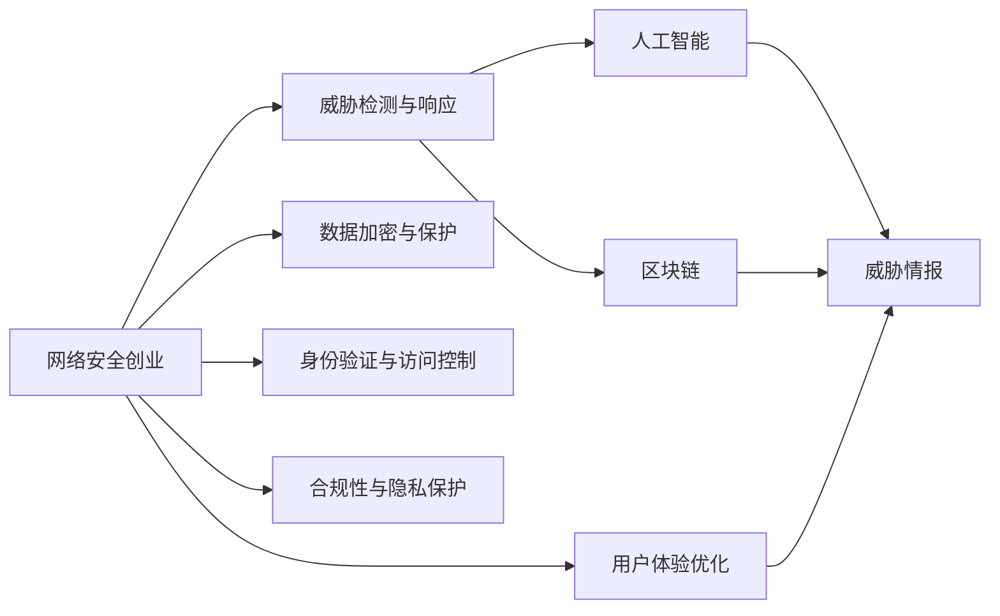

                 

# 网络安全创业：数字时代的守护者

> 关键词：网络安全,创业,数字时代,守护者

## 1. 背景介绍

### 1.1 问题由来

在数字化的浪潮下，网络安全成为了各行业的焦点。从金融、医疗到教育、政府，无一不面临着复杂的网络威胁。根据Statista的统计数据，2021年全球网络安全市场规模达到了2110亿美元，预计到2025年将增长至3290亿美元，年复合增长率达到9.4%[[1]]。

然而，传统的安全防护策略（如防火墙、入侵检测系统等）已难以适应愈发复杂的网络环境，新型安全威胁层出不穷。如何在智能算法和区块链等新兴技术的驱动下，构建一种全新的网络安全防护体系，成为了安全创业者所面临的重要挑战。

### 1.2 问题核心关键点

网络安全创业的核心问题在于如何利用最新的技术手段，构建具备高度智能化、自适应性和可靠性的网络安全系统。具体来说，主要包括以下几个方面：

1. **威胁检测与响应**：及时发现并应对各种网络威胁，包括恶意软件、钓鱼攻击、勒索软件等。
2. **数据加密与保护**：确保关键数据在传输和存储过程中不被窃取或篡改。
3. **身份验证与访问控制**：通过多因素身份验证和细粒度访问控制，防止未授权访问。
4. **合规性与隐私保护**：遵循各种法律法规，保护用户的隐私权和数据安全。
5. **用户体验优化**：安全措施对用户透明，不影响正常业务流程。

## 2. 核心概念与联系

### 2.1 核心概念概述

为了更好地理解网络安全创业的核心问题，我们需要了解一些关键概念：

- **网络安全（Cybersecurity）**：涉及保护计算机系统、网络和数据免受未经授权的访问、使用、披露、干扰、修改和破坏的过程。
- **网络威胁（Cyber Threats）**：包括恶意软件、钓鱼攻击、DDoS攻击等，是网络安全防护的主要目标。
- **威胁情报（Threat Intelligence）**：通过收集、分析、共享有关网络威胁的信息，提高威胁检测与响应的效率。
- **人工智能（AI）**：通过机器学习、深度学习等技术，提升威胁检测和响应的准确性。
- **区块链（Blockchain）**：通过分布式账本技术，提供安全、透明的数据存储和传输方式。
- **零信任架构（Zero Trust Architecture）**：假设任何网络流量和访问都是不可信的，强化身份验证和访问控制。

这些概念之间的逻辑关系可以通过以下Mermaid流程图来展示：



这个流程图展示了网络安全创业的各个关键环节以及与之相关的核心技术。

## 3. 核心算法原理 & 具体操作步骤

### 3.1 算法原理概述

网络安全创业的核心算法原理主要包括以下几个方面：

1. **威胁检测与响应算法**：利用机器学习、深度学习等技术，构建异常检测和威胁识别模型。
2. **数据加密与保护算法**：采用对称加密、非对称加密、哈希算法等技术，保护数据安全。
3. **身份验证与访问控制算法**：通过多因素身份验证、单点登录、细粒度访问控制等手段，确保系统的安全性。
4. **合规性与隐私保护算法**：遵循GDPR、HIPAA等法律法规，保护用户隐私。
5. **用户体验优化算法**：通过UI/UX设计，确保安全措施不会对用户产生负面影响。

### 3.2 算法步骤详解

#### 3.2.1 威胁检测与响应算法

威胁检测与响应算法主要包括以下几个步骤：

1. **数据收集**：收集各种网络流量、日志、事件等数据，构建训练数据集。
2. **模型训练**：利用机器学习、深度学习算法，训练异常检测和威胁识别模型。
3. **威胁响应**：根据检测到的威胁，自动化执行应对措施，如隔离受感染设备、阻止恶意流量等。
4. **评估与反馈**：定期评估威胁检测与响应效果，反馈优化模型。

#### 3.2.2 数据加密与保护算法

数据加密与保护算法主要包括以下几个步骤：

1. **选择加密算法**：根据数据类型和安全需求，选择对称加密、非对称加密、哈希算法等。
2. **密钥管理**：生成、存储、分配和管理加密密钥。
3. **数据加密**：对数据进行加密处理，确保其安全传输和存储。
4. **解密与验证**：在接收方对数据进行解密并验证完整性。

#### 3.2.3 身份验证与访问控制算法

身份验证与访问控制算法主要包括以下几个步骤：

1. **选择身份验证方式**：采用多因素身份验证、单点登录等技术。
2. **认证机制**：实现身份认证，验证用户身份。
3. **授权与访问控制**：根据用户角色和权限，控制其访问权限。
4. **审计与日志**：记录和审计用户访问行为，确保合规性。

#### 3.2.4 合规性与隐私保护算法

合规性与隐私保护算法主要包括以下几个步骤：

1. **法律法规遵守**：确保系统遵循GDPR、HIPAA等法律法规，保护用户隐私。
2. **数据最小化原则**：只收集必要的数据，避免过度收集。
3. **隐私保护技术**：采用匿名化、去标识化等技术，保护用户隐私。
4. **数据访问与共享控制**：控制数据访问与共享，防止数据泄露。

#### 3.2.5 用户体验优化算法

用户体验优化算法主要包括以下几个步骤：

1. **UI/UX设计**：设计简洁、易用的用户界面和体验。
2. **响应时间优化**：优化系统响应时间，确保用户体验流畅。
3. **错误处理**：提供友好的错误提示和解决方案。
4. **用户反馈**：收集用户反馈，持续改进系统。

### 3.3 算法优缺点

网络安全创业的核心算法具有以下优点：

1. **高效性**：利用智能算法提高威胁检测与响应效率。
2. **自适应性**：能够动态调整和优化模型，适应不断变化的网络环境。
3. **高安全性**：采用多种加密技术和身份验证机制，确保数据和系统安全。
4. **合规性与隐私保护**：遵循法律法规，保护用户隐私。
5. **用户体验优化**：保证安全措施对用户透明，不影响正常业务流程。

同时，这些算法也存在一些局限性：

1. **复杂性**：算法实现复杂，需要多学科知识。
2. **资源消耗**：智能算法和高安全措施可能导致较高的计算和存储成本。
3. **误报率**：智能算法可能存在误报，需要人工审核。
4. **隐私风险**：数据收集与存储可能带来隐私泄露风险。

## 4. 数学模型和公式 & 详细讲解 & 举例说明

### 4.1 数学模型构建

在网络安全创业中，常见的数学模型包括：

1. **异常检测模型**：如基于统计的PCA、基于机器学习的孤立森林、基于深度学习的自编码器等。
2. **威胁情报模型**：如基于图神经网络的恶意代码检测、基于自然语言处理的钓鱼攻击检测等。
3. **加密算法模型**：如AES、RSA、SHA等。
4. **身份验证模型**：如基于HMAC的多因素身份验证、基于DNN的单点登录等。
5. **隐私保护模型**：如基于差分隐私的数据发布、基于多方安全计算的加密计算等。

### 4.2 公式推导过程

以异常检测模型为例，假设有一组数据集 $D=\{x_1,x_2,\dots,x_n\}$，其中 $x_i \in \mathbb{R}^d$。异常检测的目标是识别出与正常数据集分布不符的异常数据。一种常用的方法是基于PCA的异常检测，其步骤如下：

1. **数据标准化**：对数据集 $D$ 进行标准化处理，得到标准化后的数据集 $D'=\{\frac{x_i-\mu}{\sigma}\}_{i=1}^n$。
2. **主成分分析**：计算数据集的协方差矩阵 $C$，求解特征值和特征向量 $\lambda_i,v_i$，选择前 $k$ 个特征向量作为主成分。
3. **异常检测**：计算每个样本点在主成分上的投影，根据阈值 $T$ 判断是否为异常点。

以PCA算法为例，其数学推导过程如下：

假设数据集 $D$ 的协方差矩阵为 $C$，其特征值为 $\lambda_i$，特征向量为 $v_i$。令 $\sigma_i$ 为第 $i$ 个特征值的标准差，则数据集 $D$ 在主成分 $v_i$ 上的投影为：

$$
y_i=\frac{x_i-\mu}{\sigma_i}
$$

其中 $\mu$ 为数据集 $D$ 的均值。

### 4.3 案例分析与讲解

以威胁情报模型为例，假设有两个不同的数据源，分别是日志数据 $L_1$ 和威胁情报 $I_1$。目标是整合这两种数据源，构建一个综合威胁情报模型。

假设 $L_1=\{x_1,x_2,\dots,x_n\}$，$I_1=\{y_1,y_2,\dots,y_m\}$。将两者进行合并，得到合并后的数据集 $D=\{x_1,x_2,\dots,x_n,y_1,y_2,\dots,y_m\}$。

假设合并后的数据集 $D$ 的协方差矩阵为 $C$，特征值为 $\lambda_i$，特征向量为 $v_i$。选择前 $k$ 个特征向量作为主成分，得到主成分矩阵 $V=\{v_1,v_2,\dots,v_k\}$。

则威胁情报模型可以表示为：

$$
M(x)=\sum_{i=1}^k \lambda_i v_i^T \phi_i(x)
$$

其中 $\phi_i(x)$ 为第 $i$ 个主成分的映射函数。

## 5. 项目实践：代码实例和详细解释说明

### 5.1 开发环境搭建

在进行网络安全创业的实践时，我们需要准备好开发环境。以下是使用Python进行PyTorch开发的环境配置流程：

1. 安装Anaconda：从官网下载并安装Anaconda，用于创建独立的Python环境。

2. 创建并激活虚拟环境：
```bash
conda create -n security-env python=3.8 
conda activate security-env
```

3. 安装PyTorch：根据CUDA版本，从官网获取对应的安装命令。例如：
```bash
conda install pytorch torchvision torchaudio cudatoolkit=11.1 -c pytorch -c conda-forge
```

4. 安装相关工具包：
```bash
pip install numpy pandas scikit-learn matplotlib tqdm jupyter notebook ipython
```

完成上述步骤后，即可在`security-env`环境中开始网络安全创业的开发实践。

### 5.2 源代码详细实现

下面是使用PyTorch实现一个简单的网络安全威胁检测模型的代码示例：

```python
import torch
import torch.nn as nn
import torch.optim as optim
from torch.utils.data import DataLoader
from sklearn.model_selection import train_test_split

# 定义模型
class Network(nn.Module):
    def __init__(self, input_size, hidden_size, output_size):
        super(Network, self).__init__()
        self.fc1 = nn.Linear(input_size, hidden_size)
        self.fc2 = nn.Linear(hidden_size, output_size)
        self.relu = nn.ReLU()

    def forward(self, x):
        x = self.fc1(x)
        x = self.relu(x)
        x = self.fc2(x)
        return x

# 加载数据集
data = load_data()
X, y = data.data, data.target
X_train, X_test, y_train, y_test = train_test_split(X, y, test_size=0.2, random_state=42)

# 定义模型参数
input_size = X.shape[1]
hidden_size = 64
output_size = 1
model = Network(input_size, hidden_size, output_size)

# 定义损失函数和优化器
criterion = nn.BCELoss()
optimizer = optim.Adam(model.parameters(), lr=0.01)

# 训练模型
for epoch in range(100):
    for i, (inputs, labels) in enumerate(DataLoader(X_train, y_train, batch_size=32)):
        optimizer.zero_grad()
        outputs = model(inputs)
        loss = criterion(outputs, labels)
        loss.backward()
        optimizer.step()

        if (i+1) % 10 == 0:
            print('Epoch [{}/{}], Step [{}/{}], Loss: {:.4f}'
                  .format(epoch+1, 100, i+1, len(X_train)//32, loss.item()))

# 评估模型
correct = 0
total = 0
with torch.no_grad():
    for inputs, labels in DataLoader(X_test, y_test, batch_size=32):
        outputs = model(inputs)
        _, predicted = torch.max(outputs.data, 1)
        total += labels.size(0)
        correct += (predicted == labels).sum().item()

print('Accuracy: {:.2f}%'.format(100 * correct / total))
```

### 5.3 代码解读与分析

让我们再详细解读一下关键代码的实现细节：

**Network类**：
- `__init__`方法：初始化模型结构，包括输入层、隐藏层和输出层。
- `forward`方法：定义模型的前向传播过程，包含两层全连接层和一个ReLU激活函数。

**DataLoader类**：
- `DataLoader`方法：利用PyTorch的DataLoader对数据集进行批处理，方便模型训练。

**模型训练**：
- 通过循环遍历数据集，对模型进行前向传播和反向传播，更新模型参数。

**模型评估**：
- 在测试集上对模型进行评估，计算准确率。

## 6. 实际应用场景

### 6.1 智能安全防护系统

智能安全防护系统是网络安全创业的主要应用场景之一。通过智能算法和大数据技术，构建自动化、智能化的安全防护体系，及时发现和应对各种网络威胁。

在技术实现上，可以构建多个监控模块，实时监测网络流量、日志等数据，进行威胁检测和响应。同时，利用机器学习技术，不断优化和提升威胁检测的准确性。此外，采用区块链技术，确保系统透明和数据安全。

### 6.2 安全服务集成平台

安全服务集成平台是网络安全创业的另一重要应用场景。通过构建平台化的架构，集成多种安全服务，为用户提供一站式的安全解决方案。

在平台架构设计上，可以采用微服务架构，将各个安全服务模块模块化，灵活组合和扩展。同时，引入API网关和负载均衡技术，保证平台的高可用性和扩展性。

### 6.3 云安全防御系统

云安全防御系统是网络安全创业的前沿应用场景。通过构建云平台，为用户提供云安全防御服务，实时检测和应对云环境下的各种威胁。

在云平台架构设计上，可以采用多租户模式，根据不同用户需求，提供个性化的安全防御方案。同时，利用云原生技术，实现服务编排、弹性伸缩等功能，提升云安全防御的灵活性和可靠性。

### 6.4 未来应用展望

随着技术的不断进步，网络安全创业的应用场景将更加丰富和多样化。以下是对未来应用场景的展望：

1. **边缘计算安全**：在边缘计算设备上构建安全防护系统，实时监测和响应边缘计算环境下的安全威胁。
2. **物联网安全**：构建物联网安全体系，保护物联网设备和数据安全。
3. **供应链安全**：构建供应链安全平台，保护供应链环节中的数据和系统安全。
4. **人工智能安全**：构建人工智能安全防护体系，保护AI模型的安全性和隐私。
5. **大数据安全**：构建大数据安全防护系统，保护大数据环境中的数据安全。

## 7. 工具和资源推荐

### 7.1 学习资源推荐

为了帮助开发者系统掌握网络安全创业的理论基础和实践技巧，这里推荐一些优质的学习资源：

1. 《网络安全实战指南》系列博文：由网络安全领域专家撰写，深入浅出地介绍了网络安全的基本概念和实战技巧。

2. 网络安全竞赛：如Capture the Flag（CTF）比赛，通过实际比赛锻炼网络安全技能。

3. 《网络安全攻防技术》课程：由网络安全培训机构开设的课程，涵盖网络安全基础知识和攻防技术。

4. 《Web安全实践指南》书籍：详细介绍了Web安全的基本概念和常见漏洞防范措施。

5. Kaggle网络安全竞赛平台：通过参加Kaggle竞赛，提升网络安全实战能力。

通过对这些资源的学习实践，相信你一定能够快速掌握网络安全创业的精髓，并用于解决实际的网络安全问题。

### 7.2 开发工具推荐

高效的开发离不开优秀的工具支持。以下是几款用于网络安全创业开发的常用工具：

1. Wireshark：网络协议分析工具，用于分析网络流量和数据包。

2. Metasploit：渗透测试工具，用于发现和利用漏洞。

3. Nmap：网络扫描工具，用于发现和探测网络中的主机和开放端口。

4. Nessus：网络安全扫描工具，用于发现网络中的安全漏洞。

5. Burp Suite：Web安全测试工具，用于发现和利用Web应用中的漏洞。

合理利用这些工具，可以显著提升网络安全创业的开发效率，加快创新迭代的步伐。

### 7.3 相关论文推荐

网络安全创业的研究源于学界的持续研究。以下是几篇奠基性的相关论文，推荐阅读：

1. "A Survey of Cybersecurity Attacks and Countermeasures"（网络安全攻击与防御综述）：对网络安全攻击和防御技术进行了全面总结。

2. "Adversarial Machine Learning"（对抗性机器学习）：研究对抗性样本对机器学习模型的影响及其防御方法。

3. "Homomorphic Encryption for Cybersecurity"（同态加密在网络安全中的应用）：研究同态加密技术在保护数据隐私方面的应用。

4. "Zero Trust Architecture: A Primer for Government Agencies"（零信任架构：政府机构入门）：介绍零信任架构的基本概念和设计原则。

5. "Blockchain and Cybersecurity: A Survey"（区块链与网络安全：综述）：对区块链在网络安全中的应用进行了全面总结。

这些论文代表了大规模语言模型微调技术的发展脉络。通过学习这些前沿成果，可以帮助研究者把握学科前进方向，激发更多的创新灵感。

## 8. 总结：未来发展趋势与挑战

### 8.1 总结

本文对网络安全创业进行了全面系统的介绍。首先阐述了网络安全创业的背景和意义，明确了智能算法和大数据在构建安全防护体系中的重要作用。其次，从原理到实践，详细讲解了威胁检测与响应、数据加密与保护、身份验证与访问控制、合规性与隐私保护、用户体验优化等核心算法的实现步骤。同时，本文还广泛探讨了智能安全防护系统、安全服务集成平台、云安全防御系统等实际应用场景，展示了网络安全创业的广阔前景。最后，本文精选了网络安全创业的学习资源和开发工具，力求为读者提供全方位的技术指引。

通过本文的系统梳理，可以看到，网络安全创业在智能算法和大数据的驱动下，正在逐步走向成熟，为构建更加安全可靠的网络环境提供了新的方向。未来，伴随技术不断进步和应用场景的不断拓展，网络安全创业必将在数字时代中扮演越来越重要的角色，为保障信息安全提供坚实的技术保障。

### 8.2 未来发展趋势

展望未来，网络安全创业将呈现以下几个发展趋势：

1. **智能化与自动化**：利用AI和大数据技术，提升威胁检测与响应的自动化和智能化水平。
2. **跨域安全防护**：构建跨领域、跨平台的安全防护体系，实现更全面的安全保护。
3. **零信任架构**：采用零信任架构，强化身份验证和访问控制，确保系统的安全性。
4. **分布式安全防御**：利用区块链和分布式账本技术，构建分布式安全防护体系，提升系统的鲁棒性和安全性。
5. **用户隐私保护**：在安全防护过程中，注重用户隐私保护，遵守法律法规。

以上趋势凸显了网络安全创业的广阔前景。这些方向的探索发展，必将进一步提升网络安全系统的性能和应用范围，为保障信息安全提供坚实的技术保障。

### 8.3 面临的挑战

尽管网络安全创业技术已经取得了瞩目成就，但在迈向更加智能化、普适化应用的过程中，它仍面临着诸多挑战：

1. **数据隐私保护**：如何在保障数据隐私的同时，实现高效的安全防护。
2. **威胁情报获取**：如何高效获取和利用威胁情报，提升威胁检测与响应效果。
3. **资源消耗**：智能算法和高安全措施可能导致较高的计算和存储成本。
4. **误报与漏报**：智能算法可能存在误报和漏报，需要人工审核和优化。
5. **用户隐私风险**：数据收集与存储可能带来隐私泄露风险。

## 9. 附录：常见问题与解答

**Q1：网络安全创业是否适用于所有行业？**

A: 网络安全创业技术适用于大多数行业，特别是对信息安全要求较高的行业，如金融、医疗、政府等。但对于一些传统行业，如制造业、农业等，网络安全创业还需要结合具体业务场景进行定制化设计。

**Q2：如何确保网络安全创业的合规性？**

A: 网络安全创业的合规性主要通过以下几个方面来确保：
1. 遵循法律法规：严格遵守GDPR、HIPAA等法律法规，保护用户隐私。
2. 数据最小化原则：只收集必要的数据，避免过度收集。
3. 隐私保护技术：采用匿名化、去标识化等技术，保护用户隐私。
4. 数据访问与共享控制：控制数据访问与共享，防止数据泄露。

**Q3：如何提升网络安全创业的智能算法性能？**

A: 提升智能算法性能主要通过以下几个方面来优化：
1. 数据质量：收集高质量的数据集，避免噪声数据。
2. 算法优化：采用先进的机器学习算法，如深度学习、强化学习等，提升算法性能。
3. 模型微调：在训练过程中进行模型微调，提升模型泛化能力。
4. 数据增强：通过数据增强技术，扩充训练数据集。

**Q4：网络安全创业中的区块链技术有哪些应用？**

A: 区块链技术在网络安全创业中有以下应用：
1. 分布式账本：构建分布式账本系统，确保数据透明和可追溯。
2. 智能合约：通过智能合约实现自动化安全防护。
3. 共识机制：利用共识机制保障数据安全和一致性。
4. 去中心化身份认证：采用去中心化身份认证技术，提升系统安全性。

这些技术的应用，可以显著提升网络安全创业的安全性和可靠性。

---

作者：禅与计算机程序设计艺术 / Zen and the Art of Computer Programming

