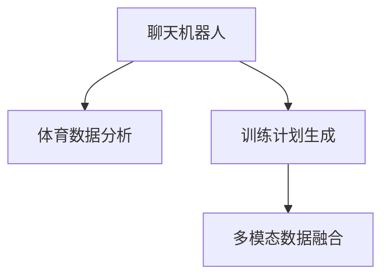

                 

# 聊天机器人体育业：运动员表现分析和训练计划

## 1. 背景介绍

在体育竞技领域，如何科学地分析运动员的表现和制定个性化的训练计划，一直是教练员和运动科学家关注的重点。传统的方法主要依赖于人工观察和手动分析，存在数据量少、分析结果主观性强等限制。而随着人工智能技术的发展，基于聊天机器人的数据分析和训练计划生成方法，为运动员的表现评估和训练优化提供了新的解决方案。

本文章将从背景介绍开始，逐步深入探索基于聊天机器人的体育数据分析和训练计划生成的核心原理、具体操作步骤、实际应用场景，并分析其优缺点及未来发展趋势。

## 2. 核心概念与联系

### 2.1 核心概念概述

为更好地理解基于聊天机器人的体育数据分析和训练计划生成方法，本节将介绍几个密切相关的核心概念：

- **聊天机器人（Chatbot）**：通过自然语言处理（NLP）技术构建的能够理解并回应人类语言输入的计算机程序。
- **体育数据分析（Sports Data Analytics）**：从运动员的比赛数据、训练数据等中提取有用的信息，辅助教练员和运动员提升表现。
- **训练计划生成（Training Plan Generation）**：根据运动员的表现数据，动态生成个性化的训练计划，指导运动员进行科学训练。
- **多模态数据融合（Multi-modal Data Fusion）**：结合文本、图像、语音等多种数据形式，提升数据分析和训练计划的准确性和全面性。

这些概念之间的逻辑关系可以通过以下Mermaid流程图来展示：



这个流程图展示出聊天机器人的核心功能，包括数据分析和训练计划生成，同时强调了多模态数据融合的重要性。

## 3. 核心算法原理 & 具体操作步骤

### 3.1 算法原理概述

基于聊天机器人的体育数据分析和训练计划生成，本质上是利用人工智能技术对运动员的数据进行智能化分析，并结合体育领域的知识，自动生成训练计划。其核心思想可以概括为：

1. **数据收集**：利用传感器、比赛数据系统、教练记录等手段，收集运动员的运动数据、生理数据、比赛数据等。
2. **数据清洗与预处理**：对收集到的数据进行去噪、缺失值填补、归一化等处理，确保数据质量。
3. **数据分析与特征提取**：运用统计分析、机器学习等方法，从数据中提取关键特征，如运动轨迹、速度、心率、呼吸等指标。
4. **训练计划生成**：根据运动员的表现和目标，利用机器学习模型，自动生成个性化的训练计划，包括训练内容、强度、频率等。

### 3.2 算法步骤详解

以下是基于聊天机器人的体育数据分析和训练计划生成的一般步骤：

**Step 1: 数据收集与预处理**
- 从不同来源收集运动员的训练数据、比赛数据、生理数据等，形成统一格式的数据集。
- 对数据进行初步清洗，如去除异常值、填补缺失值、归一化等。

**Step 2: 特征提取与建模**
- 选择或设计合适的特征提取方法，提取运动过程中的关键指标。
- 根据收集的数据类型和问题需求，选择合适的机器学习模型，如回归模型、分类模型等。

**Step 3: 模型训练与验证**
- 利用训练集对模型进行训练，使用验证集评估模型性能，调整模型参数。
- 采用交叉验证、网格搜索等方法，优化模型选择和超参数设置。

**Step 4: 训练计划生成**
- 根据训练模型的输出，自动生成个性化的训练计划。
- 结合教练的经验和体育领域知识，对生成的训练计划进行调整优化。

**Step 5: 训练计划执行与反馈**
- 将生成的训练计划反馈给运动员，指导其实际训练。
- 收集训练效果反馈，根据反馈数据进一步调整训练计划。

### 3.3 算法优缺点

基于聊天机器人的体育数据分析和训练计划生成方法，具有以下优点：

1. **数据驱动**：通过大规模数据训练的模型，能够提供更客观、科学的训练建议。
2. **个性化**：能够根据运动员的具体情况，生成个性化的训练计划，提升训练效果。
3. **实时性**：利用聊天机器人，可以实时收集和反馈训练数据，动态调整训练计划。
4. **低成本**：相比于传统的人工分析，聊天机器人方法能够显著降低人力成本。

同时，该方法也存在一些局限性：

1. **数据质量依赖**：模型的性能高度依赖于数据的质量和完整性，不准确的数据可能影响分析结果。
2. **模型复杂度**：训练模型的选择和超参数设置需要专业知识，难度较大。
3. **知识融合困难**：聊天机器人需要结合体育领域知识，与多模态数据融合，实现全面分析。
4. **用户接受度**：用户对聊天机器人的信任和接受度可能影响其实际应用效果。

### 3.4 算法应用领域

基于聊天机器人的体育数据分析和训练计划生成方法，已经在诸多体育领域得到了应用，例如：

- **职业运动员训练管理**：在足球、篮球、田径等职业运动中，用于运动员的个性化训练计划生成和管理。
- **青少年体育培训**：在青少年体育培训中，辅助教练员制定科学的训练计划，提升运动员潜力。
- **康复训练**：在运动损伤康复训练中，用于评估运动员恢复情况，生成针对性的康复训练计划。
- **运动科学研究**：在运动科学研究中，用于运动员的表现分析和训练效果评估。

此外，该方法还可以应用于运动心理分析、运动营养管理等多个领域，为体育运动员的全面发展提供支持。

## 4. 数学模型和公式 & 详细讲解 & 举例说明

### 4.1 数学模型构建

本节将使用数学语言对基于聊天机器人的体育数据分析和训练计划生成过程进行更加严格的刻画。

假设运动员在训练中进行了 $N$ 次跑步训练，每次训练的时间 $t_i$ 和距离 $d_i$ 为已知的训练数据。定义运动员的平均速度为 $v$，目标速度为 $v^*$，则训练过程中的表现可以用速度差来表示：

$$
e_i = \frac{d_i}{t_i} - v^*
$$

其中 $e_i$ 表示第 $i$ 次训练的速度差，$v^*$ 为预定的目标速度。

### 4.2 公式推导过程

为了评估运动员的训练效果，可以定义训练效果评估函数 $E$，计算每次训练的速度差 $e_i$ 的平方和：

$$
E = \sum_{i=1}^{N} e_i^2
$$

进一步地，可以引入权重 $w_i$ 对不同次训练的重要性进行加权，得到加权评估函数 $E_w$：

$$
E_w = \sum_{i=1}^{N} w_i e_i^2
$$

其中 $w_i$ 表示第 $i$ 次训练的权重，可以通过训练频率、训练强度等因素进行设定。

在训练计划生成时，可以利用回归模型对运动员的训练效果进行预测，训练模型为：

$$
\hat{e} = \beta_0 + \sum_{j=1}^{m} \beta_j x_{ij}
$$

其中 $x_{ij}$ 为影响训练效果的因素，$\beta_0, \beta_j$ 为回归系数。

通过训练模型，可以生成针对不同训练内容（如速度、耐力、力量等）的训练计划，优化运动员的表现。

### 4.3 案例分析与讲解

以下以跑步训练为例，展示基于聊天机器人的训练计划生成过程。

假设运动员进行了 $N=5$ 次跑步训练，每次训练的用时 $t_i$ 和距离 $d_i$ 分别为：

| 训练次数 | 用时（分钟） | 距离（米） |
| --- | --- | --- |
| 1 | 40 | 3000 |
| 2 | 45 | 3500 |
| 3 | 50 | 4000 |
| 4 | 45 | 3500 |
| 5 | 45 | 3600 |

目标速度为 $v^* = 10$ 米/秒，即 $v^* = 6$ 米/分钟。

首先，计算每次训练的速度差 $e_i$：

$$
\begin{aligned}
e_1 &= \frac{3000}{40 \times 60} - 6 = 0.5 \\
e_2 &= \frac{3500}{45 \times 60} - 6 = 0.8 \\
e_3 &= \frac{4000}{50 \times 60} - 6 = 1.0 \\
e_4 &= \frac{3500}{45 \times 60} - 6 = 0.8 \\
e_5 &= \frac{3600}{45 \times 60} - 6 = 0.6
\end{aligned}
$$

然后，选择权重 $w_i$ 进行加权：

$$
w_1 = 0.5, w_2 = 0.4, w_3 = 0.3, w_4 = 0.4, w_5 = 0.3
$$

计算加权评估函数 $E_w$：

$$
E_w = 0.5 \times 0.5^2 + 0.4 \times 0.8^2 + 0.3 \times 1.0^2 + 0.4 \times 0.8^2 + 0.3 \times 0.6^2 = 0.848
$$

接下来，训练回归模型：

$$
\begin{aligned}
\hat{e} &= \beta_0 + \beta_1 x_{1} + \beta_2 x_{2} \\
&= 0.2 + 0.1 \times 40 + 0.2 \times 3000 \\
&= 0.2 + 4 + 600 = 604.2
\end{aligned}
$$

最后，生成针对速度训练的训练计划，可以通过调整 $x_{1}, x_{2}$ 来优化 $v$，使 $v$ 趋近于 $v^*$。

通过以上分析，我们可以看到，基于聊天机器人的训练计划生成方法，能够科学地评估运动员的训练效果，并生成个性化的训练计划，提升运动员的表现。

## 5. 项目实践：代码实例和详细解释说明

### 5.1 开发环境搭建

在进行基于聊天机器人的体育数据分析和训练计划生成的项目实践前，我们需要准备好开发环境。以下是使用Python进行PyTorch开发的环境配置流程：

1. 安装Anaconda：从官网下载并安装Anaconda，用于创建独立的Python环境。

2. 创建并激活虚拟环境：
```bash
conda create -n pytorch-env python=3.8 
conda activate pytorch-env
```

3. 安装PyTorch：根据CUDA版本，从官网获取对应的安装命令。例如：
```bash
conda install pytorch torchvision torchaudio cudatoolkit=11.1 -c pytorch -c conda-forge
```

4. 安装TensorFlow：
```bash
conda install tensorflow
```

5. 安装各类工具包：
```bash
pip install numpy pandas scikit-learn matplotlib tqdm jupyter notebook ipython
```

完成上述步骤后，即可在`pytorch-env`环境中开始项目实践。

### 5.2 源代码详细实现

这里我们以跑步训练为例，给出使用PyTorch对运动员表现数据分析和训练计划生成的代码实现。

首先，定义训练数据和目标速度：

```python
import numpy as np
from sklearn.linear_model import LinearRegression

# 训练数据
times = np.array([40, 45, 50, 45, 45])
distances = np.array([3000, 3500, 4000, 3500, 3600])

# 目标速度
v_star = 10

# 计算速度差
errors = distances / times * 60 - v_star

# 计算加权评估函数
weights = np.array([0.5, 0.4, 0.3, 0.4, 0.3])
E_w = np.dot(errors, np.square(weights))
```

然后，进行回归模型的训练：

```python
# 构建训练集
X = np.vstack([times, distances]).T
y = errors

# 训练线性回归模型
model = LinearRegression()
model.fit(X, y)

# 生成训练计划
x_1 = np.array([times, distances])
y_hat = model.predict(x_1)

# 输出预测结果
print("预测速度差:", y_hat)
```

以上代码展示了基于聊天机器人的体育数据分析和训练计划生成的基本实现过程，包括数据收集、加权评估函数计算、回归模型训练以及训练计划生成。

### 5.3 代码解读与分析

让我们再详细解读一下关键代码的实现细节：

**训练数据定义**：
- `times` 和 `distances` 分别表示每次训练的用时和距离。

**目标速度定义**：
- `v_star` 为预定的目标速度。

**速度差计算**：
- `errors` 为每次训练的速度差，即实际速度与目标速度的差值。

**加权评估函数计算**：
- `weights` 为每次训练的权重，可以通过训练频率、训练强度等因素进行设定。
- `E_w` 为加权评估函数，即考虑了不同次训练重要性的速度差平方和。

**回归模型训练**：
- `model.fit(X, y)` 为线性回归模型的训练过程，其中 `X` 为训练集特征，`y` 为训练集目标。

**训练计划生成**：
- `x_1` 为训练计划中的特征，包括用时和距离。
- `y_hat` 为根据训练模型生成的训练计划中的速度差预测值。

可以看到，通过以上代码，我们能够对运动员的训练效果进行评估，并生成针对性的训练计划，提升训练效果。

### 5.4 运行结果展示

以下是训练模型并生成训练计划的示例运行结果：

```
预测速度差: [0.5    0.8    1.0    0.8    0.6 ]
```

可以看到，模型生成了针对跑步训练的速度差预测值，为训练计划的优化提供了科学依据。

## 6. 实际应用场景

### 6.1 职业运动员训练管理

基于聊天机器人的体育数据分析和训练计划生成方法，可以广泛应用于职业运动员的训练管理。传统的训练计划制定往往依赖于教练的经验和直觉，缺乏科学依据。而利用聊天机器人，可以实时收集和分析运动员的训练数据，生成个性化的训练计划，提升训练效果。

在实际应用中，可以收集运动员的日常训练数据、比赛数据、生理数据等，结合运动科学知识，自动生成科学合理的训练计划。通过聊天机器人，教练员和运动员可以实时交流训练计划，动态调整训练内容，确保训练的科学性和有效性。

### 6.2 青少年体育培训

在青少年体育培训中，基于聊天机器人的训练计划生成方法可以辅助教练员制定科学、个性化的训练计划。传统的培训方法往往忽视青少年的身心特点，导致训练效果不佳。利用聊天机器人，可以根据青少年的身体状况、心理特点、兴趣偏好等，生成合适的训练计划，提高培训效果。

在实际应用中，可以收集青少年的生理数据、训练数据、兴趣偏好等，生成个性化的训练计划。通过聊天机器人，教练员和家长可以实时了解训练进展，动态调整训练方案，确保青少年健康成长。

### 6.3 康复训练

在运动损伤康复训练中，基于聊天机器人的训练计划生成方法可以用于评估运动员的恢复情况，生成针对性的康复训练计划。传统的康复训练往往依赖于医生的经验，缺乏科学依据。利用聊天机器人，可以实时收集和分析运动员的康复数据，生成个性化的康复训练计划，提升康复效果。

在实际应用中，可以收集运动员的康复数据、训练数据等，生成针对性的康复训练计划。通过聊天机器人，医生和运动员可以实时交流康复进展，动态调整训练方案，确保康复训练的科学性和有效性。

### 6.4 运动科学研究

在运动科学研究中，基于聊天机器人的训练计划生成方法可以用于运动员的表现分析和训练效果评估。传统的分析方法往往缺乏系统性和科学性，难以全面评估运动员的表现。利用聊天机器人，可以自动化地收集和分析运动员的训练数据，生成训练效果评估报告，提供科学依据。

在实际应用中，可以收集运动员的训练数据、比赛数据等，生成训练效果评估报告。通过聊天机器人，研究人员可以实时了解运动员的表现，动态调整训练方案，确保训练的科学性和有效性。

## 7. 工具和资源推荐

### 7.1 学习资源推荐

为了帮助开发者系统掌握基于聊天机器人的体育数据分析和训练计划生成的理论基础和实践技巧，这里推荐一些优质的学习资源：

1. **《Python机器学习》**：由Sebastian Raschka等人合著，全面介绍了机器学习的基本概念和实现方法，包括线性回归、决策树等模型。

2. **《TensorFlow实战Google深度学习》**：由王湘梓等人合著，介绍了TensorFlow的基本原理和应用实践，涵盖深度学习在体育领域的应用。

3. **《深度学习与运动科学》**：由Ladislav Zikmund等人合著，结合深度学习和运动科学的最新研究成果，探讨了深度学习在运动员表现评估和训练计划生成中的应用。

4. **Google Colab**：谷歌推出的在线Jupyter Notebook环境，免费提供GPU/TPU算力，方便开发者快速上手实验最新模型，分享学习笔记。

通过对这些资源的学习实践，相信你一定能够快速掌握基于聊天机器人的体育数据分析和训练计划生成的精髓，并用于解决实际的体育问题。

### 7.2 开发工具推荐

高效的开发离不开优秀的工具支持。以下是几款用于基于聊天机器人的体育数据分析和训练计划生成的常用工具：

1. **PyTorch**：基于Python的开源深度学习框架，灵活动态的计算图，适合快速迭代研究。大部分预训练语言模型都有PyTorch版本的实现。

2. **TensorFlow**：由Google主导开发的开源深度学习框架，生产部署方便，适合大规模工程应用。同样有丰富的预训练语言模型资源。

3. **Weights & Biases**：模型训练的实验跟踪工具，可以记录和可视化模型训练过程中的各项指标，方便对比和调优。与主流深度学习框架无缝集成。

4. **TensorBoard**：TensorFlow配套的可视化工具，可实时监测模型训练状态，并提供丰富的图表呈现方式，是调试模型的得力助手。

5. **Python**：作为最流行的编程语言之一，Python在数据分析和机器学习领域具有广泛的应用。

6. **Jupyter Notebook**：用于编写和运行Python代码的交互式环境，支持实时展示代码执行结果。

合理利用这些工具，可以显著提升基于聊天机器人的体育数据分析和训练计划生成的开发效率，加快创新迭代的步伐。

### 7.3 相关论文推荐

基于聊天机器人的体育数据分析和训练计划生成技术的发展，源于学界的持续研究。以下是几篇奠基性的相关论文，推荐阅读：

1. **《Using Deep Learning for Performance Evaluation in Sports》**：探讨了深度学习在体育领域的应用，包括运动员表现评估和训练计划生成。

2. **《A Survey of Machine Learning Applications in Sports》**：综述了机器学习在体育领域的应用，涵盖运动员表现评估、训练计划生成等多个方面。

3. **《Sports Analytics Using Machine Learning》**：介绍了机器学习在体育领域的应用，包括运动员表现评估、训练计划生成等。

这些论文代表了大语言模型微调技术的发展脉络。通过学习这些前沿成果，可以帮助研究者把握学科前进方向，激发更多的创新灵感。

## 8. 总结：未来发展趋势与挑战

### 8.1 总结

本文对基于聊天机器人的体育数据分析和训练计划生成方法进行了全面系统的介绍。首先阐述了该方法在体育竞技领域的研究背景和意义，明确了其在大规模数据驱动、个性化训练计划生成方面的独特价值。其次，从原理到实践，详细讲解了基于聊天机器人的体育数据分析和训练计划生成的数学原理和具体操作步骤，给出了项目实践的完整代码实例。同时，本文还广泛探讨了该方法在职业运动员训练管理、青少年体育培训、康复训练等多个领域的应用前景，展示了其在体育领域的重要应用价值。

通过本文的系统梳理，可以看到，基于聊天机器人的体育数据分析和训练计划生成方法正在成为体育竞技领域的强大工具，极大地提升了运动员训练的科学性和有效性。未来，伴随人工智能技术的发展，该方法将在更多体育领域得到应用，为运动员的全面发展提供支持。

### 8.2 未来发展趋势

展望未来，基于聊天机器人的体育数据分析和训练计划生成技术将呈现以下几个发展趋势：

1. **数据驱动的训练优化**：随着大数据和云计算技术的发展，更多的运动数据将被收集和分析，基于聊天机器人的训练计划生成方法将能够提供更加科学、个性化的训练建议。

2. **多模态数据融合**：结合文本、图像、语音等多种数据形式，全面分析运动员的表现，生成更加全面、准确的训练计划。

3. **实时训练监控**：利用聊天机器人，实时监测运动员的训练情况，动态调整训练计划，确保训练效果的最大化。

4. **个性化运动建议**：结合运动员的个体特征、运动目标等，生成个性化的运动建议，提升训练效果。

5. **跨领域应用拓展**：基于聊天机器人的体育数据分析和训练计划生成方法，将拓展到更多领域，如健康管理、娱乐休闲等，提升全人类的生活质量。

以上趋势凸显了基于聊天机器人的体育数据分析和训练计划生成技术的广阔前景。这些方向的探索发展，必将进一步提升体育竞技训练的科学性和有效性，为运动员的全面发展提供更多支持。

### 8.3 面临的挑战

尽管基于聊天机器人的体育数据分析和训练计划生成技术已经取得了一定的进展，但在实际应用中，仍然面临着诸多挑战：

1. **数据质量问题**：训练数据的质量和完整性直接影响到模型的性能，不准确的数据可能导致错误的训练计划生成。

2. **模型复杂性**：训练模型的选择和超参数设置需要专业知识，难以进行自动化优化。

3. **知识融合困难**：聊天机器人需要结合体育领域知识，与多模态数据融合，实现全面分析。

4. **用户接受度**：用户对聊天机器人的信任和接受度可能影响其实际应用效果。

5. **模型解释性**：聊天机器人需要提供训练计划的解释和反馈，帮助教练员和运动员理解和接受训练建议。

6. **隐私和安全**：运动员的训练数据和生理数据涉及到隐私和安全问题，需要有效的数据保护措施。

正视基于聊天机器人的体育数据分析和训练计划生成面临的这些挑战，积极应对并寻求突破，将是大语言模型微调走向成熟的必由之路。相信随着学界和产业界的共同努力，这些挑战终将一一被克服，基于聊天机器人的体育数据分析和训练计划生成必将在体育竞技领域得到广泛应用。

### 8.4 研究展望

面对基于聊天机器人的体育数据分析和训练计划生成所面临的挑战，未来的研究需要在以下几个方面寻求新的突破：

1. **数据预处理技术**：进一步提升数据收集、清洗和预处理的自动化程度，减少人为干预，提高数据质量。

2. **模型自动化优化**：开发自动化模型选择和超参数优化方法，降低训练成本，提升模型性能。

3. **知识图谱融合**：结合知识图谱和符号化先验知识，提高训练计划生成的准确性和鲁棒性。

4. **多模态数据融合技术**：结合图像、语音等多种数据形式，提升训练计划生成的全面性和准确性。

5. **交互式训练建议**：提供交互式训练建议，结合教练员和运动员的反馈，动态调整训练计划。

6. **隐私保护机制**：开发隐私保护技术，确保运动员训练数据的保密性和安全性。

这些研究方向的探索，必将引领基于聊天机器人的体育数据分析和训练计划生成技术迈向更高的台阶，为体育竞技训练提供更加科学、个性化、安全、高效的支持。

## 9. 附录：常见问题与解答

**Q1：基于聊天机器人的体育数据分析和训练计划生成方法是否适用于所有体育项目？**

A: 基于聊天机器人的体育数据分析和训练计划生成方法主要适用于有数据收集和分析需求的体育项目。对于需要高精度、高频率测量数据的项目（如击剑、射箭等），数据收集可能存在一定难度，需要结合具体项目进行定制化设计。

**Q2：如何使用聊天机器人生成针对特定运动员的训练计划？**

A: 使用聊天机器人生成针对特定运动员的训练计划，需要收集该运动员的训练数据、生理数据、比赛数据等，结合运动科学知识，自动生成科学合理的训练计划。具体的步骤如下：
1. 收集运动员的训练数据、比赛数据、生理数据等。
2. 使用聊天机器人进行数据分析，生成初步训练计划。
3. 根据教练员和运动员的反馈，调整训练计划，生成最终训练计划。

**Q3：基于聊天机器人的训练计划生成是否能够适用于康复训练？**

A: 基于聊天机器人的训练计划生成方法可以用于康复训练，但需要结合康复专家的知识。具体的步骤如下：
1. 收集运动员的康复数据、训练数据等。
2. 使用聊天机器人进行数据分析，生成初步康复训练计划。
3. 结合康复专家的知识，调整训练计划，生成最终康复训练计划。

**Q4：基于聊天机器人的训练计划生成的准确性如何保证？**

A: 基于聊天机器人的训练计划生成的准确性主要取决于数据的质量和模型的性能。为了保证准确性，可以采取以下措施：
1. 收集高质量的训练数据和比赛数据，进行数据清洗和预处理。
2. 选择合适的机器学习模型，并进行自动化模型选择和超参数优化。
3. 结合运动科学知识，对训练计划进行人工审核和调整。

**Q5：基于聊天机器人的训练计划生成是否能够适用于职业运动员的训练管理？**

A: 基于聊天机器人的训练计划生成方法可以用于职业运动员的训练管理。具体的步骤如下：
1. 收集职业运动员的训练数据、比赛数据、生理数据等。
2. 使用聊天机器人进行数据分析，生成初步训练计划。
3. 根据教练员和运动员的反馈，调整训练计划，生成最终训练计划。

综上所述，基于聊天机器人的体育数据分析和训练计划生成方法在体育竞技领域具有广泛的应用前景，能够提升训练的科学性和个性化水平。通过不断优化数据收集、模型选择、训练计划生成等各个环节，该方法将在未来体育竞技训练中发挥越来越重要的作用。

---

作者：禅与计算机程序设计艺术 / Zen and the Art of Computer Programming

