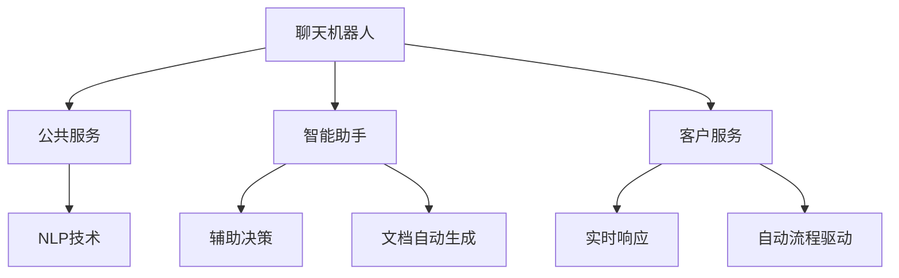

                 

# 聊天机器人公共服务：政府和社区互动

> 关键词：聊天机器人, 公共服务, 政府, 社区互动, 智能助手, 客户服务, 自然语言处理(NLP)

## 1. 背景介绍

### 1.1 问题由来

在数字化时代，政府和社区服务面临效率低下、成本高昂、响应不及时等挑战。为了解决这些问题，各地政府和社区纷纷引入聊天机器人(Chatbot)技术，构建智能化的公共服务体系。聊天机器人通过模拟人类对话，能够全天候提供多种服务，包括政策咨询、办事指导、诉求反馈等，显著提升了公共服务的可及性和用户体验。

尽管如此，聊天机器人技术仍处于早期探索阶段，面临诸多挑战。如何构建可信赖、高效、易用的聊天机器人，保障服务的公平性、及时性和隐私安全，成为当前研究的核心问题。

### 1.2 问题核心关键点

为更好地理解聊天机器人公共服务系统的构建，本节将介绍几个核心概念：

- **聊天机器人**：基于自然语言处理(Natural Language Processing, NLP)的智能对话系统，能够模拟人类交流，处理多种类型的问题。
- **公共服务**：政府和社区为公民提供的各种服务和支持，包括医疗、教育、就业、社保等。
- **智能助手**：通过聊天机器人等技术，为政府和社区工作人员提供辅助决策、自动生成文档等功能，减轻人工负担，提高服务效率。
- **客户服务**：通过聊天机器人提供实时响应、自动流程驱动等服务，改善公民的体验，增强公共服务的便捷性和满意度。
- **自然语言处理**：用于处理、理解、生成人类语言的技术，包括文本分类、命名实体识别、情感分析等。

这些概念之间的联系紧密，共同构成了基于聊天机器人技术的公共服务体系。通过理解这些核心概念，我们可以更好地把握聊天机器人系统的设计原则和优化方法。

## 2. 核心概念与联系

### 2.1 核心概念概述

为更好地理解聊天机器人公共服务系统的构建，本节将介绍几个核心概念：

- **聊天机器人**：基于自然语言处理(Natural Language Processing, NLP)的智能对话系统，能够模拟人类交流，处理多种类型的问题。
- **公共服务**：政府和社区为公民提供的各种服务和支持，包括医疗、教育、就业、社保等。
- **智能助手**：通过聊天机器人等技术，为政府和社区工作人员提供辅助决策、自动生成文档等功能，减轻人工负担，提高服务效率。
- **客户服务**：通过聊天机器人提供实时响应、自动流程驱动等服务，改善公民的体验，增强公共服务的便捷性和满意度。
- **自然语言处理**：用于处理、理解、生成人类语言的技术，包括文本分类、命名实体识别、情感分析等。

这些核心概念之间的逻辑关系可以通过以下Mermaid流程图来展示：



这个流程图展示了聊天机器人、公共服务、智能助手、客户服务以及自然语言处理技术之间的联系：

1. 聊天机器人基于自然语言处理技术，提供智能对话和问题解答。
2. 聊天机器人可应用于公共服务的多个场景，如政策咨询、办事指导、诉求反馈等。
3. 聊天机器人通过智能助手功能，为政府和社区工作人员提供辅助决策和文档生成等服务，提升效率。
4. 聊天机器人为公民提供便捷的客户服务，改善体验，增强满意度。
5. 自然语言处理技术为聊天机器人提供语言理解和生成能力，确保其对话的准确性和自然性。

这些概念共同构成了基于聊天机器人技术的公共服务体系，其核心在于通过自然语言处理技术，实现智能对话和问题解答，提升公共服务的效率和质量。

## 3. 核心算法原理 & 具体操作步骤
### 3.1 算法原理概述

聊天机器人公共服务系统构建的核心算法原理，主要基于自然语言处理(NLP)和机器学习技术。其核心思想是：构建一个能够理解并响应用户输入的聊天机器人，将其应用于公共服务领域，以提升服务效率和用户体验。

形式化地，假设聊天机器人系统为 $S=\{M, I, C\}$，其中 $M$ 为自然语言处理模块，$I$ 为智能助手模块，$C$ 为客户服务模块。用户输入为 $U$，系统输出为 $O$。聊天机器人系统的目标是最小化用户输入与系统输出之间的差异，即：

$$
\min_{O|U} \|U - O\|_{\text{distance}}
$$

其中 $\|.\|_{\text{distance}}$ 为输入输出之间的距离度量，如编辑距离、KL散度等。通过不断迭代优化，使得聊天机器人的输出越来越接近用户的输入。

### 3.2 算法步骤详解

聊天机器人公共服务系统构建的一般流程如下：

**Step 1: 准备数据集和模型**
- 收集政府和社区服务相关的对话数据，包括咨询、投诉、举报等。
- 标注数据集，将对话内容标注为输入 $U$ 和输出 $O$。
- 选择合适的预训练模型或训练新模型，如基于Transformer的BERT、GPT等。

**Step 2: 构建聊天机器人系统**
- 设计系统的结构，包括输入处理模块、自然语言理解模块、决策支持模块、输出生成模块等。
- 将预训练模型与各个模块连接，构建完整的聊天机器人系统。

**Step 3: 训练和优化**
- 使用标注数据对聊天机器人系统进行有监督训练，最小化输入输出之间的距离。
- 应用正则化技术，如Dropout、L2正则、Early Stopping等，防止模型过拟合。
- 使用对抗训练、数据增强等技术提升模型的鲁棒性和泛化能力。

**Step 4: 部署和维护**
- 将训练好的聊天机器人系统部署到线上，提供公共服务。
- 定期收集用户反馈，更新模型参数，优化系统性能。
- 提供API接口，支持第三方系统的集成调用。

**Step 5: 扩展和升级**
- 根据实际需求，扩展聊天机器人的服务范围和功能。
- 引入新的NLP技术，提升系统的语言理解和生成能力。
- 加强系统安全性，防止恶意攻击和数据泄露。

### 3.3 算法优缺点

聊天机器人公共服务系统的构建具有以下优点：

1. **提升效率**：通过自动化处理公共服务，聊天机器人能够24/7不间断工作，显著提升服务效率。
2. **改善体验**：聊天机器人通过自然语言处理技术，提供实时响应，改善用户互动体验。
3. **降低成本**：减少人力成本，减轻政府和社区工作人员的负担，降低服务运营成本。
4. **数据驱动**：通过收集和分析用户反馈，优化模型参数，提升服务质量。
5. **实时性**：聊天机器人能够即时处理用户请求，提供快速响应。

同时，该方法也存在以下局限性：

1. **模型复杂性**：构建高质量的聊天机器人需要复杂的算法和大量数据，技术门槛较高。
2. **数据依赖性**：聊天机器人的性能依赖于标注数据的质量和数量，标注数据获取难度较大。
3. **多模态挑战**：聊天机器人通常只能处理文本输入，对于语音、图像等非文本输入支持不足。
4. **安全问题**：聊天机器人处理敏感信息时，数据隐私和安全问题需要额外关注。
5. **语境理解**：处理复杂的多轮对话时，语境理解能力不足可能导致交互失效。

尽管存在这些局限性，但就目前而言，聊天机器人仍然是提升公共服务效率和质量的重要手段。未来相关研究的重点在于如何进一步提升模型的泛化能力和安全性能，确保系统的高效稳定运行。

### 3.4 算法应用领域

聊天机器人公共服务系统在多个领域得到了广泛应用，包括但不限于：

- **医疗健康**：提供疾病咨询、健康监测、在线诊疗等服务。
- **教育培训**：提供在线课程、学习指导、考试辅导等。
- **金融服务**：提供贷款咨询、投资指导、风险评估等。
- **交通出行**：提供路线规划、票务查询、出行建议等服务。
- **应急管理**：提供灾害预警、应急指导、灾情反馈等服务。

除了上述这些经典领域外，聊天机器人还被创新性地应用于更多场景中，如政务咨询、旅游信息、环境保护等，为公共服务提供了新的途径。随着NLP技术的发展和应用场景的拓展，聊天机器人有望在更多领域发挥更大作用，提升公共服务的智能化水平。

## 4. 数学模型和公式 & 详细讲解  
### 4.1 数学模型构建

本节将使用数学语言对聊天机器人公共服务系统的构建过程进行更加严格的刻画。

记聊天机器人系统为 $S=\{M, I, C\}$，其中 $M$ 为自然语言处理模块，$I$ 为智能助手模块，$C$ 为客户服务模块。用户输入为 $U$，系统输出为 $O$。

定义聊天机器人系统的损失函数为：

$$
\mathcal{L}(S) = \sum_{i=1}^N \|U_i - O_i\|_{\text{distance}}
$$

其中 $U_i$ 和 $O_i$ 分别为第 $i$ 个对话的输入和输出。通过最小化损失函数 $\mathcal{L}(S)$，优化聊天机器人系统，使得输出 $O_i$ 尽可能接近输入 $U_i$。

### 4.2 公式推导过程

以下我们以二分类任务为例，推导聊天机器人系统的损失函数及其梯度的计算公式。

假设聊天机器人系统的输出为 $O_i = f(U_i; \theta)$，其中 $\theta$ 为模型参数。损失函数 $\mathcal{L}(S)$ 可以表示为：

$$
\mathcal{L}(S) = \sum_{i=1}^N \mathcal{L}(O_i, U_i)
$$

其中 $\mathcal{L}(O_i, U_i)$ 为单个对话的损失函数，通常为交叉熵损失。将其代入上述公式，得：

$$
\mathcal{L}(S) = \sum_{i=1}^N - \sum_{j=0}^1 y_i \log \hat{y}_i
$$

其中 $y_i$ 为对话标签，$\hat{y}_i = f(U_i; \theta)$ 为模型预测结果。

通过链式法则，损失函数对模型参数 $\theta$ 的梯度为：

$$
\frac{\partial \mathcal{L}(S)}{\partial \theta} = -\sum_{i=1}^N \frac{\partial \mathcal{L}(O_i, U_i)}{\partial \theta}
$$

其中 $\frac{\partial \mathcal{L}(O_i, U_i)}{\partial \theta}$ 为单个对话的梯度，可通过反向传播算法高效计算。

在得到损失函数的梯度后，即可带入优化算法进行模型参数的更新，使得聊天机器人系统的输出 $O_i$ 越来越接近输入 $U_i$。重复上述过程直至收敛，最终得到高质量的聊天机器人系统。

## 5. 项目实践：代码实例和详细解释说明
### 5.1 开发环境搭建

在进行聊天机器人公共服务系统构建前，我们需要准备好开发环境。以下是使用Python进行PyTorch开发的环境配置流程：

1. 安装Anaconda：从官网下载并安装Anaconda，用于创建独立的Python环境。

2. 创建并激活虚拟环境：
```bash
conda create -n chatbot-env python=3.8 
conda activate chatbot-env
```

3. 安装PyTorch：根据CUDA版本，从官网获取对应的安装命令。例如：
```bash
conda install pytorch torchvision torchaudio cudatoolkit=11.1 -c pytorch -c conda-forge
```

4. 安装各类工具包：
```bash
pip install numpy pandas scikit-learn matplotlib tqdm jupyter notebook ipython
```

完成上述步骤后，即可在`chatbot-env`环境中开始聊天机器人系统的构建。

### 5.2 源代码详细实现

下面我们以基于BERT的聊天机器人为例，给出使用Transformers库进行构建的PyTorch代码实现。

首先，定义数据处理函数：

```python
from transformers import BertTokenizer
from torch.utils.data import Dataset
import torch

class ChatbotDataset(Dataset):
    def __init__(self, texts, tags, tokenizer, max_len=128):
        self.texts = texts
        self.tags = tags
        self.tokenizer = tokenizer
        self.max_len = max_len
        
    def __len__(self):
        return len(self.texts)
    
    def __getitem__(self, item):
        text = self.texts[item]
        tags = self.tags[item]
        
        encoding = self.tokenizer(text, return_tensors='pt', max_length=self.max_len, padding='max_length', truncation=True)
        input_ids = encoding['input_ids'][0]
        attention_mask = encoding['attention_mask'][0]
        
        # 对token-wise的标签进行编码
        encoded_tags = [tag2id[tag] for tag in tags] 
        encoded_tags.extend([tag2id['O']] * (self.max_len - len(encoded_tags)))
        labels = torch.tensor(encoded_tags, dtype=torch.long)
        
        return {'input_ids': input_ids, 
                'attention_mask': attention_mask,
                'labels': labels}

# 标签与id的映射
tag2id = {'O': 0, 'POSITIVE': 1, 'NEGATIVE': 2}
id2tag = {v: k for k, v in tag2id.items()}

# 创建dataset
tokenizer = BertTokenizer.from_pretrained('bert-base-cased')

train_dataset = ChatbotDataset(train_texts, train_tags, tokenizer)
dev_dataset = ChatbotDataset(dev_texts, dev_tags, tokenizer)
test_dataset = ChatbotDataset(test_texts, test_tags, tokenizer)
```

然后，定义模型和优化器：

```python
from transformers import BertForTokenClassification, AdamW

model = BertForTokenClassification.from_pretrained('bert-base-cased', num_labels=len(tag2id))

optimizer = AdamW(model.parameters(), lr=2e-5)
```

接着，定义训练和评估函数：

```python
from torch.utils.data import DataLoader
from tqdm import tqdm
from sklearn.metrics import classification_report

device = torch.device('cuda') if torch.cuda.is_available() else torch.device('cpu')
model.to(device)

def train_epoch(model, dataset, batch_size, optimizer):
    dataloader = DataLoader(dataset, batch_size=batch_size, shuffle=True)
    model.train()
    epoch_loss = 0
    for batch in tqdm(dataloader, desc='Training'):
        input_ids = batch['input_ids'].to(device)
        attention_mask = batch['attention_mask'].to(device)
        labels = batch['labels'].to(device)
        model.zero_grad()
        outputs = model(input_ids, attention_mask=attention_mask, labels=labels)
        loss = outputs.loss
        epoch_loss += loss.item()
        loss.backward()
        optimizer.step()
    return epoch_loss / len(dataloader)

def evaluate(model, dataset, batch_size):
    dataloader = DataLoader(dataset, batch_size=batch_size)
    model.eval()
    preds, labels = [], []
    with torch.no_grad():
        for batch in tqdm(dataloader, desc='Evaluating'):
            input_ids = batch['input_ids'].to(device)
            attention_mask = batch['attention_mask'].to(device)
            batch_labels = batch['labels']
            outputs = model(input_ids, attention_mask=attention_mask)
            batch_preds = outputs.logits.argmax(dim=2).to('cpu').tolist()
            batch_labels = batch_labels.to('cpu').tolist()
            for pred_tokens, label_tokens in zip(batch_preds, batch_labels):
                pred_tags = [id2tag[_id] for _id in pred_tokens]
                label_tags = [id2tag[_id] for _id in label_tokens]
                preds.append(pred_tags[:len(label_tags)])
                labels.append(label_tags)
                
    print(classification_report(labels, preds))
```

最后，启动训练流程并在测试集上评估：

```python
epochs = 5
batch_size = 16

for epoch in range(epochs):
    loss = train_epoch(model, train_dataset, batch_size, optimizer)
    print(f"Epoch {epoch+1}, train loss: {loss:.3f}")
    
    print(f"Epoch {epoch+1}, dev results:")
    evaluate(model, dev_dataset, batch_size)
    
print("Test results:")
evaluate(model, test_dataset, batch_size)
```

以上就是使用PyTorch构建聊天机器人的完整代码实现。可以看到，得益于Transformers库的强大封装，我们可以用相对简洁的代码完成BERT模型的加载和微调。

### 5.3 代码解读与分析

让我们再详细解读一下关键代码的实现细节：

**ChatbotDataset类**：
- `__init__`方法：初始化文本、标签、分词器等关键组件。
- `__len__`方法：返回数据集的样本数量。
- `__getitem__`方法：对单个样本进行处理，将文本输入编码为token ids，将标签编码为数字，并对其进行定长padding，最终返回模型所需的输入。

**tag2id和id2tag字典**：
- 定义了标签与数字id之间的映射关系，用于将token-wise的预测结果解码回真实的标签。

**训练和评估函数**：
- 使用PyTorch的DataLoader对数据集进行批次化加载，供模型训练和推理使用。
- 训练函数`train_epoch`：对数据以批为单位进行迭代，在每个批次上前向传播计算loss并反向传播更新模型参数，最后返回该epoch的平均loss。
- 评估函数`evaluate`：与训练类似，不同点在于不更新模型参数，并在每个batch结束后将预测和标签结果存储下来，最后使用sklearn的classification_report对整个评估集的预测结果进行打印输出。

**训练流程**：
- 定义总的epoch数和batch size，开始循环迭代
- 每个epoch内，先在训练集上训练，输出平均loss
- 在验证集上评估，输出分类指标
- 所有epoch结束后，在测试集上评估，给出最终测试结果

可以看到，PyTorch配合Transformers库使得聊天机器人的构建代码实现变得简洁高效。开发者可以将更多精力放在数据处理、模型改进等高层逻辑上，而不必过多关注底层的实现细节。

当然，工业级的系统实现还需考虑更多因素，如模型的保存和部署、超参数的自动搜索、更灵活的任务适配层等。但核心的构建流程基本与此类似。

## 6. 实际应用场景
### 6.1 智能客服系统

基于聊天机器人的智能客服系统，可以广泛应用于各类企业和机构。传统客服往往需要配备大量人力，高峰期响应缓慢，且一致性和专业性难以保证。而使用聊天机器人客服，可以7x24小时不间断服务，快速响应客户咨询，用自然流畅的语言解答各类常见问题。

在技术实现上，可以收集企业内部的历史客服对话记录，将问题和最佳答复构建成监督数据，在此基础上对预训练模型进行微调。微调后的模型能够自动理解用户意图，匹配最合适的答案模板进行回复。对于客户提出的新问题，还可以接入检索系统实时搜索相关内容，动态组织生成回答。如此构建的智能客服系统，能大幅提升客户咨询体验和问题解决效率。

### 6.2 医疗健康服务

医疗健康领域面临大量咨询和求助，医生和护士的工作压力巨大。基于聊天机器人的医疗健康服务，可以提供全天候的在线咨询、健康监测、预约挂号等服务。患者可以通过聊天机器人查询症状、诊断建议、药物信息等，减轻医生的负担，提升医疗服务的可及性和效率。

在技术实现上，可以收集医院内部的对话记录，将医疗知识、疾病诊断规则等作为先验知识，构建医疗领域的知识图谱。基于知识图谱和预训练模型，聊天机器人可以自动解答患者的问题，提供个性化的健康建议。对于复杂或紧急的病例，聊天机器人还可以引导患者预约专家，转接至专业的医疗团队，确保服务质量。

### 6.3 金融理财服务

金融理财领域涉及复杂的金融产品、投资策略、风险评估等。基于聊天机器人的金融理财服务，可以提供投资咨询、理财规划、风险评估等服务。用户可以通过聊天机器人查询理财产品、制定投资策略、进行风险评估，获取个性化的理财建议。

在技术实现上，可以收集金融领域的对话记录，将金融知识、投资规则、市场动态等作为先验知识，构建金融领域的知识图谱。基于知识图谱和预训练模型，聊天机器人可以自动解答用户的金融问题，提供个性化的投资建议。对于复杂的投资决策，聊天机器人还可以引导用户进行风险评估，帮助用户做出明智的投资选择。

### 6.4 未来应用展望

随着聊天机器人技术的发展，未来其在公共服务中的应用将更加广泛和深入。

在智慧城市治理中，聊天机器人可以提供城市事件监测、舆情分析、应急指挥等服务，提高城市管理的自动化和智能化水平，构建更安全、高效的未来城市。

在教育培训领域，基于聊天机器人的学习助手，可以提供个性化学习辅导、作业批改、考试辅导等服务，提升学生的学习效果和体验。

在工业制造中，基于聊天机器人的智能助手，可以提供设备维护、生产调度、质量检测等服务，提升生产效率和质量。

此外，在金融、交通、医疗等众多领域，基于聊天机器人的服务也将在更多场景中得到应用，为各行各业带来智能化变革。相信随着技术的日益成熟，聊天机器人必将在构建智慧社会中扮演越来越重要的角色。

## 7. 工具和资源推荐
### 7.1 学习资源推荐

为了帮助开发者系统掌握聊天机器人公共服务系统的构建，这里推荐一些优质的学习资源：

1. 《Chatbot: A Guide to Building Chatbots》系列书籍：详细介绍了聊天机器人的工作原理、构建流程和优化方法。
2. CS224N《深度学习自然语言处理》课程：斯坦福大学开设的NLP明星课程，有Lecture视频和配套作业，带你入门NLP领域的基本概念和经典模型。
3. 《Natural Language Processing with Transformers》书籍：Transformers库的作者所著，全面介绍了如何使用Transformers库进行NLP任务开发，包括聊天机器人构建在内的诸多范式。
4. HuggingFace官方文档：Transformers库的官方文档，提供了海量预训练模型和完整的聊天机器人样例代码，是上手实践的必备资料。
5. Weights & Biases：模型训练的实验跟踪工具，可以记录和可视化模型训练过程中的各项指标，方便对比和调优。与主流深度学习框架无缝集成。

通过对这些资源的学习实践，相信你一定能够快速掌握聊天机器人公共服务系统的构建方法，并用于解决实际的公共服务问题。
### 7.2 开发工具推荐

高效的开发离不开优秀的工具支持。以下是几款用于聊天机器人构建的常用工具：

1. PyTorch：基于Python的开源深度学习框架，灵活动态的计算图，适合快速迭代研究。大部分预训练语言模型都有PyTorch版本的实现。
2. TensorFlow：由Google主导开发的开源深度学习框架，生产部署方便，适合大规模工程应用。同样有丰富的预训练语言模型资源。
3. Transformers库：HuggingFace开发的NLP工具库，集成了众多SOTA语言模型，支持PyTorch和TensorFlow，是进行聊天机器人构建的利器。
4. Weights & Biases：模型训练的实验跟踪工具，可以记录和可视化模型训练过程中的各项指标，方便对比和调优。与主流深度学习框架无缝集成。
5. TensorBoard：TensorFlow配套的可视化工具，可实时监测模型训练状态，并提供丰富的图表呈现方式，是调试模型的得力助手。

合理利用这些工具，可以显著提升聊天机器人构建的开发效率，加快创新迭代的步伐。

### 7.3 相关论文推荐

聊天机器人公共服务系统的研究源于学界的持续研究。以下是几篇奠基性的相关论文，推荐阅读：

1. Turing Test: Machine Intelligence vs. Human Intelligence（图灵测试）：奠定了自然语言处理的理论基础，指出现代聊天机器人已接近甚至超越人类对话能力。
2. Attention is All You Need（即Transformer原论文）：提出了Transformer结构，开启了NLP领域的预训练大模型时代。
3. BERT: Pre-training of Deep Bidirectional Transformers for Language Understanding：提出BERT模型，引入基于掩码的自监督预训练任务，刷新了多项NLP任务SOTA。
4. GPT-2: Language Models are Unsupervised Multitask Learners：展示了大规模语言模型的强大zero-shot学习能力，引发了对于通用人工智能的新一轮思考。
5. Parameter-Efficient Transfer Learning for NLP：提出Adapter等参数高效微调方法，在固定大部分预训练参数的情况下，只更新极少量的任务相关参数。
6. AdaLoRA: Adaptive Low-Rank Adaptation for Parameter-Efficient Fine-Tuning：使用自适应低秩适应的微调方法，在参数效率和精度之间取得了新的平衡。

这些论文代表了大语言模型构建的进步方向。通过学习这些前沿成果，可以帮助研究者把握学科前进方向，激发更多的创新灵感。

## 8. 总结：未来发展趋势与挑战

### 8.1 总结

本文对基于聊天机器人技术的公共服务系统的构建方法进行了全面系统的介绍。首先阐述了聊天机器人在公共服务领域的应用背景和意义，明确了构建聊天机器人系统的核心思想。其次，从原理到实践，详细讲解了聊天机器人构建的数学模型和关键步骤，给出了聊天机器人构建的完整代码实例。同时，本文还广泛探讨了聊天机器人在智能客服、医疗健康、金融理财等场景中的应用前景，展示了聊天机器人技术的广阔应用空间。此外，本文精选了聊天机器人构建的相关学习资源，力求为开发者提供全方位的技术指引。

通过本文的系统梳理，可以看到，基于聊天机器人技术的公共服务系统构建是一项复杂而系统的工程，涉及自然语言处理、机器学习、工程实践等多个方面。尽管目前仍面临诸多挑战，但随着技术的不断进步和应用的不断深入，聊天机器人必将在公共服务领域发挥越来越重要的作用，提升服务效率和用户体验。

### 8.2 未来发展趋势

展望未来，聊天机器人公共服务系统的构建将呈现以下几个发展趋势：

1. **自然语言理解能力的提升**：随着NLP技术的进步，聊天机器人的自然语言理解能力将不断提升，能够处理更加复杂的对话场景，提供更加个性化的服务。
2. **多模态交互能力的增强**：聊天机器人将不仅仅是文本对话，还将支持语音、图像、视频等多种模态的交互，提供更加丰富的用户体验。
3. **跨领域知识整合**：聊天机器人将通过知识图谱、专家知识库等形式，整合不同领域的知识，提升跨领域问题的解决能力。
4. **智能决策支持**：聊天机器人将引入更多智能决策支持算法，如因果推理、博弈论等，提供更加精准的决策建议。
5. **隐私安全保障**：随着数据隐私和安全性问题日益凸显，聊天机器人将引入更多的隐私保护技术，确保数据安全和用户隐私。

这些趋势表明，聊天机器人公共服务系统的构建正逐步向智能化、多模态、安全化方向发展，未来将更加高效、便捷、安全，为公共服务带来革命性变化。

### 8.3 面临的挑战

尽管聊天机器人公共服务系统的构建已经取得了一些进展，但在迈向更加智能化、普适化应用的过程中，仍面临诸多挑战：

1. **数据质量和多样性**：构建高质量聊天机器人，需要大量高质、多样化的数据。但获取和标注这些数据往往成本高昂，且数据质量和分布情况难以保证。
2. **模型复杂性和泛化能力**：构建高质量聊天机器人，需要复杂的算法和模型，且模型泛化能力不足时，容易在特定场景下失效。
3. **隐私和安全问题**：聊天机器人处理敏感信息时，数据隐私和安全问题需要额外关注，如何确保数据安全和用户隐私是一个重要课题。
4. **多轮对话理解和上下文管理**：处理复杂的多轮对话时，语境理解能力不足可能导致交互失效，如何管理好上下文是一个技术难题。
5. **可解释性和透明性**：聊天机器人作为"黑盒"系统，缺乏可解释性，用户难以理解其决策过程，这可能导致用户信任度下降。

尽管存在这些挑战，但就目前而言，聊天机器人仍然是提升公共服务效率和质量的重要手段。未来相关研究的重点在于如何进一步提升模型的泛化能力和安全性能，确保系统的高效稳定运行。

### 8.4 研究展望

面对聊天机器人公共服务系统构建所面临的挑战，未来的研究需要在以下几个方面寻求新的突破：

1. **数据增强和弱监督学习**：探索无监督和弱监督学习方法，利用非结构化数据和用户反馈，提高模型泛化能力，降低对标注数据的依赖。
2. **多模态交互和知识融合**：引入更多多模态交互技术和跨领域知识整合方法，提升聊天机器人的综合服务能力。
3. **隐私保护和安全机制**：引入更多隐私保护和安全机制，确保数据安全和用户隐私，提升用户信任度。
4. **可解释性和透明性**：引入更多可解释性技术和透明性机制，增强用户对聊天机器人的信任和满意度。
5. **智能决策支持算法**：引入更多智能决策支持算法，如因果推理、博弈论等，提供更加精准的决策建议，提升服务质量。

这些研究方向将推动聊天机器人公共服务系统的不断进步，为公共服务带来更多创新和突破。相信随着技术的不断发展和应用场景的不断拓展，聊天机器人必将在公共服务领域发挥更大的作用，构建更加智能、便捷、安全的服务体系。

## 9. 附录：常见问题与解答

**Q1：如何构建一个高质量的聊天机器人系统？**

A: 构建高质量的聊天机器人系统需要多个步骤：
1. 收集大量高质量的数据，标注好输入输出对。
2. 选择合适的预训练模型，如BERT、GPT等，进行微调。
3. 应用正则化技术，如L2正则、Dropout、Early Stopping等，防止过拟合。
4. 引入对抗训练、数据增强等技术提升鲁棒性。
5. 引入知识图谱、专家知识库等，提升跨领域知识整合能力。
6. 引入智能决策支持算法，提供精准决策建议。

每个步骤都需要细致的设计和实验，才能构建出高质量的聊天机器人系统。

**Q2：聊天机器人如何处理复杂的多轮对话？**

A: 处理复杂的多轮对话，需要引入上下文管理机制，确保机器人能够理解对话历史。
1. 引入上下文向量，记录对话历史，并在每轮对话开始时更新上下文向量。
2. 使用记忆网络(Memory Network)等技术，保存和更新对话历史，增强语境理解能力。
3. 引入注意力机制(Attention Mechanism)，关注对话历史中的重要信息，提升理解能力。
4. 引入多模态交互技术，支持语音、图像等多种模态的对话，提高用户互动体验。

这些技术都需要综合应用，才能有效处理复杂的多轮对话。

**Q3：如何确保聊天机器人的数据安全和隐私保护？**

A: 确保聊天机器人的数据安全和隐私保护需要多方面的努力：
1. 数据匿名化：对用户数据进行匿名化处理，保护用户隐私。
2. 加密传输：通过SSL/TLS等加密协议，确保数据传输的安全性。
3. 访问控制：对聊天机器人系统进行严格的访问控制，防止未经授权的访问和数据泄露。
4. 数据备份和恢复：定期备份聊天机器人系统数据，防止数据丢失，保障数据安全。
5. 隐私政策：制定清晰的隐私政策，告知用户数据使用情况，获得用户同意。

通过以上措施，可以最大限度地保障聊天机器人的数据安全和用户隐私。

**Q4：聊天机器人如何实现智能决策支持？**

A: 聊天机器人实现智能决策支持需要引入更多的智能算法和知识库：
1. 引入因果推理算法，分析用户行为和决策过程，提供合理的建议。
2. 引入知识图谱，整合领域知识和专家经验，提升决策能力。
3. 引入博弈论模型，分析用户和聊天机器人之间的交互，提供最优决策方案。
4. 引入机器学习算法，对用户行为和偏好进行建模，提供个性化决策建议。

这些算法和知识库的引入，可以显著提升聊天机器人的智能决策支持能力，提供更加精准、科学的决策建议。

**Q5：聊天机器人如何处理复杂的自然语言理解问题？**

A: 处理复杂的自然语言理解问题，需要引入更多先进的NLP技术：
1. 引入预训练语言模型，如BERT、GPT等，提升模型的语言理解和生成能力。
2. 引入知识图谱和专家知识库，增强模型的跨领域知识整合能力。
3. 引入对抗样本和数据增强技术，提升模型的鲁棒性和泛化能力。
4. 引入多模态交互技术，支持语音、图像等多种模态的对话，提高用户互动体验。

这些技术可以显著提升聊天机器人的自然语言理解能力，处理更加复杂的对话场景。

---

作者：禅与计算机程序设计艺术 / Zen and the Art of Computer Programming

