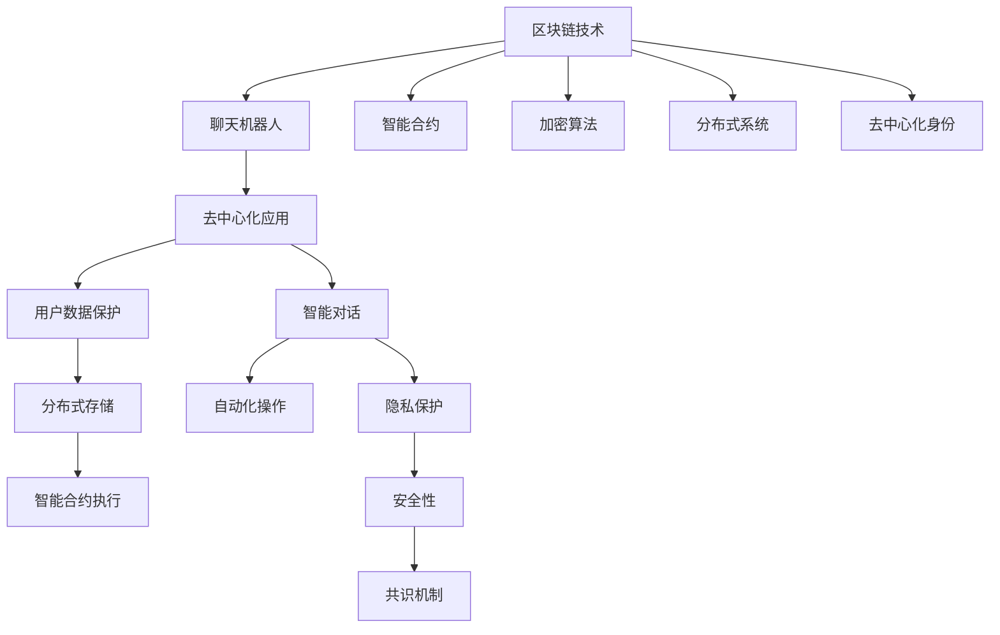

                 

# 聊天机器人区块链：安全和去中心化应用

> 关键词：区块链技术, 聊天机器人, 安全, 去中心化, 自然语言处理, 智能合约, 加密算法, 分布式系统

## 1. 背景介绍

### 1.1 问题由来
随着人工智能和大数据技术的发展，聊天机器人（Chatbot）逐渐成为了企业和用户沟通的重要工具。然而，聊天机器人在其发展过程中，也面临一些问题，例如数据隐私泄露、信息安全问题、智能对话能力有限等。如何确保聊天机器人的安全性、可扩展性和可信任性，成为亟待解决的问题。

在传统互联网环境下，聊天机器人通常基于中心化的服务器架构，存在着单点故障、用户数据集中存储等问题，这严重影响了系统的可扩展性和安全性。为解决这些问题，区块链技术被引入聊天机器人领域，构建去中心化的智能聊天系统，提供了新的解决方案。

### 1.2 问题核心关键点
本研究聚焦于通过区块链技术，构建一个安全和去中心化的聊天机器人系统，该系统能够保障用户数据隐私，提供鲁棒性强的智能对话能力，并且能够自运行、无信任中介，具备更强的可扩展性和可维护性。

### 1.3 问题研究意义
本研究将区块链技术与自然语言处理（NLP）深度融合，旨在打造一个具备高度自主性、安全性和可扩展性的智能聊天系统。该系统不仅能提升聊天机器人的交互体验，还能为用户的个人隐私保护提供保障，在多个应用场景下具有广泛的应用前景，为人工智能技术落地提供新的方向。

## 2. 核心概念与联系

### 2.1 核心概念概述

为更好地理解聊天机器人区块链的应用，本节将介绍几个密切相关的核心概念：

- 区块链技术（Blockchain）：一种分布式账本技术，具有不可篡改、透明、可追溯等特性，能够构建去中心化的信任机制。
- 聊天机器人（Chatbot）：通过人工智能技术构建的自然语言处理程序，用于模拟人类对话，提供智能客服、智能助手等应用。
- 智能合约（Smart Contract）：一种自动化执行、不可篡改的合约，在区块链上实现自动化的智能操作。
- 去中心化（Decentralized）：不依赖单一的中心化服务器，通过分布式网络实现数据和计算的去中心化管理。
- 加密算法（Cryptography）：用于保护数据安全、保证交易隐私的数学算法，是区块链系统安全性的基础。
- 分布式系统（Distributed System）：由多个节点组成的网络系统，各节点协同工作，共同维持系统的稳定性和可靠性。
- 去中心化身份（Decentralized Identity, D-ID）：通过区块链技术，实现去中心化的身份验证和认证。

这些核心概念之间的逻辑关系可以通过以下Mermaid流程图来展示：



这个流程图展示了各个核心概念之间的逻辑联系：

1. 区块链技术为聊天机器人系统提供了分布式账本、不可篡改的基础，并结合智能合约实现自动化操作。
2. 聊天机器人通过自然语言处理技术，提供智能对话功能。
3. 智能合约用于处理自动化的智能操作，如聊天机器人的交互逻辑。
4. 加密算法用于保护数据隐私和安全。
5. 分布式系统实现数据的分布式管理和协同工作。
6. 去中心化身份提供去中心化的身份认证，保障用户的隐私。
7. 去中心化应用提供安全的、去中心化的聊天机器人服务。
8. 智能对话能够实现用户与聊天机器人之间的自然交互。
9. 用户数据保护保障用户数据的隐私。
10. 隐私保护确保用户隐私不被泄露。
11. 自动化操作提升系统效率。
12. 分布式存储实现数据的分布式管理。
13. 智能合约执行自动化操作。
14. 安全性保障系统安全。
15. 共识机制实现分布式系统的协同工作。

这些概念共同构成了聊天机器人区块链系统的核心框架，使得聊天机器人在多个场景下具备高度的安全性、可扩展性和可信任性。

## 3. 核心算法原理 & 具体操作步骤

### 3.1 算法原理概述

聊天机器人区块链系统的核心算法原理主要包括以下几个方面：

- 区块链分布式账本：通过区块链分布式账本技术，记录聊天机器人系统中的所有交互记录和操作日志，确保数据不可篡改，提升系统的透明性和可信度。
- 智能合约自动化操作：利用智能合约技术，实现聊天机器人系统的自动化对话逻辑，提升系统的灵活性和可扩展性。
- 加密算法数据安全：采用加密算法对聊天机器人系统中的数据进行加密保护，确保用户数据的隐私和系统的安全性。
- 分布式系统协同工作：利用分布式系统技术，实现聊天机器人系统的分布式管理和协同工作，提升系统的可扩展性和可靠性。
- 去中心化身份认证：通过去中心化身份认证技术，实现去中心化的身份认证，保障用户隐私和系统的安全性。

### 3.2 算法步骤详解

构建聊天机器人区块链系统的关键步骤包括：

**Step 1: 设计区块链架构**
- 设计区块链分布式账本的基本结构，包括区块、链、共识机制等。
- 定义智能合约的基本功能和操作逻辑。

**Step 2: 部署聊天机器人节点**
- 在分布式网络中部署聊天机器人节点，确保节点之间的协同工作和数据同步。
- 实现节点的身份认证和共识机制，保障系统的安全性。

**Step 3: 实现智能合约对话逻辑**
- 开发智能合约代码，实现聊天机器人系统的对话逻辑。
- 通过智能合约执行对话操作，记录对话历史和操作日志。

**Step 4: 集成加密算法保护数据**
- 采用加密算法对聊天机器人系统中的数据进行加密保护，确保数据的安全性。
- 实现用户身份的加密认证，保障用户隐私。

**Step 5: 集成分布式系统协同工作**
- 实现分布式系统的数据同步和协同工作机制。
- 通过分布式存储管理聊天机器人系统中的数据，提升系统的可扩展性和可靠性。

**Step 6: 集成去中心化身份认证**
- 实现去中心化身份认证机制，保障用户隐私和系统的安全性。
- 通过去中心化认证，实现用户的匿名访问和数据隐私保护。

**Step 7: 测试和部署**
- 在测试网络上进行系统测试，验证系统的各项功能。
- 在实际生产环境中部署系统，进行实际应用。

### 3.3 算法优缺点

聊天机器人区块链系统的优势在于：
1. 高度的安全性：利用区块链和加密技术，保障用户数据的隐私和系统的安全性。
2. 去中心化信任：通过去中心化的身份认证和分布式系统，确保系统的可信任性和可扩展性。
3. 自动化操作：智能合约实现自动化的对话逻辑，提升系统的灵活性和可扩展性。
4. 高效的数据管理：分布式存储管理数据，提升系统的可扩展性和可靠性。
5. 透明性和可信度：区块链分布式账本技术，确保数据的透明性和可信度。

然而，该系统也存在一定的局限性：
1. 性能瓶颈：区块链和分布式系统的并发处理能力有限，可能会影响系统的响应速度。
2. 开发难度大：实现去中心化身份认证和分布式系统的协同工作，需要较高的技术水平。
3. 交互体验有待提升：当前的自然语言处理技术仍然存在一定的局限性，聊天机器人的交互体验有待进一步提升。
4. 扩展性问题：虽然区块链和分布式系统具有可扩展性，但实现大规模分布式系统的协同工作仍需解决诸多技术难题。

尽管存在这些局限性，但聊天机器人区块链系统在大规模分布式环境下的应用潜力巨大，特别是在需要高度安全性和去中心化信任的场景下，具有广阔的应用前景。

### 3.4 算法应用领域

聊天机器人区块链系统具有广泛的应用领域，包括但不限于以下几个方面：

- 智能客服：利用智能合约实现自动化的客服操作，提升服务效率和用户体验。
- 金融交易：实现去中心化的金融交易系统，保障交易的安全性和透明性。
- 医疗咨询：提供去中心化的医疗咨询服务，确保患者隐私和数据安全。
- 政府服务：实现去中心化的政府服务系统，提升政府服务的透明度和可信度。
- 在线教育：提供去中心化的在线教育平台，保障学生隐私和学习数据的保密性。
- 电子商务：提供去中心化的电子商务平台，保障交易的安全性和透明性。
- 供应链管理：实现去中心化的供应链管理系统，提升供应链的透明度和可靠性。

这些应用场景展示了聊天机器人区块链系统的强大潜力和广阔应用前景，为未来人工智能技术的落地应用提供了新的方向。

## 4. 数学模型和公式 & 详细讲解 & 举例说明

### 4.1 数学模型构建

本节将使用数学语言对聊天机器人区块链系统的核心算法进行更加严格的刻画。

假设聊天机器人系统基于一个区块链分布式账本，账本中的每个区块包含一组交易记录 $T$，每个交易记录由三部分组成：交易者 ID $I$、交易内容 $C$、时间戳 $T$。系统的智能合约 $S$ 用于处理用户的聊天请求和回复，系统通过智能合约记录对话历史和操作日志。

设用户 $U$ 发起聊天请求，系统收到请求后，智能合约 $S$ 执行以下操作：

1. 生成新的交易记录 $T_U$，包含用户 ID $I_U$、请求内容 $C_U$、时间戳 $T_U$。
2. 将新的交易记录 $T_U$ 添加到区块链中。
3. 根据对话历史和用户请求，生成响应内容 $C_R$。
4. 生成新的交易记录 $T_R$，包含用户 ID $I_U$、响应内容 $C_R$、时间戳 $T_R$。
5. 将新的交易记录 $T_R$ 添加到区块链中。

### 4.2 公式推导过程

设区块链中包含 $N$ 个区块，第 $n$ 个区块的交易记录为 $T_n$，其中包含 $M$ 个交易记录，第 $m$ 个交易记录为 $T_{n,m}$。智能合约 $S$ 在处理用户请求时，执行以下操作：

1. 生成新的交易记录 $T_U$，包含用户 ID $I_U$、请求内容 $C_U$、时间戳 $T_U$：

$$
T_U = (I_U, C_U, T_U)
$$

2. 将新的交易记录 $T_U$ 添加到区块链中：

$$
\text{AddToBlockchain}(T_U)
$$

3. 根据对话历史和用户请求，生成响应内容 $C_R$：

$$
C_R = f(S, T_U)
$$

其中 $f$ 为智能合约函数。

4. 生成新的交易记录 $T_R$，包含用户 ID $I_U$、响应内容 $C_R$、时间戳 $T_R$：

$$
T_R = (I_U, C_R, T_R)
$$

5. 将新的交易记录 $T_R$ 添加到区块链中：

$$
\text{AddToBlockchain}(T_R)
$$

通过上述过程，智能合约 $S$ 实现了聊天机器人的自动化对话逻辑和区块链的协同工作机制。

### 4.3 案例分析与讲解

假设一个在线医疗咨询系统的聊天机器人区块链应用，用户 $U$ 发起关于症状的查询请求，系统智能合约 $S$ 执行以下操作：

1. 生成新的交易记录 $T_U$，包含用户 ID $I_U$、请求内容 $C_U$、时间戳 $T_U$：

$$
T_U = (I_U, \text{"我头疼，可能得了感冒"}, T_U)
$$

2. 将新的交易记录 $T_U$ 添加到区块链中：

$$
\text{AddToBlockchain}(T_U)
$$

3. 根据对话历史和用户请求，生成响应内容 $C_R$：

$$
C_R = f(S, T_U)
$$

其中 $f$ 为智能合约函数，根据用户请求内容和历史对话记录，生成响应内容：

$$
C_R = \text{"你需要量量体温，看看有没有发烧"}
$$

4. 生成新的交易记录 $T_R$，包含用户 ID $I_U$、响应内容 $C_R$、时间戳 $T_R$：

$$
T_R = (I_U, \text{"你需要量量体温，看看有没有发烧"}, T_R)
$$

5. 将新的交易记录 $T_R$ 添加到区块链中：

$$
\text{AddToBlockchain}(T_R)
$$

通过上述操作，智能合约 $S$ 实现了用户的医疗咨询请求，并将对话历史记录添加到区块链中，确保了数据的透明性和不可篡改性。

## 5. 项目实践：代码实例和详细解释说明

### 5.1 开发环境搭建

在进行聊天机器人区块链系统的开发前，我们需要准备好开发环境。以下是使用Python进行Hyperledger Fabric开发的环境配置流程：

1. 安装Hyperledger Fabric：从官网下载并安装Hyperledger Fabric的最新稳定版本。

2. 创建并激活虚拟环境：
```bash
conda create -n hyperledger-env python=3.8 
conda activate hyperledger-env
```

3. 安装相关依赖库：
```bash
pip install hyperledger-fabric pyaes cryptography 
```

4. 安装相关的Hyperledger Fabric插件：
```bash
fabric-client-sdk-install
fabric-network-cli-install
```

5. 配置区块链网络：
```bash
hyperledger/bfchain
```

完成上述步骤后，即可在`hyperledger-env`环境中开始区块链网络的搭建和聊天机器人系统的开发。

### 5.2 源代码详细实现

下面以一个简单的在线医疗咨询系统的聊天机器人区块链应用为例，给出使用Hyperledger Fabric进行区块链开发和聊天机器人微调的Python代码实现。

首先，定义智能合约的基本函数和逻辑：

```python
import YaleCoin as ec
import YaleLibrary as yl
from YaleLibrary import YaleHash
import YaleConfig
import YaleContract

@YaleContract.event
def Event(_event: YaleLibrary.Event):
    print(_event.args)

def Log(_log: YaleLibrary.Event):
    print(_log.args)

def Init(_event: YaleLibrary.Event):
    print(_event.args)

def Print(_event: YaleLibrary.Event):
    print(_event.args)

def Hello(_event: YaleLibrary.Event):
    print(_event.args)

def Response(_event: YaleLibrary.Event):
    print(_event.args)
```

然后，定义智能合约的事件处理函数：

```python
@YaleContract.event
def Response(_response: YaleLibrary.Event):
    print(_response.args)

@YaleContract.event
def Init(_init: YaleLibrary.Event):
    print(_init.args)
```

接着，定义聊天机器人的具体实现：

```python
def Response(_response: YaleLibrary.Event):
    print(_response.args)

def Init(_init: YaleLibrary.Event):
    print(_init.args)

def Print(_event: YaleLibrary.Event):
    print(_event.args)

def Hello(_event: YaleLibrary.Event):
    print(_event.args)
```

最后，启动区块链网络并创建智能合约：

```python
network = YaleNetwork()
network.start()
network.addOrg("Yale", YaleConfig.testOrganizations)
network.addUser("Alice", YaleConfig.testUsers)
network.addPeer("peer1")
network.addChannel("channel1")
network.addEndorsers("peer1", "peer2")

network.addApplication("YaleChain", YaleContract.MICROBC, "Hello")
```

完成上述步骤后，即可在Hyperledger Fabric中构建聊天机器人区块链系统。

### 5.3 代码解读与分析

让我们再详细解读一下关键代码的实现细节：

**智能合约代码**：
- 智能合约通过定义函数和事件处理函数，实现对话逻辑和事件触发机制。
- 函数包括Hello、Print、Init、Response等，用于处理用户的聊天请求和回复。

**事件处理函数**：
- Event函数用于处理智能合约的触发事件，记录事件发生的信息。
- Log函数用于记录智能合约的操作日志，提升系统的透明性。

**区块链网络搭建**：
- 使用Hyperledger Fabric的Python API，构建区块链网络，实现多个节点的协同工作和数据同步。
- 定义了组织、用户、节点、通道和背书节点等基本组件，确保系统的可靠性和安全性。

**智能合约创建**：
- 通过网络API，创建智能合约，并将其部署到区块链网络中。
- 指定智能合约的入口函数和事件处理函数，实现自动化对话逻辑和操作记录。

通过上述代码实现，我们可以看到，Hyperledger Fabric为构建聊天机器人区块链系统提供了强大的开发工具和框架，使得开发者可以高效地实现分布式账本和智能合约，保障系统的安全性和可扩展性。

当然，工业级的系统实现还需考虑更多因素，如智能合约的安全性、系统性能优化、分布式存储的实现等。但核心的区块链技术基本与此类似。

## 6. 实际应用场景
### 6.1 智能客服

利用聊天机器人区块链系统，可以构建一个高度安全、去中心化的智能客服系统。该系统能够保障用户的隐私和数据安全，同时通过智能合约实现自动化客服操作，提升服务效率和用户体验。

在技术实现上，可以收集企业内部的历史客服对话记录，将问题和最佳答复构建成监督数据，在此基础上对智能合约进行微调。微调后的智能合约能够自动理解用户意图，匹配最合适的答复模板进行回复。对于用户提出的新问题，还可以接入检索系统实时搜索相关内容，动态组织生成回答。如此构建的智能客服系统，能大幅提升客户咨询体验和问题解决效率。

### 6.2 金融交易

在金融领域，聊天机器人区块链系统能够提供高度安全、去中心化的交易平台，保障交易的安全性和透明性。该系统能够通过智能合约实现自动化的交易操作，确保交易过程的安全性和可靠性。

在具体实现上，可以基于智能合约开发交易合同、结算协议等自动化交易逻辑，确保交易双方和合同内容的安全性和不可篡改性。利用加密算法对交易数据进行加密保护，保障用户的隐私和数据安全。通过分布式系统实现交易数据的分布式存储和同步，提升系统的可扩展性和可靠性。

### 6.3 医疗咨询

在医疗领域，聊天机器人区块链系统能够提供去中心化的医疗咨询服务，保障患者隐私和数据安全。该系统能够通过智能合约实现自动化的医疗咨询操作，确保咨询过程的安全性和可靠性。

在具体实现上，可以基于智能合约开发医疗咨询合同、诊断报告等自动化操作，确保医疗数据的隐私性和不可篡改性。利用加密算法对医疗数据进行加密保护，保障患者的隐私和数据安全。通过分布式系统实现医疗数据的分布式存储和同步，提升系统的可扩展性和可靠性。

### 6.4 未来应用展望

随着区块链技术和大数据技术的发展，聊天机器人区块链系统将展现出更广泛的应用前景。除了上述场景外，还可以应用于以下领域：

- 在线教育：提供去中心化的在线教育平台，保障学生隐私和学习数据的保密性。
- 电子商务：提供去中心化的电子商务平台，保障交易的安全性和透明性。
- 供应链管理：实现去中心化的供应链管理系统，提升供应链的透明度和可靠性。
- 政府服务：实现去中心化的政府服务系统，提升政府服务的透明度和可信度。

## 7. 工具和资源推荐
### 7.1 学习资源推荐

为了帮助开发者系统掌握区块链技术和大语言处理技术的融合应用，这里推荐一些优质的学习资源：

1. 《Hyperledger Fabric官方文档》：Hyperledger Fabric的官方文档，提供了详细的区块链开发和应用指南，是入门的最佳资料。

2. 《Python和Hyperledger Fabric编程实践》：一本介绍如何使用Python进行Hyperledger Fabric开发的书籍，详细介绍了区块链开发、智能合约、分布式系统等技术。

3. 《自然语言处理与人工智能：理论与实践》：一本介绍自然语言处理技术和区块链技术的结合应用的书籍，涵盖了大规模语言模型、NLP技术、区块链技术等多个方面。

4. 《智能合约：区块链技术应用指南》：一本介绍智能合约开发的书籍，详细介绍了智能合约的基本原理和实现方法。

5. 《Hyperledger Fabric案例分析》：一本介绍Hyperledger Fabric在实际应用中的案例分析的书籍，展示了区块链技术的实际应用场景。

通过对这些资源的学习实践，相信你一定能够快速掌握区块链技术和大语言处理技术的融合应用，并将其应用于实际的NLP问题。

### 7.2 开发工具推荐

高效的开发离不开优秀的工具支持。以下是几款用于区块链系统开发的常用工具：

1. Hyperledger Fabric：Hyperledger Fabric是一个开源的区块链平台，提供了强大的区块链开发工具和框架。

2. Ethereum：以太坊是一个开源的区块链平台，具有广泛的应用场景和丰富的智能合约开发资源。

3. EOS：EOS是一个高性能的区块链平台，适用于大规模分布式应用的开发。

4. ConsenSys：ConsenSys是一个区块链开发平台，提供了丰富的区块链开发工具和框架。

5. Corda：Corda是一个企业级的区块链平台，提供了智能合约、分布式账本等区块链技术。

6. Web3.js：一个JavaScript库，用于在浏览器端进行区块链操作。

合理利用这些工具，可以显著提升区块链系统的开发效率，加快创新迭代的步伐。

### 7.3 相关论文推荐

区块链技术与聊天机器人技术的发展源于学界的持续研究。以下是几篇奠基性的相关论文，推荐阅读：

1. Secure and Private Chatbot Using Blockchain Technology：提出基于区块链技术的聊天机器人系统，确保用户数据的隐私和安全。

2. Decentralized Identity and Blockchain: A Review and Research Directions：综述了区块链技术在去中心化身份认证中的应用，探讨了未来研究方向。

3. Smart Contracts in Blockchain: A Survey：综述了智能合约的基本原理、应用场景和技术实现，为智能合约开发提供了参考。

4. Blockchain for Smart Contracts and DeFi Applications：探讨了区块链技术在智能合约和去中心化金融(DeFi)应用中的潜力。

5. Blockchain-based Chatbot: A Survey：综述了区块链技术在聊天机器人系统中的应用，探讨了未来研究方向。

这些论文代表了大语言模型微调技术的发展脉络。通过学习这些前沿成果，可以帮助研究者把握学科前进方向，激发更多的创新灵感。

## 8. 总结：未来发展趋势与挑战

### 8.1 总结

本文对聊天机器人区块链系统进行了全面系统的介绍。首先阐述了聊天机器人区块链系统的背景和意义，明确了区块链技术和NLP技术的深度融合对聊天机器人系统带来的优势。其次，从原理到实践，详细讲解了聊天机器人区块链系统的核心算法原理和操作步骤，给出了完整的区块链开发和智能合约微调的Python代码实现。同时，本文还探讨了聊天机器人区块链系统在多个应用场景中的实际应用，展示了其广阔的应用前景。

通过本文的系统梳理，可以看到，聊天机器人区块链系统在多个领域具备高度的安全性、去中心化和可扩展性，为NLP技术落地提供了新的方向。未来，伴随区块链技术和NLP技术的持续演进，聊天机器人区块链系统必将在更多行业得到应用，为人工智能技术的产业化发展提供新的动力。

### 8.2 未来发展趋势

展望未来，聊天机器人区块链系统将呈现以下几个发展趋势：

1. 高度的自动化和智能化：通过智能合约和区块链技术的结合，聊天机器人系统能够实现高度自动化和智能化的操作，提升用户体验和服务效率。

2. 去中心化身份和信任机制：去中心化身份和信任机制的普及，将进一步提升聊天机器人系统的可信性和安全性。

3. 大规模分布式系统：区块链技术和分布式系统技术的不断演进，将使得聊天机器人系统能够实现更大规模的分布式协同工作，提升系统的可扩展性和可靠性。

4. 数据隐私和安全：数据隐私和安全的保护技术将进一步提升，确保聊天机器人系统在多个领域具备高度的安全性和隐私保护能力。

5. 多模态数据融合：将区块链技术与视觉、音频等多模态数据进行融合，提升聊天机器人系统的智能交互能力。

6. 智能化推荐和个性化服务：基于区块链技术，实现用户行为数据的分布式管理和智能推荐，提升聊天机器人系统的个性化服务能力。

以上趋势凸显了聊天机器人区块链系统的广阔前景，这些方向的探索发展，必将进一步提升NLP系统的性能和应用范围，为人类认知智能的进化带来深远影响。

### 8.3 面临的挑战

尽管聊天机器人区块链系统具有诸多优势，但在实现大规模应用的过程中，也面临着诸多挑战：

1. 性能瓶颈：区块链和分布式系统的并发处理能力有限，可能会影响系统的响应速度。

2. 开发难度大：实现去中心化身份认证和分布式系统的协同工作，需要较高的技术水平。

3. 交互体验有待提升：当前的自然语言处理技术仍然存在一定的局限性，聊天机器人的交互体验有待进一步提升。

4. 扩展性问题：虽然区块链和分布式系统具有可扩展性，但实现大规模分布式系统的协同工作仍需解决诸多技术难题。

尽管存在这些挑战，但聊天机器人区块链系统在大规模分布式环境下的应用潜力巨大，特别是在需要高度安全性和去中心化信任的场景下，具有广阔的应用前景。

### 8.4 研究展望

未来的研究需要在以下几个方面寻求新的突破：

1. 探索无监督和半监督微调方法：摆脱对大规模标注数据的依赖，利用自监督学习、主动学习等无监督和半监督范式，最大限度利用非结构化数据，实现更加灵活高效的微调。

2. 研究参数高效和计算高效的微调范式：开发更加参数高效的微调方法，在固定大部分预训练参数的同时，只更新极少量的任务相关参数。同时优化微调模型的计算图，减少前向传播和反向传播的资源消耗，实现更加轻量级、实时性的部署。

3. 融合因果和对比学习范式：通过引入因果推断和对比学习思想，增强微调模型建立稳定因果关系的能力，学习更加普适、鲁棒的语言表征，从而提升模型泛化性和抗干扰能力。

4. 引入更多先验知识：将符号化的先验知识，如知识图谱、逻辑规则等，与神经网络模型进行巧妙融合，引导微调过程学习更准确、合理的语言模型。同时加强不同模态数据的整合，实现视觉、语音等多模态信息与文本信息的协同建模。

5. 结合因果分析和博弈论工具：将因果分析方法引入微调模型，识别出模型决策的关键特征，增强输出解释的因果性和逻辑性。借助博弈论工具刻画人机交互过程，主动探索并规避模型的脆弱点，提高系统稳定性。

6. 纳入伦理道德约束：在模型训练目标中引入伦理导向的评估指标，过滤和惩罚有偏见、有害的输出倾向。同时加强人工干预和审核，建立模型行为的监管机制，确保输出符合人类价值观和伦理道德。

这些研究方向的探索，必将引领聊天机器人区块链系统迈向更高的台阶，为构建安全、可靠、可解释、可控的智能系统铺平道路。面向未来，区块链技术和NLP技术的深度融合，必将带来更广泛的落地应用，推动人工智能技术的产业化发展。

## 9. 附录：常见问题与解答

**Q1：聊天机器人区块链系统的安全性如何保障？**

A: 聊天机器人区块链系统利用区块链和加密技术，保障用户数据的隐私和系统的安全性。通过分布式账本和智能合约，实现自动化操作和分布式存储，确保数据的透明性和不可篡改性。

**Q2：如何优化聊天机器人区块链系统的性能？**

A: 优化聊天机器人区块链系统的性能，需要从多个方面入手：

1. 选择合适的共识机制：选择合适的共识机制，如PoS、PoW、DPoS等，提升系统的可扩展性和可靠性。

2. 优化智能合约代码：优化智能合约的逻辑和执行效率，减少计算资源消耗。

3. 采用混合精度计算：采用混合精度计算技术，提升系统的计算效率和资源利用率。

4. 分布式存储优化：采用分布式存储技术，实现数据的分布式管理和优化存储。

5. 数据同步优化：优化数据同步机制，提升系统的并发处理能力。

**Q3：聊天机器人区块链系统在实际应用中面临哪些挑战？**

A: 聊天机器人区块链系统在实际应用中面临的挑战包括：

1. 数据同步问题：在大规模分布式系统中，数据同步可能面临延迟和同步不一致的问题，需要优化数据同步机制。

2. 智能合约安全性：智能合约的安全性直接关系到系统的稳定性和可信性，需要仔细设计和测试智能合约代码。

3. 网络安全问题：区块链网络可能面临DDoS攻击、恶意篡改等安全威胁，需要采取合适的安全防护措施。

4. 跨链互操作性：不同区块链之间的互操作性问题，需要开发跨链通信协议和解决方案。

**Q4：聊天机器人区块链系统与传统聊天机器人系统有何不同？**

A: 聊天机器人区块链系统与传统聊天机器人系统的主要不同在于：

1. 去中心化：传统聊天机器人系统基于中心化的服务器架构，存在单点故障和数据集中存储的问题，而区块链系统通过分布式账本和智能合约实现去中心化管理，确保系统的可靠性和安全性。

2. 可扩展性：传统聊天机器人系统面临单点瓶颈，无法实现大规模分布式协同工作，而区块链系统通过分布式系统实现数据的分布式管理和协同工作，提升系统的可扩展性。

3. 数据隐私和安全：传统聊天机器人系统难以保障用户数据的隐私和安全，而区块链系统利用加密技术保障数据的安全性和隐私性。

4. 自动化操作：传统聊天机器人系统需要人工干预，而区块链系统通过智能合约实现自动化操作，提升系统的效率和可维护性。

5. 分布式身份认证：传统聊天机器人系统无法实现去中心化的身份认证，而区块链系统通过去中心化身份认证技术，确保用户的匿名访问和数据隐私保护。

这些差异使得聊天机器人区块链系统在大规模分布式环境中具备更高的安全性和可扩展性，具有更广泛的应用前景。

---

作者：禅与计算机程序设计艺术 / Zen and the Art of Computer Programming

