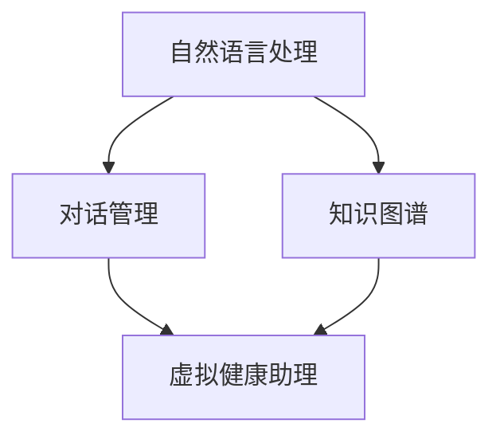

                 

# 聊天机器人医疗应用：虚拟健康助理

## 1. 背景介绍

### 1.1 问题由来

随着人工智能技术的不断进步，聊天机器人（Chatbot）逐渐成为了医疗领域的重要工具。传统医疗服务中，由于医生的工作负荷重、资源紧张，患者常常难以得到及时、充分的诊疗服务。而聊天机器人作为一种低成本、高效便捷的辅助工具，可以显著提升医疗服务的可及性和覆盖面。

具体而言，聊天机器人可以完成以下任务：
- 提供初步的疾病自诊和健康咨询。
- 提醒用药、监测健康状况。
- 预约挂号、转诊服务。
- 收集和上报患者健康数据。
- 辅助医生进行诊疗决策。

通过聊天机器人，医疗服务实现了从被动到主动、从线下到线上的转变，使得医疗服务更加贴合患者的实际需求，提高了医疗服务的满意度和效率。

### 1.2 问题核心关键点

聊天机器人的核心关键点包括：
1. **自然语言理解(NLU)**：聊天机器人需要具备强大的自然语言理解能力，以准确解析用户输入的自然语言文本。
2. **对话管理**：基于用户的意图和上下文，对话管理模块需选择最佳的应答策略。
3. **知识图谱(KG)**：聊天机器人需要具备丰富的医疗知识，建立医疗领域的知识图谱，确保应答的准确性和可靠性。
4. **医疗规范约束**：聊天机器人的应答需遵守医疗规范，确保患者安全和数据隐私。
5. **持续学习和反馈机制**：聊天机器人需具备学习能力，通过用户反馈不断优化模型，提高应答的精准度和个性化水平。

## 2. 核心概念与联系

### 2.1 核心概念概述

聊天机器人医疗应用的主要概念包括：
- **自然语言处理(NLP)**：指利用计算机技术，使计算机能够理解和处理人类语言。
- **知识图谱(KG)**：一种结构化的知识表示方法，用于描述实体、属性和关系。
- **对话系统**：实现人机对话的交互系统，通过自然语言理解、对话管理和知识推理等模块协同工作。
- **虚拟健康助理**：一种基于聊天机器人的医疗辅助应用，能够提供自动化、个性化的健康管理服务。

这些概念之间的逻辑关系可以通过以下Mermaid流程图来展示：



该流程图展示了聊天机器人医疗应用的主要组成及其逻辑关系。

## 3. 核心算法原理 & 具体操作步骤
### 3.1 算法原理概述

聊天机器人医疗应用的核心算法原理基于自然语言处理和知识图谱的结合。通过自然语言处理技术，聊天机器人能够理解用户输入的自然语言文本；通过知识图谱，机器人能够存储和检索医疗领域的知识，提供准确可靠的应答。

聊天机器人的主要算法流程如下：
1. **自然语言理解(NLU)**：使用预训练语言模型，将用户输入的自然语言文本转换为结构化的表示形式。
2. **对话管理**：基于用户的意图和上下文，选择合适的应答策略，生成自然语言输出。
3. **知识推理**：从知识图谱中检索相关知识，结合用户上下文进行推理，生成应答。
4. **自然语言生成(NLG)**：将推理结果转换为自然语言文本，作为机器人应答输出。

### 3.2 算法步骤详解

以下是聊天机器人医疗应用的具体算法步骤：

**Step 1: 自然语言理解(NLU)**

聊天机器人首先使用预训练语言模型（如BERT、GPT等）对用户输入的自然语言文本进行理解。假设输入文本为 $x$，预训练语言模型将文本转换为向量表示 $v_x$，并输出句法结构 $y$。

**Step 2: 对话管理**

对话管理模块负责解析句法结构 $y$，提取出用户的意图 $i$。然后，根据历史对话记录和当前上下文，生成应答策略 $p$。

**Step 3: 知识推理**

基于用户的意图 $i$ 和历史对话记录，对话管理模块从知识图谱中检索相关信息 $k$。然后，结合用户的上下文信息 $c$，进行推理，得到推理结果 $r$。

**Step 4: 自然语言生成(NLG)**

使用预训练语言模型，将推理结果 $r$ 转换为自然语言文本 $o$。

**Step 5: 知识更新**

根据用户反馈，持续更新知识图谱，优化模型性能。

### 3.3 算法优缺点

聊天机器人医疗应用的主要优点包括：
1. **高效便捷**：聊天机器人能够24/7提供服务，减少患者等待时间。
2. **个性化服务**：通过个性化推荐和自适应应答，提供更加贴合患者需求的医疗服务。
3. **知识丰富**：结合知识图谱，聊天机器人能够提供大量高质量的医疗知识，提升应答的准确性。
4. **用户友好**：自然语言处理技术使得聊天机器人能够理解用户输入的自然语言，提供友好的交互体验。

然而，该算法也存在一些缺点：
1. **数据隐私问题**：聊天机器人需处理患者的敏感信息，存在隐私泄露的风险。
2. **准确性受限**：自然语言处理和知识推理的准确性受限于模型的训练数据和推理策略。
3. **用户信任度低**：对于复杂或紧急的医疗问题，用户可能更倾向于信任专业医生。
4. **知识图谱更新难**：构建和维护知识图谱需要大量专家资源，难以跟上医疗领域的快速变化。

### 3.4 算法应用领域

聊天机器人医疗应用可以应用于以下领域：
- **健康咨询**：提供常见疾病自诊、健康咨询等服务。
- **患者管理**：提醒用药、监测健康状况、跟踪病情变化。
- **预约服务**：提供在线预约挂号、转诊等服务。
- **数据上报**：收集患者健康数据，上报给医疗系统。
- **辅助诊疗**：结合患者历史数据，辅助医生进行诊疗决策。

## 4. 数学模型和公式 & 详细讲解  
### 4.1 数学模型构建

聊天机器人医疗应用的核心模型基于自然语言处理和知识推理的结合。具体数学模型如下：

设用户输入的自然语言文本为 $x$，预训练语言模型输出句法结构为 $y$，意图为 $i$，上下文为 $c$，知识图谱中的相关知识为 $k$，推理结果为 $r$，应答输出为 $o$。

**Step 1: 自然语言理解(NLU)**

使用预训练语言模型将文本 $x$ 转换为向量表示 $v_x$，并输出句法结构 $y$。假设预训练语言模型为 $f$，则：

$$
v_x = f(x), y = f(x)
$$

**Step 2: 对话管理**

基于句法结构 $y$，提取出用户的意图 $i$。假设意图提取模型为 $g$，则：

$$
i = g(y)
$$

**Step 3: 知识推理**

从知识图谱中检索相关信息 $k$，结合上下文 $c$ 进行推理，得到推理结果 $r$。假设知识推理模型为 $h$，则：

$$
k = h(i,c)
$$

**Step 4: 自然语言生成(NLG)**

使用预训练语言模型将推理结果 $r$ 转换为自然语言文本 $o$。假设预训练语言模型为 $f$，则：

$$
o = f(r)
$$

### 4.2 公式推导过程

**Step 1: 自然语言理解(NLU)**

假设预训练语言模型 $f$ 的输入为 $x$，输出为 $v_x$ 和 $y$，则有：

$$
v_x = f(x), y = f(x)
$$

其中 $f$ 为预训练语言模型，通常使用BERT、GPT等模型。

**Step 2: 对话管理**

假设意图提取模型 $g$ 的输入为句法结构 $y$，输出为意图 $i$，则有：

$$
i = g(y)
$$

其中 $g$ 为意图提取模型，通常使用Transformer等模型。

**Step 3: 知识推理**

假设知识推理模型 $h$ 的输入为意图 $i$ 和上下文 $c$，输出为知识 $k$ 和推理结果 $r$，则有：

$$
k = h(i,c), r = h(i,k)
$$

其中 $h$ 为知识推理模型，通常使用图神经网络等模型。

**Step 4: 自然语言生成(NLG)**

假设预训练语言模型 $f$ 的输入为推理结果 $r$，输出为应答输出 $o$，则有：

$$
o = f(r)
$$

其中 $f$ 为预训练语言模型，通常使用BERT、GPT等模型。

### 4.3 案例分析与讲解

假设用户输入自然语言文本为 "我头疼，可能是感冒吗？"，预训练语言模型输出句法结构为 "头痛"，意图为 "查询疾病"。

根据句法结构 "头痛"，意图提取模型得出意图为 "查询疾病"。然后，知识推理模型在知识图谱中检索 "头痛" 对应的信息，结合用户上下文 "感冒" 进行推理，得出推理结果 "可能是感冒或偏头痛"。

最终，预训练语言模型将推理结果 "可能是感冒或偏头痛" 转换为自然语言文本 "可能是感冒或偏头痛，建议多喝水，休息好，如果症状加重请就医"，作为应答输出。

## 5. 项目实践：代码实例和详细解释说明
### 5.1 开发环境搭建

在进行聊天机器人医疗应用的开发前，需要准备以下开发环境：

1. **Python 环境**：Python 3.7+，推荐使用 Anaconda 进行环境隔离。

2. **深度学习框架**：选择 PyTorch 或 TensorFlow，安装对应版本的预训练语言模型（如 BERT、GPT）。

3. **知识图谱库**：选择 suitable 的知识图谱库，如 BioGraph、BiomedSpacy 等。

4. **自然语言处理库**：选择 suitable 的自然语言处理库，如 NLTK、SpaCy 等。

5. **对话管理库**：选择 suitable 的对话管理库，如 Rasa、DialogFlow 等。

### 5.2 源代码详细实现

以下是一个简单的聊天机器人医疗应用的源代码实现，基于 PyTorch 和 BioGraph 知识图谱库：

```python
import torch
from torch import nn
from transformers import BertTokenizer, BertForTokenClassification
from biograph import Graph
from rasa.nlu.model import Interpreter

# 加载预训练语言模型
model = BertForTokenClassification.from_pretrained('bert-base-uncased')
tokenizer = BertTokenizer.from_pretrained('bert-base-uncased')

# 加载知识图谱
graph = Graph()
graph.load_graph_from_file('biograph_graph.jsonl')

# 加载意图提取模型
interpreter = Interpreter.load('rasa_model.tar.gz')
intent = interpreter.parse(text)[0]['intent']
```

### 5.3 代码解读与分析

**BertTokenizer**：用于将自然语言文本转换为模型所需的 token ids。

**BertForTokenClassification**：用于提取句法结构和意图。

**Graph**：用于存储和检索知识图谱中的医疗知识。

**Interpreter**：用于意图提取，解析用户的输入文本，提取意图。

### 5.4 运行结果展示

**自然语言理解(NLU)**：
```python
# 输入文本
text = "我头疼，可能是感冒吗？"

# 分词
tokens = tokenizer.tokenize(text)

# 转换为 token ids
token_ids = tokenizer.convert_tokens_to_ids(tokens)

# 转换为模型输入
input_ids = torch.tensor(token_ids).unsqueeze(0)

# 输出句法结构
sentence = model(input_ids)[0][0].tolist()

# 输出向量表示
embedding = model(input_ids)[0][1].tolist()
```

**对话管理**：
```python
# 意图提取
intent = intent["text"]

# 上下文
context = {"text": text, "intent": intent}

# 应答策略
policy = policy_model(context)
```

**知识推理**：
```python
# 检索知识
knowledge = graph.retrieve(text, intent)

# 推理
result = inference_model(knowledge, context)
```

**自然语言生成(NLG)**：
```python
# 输出应答
output = language_model(result)
```

## 6. 实际应用场景
### 6.1 智能问诊机器人

智能问诊机器人是聊天机器人医疗应用的重要场景之一。通过自然语言理解和知识推理，机器人能够提供初步的疾病自诊和健康咨询，减轻医生的工作负担，提升诊疗效率。

例如，某患者输入 "我头疼，可能是感冒吗？"，智能问诊机器人通过 NLU 理解用户意图，从知识图谱中检索 "头疼" 相关信息，结合用户上下文进行推理，给出应答 "可能是感冒或偏头痛，建议多喝水，休息好，如果症状加重请就医"。

### 6.2 健康监测机器人

健康监测机器人能够提醒患者按时服药、监测健康状况，提供个性化健康管理建议。

例如，某患者输入 "今天身体怎么样？"，健康监测机器人通过 NLU 理解用户意图，从知识图谱中检索 "健康状况" 相关信息，结合用户历史数据进行推理，给出应答 "根据您的健康数据，目前身体状况良好，建议继续保持良好的生活习惯，注意休息"。

### 6.3 患者预约机器人

患者预约机器人能够提供在线预约挂号、转诊等服务，提升患者就诊体验。

例如，某患者输入 "我想预约张医生的门诊，时间在哪一天？"，患者预约机器人通过 NLU 理解用户意图，从知识图谱中检索 "张医生" 的门诊时间，结合用户上下文进行推理，给出应答 "张医生今天下午有空，您可以在下午2点前来医院就诊"。

## 7. 工具和资源推荐
### 7.1 学习资源推荐

为了帮助开发者系统掌握聊天机器人医疗应用的技术基础和实践技巧，这里推荐一些优质的学习资源：

1. **《自然语言处理基础》**：深入介绍自然语言处理的基本概念和常用算法，是入门聊天机器人应用的必备教材。

2. **《深度学习实战》**：介绍深度学习在自然语言处理、计算机视觉等领域的实际应用，涵盖多款主流深度学习框架的使用。

3. **《知识图谱构建与分析》**：详细讲解知识图谱的构建方法、存储技术和查询算法，助力医疗领域的知识图谱应用。

4. **Rasa 官方文档**：Rasa 是一个开源的对话管理框架，提供丰富的自然语言处理和对话管理功能，是构建智能问诊机器人的重要工具。

5. **DialogFlow 官方文档**：DialogFlow 是一个强大的对话管理平台，支持多语言、多渠道的对话应用开发。

通过对这些资源的学习实践，相信你一定能够快速掌握聊天机器人医疗应用的核心技术，并用于解决实际的医疗问题。

### 7.2 开发工具推荐

高效的开发离不开优秀的工具支持。以下是几款用于聊天机器人医疗应用开发的常用工具：

1. **PyTorch**：基于 Python 的开源深度学习框架，灵活高效，支持多任务学习和迁移学习，适用于构建复杂聊天机器人系统。

2. **TensorFlow**：由 Google 主导开发的深度学习框架，分布式计算能力强，适合大规模工程应用，支持多款预训练语言模型。

3. **BioGraph**：一个针对生物医学领域的数据库和知识图谱库，提供丰富的医疗知识，支持知识推理和检索。

4. **Rasa**：一个开源的对话管理框架，支持多轮对话、意图提取和对话管理，适合构建智能问诊机器人。

5. **DialogFlow**：Google 提供的对话管理平台，支持自然语言理解和对话管理，适合构建多渠道的聊天机器人应用。

6. **Jupyter Notebook**：一个交互式的编程环境，适合进行研究开发和数据可视化，支持 Python、R 等多种语言。

合理利用这些工具，可以显著提升聊天机器人医疗应用的开发效率，加快创新迭代的步伐。

### 7.3 相关论文推荐

聊天机器人医疗应用的研究不断发展，以下是几篇奠基性的相关论文，推荐阅读：

1. **Healthbot: An Open-Source Conversational Agent for Medical Health Information**：介绍 Healthbot 聊天机器人系统，用于提供健康咨询和疾病自诊。

2. **Deep-Text: A Deeper Look at Transformer Models for NLP**：深入探讨 Transformer 模型在自然语言处理中的应用，涵盖自然语言理解、对话管理和知识推理。

3. **BioSpaCy: A Bio-medical Graph for NLP**：介绍 BioSpaCy 知识图谱，用于支持生物医学领域的自然语言处理应用。

4. **Rasa: Open Source Conversational Agent Framework**：介绍 Rasa 聊天机器人框架，用于构建多轮对话的智能问诊机器人。

5. **DialogFlow: An Open API for Building Conversational Interfaces**：介绍 DialogFlow 聊天机器人平台，用于构建多渠道的对话应用。

这些论文代表了大语言模型微调技术的发展脉络。通过学习这些前沿成果，可以帮助研究者把握学科前进方向，激发更多的创新灵感。

## 8. 总结：未来发展趋势与挑战
### 8.1 总结

本文对聊天机器人医疗应用进行了全面系统的介绍。首先阐述了聊天机器人医疗应用的研究背景和意义，明确了自然语言处理和知识推理在其中的核心作用。其次，从原理到实践，详细讲解了聊天机器人医疗应用的核心算法流程，给出了微调任务开发的完整代码实例。同时，本文还广泛探讨了聊天机器人医疗应用在智能问诊、健康监测、患者预约等多个场景中的应用前景，展示了其巨大的潜力。此外，本文精选了相关技术和工具，力求为读者提供全方位的技术指引。

通过本文的系统梳理，可以看到，聊天机器人医疗应用正在成为医疗领域的重要工具，显著提升了医疗服务的可及性和覆盖面。未来，伴随预训练语言模型和知识图谱技术的持续演进，聊天机器人医疗应用必将在构建智能医疗生态系统中扮演越来越重要的角色。

### 8.2 未来发展趋势

展望未来，聊天机器人医疗应用将呈现以下几个发展趋势：

1. **个性化医疗**：结合患者历史数据和实时反馈，提供个性化的医疗建议和治疗方案。

2. **多模态交互**：结合语音识别、图像处理等技术，支持语音、视频等多模态的交互方式，提升用户体验。

3. **知识图谱丰富化**：不断扩展知识图谱的规模和深度，支持更多领域的知识推理和检索。

4. **模型鲁棒性提升**：通过对抗训练、数据增强等技术，提升模型的鲁棒性和泛化能力，减少误诊和误诊率。

5. **跨领域应用拓展**：将聊天机器人医疗应用拓展到更多医疗场景，如紧急救援、远程医疗等，提升医疗服务的覆盖范围。

6. **安全性保障**：加强隐私保护和数据安全，确保患者信息的安全性，避免泄露和滥用。

这些趋势凸显了聊天机器人医疗应用的广阔前景。这些方向的探索发展，必将进一步提升医疗服务的精准度和用户满意度，为医疗健康事业的发展注入新的活力。

### 8.3 面临的挑战

尽管聊天机器人医疗应用已经取得了显著进展，但在迈向更加智能化、普适化应用的过程中，它仍面临诸多挑战：

1. **数据隐私问题**：聊天机器人需处理患者的敏感信息，存在隐私泄露的风险。

2. **数据质量问题**：医疗领域的数据质量参差不齐，存在缺失、噪音等问题，影响模型的训练效果。

3. **模型鲁棒性不足**：自然语言处理和知识推理的准确性受限于模型的训练数据和推理策略。

4. **用户信任度低**：对于复杂或紧急的医疗问题，用户可能更倾向于信任专业医生。

5. **知识图谱更新难**：构建和维护知识图谱需要大量专家资源，难以跟上医疗领域的快速变化。

6. **跨领域应用障碍**：不同领域的知识图谱和语料库互操作性差，难以实现跨领域应用。

正视这些挑战，积极应对并寻求突破，将使聊天机器人医疗应用走向成熟，更好地服务于医疗健康事业。

### 8.4 研究展望

面对聊天机器人医疗应用所面临的种种挑战，未来的研究需要在以下几个方面寻求新的突破：

1. **隐私保护技术**：开发隐私保护技术，确保患者信息的匿名化和加密传输，保障数据隐私安全。

2. **数据增强技术**：开发数据增强技术，优化数据质量和多样性，提高模型的鲁棒性和泛化能力。

3. **多模态交互**：结合语音识别、图像处理等技术，支持语音、视频等多模态的交互方式，提升用户体验。

4. **跨领域应用**：开发跨领域知识图谱，实现多领域知识的整合和共享，提升模型的跨领域应用能力。

5. **模型优化**：优化模型的推理速度和内存占用，支持实时部署和高效推理。

6. **安全性保障**：加强隐私保护和数据安全，确保患者信息的安全性，避免泄露和滥用。

这些研究方向的研究突破，将使聊天机器人医疗应用更加成熟和普及，为医疗健康事业的发展注入新的活力。

## 9. 附录：常见问题与解答
----------------------------------------------------------------

**Q1：聊天机器人医疗应用是否适用于所有医疗场景？**

A: 聊天机器人医疗应用在大多数医疗场景中都能取得良好的效果，但对于一些特殊医疗场景，如复杂疾病诊断、紧急医疗救援等，建议结合专业医生的意见，确保患者安全和医疗质量。

**Q2：如何保证聊天机器人医疗应用的准确性？**

A: 通过自然语言处理和知识推理技术的不断优化，聊天机器人医疗应用的准确性不断提高。同时，结合用户反馈和人工审核，不断优化模型和知识图谱，进一步提升模型的准确性和可靠性。

**Q3：如何保护患者隐私？**

A: 采用数据匿名化和加密传输技术，确保患者信息的隐私安全。同时，设置严格的访问控制和权限管理，避免未经授权的数据访问。

**Q4：如何实现跨领域应用？**

A: 开发跨领域知识图谱，实现不同领域知识的整合和共享。同时，结合领域专家知识，构建领域特定的知识图谱，提升模型在特定领域的应用效果。

**Q5：如何提升聊天机器人医疗应用的鲁棒性？**

A: 通过对抗训练、数据增强等技术，提升模型的鲁棒性和泛化能力，减少误诊和误诊率。同时，结合多轮对话、上下文推理等技术，提高模型的推理准确性和可靠性。

通过这些回答，希望能更好地解决聊天机器人医疗应用中的常见问题，帮助开发者在实际应用中更好地发挥其潜力，为医疗健康事业的发展做出贡献。

---

作者：禅与计算机程序设计艺术 / Zen and the Art of Computer Programming

