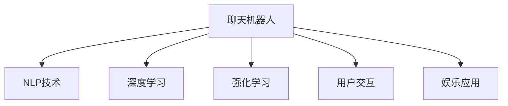

                 

# 聊天机器人娱乐应用：虚拟伴侣

> 关键词：聊天机器人,娱乐应用,虚拟伴侣,自然语言处理(NLP),深度学习,强化学习,用户交互,人工智能

## 1. 背景介绍

### 1.1 问题由来

在数字化时代，人们越来越多地依赖于智能设备和互联网来获取信息和娱乐。传统的聊天机器人已经无法满足人们对互动性和娱乐性的需求。基于深度学习和大数据技术的聊天机器人，凭借其强大的自然语言处理能力，能够更加智能地与用户互动，为用户提供个性化的娱乐服务。

虚拟伴侣是一种新兴的聊天机器人应用，其核心在于构建一个能够模拟人类情感、理解用户需求、提供个性化建议的智能模型。通过虚拟伴侣，用户可以获得更加贴心和有趣的用户体验，从而在虚拟世界中建立起紧密的联系。

### 1.2 问题核心关键点

虚拟伴侣聊天机器人的关键点包括：
- 自然语言处理(NLP)：通过语言模型、情感识别等技术，使机器人能够理解并生成自然语言，提高用户交互质量。
- 深度学习：使用神经网络模型进行用户行为预测、意图识别、对话管理等。
- 强化学习：通过与用户互动，不断优化对话策略，提升机器人互动的自然度和个性化水平。
- 用户交互：通过多轮对话、情感交流等方式，增强用户对聊天机器人的依赖和忠诚度。
- 娱乐应用：提供游戏、推荐系统、教育等内容，丰富用户体验。

这些关键点构成了虚拟伴侣聊天机器人应用的基石，共同推动了聊天机器人向更高层次的娱乐化发展。

## 2. 核心概念与联系

### 2.1 核心概念概述

为更好地理解虚拟伴侣聊天机器人的工作原理，本节将介绍几个密切相关的核心概念：

- 聊天机器人(Chatbot)：一种可以与人类进行自然语言交流的人工智能程序，能够执行特定任务或回答问题。
- 自然语言处理(NLP)：通过计算机理解、处理和生成自然语言的技术，包括文本分析、语音识别、机器翻译等。
- 深度学习(Deep Learning)：基于人工神经网络，通过多层非线性变换实现复杂特征学习的技术。
- 强化学习(Reinforcement Learning)：通过与环境交互，优化策略以获得最大奖励的机器学习方法。
- 用户交互(User Interaction)：指用户与系统之间的互动，包括输入、输出、反馈等环节。
- 娱乐应用(Entertainment Application)：提供游戏、音乐、电影等内容，丰富用户生活体验的互联网应用。

这些核心概念之间的逻辑关系可以通过以下Mermaid流程图来展示：



这个流程图展示聊天机器人应用的各个核心组件及其之间的联系：

1. 聊天机器人通过NLP技术理解用户输入，并生成自然语言输出。
2. 深度学习用于用户行为预测、意图识别等任务，提高对话的自然度和精准度。
3. 强化学习使聊天机器人不断优化对话策略，提升互动效果。
4. 用户交互是聊天机器人的核心任务，通过多轮对话和情感交流，增强用户粘性。
5. 娱乐应用丰富聊天机器人的功能，使其成为更加全面和有趣的用户伙伴。

## 3. 核心算法原理 & 具体操作步骤
### 3.1 算法原理概述

虚拟伴侣聊天机器人的核心算法原理主要基于自然语言处理和深度学习技术。其工作流程大致如下：

1. **用户输入理解**：使用NLP技术对用户输入进行分词、词性标注、句法分析等处理，理解用户意图和情感。
2. **行为预测与意图识别**：通过深度学习模型预测用户行为，识别用户意图。
3. **对话管理与生成**：根据意图生成合适的回应，进行对话管理，确保对话连贯性。
4. **情感识别与回应用户**：通过情感分析技术识别用户情感，生成符合情感的回应。
5. **娱乐推荐**：根据用户兴趣和行为，推荐游戏、电影、音乐等娱乐内容。

### 3.2 算法步骤详解

以下是虚拟伴侣聊天机器人的具体算法步骤：

**Step 1: 构建基础对话模型**

- 使用预训练的NLP模型（如BERT、GPT等）进行微调，使其能够理解自然语言输入。
- 设计对话管理模块，用于记录对话历史，管理对话流程。
- 构建情感分析模块，用于识别用户情感。

**Step 2: 用户行为预测与意图识别**

- 收集用户历史数据，使用深度学习模型进行用户行为预测，如下一步操作意图、情感状态等。
- 设计意图识别算法，从对话内容中提取关键信息，识别用户的查询意图。

**Step 3: 对话生成与回应用户**

- 根据意图和情感状态，生成合适的回应。
- 使用强化学习算法优化对话策略，提升对话的自然度和连贯性。
- 进行情感识别和回应用户，增强用户的情感体验。

**Step 4: 娱乐内容推荐**

- 收集用户兴趣和行为数据，使用推荐系统算法生成个性化内容推荐。
- 根据用户反馈，不断优化推荐算法，提高推荐的准确性和多样性。

### 3.3 算法优缺点

虚拟伴侣聊天机器人的算法具有以下优点：
1. 高度自然化的对话。通过深度学习和强化学习技术，虚拟伴侣能够进行高度自然化的对话，提升用户体验。
2. 多模态交互。结合语音、图像、视频等多种模态，提升交互的丰富性和多样性。
3. 个性化推荐。根据用户兴趣和行为数据，提供个性化的娱乐内容，满足用户多样化需求。
4. 大规模部署。使用预训练模型和微调技术，可以在短时间内构建高效、稳定的聊天机器人应用。

同时，该算法也存在一些缺点：
1. 数据依赖性强。需要大量高质量的数据进行模型训练，数据获取和标注成本高。
2. 隐私风险。在收集和处理用户数据时，需注意用户隐私保护。
3. 计算资源需求高。深度学习模型和强化学习算法对计算资源需求高，部署成本高。
4. 对抗攻击脆弱。对话模型容易受到对抗样本的攻击，可能产生不自然的对话。

尽管存在这些局限性，但虚拟伴侣聊天机器人的算法在提供高度自然化、个性化的娱乐应用方面具有显著优势，逐渐成为现代娱乐应用的重要组成部分。

### 3.4 算法应用领域

虚拟伴侣聊天机器人已经在多个领域得到了广泛应用，例如：

- 在线客服：提供7x24小时服务，减少人力成本，提升客户满意度。
- 社交平台：通过多轮对话和情感交流，增强用户粘性，提升平台活跃度。
- 教育应用：提供个性化学习建议，提升学习效果。
- 娱乐服务：推荐游戏、电影、音乐等娱乐内容，丰富用户体验。
- 健康咨询：提供心理支持和健康建议，提升用户健康水平。

## 4. 数学模型和公式 & 详细讲解  
### 4.1 数学模型构建

本节将使用数学语言对虚拟伴侣聊天机器人进行更加严格的刻画。

设用户输入为 $x_t$，机器人的输出为 $y_t$，状态为 $s_t$。则虚拟伴侣聊天机器人的工作过程可以用以下数学模型来描述：

- 输入理解模型：
  - 输入 $x_t$ 通过NLP模型转换为向量表示 $h_t$。
  - 输出为模型预测的用户意图 $i_t$。

- 行为预测模型：
  - 用户行为 $o_t$ 通过深度学习模型预测，生成下一步意图 $i_{t+1}$。

- 对话生成模型：
  - 根据当前意图 $i_t$ 和用户情感 $e_t$，生成回应 $y_t$。
  - 对话管理模块更新状态 $s_t$，维护对话连贯性。

- 情感识别模型：
  - 用户情感 $e_t$ 通过情感分析模型提取。

- 娱乐推荐模型：
  - 用户兴趣 $u_t$ 通过推荐系统模型预测，生成娱乐内容推荐列表 $r_t$。

### 4.2 公式推导过程

以用户行为预测和意图识别为例，推导相关的数学公式。

假设用户行为 $o_t$ 由用户历史操作数据 $D_t$ 决定，通过深度学习模型 $f$ 预测，得到下一步意图 $i_{t+1}$。公式如下：

$$
i_{t+1} = f(D_t)
$$

其中 $f$ 为深度学习模型，如RNN、LSTM、Transformer等。

用户意图 $i_t$ 根据输入 $x_t$ 通过NLP模型 $g$ 预测，公式如下：

$$
i_t = g(x_t)
$$

其中 $g$ 为预训练的NLP模型，如BERT、GPT等。

通过上述公式，我们可以得到虚拟伴侣聊天机器人的工作过程数学模型。进一步，可以使用强化学习算法优化对话策略，使得机器人在不断与用户交互中逐步提升其互动效果。

## 5. 项目实践：代码实例和详细解释说明
### 5.1 开发环境搭建

在进行虚拟伴侣聊天机器人项目开发前，我们需要准备好开发环境。以下是使用Python进行PyTorch开发的环境配置流程：

1. 安装Anaconda：从官网下载并安装Anaconda，用于创建独立的Python环境。

2. 创建并激活虚拟环境：
```bash
conda create -n pytorch-env python=3.8 
conda activate pytorch-env
```

3. 安装PyTorch：根据CUDA版本，从官网获取对应的安装命令。例如：
```bash
conda install pytorch torchvision torchaudio cudatoolkit=11.1 -c pytorch -c conda-forge
```

4. 安装必要库：
```bash
pip install numpy pandas scikit-learn scipy matplotlib torchtext transformers
```

完成上述步骤后，即可在`pytorch-env`环境中开始虚拟伴侣聊天机器人项目的开发。

### 5.2 源代码详细实现

以下是虚拟伴侣聊天机器人的Python代码实现，包括NLP模型微调、行为预测、对话生成、情感识别和娱乐推荐等模块：

```python
import torch
import torch.nn as nn
import torch.optim as optim
import torchtext
from transformers import BertTokenizer, BertModel

class ChatbotModel(nn.Module):
    def __init__(self, num_labels=2):
        super(ChatbotModel, self).__init__()
        self.bert = BertModel.from_pretrained('bert-base-uncased')
        self.classifier = nn.Linear(self.bert.config.hidden_size, num_labels)

    def forward(self, input_ids, attention_mask, labels=None):
        outputs = self.bert(input_ids, attention_mask=attention_mask)
        pooled_output = outputs.pooler_output
        logits = self.classifier(pooled_output)
        return logits

def train_model(model, optimizer, train_loader, num_epochs):
    device = torch.device('cuda') if torch.cuda.is_available() else torch.device('cpu')
    model.to(device)
    model.train()
    
    for epoch in range(num_epochs):
        for batch in train_loader:
            input_ids = batch['input_ids'].to(device)
            attention_mask = batch['attention_mask'].to(device)
            labels = batch['labels'].to(device)
            
            optimizer.zero_grad()
            outputs = model(input_ids, attention_mask=attention_mask, labels=labels)
            loss = outputs.loss
            loss.backward()
            optimizer.step()
            
    return model

# 用户行为预测
def predict_user_behavior(user_data, model):
    device = torch.device('cuda') if torch.cuda.is_available() else torch.device('cpu')
    model.to(device)
    model.eval()
    
    with torch.no_grad():
        input_ids = torch.tensor(user_data['input_ids'], dtype=torch.long, device=device)
        attention_mask = torch.tensor(user_data['attention_mask'], dtype=torch.long, device=device)
        outputs = model(input_ids, attention_mask=attention_mask)
        intent = outputs.argmax(dim=1)
    
    return intent

# 对话生成
def generate_response(user_input, model, tokenizer, num_return_sequences=1):
    device = torch.device('cuda') if torch.cuda.is_available() else torch.device('cpu')
    model.to(device)
    
    input_ids = tokenizer.encode_plus(user_input, return_tensors='pt', padding='max_length', max_length=128, truncation=True, return_attention_mask=True)[0].to(device)
    attention_mask = input_ids.to(device)
    with torch.no_grad():
        outputs = model.generate(input_ids, num_return_sequences=num_return_sequences, max_length=128, top_k=50, top_p=0.9, temperature=0.7)
    
    return tokenizer.decode(outputs[0], skip_special_tokens=True)

# 情感识别
def detect_emotion(text, model):
    device = torch.device('cuda') if torch.cuda.is_available() else torch.device('cpu')
    model.to(device)
    
    input_ids = torch.tensor(tokenizer.encode(text, return_tensors='pt', padding='max_length', max_length=128, truncation=True), dtype=torch.long).to(device)
    attention_mask = input_ids.to(device)
    with torch.no_grad():
        outputs = model(input_ids, attention_mask=attention_mask)
    
    return outputs.argmax(dim=1)

# 娱乐推荐
def recommend_entertainment(user_profile, model):
    device = torch.device('cuda') if torch.cuda.is_available() else torch.device('cpu')
    model.to(device)
    
    user_interest = torch.tensor(user_profile, dtype=torch.float).to(device)
    with torch.no_grad():
        outputs = model(user_interest)
    
    return outputs.argmax(dim=1)
```

### 5.3 代码解读与分析

让我们再详细解读一下关键代码的实现细节：

**ChatbotModel类**：
- 初始化模块，加载预训练的BERT模型和分类器。
- 前向传播函数，处理输入并输出分类结果。

**train_model函数**：
- 模型训练函数，对模型进行梯度下降更新。

**predict_user_behavior函数**：
- 使用微调的BERT模型对用户行为进行预测，输出预测意图。

**generate_response函数**：
- 生成回应函数，根据用户输入和微调模型生成自然语言回应。

**detect_emotion函数**：
- 情感识别函数，通过微调模型识别用户情感。

**recommend_entertainment函数**：
- 娱乐推荐函数，根据用户兴趣和微调模型推荐娱乐内容。

**代码运行**：
- 首先训练BERT模型，进行用户意图识别和情感识别的微调。
- 使用微调后的模型进行用户行为预测、对话生成和娱乐推荐。
- 通过这些模块的组合，构建完整的虚拟伴侣聊天机器人系统。

## 6. 实际应用场景
### 6.1 智能客服

虚拟伴侣聊天机器人在智能客服中的应用具有巨大的潜力。传统的客服系统依赖于人工客服，成本高、响应速度慢。而基于虚拟伴侣的聊天机器人，能够全天候提供服务，显著提升客户满意度。

在具体实现上，可以使用虚拟伴侣聊天机器人处理客户咨询和投诉。用户输入问题后，系统通过NLP技术理解用户意图，进行意图识别和情感分析，生成合适的回应。通过不断优化模型，可以使聊天机器人更加智能，提升客户体验。

### 6.2 社交平台

在社交平台上，虚拟伴侣聊天机器人可以提供多轮对话和情感交流，增强用户粘性。例如，用户可以在聊天机器人上分享生活点滴，机器人根据用户的兴趣和情感状态，提供个性化的回复和建议。这种个性化的互动，能够增强用户的社交体验，提升平台活跃度。

### 6.3 教育应用

在教育领域，虚拟伴侣聊天机器人可以辅助学生学习，提供个性化的学习建议。例如，用户输入学习问题后，系统通过NLP技术理解问题，进行意图识别和情感分析，生成合适的回答和推荐。通过不断优化模型，可以使聊天机器人更加智能，提升学习效果。

### 6.4 娱乐服务

在娱乐领域，虚拟伴侣聊天机器人可以提供游戏推荐、音乐推荐、电影推荐等服务。例如，用户输入娱乐需求后，系统通过微调模型预测用户兴趣，生成个性化推荐列表。这种个性化的娱乐服务，能够提升用户体验，增加用户粘性。

## 7. 工具和资源推荐
### 7.1 学习资源推荐

为了帮助开发者系统掌握虚拟伴侣聊天机器人的技术基础和实践技巧，这里推荐一些优质的学习资源：

1. 《自然语言处理入门》：由清华大学出版社出版的教材，系统介绍了自然语言处理的基本概念和算法。
2. 《深度学习基础》：由斯坦福大学开设的在线课程，全面介绍了深度学习的基本原理和应用。
3. 《强化学习教程》：由DeepMind的开源项目，提供了强化学习的系统教程和实践代码。
4. 《TensorFlow实战》：由Google出版社出版的书籍，详细介绍了TensorFlow的使用方法和实践案例。
5. 《PyTorch实战》：由Packt出版社出版的书籍，详细介绍了PyTorch的使用方法和实践案例。

通过对这些资源的学习实践，相信你一定能够快速掌握虚拟伴侣聊天机器人的技术基础，并用于解决实际的NLP问题。

### 7.2 开发工具推荐

高效的开发离不开优秀的工具支持。以下是几款用于虚拟伴侣聊天机器人开发的常用工具：

1. PyTorch：基于Python的开源深度学习框架，灵活动态的计算图，适合快速迭代研究。
2. TensorFlow：由Google主导开发的开源深度学习框架，生产部署方便，适合大规模工程应用。
3. Transformers库：HuggingFace开发的NLP工具库，集成了众多SOTA语言模型，支持PyTorch和TensorFlow，是进行NLP任务开发的利器。
4. Weights & Biases：模型训练的实验跟踪工具，可以记录和可视化模型训练过程中的各项指标，方便对比和调优。
5. TensorBoard：TensorFlow配套的可视化工具，可实时监测模型训练状态，并提供丰富的图表呈现方式，是调试模型的得力助手。

合理利用这些工具，可以显著提升虚拟伴侣聊天机器人项目的开发效率，加快创新迭代的步伐。

### 7.3 相关论文推荐

虚拟伴侣聊天机器人技术的发展源于学界的持续研究。以下是几篇奠基性的相关论文，推荐阅读：

1. Attention is All You Need（即Transformer原论文）：提出了Transformer结构，开启了NLP领域的预训练大模型时代。
2. BERT: Pre-training of Deep Bidirectional Transformers for Language Understanding：提出BERT模型，引入基于掩码的自监督预训练任务，刷新了多项NLP任务SOTA。
3. Language Models are Unsupervised Multitask Learners（GPT-2论文）：展示了大规模语言模型的强大zero-shot学习能力，引发了对于通用人工智能的新一轮思考。
4. Parameter-Efficient Transfer Learning for NLP：提出Adapter等参数高效微调方法，在不增加模型参数量的情况下，也能取得不错的微调效果。
5. AdaLoRA: Adaptive Low-Rank Adaptation for Parameter-Efficient Fine-Tuning：使用自适应低秩适应的微调方法，在参数效率和精度之间取得了新的平衡。

这些论文代表了大语言模型微调技术的发展脉络。通过学习这些前沿成果，可以帮助研究者把握学科前进方向，激发更多的创新灵感。

## 8. 总结：未来发展趋势与挑战
### 8.1 总结

本文对虚拟伴侣聊天机器人技术进行了全面系统的介绍。首先阐述了虚拟伴侣聊天机器人的研究背景和意义，明确了其在自然语言处理、深度学习和强化学习等领域的应用价值。其次，从原理到实践，详细讲解了虚拟伴侣聊天机器人的数学模型和核心算法，给出了完整的代码实例。同时，本文还广泛探讨了虚拟伴侣聊天机器人在智能客服、社交平台、教育应用、娱乐服务等多个领域的应用前景，展示了其巨大的潜力。此外，本文精选了虚拟伴侣聊天机器人技术的各类学习资源，力求为读者提供全方位的技术指引。

通过本文的系统梳理，可以看到，虚拟伴侣聊天机器人技术在提供自然化、个性化的娱乐应用方面具有显著优势，逐渐成为现代娱乐应用的重要组成部分。未来，伴随预训练语言模型和微调方法的持续演进，虚拟伴侣聊天机器人必将在更多领域得到应用，为传统行业数字化转型升级提供新的技术路径。

### 8.2 未来发展趋势

展望未来，虚拟伴侣聊天机器人技术将呈现以下几个发展趋势：

1. 多模态交互：结合语音、图像、视频等多种模态，提升交互的丰富性和多样性。
2. 跨平台部署：在智能家居、车载、穿戴设备等多个平台上部署聊天机器人，提供全方位的娱乐服务。
3. 个性化推荐：根据用户行为和偏好，提供更加精准、多样化的娱乐推荐。
4. 实时互动：通过实时语音识别和合成技术，实现更加自然的实时互动。
5. 情感驱动：结合情感分析技术，使聊天机器人更加人性化，能够更好地理解用户情感。

这些趋势凸显了虚拟伴侣聊天机器人技术的广阔前景。这些方向的探索发展，必将进一步提升聊天机器人的用户体验，推动NLP技术的产业化进程。

### 8.3 面临的挑战

尽管虚拟伴侣聊天机器人技术已经取得了显著成就，但在迈向更加智能化、普适化应用的过程中，它仍面临诸多挑战：

1. 数据依赖性强。需要大量高质量的数据进行模型训练，数据获取和标注成本高。
2. 隐私风险。在收集和处理用户数据时，需注意用户隐私保护。
3. 计算资源需求高。深度学习模型和强化学习算法对计算资源需求高，部署成本高。
4. 对抗攻击脆弱。对话模型容易受到对抗样本的攻击，可能产生不自然的对话。
5. 实时性能不足。在多轮对话和高并发情况下，系统的实时性能可能不足，影响用户体验。

尽管存在这些局限性，但虚拟伴侣聊天机器人技术的算法在提供高度自然化、个性化的娱乐应用方面具有显著优势，逐渐成为现代娱乐应用的重要组成部分。未来，伴随预训练语言模型和微调方法的持续演进，虚拟伴侣聊天机器人必将在更多领域得到应用，为传统行业数字化转型升级提供新的技术路径。

### 8.4 未来突破

面对虚拟伴侣聊天机器人技术所面临的种种挑战，未来的研究需要在以下几个方面寻求新的突破：

1. 探索无监督和半监督微调方法。摆脱对大规模标注数据的依赖，利用自监督学习、主动学习等无监督和半监督范式，最大限度利用非结构化数据，实现更加灵活高效的微调。
2. 研究参数高效和计算高效的微调范式。开发更加参数高效的微调方法，在固定大部分预训练参数的同时，只更新极少量的任务相关参数。同时优化微调模型的计算图，减少前向传播和反向传播的资源消耗，实现更加轻量级、实时性的部署。
3. 融合因果和对比学习范式。通过引入因果推断和对比学习思想，增强聊天机器人建立稳定因果关系的能力，学习更加普适、鲁棒的语言表征，从而提升模型泛化性和抗干扰能力。
4. 引入更多先验知识。将符号化的先验知识，如知识图谱、逻辑规则等，与神经网络模型进行巧妙融合，引导微调过程学习更准确、合理的语言模型。同时加强不同模态数据的整合，实现视觉、语音等多模态信息与文本信息的协同建模。
5. 结合因果分析和博弈论工具。将因果分析方法引入聊天机器人，识别出模型决策的关键特征，增强输出解释的因果性和逻辑性。借助博弈论工具刻画人机交互过程，主动探索并规避模型的脆弱点，提高系统稳定性。

这些研究方向的探索，必将引领虚拟伴侣聊天机器人技术迈向更高的台阶，为构建安全、可靠、可解释、可控的智能系统铺平道路。面向未来，虚拟伴侣聊天机器人技术还需要与其他人工智能技术进行更深入的融合，如知识表示、因果推理、强化学习等，多路径协同发力，共同推动自然语言理解和智能交互系统的进步。只有勇于创新、敢于突破，才能不断拓展聊天机器人的边界，让智能技术更好地造福人类社会。

## 9. 附录：常见问题与解答

**Q1：虚拟伴侣聊天机器人技术是否适用于所有娱乐应用场景？**

A: 虚拟伴侣聊天机器人技术可以应用于大多数娱乐应用场景，特别是需要智能互动和个性化的领域。但对于一些高度敏感、高风险的应用，如医疗诊断、金融交易等，需要谨慎应用。

**Q2：微调虚拟伴侣聊天机器人模型需要多少数据？**

A: 虚拟伴侣聊天机器人模型的微调需要大量高质量的数据。具体数据量取决于模型的复杂度和任务的难度，通常需要几万到数十万个训练样本。对于高需求的任务，如自然语言生成、情感分析等，需要更多数据进行微调。

**Q3：如何保护用户隐私？**

A: 在虚拟伴侣聊天机器人项目中，保护用户隐私至关重要。可以采取以下措施：
1. 数据匿名化：对用户数据进行匿名处理，确保数据不可识别。
2. 数据加密：在数据传输和存储过程中，采用加密技术保护用户隐私。
3. 合规性：遵循相关的隐私法规，如GDPR、CCPA等，确保数据处理符合法律要求。

**Q4：如何优化虚拟伴侣聊天机器人的实时性能？**

A: 优化虚拟伴侣聊天机器人的实时性能可以从以下几个方面入手：
1. 模型裁剪：去除不必要的层和参数，减小模型尺寸，加快推理速度。
2. 量化加速：将浮点模型转为定点模型，压缩存储空间，提高计算效率。
3. 服务化封装：将模型封装为标准化服务接口，便于集成调用。
4. 多模型集成：使用多个微调模型进行服务，提升系统的稳定性和响应速度。

**Q5：虚拟伴侣聊天机器人如何保持长期活跃度？**

A: 保持虚拟伴侣聊天机器人的长期活跃度需要不断优化用户体验和增加互动内容。具体措施包括：
1. 用户行为分析：通过分析用户行为和反馈，不断优化聊天机器人功能和内容。
2. 个性化推荐：根据用户兴趣和行为数据，提供个性化的娱乐推荐。
3. 定期更新：定期更新聊天机器人模型和内容，保持系统新鲜度。

---

作者：禅与计算机程序设计艺术 / Zen and the Art of Computer Programming

