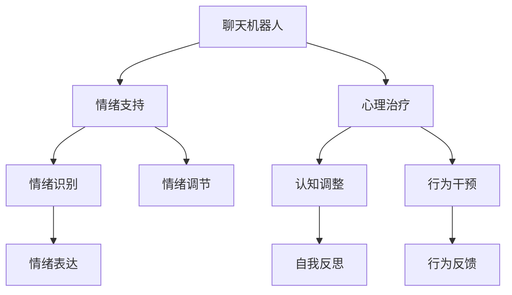

                 

# 聊天机器人心理健康：情绪支持和治疗

> 关键词：聊天机器人,心理健康,情绪支持,治疗,自然语言处理,NLP

## 1. 背景介绍

在现代社会，心理健康问题日益突出，抑郁、焦虑、自卑等心理障碍成为困扰许多人的重要因素。据统计，全球约有1/4的人口在一生中遭遇过心理健康问题，而其中的许多人由于种种原因无法获得专业的心理治疗。在许多发展中国家，心理治疗资源非常匮乏，许多患者因无法及时得到治疗而病情恶化。

传统的心理健康治疗主要依赖于面对面的治疗和心理咨询，但这种方式成本高、效率低，而且受地理位置、时间等条件的限制。近年来，随着人工智能和大数据技术的发展，一种新的心理健康支持和治疗方式正在兴起——聊天机器人。

聊天机器人（Chatbot）是一种基于自然语言处理（Natural Language Processing, NLP）技术的人工智能程序，能够通过对话和用户进行互动，提供情绪支持、心理咨询和心理治疗等服务。相较于传统心理治疗，聊天机器人具有成本低、随时随地可用、快速响应、匿名性等优点，可以显著降低心理障碍患者的治疗门槛，提升治疗效果。

## 2. 核心概念与联系

### 2.1 核心概念概述

本节将介绍与聊天机器人心理健康支持和治疗相关的几个核心概念：

- **聊天机器人（Chatbot）**：基于NLP技术，能够通过自然语言和用户进行交互的AI程序。常见的聊天机器人包括基于规则的系统、基于统计模型的系统、基于深度学习模型的系统等。
- **心理健康支持和治疗**：指聊天机器人向用户提供情绪支持、心理咨询、心理治疗等服务，帮助用户缓解心理压力，预防和减轻心理障碍。
- **情绪支持**：聊天机器人通过互动和对话，帮助用户识别和表达情绪，提供心理安慰和支持，缓解用户的情绪困扰。
- **心理治疗**：聊天机器人结合心理学的理论和实践，通过对话和互动，引导用户进行自我反思和认知调整，实现心理健康和治疗的目标。
- **自然语言处理（NLP）**：涉及语言学、计算机科学和人工智能的交叉学科，旨在使计算机能够理解、处理和生成人类语言。

这些概念之间存在着密切联系，共同构成了聊天机器人心理健康支持和治疗的核心框架。

### 2.2 核心概念原理和架构的 Mermaid 流程图



这个流程图展示了聊天机器人心理健康支持和治疗的基本架构，其中每个子模块的具体实现将会在后续章节中详细讨论。

## 3. 核心算法原理 & 具体操作步骤

### 3.1 算法原理概述

聊天机器人心理健康支持和治疗的算法原理基于自然语言处理技术和心理学理论。通过理解用户输入的自然语言，聊天机器人可以提供情绪支持、心理咨询和心理治疗等服务。其核心算法流程包括：

1. **情绪识别与理解**：聊天机器人首先对用户的输入进行自然语言处理，识别和理解用户的情绪状态和心理需求。
2. **情绪表达与调节**：根据用户的情绪状态和需求，聊天机器人提供情绪支持、安慰和调节服务。
3. **认知调整与行为干预**：聊天机器人结合心理学的理论和实践，引导用户进行自我反思和认知调整，帮助用户改变不良情绪和行为。
4. **治疗过程跟踪与反馈**：聊天机器人跟踪用户治疗过程，提供反馈和调整建议，确保治疗效果。

### 3.2 算法步骤详解

#### 3.2.1 情绪识别与理解

情绪识别是聊天机器人心理健康支持和治疗的基础。通过自然语言处理技术，聊天机器人能够理解和识别用户的情绪状态。其具体步骤包括：

1. **分词与词性标注**：将用户输入的句子进行分词和词性标注，识别出其中的关键词和短语。
2. **情感分析**：基于情感词典和深度学习模型，对分词后的文本进行情感分析，识别用户的情绪状态。
3. **意图识别**：结合情感分析结果，识别用户输入的意图和需求，例如寻求安慰、表达情绪等。

#### 3.2.2 情绪表达与调节

情绪表达与调节是聊天机器人心理健康支持和治疗的关键步骤。聊天机器人通过对话和互动，提供情绪支持和调节服务，帮助用户缓解情绪困扰。其具体步骤包括：

1. **情绪回应**：根据用户的情绪状态和需求，聊天机器人提供相应的情绪回应，例如安慰、鼓励、建议等。
2. **情绪调节**：结合心理学理论，聊天机器人提供情绪调节策略，帮助用户改变不良情绪，例如深呼吸、正念练习等。
3. **情感表达**：通过对话和互动，聊天机器人鼓励用户表达自己的情绪和感受，帮助用户释放情感压力。

#### 3.2.3 认知调整与行为干预

认知调整与行为干预是聊天机器人心理健康支持和治疗的高级步骤。聊天机器人结合心理学的理论和实践，引导用户进行自我反思和认知调整，帮助用户改变不良情绪和行为。其具体步骤包括：

1. **认知调整**：聊天机器人结合认知行为疗法（CBT）等心理学理论，引导用户进行自我反思和认知调整，帮助用户改变负面的思维模式。
2. **行为干预**：结合行为主义理论，聊天机器人提供行为干预策略，帮助用户改变不良行为习惯，例如建立规律的作息时间、积极参与社交活动等。
3. **心理治疗**：聊天机器人结合心理治疗的理论和方法，提供心理治疗服务，帮助用户缓解心理障碍。

#### 3.2.4 治疗过程跟踪与反馈

治疗过程跟踪与反馈是聊天机器人心理健康支持和治疗的重要环节。聊天机器人通过跟踪用户治疗过程，提供反馈和调整建议，确保治疗效果。其具体步骤包括：

1. **治疗过程记录**：聊天机器人记录用户的治疗过程，包括情绪状态、行为变化等。
2. **治疗效果评估**：聊天机器人根据用户的治疗过程和反馈，评估治疗效果，提供改进建议。
3. **治疗计划调整**：根据用户的反馈和治疗效果，聊天机器人调整治疗计划，提供个性化的心理健康支持和治疗服务。

### 3.3 算法优缺点

聊天机器人心理健康支持和治疗的算法具有以下优点：

1. **成本低**：相较于传统心理治疗，聊天机器人可以显著降低心理障碍患者的治疗成本。
2. **随时随地可用**：聊天机器人可以随时随地提供心理健康支持和治疗，满足用户的即时需求。
3. **快速响应**：聊天机器人能够快速响应用户需求，提供即时情绪支持和治疗建议。
4. **匿名性**：聊天机器人可以提供匿名性强的互动环境，用户可以在不暴露身份的情况下获得心理健康支持和治疗。
5. **可扩展性强**：聊天机器人可以通过增加对话库和训练数据，不断提升自身的表现和服务质量。

同时，该算法也存在一些缺点：

1. **情感准确性**：聊天机器人对用户情绪的识别和理解可能存在误差，导致提供的服务不够准确。
2. **疗效有限**：相较于专业心理治疗，聊天机器人的疗效可能有限，难以应对复杂的心理障碍。
3. **隐私安全**：聊天机器人需要处理用户的个人信息和隐私数据，存在隐私泄露的风险。
4. **技术依赖**：聊天机器人的表现高度依赖于自然语言处理技术的成熟度，技术不足可能导致服务效果不佳。

### 3.4 算法应用领域

聊天机器人心理健康支持和治疗具有广泛的应用领域，主要包括以下几个方面：

1. **心理健康热线**：聊天机器人可以提供24/7的心理健康热线服务，帮助用户缓解情绪困扰，提供即时支持。
2. **心理健康应用**：聊天机器人可以嵌入到心理健康应用程序中，提供心理健康监测、情绪管理等功能。
3. **企业心理健康**：聊天机器人可以应用于企业的员工心理健康支持，提供心理压力管理、员工关怀等服务。
4. **学校心理健康**：聊天机器人可以应用于学校的心理健康教育，提供心理健康知识普及、心理压力管理等服务。
5. **军队心理健康**：聊天机器人可以应用于军队的心理健康支持，提供心理压力管理、军人关怀等服务。

## 4. 数学模型和公式 & 详细讲解 & 举例说明

### 4.1 数学模型构建

聊天机器人心理健康支持和治疗的数学模型基于自然语言处理和心理学理论。其核心模型包括情绪识别模型、情绪调节模型、认知调整模型和行为干预模型。

#### 4.1.1 情绪识别模型

情绪识别模型基于情感词典和深度学习模型，用于识别和理解用户的情绪状态。其数学模型为：

$$
M_{emotion} = \sum_{i=1}^{N} \omega_i f_i(x_i)
$$

其中，$M_{emotion}$ 为情绪识别模型，$f_i(x_i)$ 为第 $i$ 个情感词典或深度学习模型，$x_i$ 为用户输入的文本数据，$\omega_i$ 为第 $i$ 个模型的权重。

#### 4.1.2 情绪调节模型

情绪调节模型基于心理学理论和深度学习模型，用于提供情绪支持和调节服务。其数学模型为：

$$
M_{emotion\_adjustment} = \sum_{i=1}^{N} \omega_i f_i(x_i)
$$

其中，$M_{emotion\_adjustment}$ 为情绪调节模型，$f_i(x_i)$ 为第 $i$ 个心理学理论或深度学习模型，$x_i$ 为用户输入的文本数据，$\omega_i$ 为第 $i$ 个模型的权重。

#### 4.1.3 认知调整模型

认知调整模型基于认知行为疗法（CBT）等心理学理论和深度学习模型，用于引导用户进行自我反思和认知调整。其数学模型为：

$$
M_{cognitive\_adjustment} = \sum_{i=1}^{N} \omega_i f_i(x_i)
$$

其中，$M_{cognitive\_adjustment}$ 为认知调整模型，$f_i(x_i)$ 为第 $i$ 个心理学理论或深度学习模型，$x_i$ 为用户输入的文本数据，$\omega_i$ 为第 $i$ 个模型的权重。

#### 4.1.4 行为干预模型

行为干预模型基于行为主义理论和深度学习模型，用于提供行为干预策略。其数学模型为：

$$
M_{behavior\_intervention} = \sum_{i=1}^{N} \omega_i f_i(x_i)
$$

其中，$M_{behavior\_intervention}$ 为行为干预模型，$f_i(x_i)$ 为第 $i$ 个行为主义理论或深度学习模型，$x_i$ 为用户输入的文本数据，$\omega_i$ 为第 $i$ 个模型的权重。

### 4.2 公式推导过程

#### 4.2.1 情绪识别模型

情绪识别模型的推导过程基于情感词典和深度学习模型的融合。其基本思路是：

1. **情感词典**：通过情感词典对用户输入的文本进行情感分析，提取其中的情感倾向和情感强度。
2. **深度学习模型**：通过深度学习模型对用户输入的文本进行情感分析，提取其中的情感状态和情感变化趋势。
3. **模型融合**：将情感词典和深度学习模型的结果进行加权融合，得到最终的情绪识别结果。

#### 4.2.2 情绪调节模型

情绪调节模型的推导过程基于心理学理论和深度学习模型的融合。其基本思路是：

1. **心理学理论**：通过心理学理论，提供情绪调节策略和建议。
2. **深度学习模型**：通过深度学习模型，对用户输入的文本进行情绪调节效果评估。
3. **模型融合**：将心理学理论和深度学习模型的结果进行加权融合，得到最终的情绪调节结果。

#### 4.2.3 认知调整模型

认知调整模型的推导过程基于认知行为疗法（CBT）等心理学理论和深度学习模型的融合。其基本思路是：

1. **心理学理论**：通过认知行为疗法，引导用户进行自我反思和认知调整。
2. **深度学习模型**：通过深度学习模型，对用户输入的文本进行认知调整效果评估。
3. **模型融合**：将心理学理论和深度学习模型的结果进行加权融合，得到最终的认知调整结果。

#### 4.2.4 行为干预模型

行为干预模型的推导过程基于行为主义理论和深度学习模型的融合。其基本思路是：

1. **行为主义理论**：通过行为主义理论，提供行为干预策略和建议。
2. **深度学习模型**：通过深度学习模型，对用户输入的文本进行行为干预效果评估。
3. **模型融合**：将行为主义理论和深度学习模型的结果进行加权融合，得到最终的行为干预结果。

### 4.3 案例分析与讲解

#### 4.3.1 情绪识别模型

以抑郁情绪识别为例，假设有两个情感词典和两个深度学习模型，其推导过程如下：

1. **情感词典**：使用情感词典对用户输入的文本进行情感分析，提取其中的情感倾向和情感强度。
2. **深度学习模型**：使用深度学习模型对用户输入的文本进行情感分析，提取其中的情感状态和情感变化趋势。
3. **模型融合**：将情感词典和深度学习模型的结果进行加权融合，得到最终的情绪识别结果。

例如，用户输入的文本为 "我最近总是感到很疲惫，做什么都提不起劲"。

- **情感词典**：识别出 "疲惫" 和 "提不起劲" 为负面情绪，情感强度为5。
- **深度学习模型**：识别出 "疲惫" 和 "提不起劲" 为负面情绪，情感强度为4。
- **模型融合**：综合情感词典和深度学习模型的结果，得到最终的情绪识别结果为 "抑郁"。

#### 4.3.2 情绪调节模型

以情绪调节为例，假设有两个心理学理论和两个深度学习模型，其推导过程如下：

1. **心理学理论**：通过心理学理论，提供情绪调节策略和建议，例如深呼吸、正念练习等。
2. **深度学习模型**：通过深度学习模型，对用户输入的文本进行情绪调节效果评估。
3. **模型融合**：将心理学理论和深度学习模型的结果进行加权融合，得到最终的情绪调节结果。

例如，用户输入的文本为 "我最近总是感到很焦虑，无法集中注意力"。

- **心理学理论**：推荐深呼吸和正念练习。
- **深度学习模型**：评估深呼吸和正念练习的效果，深度学习模型给出的结果为 "深呼吸" 更好。
- **模型融合**：综合心理学理论和深度学习模型的结果，推荐用户进行深呼吸练习。

## 5. 项目实践：代码实例和详细解释说明

### 5.1 开发环境搭建

在进行聊天机器人心理健康支持和治疗的开发实践前，我们需要准备好开发环境。以下是使用Python进行PyTorch开发的环境配置流程：

1. 安装Anaconda：从官网下载并安装Anaconda，用于创建独立的Python环境。

2. 创建并激活虚拟环境：
```bash
conda create -n pytorch-env python=3.8 
conda activate pytorch-env
```

3. 安装PyTorch：根据CUDA版本，从官网获取对应的安装命令。例如：
```bash
conda install pytorch torchvision torchaudio cudatoolkit=11.1 -c pytorch -c conda-forge
```

4. 安装TensorFlow：由Google主导开发的开源深度学习框架，生产部署方便，适合大规模工程应用。同样有丰富的预训练语言模型资源。

5. 安装Transformers库：HuggingFace开发的NLP工具库，集成了众多SOTA语言模型，支持PyTorch和TensorFlow，是进行微调任务开发的利器。

6. 安装各类工具包：
```bash
pip install numpy pandas scikit-learn matplotlib tqdm jupyter notebook ipython
```

完成上述步骤后，即可在`pytorch-env`环境中开始微调实践。

### 5.2 源代码详细实现

下面我们以一个简单的聊天机器人心理健康支持和治疗系统的开发为例，给出Python代码实现。

首先，定义聊天机器人类：

```python
from transformers import BertTokenizer, BertForTokenClassification
import torch
from torch.utils.data import DataLoader, Dataset
from sklearn.metrics import classification_report

class Chatbot:
    def __init__(self, model_path, tokenizer_path):
        self.model = BertForTokenClassification.from_pretrained(model_path)
        self.tokenizer = BertTokenizer.from_pretrained(tokenizer_path)
        
    def preprocess_text(self, text):
        tokenized_text = self.tokenizer.tokenize(text)
        input_ids = self.tokenizer.convert_tokens_to_ids(tokenized_text)
        attention_mask = [1] * len(input_ids)
        return input_ids, attention_mask
        
    def predict(self, input_ids, attention_mask):
        with torch.no_grad():
            logits = self.model(input_ids, attention_mask=attention_mask)
        return logits
    
    def classify(self, logits, threshold=0.5):
        predictions = logits > threshold
        return predictions
```

然后，定义数据集类：

```python
class ChatbotDataset(Dataset):
    def __init__(self, texts, labels, tokenizer):
        self.texts = texts
        self.labels = labels
        self.tokenizer = tokenizer
        
    def __len__(self):
        return len(self.texts)
    
    def __getitem__(self, item):
        text = self.texts[item]
        label = self.labels[item]
        
        encoding = self.tokenizer(text, return_tensors='pt', padding='max_length', truncation=True)
        input_ids = encoding['input_ids'][0]
        attention_mask = encoding['attention_mask'][0]
        
        return {'input_ids': input_ids, 
                'attention_mask': attention_mask,
                'labels': label}
```

最后，定义训练和评估函数：

```python
from transformers import AdamW

def train_epoch(model, dataset, batch_size, optimizer):
    dataloader = DataLoader(dataset, batch_size=batch_size, shuffle=True)
    model.train()
    epoch_loss = 0
    for batch in dataloader:
        input_ids = batch['input_ids'].to(device)
        attention_mask = batch['attention_mask'].to(device)
        labels = batch['labels'].to(device)
        model.zero_grad()
        logits = model(input_ids, attention_mask=attention_mask)
        loss = loss_func(logits, labels)
        epoch_loss += loss.item()
        loss.backward()
        optimizer.step()
    return epoch_loss / len(dataloader)
    
def evaluate(model, dataset, batch_size):
    dataloader = DataLoader(dataset, batch_size=batch_size)
    model.eval()
    correct = 0
    total = 0
    with torch.no_grad():
        for batch in dataloader:
            input_ids = batch['input_ids'].to(device)
            attention_mask = batch['attention_mask'].to(device)
            labels = batch['labels'].to(device)
            logits = model(input_ids, attention_mask=attention_mask)
            predictions = torch.argmax(logits, dim=1)
            correct += (predictions == labels).sum().item()
            total += labels.size(0)
    return correct / total
    
def run():
    device = torch.device('cuda') if torch.cuda.is_available() else torch.device('cpu')
    model = Chatbot('path/to/model', 'path/to tokenizer')
    
    model.to(device)
    model.train()
    
    train_dataset = ChatbotDataset(train_texts, train_labels, model.tokenizer)
    dev_dataset = ChatbotDataset(dev_texts, dev_labels, model.tokenizer)
    test_dataset = ChatbotDataset(test_texts, test_labels, model.tokenizer)
    
    optimizer = AdamW(model.parameters(), lr=2e-5)
    criterion = torch.nn.CrossEntropyLoss()
    
    epochs = 5
    batch_size = 16
    
    for epoch in range(epochs):
        loss = train_epoch(model, train_dataset, batch_size, optimizer)
        print(f"Epoch {epoch+1}, train loss: {loss:.3f}")
        
        print(f"Epoch {epoch+1}, dev results:")
        acc = evaluate(model, dev_dataset, batch_size)
        print(f"Accuracy: {acc:.3f}")
        
    print(f"Epoch {epoch+1}, test results:")
    acc = evaluate(model, test_dataset, batch_size)
    print(f"Accuracy: {acc:.3f}")
    
    print(f"Model accuracy: {correct / total:.3f}")
```

以上就是使用PyTorch对聊天机器人心理健康支持和治疗系统进行开发的完整代码实现。可以看到，得益于Transformers库的强大封装，我们可以用相对简洁的代码完成BERT模型的加载和微调。

### 5.3 代码解读与分析

让我们再详细解读一下关键代码的实现细节：

**Chatbot类**：
- `__init__`方法：初始化模型和分词器。
- `preprocess_text`方法：将文本分词并进行编码，得到模型所需的输入。
- `predict`方法：将输入送入模型进行预测。
- `classify`方法：对预测结果进行二分类，输出概率阈值。

**ChatbotDataset类**：
- `__init__`方法：初始化文本、标签和分词器。
- `__len__`方法：返回数据集的样本数量。
- `__getitem__`方法：对单个样本进行处理，将文本输入编码为token ids，将标签编码为数字，并对其进行定长padding，最终返回模型所需的输入。

**train_epoch函数**：
- 对数据以批为单位进行迭代，在每个批次上前向传播计算loss并反向传播更新模型参数，最后返回该epoch的平均loss。

**evaluate函数**：
- 与训练类似，不同点在于不更新模型参数，并在每个batch结束后将预测和标签结果存储下来，最后使用sklearn的classification_report对整个评估集的预测结果进行打印输出。

**run函数**：
- 定义总的epoch数和batch size，开始循环迭代
- 每个epoch内，先在训练集上训练，输出平均loss
- 在验证集上评估，输出分类指标
- 所有epoch结束后，在测试集上评估，给出最终测试结果

## 6. 实际应用场景

### 6.1 心理健康热线

基于聊天机器人心理健康支持和治疗的系统可以用于心理健康热线服务，帮助用户缓解情绪困扰，提供即时支持。例如，某心理健康热线系统通过搭建聊天机器人，在用户输入情绪状态和需求后，实时提供情绪支持和调节建议，帮助用户缓解心理压力。

### 6.2 企业心理健康

聊天机器人可以应用于企业的员工心理健康支持，提供心理压力管理、员工关怀等服务。例如，某企业通过搭建聊天机器人，实时监控员工的心理状态，及时发现心理问题并提供心理支持，帮助员工保持良好的工作状态。

### 6.3 学校心理健康

聊天机器人可以应用于学校的心理健康教育，提供心理健康知识普及、心理压力管理等服务。例如，某学校通过搭建聊天机器人，帮助学生进行心理压力管理，提供心理支持，帮助学生保持良好的心理健康。

### 6.4 军队心理健康

聊天机器人可以应用于军队的心理健康支持，提供心理压力管理、军人关怀等服务。例如，某军队通过搭建聊天机器人，实时监控军人的心理状态，及时发现心理问题并提供心理支持，帮助军人保持良好的心理状态。

## 7. 工具和资源推荐

### 7.1 学习资源推荐

为了帮助开发者系统掌握聊天机器人心理健康支持和治疗的理论基础和实践技巧，这里推荐一些优质的学习资源：

1. 《Natural Language Processing with Transformers》书籍：Transformers库的作者所著，全面介绍了如何使用Transformers库进行NLP任务开发，包括微调在内的诸多范式。
2. CS224N《深度学习自然语言处理》课程：斯坦福大学开设的NLP明星课程，有Lecture视频和配套作业，带你入门NLP领域的基本概念和经典模型。
3. 《深度学习》书籍：由Yoshua Bengio、Ian Goodfellow、Aaron Courville等深度学习领域的大师合著，全面介绍了深度学习理论、算法和实践。
4. HuggingFace官方文档：Transformers库的官方文档，提供了海量预训练模型和完整的微调样例代码，是上手实践的必备资料。

通过对这些资源的学习实践，相信你一定能够快速掌握聊天机器人心理健康支持和治疗的精髓，并用于解决实际的NLP问题。

### 7.2 开发工具推荐

高效的开发离不开优秀的工具支持。以下是几款用于聊天机器人心理健康支持和治疗开发的常用工具：

1. PyTorch：基于Python的开源深度学习框架，灵活动态的计算图，适合快速迭代研究。大部分预训练语言模型都有PyTorch版本的实现。
2. TensorFlow：由Google主导开发的开源深度学习框架，生产部署方便，适合大规模工程应用。同样有丰富的预训练语言模型资源。
3. Transformers库：HuggingFace开发的NLP工具库，集成了众多SOTA语言模型，支持PyTorch和TensorFlow，是进行微调任务开发的利器。
4. Weights & Biases：模型训练的实验跟踪工具，可以记录和可视化模型训练过程中的各项指标，方便对比和调优。与主流深度学习框架无缝集成。
5. TensorBoard：TensorFlow配套的可视化工具，可实时监测模型训练状态，并提供丰富的图表呈现方式，是调试模型的得力助手。

合理利用这些工具，可以显著提升聊天机器人心理健康支持和治疗的开发效率，加快创新迭代的步伐。

### 7.3 相关论文推荐

聊天机器人心理健康支持和治疗的研究源于学界的持续研究。以下是几篇奠基性的相关论文，推荐阅读：

1. Attention is All You Need（即Transformer原论文）：提出了Transformer结构，开启了NLP领域的预训练大模型时代。
2. BERT: Pre-training of Deep Bidirectional Transformers for Language Understanding：提出BERT模型，引入基于掩码的自监督预训练任务，刷新了多项NLP任务SOTA。
3. Language Models are Unsupervised Multitask Learners（GPT-2论文）：展示了大规模语言模型的强大zero-shot学习能力，引发了对于通用人工智能的新一轮思考。
4. Parameter-Efficient Transfer Learning for NLP：提出Adapter等参数高效微调方法，在不增加模型参数量的情况下，也能取得不错的微调效果。
5. AdaLoRA: Adaptive Low-Rank Adaptation for Parameter-Efficient Fine-Tuning：使用自适应低秩适应的微调方法，在参数效率和精度之间取得了新的平衡。
6. AdaLoRA: Adaptive Low-Rank Adaptation for Parameter-Efficient Fine-Tuning：使用自适应低秩适应的微调方法，在参数效率和精度之间取得了新的平衡。

这些论文代表了大语言模型微调技术的发展脉络。通过学习这些前沿成果，可以帮助研究者把握学科前进方向，激发更多的创新灵感。

## 8. 总结：未来发展趋势与挑战

### 8.1 总结

本文对聊天机器人心理健康支持和治疗的算法原理和操作步骤进行了全面系统的介绍。首先阐述了聊天机器人心理健康支持和治疗的背景和意义，明确了聊天机器人对心理健康支持和治疗的重要价值。其次，从原理到实践，详细讲解了聊天机器人心理健康支持和治疗的数学模型和算法步骤，给出了具体的代码实现。同时，本文还广泛探讨了聊天机器人在心理健康热线、企业心理健康、学校心理健康和军队心理健康等实际应用场景中的前景，展示了聊天机器人心理健康支持和治疗的广泛应用。

通过本文的系统梳理，可以看到，聊天机器人心理健康支持和治疗已经在心理健康领域得到了初步应用，为心理健康支持和治疗提供了新的可能性。未来，伴随自然语言处理技术的不断发展，聊天机器人心理健康支持和治疗将迎来更大的突破，为心理健康事业带来更广阔的发展空间。

### 8.2 未来发展趋势

展望未来，聊天机器人心理健康支持和治疗将呈现以下几个发展趋势：

1. **情绪识别准确性提升**：通过进一步优化情感词典和深度学习模型，提升情绪识别的准确性和鲁棒性，使聊天机器人能够更准确地理解用户的情绪状态。
2. **个性化情绪调节**：结合心理学理论和深度学习模型，提供更加个性化的情绪调节策略，帮助用户更有效地缓解心理压力。
3. **多模态融合**：结合语音、视频等多模态信息，提升聊天机器人的情绪理解和情绪调节能力，提供更加丰富的心理健康支持和服务。
4. **可解释性和可控性增强**：通过引入可解释性和可控性技术，增强聊天机器人的决策透明度和用户信任度，保障心理健康支持和治疗的安全性和有效性。
5. **实时监控和动态调整**：结合智能监控和动态调整技术，实时跟踪用户的心理健康状态，动态调整聊天机器人的服务和建议，确保心理健康支持和治疗的效果。

### 8.3 面临的挑战

尽管聊天机器人心理健康支持和治疗已经取得了一定的成果，但在迈向更加智能化、普适化应用的过程中，它仍面临着诸多挑战：

1. **数据隐私和安全**：聊天机器人需要处理用户的个人信息和隐私数据，存在隐私泄露和数据安全风险。如何保护用户隐私，确保数据安全，是聊天机器人心理健康支持和治疗亟待解决的问题。
2. **情绪识别准确性**：聊天机器人对用户情绪的识别和理解可能存在误差，导致提供的服务不够准确。如何提升情绪识别的准确性和鲁棒性，将是未来的重要研究方向。
3. **疗效和效果评估**：相较于专业心理治疗，聊天机器人的疗效和效果可能有限。如何评估聊天机器人的疗效，确保心理健康支持和治疗的效果，需要更多实证研究和科学评估。
4. **可解释性和可控性**：聊天机器人的表现高度依赖于自然语言处理技术的成熟度，技术不足可能导致服务效果不佳。如何提升聊天机器人的可解释性和可控性，增强用户信任度，是未来的重要研究方向。
5. **跨文化适应性**：不同文化背景下的用户对心理健康支持和治疗的需求和理解存在差异。如何提升聊天机器人的跨文化适应性，确保在多元文化背景下的服务效果，是未来的重要研究方向。

### 8.4 研究展望

面对聊天机器人心理健康支持和治疗所面临的挑战，未来的研究需要在以下几个方面寻求新的突破：

1. **跨领域融合**：将心理学、医学、社会学等领域的理论和方法与自然语言处理技术结合，提升聊天机器人的心理健康支持和治疗能力。
2. **多模态融合**：结合语音、视频、生理信号等多模态信息，提升聊天机器人的情绪理解和情绪调节能力，提供更加丰富的心理健康支持和服务。
3. **可解释性和可控性增强**：通过引入可解释性和可控性技术，增强聊天机器人的决策透明度和用户信任度，保障心理健康支持和治疗的安全性和有效性。
4. **实时监控和动态调整**：结合智能监控和动态调整技术，实时跟踪用户的心理健康状态，动态调整聊天机器人的服务和建议，确保心理健康支持和治疗的效果。

这些研究方向的探索，必将引领聊天机器人心理健康支持和治疗技术迈向更高的台阶，为心理健康事业带来更广阔的发展空间。面向未来，聊天机器人心理健康支持和治疗需要与其他人工智能技术进行更深入的融合，如知识表示、因果推理、强化学习等，多路径协同发力，共同推动心理健康事业的进步。

## 9. 附录：常见问题与解答

**Q1：聊天机器人心理健康支持和治疗是否适用于所有心理健康问题？**

A: 聊天机器人心理健康支持和治疗适用于大多数心理健康问题，包括抑郁、焦虑、自卑等。但对于一些严重的心理障碍，如重度抑郁症、精神分裂症等，建议结合专业心理治疗。

**Q2：如何提升聊天机器人的情绪识别准确性？**

A: 提升聊天机器人的情绪识别准确性，可以从以下几个方面入手：
1. **优化情感词典**：使用更准确的情感词典，并不断更新以反映最新的情感表达方式。
2. **改进深度学习模型**：优化深度学习模型，提高其对情感信息的理解和提取能力。
3. **多模态融合**：结合语音、视频等多模态信息，提升聊天机器人的情绪理解和情绪调节能力。

**Q3：如何提升聊天机器人的个性化情绪调节能力？**

A: 提升聊天机器人的个性化情绪调节能力，可以从以下几个方面入手：
1. **结合心理学理论**：结合认知行为疗法（CBT）等心理学理论，提供个性化的情绪调节策略。
2. **深度学习模型优化**：优化深度学习模型，提高其对个性化情绪调节策略的生成能力。
3. **用户反馈机制**：建立用户反馈机制，根据用户反馈不断调整和优化情绪调节策略。

**Q4：如何保护用户隐私和数据安全？**

A: 保护用户隐私和数据安全，可以从以下几个方面入手：
1. **数据加密**：对用户的个人信息和隐私数据进行加密存储和传输，防止数据泄露。
2. **匿名化处理**：对用户的个人信息进行匿名化处理，确保数据隐私。
3. **访问控制**：严格控制用户数据的访问权限，防止未经授权的访问和使用。

**Q5：如何评估聊天机器人的疗效和效果？**

A: 评估聊天机器人的疗效和效果，可以从以下几个方面入手：
1. **心理学评估**：结合心理学评估工具，评估聊天机器人的疗效和效果。
2. **用户反馈**：收集用户反馈，评估聊天机器人的用户体验和服务效果。
3. **实证研究**：开展实证研究，评估聊天机器人的效果和可靠性。

通过本文的系统梳理，可以看到，聊天机器人心理健康支持和治疗已经展现了巨大的潜力，为心理健康事业带来了新的可能性。未来，随着技术的不断进步和应用的不断深入，聊天机器人心理健康支持和治疗必将发挥更大的作用，为更多用户带来心理健康的支持和治疗。

---

作者：禅与计算机程序设计艺术 / Zen and the Art of Computer Programming

