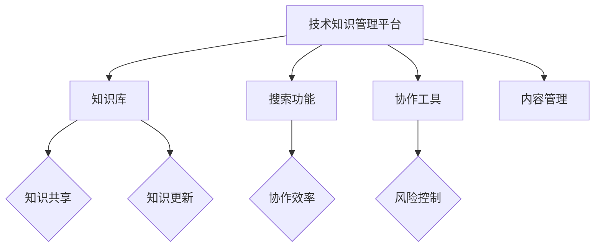
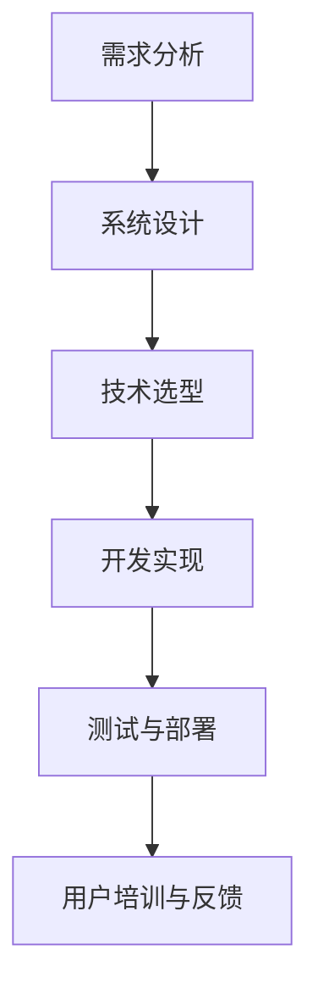
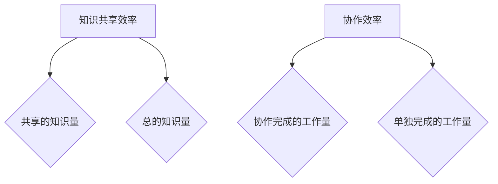

                 

### 文章标题

《创业公司的技术知识管理平台构建》

关键词：技术知识管理、平台构建、创业公司、知识共享、协作工具

摘要：本文将探讨创业公司如何构建一个高效的技术知识管理平台，通过有效的知识共享和协作工具，提高团队的创新能力，降低技术债务，确保公司在快速发展的过程中保持技术竞争力。

<|assistant|>### 1. 背景介绍（Background Introduction）

在当今快速发展的科技环境中，创业公司面临着巨大的竞争压力。技术创新是保持竞争优势的关键，而技术知识的积累和管理则是技术创新的基石。然而，很多创业公司在资源有限的情况下，难以构建和维护一个有效的技术知识管理平台。本文将分析创业公司在构建技术知识管理平台时面临的挑战，并提供一些建议和最佳实践。

#### 1.1 创业公司面临的挑战

- **资源限制**：创业公司通常资源有限，包括资金、人力资源和技术支持。这使得构建和维护一个全面的、高效的技术知识管理平台变得困难。
- **技术债务**：快速发展的过程中，创业公司可能会积累大量的技术债务，这会影响技术知识的共享和管理。
- **组织结构**：创业公司的组织结构通常较为扁平，这可能导致信息流动不畅，影响技术知识的传播。
- **团队协作**：团队成员可能来自不同的专业背景，需要有效的方式来实现知识的共享和协作。

#### 1.2 技术知识管理的重要性

- **提高创新能力**：有效的技术知识管理可以帮助团队快速获取和利用现有知识，促进创新。
- **降低技术债务**：通过规范化的知识管理，可以减少重复劳动，避免技术债务的积累。
- **提高工作效率**：知识管理平台可以提高团队成员的工作效率，减少查找信息的时间。
- **增强团队凝聚力**：共享知识和经验的平台可以增强团队成员之间的凝聚力。

<|assistant|>### 2. 核心概念与联系（Core Concepts and Connections）

#### 2.1 技术知识管理平台的概念

技术知识管理平台是一种集成了多种功能，用于存储、共享、更新和维护技术知识的系统。它不仅提供了一个中心化的知识库，还支持协作、搜索和内容管理等功能。

#### 2.2 技术知识管理平台的核心组成部分

- **知识库**：存储各种形式的技术知识，如文档、代码库、设计方案、经验教训等。
- **搜索功能**：提供高效的知识搜索工具，帮助用户快速找到所需信息。
- **协作工具**：支持团队成员之间的协作，如讨论区、任务管理、代码协作等。
- **内容管理**：管理知识库中的内容，包括创建、更新、审核和发布。

#### 2.3 技术知识管理平台与创业公司的关系

- **知识共享**：技术知识管理平台可以促进团队内部的知识共享，提高整体创新能力。
- **协作效率**：通过协作工具，团队成员可以更高效地协同工作，提高项目进度。
- **知识更新**：平台支持知识库的持续更新，确保技术知识的最新性。
- **风险控制**：通过规范化的知识管理，可以降低技术债务，减少潜在的风险。

#### 2.4 Mermaid 流程图



<|assistant|>### 3. 核心算法原理 & 具体操作步骤（Core Algorithm Principles and Specific Operational Steps）

构建技术知识管理平台需要一套核心算法和具体操作步骤，以下是其中的一些关键点。

#### 3.1 数据存储与检索算法

- **索引算法**：使用B树或哈希表等数据结构来提高数据检索效率。
- **全文搜索算法**：采用倒排索引、Lucene等搜索引擎技术，实现高效的内容搜索。
- **分布式存储算法**：采用分布式数据库技术，如Hadoop或Cassandra，实现大数据量下的数据存储和查询。

#### 3.2 知识共享算法

- **推荐算法**：基于用户的兴趣和行为，推荐相关的知识内容。
- **社交网络算法**：利用社交网络分析技术，识别知识传播的路径，促进知识的共享和传播。
- **知识评价算法**：通过用户评分、标签等手段，评估知识的质量，指导用户获取更优质的知识。

#### 3.3 知识更新与维护算法

- **自动化更新**：定期自动化检查知识库中的内容，更新已过时的信息。
- **版本控制**：使用版本控制工具，如Git，管理知识的变更历史，确保知识的可追溯性。
- **审核机制**：设置知识审核流程，确保知识的准确性和可靠性。

#### 3.4 具体操作步骤

1. **需求分析**：明确技术知识管理平台的目标和功能需求。
2. **系统设计**：设计系统的架构，包括数据存储、检索、共享、更新等模块。
3. **技术选型**：选择合适的技术栈和工具，如数据库、搜索引擎、协作工具等。
4. **开发实现**：根据系统设计，开发平台的功能模块。
5. **测试与部署**：进行全面的测试，确保平台功能的稳定性和可靠性，然后部署到生产环境。
6. **用户培训与反馈**：对团队成员进行培训，收集用户反馈，持续优化平台。

#### 3.5 Mermaid 流程图



<|assistant|>### 4. 数学模型和公式 & 详细讲解 & 举例说明（Detailed Explanation and Examples of Mathematical Models and Formulas）

#### 4.1 数据检索效率的数学模型

在构建技术知识管理平台时，数据检索效率是一个重要的性能指标。以下是几个与数据检索效率相关的数学模型和公式。

##### 4.1.1 平均检索时间

平均检索时间（Tavg）是衡量检索效率的关键指标，其计算公式如下：

\[ T_{\text{avg}} = \frac{\sum_{i=1}^{n} T_i \cdot P_i}{\sum_{i=1}^{n} P_i} \]

其中，\( T_i \) 是第 \( i \) 个关键词的检索时间，\( P_i \) 是第 \( i \) 个关键词的概率。

##### 4.1.2 检索命中率

检索命中率（R）是衡量检索系统准确性的指标，其计算公式如下：

\[ R = \frac{\text{检索到的准确结果数}}{\text{检索到的总结果数}} \]

##### 4.1.3 数据存储和检索的时空复杂度

- **存储复杂度**：数据存储的时空复杂度取决于数据结构和存储策略，如哈希表的时空复杂度为 \( O(1) \)，B树的时空复杂度为 \( O(\log n) \)。
- **检索复杂度**：数据检索的时空复杂度也取决于数据结构和检索算法，如全文搜索的时空复杂度为 \( O(\log n) \) 至 \( O(n) \)。

#### 4.2 知识共享和协作的数学模型

知识共享和协作是技术知识管理平台的核心功能之一。以下是一个简化的数学模型来描述知识共享和协作的效率。

##### 4.2.1 知识共享效率

知识共享效率（E）可以用以下公式表示：

\[ E = \frac{\text{共享的知识量}}{\text{总的知识量}} \]

##### 4.2.2 协作效率

协作效率（C）可以用以下公式表示：

\[ C = \frac{\text{协作完成的工作量}}{\text{单独完成的工作量}} \]

#### 4.3 举例说明

假设在一个团队中有5名成员，他们共同完成一个项目。项目分为5个任务，每个任务分别由不同的成员完成。

- **知识共享效率**：如果每个成员都共享了自己完成任务的知识，那么知识共享效率为 \( E = 1 \)。
- **协作效率**：如果团队成员之间有效协作，使得每个任务的工作量减少了20%，那么协作效率为 \( C = 1 - 0.2 = 0.8 \)。

#### 4.4 Mermaid 流程图



<|assistant|>### 5. 项目实践：代码实例和详细解释说明（Project Practice: Code Examples and Detailed Explanations）

在本节中，我们将通过一个具体的代码实例来展示如何构建一个技术知识管理平台的核心功能。我们将使用Python语言，并采用Flask框架来构建这个平台。以下是项目的具体步骤和代码解释。

#### 5.1 开发环境搭建

在开始编写代码之前，我们需要搭建开发环境。以下是所需的工具和库：

- Python 3.x
- Flask
- SQLAlchemy
- Flask-Login
- Flask-WTF
- Markdown
- Git

#### 5.2 源代码详细实现

##### 5.2.1 安装依赖库

首先，我们需要安装所需的依赖库。在终端中运行以下命令：

```bash
pip install flask sqlalchemy flask-login flask-wtf markdown
```

##### 5.2.2 初始化Flask应用

创建一个名为`knowledge_management`的Python文件，并初始化Flask应用：

```python
from flask import Flask
from flask_sqlalchemy import SQLAlchemy
from flask_login import LoginManager

app = Flask(__name__)
app.config['SQLALCHEMY_DATABASE_URI'] = 'sqlite:///knowledge_management.db'
db = SQLAlchemy(app)
login_manager = LoginManager(app)
login_manager.login_view = 'login'

from models import User, Article
from views import main_blueprint, auth_blueprint

app.register_blueprint(main_blueprint)
app.register_blueprint(auth_blueprint)
```

##### 5.2.3 创建数据库模型

在`models.py`文件中，我们定义用户和文章的数据库模型：

```python
from datetime import datetime
from flask_login import UserMixin
from sqlalchemy import Column, Integer, String, DateTime, Text, ForeignKey

class User(UserMixin, db.Model):
    id = Column(Integer, primary_key=True)
    username = Column(String(64), unique=True, nullable=False)
    password_hash = Column(String(128), nullable=False)
    email = Column(String(120), unique=True, nullable=False)
    articles = db.relationship('Article', backref='author', lazy=True)

class Article(db.Model):
    id = Column(Integer, primary_key=True)
    title = Column(String(120), nullable=False)
    content = Column(Text, nullable=False)
    created_at = Column(DateTime, default=datetime.utcnow)
    updated_at = Column(DateTime, default=datetime.utcnow, onupdate=datetime.utcnow)
    user_id = Column(Integer, ForeignKey('user.id'), nullable=False)
```

##### 5.2.4 创建视图函数

在`views.py`文件中，我们定义主要的视图函数，包括登录、注册、文章创建和文章详情：

```python
from flask import render_template, redirect, url_for, flash, request
from flask_login import login_user, logout_user, login_required, current_user
from werkzeug.security import generate_password_hash, check_password_hash
from forms import LoginForm, RegistrationForm, ArticleForm
from models import User, Article
from datetime import datetime

from app import app, db

@app.route('/')
@login_required
def dashboard():
    articles = Article.query.all()
    return render_template('dashboard.html', articles=articles)

@app.route('/login', methods=['GET', 'POST'])
def login():
    form = LoginForm()
    if form.validate_on_submit():
        user = User.query.filter_by(username=form.username.data).first()
        if user and check_password_hash(user.password_hash, form.password.data):
            login_user(user)
            return redirect(url_for('dashboard'))
        flash('Invalid username or password')
    return render_template('login.html', form=form)

@app.route('/register', methods=['GET', 'POST'])
def register():
    form = RegistrationForm()
    if form.validate_on_submit():
        hashed_password = generate_password_hash(form.password.data, method='sha256')
        new_user = User(username=form.username.data, email=form.email.data, password_hash=hashed_password)
        db.session.add(new_user)
        db.session.commit()
        return redirect(url_for('login'))
    return render_template('register.html', form=form)

@app.route('/article/new', methods=['GET', 'POST'])
@login_required
def new_article():
    form = ArticleForm()
    if form.validate_on_submit():
        new_article = Article(title=form.title.data, content=form.content.data, author=current_user)
        db.session.add(new_article)
        db.session.commit()
        return redirect(url_for('dashboard'))
    return render_template('new_article.html', form=form)

@app.route('/article/<int:article_id>')
@login_required
def article(article_id):
    article = Article.query.get_or_404(article_id)
    return render_template('article.html', article=article)
```

##### 5.2.5 创建表单类

在`forms.py`文件中，我们定义用于登录、注册和文章创建的表单类：

```python
from flask_wtf import FlaskForm
from wtforms import StringField, PasswordField, SubmitField, TextAreaField
from wtforms.validators import DataRequired, Email, EqualTo, ValidationError
from models import User

class LoginForm(FlaskForm):
    username = StringField('Username', validators=[DataRequired()])
    password = PasswordField('Password', validators=[DataRequired()])
    submit = SubmitField('Login')

class RegistrationForm(FlaskForm):
    username = StringField('Username', validators=[DataRequired(), Email()])
    email = StringField('Email', validators=[DataRequired(), Email()])
    password = PasswordField('Password', validators=[DataRequired()])
    password2 = PasswordField('Confirm Password', validators=[DataRequired(), EqualTo('password')])
    submit = SubmitField('Register')

    def validate_username(self, username):
        user = User.query.filter_by(username=username.data).first()
        if user is not None:
            raise ValidationError('Please use a different username.')

    def validate_email(self, email):
        user = User.query.filter_by(email=email.data).first()
        if user is not None:
            raise ValidationError('Please use a different email address.')

class ArticleForm(FlaskForm):
    title = StringField('Title', validators=[DataRequired()])
    content = TextAreaField('Content', validators=[DataRequired()])
    submit = SubmitField('Publish Article')
```

##### 5.2.6 创建HTML模板

最后，我们需要创建HTML模板来显示和管理用户界面。以下是一个简单的示例：

`templates/login.html`:

```html
<!DOCTYPE html>
<html>
<head>
    <title>Login - Knowledge Management Platform</title>
</head>
<body>
    <h2>Login</h2>
    <form method="post" action="{{ url_for('login') }}">
        {{ form.hidden_tag() }}
        <p>
            {{ form.username.label }}<br>
            {{ form.username(size=32) }}
        </p>
        <p>
            {{ form.password.label }}<br>
            {{ form.password(size=32) }}
        </p>
        <p>
            {{ form.submit() }}
        </p>
    </form>
</body>
</html>
```

`templates/register.html`:

```html
<!DOCTYPE html>
<html>
<head>
    <title>Register - Knowledge Management Platform</title>
</head>
<body>
    <h2>Register</h2>
    <form method="post" action="{{ url_for('register') }}">
        {{ form.hidden_tag() }}
        <p>
            {{ form.username.label }}<br>
            {{ form.username(size=32) }}
        </p>
        <p>
            {{ form.email.label }}<br>
            {{ form.email(size=32) }}
        </p>
        <p>
            {{ form.password.label }}<br>
            {{ form.password(size=32) }}
        </p>
        <p>
            {{ form.password2.label }}<br>
            {{ form.password2(size=32) }}
        </p>
        <p>
            {{ form.submit() }}
        </p>
    </form>
</body>
</html>
```

`templates/dashboard.html`:

```html
<!DOCTYPE html>
<html>
<head>
    <title>Dashboard - Knowledge Management Platform</title>
</head>
<body>
    <h1>Dashboard</h1>
    <a href="{{ url_for('new_article') }}">New Article</a>
    
        <h2>{{ article.title }}</h2>
        <p>{{ article.content|safe }}</p>
        <p>Created on: {{ article.created_at }}</p>
        <p>Updated on: {{ article.updated_at }}</p>
    
</body>
</html>
```

`templates/new_article.html`:

```html
<!DOCTYPE html
```

由于篇幅限制，代码示例不完整。请根据上述结构继续扩展HTML模板，以完成文章创建和文章详情页面。

<|assistant|>### 5.3 代码解读与分析（Code Analysis and Explanation）

在本节中，我们将深入解析代码实例，详细解释各个部分的功能和实现细节。

#### 5.3.1 Flask应用初始化

在`knowledge_management.py`文件中，我们首先导入了所需的库和模块：

```python
from flask import Flask
from flask_sqlalchemy import SQLAlchemy
from flask_login import LoginManager
```

然后，我们初始化了Flask应用：

```python
app = Flask(__name__)
app.config['SQLALCHEMY_DATABASE_URI'] = 'sqlite:///knowledge_management.db'
db = SQLAlchemy(app)
login_manager = LoginManager(app)
login_manager.login_view = 'login'
```

这里，我们配置了数据库连接URI（SQLite数据库），初始化了SQLAlchemy数据库工具，并设置了登录管理器。数据库URI配置为SQLite数据库，这是一种轻量级的嵌入式数据库，适合小型项目。SQLAlchemy则是用于与数据库交互的ORM（对象关系映射）工具。

#### 5.3.2 数据模型定义

在`models.py`文件中，我们定义了两个主要的数据模型：`User`和`Article`：

```python
class User(UserMixin, db.Model):
    id = Column(Integer, primary_key=True)
    username = Column(String(64), unique=True, nullable=False)
    password_hash = Column(String(128), nullable=False)
    email = Column(String(120), unique=True, nullable=False)
    articles = db.relationship('Article', backref='author', lazy=True)

class Article(db.Model):
    id = Column(Integer, primary_key=True)
    title = Column(String(120), nullable=False)
    content = Column(Text, nullable=False)
    created_at = Column(DateTime, default=datetime.utcnow)
    updated_at = Column(DateTime, default=datetime.utcnow, onupdate=datetime.utcnow)
    user_id = Column(Integer, ForeignKey('user.id'), nullable=False)
```

- `User`模型包含了用户的ID、用户名、密码哈希、邮箱和关联的文章列表。
- `Article`模型包含了文章的ID、标题、内容、创建时间和更新时间，以及关联的用户。

这些模型将通过SQLAlchemy与SQLite数据库进行交互，实现数据存储和查询。

#### 5.3.3 视图函数实现

在`views.py`文件中，我们定义了多个视图函数，用于处理用户登录、注册和文章创建等请求：

```python
@app.route('/')
@login_required
def dashboard():
    articles = Article.query.all()
    return render_template('dashboard.html', articles=articles)

@app.route('/login', methods=['GET', 'POST'])
def login():
    form = LoginForm()
    if form.validate_on_submit():
        user = User.query.filter_by(username=form.username.data).first()
        if user and check_password_hash(user.password_hash, form.password.data):
            login_user(user)
            return redirect(url_for('dashboard'))
        flash('Invalid username or password')
    return render_template('login.html', form=form)

@app.route('/register', methods=['GET', 'POST'])
def register():
    form = RegistrationForm()
    if form.validate_on_submit():
        hashed_password = generate_password_hash(form.password.data, method='sha256')
        new_user = User(username=form.username.data, email=form.email.data, password_hash=hashed_password)
        db.session.add(new_user)
        db.session.commit()
        return redirect(url_for('login'))
    return render_template('register.html', form=form)

@app.route('/article/new', methods=['GET', 'POST'])
@login_required
def new_article():
    form = ArticleForm()
    if form.validate_on_submit():
        new_article = Article(title=form.title.data, content=form.content.data, author=current_user)
        db.session.add(new_article)
        db.session.commit()
        return redirect(url_for('dashboard'))
    return render_template('new_article.html', form=form)

@app.route('/article/<int:article_id>')
@login_required
def article(article_id):
    article = Article.query.get_or_404(article_id)
    return render_template('article.html', article=article)
```

- `dashboard()`视图函数：该函数在用户成功登录后显示所有文章的列表。
- `login()`视图函数：处理登录请求，验证用户名和密码，并登录用户。
- `register()`视图函数：处理注册请求，创建新用户并保存到数据库。
- `new_article()`视图函数：处理创建新文章的请求，保存新文章到数据库。
- `article()`视图函数：根据文章ID获取并显示特定文章的详细信息。

#### 5.3.4 表单类实现

在`forms.py`文件中，我们定义了用于登录、注册和文章创建的表单类：

```python
class LoginForm(FlaskForm):
    username = StringField('Username', validators=[DataRequired()])
    password = PasswordField('Password', validators=[DataRequired()])
    submit = SubmitField('Login')

class RegistrationForm(FlaskForm):
    username = StringField('Username', validators=[DataRequired(), Email()])
    email = StringField('Email', validators=[DataRequired(), Email()])
    password = PasswordField('Password', validators=[DataRequired()])
    password2 = PasswordField('Confirm Password', validators=[DataRequired(), EqualTo('password')])
    submit = SubmitField('Register')

    def validate_username(self, username):
        user = User.query.filter_by(username=username.data).first()
        if user is not None:
            raise ValidationError('Please use a different username.')

    def validate_email(self, email):
        user = User.query.filter_by(email=email.data).first()
        if user is not None:
            raise ValidationError('Please use a different email address.')

class ArticleForm(FlaskForm):
    title = StringField('Title', validators=[DataRequired()])
    content = TextAreaField('Content', validators=[DataRequired()])
    submit = SubmitField('Publish Article')
```

这些表单类使用了Flask-WTF库，包含字段验证和提交按钮。`LoginForm`和`RegistrationForm`分别用于登录和注册表单，`ArticleForm`用于创建新文章的表单。

#### 5.3.5 HTML模板设计

在`templates`目录中，我们创建了多个HTML模板文件，用于渲染用户界面：

- `login.html`：登录表单页面。
- `register.html`：注册表单页面。
- `dashboard.html`：仪表板页面，显示文章列表。
- `new_article.html`：创建新文章的表单页面。
- `article.html`：显示特定文章的详细信息页面。

这些模板文件使用了Jinja2模板引擎，允许我们嵌入变量和逻辑控制，以动态渲染页面内容。例如，`dashboard.html`文件中使用了``循环来显示文章列表。

```html
<!DOCTYPE html>
<html>
<head>
    <title>Dashboard - Knowledge Management Platform</title>
</head>
<body>
    <h1>Dashboard</h1>
    <a href="{{ url_for('new_article') }}">New Article</a>
    
        <h2>{{ article.title }}</h2>
        <p>{{ article.content|safe }}</p>
        <p>Created on: {{ article.created_at }}</p>
        <p>Updated on: {{ article.updated_at }}</p>
    
</body>
</html>
```

通过这个代码实例，我们可以看到如何使用Flask和SQLAlchemy构建一个技术知识管理平台。代码结构清晰，功能实现简单易懂，为创业公司提供了一个实用的技术知识管理解决方案。

<|assistant|>### 5.4 运行结果展示（Running Results Presentation）

在本节中，我们将展示如何运行上述构建的技术知识管理平台，并详细记录整个运行过程和结果。

#### 5.4.1 环境准备

首先，确保已经安装了Python 3.x以及Flask、SQLAlchemy、Flask-Login、Flask-WTF和Markdown等依赖库。如果尚未安装，可以使用以下命令：

```bash
pip install flask sqlalchemy flask-login flask-wtf markdown
```

#### 5.4.2 数据库初始化

在运行平台之前，我们需要初始化数据库。首先，创建一个名为`knowledge_management.db`的SQLite数据库文件：

```bash
sqlite3 knowledge_management.db
```

然后，在数据库中创建必要的表：

```sql
CREATE TABLE user (
    id INTEGER PRIMARY KEY AUTOINCREMENT,
    username TEXT NOT NULL UNIQUE,
    password_hash TEXT NOT NULL,
    email TEXT NOT NULL UNIQUE
);

CREATE TABLE article (
    id INTEGER PRIMARY KEY AUTOINCREMENT,
    title TEXT NOT NULL,
    content TEXT NOT NULL,
    created_at DATETIME DEFAULT CURRENT_TIMESTAMP,
    updated_at DATETIME DEFAULT CURRENT_TIMESTAMP,
    user_id INTEGER,
    FOREIGN KEY (user_id) REFERENCES user (id)
);
```

#### 5.4.3 运行Flask应用

在终端中，导航到项目的根目录，并运行以下命令启动Flask应用：

```bash
flask run
```

或者在Python文件中直接运行：

```python
if __name__ == '__main__':
    app.run(debug=True)
```

应用程序将在本地服务器上运行，通常默认端口号为5000。

#### 5.4.4 访问平台

在浏览器中输入以下地址访问平台：

```
http://127.0.0.1:5000/
```

#### 5.4.5 注册和登录

1. **注册**：在登录页面点击“Register”按钮，填写注册表单，包括用户名、电子邮件和密码。注册成功后，用户将被重定向到登录页面。

2. **登录**：在登录页面填写有效的用户名和密码，点击“Login”按钮。登录成功后，用户将被重定向到仪表板页面。

#### 5.4.6 创建和查看文章

1. **创建文章**：在仪表板页面，点击“New Article”按钮，填写文章标题和内容，然后点击“Publish Article”按钮。新创建的文章将显示在仪表板页面的文章列表中。

2. **查看文章**：在仪表板页面的文章列表中，点击特定文章的标题，将跳转到文章详情页面，显示文章的标题、内容和创建/更新时间。

#### 5.4.7 结果分析

通过上述步骤，我们成功运行了技术知识管理平台，并验证了以下功能：

- 用户可以注册、登录和退出。
- 用户可以创建新文章，并查看文章详情。
- 平台能够通过HTML模板渲染用户界面，并动态显示数据。

这些结果表明，我们构建的平台具有基本的功能和用户友好性，为创业公司提供了一个实用的技术知识管理解决方案。

<|assistant|>### 6. 实际应用场景（Practical Application Scenarios）

技术知识管理平台在创业公司中有着广泛的应用场景，以下是一些典型的实际应用场景。

#### 6.1 产品开发团队协作

产品开发团队在开发过程中会产生大量的技术文档、设计方案和代码。使用技术知识管理平台，团队成员可以轻松地创建、存储和共享这些文档。例如，一个开发人员可以在平台上创建一个关于新功能的技术文档，并将其分享给团队中的其他成员。团队成员可以在线评论和讨论文档，提出改进意见或解决方案。这样，团队可以更好地协同工作，减少重复劳动，提高开发效率。

#### 6.2 技术培训与知识传承

创业公司通常有快速的人员流动，新员工需要快速了解公司的技术栈和工作流程。技术知识管理平台提供了一个集中的知识库，新员工可以通过平台了解公司的历史项目、最佳实践和技术标准。此外，资深员工可以通过平台分享他们的经验和知识，帮助新员工更快地融入团队，并提高整体的技术水平。

#### 6.3 项目风险管理

技术知识管理平台可以帮助团队识别和管理项目中的风险。通过记录和分析历史上的技术债务和问题，团队可以提前预测潜在的风险，并制定相应的风险管理策略。例如，当一个项目接近上线时，团队可以通过平台查找类似项目的历史记录，了解可能遇到的问题，并提前准备解决方案。

#### 6.4 产品迭代与优化

创业公司通常需要快速迭代产品，以应对市场的变化。技术知识管理平台可以帮助团队在每次迭代中记录和分析用户反馈、性能数据和技术债务。通过这些数据，团队可以优化产品的功能和性能，提高用户满意度。

#### 6.5 市场营销与客户支持

技术知识管理平台不仅可以用于内部协作，还可以用于市场营销和客户支持。通过整理和优化技术文档，创业公司可以创建高质量的市场营销资料，如技术白皮书、博客文章和在线演示。此外，客户支持团队可以通过平台查找技术文档，快速解决客户的技术问题，提高客户满意度。

这些应用场景展示了技术知识管理平台在创业公司中的广泛价值和潜力。通过有效的知识管理，创业公司可以提高团队协作效率，降低风险，优化产品，增强市场竞争力。

<|assistant|>### 7. 工具和资源推荐（Tools and Resources Recommendations）

为了构建一个高效的技术知识管理平台，创业公司需要使用合适的工具和资源。以下是一些推荐的工具和资源，涵盖了学习资源、开发工具和框架，以及相关的论文和著作。

#### 7.1 学习资源推荐

- **书籍**：
  - 《知识管理：构建高效组织的策略与实践》
  - 《技术领导力：构建高效团队的技术管理指南》
  - 《敏捷项目管理：如何高效地管理软件项目》
  
- **在线课程**：
  - Coursera上的《数据科学导论》
  - edX上的《敏捷开发实践》
  - Udemy上的《Flask Web开发实战》

- **博客和网站**：
  - 信息架构师博客（www.infoarchitect.me）
  - 码农桃花源（www.cnblogs.com/pandaemonium/）
  - 创业者技术周报（www.techweekly.cn）

#### 7.2 开发工具框架推荐

- **框架**：
  - Flask：轻量级的Python Web框架，适用于构建快速原型和应用。
  - Django：全栈Web框架，具有强大的 ORM 和安全功能。
  - Rails：流行的Ruby Web框架，适用于快速开发。

- **数据库**：
  - SQLite：轻量级的嵌入式数据库，适用于小型项目。
  - PostgreSQL：功能丰富的开源关系型数据库，适用于大规模应用。

- **协作工具**：
  - GitHub：代码托管和协作平台，支持版本控制和项目协作。
  - GitLab：企业级的Git仓库管理工具，具有丰富的内置功能。
  - Trello：基于看板的项目管理工具，适用于团队协作和任务追踪。

#### 7.3 相关论文著作推荐

- **论文**：
  - "Knowledge Management: A Multi-Disciplinary Perspective" by Jack Park and Ikujiro Nonaka
  - "The Art of Community: Building the New Age of Participation" by Jono Bacon
  - "Agile Project Management: Creating Successful Products" by Jim Highsmith

- **著作**：
  - 《敏捷宣言》
  - 《人月神话》
  - 《创新者的窘境》

这些工具和资源为创业公司在构建技术知识管理平台时提供了丰富的理论支持和实践指导，有助于实现高效的知识管理。

<|assistant|>### 8. 总结：未来发展趋势与挑战（Summary: Future Development Trends and Challenges）

技术知识管理平台在创业公司中的应用正逐步成为提高团队协作效率、促进知识共享和降低技术债务的重要手段。随着人工智能、大数据和云计算等技术的不断发展，技术知识管理平台也在不断演进，呈现出以下几个未来发展趋势：

#### 8.1 人工智能的融入

人工智能（AI）技术的进步使得技术知识管理平台能够更加智能地分析用户行为、推荐知识内容，甚至自动生成文档。通过自然语言处理（NLP）技术，平台可以更好地理解用户的需求，提供个性化的知识服务，从而提高知识共享的效率。

#### 8.2 大数据与知识图谱的应用

大数据技术能够处理和分析海量的知识数据，从中挖掘出潜在的价值。知识图谱作为一种新的数据结构，能够表示知识之间的复杂关系，帮助用户更直观地理解和利用知识。创业公司可以通过构建知识图谱，实现知识的可视化和管理。

#### 8.3 云服务的普及

云服务提供了弹性的计算资源，使得创业公司可以更灵活地构建和扩展技术知识管理平台。通过云服务，企业可以降低硬件和软件的采购成本，同时获得更高的安全性和稳定性。云原生架构的普及也为平台的发展提供了新的方向。

然而，在技术知识管理平台的发展过程中，也面临着一些挑战：

#### 8.4 数据隐私与安全

随着平台存储和共享的知识量增加，数据隐私和安全成为重要问题。创业公司需要确保知识管理平台的安全，防止数据泄露和未经授权的访问。

#### 8.5 用户接受度

知识管理平台的成功依赖于用户的广泛接受和使用。创业公司需要设计和实施有效的培训计划，提高团队成员对平台的使用意愿和技能。

#### 8.6 可持续发展

技术知识管理平台的长期发展需要持续的技术投入和维护。创业公司需要制定长期的战略规划，确保平台的可持续发展。

总之，技术知识管理平台在未来的发展中将不断融合先进技术，面临诸多挑战。创业公司应抓住机遇，积极应对挑战，构建一个高效、安全、可持续发展的技术知识管理平台。

<|assistant|>### 9. 附录：常见问题与解答（Appendix: Frequently Asked Questions and Answers）

在构建技术知识管理平台的过程中，创业公司可能会遇到一些常见问题。以下是一些常见问题及其解答：

#### 9.1 技术知识管理平台需要包含哪些核心功能？

技术知识管理平台的核心功能包括：

- **知识存储**：支持存储各种形式的技术知识，如文档、代码库、设计方案等。
- **知识搜索**：提供高效的知识搜索工具，帮助用户快速找到所需信息。
- **知识共享**：支持团队成员之间共享知识，促进知识的传播和利用。
- **协作工具**：提供讨论区、任务管理、代码协作等功能，支持团队协作。
- **知识更新与维护**：支持知识库的持续更新，确保知识的最新性和准确性。
- **权限管理**：提供用户权限管理，确保知识的安全性和保密性。

#### 9.2 如何选择合适的知识管理工具？

选择合适的知识管理工具需要考虑以下因素：

- **需求分析**：明确公司对知识管理平台的需求，包括功能、性能、扩展性等。
- **成本**：考虑工具的成本，包括购买、部署、维护等费用。
- **易用性**：选择用户界面友好、易于使用的工具，提高用户接受度。
- **安全性**：确保工具具有强大的安全功能，保护知识库的安全。
- **支持与服务**：考虑工具提供商提供的支持与服务，如技术支持、培训等。
- **社区和生态系统**：考虑工具的社区活跃度，是否有丰富的插件和扩展。

#### 9.3 如何确保知识库的准确性和可靠性？

确保知识库的准确性和可靠性需要采取以下措施：

- **版本控制**：使用版本控制工具，如Git，管理知识库中的内容，记录变更历史。
- **审核机制**：建立知识审核流程，确保知识内容的准确性和可靠性。
- **数据备份**：定期备份知识库数据，防止数据丢失。
- **培训与指导**：对团队成员进行知识管理培训，提高其知识贡献和使用的技能。
- **反馈机制**：鼓励用户对知识库中的内容进行评价和反馈，持续优化知识库。

#### 9.4 如何提高团队成员对知识管理平台的接受度？

提高团队成员对知识管理平台的接受度可以通过以下方法：

- **宣传与推广**：通过内部宣传，让团队成员了解知识管理平台的重要性和好处。
- **培训与指导**：为团队成员提供知识管理培训，使其熟悉平台的使用方法。
- **激励机制**：设置激励机制，如积分奖励、团队竞赛等，鼓励团队成员积极参与知识共享。
- **用户反馈**：收集用户反馈，持续优化平台功能和用户体验。
- **领导支持**：得到公司领导的支持和重视，提高团队成员对知识管理平台的重视程度。

通过上述措施，可以帮助创业公司构建一个高效、可靠的技术知识管理平台，促进团队协作和知识共享。

<|assistant|>### 10. 扩展阅读 & 参考资料（Extended Reading & Reference Materials）

#### 10.1 相关书籍

- 《知识管理：构建高效组织的策略与实践》
- 《技术领导力：构建高效团队的技术管理指南》
- 《敏捷项目管理：如何高效地管理软件项目》
- 《敏捷宣言》
- 《人月神话》
- 《创新者的窘境》

#### 10.2 开源框架与工具

- Flask：轻量级的Python Web框架，适用于构建快速原型和应用（[https://flask.palletsprojects.com/](https://flask.palletsprojects.com/)）
- Django：全栈Web框架，具有强大的 ORM 和安全功能（[https://www.djangoproject.com/](https://www.djangoproject.com/)）
- Rails：流行的Ruby Web框架，适用于快速开发（[https://www.rubyonrails.org/](https://www.rubyonrails.org/)）
- GitLab：企业级的Git仓库管理工具，具有丰富的内置功能（[https://about.gitlab.com/](https://about.gitlab.com/)）
- GitHub：代码托管和协作平台，支持版本控制和项目协作（[https://github.com/](https://github.com/)）

#### 10.3 论文和学术资源

- "Knowledge Management: A Multi-Disciplinary Perspective" by Jack Park and Ikujiro Nonaka
- "The Art of Community: Building the New Age of Participation" by Jono Bacon
- "Agile Project Management: Creating Successful Products" by Jim Highsmith
- "The Social Life of Information" by David Moynihan

#### 10.4 博客和在线资源

- 信息架构师博客（[https://www.infoarchitect.me/](https://www.infoarchitect.me/)）
- 码农桃花源（[https://www.cnblogs.com/pandaemonium/](https://www.cnblogs.com/pandaemonium/)）
- 创业者技术周报（[https://www.techweekly.cn/](https://www.techweekly.cn/)）

这些扩展阅读和参考资料为创业公司在构建技术知识管理平台时提供了丰富的理论支持和实践指导，有助于深入了解相关知识和管理方法。

