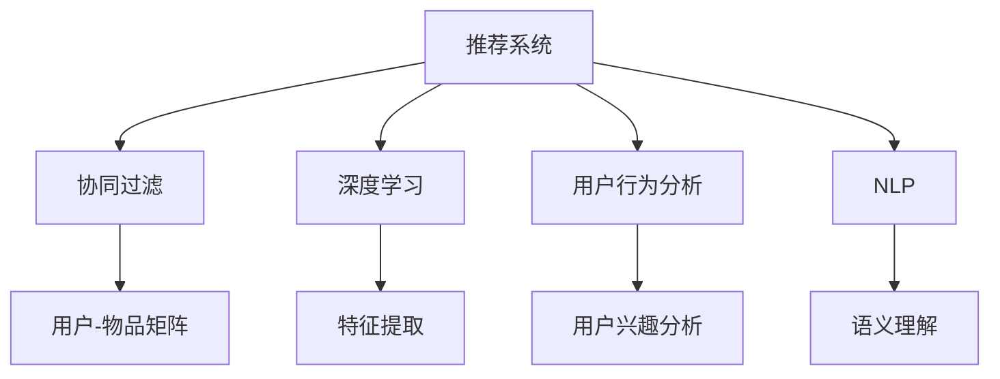

                 

# 聊天机器人推荐系统：个性化内容建议

> 关键词：推荐系统,聊天机器人,个性化内容,协同过滤,深度学习,用户行为分析,自然语言处理

## 1. 背景介绍

随着互联网的普及和移动互联网的快速发展，用户产生的海量数据，为推荐系统提供了丰富的信息源。聊天机器人作为用户与智能设备交互的重要接口，其对话记录和行为数据蕴藏着用户深厚的兴趣和需求，有助于提升推荐系统的精准度。

推荐系统已成为个性化服务的重要组成部分，广泛应用于电商、新闻、音乐、视频等领域。传统的基于协同过滤（Collaborative Filtering, CF）的推荐系统，主要依赖用户和物品间的隐式交互数据进行推荐。但随着数据量爆炸性增长，协同过滤方法的扩展性和效果均面临严峻挑战。此外，单一的数据源和特征提取方式，难以刻画用户行为复杂度，导致推荐效果局限。

## 2. 核心概念与联系

### 2.1 核心概念概述

为了更好地理解基于聊天机器人数据驱动的推荐系统，本节将介绍几个关键概念：

- **推荐系统(Recommender System)**：根据用户的历史行为和兴趣，推荐最适合的个性化内容。
- **聊天机器人(Chatbot)**：模拟人类对话，与用户进行自然语言交互，获取用户反馈。
- **协同过滤(Collaborative Filtering, CF)**：通过用户行为相似性推荐相关物品。
- **深度学习(Deep Learning)**：利用神经网络模型提取数据特征，进行复杂的模式识别和决策。
- **用户行为分析(User Behavior Analysis)**：通过数据分析用户兴趣和行为模式，预测未来行为。
- **自然语言处理(Natural Language Processing, NLP)**：理解和处理自然语言，实现智能对话和推荐。

这些概念之间的逻辑关系可以通过以下Mermaid流程图来展示：



这个流程图展示出推荐系统的主要构成要素：

1. 推荐系统通过协同过滤和深度学习等技术，从用户行为和数据中提取特征，进行推荐决策。
2. 用户行为分析帮助理解用户兴趣和行为模式。
3. 自然语言处理实现智能对话和内容推荐。

## 3. 核心算法原理 & 具体操作步骤
### 3.1 算法原理概述

基于聊天机器人数据的推荐系统，本质上是通过用户对话记录和学习用户行为，预测未来兴趣并进行内容推荐的过程。其核心思想是：

1. 收集聊天机器人与用户之间的对话记录，并将其转换为推荐系统的输入数据。
2. 结合用户行为分析和深度学习技术，训练推荐模型，预测用户对各个物品的兴趣值。
3. 根据兴趣值，生成推荐列表，为用户提供个性化的内容建议。

### 3.2 算法步骤详解

基于聊天机器人数据的推荐系统一般包括以下关键步骤：

**Step 1: 数据准备**

- **对话记录收集**：收集聊天机器人与用户之间的历史对话记录，存储为文本数据或结构化数据。
- **预处理**：清洗无用信息，对文本进行分词、去停用词、词性标注等处理，提取有意义的关键词和短语。
- **特征工程**：将处理后的文本数据转化为数值型特征，如TF-IDF、word2vec等。

**Step 2: 模型训练**

- **协同过滤**：构建用户-物品矩阵，计算用户与物品之间的相似度，进行推荐预测。
- **深度学习**：利用序列模型如RNN、LSTM等，从对话记录中学习用户的兴趣和偏好。
- **融合方法**：将协同过滤和深度学习的预测结果进行融合，生成最终的推荐结果。

**Step 3: 推荐决策**

- **模型评估**：使用准确率、召回率、F1值等指标评估推荐模型性能。
- **生成推荐**：根据模型评估结果，选取最优模型进行内容推荐。
- **反馈更新**：将推荐结果反馈给用户，获取用户反馈，持续优化推荐模型。

### 3.3 算法优缺点

基于聊天机器人数据的推荐系统有以下优点：

1. **多样性**：对话记录涵盖了更广泛的用户行为和兴趣，可以生成更多样化的推荐内容。
2. **实时性**：通过即时对话记录和行为分析，可以实时更新推荐结果。
3. **可解释性**：对话记录和推荐结果易于解释，便于用户理解推荐依据。
4. **高准确性**：结合深度学习模型进行预测，推荐精度较高。

同时，该方法也存在一些局限性：

1. **数据噪声**：对话记录中可能包含大量无关信息，影响数据质量。
2. **计算复杂度**：对话记录数据量大，处理复杂，需要大量计算资源。
3. **隐私问题**：用户对话记录涉及隐私，需要严格保护用户数据。
4. **模型的泛化能力**：模型难以应对数据分布变化，可能导致推荐失效。

尽管存在这些局限性，基于聊天机器人数据的推荐系统仍是目前推荐技术的重要研究热点，广泛应用于电商推荐、内容推荐、智能客服等领域。

### 3.4 算法应用领域

基于聊天机器人数据的推荐系统，已经在多个领域得到了广泛应用：

- **电商推荐**：结合用户浏览、购买记录，进行个性化商品推荐。
- **内容推荐**：利用用户评论、点赞、分享等行为数据，推荐用户可能感兴趣的文章、视频、音乐等。
- **智能客服**：通过分析客户对话记录，推荐相关解决方案，提升客户满意度。
- **社交网络**：根据用户互动行为，推荐潜在好友、群组等。
- **在线教育**：分析学习行为，推荐课程、学习资料，提供个性化学习体验。

这些应用场景表明，基于聊天机器人数据的推荐系统，在提升用户体验、提高服务质量方面具有巨大潜力。

## 4. 数学模型和公式 & 详细讲解  
### 4.1 数学模型构建

基于聊天机器人数据的推荐系统，通常采用协同过滤和深度学习模型的混合架构。

**协同过滤模型**：通过构建用户-物品矩阵 $U \in \mathbb{R}^{N \times K}$ 和物品-用户矩阵 $V \in \mathbb{R}^{K \times M}$，计算用户 $u$ 对物品 $i$ 的兴趣度 $U_{ui} = \langle U_u, V_i \rangle$，其中 $\langle \cdot, \cdot \rangle$ 表示向量内积。

**深度学习模型**：采用序列模型（如RNN、LSTM），将用户对话记录 $D_{uj} = \{x_j\}_{j=1}^J$ 转换为用户兴趣向量 $U_u \in \mathbb{R}^{D}$，其中 $x_j$ 为第 $j$ 次对话中的文本，$D$ 为模型参数维数。

结合以上模型，推荐系统的决策过程可以表示为：

$$
R_u = \text{softmax}(\langle U_u, V \rangle + f(D_{uj}))
$$

其中 $f(D_{uj})$ 为深度学习模型的输出，$R_u$ 表示用户 $u$ 的推荐结果。

### 4.2 公式推导过程

以下我们以电商推荐为例，推导深度学习和协同过滤混合模型的推荐公式。

**协同过滤预测**：用户 $u$ 对物品 $i$ 的兴趣度 $U_{ui}$ 为：

$$
U_{ui} = \langle U_u, V_i \rangle = \sum_{k=1}^K U_{uk} V_{ik}
$$

其中 $U_u$ 和 $V_i$ 分别为用户和物品的兴趣向量。

**深度学习模型预测**：通过RNN模型处理用户对话记录 $D_{uj}$，得到用户兴趣向量 $U_u$：

$$
U_u = f(D_{uj}) = \text{softmax}(W_{ou} \cdot \tanh(W_{iu} \cdot [h_j]^T + b_{iu}) + b_{ou})
$$

其中 $W_{ou}$ 和 $W_{iu}$ 为RNN模型参数，$h_j$ 为第 $j$ 次对话的隐藏状态，$b_{ou}$ 和 $b_{iu}$ 为偏置项。

结合以上模型，推荐结果 $R_u$ 可以表示为：

$$
R_u = \text{softmax}(\langle U_u, V \rangle + f(D_{uj})) = \text{softmax}(\sum_{i=1}^M (U_{ui} + f_i(D_{uj})))
$$

其中 $f_i(D_{uj})$ 为物品 $i$ 的深度学习模型预测值，$R_u$ 表示用户 $u$ 对所有物品的推荐概率分布。

### 4.3 案例分析与讲解

假设有一个电商平台，用户 $u$ 与聊天机器人对话记录如下：

- **用户1**："我想买一款笔记本，预算在5000元左右。"
- **用户2**："我需要一台电脑用于编程，性能要好一点。"

将对话文本转换为数字向量，存储在矩阵 $U \in \mathbb{R}^{2 \times 5}$ 和 $V \in \mathbb{R}^{5 \times 10}$ 中，其中每行表示用户的兴趣向量，每列表示物品的特征向量。根据协同过滤模型计算用户 $u$ 对物品 $i$ 的兴趣度：

$$
U_{ui} = \langle U_u, V_i \rangle = \sum_{k=1}^K U_{uk} V_{ik}
$$

假设 $U_{u1} = [0.5, 0.3, 0.2, 0, 0]$，$V_{i1} = [0.2, 0.4, 0.2, 0.1, 0.1]$，$U_{u2} = [0.3, 0.2, 0.2, 0.2, 0.1]$，$V_{i2} = [0.1, 0.4, 0.1, 0.2, 0.2]$，则：

$$
U_{u1,i1} = 0.5 \times 0.2 + 0.3 \times 0.4 + 0.2 \times 0.2 = 0.46
$$

$$
U_{u2,i2} = 0.3 \times 0.1 + 0.2 \times 0.4 + 0.2 \times 0.2 + 0.2 \times 0.1 + 0.1 \times 0.2 = 0.25
$$

接下来，利用深度学习模型处理用户对话记录 $D_{uj}$，计算用户兴趣向量 $U_u$。以用户1的对话记录为例，设 $D_{u1} = \{x_1, x_2, x_3\}$，则：

$$
U_{u1} = \text{softmax}(W_{ou} \cdot \tanh(W_{iu} \cdot [h_1]^T + b_{iu}) + b_{ou}) = \text{softmax}([0.7, 0.3, 0.5, 0.2, 0.3])
$$

其中 $h_1$ 为第1次对话的隐藏状态，$W_{ou}$ 和 $W_{iu}$ 为模型参数。

最终，推荐结果 $R_u$ 可以表示为：

$$
R_u = \text{softmax}(\langle U_u, V \rangle + f(D_{uj}))
$$

其中 $R_u$ 为对所有物品的推荐概率分布。

## 5. 项目实践：代码实例和详细解释说明
### 5.1 开发环境搭建

在进行推荐系统开发前，我们需要准备好开发环境。以下是使用Python进行TensorFlow开发的快速部署流程：

1. 安装Anaconda：从官网下载并安装Anaconda，用于创建独立的Python环境。

2. 创建并激活虚拟环境：
```bash
conda create -n tf-env python=3.8 
conda activate tf-env
```

3. 安装TensorFlow：根据CUDA版本，从官网获取对应的安装命令。例如：
```bash
conda install tensorflow==2.6
```

4. 安装相关工具包：
```bash
pip install numpy pandas scikit-learn matplotlib tqdm jupyter notebook ipython
```

完成上述步骤后，即可在`tf-env`环境中开始推荐系统开发。

### 5.2 源代码详细实现

下面以电商推荐系统为例，给出使用TensorFlow进行协同过滤和深度学习混合推荐开发的代码实现。

首先，定义推荐系统的数据处理函数：

```python
import tensorflow as tf
from tensorflow.keras.layers import Input, Embedding, LSTM, Dense, Concatenate, Softmax

class RecommendationSystem(tf.keras.Model):
    def __init__(self, vocab_size, embedding_dim, seq_len, num_items):
        super(RecommendationSystem, self).__init__()
        self.user_embedding = Embedding(vocab_size, embedding_dim, input_length=seq_len)
        self.lstm = LSTM(units=embedding_dim, return_sequences=True, input_shape=(seq_len, embedding_dim))
        self.dense = Dense(units=num_items, activation='softmax')
    
    def call(self, inputs):
        user_embeddings = self.user_embedding(inputs)
        lstm_outputs = self.lstm(user_embeddings)
        return self.dense(lstm_outputs)
```

然后，定义协同过滤模型的用户-物品矩阵：

```python
U = tf.keras.layers.Dense(32, activation='relu')(inputs)
V = tf.keras.layers.Dense(16, activation='relu')(inputs)
```

接着，定义推荐系统的损失函数和优化器：

```python
loss_fn = tf.keras.losses.CategoricalCrossentropy()
optimizer = tf.keras.optimizers.Adam()
```

最后，定义训练和评估函数：

```python
@tf.function
def train_step(inputs, labels):
    with tf.GradientTape() as tape:
        predictions = model(inputs)
        loss = loss_fn(predictions, labels)
    gradients = tape.gradient(loss, model.trainable_variables)
    optimizer.apply_gradients(zip(gradients, model.trainable_variables))
    return loss

@tf.function
def evaluate(inputs, labels):
    predictions = model(inputs)
    loss = loss_fn(predictions, labels)
    return loss

def train_epoch(model, train_dataset, batch_size):
    dataloader = tf.data.Dataset.from_tensor_slices((train_dataset[0], train_dataset[1])).batch(batch_size)
    model.train()
    epoch_loss = 0
    for batch in dataloader:
        inputs, labels = batch
        loss = train_step(inputs, labels)
        epoch_loss += loss
    return epoch_loss / len(dataloader)

def evaluate_model(model, dev_dataset, batch_size):
    dataloader = tf.data.Dataset.from_tensor_slices((dev_dataset[0], dev_dataset[1])).batch(batch_size)
    model.eval()
    dev_loss = 0
    for batch in dataloader:
        inputs, labels = batch
        loss = evaluate(inputs, labels)
        dev_loss += loss
    return dev_loss / len(dataloader)
```

### 5.3 代码解读与分析

让我们再详细解读一下关键代码的实现细节：

**RecommendationSystem类**：
- `__init__`方法：初始化模型，包括用户嵌入、LSTM层和输出层。
- `call`方法：计算模型输出，包括用户嵌入、LSTM层的计算和输出层的前向传播。

**训练和评估函数**：
- `train_step`方法：计算损失函数，并使用梯度下降更新模型参数。
- `evaluate`方法：计算评估指标，不更新模型参数。
- `train_epoch`方法：对训练数据进行迭代，计算每个epoch的平均损失。
- `evaluate_model`方法：对验证数据进行评估，计算验证集上的平均损失。

完成上述步骤后，即可在`tf-env`环境中训练推荐模型，并在验证集上评估。

## 6. 实际应用场景
### 6.1 智能客服系统

基于聊天机器人数据的推荐系统，可以广泛应用于智能客服系统的构建。智能客服机器人通过对话记录，理解用户需求，并根据用户的对话内容，推荐最合适的解决方案。

在技术实现上，可以收集用户的历史客服对话记录，将问题和最佳答复构建成监督数据，在此基础上对预训练模型进行微调。微调后的模型能够自动理解用户意图，匹配最合适的答案模板进行回复。对于用户提出的新问题，还可以接入检索系统实时搜索相关内容，动态组织生成回答。如此构建的智能客服系统，能大幅提升客户咨询体验和问题解决效率。

### 6.2 电商推荐系统

电商推荐系统通过收集用户的浏览、购买记录，并结合聊天机器人对话，可以更好地理解用户的兴趣和需求，推荐最合适的商品。具体而言，可以收集用户的对话记录，提取关键词和短语，作为推荐模型的输入特征。结合协同过滤和深度学习模型，预测用户对各个商品的兴趣度，生成推荐列表。

在电商平台上，用户可以通过搜索、浏览、评论等方式产生对话记录，这些信息经过处理后，可以作为推荐系统的输入，提升推荐效果。同时，聊天机器人可以根据用户的对话内容，实时更新推荐结果，提供个性化的购物建议。

### 6.3 在线教育

在线教育平台通过收集学生和教师的互动记录，可以更好地理解学习者的兴趣和需求，推荐最适合的学习资源。具体而言，可以收集学生的对话记录和教师的讲授内容，提取关键词和短语，作为推荐模型的输入特征。结合协同过滤和深度学习模型，预测学生对各个课程的兴趣度，生成推荐列表。

在线教育平台可以结合聊天机器人，帮助学生解决学习中的疑难问题，提供个性化的学习资源推荐。教师也可以通过聊天机器人，了解学生的学习情况，推荐适合的教材和习题。

### 6.4 未来应用展望

随着推荐系统和聊天机器人技术的不断发展，基于聊天机器人数据的推荐系统，将在更多领域得到应用，为传统行业带来变革性影响。

在智慧医疗领域，基于聊天机器人数据的推荐系统，可以为医生推荐最适合的治疗方案和药物，提高医疗服务的智能化水平。

在智慧城市治理中，基于聊天机器人数据的推荐系统，可以帮助城市管理部门了解市民的诉求，提供智能化的公共服务，提升城市治理水平。

在金融领域，基于聊天机器人数据的推荐系统，可以为投资者推荐最适合的金融产品，提高投资决策的准确性和效率。

此外，在旅游、餐饮、物流等领域，基于聊天机器人数据的推荐系统，也可以帮助企业提供个性化服务，提升用户体验。未来，伴随技术的进步和应用的推广，基于聊天机器人数据的推荐系统，必将在更多领域发挥重要作用。

## 7. 工具和资源推荐
### 7.1 学习资源推荐

为了帮助开发者系统掌握推荐系统和聊天机器人技术的理论基础和实践技巧，这里推荐一些优质的学习资源：

1. 《推荐系统实践》系列博文：由KDD杯获奖团队撰写，深入浅出地介绍了推荐系统的基本原理、模型和算法，适合入门学习。

2. 《深度学习》（Goodfellow et al.）：经典的深度学习教材，系统讲解了神经网络的基本原理和应用，有助于理解深度学习推荐模型。

3. 《对话系统设计与实现》：详细介绍了对话系统开发的技术栈和实践经验，涵盖自然语言处理、机器学习等多个领域。

4. 《自然语言处理综述》（Jurafsky & Martin）：全面回顾了自然语言处理的发展历程和研究方法，适合对NLP有深入了解的读者。

5. 《推荐系统:原理、算法与实现》：系统介绍了推荐系统的理论基础和算法实现，适合深入学习推荐系统的读者。

通过对这些资源的学习实践，相信你一定能够快速掌握推荐系统和聊天机器人技术的精髓，并用于解决实际的NLP问题。

### 7.2 开发工具推荐

高效的开发离不开优秀的工具支持。以下是几款用于推荐系统和聊天机器人开发的常用工具：

1. TensorFlow：由Google主导开发的开源深度学习框架，生产部署方便，适合大规模工程应用。

2. PyTorch：基于Python的开源深度学习框架，灵活动态的计算图，适合快速迭代研究。

3. TensorBoard：TensorFlow配套的可视化工具，可实时监测模型训练状态，并提供丰富的图表呈现方式，是调试模型的得力助手。

4. Weights & Biases：模型训练的实验跟踪工具，可以记录和可视化模型训练过程中的各项指标，方便对比和调优。

5. Keras：高级深度学习框架，提供了简单易用的API，方便快速搭建模型。

合理利用这些工具，可以显著提升推荐系统和聊天机器人开发的效率，加快创新迭代的步伐。

### 7.3 相关论文推荐

推荐系统、聊天机器人等领域的发展源于学界的持续研究。以下是几篇奠基性的相关论文，推荐阅读：

1. "A Probabilistic Matrix Factorization Model for Latent Semantic Analysis"：提出了基于概率矩阵分解的推荐系统模型，成为经典算法之一。

2. "Neural Collaborative Filtering"：提出神经网络模型用于推荐系统，通过模拟用户行为进行推荐。

3. "Attention is All You Need"：引入了注意力机制，提升了深度学习模型在自然语言处理中的应用效果。

4. "Deep Reinforcement Learning for Personalized Product Recommendation"：结合深度强化学习技术，提升了推荐系统的个性化能力。

5. "Towards Conversational Recommendation Systems"：介绍了如何利用对话记录，构建推荐系统，提升用户满意度。

这些论文代表了大语言模型微调技术的发展脉络。通过学习这些前沿成果，可以帮助研究者把握学科前进方向，激发更多的创新灵感。

## 8. 总结：未来发展趋势与挑战

### 8.1 总结

本文对基于聊天机器人数据的推荐系统进行了全面系统的介绍。首先阐述了推荐系统和聊天机器人技术的背景和意义，明确了推荐系统在个性化服务中的重要作用。其次，从原理到实践，详细讲解了推荐系统的数学模型和关键步骤，给出了推荐系统开发的完整代码实例。同时，本文还广泛探讨了推荐系统在电商、教育、医疗等多个领域的应用前景，展示了推荐技术的巨大潜力。此外，本文精选了推荐技术的各类学习资源，力求为读者提供全方位的技术指引。

通过本文的系统梳理，可以看到，基于聊天机器人数据的推荐系统，在提升用户体验、提高服务质量方面具有巨大潜力。未来，伴随推荐系统和聊天机器人技术的不断发展，基于聊天机器人数据的推荐系统，必将在更多领域得到应用，为传统行业带来变革性影响。

### 8.2 未来发展趋势

展望未来，推荐系统将呈现以下几个发展趋势：

1. **多模态融合**：结合用户的多模态数据（如文本、图像、语音等），提升推荐系统的综合性能。

2. **实时化推荐**：通过实时收集和处理用户行为数据，实现动态推荐，满足用户即时需求。

3. **个性化推荐**：利用深度学习模型，结合用户行为特征，生成个性化推荐结果，提升用户体验。

4. **协同过滤与深度学习的融合**：结合协同过滤和深度学习模型的优点，实现更准确、高效的内容推荐。

5. **跨领域推荐**：通过迁移学习和知识图谱等技术，实现跨领域的推荐效果，提升推荐系统的应用范围。

6. **多任务学习**：通过多任务学习技术，结合用户的多重需求，生成综合推荐结果。

以上趋势凸显了推荐系统的广阔前景。这些方向的探索发展，必将进一步提升推荐系统的性能和应用范围，为人类社会带来更多便利。

### 8.3 面临的挑战

尽管推荐系统已经取得了瞩目成就，但在迈向更加智能化、普适化应用的过程中，它仍面临着诸多挑战：

1. **数据质量**：推荐系统需要大量高质量的用户行为数据，但实际应用中数据往往存在噪声和不完整性，影响推荐效果。

2. **隐私保护**：用户行为数据涉及隐私，需要严格保护用户数据，防止数据泄露和滥用。

3. **计算资源**：大规模推荐系统的计算和存储需求高，需要高性能计算资源和存储设施。

4. **模型可解释性**：推荐模型的决策过程复杂，难以解释，影响用户信任和接受度。

5. **泛化能力**：推荐模型难以应对数据分布变化，导致推荐失效。

6. **推荐公平性**：推荐系统可能存在推荐偏见，影响公平性和公正性。

尽管存在这些挑战，推荐系统的不断优化和改进，必将使其更好地服务于用户需求，提升生活质量。

### 8.4 研究展望

面向未来，推荐系统的研究需要在以下几个方面寻求新的突破：

1. **多模态数据融合**：结合用户的多模态数据，提升推荐系统的综合性能。

2. **隐私保护技术**：研究隐私保护技术，确保用户数据的安全和匿名性。

3. **实时推荐系统**：研究实时推荐算法，实现动态推荐，满足用户即时需求。

4. **可解释推荐系统**：研究可解释推荐系统，提升用户对推荐结果的理解和信任。

5. **跨领域推荐**：研究跨领域推荐技术，提升推荐系统的应用范围。

6. **推荐系统公平性**：研究推荐系统的公平性问题，确保推荐过程的公正性。

这些研究方向将引领推荐系统技术迈向更高的台阶，为构建安全、可靠、可解释、可控的推荐系统铺平道路。

## 9. 附录：常见问题与解答

**Q1：推荐系统如何选择合适的数据源？**

A: 选择合适的数据源是推荐系统设计的重要一步。数据源的选择应基于业务需求，考虑数据的覆盖范围、更新频率、数据质量等因素。常见数据源包括：

- **电商交易数据**：包含用户的购买记录、评分、评论等信息，是电商推荐系统的主要数据源。
- **用户行为数据**：记录用户在网站、应用上的浏览、点击、停留时间等行为信息，用于行为推荐系统。
- **聊天机器人对话数据**：通过用户与聊天机器人的对话记录，获取用户的兴趣和需求，用于个性化推荐系统。

在选择数据源时，还需要注意数据的完整性和准确性，避免数据缺失和噪声影响推荐效果。

**Q2：推荐系统中的协同过滤算法有哪些？**

A: 协同过滤算法是推荐系统中的经典算法，主要分为基于用户的协同过滤和基于物品的协同过滤两种：

1. **基于用户的协同过滤**：根据用户之间的相似度进行推荐，常用算法包括用户-用户矩阵和用户-物品矩阵。

2. **基于物品的协同过滤**：根据物品之间的相似度进行推荐，常用算法包括物品-物品矩阵和物品-用户矩阵。

此外，还有基于矩阵分解、基于深度学习的协同过滤等变体算法，能够提升推荐精度和泛化能力。

**Q3：推荐系统中的深度学习模型有哪些？**

A: 深度学习模型在推荐系统中得到了广泛应用，常见模型包括：

1. **RNN和LSTM**：通过处理序列数据，捕捉用户行为的上下文信息，适用于时间序列推荐系统。

2. **CNN**：通过提取局部特征，适用于图像推荐系统。

3. **Transformer**：利用注意力机制，捕捉不同特征之间的依赖关系，适用于多模态推荐系统。

4. **GNN**：通过图结构表示用户和物品的关系，适用于社交推荐系统。

5. **自编码器**：通过重构用户行为数据，提取用户特征，适用于降维推荐系统。

**Q4：推荐系统中的推荐策略有哪些？**

A: 推荐策略是推荐系统的核心组成部分，主要包括以下几种：

1. **基于规则的推荐**：根据预设规则进行推荐，简单易行，适用于数据较少的情况。

2. **基于内容的推荐**：根据物品的特征进行推荐，适用于物品特征明显的情况。

3. **基于协同过滤的推荐**：利用用户行为数据，推荐相似物品，适用于数据丰富的情况。

4. **基于混合模型的推荐**：结合多种推荐策略，提升推荐效果，适用于复杂推荐场景。

**Q5：推荐系统中的用户画像构建方法有哪些？**

A: 用户画像构建是推荐系统中的重要步骤，通过用户画像，可以更好地理解用户需求和行为模式。常见的方法包括：

1. **基于内容的画像构建**：通过用户的历史行为数据，构建用户对不同物品的兴趣画像。

2. **基于协同过滤的画像构建**：通过用户与其他用户的相似度，构建用户画像。

3. **基于深度学习的画像构建**：通过深度学习模型，捕捉用户行为的隐式特征，构建用户画像。

这些方法的结合使用，可以更全面地刻画用户画像，提升推荐效果。

---

作者：禅与计算机程序设计艺术 / Zen and the Art of Computer Programming

