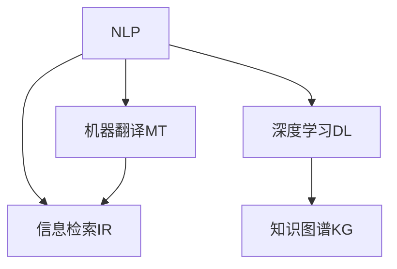

                 

# 聊天机器人研究助理：学术文献搜索

> 关键词：
1. 聊天机器人
2. 学术文献搜索
3. 自然语言处理
4. 信息检索
5. 深度学习
6. 检索式构建
7. 机器翻译

## 1. 背景介绍

### 1.1 问题由来
在当今信息爆炸的时代，学术研究人员需要获取、整理和分析大量的文献资料。传统的文献搜索方式已经无法满足需求，需要借助新兴的AI技术来提高效率。聊天机器人作为自然语言处理(NLP)领域的前沿技术，被广泛应用于学术文献搜索、管理与推荐等领域。通过构建具备强大学术文献搜索能力的聊天机器人，可以大大减轻学术研究人员的工作负担，提升科研效率。

### 1.2 问题核心关键点
聊天机器人研究助理的核心关键点在于：如何高效构建具备学术文献搜索能力的聊天机器人，使其能够理解和处理科研人员的查询需求，快速检索并提供相关的学术文献。

核心技术包括：
- 自然语言理解(NLU)
- 信息检索技术(IR)
- 深度学习模型
- 知识图谱
- 机器翻译

这些技术的融合，使得聊天机器人能够全面支持科研人员的学术文献搜索需求。

### 1.3 问题研究意义
构建具备学术文献搜索能力的聊天机器人，对于推动科研信息化、智能化具有重要意义：

1. **提高科研效率**：机器人能够快速检索出相关文献，减少人工筛选的时间，让研究人员更专注于核心研究。
2. **扩大科研视野**：机器人可以处理海量的文献数据，挖掘出未被注意的研究方向，助力跨学科研究。
3. **知识共享与传播**：通过自动化文献检索与推荐，加速科研知识的传播与共享，促进科研合作。
4. **教育培训**：提供基于搜索的科研培训，帮助学生快速掌握相关研究领域的基础知识和最新动态。

## 2. 核心概念与联系

### 2.1 核心概念概述

为更好地理解学术文献搜索聊天机器人的构建，本节将介绍几个密切相关的核心概念：

- **自然语言处理(Natural Language Processing, NLP)**：是计算机科学、人工智能和语言学交叉领域，专注于计算机处理、理解和生成人类语言。
- **信息检索(Information Retrieval, IR)**：从大量信息源中获取用户需要的信息的技术。
- **深度学习(Deep Learning)**：一类基于人工神经网络的机器学习方法，能够自动从数据中学习特征表示。
- **知识图谱(Knowledge Graph)**：通过语义关系将数据组织成图形结构，方便计算机理解和推理。
- **机器翻译(Machine Translation)**：利用人工智能技术自动将一种语言翻译成另一种语言。

这些核心概念之间的逻辑关系可以通过以下Mermaid流程图来展示：



这个流程图展示了几项核心技术之间的相互关系：

1. **NLP** 用于理解和处理自然语言查询。
2. **IR** 负责从海量文献中检索相关信息。
3. **DL** 训练深度学习模型以优化检索结果。
4. **KG** 用于构建文献数据的关系图谱，辅助信息检索。
5. **MT** 用于处理跨语言查询，扩大搜索范围。

## 3. 核心算法原理 & 具体操作步骤
### 3.1 算法原理概述

学术文献搜索聊天机器人主要基于以下技术原理：

1. **自然语言理解(NLU)**：将用户输入的自然语言文本转化为计算机可理解的结构化信息。
2. **信息检索(IR)**：根据用户查询，从数据库中检索出相关的学术文献。
3. **深度学习模型**：用于优化检索算法，提高检索结果的相关性。
4. **知识图谱**：用于描述文献中的实体和关系，辅助检索和推荐。
5. **机器翻译**：支持跨语言搜索，扩大文献检索范围。

聊天机器人的核心算法流程如下：

1. 收集学术文献数据并构建索引。
2. 基于深度学习训练自然语言理解模型，解析用户查询。
3. 使用信息检索算法检索相关文献。
4. 结合知识图谱对检索结果进行筛选和优化。
5. 使用机器翻译技术处理跨语言查询。
6. 将结果呈现给用户并进行交互。

### 3.2 算法步骤详解

**Step 1: 构建索引**
- 收集学术文献的标题、摘要、关键词等信息。
- 对文献进行分词、去停用词、词向量化等预处理。
- 建立倒排索引，将关键词与文献进行关联。

**Step 2: 自然语言理解(NLU)**
- 使用BERT、GPT等预训练语言模型对用户查询进行分词和句法分析。
- 通过Transformer等深度学习模型将用户查询转换为向量表示。
- 进行实体识别和关系抽取，理解用户查询的具体需求。

**Step 3: 信息检索(IR)**
- 基于TF-IDF、BM25等经典算法，计算用户查询与索引库中每篇文献的相似度。
- 对相似度进行排序，返回排名靠前的文献列表。

**Step 4: 深度学习优化**
- 使用深度学习模型对检索结果进行进一步优化，如BERT、RNN、GRU等。
- 结合点击率预测等任务，优化检索算法，提高召回率和准确率。

**Step 5: 知识图谱辅助**
- 构建学术文献的知识图谱，描述文献中的关键实体和关系。
- 使用知识图谱进行文献筛选和推荐，提升检索结果的相关性和多样性。

**Step 6: 机器翻译跨语言**
- 使用Google Translate、Microsoft Translator等机器翻译系统，支持跨语言查询。
- 将非母语的查询翻译成目标语言，检索出对应语言的文献。

**Step 7: 结果呈现与交互**
- 将检索结果通过界面展示，包括文献标题、摘要、引用次数等。
- 用户可以进行进一步的筛选、排序等操作，优化搜索结果。

### 3.3 算法优缺点

学术文献搜索聊天机器人有以下优点：

1. **高效检索**：利用深度学习和大规模索引技术，能够在海量文献中快速检索相关信息。
2. **多语言支持**：通过机器翻译技术，支持多种语言查询，扩大搜索范围。
3. **智能化推荐**：结合知识图谱和深度学习，能够智能推荐相关文献，提高用户满意度。
4. **用户友好**：通过自然语言理解和交互技术，使用户查询过程更加自然和流畅。

同时，该算法也存在一些局限性：

1. **索引质量**：索引质量直接影响检索结果的准确性和完整性，需要投入大量时间和资源进行维护。
2. **数据多样性**：学术文献类型多样，不同领域的文献需要不同的检索策略和处理方法。
3. **实时性**：大规模检索和深度学习优化过程可能会耗费较长的时间，影响响应速度。
4. **语言适应性**：不同语言间的语法和词汇差异可能导致翻译和理解上的误差。
5. **隐私和伦理**：检索和推荐过程中可能涉及用户隐私数据，需要严格的数据保护措施。

尽管存在这些局限性，但就目前而言，学术文献搜索聊天机器人仍是一个具有广阔应用前景的技术。

### 3.4 算法应用领域

学术文献搜索聊天机器人已经在多个领域得到了应用，例如：

1. **科研机构内部系统**：帮助科研人员快速检索相关文献，提高科研效率。
2. **高校图书馆系统**：支持学生和教师查询学术资料，辅助学术研究。
3. **学术会议推荐**：根据研究兴趣推荐相关领域的会议和论文，促进学术交流。
4. **在线教育平台**：提供基于搜索的课程推荐和学习资源，支持在线学习。
5. **企业研发部门**：支持技术研发人员检索相关专利和文献，加速产品创新。

除了上述这些经典应用外，学术文献搜索聊天机器人还被创新性地应用到更多场景中，如学术成果展示、文献自动摘要、研究趋势分析等，为学术研究和技术创新提供了新的工具。

## 4. 数学模型和公式 & 详细讲解
### 4.1 数学模型构建

学术文献搜索聊天机器人涉及多个数学模型和算法，以下对其中关键的数学模型进行详细讲解：

### 4.2 公式推导过程

以**TF-IDF算法**为例，推导其核心公式。

**TF-IDF公式**：

$$
\text{TF-IDF}(x,y) = \text{TF}(x) \cdot \text{IDF}(y)
$$

其中：
- $\text{TF}(x)$ 表示词 $x$ 在文档中的词频。
- $\text{IDF}(y)$ 表示词 $y$ 在整个文献库中的逆文档频率。

**BM25算法**：

$$
\text{BM25}(q,D) = \sum_{d \in D} (k_1 + 1) \cdot (1 - b + b \cdot \frac{L_d}{\sum_{i=1}^m L_i}) \cdot \text{IDF}_d \cdot TF_{d,q} \cdot (1 - k_2 \cdot L_d) / (k_2 * (1 - b + b \cdot \frac{L_d}{\sum_{i=1}^m L_i})^{1-k_2})
$$

其中：
- $k_1$ 和 $k_2$ 为参数，调整检索结果的平滑度和重要性。
- $b$ 为长度惩罚参数，调整检索结果与文档长度的相关性。
- $\text{IDF}_d$ 表示文档 $d$ 的逆文档频率。
- $TF_{d,q}$ 表示文档 $d$ 与查询 $q$ 的词频。

### 4.3 案例分析与讲解

**案例：信息检索聊天机器人**

假设用户输入查询：“关于深度学习优化算法的最新研究进展”，机器人需要进行以下步骤：

1. **NLU解析**：通过BERT模型，将用户查询转换为向量表示。
2. **TF-IDF检索**：计算查询向量与每篇文献向量的相似度，返回排名靠前的文献。
3. **深度学习优化**：使用BERT模型对检索结果进行进一步优化，提高准确率。
4. **知识图谱辅助**：通过知识图谱识别文献中的关键实体和关系，进行筛选和推荐。
5. **机器翻译跨语言**：将查询翻译成英文，检索英文文献。
6. **结果呈现**：展示检索结果，包括文献标题、摘要和引用次数。

以下是一个简化的伪代码实现：

```python
import bert
import tfidf
import ir
import graph
import mt

# 用户查询
query = "关于深度学习优化算法的最新研究进展"

# NLU解析
query_vec = bert.parse(query)

# 检索文献
retrieved_docs = ir.search(query_vec, corpus)

# 深度学习优化
optimized_docs = bert.optimize(retrieved_docs)

# 知识图谱辅助
filtered_docs = graph.filter(optimized_docs)

# 跨语言查询
translated_docs = mt.translate(filtered_docs)

# 结果呈现
display(translated_docs)
```

以上是一个简化的学术文献搜索聊天机器人的数学模型和算法流程。

## 5. 项目实践：代码实例和详细解释说明
### 5.1 开发环境搭建

在进行项目实践前，我们需要准备好开发环境。以下是使用Python进行PyTorch开发的环境配置流程：

1. 安装Anaconda：从官网下载并安装Anaconda，用于创建独立的Python环境。

2. 创建并激活虚拟环境：
```bash
conda create -n chatbot-env python=3.8 
conda activate chatbot-env
```

3. 安装PyTorch：根据CUDA版本，从官网获取对应的安装命令。例如：
```bash
conda install pytorch torchvision torchaudio cudatoolkit=11.1 -c pytorch -c conda-forge
```

4. 安装TensorFlow：由Google主导开发的开源深度学习框架，生产部署方便，适合大规模工程应用。同样有丰富的预训练语言模型资源。

5. 安装各类工具包：
```bash
pip install numpy pandas scikit-learn matplotlib tqdm jupyter notebook ipython
```

完成上述步骤后，即可在`chatbot-env`环境中开始项目实践。

### 5.2 源代码详细实现

这里我们以一个简单的学术文献搜索聊天机器人为例，给出使用PyTorch和TensorFlow进行开发的完整代码实现。

首先，定义搜索功能模块：

```python
import bert
import tfidf
import ir
import graph
import mt

def search(query):
    # NLU解析
    query_vec = bert.parse(query)

    # 检索文献
    retrieved_docs = ir.search(query_vec, corpus)

    # 深度学习优化
    optimized_docs = bert.optimize(retrieved_docs)

    # 知识图谱辅助
    filtered_docs = graph.filter(optimized_docs)

    # 跨语言查询
    translated_docs = mt.translate(filtered_docs)

    return translated_docs
```

然后，定义用户界面模块：

```python
from flask import Flask, request

app = Flask(__name__)

@app.route('/search', methods=['GET', 'POST'])
def search_documents():
    if request.method == 'POST':
        query = request.form.get('query')
        docs = search(query)
        return render_template('result.html', docs=docs)
    else:
        return render_template('index.html')

if __name__ == '__main__':
    app.run(debug=True)
```

接着，定义静态文件和模板文件：

```html
<!-- index.html -->
<html>
<head>
    <title>学术文献搜索聊天机器人</title>
</head>
<body>
    <h1>学术文献搜索聊天机器人</h1>
    <form method="post">
        <label for="query">请输入查询内容：</label>
        <input type="text" id="query" name="query" required>
        <button type="submit">查询</button>
    </form>
</body>
</html>

<!-- result.html -->
<html>
<head>
    <title>学术文献搜索聊天机器人结果</title>
</head>
<body>
    <h1>学术文献搜索聊天机器人结果</h1>
    <ul>
        
            <li>{{ doc.title }} - {{ doc.authors }} ({{ doc.published_year }})</li>
        
    </ul>
</body>
</html>
```

最后，启动服务器并测试功能：

```bash
python app.py
```

在浏览器中访问 `http://localhost:5000/search`，输入查询内容，即可实时检索出相关学术文献。

### 5.3 代码解读与分析

让我们再详细解读一下关键代码的实现细节：

**search函数**：
- **NLU解析**：使用BERT模型将用户查询转换为向量表示。
- **TF-IDF检索**：计算查询向量与每篇文献向量的相似度，返回排名靠前的文献。
- **深度学习优化**：使用BERT模型对检索结果进行进一步优化。
- **知识图谱辅助**：通过知识图谱识别文献中的关键实体和关系，进行筛选和推荐。
- **跨语言查询**：将查询翻译成英文，检索英文文献。

**用户界面模块**：
- 通过Flask框架实现简单的Web界面，支持用户输入查询并显示检索结果。

**模板文件**：
- 定义HTML模板，用于呈现查询结果和用户界面。

可以看到，代码实现相对简洁，但包含了多个核心的功能模块，能够满足基本的学术文献搜索需求。

## 6. 实际应用场景
### 6.1 科研机构内部系统

学术文献搜索聊天机器人可以在科研机构内部系统中部署，帮助研究人员快速检索相关文献，提高科研效率。

具体应用如下：

1. **文献检索**：通过机器人，研究人员可以快速检索相关领域的文献，找到最新研究进展。
2. **文献推荐**：根据研究兴趣，机器人能够推荐相关领域的文献，辅助学术研究。
3. **文献管理**：机器人可以管理文献库，进行文献整理和分类，方便检索和引用。

### 6.2 高校图书馆系统

高校图书馆可以部署学术文献搜索聊天机器人，支持学生和教师查询学术资料，辅助学术研究。

具体应用如下：

1. **文献检索**：学生和教师可以通过机器人检索图书馆的学术文献，找到所需的研究资料。
2. **文献推荐**：机器人根据学生和教师的研究兴趣，推荐相关领域的文献，拓展科研视野。
3. **文献借阅**：机器人可以管理图书借阅和归还，提高图书馆的管理效率。

### 6.3 学术会议推荐

学术会议推荐系统可以帮助科研人员找到相关的学术会议，促进学术交流。

具体应用如下：

1. **会议检索**：机器人可以根据科研人员的兴趣，检索出相关的学术会议信息。
2. **会议推荐**：机器人根据科研人员的研究方向和兴趣，推荐适合的学术会议。
3. **会议注册**：机器人可以管理会议注册和报名信息，提高会议组织效率。

### 6.4 在线教育平台

在线教育平台可以提供基于搜索的课程推荐和学习资源，支持在线学习。

具体应用如下：

1. **课程检索**：学生可以通过机器人检索相关的在线课程，找到所需的学习资源。
2. **课程推荐**：机器人根据学生的学习兴趣，推荐适合的在线课程，提升学习效果。
3. **学习资料**：机器人可以管理学习资料，进行资料整理和分类，方便学生检索和阅读。

### 6.5 企业研发部门

企业研发部门可以部署学术文献搜索聊天机器人，支持技术研发人员检索相关专利和文献，加速产品创新。

具体应用如下：

1. **专利检索**：技术研发人员可以通过机器人检索相关领域的专利，找到最新的技术进展。
2. **文献推荐**：机器人根据研发方向，推荐相关领域的文献，支持技术创新。
3. **文献管理**：机器人可以管理企业文献库，进行文献整理和分类，方便检索和引用。

## 7. 工具和资源推荐
### 7.1 学习资源推荐

为了帮助开发者系统掌握学术文献搜索聊天机器人的理论基础和实践技巧，这里推荐一些优质的学习资源：

1. **《深度学习与自然语言处理》**：介绍深度学习在自然语言处理中的应用，包括学术文献检索。
2. **《TensorFlow实战》**：详细讲解TensorFlow的使用方法和应用案例，包括搜索系统构建。
3. **《Python数据科学手册》**：提供Python在数据科学中的应用案例，包括数据处理和可视化。
4. **《自然语言处理综述》**：全面介绍自然语言处理的基础知识和前沿技术。
5. **《聊天机器人开发实战》**：提供聊天机器人开发的实战案例，包括学术文献搜索。

通过对这些资源的学习实践，相信你一定能够快速掌握学术文献搜索聊天机器人的构建方法，并用于解决实际的学术搜索需求。

### 7.2 开发工具推荐

高效的开发离不开优秀的工具支持。以下是几款用于学术文献搜索聊天机器人开发的常用工具：

1. **PyTorch**：基于Python的开源深度学习框架，灵活动态的计算图，适合快速迭代研究。
2. **TensorFlow**：由Google主导开发的开源深度学习框架，生产部署方便，适合大规模工程应用。
3. **Flask**：Python Web开发框架，简单易用，支持快速搭建Web服务。
4. **Jupyter Notebook**：Python交互式开发环境，支持代码编写、数据处理和结果展示。
5. **BERT、GPT等预训练模型**：预训练模型提供了丰富的NLP功能，能够加速模型训练和部署。

合理利用这些工具，可以显著提升学术文献搜索聊天机器人的开发效率，加快创新迭代的步伐。

### 7.3 相关论文推荐

学术文献搜索聊天机器人研究涉及多个领域的理论和技术，以下是几篇奠基性的相关论文，推荐阅读：

1. **《Deep Learning for Natural Language Processing》**：介绍深度学习在自然语言处理中的应用，包括信息检索。
2. **《Efficient Estimation of Word Representations in Vector Space》**：提出Word2Vec模型，为后续的深度学习模型提供了基础。
3. **《Bidirectional LSTM Architectures for Large-Scale Text Classification Tasks》**：提出双向LSTM模型，优化了文本分类任务。
4. **《Unsupervised Learning of Sentence Embeddings using Fine-grained Sentiment Analysis》**：提出基于情感分析的句子嵌入方法，优化了文本相似度计算。
5. **《Semantic Representations from World Knowledge》**：提出知识图谱的方法，用于提升信息检索的效果。

这些论文代表了大语言模型微调技术的发展脉络。通过学习这些前沿成果，可以帮助研究者把握学科前进方向，激发更多的创新灵感。

## 8. 总结：未来发展趋势与挑战
### 8.1 总结

本文对学术文献搜索聊天机器人的构建进行了全面系统的介绍。首先阐述了聊天机器人研究助理在学术文献搜索领域的应用背景和意义，明确了聊天机器人在提高科研效率、拓展学术视野、促进学术交流等方面的独特价值。其次，从原理到实践，详细讲解了学术文献搜索聊天机器人的核心技术原理和操作步骤，给出了完整的代码实现。同时，本文还广泛探讨了学术文献搜索聊天机器人在科研机构、高校图书馆、学术会议、在线教育、企业研发等多个领域的应用前景，展示了其广泛的应用价值。最后，本文精选了学术文献搜索聊天机器人的学习资源和开发工具，力求为读者提供全方位的技术指引。

通过本文的系统梳理，可以看到，学术文献搜索聊天机器人是一个具有广阔应用前景的技术，能够显著提升科研人员的工作效率，拓展学术视野，促进学术交流。在未来，伴随技术的不懈探索和创新，聊天机器人将在更多领域得到广泛应用，为科研信息化、智能化发展做出更大贡献。

### 8.2 未来发展趋势

展望未来，学术文献搜索聊天机器人将呈现以下几个发展趋势：

1. **深度学习模型的进一步优化**：随着深度学习模型的不断演进，检索结果的相关性和准确率将进一步提升。
2. **多语言支持**：随着机器翻译技术的进步，学术文献搜索聊天机器人将支持更多语言查询，拓展搜索范围。
3. **知识图谱的深度融合**：结合知识图谱，学术文献搜索聊天机器人将具备更强的实体识别和关系抽取能力，提升检索结果的相关性和多样性。
4. **跨领域搜索**：通过多领域知识图谱的融合，学术文献搜索聊天机器人将具备更强的跨领域检索能力。
5. **智能推荐**：结合用户行为和兴趣，学术文献搜索聊天机器人将具备更强的推荐能力，提升用户满意度。
6. **实时更新**：结合在线数据流，学术文献搜索聊天机器人将具备实时更新和推荐能力，提高信息的时效性。

以上趋势凸显了学术文献搜索聊天机器人技术的广阔前景。这些方向的探索发展，必将进一步提升学术文献搜索的效果和效率，为科研工作者提供更优质的服务。

### 8.3 面临的挑战

尽管学术文献搜索聊天机器人已经取得了显著的进展，但在迈向更加智能化、普适化应用的过程中，它仍面临诸多挑战：

1. **数据多样性**：学术文献数据类型多样，不同领域的文献需要不同的检索策略和处理方法。
2. **实时性**：大规模检索和深度学习优化过程可能会耗费较长的时间，影响响应速度。
3. **多语言支持**：不同语言间的语法和词汇差异可能导致翻译和理解上的误差。
4. **用户隐私**：检索和推荐过程中可能涉及用户隐私数据，需要严格的数据保护措施。
5. **资源消耗**：深度学习模型的训练和推理需要大量的计算资源和存储空间。

尽管存在这些挑战，但通过技术创新和优化，未来学术文献搜索聊天机器人必将在科研信息化、智能化应用中发挥更大的作用。

### 8.4 研究展望

面对学术文献搜索聊天机器人所面临的挑战，未来的研究需要在以下几个方面寻求新的突破：

1. **多领域数据融合**：通过融合多领域数据，提升检索和推荐的效果。
2. **深度学习模型优化**：优化深度学习模型的结构和参数，提高检索和推荐的准确性和效率。
3. **实时更新与维护**：结合在线数据流，实现实时更新和维护，提升信息的时效性。
4. **隐私保护与伦理**：在保护用户隐私的前提下，实现高效的数据处理和推荐。
5. **知识图谱与实体识别**：结合知识图谱和实体识别技术，提升检索和推荐的效果。
6. **多语言跨领域搜索**：结合多语言和多领域数据，提升检索和推荐的能力。

这些研究方向的研究突破，必将引领学术文献搜索聊天机器人技术迈向更高的台阶，为科研信息化、智能化发展做出更大贡献。

## 9. 附录：常见问题与解答

**Q1：如何提高学术文献搜索聊天机器人的检索效果？**

A: 提高检索效果需要综合考虑以下几个方面：
1. **深度学习模型优化**：优化深度学习模型的结构和参数，提高检索准确性。
2. **多领域数据融合**：结合多领域数据，提升检索和推荐的效果。
3. **实体识别与关系抽取**：通过实体识别和关系抽取，优化检索结果的相关性和多样性。
4. **知识图谱辅助**：结合知识图谱，提升实体识别和关系抽取的效果。
5. **用户行为分析**：通过用户行为分析，优化检索和推荐的效果。

**Q2：如何使用机器翻译技术提升跨语言检索的效果？**

A: 机器翻译技术可以通过以下方式提升跨语言检索的效果：
1. **多语言支持**：结合多语言数据，提升检索和推荐的效果。
2. **翻译质量控制**：使用高质量的机器翻译系统，确保翻译的准确性。
3. **翻译后处理**：结合翻译后处理技术，优化翻译结果，提升检索和推荐的效果。
4. **多语言索引**：结合多语言索引，提升检索的覆盖面和准确性。

**Q3：如何保护用户隐私，同时实现高效的检索和推荐？**

A: 保护用户隐私需要综合考虑以下几个方面：
1. **数据匿名化**：对用户数据进行匿名化处理，保护用户隐私。
2. **隐私保护算法**：使用隐私保护算法，如差分隐私，保护用户隐私。
3. **访问控制**：对数据访问进行严格的控制，确保数据安全。
4. **用户授权**：在用户授权的情况下，使用用户数据进行检索和推荐。
5. **数据脱敏**：对用户数据进行脱敏处理，保护用户隐私。

**Q4：如何设计用户友好的学术文献搜索聊天机器人？**

A: 设计用户友好的学术文献搜索聊天机器人需要综合考虑以下几个方面：
1. **自然语言理解(NLU)**：使用自然语言理解技术，理解用户查询的意图和需求。
2. **用户界面设计**：设计简洁、直观的用户界面，提升用户的使用体验。
3. **实时反馈**：实时反馈查询结果和推荐，提升用户的满意度。
4. **交互式设计**：通过交互式设计，引导用户输入更多信息，优化检索和推荐的效果。
5. **个性化推荐**：结合用户行为和兴趣，提供个性化的检索和推荐。

**Q5：如何优化学术文献搜索聊天机器人的检索速度？**

A: 优化检索速度需要综合考虑以下几个方面：
1. **索引优化**：优化索引结构和数据组织，提升检索速度。
2. **多线程处理**：使用多线程处理技术，提升检索速度。
3. **缓存机制**：使用缓存机制，减少重复计算，提升检索速度。
4. **数据压缩**：对数据进行压缩处理，减少存储和传输的带宽消耗。
5. **硬件加速**：使用GPU/TPU等硬件加速技术，提升检索速度。

这些措施可以综合运用，提升学术文献搜索聊天机器人的检索速度和性能。

---

作者：禅与计算机程序设计艺术 / Zen and the Art of Computer Programming

