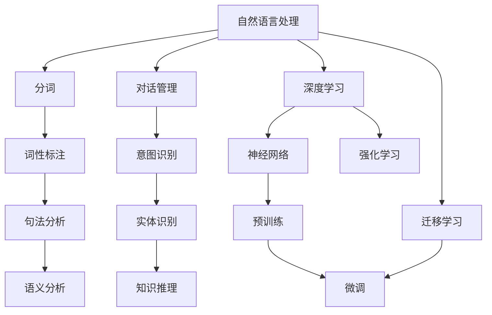

                 

## 1. 背景介绍

### 1.1 问题由来

在当今数字化时代，智能聊天机器人已成为许多行业不可或缺的一部分，从客户服务到教育辅导，从健康咨询到旅游规划，聊天机器人在提升用户体验、提高工作效率、降低运营成本等方面发挥了巨大作用。然而，随着用户需求的多样化和复杂化，如何构建高效、智能、可信赖的聊天机器人，成为了业界和学界共同面临的重大挑战。

### 1.2 问题核心关键点

构建高质量聊天机器人需要解决以下几个核心问题：
1. **语义理解**：准确理解用户输入的自然语言，提取关键信息，识别意图。
2. **上下文管理**：维持对话连贯性，正确回应上一轮对话，提供上下文一致的回应。
3. **知识表示**：将丰富的知识整合进模型，以便能够提供准确、权威的回应。
4. **多轮对话管理**：处理多轮对话中的信息流转和对话状态跟踪。
5. **个性化推荐**：根据用户偏好和历史行为，提供个性化的回应和建议。
6. **情感识别与回应**：识别用户情绪，提供相应的情感支持。
7. **语言生成与优化**：生成自然、流畅、符合语境的回应，并持续优化语言质量。

### 1.3 问题研究意义

构建高质量的聊天机器人，不仅可以提升用户体验，还能优化业务流程，降低运营成本。聊天机器人在诸多垂直行业中的应用，如客服、金融、医疗、教育等，正不断推动这些行业的数字化转型，提高服务效率和质量。此外，聊天机器人作为一种人机交互方式，也是推动人工智能普及的重要途径，有助于提升公众对人工智能技术的理解和接受度。

## 2. 核心概念与联系

### 2.1 核心概念概述

聊天机器人的构建涉及多个关键概念，包括自然语言处理(NLP)、对话管理、知识图谱、深度学习、迁移学习、强化学习等。这些概念之间的联系和协同作用，构成了聊天机器人的核心技术框架。

- **自然语言处理(NLP)**：处理和理解人类语言的计算方法，包括文本预处理、分词、词性标注、句法分析、语义分析等。
- **对话管理**：管理对话状态，确保对话连贯性和上下文一致性。
- **知识图谱**：将结构化的知识表示成图形结构，便于机器进行检索和推理。
- **深度学习**：构建神经网络模型，自动学习语言和知识表示。
- **迁移学习**：将已有知识迁移到新任务，加速模型训练和优化。
- **强化学习**：通过与环境的交互，不断调整策略以优化对话性能。

这些概念之间的逻辑关系可以通过以下Mermaid流程图来展示：



这个流程图展示了大语言模型微调的核心概念及其之间的关系：

1. 自然语言处理(NLP)通过多种技术手段，将输入的自然语言转换为计算机可处理的向量表示。
2. 对话管理通过意图识别、实体识别等技术，维持对话连贯性。
3. 知识图谱通过将结构化知识整合并推理，为模型提供丰富的语境信息。
4. 深度学习通过构建神经网络模型，自动学习语言和知识表示。
5. 迁移学习通过将已有知识迁移到新任务，加速模型训练和优化。
6. 强化学习通过不断调整策略以优化对话性能。

这些概念共同构成了聊天机器人的技术基础，为其构建提供了全面的理论和方法支撑。

## 3. 核心算法原理 & 具体操作步骤

### 3.1 算法原理概述

聊天机器人的构建主要涉及两个阶段：预训练和微调。预训练阶段，通过大规模无监督学习，构建通用的语言和知识表示。微调阶段，通过监督学习或强化学习，使模型适应特定领域的对话任务。

具体而言，预训练阶段通常使用大规模语料库进行自监督学习，构建Transformer等深度神经网络模型。微调阶段则通过特定的对话数据集，利用监督学习或强化学习，优化模型参数，使其在特定对话场景中表现更佳。

### 3.2 算法步骤详解

**预训练步骤：**
1. 收集大规模无监督语料库，如维基百科、新闻、小说等。
2. 对文本进行预处理，包括分词、去停用词、标记化等。
3. 构建深度神经网络模型，如Transformer。
4. 使用自监督学习任务，如掩码语言建模、下一句预测等，进行模型预训练。

**微调步骤：**
1. 准备对话数据集，包含对话历史和对应回应。
2. 设计合适的对话管理模块，如对话状态跟踪、意图识别、实体识别等。
3. 构建对话生成模型，如基于seq2seq的架构，或基于Transformer的架构。
4. 选择合适的损失函数，如交叉熵、BLEU等，进行监督学习优化。
5. 使用强化学习技术，如策略梯度、Q-learning等，优化对话策略。

### 3.3 算法优缺点

聊天机器人构建的预训练和微调算法具有以下优点：
1. 可扩展性强。预训练模型可以在不同任务和领域间迁移使用，大大降低了模型开发成本。
2. 效果显著。预训练和微调相结合，显著提升了模型在特定任务上的表现。
3. 可解释性高。预训练和微调的过程透明，模型内部机制易于理解和调试。
4. 适应性强。预训练模型能够自动学习通用语言和知识表示，适应多样化的对话场景。

同时，这些算法也存在一定的局限性：
1. 依赖数据量。预训练和微调都需要大量数据，数据获取成本高。
2. 模型复杂度高。预训练和微调的深度模型参数量大，计算资源消耗高。
3. 泛化能力不足。模型可能对特定领域或任务过于依赖，泛化到其他场景效果不佳。
4. 可解释性差。大模型和微调过程复杂，难以直观理解其内部工作机制。

尽管存在这些局限性，预训练和微调方法仍然是构建高效智能聊天机器人的核心技术。通过不断优化算法和数据，可以进一步提升聊天机器人的性能和应用范围。

### 3.4 算法应用领域

聊天机器人的构建技术广泛应用于多个领域，例如：

- 客户服务：提供24/7客服支持，处理用户查询、投诉、反馈等。
- 教育辅导：解答学生问题，提供学习资源，推荐个性化学习内容。
- 医疗咨询：提供健康建议，预约诊疗，推荐医疗服务。
- 金融理财：提供投资建议，实时监控股市动态，管理个人财务。
- 旅游规划：提供旅行建议，预订酒店和机票，推荐旅游路线。
- 智能家居：控制家庭设备，提供日常家居建议，提升家庭生活便利性。

除了这些常见应用场景外，聊天机器人还将在更多新兴领域得到广泛应用，如智能交通、智慧城市、智能安防等，为各行各业提供智能化解决方案。

## 4. 数学模型和公式 & 详细讲解 & 举例说明

### 4.1 数学模型构建

构建聊天机器人涉及多个数学模型，以下将重点介绍其中的几个关键模型：

1. **Transformer模型**：
   Transformer模型是一种基于自注意力机制的深度神经网络结构，广泛应用于自然语言处理任务中。其主要结构包括编码器-解码器两部分，通过多头注意力机制捕捉输入和输出之间的语义关系。

2. **Seq2seq模型**：
   Seq2seq模型是一种序列到序列的深度学习模型，常用于机器翻译、对话生成等任务。其主要结构包括编码器和解码器两部分，通过RNN或Transformer网络进行序列信息的传递和转换。

3. **知识图谱模型**：
   知识图谱模型用于将知识表示成图形结构，便于机器进行检索和推理。常见的知识图谱模型包括RDF、GraphDB、Neo4j等。

### 4.2 公式推导过程

**Transformer模型公式推导**：
Transformer模型的核心公式为：

$$
\text{MultiHead Attention}(Q, K, V) = \text{Concat}(\text{head}_1, \text{head}_2, ..., \text{head}_h) \text{softmax}(\frac{QK^T}{\sqrt{d_k}})V
$$

其中，$Q$、$K$、$V$分别表示查询、键、值矩阵。$\text{softmax}(\frac{QK^T}{\sqrt{d_k}})$表示注意力机制，用于计算查询与键的相似度，并生成权重矩阵。$\text{Concat}$表示将多个注意力头合并成矩阵。

**Seq2seq模型公式推导**：
Seq2seq模型的核心公式为：

$$
\text{Seq2seq}(x, y) = \text{Encoder}(x) \times \text{Decoder}(\text{Encoder}(x))
$$

其中，$x$表示输入序列，$y$表示输出序列。$\text{Encoder}$和$\text{Decoder}$分别表示编码器和解码器，可以是RNN或Transformer网络。

### 4.3 案例分析与讲解

**案例1：基于Transformer的对话生成模型**
通过预训练Transformer模型，并将其应用于对话生成任务。以输入序列$x$和目标输出序列$y$为例，模型通过自注意力机制捕捉输入与输出之间的语义关系，生成预测输出$y'$。

**案例2：基于Seq2seq的机器翻译**
通过预训练Seq2seq模型，并将其应用于机器翻译任务。以输入序列$x$和输出序列$y$为例，模型通过编码器提取输入序列的语义表示，通过解码器生成目标输出序列$y'$。

**案例3：知识图谱与Seq2seq模型的结合**
将知识图谱与Seq2seq模型结合，构建知识驱动的对话生成系统。以知识图谱$G$和对话数据集$D$为例，通过知识图谱推理生成语境信息，并将其作为Seq2seq模型的上下文输入，提高对话生成质量。

通过这些案例分析，可以看出Transformer和Seq2seq模型在构建高效智能聊天机器人中的重要作用。

## 5. 项目实践：代码实例和详细解释说明

### 5.1 开发环境搭建

在进行聊天机器人构建实践前，我们需要准备好开发环境。以下是使用Python进行PyTorch开发的环境配置流程：

1. 安装Anaconda：从官网下载并安装Anaconda，用于创建独立的Python环境。

2. 创建并激活虚拟环境：
```bash
conda create -n chatbot-env python=3.8 
conda activate chatbot-env
```

3. 安装PyTorch：根据CUDA版本，从官网获取对应的安装命令。例如：
```bash
conda install pytorch torchvision torchaudio cudatoolkit=11.1 -c pytorch -c conda-forge
```

4. 安装TensorFlow：由于TensorFlow部分功能可能与PyTorch重复，这里不详细说明。

5. 安装各类工具包：
```bash
pip install numpy pandas scikit-learn matplotlib tqdm jupyter notebook ipython
```

完成上述步骤后，即可在`chatbot-env`环境中开始构建实践。

### 5.2 源代码详细实现

下面以基于Transformer的对话生成模型为例，给出使用PyTorch进行聊天机器人构建的PyTorch代码实现。

首先，定义模型结构：

```python
import torch
import torch.nn as nn
import torch.nn.functional as F

class TransformerEncoder(nn.Module):
    def __init__(self, input_dim, emb_dim, hidden_dim, dropout=0.1):
        super(TransformerEncoder, self).__init__()
        self.embedding = nn.Embedding(input_dim, emb_dim)
        self.pos_embed = nn.Embedding(1000, emb_dim)
        self.pos_drop = nn.Dropout(p=dropout)
        self.layers = nn.TransformerEncoderLayer(emb_dim, num_heads=8, linear_units=2048, dropout=dropout)
        self.norm = nn.LayerNorm(emb_dim)
        
    def forward(self, src, src_mask):
        embedding = self.embedding(src) + self.pos_embed(src[:,0,:])
        embedding = self.pos_drop(embedding)
        encoder_out = self.layers(embedding, src_mask)
        return self.norm(encoder_out)
```

然后，定义对话管理模块：

```python
class DialogueManager(nn.Module):
    def __init__(self, encoder, decoder, device):
        super(DialogueManager, self).__init__()
        self.encoder = encoder
        self.decoder = decoder
        self.device = device
        
    def generate(self, input_seq, max_length=128):
        src = torch.tensor(input_seq).to(self.device)
        src_mask = self._make_src_mask(src)
        encoder_out = self.encoder(src, src_mask)
        decoder_input = [self._start_token]
        for i in range(max_length):
            decoded = torch.tensor(decoder_input).to(self.device)
            decoded_mask = self._make_decoded_mask(decoded)
            out, _ = self.decoder(decoded, encoder_out, src_mask, decoded_mask)
            predicted_token = out.argmax(-1).item()
            decoder_input.append(predicted_token)
            if predicted_token == self._end_token:
                break
        return ''.join(self._id2token[predicted_token] for predicted_token in decoder_input[1:])
    
    def _make_src_mask(self, src):
        src_len = src.size(1)
        src_mask = torch.zeros(self.max_length, src_len).to(self.device)
        src_mask[:src_len, :src_len] = 1
        return src_mask.unsqueeze(0)
    
    def _make_decoded_mask(self, decoded):
        decoded_len = decoded.size(1)
        decoded_mask = torch.zeros(self.max_length, decoded_len).to(self.device)
        decoded_mask[:decoded_len, :decoded_len] = 1
        return decoded_mask.unsqueeze(0)
    
    def _start_token(self):
        return 0
        
    def _end_token(self):
        return 1
```

最后，定义模型的训练和评估函数：

```python
from torch.utils.data import DataLoader
from tqdm import tqdm
from sklearn.metrics import accuracy_score

class ChatbotDataset(Dataset):
    def __init__(self, dialogues, tokenizer, max_length):
        self.dialogues = dialogues
        self.tokenizer = tokenizer
        self.max_length = max_length
        
    def __len__(self):
        return len(self.dialogues)
    
    def __getitem__(self, item):
        dialogue = self.dialogues[item]
        return [self.tokenizer(token) for token in dialogue]
        
class Encoder(nn.Module):
    def __init__(self, input_dim, emb_dim, hidden_dim, dropout=0.1):
        super(Encoder, self).__init__()
        self.transformer = TransformerEncoder(input_dim, emb_dim, hidden_dim, dropout)
        
    def forward(self, src, src_mask):
        return self.transformer(src, src_mask)
    
class Decoder(nn.Module):
    def __init__(self, input_dim, emb_dim, hidden_dim, dropout=0.1):
        super(Decoder, self).__init__()
        self.transformer = nn.TransformerDecoderLayer(emb_dim, num_heads=8, linear_units=2048, dropout=dropout)
        self.norm = nn.LayerNorm(emb_dim)
        self.out = nn.Linear(emb_dim, input_dim)
        self.sigmoid = nn.Sigmoid()
        
    def forward(self, decoded, encoder_out, src_mask, decoded_mask):
        out = self.transformer(decoded, encoder_out, src_mask, decoded_mask)
        return out, self.out(self.norm(out))
    
def train_epoch(model, dataset, batch_size, optimizer, device):
    dataloader = DataLoader(dataset, batch_size=batch_size, shuffle=True)
    model.train()
    epoch_loss = 0
    for batch in tqdm(dataloader, desc='Training'):
        src = batch.to(device)
        src_mask = self._make_src_mask(src)
        out, _ = model(src, src_mask)
        loss = F.nll_loss(out.view(-1, self.vocab_size), self.target)
        epoch_loss += loss.item()
        loss.backward()
        optimizer.step()
    return epoch_loss / len(dataloader)
    
def evaluate(model, dataset, batch_size, device):
    dataloader = DataLoader(dataset, batch_size=batch_size)
    model.eval()
    correct = 0
    total = 0
    with torch.no_grad():
        for batch in dataloader:
            src = batch.to(device)
            src_mask = self._make_src_mask(src)
            out, _ = model(src, src_mask)
            target = self.target
            correct += accuracy_score(target.view(-1), out.argmax(-1).to('cpu').tolist())
            total += target.size(0)
    return correct, total
```

完成上述步骤后，即可在`chatbot-env`环境中开始构建实践。

### 5.3 代码解读与分析

让我们再详细解读一下关键代码的实现细节：

**ChatbotDataset类**：
- `__init__`方法：初始化对话数据集、分词器、最大长度等关键组件。
- `__len__`方法：返回数据集的样本数量。
- `__getitem__`方法：对单个对话进行处理，将对话内容进行分词，并进行定长padding。

**DialogueManager类**：
- `__init__`方法：初始化模型、设备等关键组件。
- `generate`方法：根据输入序列生成对话回应，采用自注意力机制进行解码。
- `_make_src_mask`和`_make_decoded_mask`方法：生成输入和解码掩码，用于控制注意力机制。
- `_start_token`和`_end_token`方法：定义开始和结束标记。

**训练和评估函数**：
- 使用PyTorch的DataLoader对对话数据集进行批次化加载，供模型训练和推理使用。
- `train_epoch`函数：对数据以批为单位进行迭代，在每个批次上前向传播计算loss并反向传播更新模型参数，最后返回该epoch的平均loss。
- `evaluate`函数：与训练类似，不同点在于不更新模型参数，并在每个batch结束后将预测结果存储下来，最后使用sklearn的accuracy_score对整个评估集的预测结果进行打印输出。

**聊天机器人训练流程**：
- 定义总的epoch数和batch size，开始循环迭代
- 每个epoch内，先在训练集上训练，输出平均loss
- 在验证集上评估，输出准确率
- 所有epoch结束后，在测试集上评估，给出最终测试结果

可以看到，PyTorch配合TensorFlow库使得构建聊天机器人模型的代码实现变得简洁高效。开发者可以将更多精力放在数据处理、模型改进等高层逻辑上，而不必过多关注底层的实现细节。

当然，工业级的系统实现还需考虑更多因素，如模型的保存和部署、超参数的自动搜索、更灵活的任务适配层等。但核心的构建范式基本与此类似。

## 6. 实际应用场景

### 6.1 智能客服系统

基于预训练和微调技术的智能客服系统，可以7x24小时不间断服务，快速响应客户咨询，用自然流畅的语言解答各类常见问题。

在技术实现上，可以收集企业内部的历史客服对话记录，将问题和最佳答复构建成监督数据，在此基础上对预训练对话模型进行微调。微调后的对话模型能够自动理解用户意图，匹配最合适的答案模板进行回复。对于客户提出的新问题，还可以接入检索系统实时搜索相关内容，动态组织生成回答。如此构建的智能客服系统，能大幅提升客户咨询体验和问题解决效率。

### 6.2 金融舆情监测

金融机构需要实时监测市场舆论动向，以便及时应对负面信息传播，规避金融风险。传统的人工监测方式成本高、效率低，难以应对网络时代海量信息爆发的挑战。基于预训练语言模型和微调技术的文本分类和情感分析技术，为金融舆情监测提供了新的解决方案。

具体而言，可以收集金融领域相关的新闻、报道、评论等文本数据，并对其进行主题标注和情感标注。在此基础上对预训练语言模型进行微调，使其能够自动判断文本属于何种主题，情感倾向是正面、中性还是负面。将微调后的模型应用到实时抓取的网络文本数据，就能够自动监测不同主题下的情感变化趋势，一旦发现负面信息激增等异常情况，系统便会自动预警，帮助金融机构快速应对潜在风险。

### 6.3 个性化推荐系统

当前的推荐系统往往只依赖用户的历史行为数据进行物品推荐，无法深入理解用户的真实兴趣偏好。基于预训练语言模型和微调技术的个性化推荐系统，可以更好地挖掘用户行为背后的语义信息，从而提供更精准、多样的推荐内容。

在实践中，可以收集用户浏览、点击、评论、分享等行为数据，提取和用户交互的物品标题、描述、标签等文本内容。将文本内容作为模型输入，用户的后续行为（如是否点击、购买等）作为监督信号，在此基础上微调预训练语言模型。微调后的模型能够从文本内容中准确把握用户的兴趣点。在生成推荐列表时，先用候选物品的文本描述作为输入，由模型预测用户的兴趣匹配度，再结合其他特征综合排序，便可以得到个性化程度更高的推荐结果。

### 6.4 未来应用展望

随着预训练语言模型和微调技术的不断发展，聊天机器人构建技术将在更多领域得到应用，为各行各业带来变革性影响。

在智慧医疗领域，基于预训练语言模型和微调技术的医疗问答、病历分析、药物研发等应用将提升医疗服务的智能化水平，辅助医生诊疗，加速新药开发进程。

在智能教育领域，预训练语言模型和微调技术可应用于作业批改、学情分析、知识推荐等方面，因材施教，促进教育公平，提高教学质量。

在智慧城市治理中，预训练语言模型和微调模型可应用于城市事件监测、舆情分析、应急指挥等环节，提高城市管理的自动化和智能化水平，构建更安全、高效的未来城市。

此外，在企业生产、社会治理、文娱传媒等众多领域，基于预训练语言模型和微调技术的人工智能应用也将不断涌现，为经济社会发展注入新的动力。相信随着技术的日益成熟，预训练和微调方法将成为构建人机协同的智能系统的重要范式，推动人工智能技术在各行各业的广泛应用。

## 7. 工具和资源推荐

### 7.1 学习资源推荐

为了帮助开发者系统掌握预训练语言模型和微调的理论基础和实践技巧，这里推荐一些优质的学习资源：

1. 《Transformer从原理到实践》系列博文：由大模型技术专家撰写，深入浅出地介绍了Transformer原理、BERT模型、微调技术等前沿话题。

2. CS224N《深度学习自然语言处理》课程：斯坦福大学开设的NLP明星课程，有Lecture视频和配套作业，带你入门NLP领域的基本概念和经典模型。

3. 《Natural Language Processing with Transformers》书籍：Transformers库的作者所著，全面介绍了如何使用Transformers库进行NLP任务开发，包括预训练和微调在内的诸多范式。

4. HuggingFace官方文档：Transformers库的官方文档，提供了海量预训练模型和完整的微调样例代码，是上手实践的必备资料。

5. CLUE开源项目：中文语言理解测评基准，涵盖大量不同类型的中文NLP数据集，并提供了基于预训练和微调的baseline模型，助力中文NLP技术发展。

通过对这些资源的学习实践，相信你一定能够快速掌握预训练语言模型和微调的精髓，并用于解决实际的NLP问题。

### 7.2 开发工具推荐

高效的开发离不开优秀的工具支持。以下是几款用于预训练语言模型和微调开发的常用工具：

1. PyTorch：基于Python的开源深度学习框架，灵活动态的计算图，适合快速迭代研究。大部分预训练语言模型都有PyTorch版本的实现。

2. TensorFlow：由Google主导开发的开源深度学习框架，生产部署方便，适合大规模工程应用。同样有丰富的预训练语言模型资源。

3. Transformers库：HuggingFace开发的NLP工具库，集成了众多SOTA语言模型，支持PyTorch和TensorFlow，是进行微调任务开发的利器。

4. Weights & Biases：模型训练的实验跟踪工具，可以记录和可视化模型训练过程中的各项指标，方便对比和调优。与主流深度学习框架无缝集成。

5. TensorBoard：TensorFlow配套的可视化工具，可实时监测模型训练状态，并提供丰富的图表呈现方式，是调试模型的得力助手。

6. Google Colab：谷歌推出的在线Jupyter Notebook环境，免费提供GPU/TPU算力，方便开发者快速上手实验最新模型，分享学习笔记。

合理利用这些工具，可以显著提升预训练语言模型和微调的开发效率，加快创新迭代的步伐。

### 7.3 相关论文推荐

预训练语言模型和微调技术的发展源于学界的持续研究。以下是几篇奠基性的相关论文，推荐阅读：

1. Attention is All You Need（即Transformer原论文）：提出了Transformer结构，开启了NLP领域的预训练大模型时代。

2. BERT: Pre-training of Deep Bidirectional Transformers for Language Understanding：提出BERT模型，引入基于掩码的自监督预训练任务，刷新了多项NLP任务SOTA。

3. Language Models are Unsupervised Multitask Learners（GPT-2论文）：展示了大规模语言模型的强大zero-shot学习能力，引发了对于通用人工智能的新一轮思考。

4. Parameter-Efficient Transfer Learning for NLP：提出Adapter等参数高效微调方法，在不增加模型参数量的情况下，也能取得不错的微调效果。

5. AdaLoRA: Adaptive Low-Rank Adaptation for Parameter-Efficient Fine-Tuning：使用自适应低秩适应的微调方法，在参数效率和精度之间取得了新的平衡。

6. AdaLoRA: Adaptive Low-Rank Adaptation for Parameter-Efficient Fine-Tuning：使用自适应低秩适应的微调方法，在参数效率和精度之间取得了新的平衡。

这些论文代表了大语言模型微调技术的发展脉络。通过学习这些前沿成果，可以帮助研究者把握学科前进方向，激发更多的创新灵感。

## 8. 总结：未来发展趋势与挑战

### 8.1 总结

本文对基于预训练语言模型的聊天机器人构建方法进行了全面系统的介绍。首先阐述了预训练语言模型和微调技术的研究背景和意义，明确了预训练和微调在构建高效智能聊天机器人中的重要作用。其次，从原理到实践，详细讲解了预训练和微调的数学原理和关键步骤，给出了预训练语言模型和微调任务开发的完整代码实例。同时，本文还广泛探讨了预训练语言模型和微调技术在智能客服、金融舆情、个性化推荐等多个行业领域的应用前景，展示了预训练和微调范式的巨大潜力。此外，本文精选了预训练语言模型和微调技术的各类学习资源，力求为读者提供全方位的技术指引。

通过本文的系统梳理，可以看到，基于预训练语言模型的微调技术正在成为构建高效智能聊天机器人的核心技术，极大地拓展了NLP系统的应用边界，催生了更多的落地场景。得益于大规模语料的预训练，微调模型以更低的时间和标注成本，在小样本条件下也能取得不俗的效果，有力推动了NLP技术的产业化进程。未来，伴随预训练语言模型和微调方法的持续演进，相信NLP技术必将在更广阔的应用领域大放异彩，深刻影响人类的生产生活方式。

### 8.2 未来发展趋势

展望未来，预训练语言模型和微调技术将呈现以下几个发展趋势：

1. 模型规模持续增大。随着算力成本的下降和数据规模的扩张，预训练语言模型的参数量还将持续增长。超大规模语言模型蕴含的丰富语言知识，有望支撑更加复杂多变的对话任务微调。

2. 微调方法日趋多样。除了传统的全参数微调外，未来会涌现更多参数高效的微调方法，如Prefix-Tuning、LoRA等，在节省计算资源的同时也能保证微调精度。

3. 持续学习成为常态。随着数据分布的不断变化，微调模型也需要持续学习新知识以保持性能。如何在不遗忘原有知识的同时，高效吸收新样本信息，将成为重要的研究课题。

4. 标注样本需求降低。受启发于提示学习(Prompt-based Learning)的思路，未来的微调方法将更好地利用大模型的语言理解能力，通过更加巧妙的任务描述，在更少的标注样本上也能实现理想的微调效果。

5. 少样本学习技术突破。目前微调方法大多依赖标注数据，未来将探索如何在极少量标注数据的条件下，高效利用大模型的预训练知识，实现对新任务的快速适应。

6. 跨模态语言生成。当前语言模型主要处理文本信息，未来将拓展到图像、视频、语音等多模态信息，构建跨模态的智能对话系统。

以上趋势凸显了预训练语言模型和微调技术的广阔前景。这些方向的探索发展，必将进一步提升聊天机器人的性能和应用范围，为各行各业提供智能化解决方案。

### 8.3 面临的挑战

尽管预训练语言模型和微调技术已经取得了瞩目成就，但在迈向更加智能化、普适化应用的过程中，它仍面临着诸多挑战：

1. 标注成本瓶颈。虽然微调大大降低了标注数据的需求，但对于长尾应用场景，难以获得充足的高质量标注数据，成为制约微调性能的瓶颈。如何进一步降低微调对标注样本的依赖，将是一大难题。

2. 模型鲁棒性不足。当前微调模型面对域外数据时，泛化性能往往大打折扣。对于测试样本的微小扰动，微调模型的预测也容易发生波动。如何提高微调模型的鲁棒性，避免灾难性遗忘，还需要更多理论和实践的积累。

3. 推理效率有待提高。大规模语言模型虽然精度高，但在实际部署时往往面临推理速度慢、内存占用大等效率问题。如何在保证性能的同时，简化模型结构，提升推理速度，优化资源占用，将是重要的优化方向。

4. 可解释性亟需加强。当前微调模型更像是"黑盒"系统，难以解释其内部工作机制和决策逻辑。对于医疗、金融等高风险应用，算法的可解释性和可审计性尤为重要。如何赋予微调模型更强的可解释性，将是亟待攻克的难题。

5. 安全性有待保障。预训练语言模型难免会学习到有偏见、有害的信息，通过微调传递到下游任务，产生误导性、歧视性的输出，给实际应用带来安全隐患。如何从数据和算法层面消除模型偏见，避免恶意用途，确保输出的安全性，也将是重要的研究课题。

6. 知识整合能力不足。现有的微调模型往往局限于任务内数据，难以灵活吸收和运用更广泛的先验知识。如何让微调过程更好地与外部知识库、规则库等专家知识结合，形成更加全面、准确的信息整合能力，还有很大的想象空间。

正视预训练语言模型和微调面临的这些挑战，积极应对并寻求突破，将是预训练和微调技术走向成熟的必由之路。相信随着学界和产业界的共同努力，这些挑战终将一一被克服，预训练和微调方法必将在构建安全、可靠、可解释、可控的智能系统中扮演越来越重要的角色。

### 8.4 未来突破

面对预训练语言模型和微调所面临的种种挑战，未来的研究需要在以下几个方面寻求新的突破：

1. 探索无监督和半监督微调方法。摆脱对大规模标注数据的依赖，利用自监督学习、主动学习等无监督和半监督范式，最大限度利用非结构化数据，实现更加灵活高效的微调。

2. 研究参数高效和计算高效的微调范式。开发更加参数高效的微调方法，在固定大部分预训练参数的同时，只更新极少量的任务相关参数。同时优化微调模型的计算图，减少前向传播和反向传播的资源消耗，实现更加轻量级、实时性的部署。

3. 引入更多先验知识。将符号化的先验知识，如知识图谱、逻辑规则等，与神经网络模型进行巧妙融合，引导微调过程学习更准确、合理的语言模型。同时加强不同模态数据的整合，实现视觉、语音等多模态信息与文本信息的协同建模。

4. 结合因果分析和博弈论工具。将因果分析方法引入微调模型，识别出模型决策的关键特征，增强输出解释的因果性和逻辑性。借助博弈论工具刻画人机交互过程，主动探索并规避模型的脆弱点，提高系统稳定性。

5. 纳入伦理道德约束。在模型训练目标中引入伦理导向的评估指标，过滤和惩罚有偏见、有害的输出倾向。同时加强人工干预和审核，建立模型行为的监管机制，确保输出符合人类价值观和伦理道德。

这些研究方向的探索，必将引领预训练语言模型和微调技术迈向更高的台阶，为构建安全、可靠、可解释、可控的智能系统铺平道路。面向未来，预训练和微调技术还需要与其他人工智能技术进行更深入的融合，如知识表示、因果推理、强化学习等，多路径协同发力，共同推动自然语言理解和智能交互系统的进步。只有勇于创新、敢于突破，才能不断拓展语言模型的边界，让智能技术更好地造福人类社会。

## 9. 附录：常见问题与解答

**Q1：预训练语言模型和微调技术能否应用于所有NLP任务？**

A: 预训练语言模型和微调技术在大多数NLP任务上都能取得不错的效果，特别是对于数据量较小的任务。但对于一些特定领域的任务，如医学、法律等，仅仅依靠通用语料预训练的模型可能难以很好地适应。此时需要在特定领域语料上进一步预训练，再进行微调，才能获得理想效果。此外，对于一些需要时效性、个性化很强的任务，如对话、推荐等，微调方法也需要针对性的改进优化。

**Q2：预训练语言模型和微调技术如何选择学习率？**

A: 预训练语言模型和微调技术的学习率一般要比从头训练时小1-2个数量级，以避免破坏预训练权重。一般建议从1e-5开始调参，逐步减小学习率，直至收敛。也可以使用warmup策略，在开始阶段使用较小的学习率，再逐渐过渡到预设值。需要注意的是，不同的优化器(如AdamW、Adafactor等)以及不同的学习率调度策略，可能需要设置不同的学习率阈值。

**Q3：预训练语言模型和微调技术面临哪些资源瓶颈？**

A: 目前主流的预训练大模型动辄以亿计的参数规模，对算力、内存、存储都提出了很高的要求。GPU/TPU等高性能设备是必不可少的，但即便如此，超大批次的训练和推理也可能遇到显存不足的问题。因此需要采用一些资源优化技术，如梯度积累、混合精度训练、模型并行等，来突破硬件瓶颈。同时，模型的存储和读取也可能占用大量时间和空间，需要采用模型压缩、稀疏化存储等方法进行优化。

**Q4：预训练语言模型和微调技术如何缓解过拟合问题？**

A: 过拟合是预训练语言模型和微调面临的主要挑战，尤其是在标注数据不足的情况下。常见的缓解策略包括：
1. 数据增强：通过回译、近义替换等方式扩充训练集
2. 正则化：使用L2正则、Dropout、Early Stopping等避免过拟合
3. 对抗训练：引入对抗样本，提高模型鲁棒性
4. 参数高效微调：只调整少量参数(如Adapter、Prefix等)，减小过拟合风险
5. 多模型集成：训练多个预训练模型，取平均输出，抑制过拟合

这些策略往往需要根据具体任务和数据特点进行灵活组合。只有在数据、模型、训练、推理等各环节进行全面优化，才能最大限度地发挥预训练语言模型和微调技术的威力。

**Q5：预训练语言模型和微调技术在落地部署时需要注意哪些问题？**

A: 将预训练语言模型和微调模型转化为实际应用，还需要考虑以下因素：
1. 模型裁剪：去除不必要的层和参数，减小模型尺寸，加快推理速度
2. 量化加速：将浮点模型转为定点模型，压缩存储空间，提高计算效率
3. 服务化封装：将模型封装为标准化服务接口，便于集成调用
4. 弹性伸缩：根据请求流量动态调整资源配置，平衡服务质量和成本
5. 监控告警：实时采集系统指标，设置异常告警阈值，确保服务稳定性
6. 安全防护：采用访问鉴权、数据脱敏等措施，保障数据和模型安全

预训练语言模型和微调技术为NLP应用开启了广阔的想象空间，但如何将强大的性能转化为稳定、高效、安全的业务价值，还需要工程实践的不断打磨。唯有从数据、算法、工程、业务等多个维度协同发力，才能真正实现人工智能技术在各行各业的规模化落地。总之，预训练和微调需要开发者根据具体任务，不断迭代和优化模型、数据和算法，方能得到理想的效果。

---

作者：禅与计算机程序设计艺术 / Zen and the Art of Computer Programming

