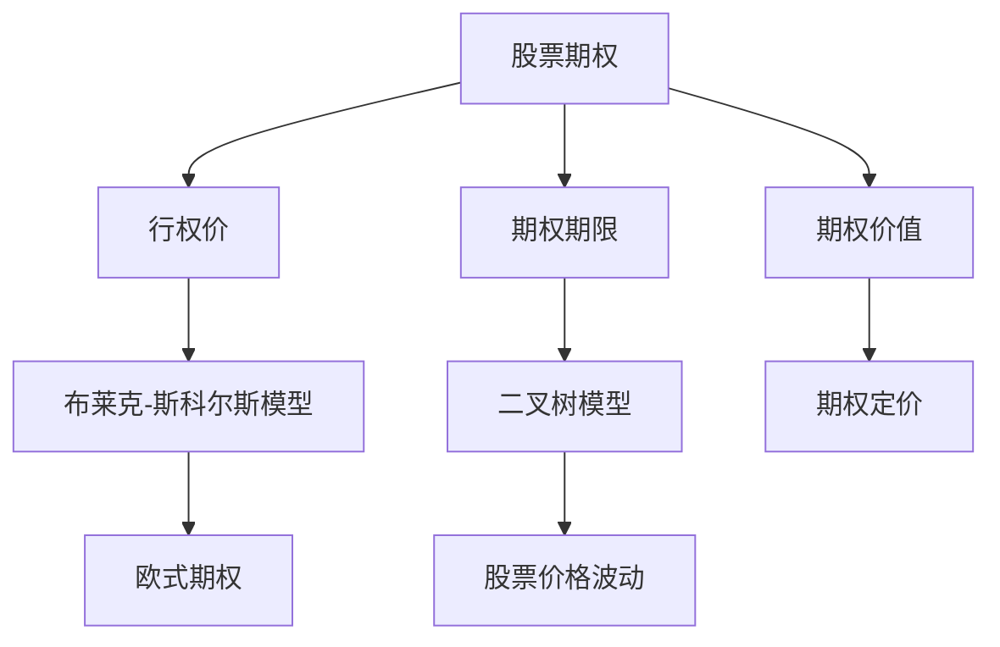

                 

# 股票期权：程序员的财富密码？

## 1. 背景介绍

### 1.1 问题由来
随着科技行业的快速发展，程序员作为一个群体在各行各业中的需求日益增长。然而，尽管程序员在技术上的积累越来越丰富，经济上的收入往往与他们的努力和付出不成正比。这导致程序员面临着一定的财务压力，以及对于财富增长的渴望。

股票期权作为一种常见的员工福利，正逐渐成为程序员和科技公司吸引和保留人才的重要手段。本文章将探讨股票期权的本质、如何计算期权价值，以及如何将股票期权转化为财富密码，帮助程序员实现财务自由。

### 1.2 问题核心关键点
股票期权的核心在于将公司的股票价格波动转化为员工的收入增长。公司以固定的价格（行权价）将股票期权授予员工，员工在未来一段时间内可以以这个固定价格购买公司的股票。如果股票价格在此期间上涨，员工卖出股票获得差价，实现财富增值。

本文将围绕以下核心问题展开：
- 股票期权的基本概念和计算方法
- 如何有效评估和利用股票期权
- 股票期权的实际应用场景及策略
- 未来股票期权的发展趋势和面临的挑战

## 2. 核心概念与联系

### 2.1 核心概念概述
- **股票期权（Stock Option）**：一种公司给予员工的特殊权利，允许员工在未来以固定价格（行权价）购买公司的股票。
- **行权价（Strike Price）**：股票期权的固定价格，员工可以在这个价格购买公司的股票。
- **期权期限（Option Term）**：股票期权可以被行权的期限，一般以年或月计算。
- **期权价值（Option Value）**：股票期权的市场价值，通常通过期权定价模型计算得出。
- **布莱克-斯科尔斯模型（Black-Scholes Model）**：一种用于计算欧式期权价值的数学模型，广泛应用于股票期权定价。
- **二叉树模型（Binomial Tree Model）**：一种基于股票价格变动的二叉树模型，用于计算期权价值。

### 2.2 核心概念原理和架构的 Mermaid 流程图



这个流程图展示了股票期权的计算过程，从基本概念到具体模型，再到期权定价，整个链条清晰明了。

## 3. 核心算法原理 & 具体操作步骤

### 3.1 算法原理概述

股票期权的定价主要依赖于期权定价模型，其中最著名的是布莱克-斯科尔斯模型。布莱克-斯科尔斯模型基于欧式期权，假设股票价格服从几何布朗运动，计算期权的内在价值和时间价值，并综合考虑无风险利率、期权期限和股票波动率，得出期权的市场价值。

二叉树模型是另一种常用的期权定价模型，基于股票价格的波动性质，通过构建二叉树来模拟股票价格的未来走势，并计算期权价值。

### 3.2 算法步骤详解

#### 3.2.1 布莱克-斯科尔斯模型步骤详解
1. **输入参数**：行权价（S）、股票当前价格（K）、无风险利率（r）、期权期限（T）、股票波动率（σ）。
2. **计算股票价格的期望值**：使用几何布朗运动模型，计算期权期限内的股票期望价格。
3. **计算期权的期望值**：计算期权的内在价值和时间价值，综合考虑无风险利率和期权期限，得出期权的市场价值。

#### 3.2.2 二叉树模型步骤详解
1. **输入参数**：行权价（S）、股票当前价格（K）、期权期限（T）、无风险利率（r）、股票波动率（σ）。
2. **构建二叉树**：构建以当前股票价格为中心的左、右二叉树，每个节点代表未来某个时间点的股票价格。
3. **计算期权价值**：递归地计算每个节点的期权价值，综合考虑所有可能路径的期权价值，得出期权的市场价值。

### 3.3 算法优缺点

#### 3.3.1 布莱克-斯科尔斯模型的优点
- **计算简单**：公式简单，易于实现。
- **适用范围广**：适用于欧式期权和美式期权。
- **模型经典**：作为期权定价的标准模型，广泛应用。

#### 3.3.2 布莱克-斯科尔斯模型的缺点
- **假设条件严格**：假设股票价格服从几何布朗运动，现实情况可能有所偏差。
- **不考虑交易成本**：期权交易可能存在交易成本，模型未考虑。

#### 3.3.3 二叉树模型的优点
- **适用范围广**：适用于欧式期权和美式期权。
- **模型灵活**：可以处理多种期权类型，如障碍期权、路径依赖期权等。

#### 3.3.4 二叉树模型的缺点
- **计算复杂**：随着期权期限的增加，计算量呈指数级增长。
- **假设条件**：假设股票价格只能上涨或下跌，未考虑波动率。

### 3.4 算法应用领域

股票期权作为一种公司给予员工的福利，在科技行业中得到广泛应用。其主要应用领域包括：
- **初创公司**：初创公司通过股票期权吸引和保留人才，降低固定成本。
- **大公司**：大公司通过股票期权激励高级管理层和核心技术人员，增强公司竞争力。
- **风险投资**：风投公司通过股票期权作为退出机制，吸引更多的创业者和团队。

## 4. 数学模型和公式 & 详细讲解 & 举例说明

### 4.1 数学模型构建

布莱克-斯科尔斯模型和二叉树模型的数学基础均建立在期权定价理论之上。其核心在于计算期权的内在价值和时间价值，以及综合考虑无风险利率和股票波动率的影响。

#### 4.1.1 布莱克-斯科尔斯模型的数学模型构建
布莱克-斯科尔斯模型的核心公式如下：
$$
C = S_0 N(d_1) - K e^{-rt} N(d_2)
$$
其中：
- $C$：期权的市场价值
- $S_0$：股票当前价格
- $K$：行权价
- $r$：无风险利率
- $t$：期权期限
- $N(\cdot)$：标准正态分布函数
- $d_1 = \frac{\ln(S_0/K) + (r + \frac{\sigma^2}{2}t)}{\sigma \sqrt{t}}$
- $d_2 = d_1 - \sigma \sqrt{t}$

#### 4.1.2 二叉树模型的数学模型构建
二叉树模型的核心在于构建一棵以当前股票价格为中心的二叉树，每个节点代表未来某个时间点的股票价格。通过递归计算每个节点的期权价值，综合考虑所有可能路径的期权价值，得出期权的市场价值。

### 4.2 公式推导过程

#### 4.2.1 布莱克-斯科尔斯模型公式推导
布莱克-斯科尔斯模型的推导基于欧式期权和几何布朗运动的假设，其核心在于计算期权的内在价值和时间价值，以及综合考虑无风险利率和股票波动率的影响。推导过程如下：
1. **期权的内在价值**：如果期权在到期日内的行权价等于股票当前价格，则期权的内在价值为$(S_0 - K)$。
2. **期权的时间价值**：期权的时间价值等于期权的市场价值减去内在价值，即$C - (S_0 - K)$。
3. **期权的市场价值**：综合考虑无风险利率、期权期限和股票波动率，得出期权的市场价值。

#### 4.2.2 二叉树模型公式推导
二叉树模型的推导基于股票价格的波动性质，通过构建二叉树来模拟股票价格的未来走势，并计算期权价值。推导过程如下：
1. **构建二叉树**：假设未来一天，股票价格上涨的概率为$p$，下跌的概率为$1-p$，则构建以当前股票价格为中心的左、右二叉树。
2. **计算期权价值**：递归地计算每个节点的期权价值，综合考虑所有可能路径的期权价值，得出期权的市场价值。

### 4.3 案例分析与讲解

假设某科技公司计划给予员工股票期权，行权价为100元，当前股票价格为120元，期权期限为1年，无风险利率为2%，股票波动率为20%。使用布莱克-斯科尔斯模型计算期权的市场价值。

**步骤1：计算股票价格的期望值**
$$
E(S_T) = S_0 e^{(r + \frac{\sigma^2}{2}t)}
$$
$$
E(S_T) = 120 e^{(0.02 + \frac{0.2^2}{2} \cdot 1)}
$$
$$
E(S_T) = 120 e^{0.21} \approx 140.56
$$

**步骤2：计算期权的内在价值和时间价值**
$$
Intrinsic Value = \max(S_T - K, 0) = \max(140.56 - 100, 0) = 40.56
$$
$$
Time Value = C - Intrinsic Value = 120 - 40.56 = 79.44
$$

**步骤3：计算期权的市场价值**
$$
C = S_0 N(d_1) - K e^{-rt} N(d_2)
$$
$$
d_1 = \frac{\ln(S_0/K) + (r + \frac{\sigma^2}{2}t)}{\sigma \sqrt{t}}
$$
$$
d_2 = d_1 - \sigma \sqrt{t}
$$
$$
d_1 = \frac{\ln(120/100) + (0.02 + 0.2^2/2 \cdot 1)}{0.2 \sqrt{1}} = \frac{0.182 + 0.021}{0.2} = 1.3141
$$
$$
d_2 = 1.3141 - 0.2 \sqrt{1} = 1.1141
$$
$$
N(d_1) \approx 0.9069
$$
$$
N(d_2) \approx 0.8647
$$
$$
C = 120 \times 0.9069 - 100 \times e^{-0.02 \times 1} \times 0.8647 = 109.06 - 97.15 = 11.91
$$

因此，期权的市场价值为11.91元。

## 5. 项目实践：代码实例和详细解释说明

### 5.1 开发环境搭建

股票期权计算需要使用Python编程语言，以下是在Python中搭建开发环境的具体步骤：

1. **安装Python**：在官方网站下载安装最新版本的Python。
2. **安装NumPy和SciPy**：
   ```bash
   pip install numpy
   pip install scipy
   ```
3. **安装Pandas和Matplotlib**：
   ```bash
   pip install pandas
   pip install matplotlib
   ```
4. **安装OptionPricing库**：该库提供了股票期权定价的实现，包含布莱克-斯科尔斯模型和二叉树模型。
   ```bash
   pip install optionpricing
   ```

### 5.2 源代码详细实现

以下是使用布莱克-斯科尔斯模型计算期权价值的Python代码：

```python
from optionpricing import black_scholes
from scipy.stats import norm

# 输入参数
S = 120  # 股票当前价格
K = 100  # 行权价
r = 0.02  # 无风险利率
t = 1  # 期权期限
sigma = 0.2  # 股票波动率

# 计算期权的市场价值
C = black_scholes(S, K, r, t, sigma)
print(f"期权的市场价值为：{C:.2f}元")
```

### 5.3 代码解读与分析

**步骤1：导入所需的库和函数**
```python
from optionpricing import black_scholes
from scipy.stats import norm
```

**步骤2：输入参数**
```python
S = 120  # 股票当前价格
K = 100  # 行权价
r = 0.02  # 无风险利率
t = 1  # 期权期限
sigma = 0.2  # 股票波动率
```

**步骤3：计算期权的市场价值**
```python
C = black_scholes(S, K, r, t, sigma)
print(f"期权的市场价值为：{C:.2f}元")
```

上述代码中，`black_scholes`函数用于计算布莱克-斯科尔斯模型下的期权价值，`norm`函数用于计算标准正态分布的概率。通过简单调用这些函数，我们可以快速计算出期权的市场价值。

## 6. 实际应用场景

### 6.1 智能合约设计
智能合约是未来科技公司的重要应用场景，其核心在于自动化执行预设的业务规则。股票期权可以嵌入智能合约中，实现自动化期权交易，减少人工操作和人为错误，提高交易效率和透明度。

### 6.2 金融市场预测
股票期权是金融市场上重要的衍生品，其价格走势与股票价格密切相关。通过分析股票期权价格，可以预测股票市场未来的走势，帮助投资者做出更明智的决策。

### 6.3 风险管理
股票期权可以帮助公司管理股票价格波动的风险。通过期权交易，公司可以在股票价格波动过大时进行套期保值，保护公司的财务稳定性。

## 7. 工具和资源推荐

### 7.1 学习资源推荐

- **《期权交易入门》**：一本关于股票期权交易的入门书籍，涵盖了期权交易的基本概念、策略和实战技巧。
- **Khan Academy**：提供关于股票期权定价和交易的免费在线课程，适合初学者学习。
- **CFA Institute**：提供关于期权定价和风险管理的权威教材和课程，适合专业人士深入学习。

### 7.2 开发工具推荐

- **Python**：简单易学的编程语言，适合股票期权计算和智能合约设计。
- **Excel**：强大的电子表格工具，适用于手动计算股票期权价值。
- **Visual Studio Code**：轻量级的代码编辑器，支持多种编程语言和插件，适合开发和调试。

### 7.3 相关论文推荐

- **“Black and Scholes, The Pricing of Options and Corporate Liabilities”**：期权定价理论的奠基之作，由费雪·布莱克和迈伦·斯科尔斯共同发表，奠定了期权定价的基础。
- **“The Binomial Option Pricing Model: Theory, Application, and Empirical Evidence”**：二叉树模型理论的奠基之作，由约翰·考克斯和斯蒂芬·罗斯共同发表，提供了期权定价的新方法。

## 8. 总结：未来发展趋势与挑战

### 8.1 研究成果总结

股票期权作为一种重要的员工福利，不仅能够激励员工，还能帮助公司更好地管理财务风险。通过布莱克-斯科尔斯模型和二叉树模型，我们可以精确计算期权价值，指导公司的期权分配和管理。

### 8.2 未来发展趋势

未来的股票期权将更加智能化和自动化，结合人工智能和大数据技术，实现更精确的定价和风险管理。同时，区块链和智能合约的发展，将使得股票期权交易更加透明和高效。

### 8.3 面临的挑战

尽管股票期权在科技公司中得到广泛应用，但也面临着一些挑战：
- **期权定价模型的局限性**：布莱克-斯科尔斯模型和二叉树模型基于严格的假设条件，现实情况可能有所偏差。
- **期权市场的复杂性**：期权市场的波动性和不确定性，使得期权定价和交易存在较高的风险。
- **期权管理的复杂性**：公司需要管理大量期权，容易出现期权失效、行权异常等问题。

### 8.4 研究展望

未来的研究需要在以下方向进行探索：
- **新期权定价模型**：开发更精确、更灵活的期权定价模型，应对复杂的市场环境和风险因素。
- **智能期权交易**：结合人工智能和大数据技术，实现更精确的期权定价和风险管理。
- **区块链期权交易**：利用区块链技术实现期权交易的透明和高效，解决传统期权交易中的问题。

## 9. 附录：常见问题与解答

**Q1：如何计算股票期权的内在价值？**

A: 股票期权的内在价值等于行权价和股票当前价格的差值，即$(S_0 - K)$。

**Q2：股票期权的价格受哪些因素影响？**

A: 股票期权的价格受股票当前价格、行权价、期权期限、无风险利率和股票波动率等因素影响。

**Q3：股票期权和股票交易有什么区别？**

A: 股票期权允许持有人在未来以固定价格购买股票，而股票交易则是直接购买股票本身。期权交易具有杠杆效应，风险更高，但收益也可能更大。

**Q4：股票期权的行权价如何选择？**

A: 股票期权的行权价应与公司股票的当前市场价格相近，太高或太低的行权价都不利于期权定价和期权管理。

**Q5：股票期权的风险如何控制？**

A: 股票期权的风险可以通过期权定价模型进行计算，也可以通过期权套期保值策略进行管理。同时，公司应定期评估期权管理情况，及时调整策略。

---

作者：禅与计算机程序设计艺术 / Zen and the Art of Computer Programming

