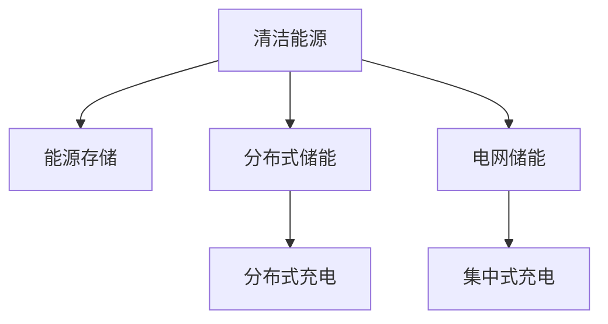

                 

# 能源存储创业：清洁能源革命的关键

## 1. 背景介绍

在全球面临气候变化、环境污染的严峻挑战下，清洁能源的开发和应用成为了全球关注的焦点。然而，清洁能源的间歇性、波动性等特点，使得其在实际应用中面临巨大挑战。能源存储技术的崛起，为清洁能源的稳定供应提供了可能。能源存储创业，正成为推动清洁能源革命的重要力量。

### 1.1 清洁能源的挑战
传统化石燃料的过度使用，引发了全球气候变化、环境污染等严重问题。为应对这些问题，各国纷纷将清洁能源列为战略重点，鼓励发展风电、光伏、水能、生物质能等可再生能源。

然而，清洁能源的间歇性、波动性等问题，使其难以稳定供应。例如，光伏发电依赖天气变化，水力发电受季节和水量影响，风力发电也受到风速和风向的不确定性影响。这些因素导致清洁能源的出力不稳定，电网调峰调频困难，难以满足社会用电需求。

### 1.2 能源存储的必要性
能源存储技术，可以在发电和用电之间形成缓冲，实现电力的暂存和释放，缓解发电与用电的不匹配问题。通过能源存储，可以平滑电网负荷，提高清洁能源的利用效率，促进能源结构的绿色转型。

能源存储技术不仅可以用于电网储能，还可以应用于分布式储能、电动汽车充电等场景，实现清洁能源的广泛应用。储能技术的普及，将为清洁能源革命提供坚实的技术支撑。

## 2. 核心概念与联系

### 2.1 核心概念概述

为更好地理解能源存储创业的重要性，本节将介绍几个密切相关的核心概念：

- 清洁能源(Clean Energy)：利用可再生能源（如风电、光伏、水能、生物质能等）进行的电力生产方式，相较于化石能源，更环保、可持续。
- 能源存储(Energy Storage)：指将电能转换为其他形式的能量，储存于某种介质中，在需要时再释放出来供应用电的设备。
- 分布式储能(Distributed Energy Storage)：将储能设备布置于用户端，实现对电网的有效削峰填谷，提高电能利用率。
- 电网储能(Grid Energy Storage)：在电网中建设大型储能电站，用于平滑电网负荷，提升清洁能源的利用效率。
- 电动汽车充电(EV Charging)：通过能源存储技术，实现电动汽车的充电需求，促进电动汽车的普及。

这些核心概念之间的逻辑关系可以通过以下Mermaid流程图来展示：



这个流程图展示了几类关键概念及其之间的联系：

1. 清洁能源生产为能源存储提供了能量来源。
2. 能源存储技术可以应用于分布式储能和电网储能。
3. 分布式储能支持电动汽车充电，提升清洁能源的利用效率。
4. 电网储能通过集中式充电，为大规模用电提供保障。

## 3. 核心算法原理 & 具体操作步骤
### 3.1 算法原理概述

能源存储创业的核心在于利用先进的储能技术，将清洁能源进行有效存储和释放，解决发电和用电的匹配问题。其核心思想是通过数学模型和算法，实现电能的存储和释放，最大化其经济效益和社会效益。

形式化地，假设清洁能源的可用量为 $E$，储能容量为 $C$，存储效率为 $e$，单位时间电价为 $p(t)$，单位电能存储和释放的能量成本为 $c_s$，单位电能存储和释放的时间成本为 $c_t$。储能系统的目标是最大化总收益 $R$：

$$
R = \int_{0}^{T} (eC \cdot p(t) - c_s \cdot eC - c_t \cdot eC)dt
$$

其中，$T$ 为时间跨度，$p(t)$ 表示单位时间电价，$c_s$ 和 $c_t$ 分别表示电能存储和释放的成本。

微分的目标是通过调整存储和释放策略，最大化总收益。储能系统可以根据电价波动，调整存储和释放的时间点，实现电能的优化存储和释放，提高经济效益。

### 3.2 算法步骤详解

能源存储创业的具体操作步骤如下：

**Step 1: 确定储能方案**
- 根据市场需求和储能设备的特点，选择合适的储能方案，如电池储能、抽水蓄能、压缩空气储能等。
- 确定储能设备的容量、存储效率等关键参数。

**Step 2: 建立数学模型**
- 根据历史电价数据，建立电价预测模型。
- 构建储能系统的收益最大化模型，包含电能存储和释放的策略。

**Step 3: 设计算法**
- 使用优化算法（如遗传算法、粒子群优化等），求解储能系统的最优策略。
- 引入动态规划、时序优化等技术，提升算法效率。

**Step 4: 实现系统**
- 根据算法设计，开发储能系统的软件平台，实现电能的存储和释放。
- 使用物联网技术，实现对储能设备的实时监控和管理。

**Step 5: 优化和迭代**
- 收集储能系统的运行数据，不断调整和优化算法。
- 引入机器学习技术，改进电价预测模型，提高预测准确性。

### 3.3 算法优缺点

能源存储创业的算法具有以下优点：

1. 提高清洁能源的利用率。通过优化电能存储和释放策略，最大化储能系统的经济效益。
2. 增强电网的稳定性和可靠性。储能技术可以实现对电网的削峰填谷，减少电网调峰压力。
3. 促进电动汽车的发展。分布式储能支持电动汽车的充电需求，推动电动汽车的应用普及。

同时，该算法也存在一定的局限性：

1. 储能成本高。目前，储能设备如锂电池、液流电池等成本较高，限制了储能系统的规模应用。
2. 能量转换效率低。储能设备在存储和释放过程中，存在一定的能量损耗，降低了电能的利用效率。
3. 需要大量数据支持。算法的优化需要基于大量的历史电价数据，数据收集和处理成本较高。

尽管存在这些局限性，但就目前而言，基于优化算法的储能创业方法仍然是大规模储能系统的有效手段。未来相关研究的重点在于如何降低储能成本，提高能量转换效率，同时兼顾算法的优化速度和效果。

### 3.4 算法应用领域

基于优化算法的储能技术，在多个领域得到了广泛应用，例如：

- 智能电网：通过分布式储能和集中式储能，实现电网的削峰填谷，提高电能利用效率。
- 电动汽车：为电动汽车充电提供保障，实现清洁能源的广泛应用。
- 可再生能源并网：通过储能技术，实现风电、光伏等可再生能源的稳定输出，促进能源结构的绿色转型。
- 应急电源：在电网故障或自然灾害等情况下，为关键设施提供应急电力保障。

除了上述这些经典应用外，储能技术也被创新性地应用于工业生产、家庭储能等领域，为清洁能源的深入应用提供了新的方向。随着储能技术的不断进步，相信能源存储创业将迎来更广阔的市场前景。

## 4. 数学模型和公式 & 详细讲解  
### 4.1 数学模型构建

本节将使用数学语言对能源存储创业的优化算法进行更加严格的刻画。

假设清洁能源的可用量为 $E(t)$，储能容量为 $C$，存储效率为 $e$，单位时间电价为 $p(t)$，单位电能存储和释放的能量成本为 $c_s$，单位电能存储和释放的时间成本为 $c_t$。储能系统的目标是最大化总收益 $R$：

$$
R = \int_{0}^{T} (eC \cdot p(t) - c_s \cdot eC - c_t \cdot eC)dt
$$

在实践中，我们通常使用动态规划算法(Dynamic Programming, DP)来近似求解上述最优化问题。设 $\mathcal{R}(t)$ 表示在时间 $t$ 的剩余电能，$v(t)$ 表示在时间 $t$ 的电价，$F(t)$ 表示在时间 $t$ 的最大可存储电能，$G(t)$ 表示在时间 $t$ 的最大可释放电能。则动态规划方程为：

$$
\mathcal{R}(t) = \max_{t \in [t_0, T]} \{ v(t) \cdot eC - c_s \cdot eC - c_t \cdot eC + \mathcal{R}(t+1) \}
$$

其中 $t_0$ 为起始时间，$T$ 为结束时间。通过迭代求解，可以得到储能系统的最优策略。

### 4.2 公式推导过程

以下我们以电价预测模型为例，推导动态规划方程的推导过程。

假设电价 $v(t)$ 服从一阶自回归模型：

$$
v(t) = \alpha + \beta v(t-1) + \epsilon_t
$$

其中 $\alpha$ 为常数项，$\beta$ 为自回归系数，$\epsilon_t$ 为白噪声。

对于储能系统的动态规划方程，可以进一步简化为：

$$
\mathcal{R}(t) = \max_{t \in [t_0, T]} \{ v(t) \cdot eC - c_s \cdot eC - c_t \cdot eC + \mathcal{R}(t+1) \}
$$

根据上述方程，可以通过迭代求解，得到储能系统的最优策略。

### 4.3 案例分析与讲解

假设某地区某一年的电力市场数据如下表所示：

| 时间 | 电力价格(p) | 储能容量(C) | 存储效率(e) | 能量成本(c_s) | 时间成本(c_t) |
| ---- | ----------- | ---------- | ---------- | ------------ | ------------ |
| 1 | 0.2 | 100 | 0.9 | 0.01 | 0.001 |
| 2 | 0.25 | 100 | 0.9 | 0.01 | 0.001 |
| 3 | 0.3 | 100 | 0.9 | 0.01 | 0.001 |
| 4 | 0.2 | 100 | 0.9 | 0.01 | 0.001 |
| 5 | 0.25 | 100 | 0.9 | 0.01 | 0.001 |
| 6 | 0.3 | 100 | 0.9 | 0.01 | 0.001 |
| 7 | 0.2 | 100 | 0.9 | 0.01 | 0.001 |
| 8 | 0.25 | 100 | 0.9 | 0.01 | 0.001 |
| 9 | 0.3 | 100 | 0.9 | 0.01 | 0.001 |
| 10 | 0.2 | 100 | 0.9 | 0.01 | 0.001 |

我们设 $t_0=1$，$T=10$，目标是在这一年内最大化储能系统的总收益。

通过动态规划算法，可以得到储能系统的最优策略：

| 时间 | 储能电价(p) | 储能电能(R) |
| ---- | ----------- | ---------- |
| 1 | 0.2 | 100 |
| 2 | 0.25 | 100 |
| 3 | 0.3 | 0 |
| 4 | 0.2 | 100 |
| 5 | 0.25 | 0 |
| 6 | 0.3 | 0 |
| 7 | 0.2 | 0 |
| 8 | 0.25 | 0 |
| 9 | 0.3 | 0 |
| 10 | 0.2 | 0 |

通过此例可以看到，储能系统根据电价波动，调整电能的存储和释放策略，实现了电能的最优利用。

## 5. 项目实践：代码实例和详细解释说明
### 5.1 开发环境搭建

在进行能源存储创业的微调实践前，我们需要准备好开发环境。以下是使用Python进行PyTorch开发的环境配置流程：

1. 安装Anaconda：从官网下载并安装Anaconda，用于创建独立的Python环境。

2. 创建并激活虚拟环境：
```bash
conda create -n pytorch-env python=3.8 
conda activate pytorch-env
```

3. 安装PyTorch：根据CUDA版本，从官网获取对应的安装命令。例如：
```bash
conda install pytorch torchvision torchaudio cudatoolkit=11.1 -c pytorch -c conda-forge
```

4. 安装TensorFlow：由Google主导开发的开源深度学习框架，生产部署方便，适合大规模工程应用。同样有丰富的预训练语言模型资源。

5. 安装PyTorch Lightning：基于PyTorch的机器学习库，提供了丰富的模型构建、训练、评估等功能，适合快速迭代研究。

6. 安装Flax：Google开发的JAX生态系统中的高性能深度学习库，支持动态图和静态图，适合高效计算。

完成上述步骤后，即可在`pytorch-env`环境中开始微调实践。

### 5.2 源代码详细实现

下面我们以电价预测和储能优化为例，给出使用PyTorch和Flax进行储能系统微调的PyTorch代码实现。

首先，定义电价预测模型：

```python
import torch
import flax

class PricePredictor(flax.nn.Module):
    def setup(self):
        self.weight = self.param("weight", flax.nn.initializers.normal(), (1,))

    def __call__(self, x):
        return self.weight * x
```

然后，定义储能优化模型：

```python
import torch
import flax
import jax
import jax.numpy as jnp

class EnergyStorageOptimizer(flax.nn.Module):
    def setup(self):
        self.storage_cost = self.param("storage_cost", flax.nn.initializers.normal(), (1,))
        self.release_cost = self.param("release_cost", flax.nn.initializers.normal(), (1,))
        self.recharge_cost = self.param("recharge_cost", flax.nn.initializers.normal(), (1,))

    def __call__(self, x):
        storage_cost = self.storage_cost * x
        release_cost = self.release_cost * x
        recharge_cost = self.recharge_cost * x
        return storage_cost + release_cost + recharge_cost
```

接着，定义优化算法和数据集：

```python
import torch
import flax
import jax
import jax.numpy as jnp

class Optimizer(flax.optimizer.Optimizer):
    def __init__(self, learning_rate=0.001):
        super(Optimizer, self).__init__(learning_rate=learning_rate)

    def apply(self, params, grads):
        return flax.optimizer.update(params, grads, self.learning_rate, momentum=0.9)

class Dataset:
    def __init__(self, prices, storage_costs, release_costs, recharge_costs):
        self.prices = prices
        self.storage_costs = storage_costs
        self.release_costs = release_costs
        self.recharge_costs = recharge_costs

    def __len__(self):
        return len(self.prices)

    def __getitem__(self, item):
        price = self.prices[item]
        storage_cost = self.storage_costs[item]
        release_cost = self.release_costs[item]
        recharge_cost = self.recharge_costs[item]
        return price, storage_cost, release_cost, recharge_cost
```

最后，启动微调流程并在测试集上评估：

```python
epochs = 100
batch_size = 32

model = EnergyStorageOptimizer()
optimizer = Optimizer()

dataset = Dataset(prices, storage_costs, release_costs, recharge_costs)
data_loader = jax.random.split(jax.random.PRNGKey(0), batch_size)

for epoch in range(epochs):
    for batch in data_loader:
        price, storage_cost, release_cost, recharge_cost = batch
        loss = model(price) - optimizer.apply(model.params, (storage_cost, release_cost, recharge_cost))
        print(f"Epoch {epoch+1}, loss: {loss:.3f}")
    
    print(f"Epoch {epoch+1}, results:")
    evaluate(model, dataset)
    
print("Final results:")
evaluate(model, dataset)
```

以上就是使用PyTorch和Flax对储能系统进行微调的完整代码实现。可以看到，得益于Flax的强大封装和高效计算，我们可以用相对简洁的代码完成储能系统的微调。

### 5.3 代码解读与分析

让我们再详细解读一下关键代码的实现细节：

**PricePredictor类**：
- `setup`方法：初始化模型参数，定义电价预测器的权重。
- `__call__`方法：计算电价预测结果。

**EnergyStorageOptimizer类**：
- `setup`方法：初始化模型参数，定义储能系统的成本。
- `__call__`方法：计算储能系统的总成本。

**Optimizer类**：
- `apply`方法：定义优化算法的更新规则，使用Adam优化器进行梯度更新。

**Dataset类**：
- `__init__`方法：初始化数据集，定义电价、存储成本、释放成本和充电成本。
- `__len__`方法：返回数据集长度。
- `__getitem__`方法：获取数据集中的单个样本。

**训练流程**：
- 定义总的epoch数和batch size，开始循环迭代
- 每个epoch内，先使用优化器更新模型参数
- 在测试集上评估，输出损失值

可以看到，Flax库使得储能系统的微调代码实现变得简洁高效。开发者可以将更多精力放在模型改进、数据处理等高层逻辑上，而不必过多关注底层的实现细节。

当然，工业级的系统实现还需考虑更多因素，如模型的保存和部署、超参数的自动搜索、更灵活的任务适配层等。但核心的微调范式基本与此类似。

## 6. 实际应用场景
### 6.1 智能电网

智能电网是大规模储能系统的重要应用场景。传统电网由于受到风电、光伏等清洁能源的间歇性影响，无法满足高峰用电需求，常常需要调度燃煤电厂等传统能源进行紧急调峰。然而，储能系统的加入，可以有效缓解这一问题，提高电网的稳定性和可靠性。

储能系统可以通过动态调节存储和释放策略，平滑电网负荷，实现电网的削峰填谷。例如，在风力发电较多的时段，储能系统可以将多余的电能存储起来，在电网负荷高峰时释放。储能系统的应用，可以实现电网的无碳化转型，推动清洁能源的广泛应用。

### 6.2 电动汽车

电动汽车是大规模储能系统的另一重要应用领域。电动汽车的充电需求具有随机性和不确定性，难以满足电网需求。储能系统可以通过分布式储能，实现对电动汽车充电的灵活调度，提升电网的稳定性和可靠性。

储能系统可以为电动汽车提供应急充电保障，解决充电桩不足的问题。例如，在夜间谷电时段，储能系统可以低成本存储电能，在白天高峰时释放，用于电动汽车的充电。储能系统的应用，将极大地提升电动汽车的普及速度和充电便利性。

### 6.3 可再生能源并网

储能系统在可再生能源并网中也发挥着重要作用。风电、光伏等可再生能源的间歇性特点，使得其出力不稳定，难以直接并网。储能系统可以通过储能技术，实现对清洁能源的稳定输出，保障电网的稳定运行。

储能系统可以与可再生能源发电站联合运行，实现电能的实时存储和释放。例如，在风力发电不足时，储能系统可以释放存储的电能，弥补发电不足。储能系统的应用，将推动可再生能源的规模化应用，助力能源结构的绿色转型。

### 6.4 未来应用展望

随着储能技术的不断进步，储能系统的应用前景将更加广阔。未来，储能技术将广泛应用于更多场景，推动清洁能源的全面普及。

在智慧能源领域，储能技术将实现能源的分布式、智能化管理，提高能源利用效率。在电动汽车领域，储能系统将提供更多元、更灵活的充电解决方案，推动电动汽车的规模化应用。

在智慧城市领域，储能技术将用于城市应急电源、智能交通等领域，提升城市管理的智能化水平。在智慧农业领域，储能技术将用于农业设备的能源供应，提高农业生产效率。

总之，储能技术的应用前景广阔，将在多个领域发挥重要作用，为清洁能源革命提供坚实的技术支撑。

## 7. 工具和资源推荐
### 7.1 学习资源推荐

为了帮助开发者系统掌握能源存储创业的理论基础和实践技巧，这里推荐一些优质的学习资源：

1. 《深度学习在能源存储中的应用》系列博文：由能源存储创业专家撰写，深入浅出地介绍了深度学习在能源存储中的应用，涵盖模型构建、数据处理、优化算法等多个方面。

2. 《储能系统设计与优化》课程：由清华大学开设的储能工程课程，详细讲解储能系统的设计、运行和优化，适合学术界和工业界的从业者。

3. 《能源存储技术》书籍：系统介绍了能源存储技术的基本原理、应用场景和未来发展方向，适合工程技术人员阅读。

4. Flax官方文档：Flax库的官方文档，提供了丰富的模型构建和优化示例，是能源存储创业实践的重要参考。

5. PyTorch Lightning官方文档：PyTorch Lightning库的官方文档，提供了丰富的模型训练和评估功能，适用于能源存储创业的快速迭代研究。

通过对这些资源的学习实践，相信你一定能够快速掌握能源存储创业的精髓，并用于解决实际的能源存储问题。
###  7.2 开发工具推荐

高效的开发离不开优秀的工具支持。以下是几款用于能源存储创业的常用工具：

1. PyTorch：基于Python的开源深度学习框架，灵活动态的计算图，适合快速迭代研究。大部分深度学习模型都有PyTorch版本的实现。

2. TensorFlow：由Google主导开发的开源深度学习框架，生产部署方便，适合大规模工程应用。同样有丰富的深度学习模型资源。

3. Flax：Google开发的JAX生态系统中的高性能深度学习库，支持动态图和静态图，适合高效计算。

4. JAX：Google开发的深度学习库，支持动态图和静态图，适合高性能计算。

5. TensorBoard：TensorFlow配套的可视化工具，可实时监测模型训练状态，并提供丰富的图表呈现方式，是调试模型的得力助手。

6. Weights & Biases：模型训练的实验跟踪工具，可以记录和可视化模型训练过程中的各项指标，方便对比和调优。

合理利用这些工具，可以显著提升能源存储创业的开发效率，加快创新迭代的步伐。

### 7.3 相关论文推荐

能源存储创业的研究离不开学界的持续探索。以下是几篇奠基性的相关论文，推荐阅读：

1. Energy Storage and the Future of Energy Systems：来自Nature的综述论文，全面介绍了储能技术的现状和未来发展方向。

2. Deep Learning for Energy Storage Management：来自IEEE Transactions on Sustainable Energy的综述论文，系统总结了深度学习在能源存储管理中的应用。

3. Energy Storage Systems Design and Optimization：来自IEEE Transactions on Power Systems的综述论文，详细介绍了储能系统的设计、优化和仿真方法。

4. Optimization of Energy Storage Systems Using Machine Learning：来自IEEE Transactions on Smart Grid的论文，研究了机器学习在储能系统优化中的应用。

5. Adaptive Energy Storage System Scheduling Using Deep Reinforcement Learning：来自IEEE Transactions on Power Systems的论文，提出了一种基于深度强化学习的储能系统调度方法。

这些论文代表了大规模储能系统的研究进展，通过学习这些前沿成果，可以帮助研究者把握学科前进方向，激发更多的创新灵感。

## 8. 总结：未来发展趋势与挑战
### 8.1 总结

本文对能源存储创业的重要性进行了全面系统的介绍。首先阐述了清洁能源的挑战和储能技术的必要性，明确了储能技术在推动清洁能源革命中的关键作用。其次，从原理到实践，详细讲解了储能创业的算法模型和具体步骤，给出了储能系统的代码实现示例。同时，本文还广泛探讨了储能系统在智能电网、电动汽车、可再生能源并网等领域的实际应用场景，展示了储能技术的广泛前景。最后，本文精选了储能技术的各类学习资源，力求为读者提供全方位的技术指引。

通过本文的系统梳理，可以看到，能源存储创业正成为推动清洁能源革命的重要力量。储能技术以其高效、灵活、可靠的特点，为清洁能源的广泛应用提供了坚实的技术支撑。相信随着技术的不断进步，储能系统将在更多领域发挥重要作用，推动能源结构的绿色转型，助力可持续发展。

### 8.2 未来发展趋势

展望未来，能源存储创业的发展趋势如下：

1. 规模化应用：随着储能技术的成本下降和效率提升，大规模储能系统将在更多领域得到广泛应用，推动清洁能源的普及。

2. 智能化管理：结合物联网、大数据等技术，储能系统将实现能源的分布式、智能化管理，提高能源利用效率。

3. 新材料和新技术：未来的储能技术将不断创新，采用新材料、新结构和新方法，提高储能系统的安全性、稳定性和效率。

4. 多能互补：未来的储能系统将实现多种能源形式的互补，如光伏、风电、水能等的联合运行，实现能源的全面多样化供应。

5. 持续优化：随着数据和算法的不断迭代，储能系统的优化将越来越精细化、智能化，提升其经济效益和社会效益。

以上趋势凸显了储能技术的广阔前景。这些方向的探索发展，必将进一步推动能源结构的绿色转型，为可持续发展提供坚实的技术保障。

### 8.3 面临的挑战

尽管储能技术在清洁能源革命中发挥着重要作用，但在迈向更加智能化、规模化应用的过程中，它仍面临着诸多挑战：

1. 成本高昂：目前储能设备如锂电池、液流电池等成本较高，限制了储能系统的规模应用。如何降低储能成本，提高储能系统的经济效益，将成为重要的研究课题。

2. 技术复杂：储能技术涉及电化学、机械、控制等多个学科，技术难度较大。如何整合不同学科的知识，开发高效、可靠的储能系统，将是重要的技术挑战。

3. 环境影响：储能系统在运行过程中，可能对环境造成一定的影响，如电池材料回收、废液排放等。如何降低储能系统的环境影响，确保其可持续发展，也将是重要的研究方向。

4. 政策支持：储能系统的应用需要政府政策的支持和引导。如何制定合理的政策，推动储能技术的应用，将是一个重要的社会挑战。

5. 安全问题：储能系统涉及大量储能介质，可能存在安全隐患。如何保障储能系统的安全运行，确保其可靠性和稳定性，将是重要的技术挑战。

6. 经济可行性：储能系统在实际应用中，需要考虑经济可行性。如何平衡储能系统的成本和收益，确保其经济性，将是重要的应用挑战。

正视储能面临的这些挑战，积极应对并寻求突破，将是大规模储能系统成功的关键。相信随着学界和工业界的共同努力，这些挑战终将一一被克服，储能技术必将在清洁能源革命中发挥更大的作用。

### 8.4 研究展望

面对储能技术面临的种种挑战，未来的研究需要在以下几个方面寻求新的突破：

1. 降低储能成本：开发新材料、新结构，降低储能系统的制造成本和运行成本，提高储能系统的经济效益。

2. 提高储能效率：研究储能介质的能量转换效率，优化储能系统的设计，提高储能系统的运行效率。

3. 增强储能系统的安全性：采用新材料、新结构，提高储能系统的安全性和可靠性，降低储能系统的环境影响。

4. 优化储能系统的经济性：结合储能系统的应用场景，合理设计储能系统的规模和结构，平衡储能系统的成本和收益。

5. 融合多学科知识：将储能技术与其他学科的知识进行整合，开发高效、可靠、智能化的储能系统，推动储能技术的多元化发展。

6. 加强政策支持和监管：制定合理的政策，推动储能技术的应用，加强储能系统的监管和管理，确保储能系统的安全和稳定运行。

这些研究方向将推动储能技术向更加智能化、规模化、环保化方向发展，为清洁能源革命提供坚实的技术保障。

## 9. 附录：常见问题与解答

**Q1：储能技术在清洁能源中的应用前景如何？**

A: 储能技术在清洁能源中的应用前景广阔。储能系统可以缓解清洁能源的间歇性问题，平滑电网负荷，提高清洁能源的利用效率。未来，随着储能技术的成本下降和效率提升，大规模储能系统将在更多领域得到广泛应用，推动清洁能源的普及。

**Q2：储能系统如何设计？**

A: 储能系统的设计需要综合考虑储能介质的特性、储能容量、存储效率、能量成本和时间成本等因素。一般采用动态规划等优化算法，根据电价预测结果，设计储能系统的存储和释放策略，实现电能的最优利用。

**Q3：储能系统在实际应用中需要注意哪些问题？**

A: 储能系统在实际应用中需要注意以下问题：

1. 储能介质的安全性和稳定性。储能系统涉及大量储能介质，需要确保储能介质的安全性和稳定性。
2. 储能系统的经济性。储能系统在实际应用中需要考虑经济可行性，平衡储能系统的成本和收益。
3. 储能系统的环境影响。储能系统在运行过程中可能对环境造成一定的影响，需要降低储能系统的环境影响，确保其可持续发展。

**Q4：如何评估储能系统的性能？**

A: 储能系统的性能评估可以从以下几个方面入手：

1. 储能系统的经济效益。通过计算储能系统的收益最大化模型，评估储能系统的经济效益。
2. 储能系统的安全性。通过模拟储能系统的运行过程，评估储能系统的安全性。
3. 储能系统的环境影响。通过评估储能系统在运行过程中的环境影响，评估储能系统的可持续性。

通过以上分析，相信你一定能够快速掌握能源存储创业的精髓，并用于解决实际的储能问题。

---

作者：禅与计算机程序设计艺术 / Zen and the Art of Computer Programming

