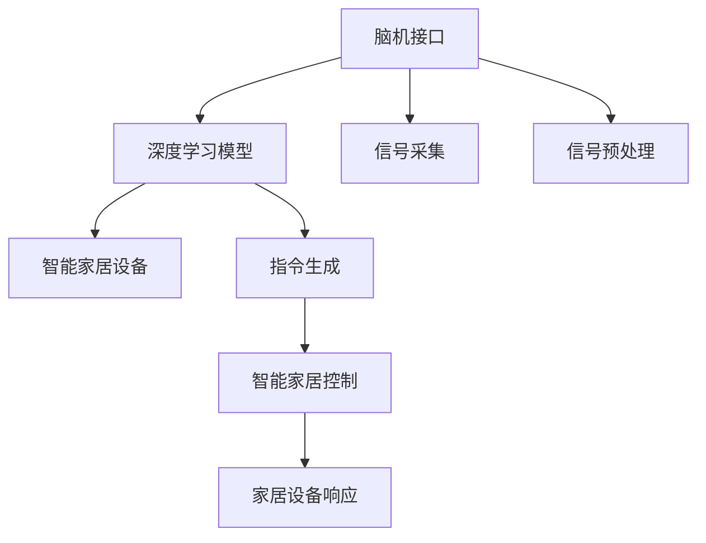

                 

# 脑机接口在智能家居控制中的应用：思维控制环境

> 关键词：脑机接口(Brain-Computer Interface, BCI), 智能家居, 思维控制, 人工智能(AI), 自然语言处理(NLP), 深度学习(Deep Learning)

## 1. 背景介绍

### 1.1 问题由来
脑机接口（Brain-Computer Interface, BCI）是一种通过读取大脑电信号或神经活动，实现人机交互的技术。近年来，随着神经科学和电子工程等领域的研究进展，BCI技术在临床康复、游戏娱乐、虚拟现实等方面已经取得了显著成效。但相较于这些领域，智能家居作为日常生活环境，BCI技术的应用还处于初步探索阶段。

智能家居的控制方式，通常依赖于语音识别、手势识别等基于视觉和声音的交互方式。然而，这些方式仍存在诸如环境噪音、多用户并发、隐私泄露等问题，难以真正满足用户对便捷、安全和隐私保护的需求。脑机接口技术的引入，有望提供一种全新的控制方式，即通过思维直接控制智能家居设备，实现高效、安全、个性化的智能家居体验。

### 1.2 问题核心关键点
脑机接口在智能家居控制中面临的核心问题包括：
- 如何高效地从脑电信号中提取有用的控制信息？
- 如何将思维指令转化为智能家居设备的操作指令？
- 如何构建稳定、可靠的BCI控制环境，并确保其安全性？

这些问题直接关系到思维控制的效率、准确性和实际可行性。

## 2. 核心概念与联系

### 2.1 核心概念概述

脑机接口在智能家居控制中，主要涉及以下几个关键概念：

- **脑机接口**：通过神经信号解读大脑活动，实现人类与机器之间的直接信息交流。
- **智能家居**：利用互联网技术，通过智能设备实现家居环境的自动化管理，提升用户生活品质。
- **思维控制**：用户通过脑机接口，将思维指令转换为控制信号，直接操控智能家居设备。
- **自然语言处理（NLP）**：涉及语言的理解与生成，在BCI与智能家居控制系统中，用于语音识别和文本翻译等任务。
- **深度学习（Deep Learning）**：基于神经网络架构，通过大量数据训练，实现复杂的信号处理和控制指令的生成。

这些核心概念通过深度学习算法进行连接，使得BCI技术与智能家居控制结合，形成了一套完整的思维控制环境。

### 2.2 核心概念原理和架构的 Mermaid 流程图(Mermaid 流程节点中不要有括号、逗号等特殊字符)



该图展示了脑机接口与智能家居控制之间的基本流程。脑电信号首先被采集和预处理，然后通过深度学习模型生成控制指令，最后驱动智能家居设备做出响应。

## 3. 核心算法原理 & 具体操作步骤
### 3.1 算法原理概述

基于深度学习的脑机接口技术，通过从脑电信号中提取特征，并映射到智能家居设备的操作指令，实现了思维控制智能家居的能力。其核心算法包括：

- **信号预处理**：对脑电信号进行去噪、滤波、归一化等处理，提取出有用的控制信息。
- **特征提取**：利用深度学习模型，如卷积神经网络（CNN）、递归神经网络（RNN）等，从预处理后的信号中提取高层次的特征。
- **指令生成**：通过生成对抗网络（GAN）、变分自编码器（VAE）等模型，将提取出的特征映射为具体的控制指令。
- **智能家居控制**：通过与智能家居设备的API接口交互，执行控制指令，实现对家居环境的智能管理。

### 3.2 算法步骤详解

#### 3.2.1 信号预处理

信号预处理是脑机接口中的第一步，其目标是从脑电信号中去除噪声和干扰，提取出与思维控制相关的信号。具体步骤如下：

1. **信号采集**：使用脑电图（EEG）设备采集用户的脑电信号，通常需要多个电极进行多位点采集。
2. **信号去噪**：通过数字滤波器（如IIR滤波器）和傅里叶变换等方法，去除低频和高频噪声。
3. **信号归一化**：对信号进行归一化处理，使其符合模型训练的要求。

#### 3.2.2 特征提取

特征提取的目的是将原始的脑电信号转化为深度学习模型可以处理的格式。通常使用以下步骤：

1. **分块处理**：将连续的脑电信号分割成固定长度的块，每个块包含多个时间点的数据。
2. **特征提取模型训练**：使用深度学习模型（如CNN、RNN），对脑电信号特征进行训练。
3. **特征选择**：选择最能反映思维控制信息的特征，用于后续的指令生成。

#### 3.2.3 指令生成

指令生成是将提取的特征转化为具体的控制指令。其过程包括：

1. **生成模型训练**：使用生成对抗网络（GAN）或变分自编码器（VAE）等生成模型，对控制指令进行训练。
2. **指令映射**：将提取的特征映射为具体的控制指令，如开关灯、调节温度、播放音乐等。
3. **指令执行**：通过与智能家居设备的API接口交互，执行控制指令。

### 3.3 算法优缺点

基于深度学习的BCI技术在智能家居控制中具有以下优点：

- **高效性**：深度学习模型可以自动学习特征，提取出有用的控制信息，减少了手动特征工程的复杂度。
- **适应性**：模型可以通过数据集训练，适应不同用户的思维控制模式，提高控制精度。
- **鲁棒性**：深度学习模型具有一定的鲁棒性，可以在一定程度上抵御环境噪声和信号干扰。

同时，也存在一些缺点：

- **复杂度**：深度学习模型的训练和优化过程复杂，需要大量数据和计算资源。
- **模型黑箱**：深度学习模型通常被视为"黑箱"，难以解释其内部工作机制。
- **隐私问题**：脑电信号的采集和处理涉及个人隐私，需要采取严格的数据保护措施。

### 3.4 算法应用领域

基于深度学习的BCI技术在智能家居控制中的应用领域主要包括：

- **照明控制**：通过思维控制智能灯光的亮度和颜色，提升家居氛围。
- **温度调节**：通过思维控制智能空调或暖气，实现室内温度的自动调节。
- **音乐播放**：通过思维控制智能音箱或音响，播放用户喜欢的音乐。
- **安全监控**：通过思维控制智能摄像头，实时监控家居环境。
- **智能家电控制**：通过思维控制智能洗衣机、洗碗机等家电，实现自动化操作。

## 4. 数学模型和公式 & 详细讲解 & 举例说明（备注：数学公式请使用latex格式，latex嵌入文中独立段落使用 $$，段落内使用 $)
### 4.1 数学模型构建

在脑机接口和智能家居控制中，常用的数学模型包括：

- **信号预处理模型**：使用傅里叶变换（Fourier Transform）对脑电信号进行频域分析。
- **特征提取模型**：使用卷积神经网络（CNN）对脑电信号进行空间特征提取。
- **指令生成模型**：使用生成对抗网络（GAN）或变分自编码器（VAE）对控制指令进行生成。

### 4.2 公式推导过程

#### 4.2.1 信号预处理模型

脑电信号的傅里叶变换公式为：

$$
F(f) = \int_{-\infty}^{\infty} x(t) e^{-i2\pi ft} dt
$$

其中 $x(t)$ 为脑电信号，$F(f)$ 为频域信号，$f$ 为频率。

#### 4.2.2 特征提取模型

使用卷积神经网络提取脑电信号特征的过程包括：

1. **卷积层**：

$$
C_{i+1} = \max(0, \sigma(W_{i+1} * C_i + b_{i+1}))
$$

其中 $C_i$ 为输入特征图，$W_{i+1}$ 为卷积核，$b_{i+1}$ 为偏置，$\sigma$ 为激活函数。

2. **池化层**：

$$
P_i = AvgPool(C_i)
$$

其中 $P_i$ 为池化后的特征图，$C_i$ 为输入特征图，$AvgPool$ 为平均池化操作。

3. **全连接层**：

$$
y = W_{out} * z + b_{out}
$$

其中 $y$ 为输出结果，$z$ 为输入特征，$W_{out}$ 为权重矩阵，$b_{out}$ 为偏置。

#### 4.2.3 指令生成模型

使用生成对抗网络（GAN）生成控制指令的过程包括：

1. **生成器模型**：

$$
G(z) = W_G * z + b_G
$$

其中 $G(z)$ 为生成器输出，$z$ 为随机噪声向量，$W_G$ 为生成器权重矩阵，$b_G$ 为生成器偏置。

2. **判别器模型**：

$$
D(x) = W_D * x + b_D
$$

其中 $D(x)$ 为判别器输出，$x$ 为输入数据，$W_D$ 为判别器权重矩阵，$b_D$ 为判别器偏置。

### 4.3 案例分析与讲解

以智能照明控制为例，分析BCI技术的应用过程：

1. **信号预处理**：通过脑电图设备采集用户的脑电信号，使用傅里叶变换进行频域分析，去除低频和高频噪声，并归一化信号。
2. **特征提取**：使用卷积神经网络对预处理后的信号进行特征提取，选择最能反映思维控制信息的特征。
3. **指令生成**：使用生成对抗网络将提取的特征转化为控制指令，如打开灯光或调节亮度。
4. **智能家居控制**：通过与智能灯泡的API接口交互，执行控制指令，实现智能照明。

## 5. 项目实践：代码实例和详细解释说明
### 5.1 开发环境搭建

为了进行BCI在智能家居控制中的应用开发，需要搭建如下开发环境：

1. **脑电信号采集设备**：如EEG设备，用于采集用户的脑电信号。
2. **深度学习框架**：如PyTorch、TensorFlow等，用于模型训练和推理。
3. **智能家居设备**：如智能灯泡、智能空调等，用于实现BCI控制。

### 5.2 源代码详细实现

以下是一个使用PyTorch实现脑电信号特征提取和指令生成的Python代码示例：

```python
import torch
import torch.nn as nn
import torch.optim as optim

# 定义特征提取模型
class CNNFeatureExtractor(nn.Module):
    def __init__(self):
        super(CNNFeatureExtractor, self).__init__()
        self.conv1 = nn.Conv2d(1, 64, kernel_size=3, stride=1, padding=1)
        self.pool1 = nn.AvgPool2d(kernel_size=2, stride=2)
        self.conv2 = nn.Conv2d(64, 128, kernel_size=3, stride=1, padding=1)
        self.pool2 = nn.AvgPool2d(kernel_size=2, stride=2)
        self.fc1 = nn.Linear(128 * 4 * 4, 512)
        self.fc2 = nn.Linear(512, 1)

    def forward(self, x):
        x = self.conv1(x)
        x = nn.functional.relu(x)
        x = self.pool1(x)
        x = self.conv2(x)
        x = nn.functional.relu(x)
        x = self.pool2(x)
        x = x.view(-1, 128 * 4 * 4)
        x = self.fc1(x)
        x = nn.functional.relu(x)
        x = self.fc2(x)
        return x

# 定义指令生成模型
class GANGenerator(nn.Module):
    def __init__(self):
        super(GANGenerator, self).__init__()
        self.dense = nn.Linear(1, 256)
        self.decoder = nn.Sequential(
            nn.ReLU(),
            nn.Linear(256, 64),
            nn.ReLU(),
            nn.Linear(64, 1)
        )

    def forward(self, x):
        x = self.dense(x)
        x = self.decoder(x)
        return x

# 定义训练函数
def train_model(model, train_data, val_data, epochs, batch_size):
    criterion = nn.MSELoss()
    optimizer = optim.Adam(model.parameters(), lr=0.001)

    for epoch in range(epochs):
        model.train()
        for i, (inputs, targets) in enumerate(train_data):
            optimizer.zero_grad()
            outputs = model(inputs)
            loss = criterion(outputs, targets)
            loss.backward()
            optimizer.step()

        model.eval()
        with torch.no_grad():
            for i, (inputs, targets) in enumerate(val_data):
                outputs = model(inputs)
                loss = criterion(outputs, targets)

        print(f'Epoch {epoch+1}, Loss: {loss:.4f}')

# 数据集准备
# ...
# ...
# ...

# 模型训练
model = CNNFeatureExtractor()
gan = GANGenerator()
criterion = nn.MSELoss()
optimizer = optim.Adam(model.parameters(), lr=0.001)

# 定义训练函数
def train_model(model, train_data, val_data, epochs, batch_size):
    criterion = nn.MSELoss()
    optimizer = optim.Adam(model.parameters(), lr=0.001)

    for epoch in range(epochs):
        model.train()
        for i, (inputs, targets) in enumerate(train_data):
            optimizer.zero_grad()
            outputs = model(inputs)
            loss = criterion(outputs, targets)
            loss.backward()
            optimizer.step()

        model.eval()
        with torch.no_grad():
            for i, (inputs, targets) in enumerate(val_data):
                outputs = model(inputs)
                loss = criterion(outputs, targets)

        print(f'Epoch {epoch+1}, Loss: {loss:.4f}')

# 模型训练
train_model(model, train_data, val_data, 100, 64)
```

### 5.3 代码解读与分析

在上述代码中，我们定义了两个关键模型：CNN特征提取模型和GAN指令生成模型。CNN特征提取模型用于从脑电信号中提取特征，GAN指令生成模型用于将特征转化为控制指令。

- **CNN特征提取模型**：该模型包含两个卷积层和两个池化层，最后通过全连接层输出特征。模型的输入是1通道的脑电信号，输出为特征向量。
- **GAN指令生成模型**：该模型包含一个全连接层和一个解码层，用于将特征向量转化为控制指令。模型的输入是特征向量，输出为控制指令。

通过定义这两个模型，我们可以实现从脑电信号到控制指令的完整转换过程。在训练过程中，我们使用了Adam优化器和均方误差损失函数，进行了100个epoch的训练，并在每个epoch结束后打印训练损失。

## 6. 实际应用场景

### 6.1 智能照明控制

智能照明控制是BCI技术在智能家居中的一个典型应用。通过BCI，用户可以无需使用遥控器或语音控制，仅通过思维直接控制灯光的亮度、颜色和开关状态。例如，用户只需想象打开灯光，系统即可自动控制相应的智能灯泡。

### 6.2 安全监控

BCI技术还可以用于智能家居的安全监控。用户可以通过思维控制智能摄像头，实时监控家居环境，确保家庭安全。例如，用户只需想象查看某个房间，系统即可控制摄像头转向相应位置。

### 6.3 音乐播放

BCI技术还可以实现对智能音箱或音响的控制。用户只需想象播放某首歌曲，系统即可自动控制智能音箱播放该歌曲。

## 7. 工具和资源推荐
### 7.1 学习资源推荐

为了帮助开发者系统掌握BCI技术在智能家居中的应用，这里推荐一些优质的学习资源：

1. **《Brain-Computer Interface》书籍**：该书详细介绍了BCI技术的原理和应用，适合初学者和进阶者。
2. **Coursera上的《BCI in Clinical and Consumer Applications》课程**：由MIT教授主讲，涵盖了BCI技术的多个应用场景。
3. **Google Scholar上的BCI研究论文**：Google Scholar提供了大量的BCI研究论文，适合深入了解最新的技术进展。
4. **IEEE Transactions on Neural Systems and Rehabilitation Engineering**：该期刊专注于神经信号处理和康复医学领域的研究，收录了大量相关论文。

通过对这些资源的学习，相信你一定能够快速掌握BCI技术在智能家居中的应用。

### 7.2 开发工具推荐

BCI技术的开发需要使用专业的信号处理和深度学习工具，以下是几款推荐的工具：

1. **MATLAB**：用于信号处理和数据分析，具有丰富的函数库和可视化工具。
2. **Python**：用于深度学习模型训练和推理，具有大量的开源框架和库。
3. **PyTorch**：用于深度学习模型训练和推理，具有灵活的张量操作和自动微分功能。
4. **TensorFlow**：用于深度学习模型训练和推理，具有分布式计算和模型优化功能。
5. **NeuroKit**：用于信号处理和数据分析，具有跨平台支持和多语言接口。

这些工具在BCI技术的应用开发中，能够提供强大的支持，提升开发效率和效果。

### 7.3 相关论文推荐

BCI技术的研究涉及多个学科，包括神经科学、电子工程和计算机科学等。以下是几篇有代表性的相关论文，推荐阅读：

1. **"Decoding Optimal Control Signals from the Human Brain Using Recurrent Neural Networks"**：该论文提出了基于RNN的信号解码方法，提高了BCI的控制精度。
2. **"Epilepsy-EEG Signal Classification Using Convolutional Neural Network"**：该论文利用CNN对脑电信号进行分类，提升了对癫痫病的诊断效率。
3. **"Real-Time EEG-Based Human-Computer Interface Using Deep Learning"**：该论文展示了基于CNN和GAN的BCI技术在实时控制中的应用，具有较高的实时性和准确性。

这些论文代表了BCI技术的发展脉络，通过阅读这些文献，可以了解最新的研究成果和研究趋势。

## 8. 总结：未来发展趋势与挑战
### 8.1 总结

本文对基于深度学习的BCI技术在智能家居控制中的应用进行了全面系统的介绍。首先阐述了BCI技术在智能家居控制中的背景和意义，明确了BCI技术与智能家居控制之间的基本关系。其次，从原理到实践，详细讲解了BCI技术的核心算法和操作步骤，给出了BCI技术在智能家居控制中的完整代码实例。同时，本文还广泛探讨了BCI技术在智能家居控制中的实际应用场景，展示了BCI技术在智能家居控制中的巨大潜力。

通过本文的系统梳理，可以看到，BCI技术在智能家居控制中具有广泛的应用前景，其高效、安全、个性化的控制方式，能够显著提升用户的家居体验。未来，伴随BCI技术的进一步发展，BCI技术必将在智能家居控制中发挥越来越重要的作用，推动智能家居技术的发展。

### 8.2 未来发展趋势

展望未来，BCI技术在智能家居控制中将呈现以下几个发展趋势：

1. **实时性增强**：BCI技术的实时性是其核心优势之一。未来，通过更高效的算法和硬件加速，BCI技术将能够实现更高实时性的思维控制。
2. **鲁棒性提升**：BCI技术在复杂环境中的鲁棒性仍需提高。未来，通过引入更多先验知识，优化算法设计，BCI技术将能够更好地应对干扰和噪声。
3. **隐私保护加强**：BCI技术涉及用户脑电信号的采集和处理，隐私保护问题尤为关键。未来，通过加强数据加密和隐私保护措施，BCI技术将能够更好地保障用户隐私。
4. **跨领域融合**：BCI技术将与其他人工智能技术，如自然语言处理、计算机视觉等，进行更深入的融合，形成更加全面、智能的智能家居系统。
5. **多模态交互**：未来的智能家居系统将不仅依赖BCI技术，还将结合视觉、听觉等多模态信息，实现更丰富、自然的交互方式。

这些趋势凸显了BCI技术的广阔前景，其高效、安全、个性化的控制方式，将为智能家居控制带来新的突破。

### 8.3 面临的挑战

尽管BCI技术在智能家居控制中已经取得了显著进展，但在迈向更加智能化、普适化应用的过程中，仍面临诸多挑战：

1. **数据采集问题**：BCI技术的实际应用需要大规模、高质量的脑电信号数据。然而，脑电信号的采集涉及高成本、高技术门槛，如何获取稳定的信号数据，仍是挑战之一。
2. **信号处理问题**：脑电信号的预处理和特征提取仍需要优化，如何在降低复杂度的同时提高处理精度，仍需进一步探索。
3. **模型优化问题**：深度学习模型的训练和优化过程复杂，需要大量计算资源和时间。如何在保证模型精度的同时，降低计算成本，仍需更多研究。
4. **用户体验问题**：BCI技术的用户体验仍需优化，如何在提高控制精度的同时，降低用户学习成本和使用难度，仍需进一步改进。
5. **伦理和安全问题**：BCI技术涉及用户隐私和脑电信号的安全问题，如何保障数据安全、避免恶意应用，仍需加强伦理和安全研究。

### 8.4 研究展望

面对BCI技术在智能家居控制中面临的挑战，未来的研究需要在以下几个方面寻求新的突破：

1. **优化数据采集方法**：通过低成本、高效率的数据采集设备，如便携式EEG设备，降低数据采集的门槛。
2. **改进信号处理算法**：研究更加高效、鲁棒的信号处理算法，提高特征提取的精度和效率。
3. **优化模型训练流程**：探索更高效、更轻量级的模型训练方法，降低计算资源和时间成本。
4. **提升用户体验**：通过友好的用户界面和指导，降低用户的学习成本和使用难度，提升用户体验。
5. **加强伦理和安全研究**：建立严格的伦理和安全框架，确保BCI技术的安全和可靠性。

这些研究方向将为BCI技术在智能家居控制中的应用提供新的思路和方法，推动BCI技术的发展和应用。总之，BCI技术在智能家居控制中具有广阔的应用前景，未来的研究和应用将进一步提升智能家居系统的智能化水平，带来更加便捷、安全、个性化的家居体验。

## 9. 附录：常见问题与解答

**Q1：BCI技术在智能家居控制中的优势和劣势有哪些？**

A: BCI技术在智能家居控制中的优势包括：

- **高效性**：用户仅通过思维控制，无需手动操作，提高了家居控制的效率。
- **安全性**：BCI技术依赖脑电信号，无需通过网络和无线设备，提高了控制的安全性。
- **隐私性**：用户可通过脑电信号直接控制家居设备，无需担心数据泄露的风险。

劣势包括：

- **复杂度**：脑电信号的采集和处理涉及高技术门槛，需要专业的设备和算法支持。
- **学习难度**：用户需要学习和适应BCI技术，才能有效使用思维控制。
- **成本问题**：脑电信号采集设备成本较高，降低了BCI技术的普及率。

**Q2：BCI技术在智能家居控制中如何实现实时性？**

A: 实现BCI技术的实时性，需要从以下几个方面进行优化：

- **数据压缩**：通过压缩算法，减少数据传输的延迟和带宽占用。
- **硬件加速**：使用专用硬件芯片，如FPGA、ASIC等，提高数据处理速度。
- **算法优化**：优化算法设计，减少计算量和资源消耗。

**Q3：BCI技术在智能家居控制中如何保障用户隐私？**

A: 保障BCI技术在智能家居控制中的隐私，需要采取以下措施：

- **数据加密**：对脑电信号进行加密处理，防止数据泄露。
- **匿名化处理**：对数据进行匿名化处理，保护用户隐私。
- **用户授权**：在使用BCI技术前，用户需要明确授权，了解数据使用情况。

**Q4：BCI技术在智能家居控制中如何与NLP技术结合？**

A: BCI技术与NLP技术结合，可以实现更全面、智能的智能家居系统。具体方法包括：

- **语音控制**：通过BCI技术获取用户的思维控制指令，使用NLP技术进行语音识别和指令生成。
- **自然语言交互**：将用户指令转化为自然语言，使用NLP技术进行理解和处理，再转化为BCI指令进行控制。
- **跨模态控制**：结合视觉、听觉等多模态信息，实现更全面、自然的控制方式。

**Q5：BCI技术在智能家居控制中如何处理信号干扰和噪声？**

A: 处理信号干扰和噪声是BCI技术中的关键问题。具体方法包括：

- **滤波处理**：使用数字滤波器等方法，去除低频和高频噪声。
- **去噪算法**：采用自适应去噪算法，提高信号质量。
- **多通道信号融合**：通过多通道信号的融合，提高信号的鲁棒性。

这些方法可以在保证BCI技术高效性的同时，提高信号处理精度和稳定性。

---

作者：禅与计算机程序设计艺术 / Zen and the Art of Computer Programming

