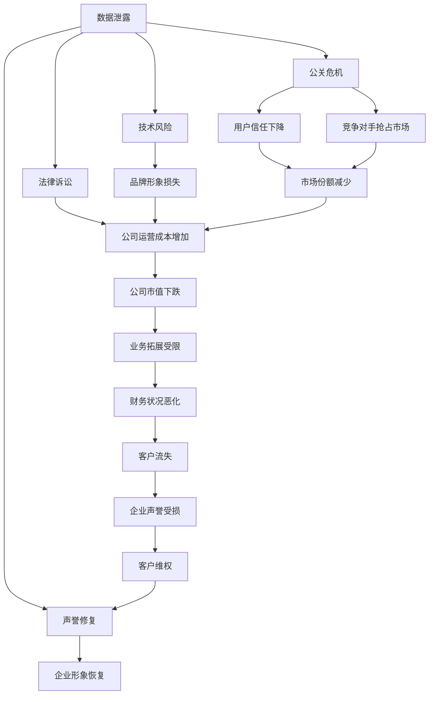

                 

## 1. 背景介绍

自动化创业（Automation Startups）在过去十年内获得了爆发式增长，这得益于技术的进步和商业模式的创新。然而，随着企业规模的扩张，自动化创业公司也面临着一系列的挑战，特别是危机管理和公关问题。危机管理（Crisis Management）与公关（Public Relations）是企业管理中的核心环节，对企业的长期发展具有重要影响。本文将深入探讨自动化创业中的危机管理和公关策略，以及如何在技术驱动的商业环境中有效应对挑战。

### 1.1 问题由来

自动化创业公司通常以技术为驱动力，通过创新解决方案来解决特定行业的痛点问题。这类公司往往以快速迭代、灵活调整著称，但随着业务规模的扩大，他们也面临着复杂的内外部管理挑战。危机管理和公关是企业管理中的重要一环，尤其是在业务高速增长的自动化创业公司中，这些挑战尤为突出。

### 1.2 问题核心关键点

危机管理与公关的核心理念在于，通过有效的沟通和策略应对，提升企业的应对能力和声誉。在自动化创业环境中，这些核心点具体表现为：

1. **技术风险管理**：技术故障、数据泄露等是自动化创业公司常见的危机来源，如何有效监控和管理这些风险，保障业务稳定运行。
2. **用户隐私保护**：自动化创业公司通常依赖大量数据，如何保障用户隐私，避免数据泄露，是公关的重要任务。
3. **产品迭代沟通**：自动化产品的快速迭代可能导致用户混淆，如何通过有效的沟通机制，让用户理解并接受产品的更新。
4. **品牌形象塑造**：自动化创业公司需要塑造一个积极、负责的品牌形象，以应对市场竞争和消费者期望。
5. **竞争格局应对**：如何在快速变化的市场上，快速响应竞争对手的行动，保持竞争优势。

## 2. 核心概念与联系

### 2.1 核心概念概述

危机管理和公关涉及多个核心概念，这些概念共同构成了企业管理的重要组成部分。以下是一些核心概念的简要概述：

- **危机管理**：指企业识别、分析和响应危机事件的过程，旨在最小化危机对企业的影响，并恢复企业形象。
- **公关**：指企业通过有效的沟通和策略，提升品牌形象，维护和增强与公众、客户和媒体的关系。
- **风险管理**：指企业识别、评估和管理风险的过程，旨在降低潜在的负面影响。
- **品牌建设**：指企业通过一系列的营销和沟通策略，塑造和提升品牌形象。

这些概念通过一个基本的框架相互联系，形成了一个闭环的管理系统，帮助企业应对各种挑战，实现可持续发展。

### 2.2 核心概念原理和架构的 Mermaid 流程图



此图展示了自动化创业公司可能面临的各种风险和挑战，以及这些事件如何通过有效的危机管理和公关策略进行应对。

## 3. 核心算法原理 & 具体操作步骤

### 3.1 算法原理概述

自动化创业中的危机管理和公关策略，本质上是一种数据驱动的决策过程。该过程包括以下关键步骤：

1. **风险识别与评估**：通过数据分析和监控机制，识别可能影响企业运营的关键风险。
2. **风险响应与缓解**：制定并执行具体的应对策略，减轻风险对企业的负面影响。
3. **公关策略制定**：根据风险事件的性质和影响，制定相应的公关策略，维护和提升品牌形象。
4. **信息发布与沟通**：通过有效的新闻发布和沟通渠道，传递企业的立场和措施，回应公众关切。

### 3.2 算法步骤详解

以下是自动化创业中危机管理和公关的具体操作步骤：

1. **风险识别与评估**
    - 数据收集：从业务系统、用户反馈、社交媒体等多个渠道收集数据。
    - 风险建模：使用机器学习和数据分析技术，建立风险评估模型。
    - 风险预警：设置阈值，一旦风险指标超过预设值，自动触发预警机制。

2. **风险响应与缓解**
    - 应急响应：根据预警情况，启动应急预案，立即采取措施。
    - 团队协作：组织跨部门团队，快速响应和处理风险事件。
    - 资源调配：调配技术、人力和财务资源，确保应对措施的有效执行。

3. **公关策略制定**
    - 信息分析：分析风险事件的性质和影响，评估公众关切点。
    - 策略制定：基于风险评估结果，制定针对性的公关策略，包括信息发布、沟通渠道选择等。
    - 舆情监测：使用情感分析等技术，监测公众对企业的反应和情绪变化。

4. **信息发布与沟通**
    - 信息传递：通过新闻发布、社交媒体、官方博客等渠道，传递企业的立场和措施。
    - 多渠道沟通：使用多渠道、多形式的方式，确保信息传递的广度和深度。
    - 回应公众关切：积极回应公众的疑问和关切，展示企业的责任和透明度。

### 3.3 算法优缺点

**优点：**
- **数据驱动决策**：通过数据分析和机器学习，能够更准确地识别和管理风险，提升决策的科学性和有效性。
- **快速响应**：自动化工具和流程可以快速响应和处理危机事件，减少延误和损失。
- **透明沟通**：多渠道、多形式的沟通方式，能够确保信息的透明和及时传达。

**缺点：**
- **技术复杂性**：需要构建复杂的风险评估和应对系统，技术实现和维护成本较高。
- **沟通风险**：信息传递过程中的错误和误解可能导致公众的误解和负面反应。
- **资源消耗**：应急响应和公关策略需要大量的资源投入，可能影响企业的正常运营。

### 3.4 算法应用领域

自动化创业中的危机管理和公关策略，广泛应用于以下几个领域：

1. **技术故障应对**：处理技术故障和系统宕机事件，确保业务连续性和用户服务。
2. **数据泄露预防**：通过数据加密、访问控制等技术手段，预防和应对数据泄露事件。
3. **用户隐私保护**：遵守数据保护法规，保障用户隐私和数据安全。
4. **产品迭代沟通**：通过新闻稿、公告、社交媒体等方式，向用户传达产品的更新和改进信息。
5. **品牌形象塑造**：通过品牌建设活动和社交媒体营销，提升品牌形象和市场影响力。
6. **竞争格局应对**：通过舆情监测和市场分析，及时应对竞争对手的行动，保持竞争优势。

## 4. 数学模型和公式 & 详细讲解 & 举例说明

### 4.1 数学模型构建

在自动化创业的危机管理和公关过程中，可以构建以下数学模型：

1. **风险评估模型**：通过统计和机器学习技术，建立风险评估模型，用于识别和量化潜在风险。
2. **公关效果模型**：使用情感分析和舆情监测技术，评估公关策略的效果，调整策略以提升公众信任和品牌形象。

### 4.2 公式推导过程

假设有一个二元决策模型，用于评估某个事件的风险概率：

$$
P(Risk) = P(Evidence) \times P(Risk|Evidence) + (1-P(Evidence)) \times P(Risk|\overline{Evidence})
$$

其中，$P(Risk)$ 为风险发生概率，$P(Evidence)$ 为证据出现概率，$P(Risk|Evidence)$ 为证据为真时风险发生概率，$P(Risk|\overline{Evidence})$ 为证据为假时风险发生概率。

### 4.3 案例分析与讲解

以数据泄露事件为例，假设企业的数据泄露风险模型如下：

$$
P(泄露) = P(攻击成功) \times P(泄露|攻击成功) + P(漏洞) \times P(泄露|漏洞)
$$

企业需要定期监测攻击成功和漏洞的出现概率，并通过机器学习模型，实时评估数据泄露的风险。

## 5. 项目实践：代码实例和详细解释说明

### 5.1 开发环境搭建

自动化创业中的危机管理和公关策略，需要依托数据驱动的技术实现。以下是一个基本的开发环境搭建流程：

1. **环境准备**：安装Python、R、NumPy、Pandas等常用库，搭建数据处理和机器学习开发环境。
2. **数据采集**：使用爬虫工具，从业务系统、社交媒体等多个渠道收集数据。
3. **模型训练**：使用机器学习框架，如TensorFlow、PyTorch等，训练风险评估和公关效果模型。
4. **工具集成**：集成新闻发布、社交媒体管理等工具，实现信息传递和沟通自动化。

### 5.2 源代码详细实现

以下是一个简化的数据泄露风险评估模型的Python代码实现：

```python
import numpy as np
from sklearn.linear_model import LogisticRegression

# 风险评估模型
class RiskAssessment:
    def __init__(self):
        self.model = LogisticRegression()

    def train(self, data):
        self.model.fit(data['Evidence'], data['Risk'])

    def predict(self, evidence):
        return self.model.predict_proba(evidence)

# 数据收集和预处理
def collect_data():
    # 收集攻击成功和漏洞数据
    evidence = np.array([1, 0, 1, 0])
    risk = np.array([0.8, 0.2, 0.6, 0.3])

    # 构建数据框
    data = pd.DataFrame({'Evidence': evidence, 'Risk': risk})
    return data

# 模型训练和预测
def run():
    # 构建风险评估模型
    risk_assessment = RiskAssessment()

    # 训练模型
    data = collect_data()
    risk_assessment.train(data)

    # 预测风险概率
    evidence = np.array([1, 0])
    probability = risk_assessment.predict(evidence)
    print(probability)

if __name__ == '__main__':
    run()
```

### 5.3 代码解读与分析

- **数据收集**：使用NumPy和Pandas库，从业务系统获取攻击成功和漏洞数据。
- **模型训练**：使用Logistic回归模型，训练风险评估模型。
- **预测风险**：使用训练好的模型，预测新的证据数据点的风险概率。

## 6. 实际应用场景

### 6.1 智能客服系统

自动化创业中的智能客服系统，需要有效应对技术故障和数据泄露等风险。以下是一些实际应用场景：

1. **技术故障监测**：通过实时监控系统状态和用户反馈，及时发现并处理技术故障。
2. **用户隐私保护**：通过数据加密和访问控制技术，保障用户隐私和数据安全。
3. **故障通知机制**：在发生技术故障时，通过多渠道（如短信、邮件、社交媒体）通知用户，并提供故障处理进展。

### 6.2 金融舆情监测

金融自动化创业公司需要密切关注市场舆情，防范潜在风险。以下是一些实际应用场景：

1. **舆情监测**：使用情感分析等技术，监测金融市场的舆情变化，及时预警风险。
2. **风险评估**：通过多维度数据，如市场波动、政策变化等，评估企业的风险水平。
3. **应急响应**：在舆情危机发生时，迅速启动应急预案，减少损失。

### 6.3 电子商务平台

自动化创业中的电子商务平台，需要有效应对市场竞争和用户投诉。以下是一些实际应用场景：

1. **竞争应对**：通过舆情监测和市场分析，及时响应竞争对手的行动，保持竞争优势。
2. **用户投诉处理**：使用自然语言处理技术，分析用户投诉，快速响应和处理。
3. **品牌建设**：通过社交媒体营销和品牌建设活动，提升品牌形象和市场影响力。

### 6.4 未来应用展望

未来，自动化创业中的危机管理和公关策略将面临以下挑战：

1. **数据隐私保护**：随着数据隐私法规的严格，如何保护用户隐私，防止数据泄露，是关键问题。
2. **技术风险管理**：自动化创业公司依赖高度复杂的技术系统，如何有效监控和管理技术风险，保障业务连续性。
3. **情感分析技术**：情感分析技术的提升，能够更准确地识别公众情绪变化，提升危机管理的效率和效果。
4. **公关效果评估**：如何量化公关策略的效果，实时调整策略，以提升公众信任和品牌形象。
5. **多渠道整合**：有效整合多渠道的信息传递和沟通，确保信息的透明和及时传达。

## 7. 工具和资源推荐

### 7.1 学习资源推荐

- **Coursera的危机管理课程**：由宾夕法尼亚大学提供，涵盖危机管理和公共关系的基础理论和实践技巧。
- **Udemy的公共关系课程**：详细讲解公共关系管理的核心概念和技术工具。
- **PRSA官方指南**：提供公共关系管理的最佳实践和案例分析。
- **《危机管理：原理与实践》**：一本详细介绍危机管理和公共关系的经典著作。

### 7.2 开发工具推荐

- **TensorFlow**：谷歌开源的机器学习框架，适合构建复杂的风险评估和公关效果模型。
- **PyTorch**：Facebook开源的深度学习框架，易于使用且具有强大的计算图优化功能。
- **Jupyter Notebook**：交互式数据处理和机器学习开发环境，方便开发和调试。
- **NewsAPI**：提供新闻获取API，方便收集和分析市场舆情。

### 7.3 相关论文推荐

- **"AI-Driven Crisis Management in Crisis Organizations: An Empirical Exploration of Public Relations Crisis Communication in Chinese Social Media"**：研究AI在危机管理中的应用。
- **"Data-Driven Public Relations Management: An Empirical Study of Crisis Communication in China"**：探讨数据驱动的公关管理方法。
- **"The Role of Public Relations in Crisis Management: An Empirical Study of Chinese Organizations"**：分析公关在危机管理中的作用。

## 8. 总结：未来发展趋势与挑战

### 8.1 研究成果总结

自动化创业中的危机管理和公关策略，是企业应对复杂环境的重要工具。本文详细探讨了这些策略的构建和应用，以下是一些关键研究成果：

1. **风险评估模型的构建**：通过数据驱动的方法，构建风险评估模型，帮助企业及时识别和管理潜在风险。
2. **公关效果的量化评估**：使用情感分析和舆情监测技术，量化公关策略的效果，实时调整策略。
3. **多渠道整合的信息传递**：通过多渠道、多形式的方式，确保信息的透明和及时传达。

### 8.2 未来发展趋势

未来，自动化创业中的危机管理和公关策略将面临以下趋势：

1. **数据隐私保护**：随着数据隐私法规的严格，如何保护用户隐私，防止数据泄露，是关键问题。
2. **情感分析技术的提升**：情感分析技术的提升，能够更准确地识别公众情绪变化，提升危机管理的效率和效果。
3. **AI技术的深度融合**：利用AI技术，提升危机管理和公关策略的自动化和智能化水平。
4. **多渠道整合**：有效整合多渠道的信息传递和沟通，确保信息的透明和及时传达。

### 8.3 面临的挑战

尽管自动化创业中的危机管理和公关策略具有重要意义，但在实施过程中，仍面临以下挑战：

1. **技术复杂性**：需要构建复杂的风险评估和应对系统，技术实现和维护成本较高。
2. **沟通风险**：信息传递过程中的错误和误解可能导致公众的误解和负面反应。
3. **资源消耗**：应急响应和公关策略需要大量的资源投入，可能影响企业的正常运营。

### 8.4 研究展望

未来，自动化创业中的危机管理和公关策略，需要在以下方面进行深入研究：

1. **AI技术的深度融合**：利用AI技术，提升危机管理和公关策略的自动化和智能化水平。
2. **数据隐私保护**：随着数据隐私法规的严格，如何保护用户隐私，防止数据泄露，是关键问题。
3. **多渠道整合**：有效整合多渠道的信息传递和沟通，确保信息的透明和及时传达。
4. **公关效果的量化评估**：使用情感分析和舆情监测技术，量化公关策略的效果，实时调整策略。

## 9. 附录：常见问题与解答

### Q1: 如何识别自动化创业公司可能面临的风险？

A: 通过数据收集和风险评估模型，可以识别自动化创业公司可能面临的风险。数据收集可以从业务系统、社交媒体等多个渠道进行。风险评估模型可以使用机器学习算法，如Logistic回归、决策树等，构建预测模型，识别潜在风险。

### Q2: 自动化创业公司应如何应对技术故障？

A: 自动化创业公司应建立完善的技术故障应对机制，包括实时监控、应急预案、团队协作等。通过多渠道通知用户，提供故障处理进展，减少用户投诉和损失。

### Q3: 如何评估公关策略的效果？

A: 使用情感分析和舆情监测技术，可以评估公关策略的效果。通过分析社交媒体、新闻报道等数据，量化公众情绪变化和品牌形象提升。

### Q4: 如何在多渠道整合信息传递？

A: 自动化创业公司应使用多渠道信息传递平台，如短信、邮件、社交媒体等。通过统一的信息管理和发布策略，确保信息的透明和及时传达。

### Q5: 如何在AI技术的帮助下提升危机管理能力？

A: 利用AI技术，如情感分析、自然语言处理等，可以提升危机管理的效率和效果。例如，使用情感分析技术，实时监测公众情绪变化，及时调整公关策略。

作者：禅与计算机程序设计艺术 / Zen and the Art of Computer Programming

