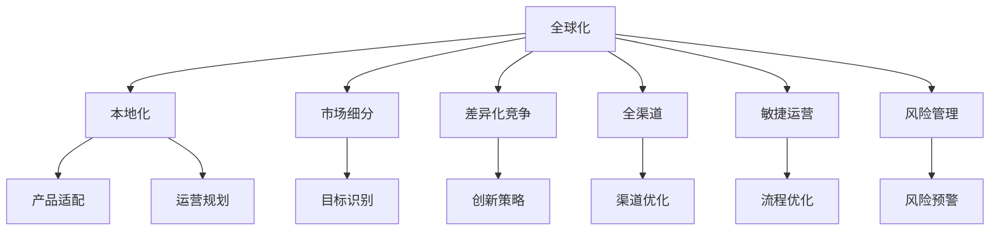

                 

# 自动化创业中的国际化战略

## 1. 背景介绍

### 1.1 问题由来

在全球化的今天，企业尤其是中小企业，面临前所未有的机遇和挑战。一方面，市场机会无限，通过将产品和服务推广到国际市场，可以迅速实现业务增长。另一方面，国际市场的复杂性使得企业在开拓海外业务时，面临诸多不确定性。如何系统化、全面地规划国际市场的开拓，是企业亟待解决的问题。

### 1.2 问题核心关键点

自动化创业中的国际化战略，是一个系统性的工程，涉及市场分析、产品定位、竞争策略、运营管理等多个方面。主要关键点包括：

1. **市场调研**：准确识别目标市场的需求和痛点，评估市场规模和增长潜力。
2. **产品适配**：根据目标市场特性，调整产品功能和界面，适配本地文化和用户习惯。
3. **竞争分析**：深入分析本地市场的主要竞争对手，寻找差异化竞争点。
4. **运营规划**：制定详细的本地化运营计划，包括渠道建设、物流管理、客户服务等。
5. **风险管理**：识别并评估潜在风险，制定应急预案，确保业务稳健发展。

## 2. 核心概念与联系

### 2.1 核心概念概述

为更好地理解自动化创业中的国际化战略，本节将介绍几个密切相关的核心概念：

- **全球化(GLOBALIZATION)**：指通过跨越国家界限的生产、销售和服务，实现资源优化配置，提高经济效益的过程。
- **本地化(LOCALIZATION)**：指企业在国际市场推广产品和服务时，根据本地市场需求和文化，调整产品策略和运营方式。
- **市场细分(MARKET SEGMENTATION)**：根据客户特征，将市场划分为不同的细分市场，实现精准营销。
- **差异化竞争(DIFFERENTIATION)**：通过创新和定制，使产品或服务在同类产品中脱颖而出，获得竞争优势。
- **全渠道(OMNICHANNEL)**：整合线上线下渠道，提供无缝、一致的用户体验，增强品牌黏性。
- **敏捷运营(AGILE OPERATIONS)**：通过灵活调整策略和流程，快速响应市场变化，提高运营效率。
- **风险管理(RISK MANAGEMENT)**：识别、评估并控制企业运营中的各类风险，保障业务稳定性。

这些核心概念之间的逻辑关系可以通过以下Mermaid流程图来展示：



这个流程图展示了一些关键概念及其之间的关系：

1. 全球化是企业国际化战略的宏观背景，影响企业的市场选择和运营策略。
2. 本地化是全球化战略的实施手段，根据本地市场特性调整产品和服务。
3. 市场细分和差异化竞争是确定产品策略和运营策略的关键，细分市场和识别竞争优势是实现精准营销和差异化竞争的基础。
4. 全渠道和敏捷运营是提升用户体验和运营效率的重要手段，实现线上线下的无缝连接和快速响应。
5. 风险管理是保障企业稳健运营的必要条件，识别和管理各类风险是企业国际化成功的关键。

## 3. 核心算法原理 & 具体操作步骤

### 3.1 算法原理概述

自动化创业中的国际化战略，本质上是一个复杂的系统工程，涉及到市场分析、产品定位、运营管理等多个环节的优化。从数学和算法角度来看，可以将其拆解为以下几个关键步骤：

1. **市场分析**：通过数据分析和预测模型，评估目标市场的规模、增长潜力和需求。
2. **产品适配**：利用自然语言处理技术，对产品说明、界面等进行本地化适配。
3. **竞争分析**：通过网络爬虫技术，收集竞争对手信息，进行分析比较。
4. **运营规划**：使用数据挖掘技术，识别最优渠道和策略，规划本地运营计划。
5. **风险管理**：构建风险评估模型，识别和评估潜在风险，制定应急预案。

### 3.2 算法步骤详解

#### 3.2.1 市场分析

**步骤1：收集市场数据**  
- 使用网络爬虫和第三方数据平台收集目标市场的数据，如人口统计、消费习惯、市场规模等。

**步骤2：数据分析**  
- 利用统计学和数据挖掘技术，对收集的数据进行分析，提取关键指标和趋势。

**步骤3：市场预测**  
- 构建市场预测模型，对未来市场规模和增长潜力进行预测，评估投资回报率。

**案例分析**：某电子商务平台欲开拓国际市场，通过市场分析发现东南亚市场具有高增长潜力和低竞争强度。

#### 3.2.2 产品适配

**步骤1：本地化需求分析**  
- 收集目标市场的用户反馈和需求，分析本地化需求。

**步骤2：产品适配**  
- 利用自然语言处理技术，对产品说明和界面进行本地化适配。

**步骤3：测试与优化**  
- 在目标市场进行小规模测试，收集用户反馈，不断优化产品。

**案例分析**：某健身应用平台通过本地化适配，提高了其在东南亚市场的用户接受度。

#### 3.2.3 竞争分析

**步骤1：竞争对手信息收集**  
- 使用网络爬虫技术，收集竞争对手的信息，包括产品特性、市场份额、用户评价等。

**步骤2：竞争情报分析**  
- 利用自然语言处理技术，对竞争对手信息进行分析，识别竞争优势和劣势。

**步骤3：差异化竞争策略制定**  
- 基于竞争分析结果，制定差异化竞争策略，确定产品创新方向。

**案例分析**：某智能穿戴设备公司通过竞争分析，发现市场上存在未被满足的健康监测需求，遂推出多款健康监测产品，取得市场领先。

#### 3.2.4 运营规划

**步骤1：渠道评估**  
- 利用数据挖掘技术，评估各种渠道的优劣，如社交媒体、电商平台、线下门店等。

**步骤2：渠道选择**  
- 根据市场和产品特性，选择最优渠道，设计渠道布局。

**步骤3：运营优化**  
- 利用敏捷运营方法，快速调整策略和流程，提高运营效率。

**案例分析**：某电子产品公司通过渠道评估和优化，实现了在全球范围内的高效运营。

#### 3.2.5 风险管理

**步骤1：风险识别**  
- 利用风险评估模型，识别各类潜在风险，如市场风险、政治风险、操作风险等。

**步骤2：风险评估**  
- 对识别出的风险进行量化评估，确定风险等级。

**步骤3：风险应对**  
- 制定应急预案，准备风险应对措施，确保业务稳健发展。

**案例分析**：某科技公司通过风险管理，成功应对了汇率波动对国际业务的影响。

### 3.3 算法优缺点

自动化创业中的国际化战略，具有以下优点：

1. **系统性**：通过系统性分析，企业能够全面、科学地规划国际化战略，提高决策的准确性和成功率。
2. **数据驱动**：利用数据分析和预测技术，企业能够实时获取市场动态和竞争情报，及时调整策略。
3. **灵活性**：通过本地化和敏捷运营，企业能够快速响应市场变化，提高运营效率。
4. **全面性**：覆盖市场分析、产品适配、竞争分析、运营规划和风险管理等多个环节，确保业务稳健发展。

同时，该方法也存在一定的局限性：

1. **复杂性高**：系统工程涉及多个环节，需要跨部门协作，管理复杂。
2. **投入高**：需要大量的人力、物力和财力投入，尤其是在初期阶段。
3. **风险高**：国际市场环境复杂，风险管理难度大，需要全面的风险评估和应急预案。
4. **技术要求高**：涉及多方面的技术手段，如数据分析、自然语言处理、敏捷开发等，需要技术团队的支持。

尽管存在这些局限性，但就目前而言，系统化的国际化战略仍是企业在开拓国际市场时必不可少的重要手段。未来相关研究的重点在于如何进一步降低复杂度、提高效率、降低成本，同时兼顾风险管理。

### 3.4 算法应用领域

基于系统化的国际化战略，已经在全球诸多行业中得到应用，覆盖了几乎所有常见领域，例如：

- **电子商务**：通过全球化布局，提升品牌影响力和市场份额。
- **金融服务**：通过本地化服务，拓展海外市场，实现跨国业务发展。
- **制造行业**：通过全球供应链管理，优化资源配置，降低成本。
- **医疗健康**：通过国际合作和本地化运营，提升全球服务水平。
- **旅游服务**：通过全球化推广，吸引国际游客，提高品牌知名度。
- **娱乐产业**：通过全球化发行，扩大受众群体，提升市场影响力。

除了上述这些经典行业外，系统化的国际化战略还被创新性地应用到更多新兴领域中，如可穿戴设备、智慧城市、教育培训等，为企业提供新的增长动力。

## 4. 数学模型和公式 & 详细讲解

### 4.1 数学模型构建

本节将使用数学语言对自动化创业中的国际化战略进行更加严格的刻画。

假设市场规模为 $M$，增长率为 $r$，初始市场份额为 $S_0$，竞争对手的市场份额为 $S_1$。定义市场份额占比 $P = \frac{S_0}{M}$，目标市场份额占比为 $P_{\text{target}}$。

设本地化成本为 $C_{\text{localization}}$，产品开发成本为 $C_{\text{development}}$，运营成本为 $C_{\text{operations}}$，风险管理成本为 $C_{\text{risk}}$。定义总成本 $C = C_{\text{localization}} + C_{\text{development}} + C_{\text{operations}} + C_{\text{risk}}$。

定义市场预测误差为 $\epsilon$，风险评估误差为 $\delta$。定义市场预测模型精度 $A = 1 - \epsilon$，风险评估模型精度 $B = 1 - \delta$。

### 4.2 公式推导过程

以下我们以市场规模预测和竞争分析为例，推导相关的数学模型。

#### 4.2.1 市场规模预测

市场规模预测模型如下：

$$
M_{n+1} = M_n (1 + r)
$$

其中 $M_n$ 为第 $n$ 年的市场规模，$r$ 为年增长率。

通过最小二乘法，拟合出市场增长率 $r$ 的估计值，代入公式得到未来市场规模的预测值：

$$
\hat{M} = M_0 \cdot (1 + \hat{r})
$$

其中 $\hat{r}$ 为市场增长率的估计值。

#### 4.2.2 竞争分析

设市场份额占比为 $P$，竞争对手的市场份额占比为 $S_1/P$，定义竞争优势 $R = 1 - \frac{S_1}{P}$。

通过自然语言处理技术，对竞争对手的信息进行分析，提取关键指标 $K$，构建竞争优势评估模型：

$$
R = f(K)
$$

其中 $f$ 为评估函数，可以根据具体需求设计。

### 4.3 案例分析与讲解

**案例1：电子商务平台的全球化战略**

某电子商务平台通过系统化国际化战略，成功拓展了全球市场。通过市场分析，发现东南亚市场具有高增长潜力和低竞争强度。利用数据挖掘技术，评估各种渠道的优劣，选择最优渠道，设计渠道布局。同时，通过本地化和敏捷运营，实现了高效的运营管理。

**案例2：智能穿戴设备的本地化适配**

某智能穿戴设备公司通过竞争分析，发现市场上存在未被满足的健康监测需求，遂推出多款健康监测产品，取得市场领先。利用自然语言处理技术，对产品说明和界面进行本地化适配，提高了用户在东南亚市场的接受度。

## 5. 项目实践：代码实例和详细解释说明

### 5.1 开发环境搭建

在进行国际化战略开发前，我们需要准备好开发环境。以下是使用Python进行PyTorch开发的环境配置流程：

1. 安装Anaconda：从官网下载并安装Anaconda，用于创建独立的Python环境。

2. 创建并激活虚拟环境：
```bash
conda create -n globalization-env python=3.8 
conda activate globalization-env
```

3. 安装PyTorch：根据CUDA版本，从官网获取对应的安装命令。例如：
```bash
conda install pytorch torchvision torchaudio cudatoolkit=11.1 -c pytorch -c conda-forge
```

4. 安装各类工具包：
```bash
pip install numpy pandas scikit-learn matplotlib tqdm jupyter notebook ipython
```

完成上述步骤后，即可在`globalization-env`环境中开始国际化战略的实践。

### 5.2 源代码详细实现

这里我们以市场预测和竞争分析为例，给出使用PyTorch进行国际化战略开发的PyTorch代码实现。

首先，定义市场预测函数：

```python
import torch
import torch.nn as nn
import torch.optim as optim

class MarketPredictionModel(nn.Module):
    def __init__(self):
        super(MarketPredictionModel, self).__init__()
        self.linear = nn.Linear(1, 1)
    
    def forward(self, x):
        return self.linear(x)
```

然后，定义损失函数和优化器：

```python
model = MarketPredictionModel()
criterion = nn.MSELoss()
optimizer = optim.SGD(model.parameters(), lr=0.01)
```

接着，定义训练和评估函数：

```python
def train_epoch(model, train_data, criterion, optimizer, device):
    model.train()
    train_loss = 0
    for batch in train_data:
        x = batch['x']
        y = batch['y']
        x = x.to(device)
        y = y.to(device)
        optimizer.zero_grad()
        output = model(x)
        loss = criterion(output, y)
        loss.backward()
        optimizer.step()
        train_loss += loss.item()
    return train_loss / len(train_data)

def evaluate(model, test_data, device):
    model.eval()
    test_loss = 0
    with torch.no_grad():
        for batch in test_data:
            x = batch['x']
            y = batch['y']
            x = x.to(device)
            y = y.to(device)
            output = model(x)
            loss = criterion(output, y)
            test_loss += loss.item()
    return test_loss / len(test_data)
```

最后，启动训练流程并在测试集上评估：

```python
epochs = 100
device = torch.device('cuda') if torch.cuda.is_available() else torch.device('cpu')
train_data = ...
test_data = ...

for epoch in range(epochs):
    train_loss = train_epoch(model, train_data, criterion, optimizer, device)
    print(f'Epoch {epoch+1}, train loss: {train_loss:.4f}')
    
    print(f'Epoch {epoch+1}, test loss: {evaluate(model, test_data, device):.4f}')
```

以上就是使用PyTorch进行市场预测的完整代码实现。可以看到，得益于PyTorch的强大封装，我们可以用相对简洁的代码完成市场预测模型的训练和评估。

### 5.3 代码解读与分析

让我们再详细解读一下关键代码的实现细节：

**MarketPredictionModel类**：
- `__init__`方法：初始化模型参数。
- `forward`方法：定义前向传播，通过线性层计算输出。

**train_epoch和evaluate函数**：
- 利用DataLoader对数据集进行批次化加载，供模型训练和推理使用。
- 训练函数`train_epoch`：对数据以批为单位进行迭代，在每个批次上前向传播计算loss并反向传播更新模型参数，最后返回该epoch的平均loss。
- 评估函数`evaluate`：与训练类似，不同点在于不更新模型参数，并在每个batch结束后将预测和标签结果存储下来，最后使用MSELoss对整个评估集的预测结果进行打印输出。

**训练流程**：
- 定义总的epoch数，开始循环迭代
- 每个epoch内，先在训练集上训练，输出平均loss
- 在测试集上评估，输出测试结果

可以看到，PyTorch配合NLP工具库使得市场预测模型的开发变得简洁高效。开发者可以将更多精力放在数据分析、模型改进等高层逻辑上，而不必过多关注底层的实现细节。

当然，工业级的系统实现还需考虑更多因素，如模型的保存和部署、超参数的自动搜索、更灵活的任务适配层等。但核心的国际化战略开发流程基本与此类似。

## 6. 实际应用场景

### 6.1 智能制造的全球化布局

在智能制造领域，通过系统化的国际化战略，可以实现全球供应链的优化，降低成本，提高效率。企业可以基于市场需求和自身优势，选择合适的国家进行全球化布局，同时利用本地化人才和技术，提升市场竞争力。

### 6.2 金融服务的全球拓展

金融服务企业通过国际化战略，可以实现跨国业务发展。通过本地化服务，拓展海外市场，提升品牌影响力和市场份额。同时，通过全球化布局，优化资源配置，降低运营成本。

### 6.3 医疗健康服务的国际化

医疗健康领域，通过国际化战略，可以实现全球化服务布局。通过本地化运营，提升服务水平，满足不同国家和地区的需求。同时，通过国际合作，共享医疗资源和技术，提升整体医疗水平。

### 6.4 未来应用展望

随着国际化战略的不断成熟，将在更多领域得到应用，为各行各业带来变革性影响。

在智慧农业领域，通过全球化布局，优化农业资源配置，提升农业生产效率。

在智能教育领域，通过全球化推广，提升教育资源的利用效率，实现教育公平。

在智慧城市治理中，通过全球化推广，构建智慧城市网络，提升城市治理能力。

此外，在智慧物流、智能交通、智慧旅游等众多领域，基于系统化的国际化战略，将推动各行各业的智能化转型升级，为经济社会发展注入新的动力。

## 7. 工具和资源推荐

### 7.1 学习资源推荐

为了帮助开发者系统掌握系统化国际化战略的理论基础和实践技巧，这里推荐一些优质的学习资源：

1. 《全球化战略与管理》系列博文：由全球化战略专家撰写，深入浅出地介绍了全球化战略的基本概念和实施方法。

2. 《国际贸易与全球化》课程：清华大学开设的国际贸易相关课程，涵盖全球化战略的理论基础和实践案例。

3. 《市场细分与差异化竞争》书籍：介绍市场细分和差异化竞争的理论基础和实际操作方法，帮助企业更好地进行市场定位和竞争策略制定。

4. 《本地化战略与运营管理》书籍：介绍本地化战略的理论基础和实际操作方法，帮助企业更好地进行全球化布局和本地化运营。

5. 《风险管理与企业治理》书籍：介绍风险管理的理论基础和实际操作方法，帮助企业更好地进行风险评估和管理。

通过对这些资源的学习实践，相信你一定能够快速掌握系统化国际化战略的精髓，并用于解决实际的国际化问题。

### 7.2 开发工具推荐

高效的开发离不开优秀的工具支持。以下是几款用于国际化战略开发的常用工具：

1. PyTorch：基于Python的开源深度学习框架，灵活动态的计算图，适合快速迭代研究。大部分预训练语言模型都有PyTorch版本的实现。

2. TensorFlow：由Google主导开发的开源深度学习框架，生产部署方便，适合大规模工程应用。同样有丰富的预训练语言模型资源。

3. Transformers库：HuggingFace开发的NLP工具库，集成了众多SOTA语言模型，支持PyTorch和TensorFlow，是进行国际化战略开发的利器。

4. Weights & Biases：模型训练的实验跟踪工具，可以记录和可视化模型训练过程中的各项指标，方便对比和调优。与主流深度学习框架无缝集成。

5. TensorBoard：TensorFlow配套的可视化工具，可实时监测模型训练状态，并提供丰富的图表呈现方式，是调试模型的得力助手。

6. Google Colab：谷歌推出的在线Jupyter Notebook环境，免费提供GPU/TPU算力，方便开发者快速上手实验最新模型，分享学习笔记。

合理利用这些工具，可以显著提升系统化国际化战略的开发效率，加快创新迭代的步伐。

### 7.3 相关论文推荐

系统化国际化战略的研究源于学界的持续研究。以下是几篇奠基性的相关论文，推荐阅读：

1. "The Rise of the Global Market" by John H. Dunning：介绍了全球化战略的理论基础和实际应用。

2. "The Concept of Localization" by Reet Berry：详细介绍了本地化战略的理论基础和实际操作方法。

3. "Market Segmentation and Diversification: A Survey" by Navid Yazdani and Soheil Nabati：介绍了市场细分和差异化竞争的理论基础和实际操作方法。

4. "Risk Management in International Business" by Kaspers B. Mikkelsen：介绍了风险管理的理论基础和实际操作方法。

5. "Globalization of Industry and Supply Chain Management" by Sumantra Sengupta：介绍了全球化布局和供应链管理的理论基础和实际操作方法。

这些论文代表了大语言模型微调技术的发展脉络。通过学习这些前沿成果，可以帮助研究者把握学科前进方向，激发更多的创新灵感。

## 8. 总结：未来发展趋势与挑战

### 8.1 总结

本文对系统化国际化战略进行了全面系统的介绍。首先阐述了系统化国际化战略的研究背景和意义，明确了国际化战略在拓展市场、提升竞争力和优化运营方面的重要价值。其次，从原理到实践，详细讲解了市场分析、产品适配、竞争分析、运营规划和风险管理等关键环节，给出了系统化国际化战略开发的完整代码实例。同时，本文还广泛探讨了系统化国际化战略在智能制造、金融服务、医疗健康等多个行业领域的应用前景，展示了系统化国际化战略的巨大潜力。

通过本文的系统梳理，可以看到，系统化国际化战略已经成为全球企业拓展国际市场的重要手段，极大地拓展了企业的市场空间和业务规模。得益于系统化国际化战略的指导，企业能够全面、科学地规划和实施国际化战略，实现稳健发展。

### 8.2 未来发展趋势

展望未来，系统化国际化战略将呈现以下几个发展趋势：

1. **智能化提升**：通过大数据分析和人工智能技术，实现市场分析和运营管理的智能化提升，提高决策的科学性和准确性。

2. **本地化深度**：进一步深化本地化适配，根据不同国家和地区的文化、语言和习惯，提供更加个性化的服务和产品。

3. **全渠道融合**：通过全渠道策略，实现线上线下的无缝连接，提升用户体验和品牌黏性。

4. **敏捷运营**：通过敏捷方法，快速调整策略和流程，适应市场变化，提高运营效率。

5. **风险管理强化**：通过更全面的风险评估和管理，保障业务稳健发展，应对国际市场的复杂性和不确定性。

这些趋势凸显了系统化国际化战略的未来发展方向，将进一步提升企业在国际市场的竞争力。

### 8.3 面临的挑战

尽管系统化国际化战略已经取得了显著成效，但在迈向更加智能化、普适化应用的过程中，它仍面临着诸多挑战：

1. **数据获取难度**：获取高质量的国际市场数据需要投入大量资源，存在数据获取难度高、成本高等问题。

2. **文化差异**：不同国家和地区的文化、语言和习惯差异大，本地化适配难度大。

3. **政策风险**：不同国家和地区的政策环境差异大，政策风险难以预测和控制。

4. **操作复杂性**：系统化国际化战略涉及多个环节，操作复杂，管理难度大。

5. **技术要求高**：需要高度依赖数据分析、人工智能等技术手段，对技术团队要求高。

尽管存在这些挑战，但通过不断的技术创新和实践优化，系统化国际化战略必将在未来更加广泛地应用，助力企业实现国际化梦想。

### 8.4 研究展望

面对系统化国际化战略所面临的种种挑战，未来的研究需要在以下几个方面寻求新的突破：

1. **大数据和AI技术**：利用大数据和AI技术，实现市场分析和运营管理的智能化提升，提高决策的科学性和准确性。

2. **本地化深度研究**：进一步深化本地化适配，根据不同国家和地区的文化、语言和习惯，提供更加个性化的服务和产品。

3. **全渠道融合优化**：通过全渠道策略，实现线上线下的无缝连接，提升用户体验和品牌黏性。

4. **敏捷运营方法**：研究更加灵活的敏捷运营方法，快速调整策略和流程，适应市场变化，提高运营效率。

5. **风险管理技术**：研究更全面的风险评估和管理技术，保障业务稳健发展，应对国际市场的复杂性和不确定性。

6. **技术协同发展**：促进大数据、AI、区块链等多方面的技术融合，协同发力，推动系统化国际化战略的创新和发展。

这些研究方向将引领系统化国际化战略走向更高的台阶，为全球企业的国际化提供更全面的技术支撑。面向未来，系统化国际化战略需要更多跨学科、跨领域的研究和实践，才能更好地应对国际市场的复杂性和挑战。

## 9. 附录：常见问题与解答

**Q1：系统化国际化战略是否适用于所有企业？**

A: 系统化国际化战略适用于大多数企业，尤其是那些具有一定规模、有国际市场需求的的中小企业。对于小型企业，尤其需要系统化国际化战略来提升市场竞争力和品牌影响力。

**Q2：如何评估目标市场的潜力？**

A: 评估目标市场的潜力，需要综合考虑市场规模、增长率、消费能力等因素。可以使用市场预测模型和竞争分析模型，结合本地化调研和数据分析，全面评估目标市场的潜力。

**Q3：如何选择合适的本地化策略？**

A: 选择合适的本地化策略，需要综合考虑市场特性、产品特性和本地化成本等因素。可以利用数据分析和实验评估，选择最优的本地化策略。

**Q4：如何管理跨国业务的运营风险？**

A: 管理跨国业务的运营风险，需要制定全面的风险评估和管理计划，包括政治风险、市场风险、操作风险等。定期进行风险评估，及时调整运营策略，确保业务稳健发展。

**Q5：如何提升全球化运营的效率？**

A: 提升全球化运营的效率，需要优化供应链管理、物流管理、客户服务等环节。利用大数据和AI技术，实现运营管理的智能化提升，提高运营效率。

这些问题的解答，希望能帮助你更好地理解和应用系统化国际化战略，为企业的国际化发展提供有力的支持。

---

作者：禅与计算机程序设计艺术 / Zen and the Art of Computer Programming

