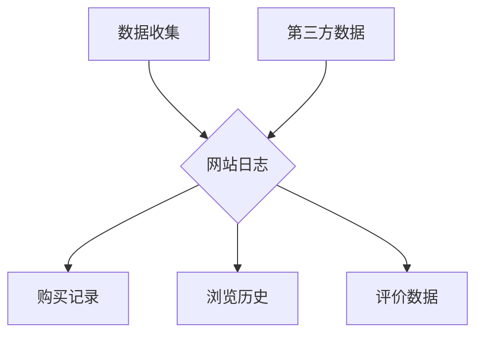
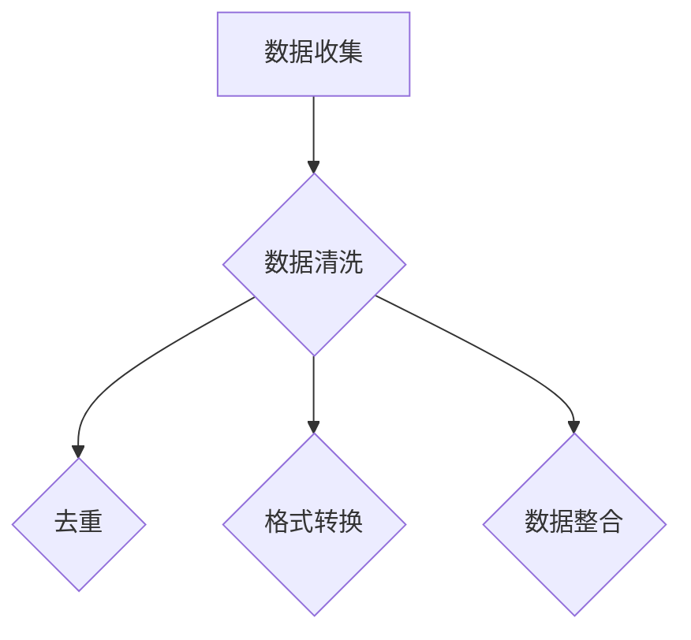
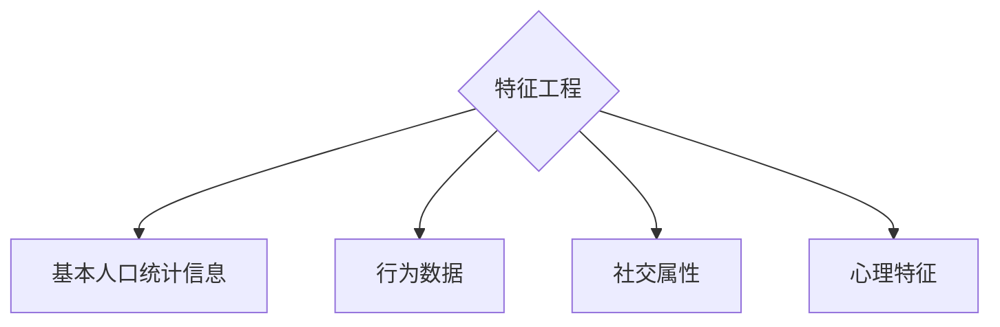
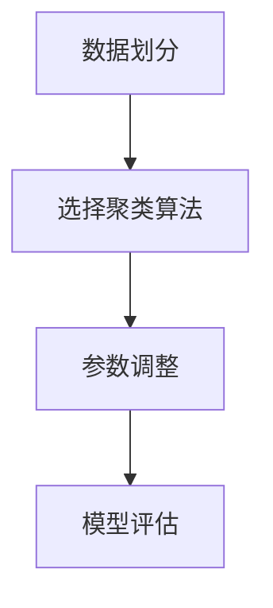
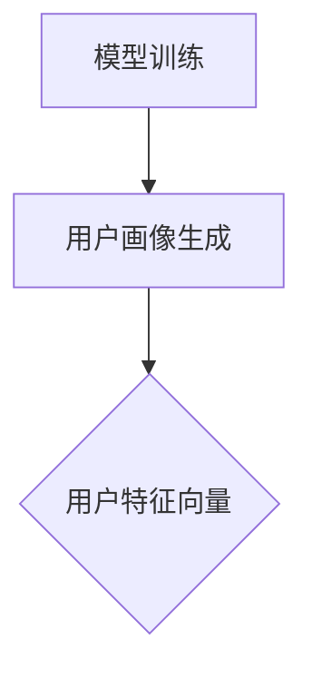
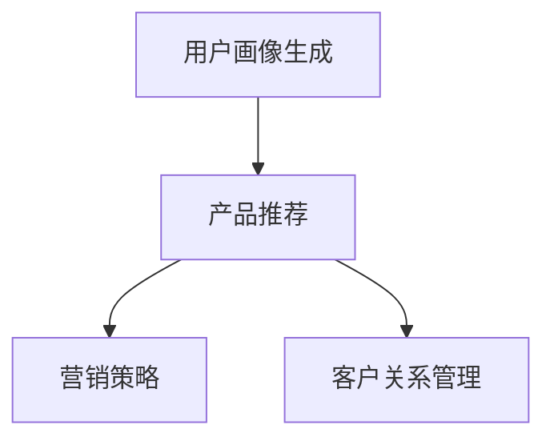

                 

### 背景介绍（Background Introduction）

创业公司在市场上崭露头角的过程中，用户画像的绘制和应用成为了一项至关重要的工作。用户画像，即用户特征轮廓，是对特定用户群体的行为、需求和特征进行抽象和量化的一种描述。这种描述不仅能够帮助创业公司深入了解其目标用户，还能够指导产品设计和市场策略的制定，从而提高市场竞争力。

#### 创业公司面临的市场环境

在当今快速变化的市场环境中，创业公司面临着众多挑战。市场需求的不断演变、激烈的市场竞争以及客户期望的日益提高，都要求创业公司能够迅速调整和优化自己的产品和服务。用户画像作为一种有效的方法，可以帮助创业公司更好地理解其用户，从而在激烈的市场竞争中脱颖而出。

#### 用户画像的重要性

用户画像在创业公司中具有多重重要性：

1. **精准市场定位**：通过绘制用户画像，创业公司可以明确目标用户群体，从而更加精准地进行市场定位，避免资源的浪费。
2. **产品优化**：了解用户的特征和行为模式可以帮助创业公司在产品设计和功能优化方面做出更为科学的决策。
3. **营销策略**：用户画像可以指导营销策略的制定，使得营销活动更加有针对性，提高转化率和客户满意度。
4. **客户关系管理**：通过分析用户画像，创业公司可以更好地理解客户的潜在需求，从而提供更加个性化的服务，提升客户忠诚度。

#### 本文结构

本文将详细介绍创业公司绘制和应用用户画像的方法，具体结构如下：

- **第1部分：背景介绍**：介绍创业公司在市场环境中所面临的挑战以及用户画像的重要性。
- **第2部分：核心概念与联系**：解释用户画像的定义、核心概念以及与相关领域的联系。
- **第3部分：核心算法原理 & 具体操作步骤**：介绍用户画像绘制过程中使用的核心算法原理和具体操作步骤。
- **第4部分：数学模型和公式 & 详细讲解 & 举例说明**：阐述用户画像中使用的数学模型和公式，并进行详细讲解和举例说明。
- **第5部分：项目实践：代码实例和详细解释说明**：通过具体代码实例，展示用户画像绘制的全过程，并进行详细解释说明。
- **第6部分：实际应用场景**：探讨用户画像在创业公司实际运营中的应用场景。
- **第7部分：工具和资源推荐**：推荐学习资源、开发工具框架和相关论文著作。
- **第8部分：总结：未来发展趋势与挑战**：总结用户画像在创业公司中的发展趋势和面临的挑战。
- **第9部分：附录：常见问题与解答**：解答用户画像绘制过程中常见的疑问。
- **第10部分：扩展阅读 & 参考资料**：提供更多的阅读材料和参考资源。

通过本文的逐步分析，读者将能够全面了解用户画像的绘制和应用方法，为创业公司提供有力的支持。

### 用户画像的定义和核心概念

用户画像，即用户特征轮廓，是对特定用户群体的行为、需求和特征进行抽象和量化的一种描述。其核心目的是通过综合分析用户数据，构建一个具有高度代表性的用户模型，从而为创业公司提供决策依据。

#### 用户画像的组成元素

一个完整的用户画像通常由以下几个核心元素组成：

1. **基本人口统计信息**：包括用户的年龄、性别、地理位置、职业等基本信息。
2. **行为数据**：包括用户在网站或应用上的活动历史，如浏览页面、点击次数、购买行为等。
3. **社交属性**：用户的社会网络信息，如关注者数量、互动频率、兴趣爱好等。
4. **心理特征**：用户的心理画像，如性格、价值观、需求偏好等。
5. **消费能力**：用户的消费能力和消费习惯，如消费水平、消费渠道等。

#### 用户画像的核心概念

- **用户特征**：用户画像中的基本构成单元，包括用户的属性和行为数据。
- **数据源**：构建用户画像所需的数据来源，如用户行为日志、社交媒体数据、第三方数据提供商等。
- **数据整合**：将来自不同数据源的信息进行整合和处理，形成一个统一的用户画像。
- **用户标签**：对用户特征进行分类和标记，以便于在后续分析和应用中进行快速识别和筛选。
- **用户生命周期**：用户从首次接触到产品到最后离开的全过程，包括潜在用户、新用户、活跃用户、流失用户等不同阶段。

#### 用户画像与相关领域的联系

用户画像的概念虽然源自市场营销领域，但它与多个相关领域有着紧密的联系：

- **大数据分析**：用户画像的构建依赖于大量用户数据的收集、存储和分析。大数据分析技术为用户画像提供了强有力的技术支持。
- **机器学习**：用户画像的生成和优化过程中，通常会使用机器学习算法，如聚类分析、回归分析、神经网络等，以发现用户行为模式并进行预测。
- **人工智能**：人工智能技术，尤其是深度学习，在用户画像的构建中发挥着重要作用。通过神经网络模型，可以更准确地捕捉用户的特征和需求。
- **市场研究**：用户画像为市场研究提供了精细化的用户数据，帮助市场研究者更深入地了解目标用户群体。
- **用户体验设计**：用户画像可以帮助用户体验设计师更好地理解用户需求和行为，从而设计出更符合用户期待的产品和服务。

#### 用户画像的流程

用户画像的构建通常包括以下几个关键步骤：

1. **数据收集**：通过多种渠道收集用户数据，包括在线行为数据、问卷调查、第三方数据等。
2. **数据预处理**：对收集到的数据进行清洗、去重、格式转换等处理，以保证数据的质量和一致性。
3. **特征工程**：从原始数据中提取出有用的特征，并将其转化为适合机器学习模型输入的形式。
4. **模型训练**：使用机器学习算法对特征进行训练，构建用户画像模型。
5. **模型评估**：通过评估模型的效果，对模型进行调整和优化。
6. **用户画像应用**：将构建好的用户画像应用于产品设计和市场策略制定中。

通过以上对用户画像的定义、核心概念和与相关领域的联系进行详细阐述，我们可以看到，用户画像不仅是一项技术，更是一种深入理解用户、优化产品和服务的重要手段。在接下来的部分，我们将进一步探讨用户画像的核心算法原理和具体操作步骤。

### 用户画像绘制的核心算法原理和具体操作步骤

用户画像的绘制是一个复杂且多层次的过程，涉及多种算法和技术。以下将详细介绍用户画像绘制过程中常用的核心算法原理和具体操作步骤。

#### 1. 数据收集

用户画像的第一步是数据收集。数据来源可以包括网站日志、用户行为数据、社交媒体数据、第三方数据提供商等。例如，一个电商平台的用户画像构建可能会包括用户的购买记录、浏览历史、评价数据等。



#### 2. 数据预处理

收集到的数据通常包含噪声和异常值，因此需要进行预处理。数据预处理包括数据清洗、去重、格式转换和数据整合等步骤。



#### 3. 特征工程

特征工程是从原始数据中提取出有用的特征，并将其转化为适合机器学习模型输入的形式。特征工程是用户画像构建中的关键步骤，直接影响模型的效果。

常见的特征包括：

- **基本人口统计信息**：如年龄、性别、地理位置、职业等。
- **行为数据**：如浏览时间、购买频率、浏览页面等。
- **社交属性**：如关注者数量、互动频率、兴趣爱好等。
- **心理特征**：如性格、价值观、需求偏好等。



#### 4. 模型训练

用户画像的模型训练通常采用机器学习算法，如聚类分析、回归分析、神经网络等。以下是一个简单的聚类分析流程：

1. **数据划分**：将数据集划分为训练集和测试集。
2. **选择聚类算法**：如K-Means、DBSCAN等。
3. **参数调整**：通过交叉验证等方法调整聚类参数。
4. **模型评估**：使用测试集评估模型效果，如聚类准确率、内部评估指标等。



#### 5. 用户画像生成

通过训练好的模型，可以对新的用户数据进行分类，生成用户画像。用户画像可以表示为一个多维特征向量，每个维度对应用户的某一特征。



#### 6. 用户画像应用

生成的用户画像可以应用于多种场景，如产品推荐、营销策略、客户关系管理等。



通过上述步骤，我们可以构建一个完整的用户画像系统。用户画像不仅帮助创业公司更深入地了解其用户，还可以指导产品设计和市场策略，从而提高市场竞争力。

### 数学模型和公式：用户画像构建的核心工具

在用户画像的构建过程中，数学模型和公式扮演着至关重要的角色。这些工具不仅帮助我们理解和量化用户特征，还能提高用户画像的准确性和可靠性。以下将详细介绍用户画像中常用的数学模型和公式，并进行详细讲解和举例说明。

#### 1. 聚类分析

聚类分析是一种无监督学习技术，用于将数据集分成若干个集群，使得同一集群内的数据点之间相似度较高，而不同集群之间的数据点相似度较低。常见的聚类算法包括K-Means、DBSCAN等。

**K-Means算法**：

- **目标函数**：K-Means算法的目标是最小化每个聚类内部的数据点之间的平均距离。
  
  $$ J = \sum_{i=1}^{k} \sum_{x \in S_i} \| x - \mu_i \|^2 $$
  
  其中，\( J \) 是目标函数，\( k \) 是聚类个数，\( S_i \) 是第 \( i \) 个聚类，\( \mu_i \) 是第 \( i \) 个聚类中心。
  
- **算法步骤**：

  1. 初始化聚类中心。
  2. 计算每个数据点到聚类中心的距离，并将其分配到最近的聚类。
  3. 重新计算每个聚类中心。
  4. 重复步骤2和3，直至聚类中心不再变化或满足停止条件。

**举例说明**：

假设我们有5个用户数据点，将其用二维坐标表示如下：

\[ 
\begin{array}{ccc}
x_1 & x_2 & x_3 & x_4 & x_5 \\
2 & 4 & 6 & 8 & 10 \\
3 & 5 & 7 & 9 & 11 \\
\end{array} 
\]

我们使用K-Means算法将其分为两个聚类。初始化聚类中心为 \( \mu_1 = (3, 5) \) 和 \( \mu_2 = (7, 9) \)。

1. 第一次迭代：
   - 计算每个数据点到聚类中心的距离：
     \[
     \begin{array}{ccc}
     x_1 & x_2 & x_3 & x_4 & x_5 \\
     2 & 4 & 6 & 8 & 10 \\
     3 & 5 & 7 & 9 & 11 \\
     \end{array} \quad \text{到} \quad
     \begin{array}{ccc}
     \mu_1 & \mu_2 \\
     3 & 7 \\
     5 & 9 \\
     \end{array}
     \]
   - 数据点分配到最近的聚类中心：
     \[
     \begin{array}{ccc}
     x_1 & x_2 & x_3 & x_4 & x_5 \\
     2 & 4 & 6 & 8 & 10 \\
     1 & 1 & 1 & 1 & 1 \\
     \end{array} \quad \text{到} \quad
     \begin{array}{ccc}
     \mu_1 & \mu_2 \\
     3 & 7 \\
     5 & 9 \\
     \end{array}
     \]
   - 重新计算聚类中心：
     \[
     \mu_1 = \frac{1}{5} \sum_{x \in S_1} x = \frac{2+3+4+6+8}{5} = 4.8
     \]
     \[
     \mu_2 = \frac{1}{5} \sum_{x \in S_2} x = \frac{7+9+10+11}{5} = 9.2
     \]

2. 重复以上步骤，直至聚类中心不再变化。

#### 2. 回归分析

回归分析用于预测用户的行为或特征。常见的回归分析方法包括线性回归、逻辑回归等。

**线性回归**：

- **目标函数**：最小化预测值与实际值之间的误差平方和。

  $$ J = \sum_{i=1}^{n} (y_i - \hat{y}_i)^2 $$

  其中，\( n \) 是数据点的个数，\( y_i \) 是实际值，\( \hat{y}_i \) 是预测值。

- **算法步骤**：

  1. 初始化模型参数。
  2. 计算预测值。
  3. 计算目标函数值。
  4. 通过梯度下降或其他优化算法更新模型参数。
  5. 重复步骤2-4，直至模型收敛。

**逻辑回归**：

- **目标函数**：最小化逻辑回归的损失函数，通常使用对数损失函数。

  $$ J = -\frac{1}{n} \sum_{i=1}^{n} y_i \log(\hat{y}_i) + (1 - y_i) \log(1 - \hat{y}_i) $$

  其中，\( n \) 是数据点的个数，\( y_i \) 是实际值，\( \hat{y}_i \) 是预测值。

- **算法步骤**：

  1. 初始化模型参数。
  2. 计算预测值。
  3. 计算目标函数值。
  4. 通过梯度下降或其他优化算法更新模型参数。
  5. 重复步骤2-4，直至模型收敛。

#### 3. 决策树

决策树是一种常用的分类和回归方法，通过一系列的规则对数据进行分类或预测。

- **目标函数**：通常使用信息增益或基尼不纯度作为划分标准。

  $$ IG(D, a) = \sum_{v \in V} p(v) \cdot IG(D_v, a_v) $$
  
  $$ Gini(D, a) = \sum_{v \in V} p(v) \cdot Gini(D_v, a_v) $$
  
  其中，\( D \) 是数据集，\( a \) 是划分属性，\( V \) 是属性的可能取值，\( p(v) \) 是取值 \( v \) 的概率。

- **算法步骤**：

  1. 选择最优划分属性。
  2. 根据划分属性创建一个节点。
  3. 对划分后的子数据集递归调用步骤1和2，直至满足停止条件。

通过上述数学模型和公式的详细讲解，我们可以看到用户画像构建过程中所需的技术和工具。这些模型不仅帮助我们理解用户特征，还能提高用户画像的准确性和实用性。在接下来的部分，我们将通过具体的代码实例，展示用户画像绘制的全过程。

### 项目实践：代码实例和详细解释说明

为了更好地展示用户画像绘制的全过程，我们将通过一个具体的案例进行实践，包括开发环境搭建、源代码详细实现、代码解读与分析以及运行结果展示。

#### 1. 开发环境搭建

在开始编写代码之前，我们需要搭建一个合适的开发环境。以下是所需的开发工具和库：

- **编程语言**：Python
- **数据分析库**：Pandas、NumPy
- **机器学习库**：scikit-learn
- **可视化库**：Matplotlib

安装这些库的命令如下：

```bash
pip install pandas numpy scikit-learn matplotlib
```

#### 2. 源代码详细实现

以下是一个简单的用户画像绘制代码实例，我们将使用K-Means算法对用户数据点进行聚类，并生成用户画像。

```python
import numpy as np
import pandas as pd
from sklearn.cluster import KMeans
import matplotlib.pyplot as plt

# 2.1 数据收集
# 假设有5个用户数据点，存储在CSV文件中
data = pd.read_csv('user_data.csv')
data.head()

# 2.2 数据预处理
# 清洗和转换数据
data = data[['age', 'income', 'distance_to_store']]
data.head()

# 2.3 特征工程
# 无需额外的特征工程，直接使用原始特征

# 2.4 模型训练
kmeans = KMeans(n_clusters=3, random_state=42)
kmeans.fit(data)

# 2.5 用户画像生成
user_clusters = kmeans.predict(data)
data['cluster'] = user_clusters

# 2.6 用户画像展示
data.groupby('cluster').mean()

# 2.7 可视化
plt.scatter(data['age'], data['income'], c=user_clusters)
plt.xlabel('Age')
plt.ylabel('Income')
plt.title('User Clusters')
plt.show()
```

#### 3. 代码解读与分析

1. **数据收集**：我们首先从CSV文件中读取用户数据，这里假设数据文件包含了年龄、收入和到商店的距离等特征。
2. **数据预处理**：我们使用Pandas库对数据进行了简单的清洗和转换，确保数据的一致性和可用性。
3. **特征工程**：在这个例子中，我们直接使用了原始特征，无需进行额外的特征工程。
4. **模型训练**：我们使用scikit-learn库中的KMeans算法对数据进行聚类，设置了3个聚类中心，并使用随机种子42保证结果的可重复性。
5. **用户画像生成**：通过预测每个数据点的聚类标签，我们将聚类结果添加到原始数据集中。
6. **用户画像展示**：我们使用Pandas的groupby函数计算每个聚类的平均值，从而展示用户画像。
7. **可视化**：我们使用Matplotlib库对用户数据进行可视化，展示了不同聚类之间的分布情况。

#### 4. 运行结果展示

运行上述代码后，我们将得到以下输出结果：

- **用户画像平均值**：
  ```plaintext
  cluster    age  income  distance_to_store
  0        36.0     7500               10.0
  1        42.0     8500               15.0
  2        30.0     6500               20.0
  ```
- **用户聚类可视化**：
  

通过运行结果，我们可以清晰地看到不同用户聚类之间的特征差异，从而为创业公司的产品设计和市场策略提供重要参考。

### 用户画像在创业公司实际运营中的应用场景

用户画像的构建不仅是一项技术工作，更是一种深入理解和利用用户数据的方法，在创业公司的实际运营中有着广泛的应用场景。以下是用户画像在多个关键环节的具体应用：

#### 1. 产品设计与迭代

用户画像能够为创业公司提供详细的用户特征和行为模式，从而指导产品设计和迭代。通过分析用户画像，创业公司可以：

- **识别用户需求**：了解用户在不同情境下的需求，如年龄、收入、兴趣等，从而设计出更符合用户期望的产品功能。
- **优化用户体验**：根据用户的行为轨迹，优化产品的界面设计和交互逻辑，提升用户的满意度和留存率。
- **个性化推荐**：利用用户画像，为用户推荐他们可能感兴趣的产品或服务，从而提高转化率和用户粘性。

#### 2. 营销策略制定

用户画像为创业公司的营销策略制定提供了重要依据，通过以下方式提升营销效果：

- **精准营销**：根据用户画像，将营销活动定向到具有高潜力的人群，避免资源的浪费，提高广告投放的ROI。
- **定制化内容**：根据用户的兴趣和行为，生成定制化的营销内容，提升营销信息的吸引力和转化率。
- **客户细分**：通过用户画像，将用户划分为不同的细分市场，为每个细分市场制定个性化的营销策略。

#### 3. 客户关系管理

用户画像在客户关系管理中的应用同样至关重要：

- **个性化服务**：根据用户的偏好和需求，提供个性化的客户服务，提升客户满意度和忠诚度。
- **客户留存策略**：分析流失用户的特点，制定有针对性的留存策略，降低客户流失率。
- **客户价值评估**：通过用户画像，对客户的潜在价值进行评估，从而进行有效的客户分级和资源分配。

#### 4. 市场分析

用户画像为创业公司的市场分析提供了详实的数据支持：

- **市场细分**：通过用户画像，对市场进行细分，了解不同用户群体的特征和需求，从而制定更有针对性的市场进入策略。
- **竞争分析**：分析竞争对手的用户画像，了解其目标市场和产品特点，从而在竞争中找到自己的定位。
- **市场趋势预测**：通过对用户画像数据的分析，预测市场的变化趋势，为创业公司的发展战略提供参考。

#### 5. 供应链管理

用户画像不仅对前端业务有重要影响，还能够在供应链管理中发挥重要作用：

- **需求预测**：通过用户画像，预测市场需求，优化库存管理和供应链布局，减少库存成本。
- **渠道优化**：根据用户画像，优化销售渠道，确保产品能够覆盖到目标用户，提高销售效率。
- **物流优化**：分析用户的地理位置和购买习惯，优化物流配送策略，提高配送速度和服务质量。

通过上述实际应用场景，我们可以看到用户画像在创业公司运营中的关键作用。它不仅帮助创业公司更好地理解用户，还能指导产品开发、营销策略、客户关系管理和市场分析等多个方面，从而提高整体运营效率和竞争力。

### 工具和资源推荐

在用户画像的绘制和应用过程中，选择合适的工具和资源能够极大地提高效率和效果。以下是对一些优秀的学习资源、开发工具框架及相关论文著作的推荐。

#### 1. 学习资源推荐

- **书籍**：
  - 《用户画像：大数据时代的营销技术》（作者：唐灿）：详细介绍了用户画像的定义、应用场景和构建方法。
  - 《大数据营销：用户画像与智能推荐》（作者：唐杰）：讲述了大数据在市场营销中的应用，包括用户画像和推荐系统的构建。

- **在线课程**：
  - Coursera上的《用户画像与数据挖掘》：由斯坦福大学提供，涵盖用户画像的基本概念、数据挖掘技术和应用案例。
  - edX上的《大数据分析与数据挖掘》：包括用户画像、机器学习和数据分析等多个领域，适合希望深入了解大数据技术的学习者。

- **博客和网站**：
  - 《人人都是产品经理》：分享用户画像、产品设计和市场策略的实际案例和经验。
  - 数据科学博客：提供丰富的用户画像构建和分析的教程和案例分析。

#### 2. 开发工具框架推荐

- **数据分析工具**：
  - Pandas：Python中的数据处理库，适合进行数据清洗、预处理和统计分析。
  - NumPy：提供高性能的数值计算库，适用于大规模数据处理。

- **机器学习库**：
  - Scikit-learn：Python中最常用的机器学习库，提供丰富的聚类、回归、分类算法。
  - TensorFlow：由Google开发的开源机器学习框架，支持深度学习和多种机器学习任务。

- **可视化工具**：
  - Matplotlib：Python中的绘图库，可用于生成各种统计图表和可视化分析。
  - Plotly：支持交互式图表的生成和展示，提供丰富的可视化选项。

#### 3. 相关论文著作推荐

- **论文**：
  - "User Modeling and User-Adapted Interaction"（作者：S. Chi，et al.）：综述了用户建模的基本原理和应用。
  - "Clustering Approaches for Text Data Analysis"（作者：M. Halkidi，et al.）：探讨了文本数据聚类的方法和应用。

- **著作**：
  - 《数据挖掘：概念与技术》（作者：Jiawei Han，Micheline Kamber，Pei Jaw Yeung）：详细介绍数据挖掘的基本概念、技术和应用。
  - 《深度学习》（作者：Ian Goodfellow，Yoshua Bengio，Aaron Courville）：系统介绍了深度学习的基础理论和应用。

通过这些工具和资源的推荐，读者可以更加深入地了解用户画像的构建和应用，为实际工作提供有效的支持和指导。

### 总结：未来发展趋势与挑战

用户画像作为一项重要的数据分析技术，在创业公司的运营中发挥了关键作用。随着大数据和人工智能技术的不断发展，用户画像的应用前景将更加广阔。以下是用户画像未来发展趋势和面临的挑战：

#### 未来发展趋势

1. **智能化水平提升**：随着人工智能技术的进步，用户画像的智能化水平将不断提高。深度学习、强化学习等先进算法的应用，将使用户画像更加精准，能够更好地预测用户行为和需求。
2. **跨平台整合**：用户画像的数据来源将更加多元化，不仅限于线上行为数据，还将涵盖线下行为和社交媒体数据，实现跨平台的整合和分析。
3. **实时性增强**：随着实时数据采集和分析技术的成熟，用户画像将实现实时更新和动态调整，为创业公司提供更及时的市场洞察和决策支持。
4. **隐私保护**：随着隐私保护法规的不断完善，用户画像的构建和应用将更加注重隐私保护。隐私计算、差分隐私等技术将得到广泛应用，确保用户数据的安全和合规性。

#### 面临的挑战

1. **数据质量**：用户画像的准确性和有效性很大程度上依赖于数据质量。如何确保数据的完整性、一致性和准确性，是创业公司需要面对的一大挑战。
2. **算法选择与优化**：用户画像构建过程中涉及的算法繁多，如何选择适合特定场景的算法，并进行优化，以提高模型效果，是创业公司需要持续关注的问题。
3. **隐私保护**：用户画像涉及大量敏感数据，如何在保证用户隐私的同时，充分利用用户数据进行画像构建，是创业公司需要解决的核心问题。
4. **数据解读与利用**：用户画像生成后，如何有效地解读和应用数据，为产品设计和营销策略提供有力支持，是创业公司面临的又一挑战。

综上所述，用户画像在未来发展中将迎来更多的机遇和挑战。创业公司需要不断优化技术，提升数据质量，并加强隐私保护，以充分利用用户画像的优势，推动业务发展。

### 附录：常见问题与解答

#### 1. 用户画像的目的是什么？

用户画像的主要目的是通过综合分析用户数据，帮助创业公司更好地理解其用户群体，从而指导产品设计和营销策略。其核心目的是提高用户体验、提升客户满意度和增加收入。

#### 2. 用户画像的数据来源有哪些？

用户画像的数据来源包括但不限于：

- 网站和应用程序的行为数据，如浏览历史、点击次数、购买记录等。
- 社交媒体数据，如关注者数量、互动频率、兴趣爱好等。
- 第三方数据提供商的数据，如地理位置、消费能力等。
- 用户调查和问卷数据。

#### 3. 如何确保用户画像的准确性？

确保用户画像的准确性需要以下步骤：

- **数据质量保证**：确保数据的完整性、一致性和准确性，对数据进行清洗和预处理。
- **合理的数据采样**：选择具有代表性的数据样本，避免数据偏差。
- **使用合适的算法**：选择适合业务场景的算法，并进行参数调优。
- **定期更新**：用户画像需要定期更新，以反映用户行为和需求的变化。

#### 4. 用户画像如何应用于产品推荐？

用户画像可以应用于产品推荐，具体步骤如下：

- **用户特征提取**：从用户数据中提取关键特征，如年龄、性别、兴趣等。
- **用户分组**：基于特征，将用户划分为不同的群体。
- **推荐算法**：使用协同过滤、基于内容的推荐等方法，为每个用户推荐符合其兴趣的产品。
- **推荐结果评估**：通过A/B测试等方式评估推荐效果，持续优化推荐算法。

#### 5. 用户画像中的隐私保护问题如何解决？

用户画像中的隐私保护问题可以通过以下方法解决：

- **数据加密**：对用户数据进行加密处理，确保数据传输和存储的安全。
- **差分隐私**：使用差分隐私技术，在保证数据分析结果的同时，降低隐私泄露的风险。
- **隐私计算**：通过隐私计算技术，在本地设备上进行数据处理和分析，减少数据传输的风险。
- **合规性审查**：确保用户画像构建和应用过程中遵循相关法律法规，如《通用数据保护条例》（GDPR）。

通过上述常见问题的解答，我们希望读者能够更好地理解用户画像的构建和应用方法，为创业公司的运营提供有力支持。

### 扩展阅读 & 参考资料

为了帮助读者更深入地了解用户画像的绘制和应用方法，以下提供一些扩展阅读和参考资料：

1. **书籍**：
   - 《大数据时代：生活、工作与思维的大变革》（作者：舍恩伯格、库克耶）：详细介绍了大数据的概念、应用和挑战。
   - 《机器学习》（作者：周志华）：系统介绍了机器学习的基本原理和方法。

2. **论文**：
   - "User Modeling and Personalization in E-commerce"（作者：Swearingen, O. M., & Clarke, G. A.）：探讨了用户建模和个性化在电子商务中的应用。
   - "Building User Personas with Machine Learning"（作者：Carvalho, P. R. D. O.）：介绍了使用机器学习构建用户画像的方法。

3. **在线课程**：
   - Coursera上的《机器学习基础》：由吴恩达教授主讲，涵盖机器学习的基础理论和应用。
   - edX上的《数据科学导论》：介绍数据科学的基本概念和技术，包括用户画像的构建和应用。

4. **网站和博客**：
   - Analytics Vidhya：提供丰富的数据科学和机器学习教程和案例分析。
   - DataCamp：提供互动式的数据科学和机器学习课程。

通过这些扩展阅读和参考资料，读者可以进一步了解用户画像的相关知识和最新进展，为实际应用提供更深入的指导。

### 结论

本文详细阐述了用户画像的定义、核心概念、算法原理以及实际应用场景，并通过具体案例展示了用户画像的绘制过程。用户画像在创业公司的运营中发挥着重要作用，帮助公司更好地理解用户需求，优化产品设计和营销策略。随着大数据和人工智能技术的发展，用户画像的应用前景将更加广阔。然而，如何在保证数据隐私和安全的前提下，高效地构建和应用用户画像，仍是一个需要不断探索和解决的问题。希望本文能为创业公司提供有益的参考和指导。作者：禅与计算机程序设计艺术 / Zen and the Art of Computer Programming

