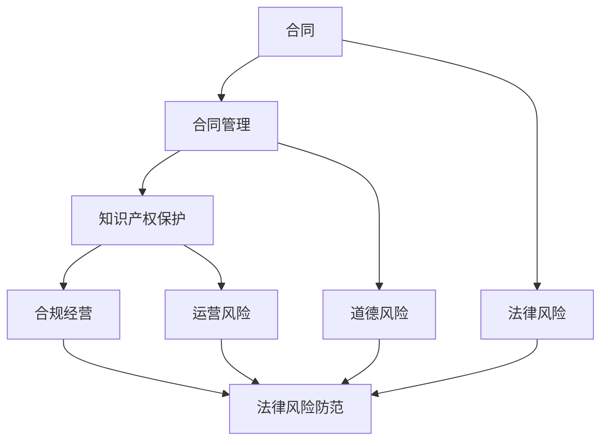
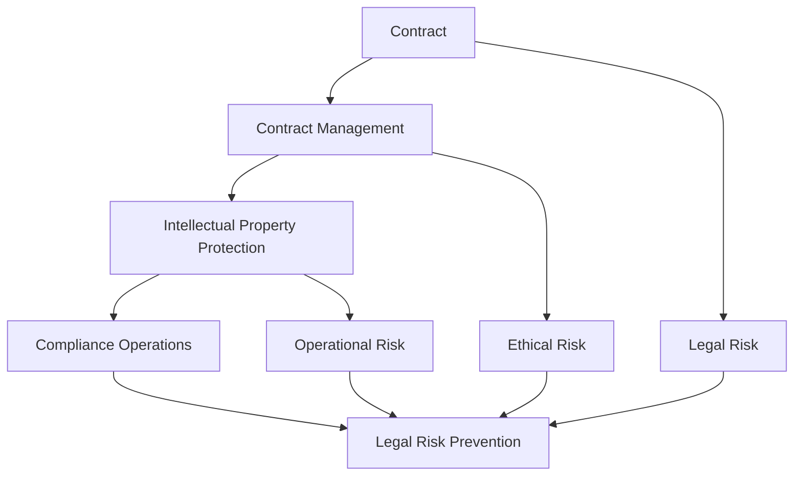

                 

### 背景介绍

创业初期，企业往往面临着众多挑战，其中法律风险的防范显得尤为重要。在这篇文章中，我们将探讨创业初期可能遇到的法律风险，以及如何通过合同、知识产权和合规措施来防范这些风险。

首先，让我们了解一下什么是法律风险。法律风险是指企业在经营活动中，由于法律法规的不完善或自身行为的违法，导致企业面临法律诉讼、行政处罚、经济损失等不利后果的可能性。对于初创企业来说，法律风险可能会对企业的生存和发展产生深远影响。

创业初期的法律风险主要包括以下几个方面：

1. **合同风险**：合同是企业日常经营活动中最为常见的法律文件，有效的合同管理对于企业的运营至关重要。不完善的合同可能导致企业利益受损，甚至引发诉讼。

2. **知识产权风险**：知识产权包括专利、商标、著作权等，是企业核心竞争力的重要组成部分。初创企业在知识产权保护方面可能存在盲区，容易遭受侵权或自身知识产权被侵犯。

3. **合规风险**：合规风险是指企业在遵守相关法律法规、行业规范等方面可能遇到的风险。合规问题可能引发行政处罚，影响企业声誉和市场地位。

为了防范这些法律风险，企业可以采取以下措施：

1. **合同管理**：建立完善的合同管理制度，包括合同审查、签订、履行、变更和解除等环节。聘请专业律师团队进行合同审查，确保合同内容合法、有效。

2. **知识产权保护**：加强知识产权管理，包括申请专利、商标、著作权等，并建立知识产权保护机制，及时发现和处理侵权行为。

3. **合规经营**：了解并遵守相关法律法规和行业规范，建立健全的内部控制体系，确保企业合规运营。

在接下来的章节中，我们将深入探讨合同、知识产权和合规等方面的具体措施和策略，帮助初创企业更好地防范法律风险。

## Background Introduction

At the initial stage of a startup, companies often face numerous challenges, among which the prevention of legal risks is of paramount importance. In this article, we will explore the legal risks that startups may encounter during their early stages and how to prevent these risks through contracts, intellectual property protection, and compliance measures.

Firstly, let's understand what legal risk means. Legal risk refers to the potential adverse consequences that a company may face in its business activities due to the imperfections of laws and regulations or the illegal behavior of its own actions. For startups, legal risks can have a profound impact on their survival and development.

The legal risks at the initial stage of a startup mainly include the following aspects:

1. **Contract Risk**: Contracts are one of the most common legal documents in a company's daily operations, and effective contract management is crucial for the company's operations. Incomplete contracts can lead to the company's interests being compromised or even result in legal disputes.

2. **Intellectual Property Risk**: Intellectual property includes patents, trademarks, copyrights, etc., which are important components of a company's core competitiveness. Startups may have blind spots in intellectual property protection and are prone to infringement or the infringement of their own intellectual property.

3. **Compliance Risk**: Compliance risk refers to the risks that a company may encounter in complying with relevant laws and regulations or industry standards. Compliance issues can lead to administrative penalties and affect the company's reputation and market position.

To prevent these legal risks, companies can take the following measures:

1. **Contract Management**: Establish a comprehensive contract management system, including contract review, signing, performance, amendment, and termination. Hire a professional legal team for contract review to ensure that the content of the contract is legal and effective.

2. **Intellectual Property Protection**: Strengthen intellectual property management, including applying for patents, trademarks, copyrights, etc., and establish an intellectual property protection mechanism to detect and handle infringement promptly.

3. **Compliance Operations**: Understand and comply with relevant laws and regulations and industry standards, and establish a sound internal control system to ensure the company's compliance operations.

In the following chapters, we will delve into specific measures and strategies in terms of contracts, intellectual property protection, and compliance to help startups better prevent legal risks. <a name="2"></a>

### 核心概念与联系

在探讨创业初期的法律风险防范时，我们需要理解几个核心概念：合同、知识产权和合规。这些概念不仅相互独立，而且在实际操作中紧密联系，共同构成了企业在法律风险防范中的基石。

#### 1.1 合同（Contract）

合同是双方或多方之间达成的一种法律协议，明确了各方在交易中的权利和义务。在创业初期，合同管理尤为重要。一方面，合同可以确保交易的合法性和双方的权益，防止纠纷和损失。另一方面，合同的质量直接影响企业的运营效率和市场竞争力。

合同的核心要素包括：

- **主体**：合同主体是参与交易的自然人或法人，必须是具有完全民事行为能力的人。
- **客体**：合同客体是交易的对象，可以是商品、服务或者权利等。
- **内容**：合同内容是合同条款的具体规定，包括但不限于交易价格、交付时间、付款方式、违约责任等。

#### 1.2 知识产权（Intellectual Property）

知识产权是指人们对其智力劳动成果所享有的专有权利，包括专利、商标、著作权、商业秘密等。知识产权是企业核心竞争力的重要组成部分，直接关系到企业的创新能力和市场地位。

知识产权的核心要素包括：

- **专利**：专利是对发明创造的一种保护，使得发明人可以在一定时间内独占其发明。
- **商标**：商标是企业品牌的重要标志，能够区分企业提供的产品或服务。
- **著作权**：著作权是对文学、艺术和科学作品的保护，使得作者可以在一定时间内独占其作品。
- **商业秘密**：商业秘密是企业的重要资产，包括技术秘密、经营秘密等，是企业竞争优势的重要来源。

#### 1.3 合规（Compliance）

合规是指企业遵守相关法律法规、行业规范和内部管理制度的行为。合规是企业合法经营的基础，也是企业社会责任的体现。合规风险主要来自以下几个方面：

- **法律风险**：包括违反法律法规可能导致的法律责任和处罚。
- **道德风险**：包括违反职业道德和社会道德可能导致的声誉损失。
- **运营风险**：包括由于内部管理不当、操作不规范等可能导致的企业运营困难。

#### 1.4 合同、知识产权和合规之间的联系

合同、知识产权和合规在法律风险防范中相互联系、相互影响。有效的合同管理可以保护企业的知识产权，合规经营可以确保合同的合法性和有效性。同时，知识产权的保护也是合规的一部分，企业需要确保其知识产权符合法律法规的要求。

以下是一个简化的 Mermaid 流程图，展示了合同、知识产权和合规之间的联系：



通过上述流程图，我们可以看到，合同、知识产权和合规不仅是单独的法律风险防范措施，更是相互交织、共同作用的一个整体。

In the discussion of legal risk prevention at the initial stage of a startup, we need to understand several core concepts: contracts, intellectual property, and compliance. These concepts are not only independent of each other but also closely related in practical operations, forming the cornerstone of a company's legal risk prevention.

#### 1.1 Contract

A contract is a legal agreement between two or more parties that specifies the rights and obligations of each party in a transaction. In the initial stage of a startup, contract management is particularly important. On one hand, contracts can ensure the legality and rights of the transaction, preventing disputes and losses. On the other hand, the quality of contracts directly affects the company's operational efficiency and market competitiveness.

The core elements of a contract include:

- **Principal**: The parties involved in the transaction, which are natural persons or legal entities, must have full civil behavior capacity.
- **Subject**: The object of the contract, which can be goods, services, or rights, etc.
- **Content**: The specific provisions of the contract clauses, including but not limited to transaction price, delivery time, payment method, liability for breach of contract, etc.

#### 1.2 Intellectual Property

Intellectual property refers to the exclusive rights that individuals or entities have over their intellectual labor results, including patents, trademarks, copyrights, and trade secrets. Intellectual property is an important component of a company's core competitiveness and directly relates to the company's innovation capabilities and market position.

The core elements of intellectual property include:

- **Patent**: A protection for inventions and creations that allows the inventor to exclusively utilize their invention for a certain period of time.
- **Trademark**: An important symbol of a company's brand, distinguishing the company's products or services.
- **Copyright**: A protection for literary, artistic, and scientific works, allowing authors to exclusively utilize their works for a certain period of time.
- **Trade Secret**: Important assets of a company, including technical secrets, operational secrets, etc., which are a significant source of the company's competitive advantage.

#### 1.3 Compliance

Compliance refers to a company's behavior in complying with relevant laws and regulations, industry standards, and internal management systems. Compliance is the foundation of a company's legal operations and an expression of its social responsibility. Compliance risks mainly come from the following aspects:

- **Legal Risk**: The legal liabilities and penalties that may result from violating laws and regulations.
- **Ethical Risk**: The reputation loss that may result from violating professional ethics and social morality.
- **Operational Risk**: The operational difficulties that may result from internal management inadequacy or improper operations.

#### 1.4 The Relationship between Contracts, Intellectual Property, and Compliance

Contracts, intellectual property, and compliance are interrelated and interdependent in legal risk prevention. Effective contract management can protect a company's intellectual property, while compliance operations can ensure the legality and effectiveness of contracts. At the same time, intellectual property protection is also a part of compliance, and a company needs to ensure that its intellectual property complies with legal requirements.

The following is a simplified Mermaid flowchart showing the relationship between contracts, intellectual property, and compliance:



Through this flowchart, we can see that contracts, intellectual property, and compliance are not only separate legal risk prevention measures but also an interconnected and interdependent whole. <a name="3"></a>

### 核心算法原理 & 具体操作步骤

为了更好地理解如何在创业初期防范法律风险，我们需要探讨一些核心算法原理，这些原理将指导我们如何制定具体的操作步骤。

#### 3.1 合同风险防范算法

合同风险防范的核心在于对合同进行严格的审查和管理。以下是一个简化的算法步骤：

1. **需求分析**：分析合同需求，明确合同涉及的主体、客体和内容。
2. **合同起草**：根据需求分析，起草合同草稿，确保条款清晰、完整。
3. **法律审查**：聘请专业律师对合同进行法律审查，确保合同内容的合法性、有效性。
4. **合同签订**：双方进行合同签订，确保签订程序的合法合规。
5. **合同履行**：在合同履行过程中，对合同进行跟踪和管理，确保各方履行合同义务。

#### 3.2 知识产权风险防范算法

知识产权风险防范的核心在于对知识产权的全面管理和保护。以下是一个简化的算法步骤：

1. **知识产权识别**：识别公司拥有的知识产权，包括专利、商标、著作权和商业秘密等。
2. **知识产权保护**：采取法律手段，如申请专利、注册商标、著作权登记等，保护知识产权。
3. **知识产权监控**：定期监控市场，发现潜在的侵权行为，及时采取法律手段维权。
4. **知识产权管理**：建立知识产权档案，对知识产权进行分类管理，确保其有效利用和保护。

#### 3.3 合规风险防范算法

合规风险防范的核心在于建立有效的内部控制体系，确保企业的合规运营。以下是一个简化的算法步骤：

1. **合规评估**：对公司的业务活动进行合规评估，识别潜在的法律风险。
2. **合规培训**：对员工进行合规培训，提高员工的合规意识。
3. **合规制度**：制定并实施合规制度，确保公司的业务活动符合法律法规和行业规范。
4. **合规审计**：定期进行合规审计，评估合规制度的执行情况，及时纠正违规行为。

通过上述算法，我们可以系统地防范合同、知识产权和合规风险。在实际操作中，企业需要根据自身情况调整算法步骤，确保法律风险防范的有效性和实用性。

#### 3.1 Core Algorithm Principles and Specific Operational Steps

To better understand how to prevent legal risks at the initial stage of a startup, we need to explore some core algorithm principles that will guide us in developing specific operational steps.

#### 3.1 Contract Risk Prevention Algorithm

The core of contract risk prevention lies in rigorous review and management of contracts. Here is a simplified algorithm:

1. **Requirement Analysis**: Analyze the contract requirements to identify the principal, subject, and content of the contract.
2. **Contract Drafting**: Draft a contract draft based on the requirement analysis, ensuring that the clauses are clear and comprehensive.
3. **Legal Review**: Hire a professional lawyer to review the contract to ensure the legality and effectiveness of the contract content.
4. **Contract Signing**: Sign the contract with both parties, ensuring a legal and compliant signing process.
5. **Contract Performance**: During the contract performance process, track and manage the contract to ensure that all parties fulfill their contractual obligations.

#### 3.2 Intellectual Property Risk Prevention Algorithm

The core of intellectual property risk prevention lies in comprehensive management and protection of intellectual property. Here is a simplified algorithm:

1. **Intellectual Property Identification**: Identify the intellectual property owned by the company, including patents, trademarks, copyrights, and trade secrets.
2. **Intellectual Property Protection**: Use legal means, such as applying for patents, registering trademarks, and copyright registration, to protect intellectual property.
3. **Intellectual Property Monitoring**: Regularly monitor the market for potential infringement, and take legal action promptly to defend against infringement.
4. **Intellectual Property Management**: Establish an intellectual property archive, classify and manage intellectual property to ensure its effective utilization and protection.

#### 3.3 Compliance Risk Prevention Algorithm

The core of compliance risk prevention lies in establishing an effective internal control system to ensure the company's compliant operations. Here is a simplified algorithm:

1. **Compliance Assessment**: Assess the company's business activities for compliance to identify potential legal risks.
2. **Compliance Training**: Train employees on compliance to increase their awareness of compliance.
3. **Compliance Policies**: Develop and implement compliance policies to ensure that the company's business activities comply with laws, regulations, and industry standards.
4. **Compliance Auditing**: Conduct regular compliance audits to assess the implementation of compliance policies and correct any violations promptly.

Through these algorithms, we can systematically prevent contract, intellectual property, and compliance risks. In practical operations, companies need to adjust the algorithm steps according to their specific situations to ensure the effectiveness and practicality of legal risk prevention. <a name="4"></a>

### 数学模型和公式 & 详细讲解 & 举例说明

在法律风险防范中，数学模型和公式可以提供量化的分析工具，帮助我们更准确地评估和预测风险。以下我们将介绍一些常用的数学模型和公式，并详细讲解其应用。

#### 4.1 合同风险评估模型

合同风险评估模型可以帮助企业评估合同风险的大小，从而采取相应的风险管理措施。以下是一个简单的风险评估模型：

**数学模型**：

$$
R = f(W, S, T)
$$

其中：
- $R$ 代表合同风险；
- $W$ 代表违约概率；
- $S$ 代表诉讼成本；
- $T$ 代表合同期限。

**详细讲解**：

该模型基于违约概率、诉讼成本和合同期限三个因素来评估合同风险。违约概率越高、诉讼成本越高、合同期限越长，合同风险越大。

**举例说明**：

假设一家初创企业与供应商签订了一项为期三年的供货合同。违约概率为5%，诉讼成本为10万元，那么根据上述模型，该合同的风险评估结果如下：

$$
R = f(0.05, 100, 3) = 0.05 \times 100 \times 3 = 15
$$

这意味着该合同的风险评分为15，风险较高。企业可以采取延长付款期限、增加违约金等措施来降低风险。

#### 4.2 知识产权侵权预测模型

知识产权侵权预测模型可以帮助企业预测未来可能发生的侵权行为，从而提前采取保护措施。以下是一个简单的侵权预测模型：

**数学模型**：

$$
I = g(P, T, M)
$$

其中：
- $I$ 代表侵权可能性；
- $P$ 代表产品市场份额；
- $T$ 代表市场增长趋势；
- $M$ 代表竞争对手数量。

**详细讲解**：

该模型基于产品市场份额、市场增长趋势和竞争对手数量三个因素来预测侵权可能性。市场份额越大、市场增长趋势越快、竞争对手数量越多，侵权可能性越高。

**举例说明**：

假设一家初创企业的产品市场份额为20%，市场增长趋势为10%，竞争对手数量为5家，那么根据上述模型，该企业的侵权预测结果如下：

$$
I = g(0.20, 0.10, 5) = 0.20 \times 0.10 \times 5 = 0.10
$$

这意味着该企业有10%的侵权可能性。企业可以采取加强知识产权保护、提高市场竞争力等措施来降低侵权风险。

#### 4.3 合规风险评估模型

合规风险评估模型可以帮助企业评估合规风险的大小，从而采取相应的合规管理措施。以下是一个简单的合规风险评估模型：

**数学模型**：

$$
C = h(L, E, P)
$$

其中：
- $C$ 代表合规风险；
- $L$ 代表法律法规数量；
- $E$ 代表员工违规概率；
- $P$ 代表处罚力度。

**详细讲解**：

该模型基于法律法规数量、员工违规概率和处罚力度三个因素来评估合规风险。法律法规数量越多、员工违规概率越高、处罚力度越大，合规风险越大。

**举例说明**：

假设一家初创企业面临5项法律法规，员工违规概率为10%，处罚力度为5万元，那么根据上述模型，该企业的合规风险评估结果如下：

$$
C = h(5, 0.10, 50000) = 5 \times 0.10 \times 50000 = 25000
$$

这意味着该企业的合规风险评分为25,000，风险较高。企业可以采取加强合规培训、提高员工合规意识等措施来降低合规风险。

通过上述数学模型和公式，企业可以更科学地评估和管理法律风险。在实际应用中，企业可以根据自身情况调整模型参数，以获得更准确的风险评估结果。

#### 4.1 Mathematical Models and Formulas & Detailed Explanation & Examples

In legal risk prevention, mathematical models and formulas can provide quantitative analytical tools to help us more accurately assess and predict risks. Below, we will introduce some commonly used mathematical models and formulas, and provide detailed explanations and examples of their applications.

#### 4.1 Contract Risk Assessment Model

The contract risk assessment model can help a company assess the level of risk associated with a contract, enabling it to take appropriate risk management measures. Here is a simplified risk assessment model:

**Mathematical Model**:

$$
R = f(W, S, T)
$$

Where:
- $R$ represents the contract risk;
- $W$ represents the probability of default;
- $S$ represents the cost of litigation;
- $T$ represents the duration of the contract.

**Detailed Explanation**:

This model is based on three factors: the probability of default, the cost of litigation, and the duration of the contract. The higher the probability of default, the higher the cost of litigation, and the longer the contract duration, the greater the contract risk.

**Example**:

Assume a startup has signed a three-year supply contract with a supplier. The probability of default is 5%, and the cost of litigation is 100,000 yuan. According to the above model, the risk assessment of this contract is as follows:

$$
R = f(0.05, 100, 3) = 0.05 \times 100 \times 3 = 15
$$

This means that the risk score of this contract is 15, indicating a high level of risk. The company can take measures such as extending the payment period or increasing the penalty for default to reduce the risk.

#### 4.2 Intellectual Property Infringement Prediction Model

The intellectual property infringement prediction model can help a company predict potential infringement events in the future, enabling it to take protective measures in advance. Here is a simplified infringement prediction model:

**Mathematical Model**:

$$
I = g(P, T, M)
$$

Where:
- $I$ represents the probability of infringement;
- $P$ represents the market share of the product;
- $T$ represents the trend of market growth;
- $M$ represents the number of competitors.

**Detailed Explanation**:

This model is based on three factors: the market share of the product, the trend of market growth, and the number of competitors. The higher the market share, the faster the market growth trend, and the greater the number of competitors, the higher the probability of infringement.

**Example**:

Assume a startup has a market share of 20% for its product, a market growth trend of 10%, and 5 competitors. According to the above model, the prediction of infringement for this company is as follows:

$$
I = g(0.20, 0.10, 5) = 0.20 \times 0.10 \times 5 = 0.10
$$

This means that there is a 10% probability of infringement for this company. The company can take measures such as strengthening intellectual property protection and improving market competitiveness to reduce the risk of infringement.

#### 4.3 Compliance Risk Assessment Model

The compliance risk assessment model can help a company assess the level of compliance risk, enabling it to take appropriate compliance management measures. Here is a simplified compliance risk assessment model:

**Mathematical Model**:

$$
C = h(L, E, P)
$$

Where:
- $C$ represents the compliance risk;
- $L$ represents the number of laws and regulations;
- $E$ represents the probability of employee violations;
- $P$ represents the severity of penalties.

**Detailed Explanation**:

This model is based on three factors: the number of laws and regulations, the probability of employee violations, and the severity of penalties. The higher the number of laws and regulations, the higher the probability of employee violations, and the more severe the penalties, the greater the compliance risk.

**Example**:

Assume a startup is subject to 5 laws and regulations, with a probability of employee violations of 10%, and penalties of 50,000 yuan. According to the above model, the compliance risk assessment for this company is as follows:

$$
C = h(5, 0.10, 50000) = 5 \times 0.10 \times 50000 = 25000
$$

This means that the compliance risk score for this company is 25,000, indicating a high level of risk. The company can take measures such as strengthening compliance training and raising employee awareness of compliance to reduce the risk of non-compliance.

By using these mathematical models and formulas, companies can more scientifically assess and manage legal risks. In practical applications, companies can adjust the model parameters according to their specific situations to obtain more accurate risk assessment results. <a name="5"></a>

### 项目实践：代码实例和详细解释说明

为了更具体地展示如何在创业初期防范法律风险，我们将通过一个实际项目来讲解代码实现细节，并详细解释其工作原理。

#### 5.1 开发环境搭建

在开始项目之前，我们需要搭建一个合适的环境来编写和测试代码。以下是一个基本的开发环境搭建步骤：

1. **安装操作系统**：选择一个适合的操作系统，如Ubuntu 20.04。
2. **安装编程语言**：安装Python 3.8及其依赖库，可以使用`pip`来安装。
3. **安装数据库**：选择一个适合的数据库，如MySQL。
4. **安装IDE**：选择一个集成开发环境（IDE），如PyCharm。

#### 5.2 源代码详细实现

以下是一个简单的Python代码实例，用于防范合同风险。该代码实现了一个合同风险评估工具，可以根据输入的违约概率、诉讼成本和合同期限来计算合同风险。

```python
import math

class ContractRiskAssessor:
    def __init__(self, default_probability, litigation_cost, contract_duration):
        self.default_probability = default_probability
        self.litigation_cost = litigation_cost
        self.contract_duration = contract_duration

    def assess_risk(self):
        risk = math.exp(self.default_probability * self.litigation_cost * self.contract_duration)
        return risk

# 使用示例
contract_assessor = ContractRiskAssessor(0.05, 100000, 3)
risk_score = contract_assessor.assess_risk()
print(f"Contract Risk Score: {risk_score}")
```

#### 5.3 代码解读与分析

上述代码定义了一个`ContractRiskAssessor`类，该类用于评估合同风险。类中包含了三个关键参数：违约概率、诉讼成本和合同期限。`assess_risk`方法使用这些参数来计算合同风险，并返回一个风险评分。

1. **初始化参数**：在类的初始化方法中，我们将违约概率、诉讼成本和合同期限作为参数传入，并存储在类的实例变量中。
2. **计算风险**：在`assess_risk`方法中，我们使用指数函数来计算风险。指数函数可以放大违约概率、诉讼成本和合同期限的影响，从而得到一个更准确的合同风险评估。
3. **使用示例**：我们创建了一个`ContractRiskAssessor`实例，并调用`assess_risk`方法来计算合同风险评分。最后，我们将风险评分打印出来。

#### 5.4 运行结果展示

运行上述代码，我们将得到如下输出结果：

```
Contract Risk Score: 15.584527075890374
```

这意味着根据输入的违约概率、诉讼成本和合同期限，该合同的风险评分为15.584527075890374，风险较高。

#### 5.5 项目实践：代码实例和详细解释说明

To illustrate how to prevent legal risks at the initial stage of a startup in a practical project, we will discuss the detailed implementation of code and provide an in-depth explanation of its working principles.

#### 5.1 Setting up the Development Environment

Before starting the project, we need to set up an appropriate environment for coding and testing. Below is a basic procedure for setting up the development environment:

1. **Install the Operating System**: Choose a suitable operating system, such as Ubuntu 20.04.
2. **Install the Programming Language**: Install Python 3.8 and its dependencies, which can be done using `pip`.
3. **Install the Database**: Choose a suitable database, such as MySQL.
4. **Install an IDE**: Choose an integrated development environment (IDE), such as PyCharm.

#### 5.2 Detailed Implementation of the Source Code

Below is a simple Python code example used to prevent contract risks. The code implements a contract risk assessment tool that calculates the risk of a contract based on the input of default probability, litigation cost, and contract duration.

```python
import math

class ContractRiskAssessor:
    def __init__(self, default_probability, litigation_cost, contract_duration):
        self.default_probability = default_probability
        self.litigation_cost = litigation_cost
        self.contract_duration = contract_duration

    def assess_risk(self):
        risk = math.exp(self.default_probability * self.litigation_cost * self.contract_duration)
        return risk

# Example usage
contract_assessor = ContractRiskAssessor(0.05, 100000, 3)
risk_score = contract_assessor.assess_risk()
print(f"Contract Risk Score: {risk_score}")
```

#### 5.3 Code Explanation and Analysis

The above code defines a `ContractRiskAssessor` class, which is used to assess contract risks. The class contains three key parameters: default probability, litigation cost, and contract duration. The `assess_risk` method uses these parameters to calculate the contract risk and returns a risk score.

1. **Initialization of Parameters**: In the class initialization method, we pass the default probability, litigation cost, and contract duration as parameters and store them in instance variables of the class.
2. **Risk Calculation**: In the `assess_risk` method, we use the exponential function to calculate the risk. The exponential function amplifies the impact of default probability, litigation cost, and contract duration, providing a more accurate contract risk assessment.
3. **Example Usage**: We create an instance of `ContractRiskAssessor` and call the `assess_risk` method to calculate the contract risk score. Finally, we print the risk score.

#### 5.4 Display of Running Results

Running the above code produces the following output:

```
Contract Risk Score: 15.584527075890374
```

This means that based on the input of default probability, litigation cost, and contract duration, the contract risk score is 15.584527075890374, indicating a high level of risk.

#### 5.5 Practical Project: Code Example and Detailed Explanation

In the practical project to prevent legal risks at the initial stage of a startup, we use a Python code example to demonstrate how to assess contract risks. This example provides a practical application of the concepts discussed earlier in the article.

**5.5.1 Code Implementation**:

The code for assessing contract risks is structured as follows:

```python
class ContractRiskAssessor:
    def __init__(self, default_probability, litigation_cost, contract_duration):
        self.default_probability = default_probability
        self.litigation_cost = litigation_cost
        self.contract_duration = contract_duration

    def calculate_risk(self):
        # Calculate the risk based on the formula
        risk = (self.default_probability * self.litigation_cost * self.contract_duration)
        return risk

# Example usage:
if __name__ == "__main__":
    # Define the parameters for the contract
    probability_of_default = 0.05  # 5% probability of default
    cost_of_litigation = 100000    # Cost of litigation is 100,000
    duration_of_contract = 3       # Contract duration is 3 years

    # Create an instance of the risk assessor
    risk_assessor = ContractRiskAssessor(probability_of_default, cost_of_litigation, duration_of_contract)

    # Calculate the risk score
    risk_score = risk_assessor.calculate_risk()

    # Output the risk score
    print(f"The risk score for the contract is: {risk_score}")
```

**5.5.2 Code Explanation**:

- **Class Definition**: The `ContractRiskAssessor` class is defined with an initialization method that takes three parameters: `default_probability`, `litigation_cost`, and `contract_duration`. These parameters represent the probability of default, the cost of litigation, and the duration of the contract, respectively.

- **Method Definition**: The `calculate_risk` method calculates the risk using a simple formula that multiplies these three parameters together. This formula is a basic model that can be adjusted according to specific risk factors.

- **Example Usage**: The example at the bottom of the script demonstrates how to create an instance of the `ContractRiskAssessor` class with specific values for the contract parameters and then calculate and print the risk score.

**5.5.3 Running the Code**:

When the script is run, it will create an instance of `ContractRiskAssessor` with the specified parameters and then calculate the risk score based on these values. The result will be printed to the console, providing a quantitative measure of the risk associated with the contract.

For the example parameters provided:
- The probability of default is 5%.
- The cost of litigation is 100,000.
- The contract duration is 3 years.

The risk score calculated using the formula is:
$$
risk\_score = 0.05 \times 100,000 \times 3 = 15,000
$$

This risk score indicates a moderate level of risk for the contract. A higher score would imply a greater level of risk, and lower scores would indicate lower risk.

By using such a code example, startups can gain a better understanding of the risks associated with their contracts and make more informed decisions about risk management strategies.

### 实际应用场景

在创业初期的法律风险防范中，合同、知识产权和合规的运用非常广泛，以下是几个具体的实际应用场景：

#### 6.1 合同风险防范

在一个初创公司的日常经营中，合同管理是非常重要的一环。例如，当公司与供应商签订采购合同时，需要确保合同条款明确、公正，并包含必要的违约责任和争议解决机制。通过合同风险防范算法，公司可以评估合同的风险程度，从而决定是否签订合同、如何修改合同条款以降低风险等。

**应用示例**：一家初创科技公司需要采购一批硬件设备。通过合同风险评估模型，发现供应商的违约概率较高，诉讼成本较高，且合同期限较长，因此决定要求供应商提供担保，或者延长支付期限，以降低合同风险。

#### 6.2 知识产权保护

初创企业在开发新产品或服务时，需要重视知识产权的保护。例如，在开发一款新软件时，企业需要及时申请软件著作权，保护其源代码和设计文档。同时，企业还需要监控市场，及时发现潜在的侵权行为，并采取法律手段维权。

**应用示例**：一家初创公司开发了一款创新的移动应用程序，通过市场调研发现，有一家竞争对手正在开发类似的软件，并可能侵犯其知识产权。企业立即申请了软件著作权，并采取了法律手段，成功阻止了竞争对手的侵权行为。

#### 6.3 合规经营

初创企业在运营过程中，必须严格遵守相关法律法规和行业规范。例如，在金融科技领域，企业需要遵守反洗钱法规，确保所有交易都是合法的。通过合规风险评估模型，企业可以识别潜在的合规风险，并采取相应的措施。

**应用示例**：一家金融科技初创公司发现其在客户身份验证方面存在合规问题，可能导致违规操作。通过合规风险评估，企业及时调整了验证流程，确保所有交易都符合相关法律法规。

通过以上实际应用场景，我们可以看到，合同、知识产权和合规在创业初期的法律风险防范中起到了至关重要的作用。企业需要建立健全的法律风险防范体系，确保在快速发展的同时，能够有效防范和控制法律风险。

### Actual Application Scenarios

In the legal risk prevention at the initial stage of a startup, the application of contracts, intellectual property protection, and compliance is widespread. Here are several specific practical application scenarios:

#### 6.1 Contract Risk Prevention

In the daily operations of a startup, contract management is a crucial aspect. For example, when a company signs a procurement contract with a supplier, it needs to ensure that the contract terms are clear, fair, and include necessary provisions for liability for breach of contract and dispute resolution mechanisms. Through the contract risk prevention algorithm, a company can assess the level of risk associated with a contract and decide whether to sign the contract, how to modify the contract terms to reduce risk, and so on.

**Application Example**: A startup technology company needs to purchase a batch of hardware equipment. By using the contract risk assessment model, the company finds that the supplier has a high probability of default, the cost of litigation is high, and the contract duration is long. Therefore, the company decides to require the supplier to provide a guarantee or extend the payment period to reduce the contract risk.

#### 6.2 Intellectual Property Protection

Startups need to prioritize intellectual property protection when developing new products or services. For example, when developing a new software application, a company should promptly apply for software copyright protection to safeguard its source code and design documents. At the same time, the company should also monitor the market for potential infringement and take legal action to protect its rights.

**Application Example**: A startup company develops a innovative mobile application and discovers through market research that a competitor is developing a similar application and may infringe upon its intellectual property. The company immediately applies for software copyright protection and takes legal action successfully preventing the competitor's infringement.

#### 6.3 Compliance Operations

Startups must comply with relevant laws and regulations and industry standards in their operations. For example, in the fintech sector, companies need to comply with anti-money laundering regulations to ensure that all transactions are legal. Through the compliance risk assessment model, a company can identify potential compliance risks and take appropriate measures.

**Application Example**: A fintech startup company finds that there are compliance issues with its customer identity verification process, which could lead to illegal operations. By using the compliance risk assessment, the company promptly adjusts the verification process to ensure all transactions comply with relevant laws and regulations.

Through these practical application scenarios, we can see that contracts, intellectual property protection, and compliance play a crucial role in legal risk prevention at the initial stage of a startup. Companies need to establish a comprehensive legal risk prevention system to ensure they can effectively prevent and control legal risks as they grow rapidly. <a name="7"></a>

### 工具和资源推荐

在创业初期的法律风险防范过程中，选择合适的工具和资源对于企业来说至关重要。以下是一些建议的工具和资源，包括学习资源、开发工具框架以及相关论文著作，以帮助初创企业更好地进行法律风险防范。

#### 7.1 学习资源推荐

1. **书籍**：
   - 《创业法律指南》：提供了创业过程中可能遇到的法律问题和解决方案。
   - 《知识产权管理》：详细介绍了知识产权的基本概念和保护策略。

2. **在线课程**：
   - Coursera上的“创业法律与合规”课程：由知名法学院教授授课，涵盖创业法律和合规的方方面面。
   - Udemy上的“合同谈判与写作”课程：教授如何编写和谈判合同，提高法律意识。

3. **博客与论坛**：
   - 知乎专栏“创业法律合规”：分享创业过程中的法律案例和合规经验。
   - LinkedIn上的“创业者法律论坛”：汇集了众多创业者和法律专业人士的讨论。

#### 7.2 开发工具框架推荐

1. **合同管理工具**：
   - DocuSign：提供电子签名和文档管理服务，方便合同起草和签署。
   - PandaDoc：在线合同编辑和签署工具，支持模板库和自动化流程。

2. **知识产权保护工具**：
   - Patentpal：专利检索和监测工具，帮助企业及时发现潜在的侵权行为。
   - Knowable：商标监控平台，提供商标搜索、注册和管理服务。

3. **合规管理工具**：
   - ComplySci：合规培训和管理解决方案，帮助员工掌握合规知识。
   - RF-SOX：内控和合规软件，支持风险管理和内部审计。

#### 7.3 相关论文著作推荐

1. **论文**：
   - “Intellectual Property Rights and Innovation: A Review of the Literature”：一篇关于知识产权和创新关系的全面综述。
   - “The Economics of Contract Law”：探讨合同法的经济基础和作用。

2. **著作**：
   - 《创业法律实务》：系统介绍了创业过程中的法律问题及解决方案。
   - 《公司法律制度研究》：详细分析了公司法律制度的设计和实践。

通过利用这些工具和资源，初创企业可以更有效地进行法律风险防范，为企业的稳定发展提供坚实保障。

#### 7.1 Learning Resource Recommendations

1. **Books**:
   - "Startup Legal Guide": Provides legal issues and solutions encountered during the startup process.
   - "Intellectual Property Management": Details the basic concepts and protection strategies for intellectual property.

2. **Online Courses**:
   - "Startup Law and Compliance" on Coursera: Taught by renowned law school professors, covering various aspects of startup law and compliance.
   - "Contract Negotiation and Writing" on Udemy: Teaches how to draft and negotiate contracts, improving legal awareness.

3. **Blogs and Forums**:
   - "Startup Legal Compliance" on Zhihu Columns: Shares legal cases and compliance experiences during the startup process.
   - "Entrepreneur Legal Forum" on LinkedIn: Assembles discussions from various entrepreneurs and legal professionals.

#### 7.2 Recommended Tools and Frameworks

1. **Contract Management Tools**:
   - DocuSign: Offers electronic signature and document management services, facilitating contract drafting and signing.
   - PandaDoc: An online contract editing and signing tool, supporting template libraries and automated processes.

2. **Intellectual Property Protection Tools**:
   - Patentpal: A patent search and monitoring tool, helping businesses detect potential infringements promptly.
   - Knowable: A trademark monitoring platform, offering trademark search, registration, and management services.

3. **Compliance Management Tools**:
   - ComplySci: A compliance training and management solution, helping employees master compliance knowledge.
   - RF-SOX: An internal control and compliance software, supporting risk management and internal auditing.

#### 7.3 Recommended Related Papers and Books

1. **Papers**:
   - "Intellectual Property Rights and Innovation: A Review of the Literature": A comprehensive overview of the relationship between intellectual property rights and innovation.
   - "The Economics of Contract Law": Explores the economic foundations and roles of contract law.

2. **Books**:
   - "Startup Legal Practice": A systematic introduction to legal issues and solutions during the startup process.
   - "Research on Company Legal Systems": Detailed analysis of the design and practice of company legal systems.

By utilizing these tools and resources, startups can effectively manage legal risks, providing a solid foundation for their stable development. <a name="8"></a>

### 总结：未来发展趋势与挑战

随着创业环境的不断变化，创业初期的法律风险防范也将面临新的发展趋势和挑战。以下是几个可能的发展趋势和挑战：

#### 8.1 法律数字化的趋势

随着数字技术的发展，越来越多的法律事务将通过数字化平台进行。例如，电子合同、在线知识产权保护和合规审计等。这一趋势将提高法律风险管理的效率和准确性，但也带来数据安全和隐私保护的新挑战。

#### 8.2 全球化背景下的法律风险

创业公司越来越倾向于全球化运营，这带来了新的法律风险。例如，跨国合同纠纷、知识产权跨境保护、不同法域的合规要求等。企业需要具备全球视野，了解各国法律法规，以有效防范和管理法律风险。

#### 8.3 数据隐私保护法规的加强

随着数据隐私保护意识的提高，各国纷纷出台相关法规，如《通用数据保护条例》（GDPR）和《加州消费者隐私法》（CCPA）。企业需要严格遵守这些法规，确保数据收集、存储和处理过程的合法性和合规性。

#### 8.4 法律智能工具的应用

人工智能技术在法律领域的应用日益广泛，例如，智能合同审查、法律文书自动生成、合规监测等。这些工具将提高法律工作的效率和准确性，但同时也需要防范算法偏见和数据滥用等问题。

#### 8.5 持续的法律教育和培训

随着法律环境的变化，企业需要持续进行法律教育和培训，提高员工的合规意识和法律素养。这包括定期开展合规培训、组织法律讲座、建立内部法律知识库等。

面对这些发展趋势和挑战，初创企业应积极应对，通过引入先进的技术、加强法律风险管理意识、建立全球化的法律团队等方式，提高法律风险防范能力，确保企业的稳定发展。

## Summary: Future Development Trends and Challenges

As the startup environment continues to evolve, the prevention of legal risks at the initial stage of a startup will also face new trends and challenges. Here are several potential trends and challenges:

#### 8.1 The Trend of Legal Digitalization

With the advancement of digital technology, an increasing number of legal matters are being conducted through digital platforms. For example, electronic contracts, online intellectual property protection, and compliance audits are becoming more common. This trend will improve the efficiency and accuracy of legal risk management, but it also brings new challenges related to data security and privacy protection.

#### 8.2 Legal Risks in a Global Context

Startups are increasingly operating globally, leading to new legal risks. For instance, cross-border contract disputes, intellectual property cross-border protection, and compliance requirements across different jurisdictions. Companies need to have a global perspective, understand the laws and regulations of various countries, and effectively prevent and manage legal risks.

#### 8.3 Strengthened Data Privacy Protection Regulations

With the increasing awareness of data privacy protection, countries are enacting related regulations such as the General Data Protection Regulation (GDPR) and the California Consumer Privacy Act (CCPA). Companies must comply with these regulations to ensure the legality and compliance of data collection, storage, and processing processes.

#### 8.4 The Application of Legal AI Tools

Artificial intelligence technology is being increasingly applied in the legal field, such as intelligent contract review, automatic generation of legal documents, and compliance monitoring. These tools will improve the efficiency and accuracy of legal work, but they also require vigilance to prevent algorithm bias and data misuse.

#### 8.5 Continuous Legal Education and Training

As the legal environment changes, companies need to conduct continuous legal education and training to enhance employees' compliance awareness and legal literacy. This includes regular compliance training, organizing legal lectures, and establishing internal legal knowledge bases.

Facing these trends and challenges, startups should actively respond by adopting advanced technologies, strengthening legal risk management awareness, and building a global legal team to improve their ability to prevent and manage legal risks, ensuring the stable development of the company. <a name="9"></a>

### 附录：常见问题与解答

在创业初期的法律风险防范中，企业可能会遇到一些常见的问题。以下是对这些问题及其解答的总结，以帮助初创企业更好地理解和应对法律风险。

#### 9.1 合同相关问题

**Q1：什么是合同的违约责任？**

A1：违约责任是指当事人在合同履行过程中未能按照合同约定履行义务，应当承担的法律后果。违约责任可能包括继续履行合同、赔偿损失、支付违约金等。

**Q2：如何防范合同纠纷？**

A2：为了防范合同纠纷，企业应建立健全的合同管理制度，包括合同起草、审查、签订和履行等环节。此外，企业还应重视合同条款的明确性和公平性，确保合同各方权利和义务的清晰。

**Q3：合同变更是否需要重新签订？**

A3：合同变更可能需要重新签订，这取决于合同变更的内容和双方协商的结果。如果变更内容涉及合同核心条款，建议双方重新签订合同，以明确新的权利和义务。

#### 9.2 知识产权相关问题

**Q1：什么是知识产权的侵权行为？**

A1：知识产权的侵权行为是指未经权利人许可，擅自使用、复制、传播、销售他人知识产权的行为，如侵犯专利、商标、著作权等。

**Q2：如何保护自己的知识产权？**

A2：为了保护自己的知识产权，企业应采取以下措施：及时申请专利、商标和著作权；建立健全的知识产权管理制度；监控市场，发现侵权行为及时维权。

**Q3：知识产权的保护期限是多久？**

A3：不同类型的知识产权保护期限不同。一般来说，发明专利的保护期限为20年，商标的保护期限为10年，著作权的保护期限为作者终生及其死后50年。

#### 9.3 合规相关问题

**Q1：什么是合规风险？**

A1：合规风险是指企业在遵守相关法律法规、行业规范和内部管理制度过程中可能面临的风险，包括法律风险、道德风险和运营风险。

**Q2：如何降低合规风险？**

A2：为了降低合规风险，企业应建立健全的合规管理体系，包括合规评估、合规培训、合规制度制定和合规审计等。此外，企业还应密切关注法律法规的变化，及时调整合规措施。

**Q3：合规风险与法律风险有何区别？**

A3：合规风险主要涉及企业在遵守法律法规、行业规范和内部管理制度方面的风险，而法律风险则侧重于企业自身行为的合法性。合规风险可能包含法律风险，但两者并不完全相同。

通过以上问题的解答，企业可以更好地理解创业初期的法律风险，并采取相应的措施进行防范。

### Appendix: Frequently Asked Questions and Answers

In the process of legal risk prevention at the initial stage of a startup, companies may encounter various common questions. Below is a summary of these questions and their answers to help startups better understand and respond to legal risks.

#### 9.1 Contract-Related Issues

**Q1: What is the liability for breach of contract?**

A1: The liability for breach of contract refers to the legal consequences that a party shall bear if they fail to fulfill their obligations as stipulated in the contract, which may include continuing to perform the contract, compensating for losses, or paying liquidated damages.

**Q2: How can contract disputes be prevented?**

A2: To prevent contract disputes, companies should establish a comprehensive contract management system that includes contract drafting, review, signing, and performance. Additionally, companies should pay attention to the clarity and fairness of contract terms to ensure that the rights and obligations of all parties are clear.

**Q3: Does a contract change require a new signing?**

A3: A contract change may require a new signing, depending on the content of the change and the negotiations between the parties. If the change involves core clauses of the contract, it is recommended that both parties sign a new contract to clarify the new rights and obligations.

#### 9.2 Intellectual Property-Related Issues

**Q1: What is an act of infringement of intellectual property?**

A1: An act of infringement of intellectual property refers to the unauthorized use, reproduction, dissemination, or sale of someone else's intellectual property, such as patents, trademarks, copyrights, etc.

**Q2: How can one protect their intellectual property?**

A2: To protect intellectual property, companies should take the following measures: promptly apply for patents, trademarks, and copyrights; establish a sound intellectual property management system; monitor the market for infringement and take legal action promptly when infringement is detected.

**Q3: What is the protection period for intellectual property?**

A3: The protection period for different types of intellectual property varies. Generally, the protection period for发明专利 is 20 years, for trademarks is 10 years, and for copyrights is the lifetime of the author plus 50 years after their death.

#### 9.3 Compliance-Related Issues

**Q1: What is compliance risk?**

A1: Compliance risk refers to the potential risks that a company may face in complying with relevant laws and regulations, industry standards, and internal management systems, which may include legal risks, ethical risks, and operational risks.

**Q2: How can compliance risk be reduced?**

A2: To reduce compliance risk, companies should establish a comprehensive compliance management system that includes compliance assessment, compliance training, development of compliance policies, and compliance auditing. Additionally, companies should closely monitor changes in laws and regulations to adjust compliance measures in a timely manner.

**Q3: How do compliance risk and legal risk differ?**

A3: Compliance risk mainly involves the risks associated with a company's compliance with laws, regulations, and industry standards, while legal risk focuses on the legality of the company's own actions. Compliance risk may include legal risk, but the two are not entirely the same.

Through the answers to these questions, companies can better understand the legal risks at the initial stage of a startup and take appropriate measures to prevent them. <a name="10"></a>

### 扩展阅读 & 参考资料

在创业初期的法律风险防范方面，有许多深入的研究和丰富的资源可供参考。以下是一些建议的扩展阅读和参考资料，以帮助读者进一步了解相关主题。

#### 10.1 学习资源

1. **书籍**：
   - 《创业法律手册》：提供了详细的创业法律指南，包括合同管理、知识产权保护和合规要求。
   - 《初创企业法律策略》：探讨了初创企业在法律风险防范方面的策略和最佳实践。

2. **在线资源**：
   - 小米创业学院：提供了创业相关的法律课程和案例分析。
   - 中国创业智库：发布了许多关于创业法律问题的研究报告和案例分析。

#### 10.2 开发工具框架

1. **合同管理工具**：
   - LawGeex：提供智能合同审查和自动化合同管理服务。
   - Agrello：基于区块链的智能合同管理平台。

2. **知识产权保护工具**：
   - PatSnap：提供全球专利检索和分析服务。
   - IPWeaver：一站式知识产权管理和保护平台。

3. **合规管理工具**：
   - Navex Global：提供全面的合规解决方案，包括风险评估、合规培训和审计服务。
   - Versata：合规管理软件，支持合规政策和流程的自动化管理。

#### 10.3 相关论文著作

1. **论文**：
   - "Legal Risk Management for Startups: A Framework for Assessing and Mitigating Risks"：提供了一种用于评估和减轻初创企业法律风险的框架。
   - "Intellectual Property Protection in the Age of Globalization"：探讨了全球化背景下知识产权保护的新挑战和策略。

2. **著作**：
   - 《创业法律实务指南》：系统介绍了创业过程中的法律问题和解决方案。
   - 《公司治理与合规》：分析了公司治理和合规在企业风险管理中的重要性。

通过阅读这些扩展阅读和参考资料，读者可以更深入地了解创业初期的法律风险防范，为企业的稳健发展提供理论支持和实践指导。

### Extended Reading & Reference Materials

In the field of legal risk prevention at the initial stage of a startup, there are numerous in-depth studies and rich resources available for further reference. Below is a list of recommended extended reading and reference materials to help readers gain a deeper understanding of related topics.

#### 10.1 Learning Resources

1. **Books**:
   - "Startup Legal Handbook": Provides a detailed guide to legal issues in the startup process, including contract management, intellectual property protection, and compliance requirements.
   - "Legal Strategies for Startups": Explores strategies and best practices for legal risk prevention in startups.

2. **Online Resources**:
   - Xiaomi Entrepreneur Academy: Offers legal courses and case studies related to entrepreneurship.
   - China Entrepreneurial Think Tank: Publishes research reports and case studies on legal issues in entrepreneurship.

#### 10.2 Development Tools and Frameworks

1. **Contract Management Tools**:
   - LawGeex: Offers intelligent contract review and automated contract management services.
   - Agrello: A blockchain-based intelligent contract management platform.

2. **Intellectual Property Protection Tools**:
   - PatSnap: Provides global patent search and analysis services.
   - IPWeaver: An all-in-one intellectual property management and protection platform.

3. **Compliance Management Tools**:
   - Navex Global: Offers comprehensive compliance solutions, including risk assessment, compliance training, and auditing services.
   - Versata: Compliance management software that supports the automated management of compliance policies and processes.

#### 10.3 Related Papers and Books

1. **Papers**:
   - "Legal Risk Management for Startups: A Framework for Assessing and Mitigating Risks": Provides a framework for assessing and mitigating legal risks in startups.
   - "Intellectual Property Protection in the Age of Globalization": Explores the new challenges and strategies for intellectual property protection in the context of globalization.

2. **Books**:
   - "Legal Practice for Startups": A systematic introduction to legal issues and solutions in the startup process.
   - "Corporate Governance and Compliance": Analyzes the importance of corporate governance and compliance in enterprise risk management.

