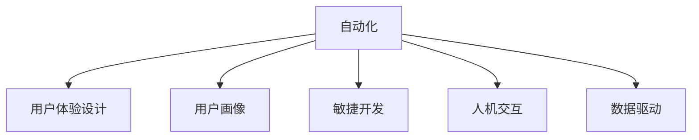
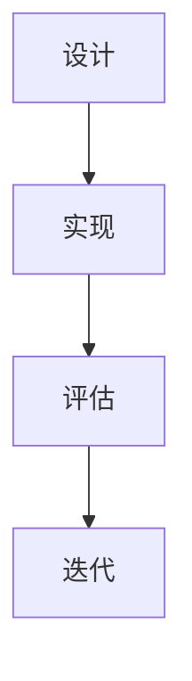

                 

# 自动化创业中的用户体验设计思维

> 关键词：自动化,用户体验设计,创业,思维模型,人机交互,用户中心,数据驱动,敏捷迭代,测试反馈,用户画像

## 1. 背景介绍

### 1.1 问题由来
在当今快速变化的商业环境中，自动化技术已成为推动企业创新、提升生产效率的关键力量。然而，如何设计用户友好的自动化系统，成为众多创业公司面临的首要挑战。特别是在自动化创业领域，用户往往对系统的易用性和功能性有着更高要求。

用户体验设计（User Experience Design，UX设计）作为一种以用户为中心的设计方法，强调从用户的角度出发，设计出能够解决实际问题的产品和服务。这种设计思维在自动化创业中尤为重要，可以帮助企业在激烈的市场竞争中脱颖而出。

### 1.2 问题核心关键点
用户体验设计在自动化创业中的应用主要体现在以下几个方面：

- **用户中心**：从用户的角度出发，理解他们的需求和痛点，设计出能够真正满足用户需求的自动化系统。
- **人机交互**：通过直观、易用的界面设计，减少用户操作复杂度，提升系统的易用性和用户体验。
- **数据驱动**：通过数据分析和用户反馈，不断迭代优化产品功能，确保系统能够持续满足用户需求。
- **敏捷迭代**：采用敏捷开发方法，快速响应市场变化和用户需求，确保产品始终保持竞争力。
- **测试反馈**：通过不断的测试和反馈，快速发现并解决系统问题，提升系统稳定性和可靠性。

这些关键点共同构成了用户体验设计在自动化创业中的核心价值。通过深入理解这些关键点，可以更好地把握用户体验设计的精髓，为企业的自动化创业之路铺平道路。

## 2. 核心概念与联系

### 2.1 核心概念概述

为更好地理解用户体验设计在自动化创业中的实践应用，本节将介绍几个密切相关的核心概念：

- **自动化（Automation）**：通过软件、硬件或流程自动化，减少人工干预，提高效率和准确性。
- **用户体验设计（User Experience Design）**：一种以用户为中心的设计方法，强调通过设计来提升用户满意度和用户体验。
- **用户画像（User Persona）**：构建基于真实用户特征和行为的用户模型，用于指导产品设计和优化。
- **敏捷开发（Agile Development）**：一种快速迭代的软件开发方法，强调快速响应变化和用户反馈，持续改进产品。
- **人机交互（Human-Computer Interaction, HCI）**：研究人机交互的心理学、社会学和技术学，目标是设计更高效、易用的人机界面。
- **数据驱动（Data-Driven）**：利用数据和统计分析进行决策，确保设计决策的科学性和可靠性。

这些核心概念之间的逻辑关系可以通过以下Mermaid流程图来展示：



这个流程图展示了这个框架下的主要概念及其关系：

1. 自动化是整个系统的核心，其他概念都是围绕它展开。
2. 用户体验设计是自动化系统设计的重要组成部分。
3. 用户画像和敏捷开发是用户体验设计的基础。
4. 人机交互和数据驱动是实现用户体验设计的技术支撑。

## 3. 核心算法原理 & 具体操作步骤

### 3.1 算法原理概述

在自动化创业中，用户体验设计遵循“用户中心”的原则，强调从用户需求出发，设计出能够满足用户期望的系统。这一过程可以抽象为一个系统的设计、实现、评估和迭代循环，如图：



设计阶段，通过用户研究、用户画像构建等方法，理解用户需求和行为模式。实现阶段，将设计方案转化为可操作的系统。评估阶段，通过用户测试、数据反馈等方法，评估系统效果。最后，根据评估结果，进行迭代优化，不断提升系统性能。

这一过程的核心在于用户中心的设计思维，即始终将用户需求和体验放在首位，通过不断的测试和反馈，逐步优化产品，确保系统能够真正满足用户需求。

### 3.2 算法步骤详解

基于上述原理，用户体验设计在自动化创业中的应用可以进一步细化为以下步骤：

**Step 1: 用户研究**
- 通过问卷调查、访谈、焦点小组等方式，收集用户需求和痛点数据。
- 利用用户画像工具，构建基于真实用户特征和行为的用户模型。
- 分析用户数据，找出共性问题和个性化需求。

**Step 2: 设计方案**
- 基于用户画像，设计出能够满足用户需求的设计方案。
- 绘制原型图和流程图，详细描述系统功能和用户交互流程。
- 考虑可访问性、易用性和可扩展性，确保设计方案符合用户期望。

**Step 3: 实现和测试**
- 根据设计方案，进行系统实现。
- 使用敏捷开发方法，分阶段迭代开发，快速响应用户反馈。
- 进行用户测试，收集用户使用反馈，发现和解决问题。

**Step 4: 评估和优化**
- 通过数据分析和用户反馈，评估系统性能和用户满意度。
- 分析评估结果，找出系统瓶颈和改进点。
- 根据评估结果，进行系统优化，提升用户满意度。

**Step 5: 发布和迭代**
- 将优化后的系统发布到生产环境，进行大规模用户测试。
- 根据用户反馈和市场变化，持续迭代优化系统功能。
- 定期进行系统评估，确保系统始终保持竞争力。

以上是用户体验设计在自动化创业中应用的详细步骤。在实际应用中，还需要根据具体任务和场景进行优化和调整，以确保最终产品能够真正满足用户需求。

### 3.3 算法优缺点

用户体验设计在自动化创业中的应用具有以下优点：

1. **提升用户体验**：通过用户中心的设计思维，确保系统能够真正满足用户需求，提升用户满意度和粘性。
2. **减少开发成本**：通过敏捷开发和迭代优化，快速响应市场变化和用户需求，减少无效开发成本。
3. **增强系统可用性**：通过人机交互设计和用户测试，减少用户操作复杂度，提升系统易用性和可用性。
4. **提升数据驱动决策**：通过数据分析和用户反馈，确保设计决策的科学性和可靠性。

然而，用户体验设计也存在一些局限性：

1. **资源消耗**：用户体验设计需要投入大量时间和资源进行用户研究和设计，短期内可能带来较高的开发成本。
2. **用户差异性**：不同用户群体的需求和行为模式存在差异，用户体验设计需要综合考虑，难以完全覆盖所有用户。
3. **反馈迭代周期**：用户体验设计的反馈迭代过程较长，可能需要多轮测试和优化，才能达到理想的系统效果。
4. **复杂性管理**：用户体验设计涉及多个学科知识，如心理学、社会学、技术学等，需要综合运用各种方法进行系统设计。

尽管存在这些局限性，用户体验设计仍是自动化创业中不可或缺的重要组成部分。通过系统应用用户体验设计方法，可以有效提升系统性能和用户满意度，为企业的长期发展奠定坚实基础。

### 3.4 算法应用领域

用户体验设计在自动化创业中的应用非常广泛，覆盖了自动化系统的各个方面，例如：

- **自动化工具和平台**：设计能够满足用户需求的自动化工具和平台，提升工作效率和准确性。
- **数据分析和处理系统**：设计能够满足用户数据分析需求的数据处理系统，提供精准的数据分析和报告功能。
- **客户服务自动化**：设计能够提升客户服务体验的自动化系统，如智能客服、自动回复等。
- **供应链和物流自动化**：设计能够满足供应链和物流需求的自动化系统，提升物流效率和准确性。
- **自动化办公和协作工具**：设计能够满足用户协作和办公需求的自动化工具，提升办公效率和协作效果。

除了这些常见应用场景外，用户体验设计还广泛应用于各种自动化系统的设计中，为企业的自动化创业提供了全方位的支持。

## 4. 数学模型和公式 & 详细讲解  
### 4.1 数学模型构建

用户体验设计的核心在于设计方案的设计和评估，可以通过数学模型和公式进行形式化描述。

**设计方案的构建**：

设计方案可以用系统功能图和用户交互图来表示。系统功能图描述了系统的各个功能模块及其相互关系，用户交互图描述了用户与系统之间的交互流程。

**系统性能的评估**：

系统性能可以通过用户满意度、系统效率和可用性等指标进行评估。这些指标可以表示为用户满意度评分、系统响应时间、错误率等，通过数学公式进行计算和分析。

### 4.2 公式推导过程

以下以用户满意度评分为例，推导其计算公式。

假设用户满意度评分由以下三个指标构成：系统响应时间 $T$、系统错误率 $E$、用户操作复杂度 $C$。则用户满意度评分 $S$ 可以表示为：

$$
S = \alpha T + \beta E + \gamma C
$$

其中 $\alpha, \beta, \gamma$ 为权重系数，表示各指标对用户满意度的影响程度。

通过上述公式，可以对系统性能进行量化评估，找出影响用户满意度的关键因素，指导设计优化。

### 4.3 案例分析与讲解

**案例1：智能客服系统的设计**

智能客服系统旨在提升客户服务体验，减少人工客服的工作量。其设计过程如下：

1. 用户研究：通过问卷调查，收集客户常见问题和反馈。
2. 用户画像：构建基于客户特征和行为的用户画像。
3. 设计方案：设计能够满足客户需求的智能客服对话流程。
4. 实现和测试：使用敏捷开发方法，分阶段迭代开发和测试。
5. 评估和优化：通过数据分析和用户反馈，评估系统性能和用户满意度。
6. 发布和迭代：发布优化后的系统，持续收集用户反馈，进行迭代优化。

通过以上步骤，智能客服系统能够实现高效、准确、人性化的客户服务，提升客户满意度和企业竞争力。

**案例2：自动化办公工具的设计**

自动化办公工具旨在提升员工办公效率，减少重复性工作。其设计过程如下：

1. 用户研究：通过访谈和焦点小组，了解员工办公需求和痛点。
2. 用户画像：构建基于员工特征和行为的用户画像。
3. 设计方案：设计能够满足员工需求的功能模块和用户交互流程。
4. 实现和测试：使用敏捷开发方法，分阶段迭代开发和测试。
5. 评估和优化：通过数据分析和用户反馈，评估系统性能和员工满意度。
6. 发布和迭代：发布优化后的系统，持续收集员工反馈，进行迭代优化。

通过以上步骤，自动化办公工具能够实现高效、便捷、人性化的办公体验，提升员工办公效率和企业效益。

## 5. 项目实践：代码实例和详细解释说明
### 5.1 开发环境搭建

在进行用户体验设计实践前，我们需要准备好开发环境。以下是使用Python进行PyTorch开发的环境配置流程：

1. 安装Anaconda：从官网下载并安装Anaconda，用于创建独立的Python环境。

2. 创建并激活虚拟环境：
```bash
conda create -n pytorch-env python=3.8 
conda activate pytorch-env
```

3. 安装PyTorch：根据CUDA版本，从官网获取对应的安装命令。例如：
```bash
conda install pytorch torchvision torchaudio cudatoolkit=11.1 -c pytorch -c conda-forge
```

4. 安装TensorBoard：
```bash
pip install tensorboard
```

5. 安装TensorFlow：
```bash
pip install tensorflow
```

6. 安装Flask：
```bash
pip install flask
```

完成上述步骤后，即可在`pytorch-env`环境中开始用户体验设计的实践。

### 5.2 源代码详细实现

这里我们以设计一个简单的自动化办公工具为例，给出使用Python和Flask进行用户体验设计项目的代码实现。

首先，定义Flask应用和数据库连接：

```python
from flask import Flask, render_template
from flask_sqlalchemy import SQLAlchemy

app = Flask(__name__)
app.config['SQLALCHEMY_DATABASE_URI'] = 'sqlite:////tmp/test.db'
db = SQLAlchemy(app)
```

然后，定义用户模型和功能模块：

```python
class User(db.Model):
    id = db.Column(db.Integer, primary_key=True)
    name = db.Column(db.String(80), unique=True)
    email = db.Column(db.String(120), unique=True)

class Task(db.Model):
    id = db.Column(db.Integer, primary_key=True)
    name = db.Column(db.String(80), unique=True)
    description = db.Column(db.Text)
    status = db.Column(db.String(50))
```

接下来，定义用户界面和功能实现：

```python
@app.route('/')
def index():
    tasks = Task.query.all()
    return render_template('index.html', tasks=tasks)

@app.route('/task/<int:id>')
def task(id):
    task = Task.query.get(id)
    return render_template('task.html', task=task)

@app.route('/task/update', methods=['POST'])
def update_task():
    id = request.form['id']
    task = Task.query.get(id)
    task.status = request.form['status']
    db.session.commit()
    return redirect('/')
```

最后，启动Flask应用：

```python
if __name__ == '__main__':
    app.run(debug=True)
```

通过上述代码，我们实现了简单的自动化办公工具的界面和功能。开发者可以根据实际需求，进一步优化和扩展。

### 5.3 代码解读与分析

让我们再详细解读一下关键代码的实现细节：

**Flask应用和数据库连接**：
- 使用Flask创建Web应用，并配置SQLite数据库。
- 使用SQLAlchemy进行数据库模型定义和操作。

**用户模型和功能模块**：
- 定义用户模型，包括用户名和邮箱。
- 定义任务模型，包括任务名称、描述和状态。

**用户界面和功能实现**：
- 定义路由函数，实现首页和任务详情页的显示。
- 定义表单提交处理函数，实现任务状态的更新。

**Flask应用启动**：
- 启动Flask应用，设置调试模式。

可以看到，通过Flask和SQLAlchemy等工具，用户体验设计项目可以快速搭建和运行。开发者可以根据实际需求，进一步定制化和优化界面和功能。

## 6. 实际应用场景
### 6.1 智能客服系统

智能客服系统能够显著提升客户服务体验，减少人工客服的工作量。其设计过程如下：

1. 用户研究：通过问卷调查和用户访谈，收集客户常见问题和反馈。
2. 用户画像：构建基于客户特征和行为的用户画像，如客户类型、问题类型等。
3. 设计方案：设计能够满足客户需求的智能客服对话流程，包括问答、自动回复等功能。
4. 实现和测试：使用敏捷开发方法，分阶段迭代开发和测试。
5. 评估和优化：通过数据分析和用户反馈，评估系统性能和用户满意度。
6. 发布和迭代：发布优化后的系统，持续收集用户反馈，进行迭代优化。

通过以上步骤，智能客服系统能够实现高效、准确、人性化的客户服务，提升客户满意度和企业竞争力。

### 6.2 自动化办公工具

自动化办公工具旨在提升员工办公效率，减少重复性工作。其设计过程如下：

1. 用户研究：通过访谈和焦点小组，了解员工办公需求和痛点。
2. 用户画像：构建基于员工特征和行为的用户画像，如部门、职位、工种等。
3. 设计方案：设计能够满足员工需求的功能模块和用户交互流程，如任务管理、文档管理、日程安排等。
4. 实现和测试：使用敏捷开发方法，分阶段迭代开发和测试。
5. 评估和优化：通过数据分析和用户反馈，评估系统性能和员工满意度。
6. 发布和迭代：发布优化后的系统，持续收集员工反馈，进行迭代优化。

通过以上步骤，自动化办公工具能够实现高效、便捷、人性化的办公体验，提升员工办公效率和企业效益。

### 6.3 未来应用展望

未来，用户体验设计在自动化创业中的应用将更加广泛和深入。随着技术的发展和应用的普及，用户体验设计的价值将进一步凸显。以下是一些未来应用展望：

1. **多渠道融合**：将用户体验设计应用于各种渠道，如Web、移动端、物联网等，实现无缝衔接的用户体验。
2. **个性化推荐**：通过用户画像和数据分析，实现个性化推荐，提升用户体验和系统效果。
3. **智能客服升级**：引入自然语言处理、机器学习等技术，实现智能客服系统的升级，提供更精准的解决方案。
4. **自动化办公平台**：进一步扩展自动化办公工具的功能，实现自动化办公平台的建设，提升企业运营效率。
5. **跨部门协同**：设计跨部门协同机制，提升企业内部的协同效率和协作效果。

这些应用展望展示了用户体验设计在自动化创业中的广阔前景，相信随着技术的不断进步，用户体验设计将成为自动化创业不可或缺的重要组成部分。

## 7. 工具和资源推荐
### 7.1 学习资源推荐

为了帮助开发者系统掌握用户体验设计的理论基础和实践技巧，这里推荐一些优质的学习资源：

1. **《设计心理学》**：斯坦福大学著名设计师Don Norman所著，详细介绍了用户体验设计的心理学基础。
2. **《用户体验设计的要素》**：Jesse James Garrett所著，介绍了用户体验设计的五个要素，即战略层、范围层、结构层、框架层和表现层。
3. **《可用性设计之道》**：Nielsen的著作，介绍了用户体验设计的可用性评估方法和原则。
4. **《设计思维：产品创新之道》**：IDEO的书籍，介绍了设计思维的基本理念和实践方法。
5. **《用户体验设计实战》**：UX设计师Bradley Frost所著，详细介绍了用户体验设计的方法和工具。
6. **《UX Design》课程**：IDEO大学开设的线上课程，介绍了用户体验设计的基础知识和案例分析。

通过对这些资源的学习实践，相信你一定能够快速掌握用户体验设计的精髓，并用于解决实际的NLP问题。

### 7.2 开发工具推荐

高效的开发离不开优秀的工具支持。以下是几款用于用户体验设计开发的常用工具：

1. **Adobe XD**：一款专业的用户体验设计工具，支持矢量设计、原型设计、交互设计等功能。
2. **Sketch**：另一款流行的用户体验设计工具，支持矢量设计、原型设计、导出可交互的原型。
3. **Figma**：一款云端协作的用户体验设计工具，支持实时协作、原型设计、设计分享等功能。
4. **InVision**：一款用户体验设计协作和分享平台，支持原型设计、交互设计、用户测试等功能。
5. **Axure**：一款专业的原型设计和交互设计工具，支持复杂的交互逻辑设计。
6. **Balsamiq**：一款低成本的快速原型设计工具，适合快速草图设计。

合理利用这些工具，可以显著提升用户体验设计的开发效率，加快创新迭代的步伐。

### 7.3 相关论文推荐

用户体验设计的核心在于设计方案的设计和评估，相关论文推荐如下：

1. **《UX Design: Trends, Styles, and Best Practices》**：介绍用户体验设计的最新趋势和最佳实践。
2. **《User-Centered Design: A Practical Guide》**：详细介绍用户体验设计的基本方法和工具。
3. **《The User Experience of Complex Systems》**：分析复杂系统用户体验设计的难点和解决方法。
4. **《Human Factors of System Design》**：介绍人机交互和用户体验设计的心理学基础。
5. **《A Design by Content》**：介绍内容驱动的用户体验设计方法。

这些论文代表了大语言模型微调技术的发展脉络。通过学习这些前沿成果，可以帮助研究者把握学科前进方向，激发更多的创新灵感。

## 8. 总结：未来发展趋势与挑战
### 8.1 总结

本文对用户体验设计在自动化创业中的应用进行了全面系统的介绍。首先阐述了用户体验设计的研究背景和意义，明确了用户体验设计在自动化创业中的核心价值。其次，从原理到实践，详细讲解了用户体验设计的数学模型和操作步骤，给出了用户体验设计项目开发的完整代码实例。同时，本文还广泛探讨了用户体验设计在智能客服、自动化办公等领域的实际应用，展示了用户体验设计的多样化和广泛性。此外，本文精选了用户体验设计的各类学习资源，力求为读者提供全方位的技术指引。

通过本文的系统梳理，可以看到，用户体验设计在自动化创业中具有不可替代的重要作用。通过系统应用用户体验设计方法，可以有效提升系统的性能和用户满意度，为企业的长期发展奠定坚实基础。未来，随着技术的不断进步和应用的普及，用户体验设计将成为自动化创业不可或缺的重要组成部分。

### 8.2 未来发展趋势

展望未来，用户体验设计在自动化创业中的应用将呈现以下几个发展趋势：

1. **技术融合**：用户体验设计将更多地融入其他技术领域，如人工智能、大数据、物联网等，形成跨学科的用户体验设计方法。
2. **个性化定制**：通过数据分析和用户画像，实现个性化定制，提升用户体验和系统效果。
3. **人机协同**：设计人机协同机制，提升系统的自动化水平和用户体验。
4. **虚拟现实**：引入虚拟现实技术，提升用户体验和系统交互效果。
5. **混合现实**：引入混合现实技术，实现虚拟与现实的融合，提升用户体验和系统效果。

这些趋势展示了用户体验设计在自动化创业中的广阔前景，相信随着技术的不断进步，用户体验设计将成为自动化创业不可或缺的重要组成部分。

### 8.3 面临的挑战

尽管用户体验设计在自动化创业中已经取得了显著成效，但在迈向更加智能化、普适化应用的过程中，它仍面临着诸多挑战：

1. **资源消耗**：用户体验设计需要投入大量时间和资源进行用户研究和设计，短期内可能带来较高的开发成本。
2. **用户差异性**：不同用户群体的需求和行为模式存在差异，用户体验设计需要综合考虑，难以完全覆盖所有用户。
3. **反馈迭代周期**：用户体验设计的反馈迭代过程较长，可能需要多轮测试和优化，才能达到理想的系统效果。
4. **复杂性管理**：用户体验设计涉及多个学科知识，如心理学、社会学、技术学等，需要综合运用各种方法进行系统设计。

尽管存在这些挑战，用户体验设计仍是自动化创业中不可或缺的重要组成部分。通过系统应用用户体验设计方法，可以有效提升系统性能和用户满意度，为企业的长期发展奠定坚实基础。

### 8.4 研究展望

面对用户体验设计所面临的挑战，未来的研究需要在以下几个方面寻求新的突破：

1. **智能化设计**：引入人工智能技术，实现智能化的用户体验设计，提升设计效率和系统效果。
2. **跨领域应用**：将用户体验设计应用于更多领域，如医疗、教育、政府等，提升不同领域的用户体验。
3. **标准化设计**：建立标准化的用户体验设计流程和规范，提升设计的科学性和可靠性。
4. **生态系统建设**：构建用户体验设计的生态系统，包括工具、方法和人才等，促进用户体验设计的持续发展。

这些研究方向的探索，必将引领用户体验设计技术迈向更高的台阶，为企业的自动化创业提供更强的支撑。

## 9. 附录：常见问题与解答

**Q1：用户体验设计是否适用于所有自动化创业项目？**

A: 用户体验设计适用于绝大多数自动化创业项目，特别是在涉及用户交互和决策支持的项目中。对于纯技术性的项目，用户体验设计也能帮助提升系统的易用性和用户体验。但需要注意的是，某些自动化项目可能更注重性能和功能，用户体验设计的优先级可能较低。

**Q2：如何选择合适的用户体验设计工具？**

A: 选择合适的用户体验设计工具需要考虑以下几个因素：
1. 功能需求：根据设计需求选择适合的功能，如原型设计、交互设计、数据分析等。
2. 成本预算：根据预算选择合适的工具，避免过度投入。
3. 团队配合：选择能够无缝协作的工具，提升团队工作效率。
4. 学习曲线：选择易于上手和学习掌握的工具，降低学习成本。

常用的用户体验设计工具包括Adobe XD、Sketch、Figma等，开发者可以根据实际需求进行选择。

**Q3：用户体验设计的迭代周期有多长？**

A: 用户体验设计的迭代周期因项目复杂度和需求变化而异，一般在1-4周不等。具体迭代周期需要根据项目进度和用户反馈进行调整。迭代周期过短可能导致设计质量不理想，过长的迭代周期可能浪费资源。

**Q4：用户体验设计在自动化创业中如何降低开发成本？**

A: 用户体验设计通过用户中心的设计思维，可以减少无效开发成本，具体方法包括：
1. 用户研究：通过深入理解用户需求，减少冗余功能开发。
2. 敏捷开发：采用敏捷开发方法，快速响应市场变化和用户需求，提升开发效率。
3. 数据驱动：通过数据分析和用户反馈，优化设计方案，减少不必要的开发成本。

**Q5：用户体验设计在自动化创业中如何提升系统性能？**

A: 用户体验设计通过设计方案的优化和评估，可以提升系统的性能，具体方法包括：
1. 系统功能优化：通过用户研究，优化系统功能，减少功能冗余，提升系统效率。
2. 用户交互优化：通过设计优化用户界面和交互流程，提升系统易用性和用户体验。
3. 数据驱动决策：通过数据分析和用户反馈，指导设计优化，提升系统效果。

这些方法可以帮助开发者在有限的资源下，提升系统的性能和用户体验。

---

作者：禅与计算机程序设计艺术 / Zen and the Art of Computer Programming

