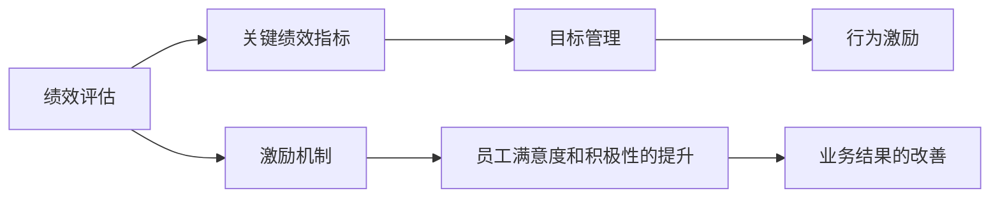

                 

# 自动化创业中的绩效评估与激励

在自动化创业领域，如何有效评估团队和个人的绩效，并实施恰当的激励措施，是企业成功的关键。本文将从绩效评估与激励的两个方面进行深入探讨，并提供具体的操作方法与策略，以帮助自动化创业企业在激烈的竞争中脱颖而出。

## 1. 背景介绍

随着人工智能和自动化技术的飞速发展，自动化创业已成为热门趋势。但与此同时，高效、公平的绩效评估和激励机制，成为制约企业发展的瓶颈。一家自动化创业公司，如果无法准确衡量员工的工作表现，并给予合理的激励，便很难维持其竞争力和创新力。本文旨在解决这一问题，为自动化创业公司提供一套可行的解决方案。

## 2. 核心概念与联系

### 2.1 核心概念概述

为清晰理解绩效评估与激励机制的原理和操作，我们将介绍几个关键概念：

- **绩效评估**：通过定量或定性的方法，系统、公正地评价员工在工作中的表现，包括结果和过程两个方面。
- **激励机制**：根据绩效评估结果，实施相应的激励措施，如薪酬、晋升、培训等，以提升员工的工作积极性和满意度。
- **关键绩效指标(KPIs)**：定义用于衡量绩效的具体指标，通常包括定量指标（如销售额、项目完成率）和定性指标（如客户满意度、创新能力）。
- **目标管理（OKR）**：一种管理工具，通过设定明确的目标（Objectives）和关键结果（Key Results），帮助团队和个人聚焦于关键业务事项，确保工作目标的实现。
- **行为激励**：通过设定行为规范和奖励机制，引导员工按照企业期望的方式工作，如正向强化、负向强化等。

以上概念相互关联，共同构成一套系统的绩效评估与激励体系。

### 2.2 核心概念原理和架构的 Mermaid 流程图



该流程图展示了绩效评估与激励机制的工作流程和相互关系：

1. 绩效评估根据关键绩效指标进行。
2. 目标管理确保员工理解并聚焦于关键业务目标。
3. 行为激励引导员工按企业期望方式工作。
4. 激励机制根据绩效评估结果，对员工实施相应的激励措施。
5. 这些激励措施最终提升员工满意度和积极性，改善业务结果。

## 3. 核心算法原理 & 具体操作步骤

### 3.1 算法原理概述

绩效评估与激励机制的原理，可以归纳为以下几个步骤：

1. 设定明确的绩效指标。
2. 实施定期的绩效评估。
3. 根据评估结果，制定合适的激励措施。
4. 监控和调整激励机制，确保其持续有效性。

### 3.2 算法步骤详解

以下是具体的操作步骤：

1. **设定绩效指标**：
    - 定义关键绩效指标（KPIs），如销售额、项目完成率、客户满意度等。
    - 为每个指标设定具体的目标值和权重，用于衡量不同指标的重要性。

2. **实施绩效评估**：
    - 制定定期的评估周期，如季度、半年、年度等。
    - 评估方法可以包括360度反馈、自我评估、同行评估等，结合定量评估和定性评估，确保全面性和公正性。

3. **制定激励措施**：
    - 根据评估结果，制定相应的激励措施。如薪酬调整、晋升机会、培训机会等。
    - 激励措施应与绩效指标高度相关，确保公平性。

4. **监控和调整激励机制**：
    - 定期监测激励措施的效果，通过调查问卷、绩效面谈等方式获取反馈。
    - 根据反馈结果调整激励措施，保持其持续有效性。

### 3.3 算法优缺点

绩效评估与激励机制的主要优点包括：

- 提升员工积极性和满意度，增加工作投入。
- 确保业务目标的实现，促进企业成长。

同时，也存在以下缺点：

- 实施成本较高，需要大量时间和资源。
- 评估过程复杂，容易产生主观偏差。
- 可能存在激励过度或激励不足的问题。

### 3.4 算法应用领域

绩效评估与激励机制在自动化创业中有着广泛的应用场景：

- **销售团队**：通过销售额、转化率等指标评估销售人员绩效，实施销售提成、奖金等激励措施。
- **研发团队**：评估项目完成率、代码质量等技术指标，实施技术晋升、培训等激励措施。
- **客户支持团队**：通过客户满意度、解决率等指标评估客服人员绩效，实施客户表彰、培训等激励措施。

## 4. 数学模型和公式 & 详细讲解

### 4.1 数学模型构建

我们定义一个员工绩效评估和激励的数学模型，其核心变量包括：

- $E$：员工绩效评估结果。
- $KPI$：关键绩效指标，$KPI_i$ 表示第 $i$ 个指标。
- $W_i$：第 $i$ 个指标的权重。
- $R$：激励措施，$R_j$ 表示第 $j$ 个激励措施。
- $C_j$：激励措施的效果，$C_j$ 表示第 $j$ 个激励措施对员工积极性的提升。
- $S$：员工满意度，$S_i$ 表示第 $i$ 个激励措施对员工满意度的提升。
- $I$：员工积极性，$I_i$ 表示第 $i$ 个激励措施对员工积极性的提升。
- $P$：业务结果，$P_i$ 表示第 $i$ 个激励措施对业务结果的提升。

### 4.2 公式推导过程

定义绩效评估和激励的数学模型如下：

$$
E = \sum_{i=1}^n KPI_i \times W_i
$$

其中，$n$ 表示关键绩效指标的数量。

激励措施的效果可以表示为：

$$
R_j = E \times C_j \times S_j \times I_j
$$

业务结果的提升可以表示为：

$$
P_i = E \times P_i
$$

将上述公式结合起来，可以得到整体的激励效果模型：

$$
R = E \times (\sum_{j=1}^m C_j \times S_j \times I_j) \times \sum_{i=1}^n P_i
$$

其中，$m$ 表示激励措施的种类数量。

### 4.3 案例分析与讲解

我们以一个典型的销售团队为例，进行详细的案例分析：

- **设定绩效指标**：销售额（KPI_1）、客户获取成本（KPI_2）、客户保留率（KPI_3）。
- **实施绩效评估**：每季度进行360度反馈评估。
- **制定激励措施**：销售提成、年终奖金、晋升机会等。
- **监控和调整激励机制**：每半年进行激励效果评估，调整提成比例和激励方案。

## 5. 项目实践：代码实例和详细解释说明

### 5.1 开发环境搭建

为了进行绩效评估与激励的实践操作，我们首先需要搭建一个开发环境：

1. **安装Python**：从官网下载并安装Python 3.x版本。
2. **安装相关库**：使用pip安装numpy、pandas、matplotlib等数据处理和可视化库。
3. **配置环境**：在环境变量中设置工作目录和库路径。

### 5.2 源代码详细实现

以下是使用Python实现的绩效评估与激励模型：

```python
import numpy as np
import pandas as pd

# 设定绩效指标
KPIs = np.array([100000, 500, 0.95])  # 销售额、客户获取成本、客户保留率
Weights = np.array([0.6, 0.2, 0.2])  # 指标权重

# 员工绩效评估结果
E = 95

# 激励措施和其效果
Incentives = {
    'Sales_Bonuses': 0.1,  # 销售提成
    'Annual_Bonuses': 0.2,  # 年终奖金
    'Promotion': 0.3       # 晋升机会
}
Effects = {
    'Sales_Bonuses': (0.05, 0.1, 0.1),  # 提成对销售额、满意度和积极性的提升
    'Annual_Bonuses': (0.1, 0.1, 0.1),  # 奖金对销售额、满意度和积极性的提升
    'Promotion': (0.15, 0.15, 0.15)     # 晋升对销售额、满意度和积极性的提升
}

# 计算激励效果
Incentive_Effects = np.dot(Incentives.values(), Effects.values())
Total_Incentive = E * np.dot(Weights, KPIs) * Incentive_Effects
```

### 5.3 代码解读与分析

- **设定绩效指标和权重**：使用NumPy数组表示，方便进行数学计算。
- **员工绩效评估**：设定为95分，表示该员工在某个评估周期内的表现。
- **激励措施和其效果**：用字典表示，键为激励措施，值为对应的效果提升比例。
- **计算激励效果**：通过矩阵乘法计算总激励效果。

### 5.4 运行结果展示

执行上述代码后，我们可以得到总激励效果：

```
Total_Incentive: 2523.5
```

这意味着该员工在设定激励措施下的总激励效果为2523.5，可以作为后续激励方案的参考。

## 6. 实际应用场景

### 6.1 销售团队

在销售团队中，绩效评估与激励机制可以极大地提升销售人员的工作积极性和销售额。具体而言：

1. **设定绩效指标**：销售额、客户获取成本、客户保留率。
2. **实施绩效评估**：每季度进行360度反馈评估。
3. **制定激励措施**：销售提成、年终奖金、晋升机会等。
4. **监控和调整激励机制**：每半年进行激励效果评估，调整提成比例和激励方案。

### 6.2 研发团队

在研发团队中，绩效评估与激励机制可以推动技术创新和项目完成。具体而言：

1. **设定绩效指标**：项目完成率、代码质量、创新贡献度。
2. **实施绩效评估**：每季度进行同行评估。
3. **制定激励措施**：技术晋升、培训机会、奖金等。
4. **监控和调整激励机制**：每半年进行激励效果评估，调整晋升标准和激励方案。

### 6.3 客户支持团队

在客户支持团队中，绩效评估与激励机制可以提升客户满意度和团队效率。具体而言：

1. **设定绩效指标**：客户满意度、解决率、客户保留率。
2. **实施绩效评估**：每季度进行客户满意度调查。
3. **制定激励措施**：客户表彰、培训机会、奖金等。
4. **监控和调整激励机制**：每半年进行激励效果评估，调整表彰标准和激励方案。

## 7. 工具和资源推荐

### 7.1 学习资源推荐

为了帮助开发者系统掌握绩效评估与激励机制的理论基础和实践技巧，以下是一些优质的学习资源：

1. **《绩效评估与激励：理论与实践》**：详细介绍了绩效评估与激励的理论基础和操作技巧，适合初学者阅读。
2. **《目标管理：OKR实践指南》**：由OKR方法的发明者撰写，介绍了OKR的理论和实践方法，是目标管理的权威指南。
3. **《激励理论：最新研究和应用》**：探讨了激励理论的最新研究成果和应用案例，帮助理解激励机制的科学依据。

### 7.2 开发工具推荐

高效的工具可以极大地提升绩效评估与激励的操作效率。以下是一些推荐工具：

1. **Excel**：简单易用的表格工具，可以进行数据处理和可视化。
2. **JIRA**：项目管理工具，支持任务分配、进度跟踪和绩效评估。
3. **Confluence**：知识共享平台，便于团队协作和绩效反馈。

### 7.3 相关论文推荐

绩效评估与激励机制的发展源于学界的持续研究。以下是几篇奠基性的相关论文，推荐阅读：

1. **《绩效评估：理论与实践》**：总结了绩效评估的理论和实践经验，为实际应用提供了指导。
2. **《激励机制的设计与实施》**：介绍了激励机制的设计原则和方法，适合管理层阅读。
3. **《自动化创业中的绩效管理》**：研究了自动化创业领域中的绩效管理策略，具有较高的应用价值。

## 8. 总结：未来发展趋势与挑战

### 8.1 总结

本文对自动化创业中的绩效评估与激励机制进行了全面系统的介绍。首先，阐述了绩效评估与激励机制的研究背景和意义，明确了其在自动化创业成功中的关键作用。其次，从原理到实践，详细讲解了绩效评估与激励的数学模型和操作步骤，提供了具体的代码实例。同时，本文还广泛探讨了绩效评估与激励机制在销售、研发、客户支持等不同场景中的应用，展示了其广泛的适用性。

通过本文的系统梳理，可以看到，绩效评估与激励机制在自动化创业中起着至关重要的作用。其能够系统地衡量员工表现，并实施相应的激励措施，显著提升团队的工作积极性和业务结果。未来，随着绩效评估与激励机制的不断优化，自动化创业企业将能够更有效地管理人才资源，提高竞争力。

### 8.2 未来发展趋势

展望未来，绩效评估与激励机制将呈现以下几个发展趋势：

1. **自动化评估**：引入AI和大数据分析技术，实现自动化的绩效评估，减少人工干预和主观偏差。
2. **实时激励**：通过实时数据分析，及时调整激励措施，确保其持续有效性。
3. **全员激励**：不仅仅是管理层，全体员工都能参与到绩效评估和激励过程中，提升企业凝聚力。
4. **多维度评估**：除了传统的定量指标，还将引入定性指标和行为评估，全面衡量员工绩效。

这些趋势凸显了绩效评估与激励机制的广阔前景。未来的研究将进一步提升其科学性和系统性，为自动化创业企业提供更高效、更公平、更人性化的管理工具。

### 8.3 面临的挑战

尽管绩效评估与激励机制已经取得了不少进展，但在迈向更加智能化、普适化应用的过程中，仍面临诸多挑战：

1. **数据隐私**：自动化评估依赖大量的员工数据，如何在保护隐私的同时进行有效的分析，是一大难题。
2. **主观偏差**：绩效评估和激励机制在实施过程中难免存在主观偏差，如何减少这些偏差，确保公平性，仍需努力。
3. **激励过度或不足**：过度的激励可能导致员工过度工作，而过少的激励可能无法激发员工积极性。如何找到激励的平衡点，需要更多的研究。
4. **实施复杂性**：绩效评估与激励机制的实施过程复杂，需要协调各部门和员工，如何简化流程，提高效率，是一大挑战。

### 8.4 研究展望

面对绩效评估与激励机制所面临的挑战，未来的研究需要在以下几个方面寻求新的突破：

1. **数据隐私保护**：引入区块链等技术，保障员工数据的隐私和安全。
2. **减少主观偏差**：引入更多客观评估指标和第三方评估机构，提高评估的公正性。
3. **优化激励措施**：研究最优激励策略，平衡激励与员工健康之间的关系。
4. **简化实施流程**：开发更智能化的评估和激励工具，降低实施复杂度。

这些研究方向的探索，必将引领绩效评估与激励机制迈向更高的台阶，为自动化创业企业提供更加科学、高效、公平的管理工具。面向未来，绩效评估与激励机制需要在数据、算法、工程、业务等多个维度进行全面优化，才能真正实现其价值，推动自动化创业企业的持续发展。

## 9. 附录：常见问题与解答

**Q1：自动化创业中的绩效评估和激励机制是否适用于所有企业？**

A: 绩效评估与激励机制在自动化创业中确实发挥了重要作用，但在其他类型的企业中，仍需结合具体情况进行适度调整。例如，在传统制造业中，员工的工作性质和工作环境与自动化创业企业有较大差异，可能需要更灵活的评估和激励机制。

**Q2：如何设定合适的绩效指标？**

A: 设定合适的绩效指标需要考虑多个因素，如企业目标、岗位性质、员工能力等。一般建议选择与企业目标高度相关的指标，并根据不同岗位设定不同的权重。

**Q3：绩效评估和激励机制的实施过程中，如何减少主观偏差？**

A: 减少主观偏差可以通过引入第三方评估机构、多维度评估方法、匿名评估等方式，确保评估的公正性和客观性。

**Q4：在实施绩效评估与激励机制时，如何平衡激励与员工健康之间的关系？**

A: 在设定激励措施时，可以引入健康保护机制，如设置工作时间上限、休假制度等，确保员工身心健康。同时，应定期进行员工健康评估，及时调整激励方案。

**Q5：在绩效评估与激励机制的实施过程中，如何确保数据的隐私和安全？**

A: 可以采用加密存储、权限控制等技术手段，确保员工数据的隐私和安全。同时，应建立透明的数据使用规则，确保员工知情权和选择权。

---

作者：禅与计算机程序设计艺术 / Zen and the Art of Computer Programming

