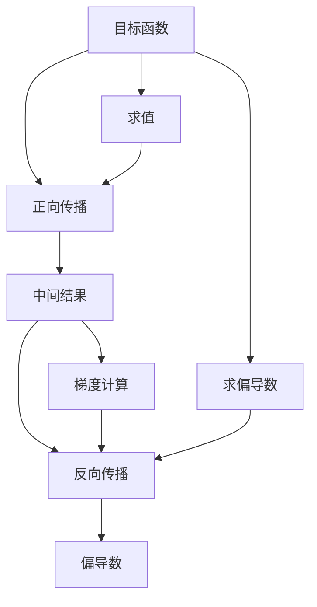

                 

# 自动微分：PyTorch与JAX的核心魔法

> 关键词：自动微分, PyTorch, JAX, 数学导数, 反向传播算法, 向量-向量乘法

## 1. 背景介绍

自动微分（Automatic Differentiation, AD）是一种利用程序编译器自动计算目标函数关于其输入参数的偏导数的方法。它是现代深度学习模型训练中不可或缺的核心技术，尤其在大规模模型如神经网络的训练中发挥着至关重要的作用。自动微分实现了深度学习模型的参数优化，使得模型能够自适应调整，提高模型性能和准确度。

本文将重点探讨自动微分技术在深度学习模型训练中的应用，特别是PyTorch和JAX这两种框架的自动微分机制，并介绍其在实际项目开发中的典型应用。通过这篇文章，我们期望读者能够对自动微分技术有更深刻的理解，并在实践中高效应用这些技术。

## 2. 核心概念与联系

### 2.1 核心概念概述

自动微分是指在目标函数中自动计算其输入参数的导数，这个过程分为正向传播和反向传播两个步骤。在正向传播中，计算目标函数关于输入参数的函数值；在反向传播中，利用正向传播中保存的中间结果计算导数。自动微分算法是计算目标函数导数的核心方法，常见的有链式法则、复合函数法则、向量-向量乘法等。

- **链式法则**：用于计算复合函数对输入参数的偏导数，其原理是将复合函数分解成多个基本函数的复合，然后逐层求导。
- **复合函数法则**：用于计算更复杂的多重嵌套函数对输入参数的偏导数，基于链式法则和向量-向量乘法展开。
- **向量-向量乘法**：用于计算多个参数之间的偏导数，利用矩阵乘法的特性，高效计算导数。

### 2.2 核心概念原理和架构的 Mermaid 流程图



这个图表展示了自动微分的基本流程。目标函数输入通过正向传播计算出中间结果，然后通过反向传播利用中间结果计算偏导数。

## 3. 核心算法原理 & 具体操作步骤

### 3.1 算法原理概述

自动微分算法的核心在于高效计算目标函数对输入参数的偏导数。在深度学习中，自动微分通常被用于计算损失函数对模型参数的梯度，从而实现模型参数的优化。

#### 3.2 算法步骤详解

自动微分算法通常分为以下几个步骤：

1. **正向传播**：计算目标函数关于输入参数的函数值。
2. **中间结果保存**：保存正向传播过程中计算的中间结果，这些中间结果将用于反向传播。
3. **反向传播**：利用正向传播中的中间结果，计算目标函数对输入参数的偏导数。
4. **梯度计算**：根据偏导数计算模型参数的梯度。

#### 3.3 算法优缺点

自动微分算法具有以下优点：

- **高效计算**：自动微分算法能够高效计算目标函数对输入参数的偏导数，避免了手动求导的繁琐和错误。
- **鲁棒性强**：自动微分算法能够处理复杂的复合函数，避免了手动求导时可能出现的错误。
- **可扩展性**：自动微分算法可以应用到任意复杂的目标函数，易于集成到现有的深度学习框架中。

然而，自动微分算法也存在一些缺点：

- **内存占用高**：保存中间结果需要大量的内存空间，这对于大模型和高维数据来说可能是一个问题。
- **复杂度增加**：对于非常复杂的目标函数，自动微分算法的复杂度可能较高，计算开销较大。
- **难以调试**：自动微分算法的内部计算过程复杂，调试起来较为困难。

#### 3.4 算法应用领域

自动微分技术在深度学习领域得到了广泛应用，包括但不限于以下几个领域：

- **神经网络优化**：通过自动微分计算目标函数对模型参数的梯度，从而实现模型参数的优化。
- **强化学习**：计算策略函数关于状态参数的偏导数，实现策略的梯度更新。
- **计算机视觉**：应用于图像处理、目标检测等任务，计算模型输出对输入参数的偏导数。
- **自然语言处理**：应用于文本分类、情感分析、机器翻译等任务，计算模型输出对输入参数的偏导数。

## 4. 数学模型和公式 & 详细讲解 & 举例说明

### 4.1 数学模型构建

在深度学习中，我们通常使用神经网络作为目标函数，其形式为：

$$
f(\mathbf{x};\mathbf{w}) = \sum_i^n a_i(\mathbf{x};\mathbf{w})b_i
$$

其中，$\mathbf{x}$ 是输入参数，$\mathbf{w}$ 是模型参数，$a_i$ 是激活函数，$b_i$ 是权重。

### 4.2 公式推导过程

在深度学习中，我们通常使用反向传播算法（Backpropagation）计算目标函数对输入参数的偏导数。反向传播算法的核心思想是利用链式法则和向量-向量乘法，计算目标函数对每个模型参数的偏导数。

以一个简单的神经网络为例，假设其形式为：

$$
f(\mathbf{x};\mathbf{w}) = \sum_i^n a_i(\mathbf{x};\mathbf{w})b_i
$$

其中，$a_i$ 是激活函数，$b_i$ 是权重，$\mathbf{x}$ 是输入参数，$\mathbf{w}$ 是模型参数。

首先，通过正向传播计算目标函数：

$$
f(\mathbf{x};\mathbf{w}) = \sum_i^n a_i(\mathbf{x};\mathbf{w})b_i
$$

然后，利用反向传播计算目标函数对每个模型参数的偏导数：

$$
\frac{\partial f}{\partial w_i} = \sum_j \frac{\partial f}{\partial a_j}\frac{\partial a_j}{\partial w_i} + \frac{\partial f}{\partial b_i}\frac{\partial b_i}{\partial w_i}
$$

### 4.3 案例分析与讲解

以一个简单的线性回归模型为例，假设模型形式为：

$$
f(x;\theta) = \theta^Tx + b
$$

其中，$\theta$ 是模型参数，$x$ 是输入数据。

计算目标函数对模型参数的偏导数：

$$
\frac{\partial f}{\partial \theta} = x^T
$$

这个案例展示了自动微分算法的核心步骤：正向传播计算函数值，然后利用链式法则和向量-向量乘法计算偏导数。

## 5. 项目实践：代码实例和详细解释说明

### 5.1 开发环境搭建

在使用自动微分算法之前，需要搭建合适的开发环境。下面以PyTorch和JAX为例，介绍如何搭建开发环境。

#### PyTorch

在安装PyTorch之前，需要先安装CUDA和cuDNN库，以便使用GPU加速计算。安装命令如下：

```bash
pip install torch torchvision torchaudio
```

#### JAX

JAX是一个基于Python的自动微分和编译器，可以高效计算目标函数的偏导数。安装命令如下：

```bash
pip install jax jaxlib
```

### 5.2 源代码详细实现

#### PyTorch

以下是使用PyTorch计算目标函数对输入参数的偏导数的代码：

```python
import torch

# 定义目标函数
def f(x):
    return x.pow(2) + 3*x + 5

# 定义输入参数
x = torch.tensor(2.0)

# 计算目标函数对输入参数的偏导数
grad = torch.autograd.grad(f(x), x)

print(grad)
```

#### JAX

以下是使用JAX计算目标函数对输入参数的偏导数的代码：

```python
import jax.numpy as jnp

# 定义目标函数
def f(x):
    return x**2 + 3*x + 5

# 定义输入参数
x = jnp.array(2.0)

# 计算目标函数对输入参数的偏导数
grad = jax.grad(f)(x)

print(grad)
```

### 5.3 代码解读与分析

#### PyTorch

在PyTorch中，我们通过`torch.autograd.grad`函数计算目标函数对输入参数的偏导数。`torch.autograd.grad`函数接受目标函数和输入参数，返回目标函数对输入参数的偏导数。

#### JAX

在JAX中，我们通过`jax.grad`函数计算目标函数对输入参数的偏导数。`jax.grad`函数接受目标函数和输入参数，返回目标函数对输入参数的偏导数。

## 6. 实际应用场景

### 6.1 图像分类

自动微分技术在图像分类任务中得到了广泛应用。以卷积神经网络（CNN）为例，自动微分算法可以计算图像分类模型的参数梯度，实现模型参数的优化。

#### 6.2 文本分类

自动微分技术在文本分类任务中同样发挥了重要作用。以循环神经网络（RNN）为例，自动微分算法可以计算文本分类模型的参数梯度，实现模型参数的优化。

#### 6.3 生成对抗网络

生成对抗网络（GAN）是一种生成模型，自动微分技术在其中发挥了重要作用。在GAN中，自动微分算法可以计算生成器和判别器的参数梯度，实现模型参数的优化。

## 7. 工具和资源推荐

### 7.1 学习资源推荐

#### PyTorch

- PyTorch官方文档：PyTorch官方提供的详细文档，涵盖了自动微分算法的使用方法。
- PyTorch官方博客：PyTorch官方博客，提供了大量自动微分算法的应用案例。
- PyTorch官方示例：PyTorch官方示例代码，帮助理解自动微分算法的具体实现。

#### JAX

- JAX官方文档：JAX官方提供的详细文档，涵盖了自动微分算法的使用方法。
- JAX官方博客：JAX官方博客，提供了大量自动微分算法的应用案例。
- JAX官方示例：JAX官方示例代码，帮助理解自动微分算法的具体实现。

### 7.2 开发工具推荐

#### PyTorch

- PyTorch：PyTorch是深度学习领域最流行的开源框架之一，支持高效的自动微分算法。
- TensorFlow：TensorFlow是另一个流行的深度学习框架，也支持高效的自动微分算法。

#### JAX

- JAX：JAX是一个自动微分和编译器，支持高效的计算目标函数的偏导数。
- NumPy：NumPy是Python中最流行的科学计算库之一，支持高效的数学计算。

### 7.3 相关论文推荐

#### PyTorch

- Automatic Differentiation in PyTorch：PyTorch官方文档，详细介绍了PyTorch中的自动微分算法。
- PyTorch vs JAX: Differentiation and Optimization：比较PyTorch和JAX在自动微分算法中的应用。

#### JAX

- JAX: Computation and differentiation made differentiable：JAX官方文档，详细介绍了JAX中的自动微分算法。
- JAX vs PyTorch: The Right Choice for Differentiable Computation：比较JAX和PyTorch在自动微分算法中的应用。

## 8. 总结：未来发展趋势与挑战

### 8.1 研究成果总结

自动微分技术在深度学习模型训练中发挥了至关重要的作用，实现了模型参数的优化，提升了模型的性能和准确度。PyTorch和JAX作为两种流行的自动微分框架，分别在不同的领域得到了广泛应用。

### 8.2 未来发展趋势

未来的自动微分技术将向以下几个方向发展：

1. **高效计算**：自动微分技术将继续提升计算效率，减少计算开销。
2. **模型优化**：自动微分技术将与模型优化技术结合，进一步提升模型的性能和准确度。
3. **多模态计算**：自动微分技术将支持多模态计算，如支持图像、文本、音频等多种数据类型的计算。
4. **自动化优化**：自动微分技术将与自动化优化技术结合，实现模型自动化的参数优化。

### 8.3 面临的挑战

自动微分技术在应用中也面临一些挑战：

1. **内存占用高**：自动微分技术需要保存中间结果，占用大量内存空间，这对于大模型和高维数据来说可能是一个问题。
2. **计算复杂度高**：对于非常复杂的目标函数，自动微分算法的计算复杂度可能较高。
3. **难以调试**：自动微分算法的内部计算过程复杂，调试起来较为困难。

### 8.4 研究展望

未来的自动微分技术需要在以下几个方面进行深入研究：

1. **高效计算**：开发更加高效的自动微分算法，减少计算开销，提升计算效率。
2. **模型优化**：将自动微分技术与模型优化技术结合，进一步提升模型的性能和准确度。
3. **多模态计算**：支持多模态计算，如支持图像、文本、音频等多种数据类型的计算。
4. **自动化优化**：实现模型自动化的参数优化，提高优化效率。

## 9. 附录：常见问题与解答

**Q1: 自动微分算法的原理是什么？**

A: 自动微分算法的原理基于链式法则和向量-向量乘法。通过正向传播计算目标函数关于输入参数的函数值，然后利用链式法则和向量-向量乘法计算目标函数对每个输入参数的偏导数。

**Q2: PyTorch和JAX在自动微分算法上有哪些区别？**

A: PyTorch和JAX在自动微分算法上有以下几个区别：

- PyTorch的自动微分算法是基于反传播（Backpropagation）实现的，而JAX的自动微分算法是基于源代码转换实现的。
- PyTorch的自动微分算法需要保存中间结果，占用了大量内存空间，而JAX的自动微分算法可以生成高效的计算图，减少了内存占用。
- PyTorch的自动微分算法更加易于使用，而JAX的自动微分算法在高效计算和多模态计算方面表现更加出色。

**Q3: 自动微分技术在深度学习中有哪些应用？**

A: 自动微分技术在深度学习中广泛应用于以下几个领域：

- 神经网络优化：通过计算目标函数对模型参数的偏导数，实现模型参数的优化。
- 强化学习：计算策略函数关于状态参数的偏导数，实现策略的梯度更新。
- 计算机视觉：应用于图像处理、目标检测等任务，计算模型输出对输入参数的偏导数。
- 自然语言处理：应用于文本分类、情感分析、机器翻译等任务，计算模型输出对输入参数的偏导数。

**Q4: 如何优化自动微分算法的计算效率？**

A: 优化自动微分算法的计算效率可以从以下几个方面入手：

- 使用高效的计算框架，如PyTorch和JAX，这些框架提供了高效的自动微分算法。
- 使用数据并行和模型并行，减少单个计算单元的计算量。
- 使用分布式计算，将计算任务分布到多个计算单元上进行并行计算。

**Q5: 自动微分技术在实际项目开发中有哪些典型应用？**

A: 自动微分技术在实际项目开发中广泛应用于以下几个领域：

- 神经网络优化：通过计算目标函数对模型参数的偏导数，实现模型参数的优化。
- 强化学习：计算策略函数关于状态参数的偏导数，实现策略的梯度更新。
- 计算机视觉：应用于图像处理、目标检测等任务，计算模型输出对输入参数的偏导数。
- 自然语言处理：应用于文本分类、情感分析、机器翻译等任务，计算模型输出对输入参数的偏导数。

---

作者：禅与计算机程序设计艺术 / Zen and the Art of Computer Programming

