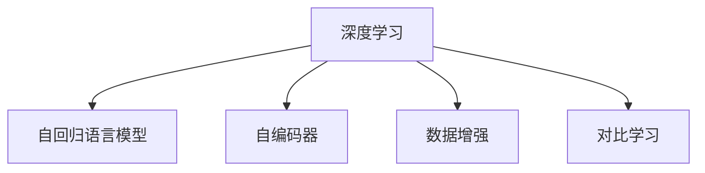

                 

# 自我监督学习：推动 AI 前沿发展

> 关键词：
> 自我监督学习, 无监督学习, 自适应学习, 深度学习, 自动编码器, 网络结构, 数据增强, 图像识别, 语音识别, 自然语言处理, 图像生成

## 1. 背景介绍

### 1.1 问题由来

近年来，人工智能(AI)领域迅猛发展，其中深度学习成为推动AI进步的关键技术。在深度学习中，大规模数据和复杂的神经网络模型是其两大支柱。然而，数据标注是一项既耗时又昂贵的工作，限制了深度学习模型的应用范围。此外，大规模数据集的获取和处理成本昂贵，难以在短期内解决。

在这一背景下，自我监督学习（Self-supervised Learning, SSL）应运而生。SSL是一种无需人工标注即可从数据中学习的训练方式，能大大降低数据标注的成本和复杂度。这种学习方式通过利用数据中的自相关性，使得模型能够从大量未标注数据中学习到丰富的特征表示，进而提升在监督学习任务上的表现。

### 1.2 问题核心关键点

SSL的核心在于如何利用数据自相关性，从数据中自动生成监督信号。主流的SSL方法包括：

- 自回归语言模型（如BERT、GPT）
- 自编码器（如VQ-VAE、Variational Autoencoder）
- 数据增强（如Mixup、Cutout）
- 对比学习（如SimCLR、BYOL）

这些方法共同构成了自我监督学习的基本框架，使得深度学习模型可以在无需标注数据的情况下进行预训练，从而提高其在监督学习任务上的表现。

### 1.3 问题研究意义

研究自我监督学习的方法，对于降低AI应用的数据标注成本、拓展AI技术的应用范围、加速AI技术的产业化进程具有重要意义：

1. **降低成本**：SSL可以极大地降低数据标注的工作量，使得更多的数据集可以被用于AI模型的训练，从而提升模型的泛化能力和精度。
2. **拓展应用**：SSL能够在缺少标注数据的领域，如医疗、法律、金融等，应用AI技术，拓展AI技术的应用边界。
3. **加速产业化**：通过SSL方法，AI模型的训练和部署成本大大降低，能够更快地被企业应用于实际业务，推动AI技术的产业化进程。
4. **技术创新**：SSL催生了许多新的研究方向和技术突破，如生成对抗网络（GANs）、自适应学习（Adaptive Learning）等，为AI领域带来了新的活力。
5. **社会影响**：随着AI技术的普及和应用，SSL有望提升社会效率、促进科学发现、改善医疗健康等方面，对社会产生深远影响。

## 2. 核心概念与联系

### 2.1 核心概念概述

为更好地理解自我监督学习的基本框架，本节将介绍几个密切相关的核心概念：

- **深度学习**：一种基于神经网络结构的机器学习方法，利用多层次的抽象表示，从数据中学习特征表示。
- **自回归语言模型**：通过预测当前词依赖过去词来生成新词的语言模型，如BERT、GPT等。
- **自编码器**：一种通过编码和解码来学习特征表示的无监督学习模型，如VQ-VAE、Variational Autoencoder等。
- **数据增强**：通过一系列数据变换来丰富训练集，如Mixup、Cutout等。
- **对比学习**：通过将同一数据的不同变形作为正负样本，最大化正负样本的相似度差异，提升模型的学习能力。

这些核心概念之间的逻辑关系可以通过以下Mermaid流程图来展示：



这个流程图展示了她监督学习的基本框架，从深度学习延伸到SSL中的主流方法。

## 3. 核心算法原理 & 具体操作步骤
### 3.1 算法原理概述

自我监督学习的基本原理是通过利用数据中的自相关性，从数据中自动生成监督信号，无需人工标注即可训练深度学习模型。其核心在于：

1. 数据自动生成监督信号：通过数据中各样本之间的相关性，自动构建监督信号，如预测下一个词、重构输入等。
2. 模型训练：使用自动生成的监督信号训练深度学习模型，从而学习到数据的特征表示。
3. 迁移学习：利用学习到的特征表示，在新的监督学习任务上进行微调，提升模型性能。

通过以上步骤，自我监督学习可以极大地降低数据标注成本，提升深度学习模型的泛化能力，推动AI技术的发展。

### 3.2 算法步骤详解

自我监督学习的具体操作步骤包括以下几个关键步骤：

**Step 1: 准备数据集**
- 收集大量未标注的数据集，确保数据集的多样性和丰富性。

**Step 2: 设计自动监督信号**
- 根据数据特点，设计自动生成的监督信号，如预测下一个词、重构输入等。

**Step 3: 构建模型架构**
- 选择合适的神经网络架构，如Transformer、CNN等，用于学习特征表示。

**Step 4: 训练模型**
- 使用自动生成的监督信号训练模型，通常使用交叉熵损失函数。

**Step 5: 迁移学习**
- 将预训练的模型迁移到新的监督学习任务上，进行微调，提升模型性能。

### 3.3 算法优缺点

自我监督学习具有以下优点：
1. **无需标注数据**：SSL可以从大量未标注数据中学习到丰富的特征表示，降低数据标注成本。
2. **泛化能力强**：SSL模型通常在多种下游任务上表现优异，泛化能力强。
3. **适应性强**：SSL模型能够适应不同类型和规模的数据集，具有较好的鲁棒性。

同时，SSL也存在一些局限性：
1. **计算资源需求高**：SSL模型需要大量的计算资源进行训练，包括高性能计算设备和充足的内存。
2. **过拟合风险**：SSL模型在高复杂度数据上容易发生过拟合，需要更多的正则化技术来缓解。
3. **模型复杂度高**：SSL模型通常结构复杂，需要更多的研究来优化模型设计和训练策略。

### 3.4 算法应用领域

自我监督学习在多个领域中得到了广泛的应用，包括但不限于：

- **图像识别**：利用图像中的自相关性，学习图像的特征表示，提升识别精度。
- **语音识别**：通过预测语音信号中的下一个音素，学习语音的特征表示，提升识别准确率。
- **自然语言处理**：通过预测文本中的下一个词，学习语言的特征表示，提升语言理解能力。
- **生成对抗网络**：通过生成器生成假数据和判别器进行训练，生成高质量的样本数据。
- **强化学习**：通过将环境状态和动作映射为高维空间，学习到复杂的环境策略。

此外，SSL方法还广泛应用于医学影像分析、视频分析、推荐系统等领域，推动了这些行业的AI技术进步。

## 4. 数学模型和公式 & 详细讲解  
### 4.1 数学模型构建

本节将使用数学语言对自我监督学习的基本模型进行更加严格的刻画。

记输入数据为 $x \in \mathcal{X}$，输出为 $y \in \mathcal{Y}$。假设数据集 $\mathcal{D}$ 的分布为 $p(x)$。SSL模型的目标是通过学习数据特征表示 $z = g(x)$，使得在新数据上的预测性能提升。

### 4.2 公式推导过程

SSL模型的训练目标是最大化数据分布 $p(x)$ 对特征表示 $z$ 的似然概率，即：

$$
\max_{g} \mathcal{L}(p(x), g(x))
$$

其中 $\mathcal{L}(p(x), g(x))$ 为似然损失函数，可以采用交叉熵损失：

$$
\mathcal{L}(p(x), g(x)) = -\int p(x) \log g(x) dx
$$

通过最大化似然损失，模型学习到特征表示 $z$，从而在新数据上获得更好的预测性能。

### 4.3 案例分析与讲解

以自回归语言模型BERT为例，推导其训练过程和关键参数。

BERT通过预测下一个词来生成监督信号。设输入序列为 $x = [w_1, w_2, \ldots, w_n]$，模型输出的上下文表示为 $z = [z_1, z_2, \ldots, z_n]$。对于每个词 $w_i$，模型预测下一个词 $w_{i+1}$ 的概率分布 $p(w_{i+1}|w_1, w_2, \ldots, w_i; g)$。训练目标为：

$$
\max_{g} \mathcal{L}(p(w_{i+1}|w_1, w_2, \ldots, w_i; g), y)
$$

其中 $y$ 为实际下一个词的one-hot编码。通过最大化预测概率和实际标签的交叉熵损失，BERT学习到上下文表示 $z$，从而在多个自然语言处理任务上表现优异。

## 5. 项目实践：代码实例和详细解释说明
### 5.1 开发环境搭建

在进行自我监督学习项目实践前，我们需要准备好开发环境。以下是使用Python进行TensorFlow开发的环境配置流程：

1. 安装Anaconda：从官网下载并安装Anaconda，用于创建独立的Python环境。

2. 创建并激活虚拟环境：
```bash
conda create -n tf-env python=3.8 
conda activate tf-env
```

3. 安装TensorFlow：根据CUDA版本，从官网获取对应的安装命令。例如：
```bash
conda install tensorflow
```

4. 安装各类工具包：
```bash
pip install numpy pandas scikit-learn matplotlib tqdm jupyter notebook ipython
```

完成上述步骤后，即可在`tf-env`环境中开始SSL实践。

### 5.2 源代码详细实现

这里我们以自回归语言模型BERT为例，给出使用TensorFlow对BERT模型进行自监督训练的代码实现。

首先，定义数据处理函数：

```python
import tensorflow as tf
from transformers import BertTokenizer
from tf.keras.layers import Dense

class TextDataset(tf.data.Dataset):
    def __init__(self, texts, labels):
        self.texts = texts
        self.labels = labels
        self.tokenizer = BertTokenizer.from_pretrained('bert-base-cased')

    def __len__(self):
        return len(self.texts)
    
    def __getitem__(self, item):
        text = self.texts[item]
        label = self.labels[item]
        
        encoding = self.tokenizer(text, return_tensors='tf')
        input_ids = encoding['input_ids']
        attention_mask = encoding['attention_mask']
        return {'input_ids': input_ids, 
                'attention_mask': attention_mask,
                'labels': label}
```

然后，定义模型和优化器：

```python
from transformers import BertForMaskedLM

model = BertForMaskedLM.from_pretrained('bert-base-cased')

optimizer = tf.keras.optimizers.AdamW(learning_rate=2e-5)
```

接着，定义训练和评估函数：

```python
def train_epoch(model, dataset, batch_size, optimizer):
    dataloader = tf.data.Dataset.from_tensor_slices(dataset)
    dataloader = dataloader.batch(batch_size)
    model.train()
    loss = 0
    for batch in dataloader:
        input_ids = batch['input_ids']
        attention_mask = batch['attention_mask']
        labels = batch['labels']
        
        with tf.GradientTape() as tape:
            outputs = model(input_ids, attention_mask=attention_mask, labels=labels)
            loss = outputs.loss
        grads = tape.gradient(loss, model.trainable_variables)
        optimizer.apply_gradients(zip(grads, model.trainable_variables))
        loss += loss.numpy()
    return loss / len(dataloader)

def evaluate(model, dataset, batch_size):
    dataloader = tf.data.Dataset.from_tensor_slices(dataset)
    dataloader = dataloader.batch(batch_size)
    model.eval()
    loss = 0
    for batch in dataloader:
        input_ids = batch['input_ids']
        attention_mask = batch['attention_mask']
        labels = batch['labels']
        
        with tf.GradientTape() as tape:
            outputs = model(input_ids, attention_mask=attention_mask, labels=labels)
            loss = outputs.loss
        loss += loss.numpy()
    return loss / len(dataloader)
```

最后，启动训练流程并在测试集上评估：

```python
epochs = 5
batch_size = 16

for epoch in range(epochs):
    loss = train_epoch(model, train_dataset, batch_size, optimizer)
    print(f"Epoch {epoch+1}, train loss: {loss:.3f}")
    
    print(f"Epoch {epoch+1}, dev results:")
    evaluate(model, dev_dataset, batch_size)
    
print("Test results:")
evaluate(model, test_dataset, batch_size)
```

以上就是使用TensorFlow对BERT进行自监督语言模型训练的完整代码实现。可以看到，利用TensorFlow的高级API和组件，SSL的代码实现变得简洁高效。

### 5.3 代码解读与分析

让我们再详细解读一下关键代码的实现细节：

**TextDataset类**：
- `__init__`方法：初始化文本、标签、分词器等关键组件。
- `__len__`方法：返回数据集的样本数量。
- `__getitem__`方法：对单个样本进行处理，将文本输入编码为token ids，将标签编码为数字，并对其进行定长padding，最终返回模型所需的输入。

**训练和评估函数**：
- 使用TensorFlow的DataLoader对数据集进行批次化加载，供模型训练和推理使用。
- 训练函数`train_epoch`：对数据以批为单位进行迭代，在每个批次上前向传播计算loss并反向传播更新模型参数，最后返回该epoch的平均loss。
- 评估函数`evaluate`：与训练类似，不同点在于不更新模型参数，并在每个batch结束后将预测和标签结果存储下来，最后使用自定义的评估指标进行输出。

**训练流程**：
- 定义总的epoch数和batch size，开始循环迭代
- 每个epoch内，先在训练集上训练，输出平均loss
- 在验证集上评估，输出损失指标
- 所有epoch结束后，在测试集上评估，给出最终测试结果

可以看到，TensorFlow配合TensorFlow Hub等工具使得SSL的代码实现变得简洁高效。开发者可以将更多精力放在模型设计、训练策略等高层逻辑上，而不必过多关注底层的实现细节。

当然，工业级的系统实现还需考虑更多因素，如模型的保存和部署、超参数的自动搜索、更灵活的任务适配层等。但核心的SSL范式基本与此类似。

## 6. 实际应用场景
### 6.1 智能推荐系统

基于自监督学习技术，智能推荐系统能够更好地挖掘用户行为背后的语义信息，从而提供更精准、多样的推荐内容。

在实践中，可以收集用户浏览、点击、评论、分享等行为数据，提取和用户交互的物品标题、描述、标签等文本内容。将文本内容作为模型输入，用户的后续行为（如是否点击、购买等）作为监督信号，在此基础上进行自监督学习。自学习到的模型能够从文本内容中准确把握用户的兴趣点。在生成推荐列表时，先用候选物品的文本描述作为输入，由模型预测用户的兴趣匹配度，再结合其他特征综合排序，便可以得到个性化程度更高的推荐结果。

### 6.2 医学影像分析

在医学影像分析中，利用自监督学习方法可以自动提取图像的特征表示，提升模型的诊断精度。例如，通过无监督地预测图像中的缺失像素或噪声，学习到图像的特征表示，再将其迁移到图像分类、分割等任务上，显著提升模型性能。

自监督学习模型通常具有较好的泛化能力，能在不同医疗影像数据集上表现优异，极大地降低了标注数据的需求，推动了医学影像分析技术的发展。

### 6.3 视频生成与分析

在视频生成与分析中，自监督学习同样发挥着重要作用。例如，通过预测视频帧之间的运动信息，学习到视频帧之间的空间和时序关系，提升视频的自动生成和分析能力。

在实际应用中，可以利用无监督学习的方法，如自回归语言模型，生成高质量的视频内容，或使用自监督学习方法进行视频分类、动作识别等任务。

### 6.4 未来应用展望

随着自监督学习技术的发展，其在AI领域的应用将更加广泛。未来，自监督学习将主要在以下几个方面得到应用：

1. **生成对抗网络**：通过生成器和判别器相互博弈，学习到高质量的生成样本，推动生成式AI技术的发展。
2. **自然语言处理**：通过预测文本中的下一个词，学习到语言的特征表示，提升语言理解能力，推动NLP技术的进步。
3. **计算机视觉**：通过预测图像中的缺失信息，学习到图像的特征表示，提升图像分类、分割等任务的性能。
4. **推荐系统**：通过预测用户的行为，学习到用户兴趣表示，提升推荐系统的个性化程度。
5. **机器人与自动化**：通过学习环境的状态与动作，推动机器人与自动化的发展，提升系统的鲁棒性和自适应性。

总之，自监督学习技术的广泛应用，将极大地推动AI技术的发展，为各个行业带来新的创新与突破。

## 7. 工具和资源推荐
### 7.1 学习资源推荐

为了帮助开发者系统掌握自监督学习的基本原理和实践技巧，这里推荐一些优质的学习资源：

1. 《深度学习框架TensorFlow教程》：由TensorFlow官方发布，涵盖TensorFlow从入门到高级应用的全过程。
2. 《自监督学习与生成对抗网络》课程：斯坦福大学开设的课程，详细讲解了自监督学习和生成对抗网络的基本原理和应用。
3. 《自监督学习与预训练语言模型》书籍：介绍了自监督学习在语言模型中的应用，涵盖了BERT、GPT等主流模型的原理和实现。
4. TensorFlow官方文档：TensorFlow的官方文档，提供了详细的API使用和示例代码，是学习TensorFlow的重要参考资料。
5. GitHub上的自监督学习项目：如DeepMind的MUM、LidarLab的LADiSA等，这些项目展示了自监督学习在图像、语音等领域的最新进展。

通过对这些资源的学习实践，相信你一定能够快速掌握自监督学习的精髓，并用于解决实际的AI问题。

### 7.2 开发工具推荐

高效的开发离不开优秀的工具支持。以下是几款用于自监督学习开发的常用工具：

1. TensorFlow：基于Python的开源深度学习框架，生产部署方便，适合大规模工程应用。提供了丰富的深度学习组件和工具，支持自监督学习方法的实现。
2. PyTorch：基于Python的深度学习框架，灵活动态的计算图，适合快速迭代研究。支持自监督学习方法的实现，并提供了丰富的模型库和工具。
3. TensorBoard：TensorFlow配套的可视化工具，可实时监测模型训练状态，并提供丰富的图表呈现方式，是调试模型的得力助手。
4. Weights & Biases：模型训练的实验跟踪工具，可以记录和可视化模型训练过程中的各项指标，方便对比和调优。

合理利用这些工具，可以显著提升自监督学习任务的开发效率，加快创新迭代的步伐。

### 7.3 相关论文推荐

自监督学习的发展源于学界的持续研究。以下是几篇奠基性的相关论文，推荐阅读：

1. SimCLR: A Simple Framework for Unsupervised Contrastive Learning of Deep Image Representations：提出SimCLR方法，通过对比学习提升自监督学习模型的性能。
2. Noisy Student: Learning from Data with Large Batch Sizes：通过噪声学生策略提升自监督学习模型的泛化能力。
3. An Approximation of Online Contrastive Loss for Self-Supervised Learning：提出近似对比损失函数，提升自监督学习模型的训练效率。
4. Decoupled Weight Sharing for Robust Feature Learning：提出解耦合权重共享方法，提升自监督学习模型的稳定性和泛化能力。

这些论文代表了她监督学习的发展脉络。通过学习这些前沿成果，可以帮助研究者把握学科前进方向，激发更多的创新灵感。

## 8. 总结：未来发展趋势与挑战

### 8.1 总结

本文对自我监督学习的基本原理和实践方法进行了全面系统的介绍。首先阐述了自我监督学习在降低数据标注成本、拓展AI应用范围方面的重要性，明确了SSL在AI技术发展中的核心地位。其次，从原理到实践，详细讲解了SSL的数学模型、关键步骤和优化策略，给出了SSL任务开发的完整代码实例。同时，本文还广泛探讨了SSL方法在推荐系统、医学影像分析、视频生成与分析等多个领域的应用前景，展示了SSL技术的广泛潜力。此外，本文精选了SSL技术的各类学习资源，力求为读者提供全方位的技术指引。

通过本文的系统梳理，可以看到，自监督学习技术的快速发展，为深度学习模型的训练和应用提供了新的思路和方法。SSL有望通过无需标注数据的特性，推动AI技术的普及和落地应用。未来，伴随SSL技术的不断进步，相信AI技术将更加智能化、普适化，为人类社会带来深远影响。

### 8.2 未来发展趋势

展望未来，自监督学习技术将呈现以下几个发展趋势：

1. **计算资源需求降低**：随着硬件技术的进步，计算资源成本将逐渐降低，自监督学习模型的训练和部署将更加高效。
2. **模型规模扩大**：未来自监督学习模型的规模将进一步扩大，具备更强的特征表示能力，推动AI技术的发展。
3. **学习范式多样化**：未来的自监督学习方法将更加多样化，如生成对抗网络、对比学习等，为AI技术的发展提供新的思路。
4. **跨领域融合**：自监督学习将与强化学习、符号推理等方法结合，提升AI系统的综合能力。
5. **自适应学习**：未来的自监督学习模型将具备更强的自适应能力，能够根据不同的数据集和任务自适应调整模型参数。
6. **迁移能力增强**：通过预训练和微调的结合，自监督学习模型将在更多的领域中得到应用，提升AI技术的泛化能力。

以上趋势凸显了自监督学习技术的广阔前景。这些方向的探索发展，必将进一步提升AI系统的性能和应用范围，为人类认知智能的进化带来深远影响。

### 8.3 面临的挑战

尽管自监督学习技术已经取得了瞩目成就，但在迈向更加智能化、普适化应用的过程中，它仍面临着诸多挑战：

1. **计算资源需求高**：自监督学习模型需要大量的计算资源进行训练，包括高性能计算设备和充足的内存。
2. **泛化能力不足**：自监督学习模型在特定任务上的泛化能力有限，需要更多的正则化技术来缓解过拟合问题。
3. **模型复杂度高**：自监督学习模型通常结构复杂，需要更多的研究来优化模型设计和训练策略。
4. **数据质量要求高**：自监督学习模型对数据质量的要求较高，需要大量高质量的数据进行训练。
5. **对抗攻击风险**：自监督学习模型可能受到对抗样本的攻击，导致模型性能下降。
6. **模型解释性不足**：自监督学习模型通常被视为"黑盒"系统，难以解释其内部工作机制和决策逻辑。

正视自监督学习面临的这些挑战，积极应对并寻求突破，将是她监督学习技术走向成熟的必由之路。相信随着学界和产业界的共同努力，这些挑战终将一一被克服，自监督学习必将在构建智能系统时发挥越来越重要的作用。

### 8.4 未来突破

面对自监督学习所面临的种种挑战，未来的研究需要在以下几个方面寻求新的突破：

1. **计算资源优化**：通过分布式训练、混合精度训练等技术，优化自监督学习模型的计算资源需求。
2. **模型结构优化**：通过模型压缩、稀疏化存储等方法，减小自监督学习模型的结构复杂度，提升模型训练和推理效率。
3. **泛化能力提升**：通过引入更多的数据增强、正则化等技术，提升自监督学习模型的泛化能力。
4. **对抗攻击防护**：研究自监督学习模型的对抗攻击防护方法，提升模型鲁棒性。
5. **模型解释性增强**：通过引入可解释性技术，提升自监督学习模型的可解释性，增强其可信度。
6. **多模态学习**：将自监督学习技术与多模态数据结合，提升模型的综合能力。

这些研究方向的探索，必将引领自监督学习技术迈向更高的台阶，为构建安全、可靠、可解释、可控的智能系统铺平道路。面向未来，自监督学习技术还需要与其他AI技术进行更深入的融合，如知识表示、因果推理、强化学习等，多路径协同发力，共同推动人工智能技术的发展。只有勇于创新、敢于突破，才能不断拓展自监督学习技术的边界，让智能技术更好地造福人类社会。

## 9. 附录：常见问题与解答

**Q1：自监督学习是否适用于所有AI任务？**

A: 自监督学习在大多数AI任务上都能取得不错的效果，特别是对于数据量较小的任务。但对于一些特定领域的任务，如医学、法律等，仅仅依靠通用语料预训练的模型可能难以很好地适应。此时需要在特定领域语料上进一步预训练，再进行微调，才能获得理想效果。此外，对于一些需要时效性、个性化很强的任务，如对话、推荐等，自监督方法也需要针对性的改进优化。

**Q2：自监督学习中如何选择合适的数据增强策略？**

A: 数据增强是提升自监督学习模型性能的关键步骤。常见的数据增强策略包括：
1. Mixup：将两个样本混合成一个样本，扩大训练集的多样性。
2. Cutout：在图像中随机剪裁出一片区域，保留原图的其余部分，增加模型的鲁棒性。
3. 噪声添加：在输入中随机添加噪声，如高斯噪声、椒盐噪声等，提升模型的泛化能力。

选择合适的数据增强策略需要根据具体的任务和数据集特点进行。一般来说，复杂的数据增强方法能够提升模型的泛化能力，但也会增加计算资源的消耗。因此需要在性能和计算成本之间进行权衡。

**Q3：自监督学习中如何缓解过拟合问题？**

A: 过拟合是自监督学习面临的主要挑战。常见的缓解策略包括：
1. 数据增强：通过数据增强技术扩充训练集，减少模型的过拟合风险。
2. 正则化：使用L2正则、Dropout等技术，避免模型过度适应训练集。
3. 混合精度训练：通过混合精度训练降低模型计算资源的消耗，提高模型的泛化能力。
4. 自适应学习：通过自适应学习技术，动态调整模型参数，避免过拟合。

这些策略往往需要根据具体任务和数据特点进行灵活组合。只有在数据、模型、训练、推理等各环节进行全面优化，才能最大限度地发挥自监督学习的威力。

**Q4：自监督学习模型在落地部署时需要注意哪些问题？**

A: 将自监督学习模型转化为实际应用，还需要考虑以下因素：
1. 模型裁剪：去除不必要的层和参数，减小模型尺寸，加快推理速度。
2. 量化加速：将浮点模型转为定点模型，压缩存储空间，提高计算效率。
3. 服务化封装：将模型封装为标准化服务接口，便于集成调用。
4. 弹性伸缩：根据请求流量动态调整资源配置，平衡服务质量和成本。
5. 监控告警：实时采集系统指标，设置异常告警阈值，确保服务稳定性。
6. 安全防护：采用访问鉴权、数据脱敏等措施，保障数据和模型安全。

自监督学习模型的训练和部署需要考虑诸多因素，只有在各个环节进行全面优化，才能确保模型在实际应用中的稳定性和可靠性。

---

作者：禅与计算机程序设计艺术 / Zen and the Art of Computer Programming

