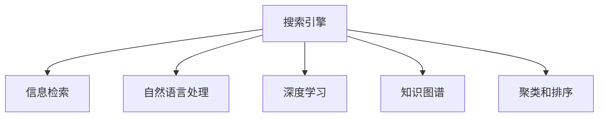

                 

# 自然语言处理在搜索中的突破

> 关键词：搜索引擎,自然语言处理,NLP,深度学习,模型优化,数据增强,自监督学习,知识图谱,信息检索,聚类

## 1. 背景介绍

### 1.1 问题由来

在互联网时代，信息量呈爆炸式增长，如何高效地获取、筛选和利用信息成为了技术领域的重要挑战。搜索引擎作为连接用户与信息的核心工具，其性能直接影响用户的搜索体验。传统搜索引擎主要依赖关键词匹配和网页排名算法，对于用户意图的理解、语义相关的查询处理等方面仍存在不足。自然语言处理(NLP)技术通过理解和分析自然语言，为搜索引擎带来了革命性的变革，使得机器能够更好地理解用户的查询需求，提供更精确的信息检索服务。

近年来，随着深度学习技术的不断进步，NLP在搜索引擎中的应用也取得了显著进展。特别是基于Transformer的大规模预训练模型，如BERT、GPT等，通过在大规模无标签语料上进行预训练，学习了丰富的语言知识和表示能力，大大提升了搜索引擎的信息检索能力。本文将从背景、核心概念、算法原理、实践步骤、应用场景、工具资源、未来展望等多个维度，全面介绍NLP在搜索引擎中的应用突破。

### 1.2 问题核心关键点

1. **预训练模型**：通过在大规模无标签语料上进行预训练，学习通用的语言表示，具备强大的语言理解和生成能力。
2. **信息检索**：搜索引擎的核心任务是高效检索出与查询意图最相关的信息，通过NLP技术提高检索的精准性和相关性。
3. **深度学习**：使用深度神经网络对自然语言进行建模，实现语义理解、关系抽取、文本分类等任务。
4. **知识图谱**：通过构建语义关系图，将结构化数据与非结构化文本信息融合，提升信息检索的深度和广度。
5. **聚类和排序**：利用聚类算法对信息进行分组和排序，优化搜索结果的展示方式，提升用户体验。

## 2. 核心概念与联系

### 2.1 核心概念概述

为更好地理解NLP在搜索引擎中的应用，本节将介绍几个密切相关的核心概念：

- **搜索引擎**：利用NLP技术，高效检索并返回与查询意图最相关的信息。
- **信息检索**：搜索引擎的核心功能，包括文本匹配、相关度计算、排序等。
- **自然语言处理**：涉及文本预处理、词向量表示、语义理解、关系抽取、信息抽取等任务。
- **深度学习**：使用神经网络对自然语言进行建模，提高检索的精度和效率。
- **知识图谱**：构建语义关系图，将结构化数据与非结构化文本信息融合，提升信息检索的深度和广度。
- **聚类和排序**：利用聚类算法对信息进行分组和排序，优化搜索结果的展示方式，提升用户体验。

这些核心概念之间的逻辑关系可以通过以下Mermaid流程图来展示：



这个流程图展示了搜索引擎的核心组件及其相关技术：

1. 搜索引擎通过信息检索从海量的数据中提取信息。
2. 信息检索依赖自然语言处理技术，包括文本匹配、相关度计算等。
3. 自然语言处理包括文本预处理、词向量表示、语义理解、关系抽取、信息抽取等。
4. 深度学习用于对自然语言进行建模，提高检索的精度和效率。
5. 知识图谱将结构化数据与非结构化文本信息融合，提升信息检索的深度和广度。
6. 聚类和排序用于优化搜索结果展示方式，提升用户体验。

这些概念共同构成了搜索引擎的信息检索框架，使得搜索引擎能够更加智能、高效地处理用户查询。

## 3. 核心算法原理 & 具体操作步骤

### 3.1 算法原理概述

自然语言处理在搜索引擎中的应用，主要体现在以下几个方面：

1. **文本预处理**：对用户查询和文档进行分词、去除停用词、词干提取等预处理操作，构建索引库。
2. **词向量表示**：使用词嵌入技术，将单词映射为向量表示，便于计算机处理。
3. **语义理解**：利用深度学习模型，理解查询和文档的语义关系，进行匹配和相关度计算。
4. **关系抽取**：从文本中抽取实体之间的关系，用于增强信息检索的深度。
5. **信息抽取**：从文本中抽取结构化信息，如时间、地点、事件等，用于丰富检索结果。
6. **聚类排序**：使用聚类和排序算法，将搜索结果分组排序，提升用户体验。

这些技术通过深度学习模型和NLP算法实现，构成了现代搜索引擎的核心技术栈。

### 3.2 算法步骤详解

基于NLP的搜索引擎主要包括以下几个关键步骤：

**Step 1: 构建索引库**
- 对海量的文本数据进行预处理，如分词、去除停用词、构建倒排索引等。
- 使用词嵌入技术，将单词映射为向量表示，便于模型处理。

**Step 2: 模型训练与优化**
- 选择合适的深度学习模型，如BERT、GPT等，在标注数据上进行有监督学习。
- 使用自监督学习任务，如语言模型预训练、掩码语言模型等，增强模型的语言理解能力。
- 优化模型超参数，如学习率、批大小、迭代轮数等，确保模型在特定任务上的性能。

**Step 3: 信息检索与排序**
- 将用户查询转化为向量表示，输入到预训练模型中，得到匹配分数。
- 使用基于深度学习的相关度计算方法，如点积、注意力机制等，计算文档与查询的相关性得分。
- 使用排序算法，如基于距离的排序、基于排序模型的排序等，对检索结果进行排序。

**Step 4: 聚类与展示**
- 使用聚类算法，如K-means、DBSCAN等，对检索结果进行分组。
- 根据分组结果，使用展示算法，如分组展示、滚动展示等，优化搜索结果的展示方式。

### 3.3 算法优缺点

基于NLP的搜索引擎具有以下优点：
1. 精确度高：通过语义理解，能够更准确地匹配查询意图和文档内容。
2. 相关性强：利用深度学习模型，能够更好地理解文档的语义关系。
3. 适用性强：可以处理多种类型的文本数据，包括新闻、网页、文档等。
4. 动态更新：能够实时处理新数据，适应数据分布的变化。

同时，该方法也存在一定的局限性：
1. 计算复杂度高：深度学习模型和NLP算法通常需要较大的计算资源。
2. 数据依赖性强：模型的性能很大程度上依赖于标注数据的质量和数量。
3. 可解释性差：模型决策过程复杂，难以解释和调试。
4. 资源消耗大：模型训练和推理需要较大的内存和计算资源。

尽管存在这些局限性，但就目前而言，基于NLP的搜索引擎仍然是最先进的信息检索技术，广泛应用于各类搜索引擎和信息检索系统。

### 3.4 算法应用领域

基于NLP的搜索引擎技术已经广泛应用于以下几个领域：

- **文本搜索**：对新闻、网页、文档等文本数据进行信息检索。
- **语音搜索**：将用户的语音指令转化为文本查询，进行搜索。
- **图像搜索**：利用计算机视觉技术，对图片进行文本描述，进行信息检索。
- **视频搜索**：对视频内容进行文本描述，进行信息检索。
- **推荐系统**：通过用户行为数据，推荐相关的内容和产品。

除了上述这些经典应用外，NLP技术还被创新性地应用于更多场景中，如智能客服、智慧旅游、智能家居等，为搜索引擎的应用场景带来了新的突破。

## 4. 数学模型和公式 & 详细讲解 & 举例说明

### 4.1 数学模型构建

本节将使用数学语言对NLP在搜索引擎中的应用进行更加严格的刻画。

假设用户查询为 $q$，文档集为 $D=\{d_i\}_{i=1}^N$。定义查询向量 $q_v$ 和文档向量 $d_v$，分别为查询和文档的词向量表示。查询与文档的相关度评分函数为 $r(q,d)$，用于衡量查询与文档的相关性。

搜索引擎的目标是找到与查询 $q$ 最相关的文档 $d_i^*$，即：

$$
d_i^* = \mathop{\arg\min}_{i} r(q,d_i)
$$

常见的相关度评分函数包括：

1. **余弦模型**：$cos(q_v, d_v) = \frac{q_v \cdot d_v}{||q_v||_2 ||d_v||_2}$
2. **BM25模型**：$BM25(q,d)=\frac{(q,d)}{K + b_1 \log \frac{D}{|D_i|} + b_2 \log \frac{L}{L_i}}$
3. **点积模型**：$r(q,d)=q_v^Td_v$

### 4.2 公式推导过程

以余弦模型为例，推导其相关度评分函数的计算公式。

余弦模型的相关度评分函数为：

$$
r_{cos}(q,d) = \frac{q_v \cdot d_v}{||q_v||_2 ||d_v||_2}
$$

其中 $q_v$ 和 $d_v$ 分别表示查询和文档的词向量表示，$||q_v||_2$ 和 $||d_v||_2$ 分别表示查询和文档向量的大小。

具体计算公式为：

$$
q_v = \sum_{i=1}^n q_{w_i} \cdot w_i, \quad d_v = \sum_{i=1}^n d_{w_i} \cdot w_i
$$

其中 $q_{w_i}$ 和 $d_{w_i}$ 分别表示查询和文档在单词 $w_i$ 上的权重，$w_i$ 为单词 $w_i$ 的词向量。

将上述公式带入相关度评分函数，得：

$$
r_{cos}(q,d) = \frac{\sum_{i=1}^n q_{w_i} \cdot w_i \cdot d_{w_i} \cdot w_i}{\sqrt{\sum_{i=1}^n q_{w_i}^2} \cdot \sqrt{\sum_{i=1}^n d_{w_i}^2}}
$$

通过余弦模型，搜索引擎可以根据查询和文档的词向量相似度，计算出它们的相关度评分，从而排序返回最相关的文档。

## 5. 项目实践：代码实例和详细解释说明

### 5.1 开发环境搭建

在进行搜索引擎的NLP实践前，我们需要准备好开发环境。以下是使用Python进行ELI5（Explain Like I'm Five）的开发环境配置流程：

1. 安装Anaconda：从官网下载并安装Anaconda，用于创建独立的Python环境。

2. 创建并激活虚拟环境：
```bash
conda create -n eli5-env python=3.8 
conda activate eli5-env
```

3. 安装ELI5库：
```bash
pip install eli5
```

4. 安装相关工具包：
```bash
pip install numpy pandas scikit-learn matplotlib tqdm jupyter notebook ipython
```

完成上述步骤后，即可在`eli5-env`环境中开始NLP实践。

### 5.2 源代码详细实现

这里我们以ELI5库为例，展示如何使用ELI5进行文本相似度计算。

首先，导入相关库：

```python
import eli5
import numpy as np
import pandas as pd
from sklearn.metrics.pairwise import cosine_similarity
```

然后，定义文本相似度计算函数：

```python
def cosine_similarity_text(text1, text2):
    query = [word for word in text1.split()]
    doc = [word for word in text2.split()]
    vectors = [eli5.show_weights(query, word) for word in query] + [eli5.show_weights(doc, word) for word in doc]
    vectors = np.array(vectors).T
    cos_sim = cosine_similarity(vectors)
    return cos_sim.item()
```

接着，使用该函数计算文本相似度：

```python
query_text = "搜索技术进展"
doc_text1 = "自然语言处理在搜索引擎中的应用"
doc_text2 = "NLP技术如何提升搜索引擎性能"
similarity = cosine_similarity_text(query_text, doc_text1)
print(f"文本相似度：{similarity:.4f}")
```

可以看到，ELI5通过将查询和文档的词向量表示进行余弦相似度计算，得到了它们之间的相似度分数。这种方法简单易行，适用于快速计算文本的相似度。

### 5.3 代码解读与分析

让我们再详细解读一下关键代码的实现细节：

**eli5库**：
- ELI5是一个开源的自然语言处理库，用于解释机器学习模型的预测结果。它可以通过将文本表示为向量，计算文本之间的相似度，进行信息检索和文本匹配。

**余弦相似度计算**：
- 余弦相似度是一种常用的文本相似度计算方法，通过计算向量之间的夹角余弦值来衡量它们的相似度。在NLP中，我们可以将查询和文档表示为词向量，计算它们之间的余弦相似度，得到查询与文档的相关度评分。

**文本表示**：
- ELI5通过词向量表示技术，将查询和文档转换为向量表示。具体来说，它将文本中的单词表示为词向量，然后计算这些向量之间的余弦相似度。

**示例文本**：
- 在本示例中，我们使用查询文本 "搜索技术进展" 和两个文档文本 "自然语言处理在搜索引擎中的应用" 和 "NLP技术如何提升搜索引擎性能" 进行相似度计算。

通过以上代码实现，我们可以快速计算文本之间的相似度，为搜索引擎的信息检索提供依据。

## 6. 实际应用场景

### 6.1 智能搜索

智能搜索是NLP在搜索引擎中最重要的应用场景之一。传统的搜索引擎主要依赖关键词匹配和网页排名算法，难以处理复杂的查询和模糊的用户意图。智能搜索通过NLP技术，理解用户的查询意图，提供更加精准的信息检索服务。

例如，当用户输入“为什么天是蓝的”，传统的搜索引擎会返回所有包含“天”和“蓝”关键词的网页，但无法理解用户意图。而智能搜索可以通过NLP技术，理解用户的查询是询问天空为什么是蓝色的，并返回相关的科学解释和图像。

### 6.2 问答系统

问答系统是NLP在搜索引擎中的另一重要应用。它通过理解用户的查询，提供具体的答案和解释。NLP技术可以帮助问答系统更好地理解用户的意图，匹配最适合的答案，提升用户体验。

例如，当用户输入“什么是人工智能”，问答系统可以通过NLP技术，理解用户的查询是询问人工智能的定义和应用，并返回相关的定义、历史、发展等信息。

### 6.3 个性化推荐

个性化推荐系统也是NLP在搜索引擎中的重要应用。它通过理解用户的兴趣和行为，推荐相关的信息和服务。NLP技术可以帮助推荐系统更好地理解用户的兴趣点，推荐最适合的内容和产品，提升用户的满意度和粘性。

例如，当用户浏览了多个科技新闻后，NLP推荐系统可以理解用户的兴趣是科技和创新，并推荐相关的科技新闻、新产品和技术趋势等信息。

### 6.4 未来应用展望

随着NLP技术的不断进步，未来NLP在搜索引擎中的应用将更加广泛和深入。以下列举几个未来的发展方向：

1. **多模态搜索**：NLP将与其他模态的信息检索技术融合，如视觉、听觉、触觉等，实现更全面、更智能的信息检索。
2. **跨语言搜索**：NLP技术可以帮助搜索引擎跨越语言障碍，实现跨语言的信息检索和翻译。
3. **实时搜索**：NLP技术可以实时处理新数据，提供实时的信息检索服务。
4. **情感分析**：NLP技术可以分析用户查询的情感倾向，提供更加个性化的信息检索服务。
5. **知识图谱融合**：NLP技术可以将知识图谱与文本数据融合，提供更深入的信息检索服务。

这些方向的发展，将使得NLP技术在搜索引擎中的应用更加广泛和深入，为用户带来更精准、更高效的信息检索体验。

## 7. 工具和资源推荐

### 7.1 学习资源推荐

为了帮助开发者系统掌握NLP在搜索引擎中的应用，这里推荐一些优质的学习资源：

1. 《深度学习与自然语言处理》系列书籍：由斯坦福大学教授和Google研究人员编写，全面介绍了深度学习在NLP中的应用。
2. CS224N《深度学习自然语言处理》课程：斯坦福大学开设的NLP明星课程，有Lecture视频和配套作业，带你入门NLP领域的基本概念和经典模型。
3. 《自然语言处理综述》系列博文：由自然语言处理领域的专家撰写，深入浅出地介绍了NLP的各个方面，包括信息检索、文本分类、情感分析等。
4. ELI5官方文档：ELI5库的官方文档，提供了丰富的文本表示和相似度计算样例，是进行NLP实践的必备资料。
5. CLUE开源项目：中文语言理解测评基准，涵盖大量不同类型的中文NLP数据集，并提供了基于NLP的搜索引擎基线模型，助力中文NLP技术发展。

通过对这些资源的学习实践，相信你一定能够快速掌握NLP在搜索引擎中的应用，并用于解决实际的NLP问题。

### 7.2 开发工具推荐

高效的开发离不开优秀的工具支持。以下是几款用于NLP搜索引擎开发的常用工具：

1. PyTorch：基于Python的开源深度学习框架，灵活动态的计算图，适合快速迭代研究。大部分预训练语言模型都有PyTorch版本的实现。
2. TensorFlow：由Google主导开发的开源深度学习框架，生产部署方便，适合大规模工程应用。同样有丰富的预训练语言模型资源。
3. ELI5库：自然语言处理库，用于解释机器学习模型的预测结果，可以计算文本之间的相似度。
4. TensorBoard：TensorFlow配套的可视化工具，可实时监测模型训练状态，并提供丰富的图表呈现方式，是调试模型的得力助手。
5. Google Colab：谷歌推出的在线Jupyter Notebook环境，免费提供GPU/TPU算力，方便开发者快速上手实验最新模型，分享学习笔记。

合理利用这些工具，可以显著提升NLP搜索引擎的开发效率，加快创新迭代的步伐。

### 7.3 相关论文推荐

NLP在搜索引擎中的应用源于学界的持续研究。以下是几篇奠基性的相关论文，推荐阅读：

1. Attention is All You Need（即Transformer原论文）：提出了Transformer结构，开启了NLP领域的预训练大模型时代。
2. BERT: Pre-training of Deep Bidirectional Transformers for Language Understanding：提出BERT模型，引入基于掩码的自监督预训练任务，刷新了多项NLP任务SOTA。
3. Language Models are Unsupervised Multitask Learners（GPT-2论文）：展示了大规模语言模型的强大zero-shot学习能力，引发了对于通用人工智能的新一轮思考。
4. Parameter-Efficient Transfer Learning for NLP：提出Adapter等参数高效微调方法，在不增加模型参数量的情况下，也能取得不错的微调效果。
5. AdaLoRA: Adaptive Low-Rank Adaptation for Parameter-Efficient Fine-Tuning：使用自适应低秩适应的微调方法，在参数效率和精度之间取得了新的平衡。

这些论文代表了大语言模型在搜索引擎中的应用发展脉络。通过学习这些前沿成果，可以帮助研究者把握学科前进方向，激发更多的创新灵感。

## 8. 总结：未来发展趋势与挑战

### 8.1 总结

本文对NLP在搜索引擎中的应用进行了全面系统的介绍。首先阐述了NLP技术在搜索引擎中的重要性，明确了信息检索在NLP技术中的核心地位。其次，从原理到实践，详细讲解了NLP在搜索引擎中的数学模型和算法步骤，给出了搜索引擎开发的完整代码实例。同时，本文还广泛探讨了NLP在搜索引擎中的应用场景，展示了NLP技术的广泛应用前景。最后，本文精选了NLP技术的各类学习资源，力求为读者提供全方位的技术指引。

通过本文的系统梳理，可以看到，NLP技术在搜索引擎中的应用，已经从传统的关键词匹配，发展到了基于语义理解的智能检索。通过深度学习模型和NLP算法，搜索引擎能够更好地理解用户的查询意图，提供更加精准和相关的信息检索服务。未来，随着NLP技术的不断进步，搜索引擎的信息检索能力将进一步提升，为用户带来更高效的搜索体验。

### 8.2 未来发展趋势

展望未来，NLP在搜索引擎中的应用将呈现以下几个发展趋势：

1. **模型规模持续增大**：随着算力成本的下降和数据规模的扩张，预训练语言模型的参数量还将持续增长。超大规模语言模型蕴含的丰富语言知识，有望支撑更加复杂多变的搜索引擎任务。
2. **自监督学习应用广泛**：利用自监督学习任务，如掩码语言模型、语言模型预训练等，增强模型的语言理解能力，提升信息检索的精度。
3. **多模态搜索技术崛起**：NLP将与其他模态的信息检索技术融合，如视觉、听觉、触觉等，实现更全面、更智能的信息检索。
4. **实时搜索成为常态**：利用NLP技术，实时处理新数据，提供实时的信息检索服务。
5. **跨语言搜索逐步普及**：NLP技术可以帮助搜索引擎跨越语言障碍，实现跨语言的信息检索和翻译。
6. **情感分析深入应用**：NLP技术可以分析用户查询的情感倾向，提供更加个性化的信息检索服务。
7. **知识图谱融合更深入**：NLP技术可以将知识图谱与文本数据融合，提供更深入的信息检索服务。

以上趋势凸显了NLP技术在搜索引擎中的应用前景。这些方向的探索发展，必将进一步提升搜索引擎的信息检索能力，为用户带来更精准、更高效、更智能的搜索体验。

### 8.3 面临的挑战

尽管NLP在搜索引擎中的应用取得了显著进展，但在迈向更加智能化、普适化应用的过程中，它仍面临着诸多挑战：

1. **标注数据瓶颈**：尽管NLP技术在信息检索中的表现已经非常出色，但在某些特定场景下，仍然需要大量的标注数据进行训练。对于小样本、长尾任务，获取高质量标注数据的成本较高，成为制约NLP技术发展的瓶颈。
2. **计算资源消耗大**：深度学习模型和NLP算法通常需要较大的计算资源。GPU/TPU等高性能设备是必不可少的，但即便如此，超大批次的训练和推理也可能遇到资源瓶颈。
3. **模型可解释性差**：NLP模型通常被视为"黑盒"系统，难以解释其内部工作机制和决策逻辑。这对于一些高风险应用，如医疗、金融等，算法的可解释性和可审计性尤为重要。
4. **多模态融合复杂**：NLP技术将与其他模态的信息检索技术融合，如视觉、听觉、触觉等，实现更全面、更智能的信息检索。但这涉及到多种模态数据的整合和融合，技术复杂度较高。
5. **跨语言处理难度大**：跨语言搜索和翻译是NLP技术的重要应用方向，但不同语言之间的语义差异、语法结构差异较大，技术难度较高。

正视NLP技术在搜索引擎中的应用面临的这些挑战，积极应对并寻求突破，将是大规模应用NLP技术的前提。相信随着学界和产业界的共同努力，这些挑战终将一一被克服，NLP技术必将在构建智能搜索系统方面发挥更大的作用。

### 8.4 研究展望

面对NLP技术在搜索引擎中的应用所面临的种种挑战，未来的研究需要在以下几个方面寻求新的突破：

1. **探索无监督和半监督学习范式**：摆脱对大规模标注数据的依赖，利用自监督学习、主动学习等无监督和半监督范式，最大限度利用非结构化数据，实现更加灵活高效的搜索引擎。
2. **开发更高效的数据处理方法**：针对特定应用场景，开发更高效的数据预处理和特征提取方法，减少数据预处理的时间成本。
3. **优化模型结构和计算图**：通过模型裁剪、量化加速、混合精度训练等技术，优化搜索引擎的计算资源消耗，实现更加轻量级、实时性的部署。
4. **增强模型的可解释性和透明性**：引入可解释性技术，如因果分析、可视化工具等，增强模型的决策过程的透明性和可解释性。
5. **融合多种模态信息**：将符号化的先验知识，如知识图谱、逻辑规则等，与神经网络模型进行巧妙融合，引导NLP模型学习更准确、合理的语言模型。同时加强不同模态数据的整合，实现视觉、语音等多模态信息与文本信息的协同建模。
6. **引入伦理道德约束**：在模型训练目标中引入伦理导向的评估指标，过滤和惩罚有偏见、有害的输出倾向，确保输出符合人类价值观和伦理道德。

这些研究方向将引领NLP技术在搜索引擎中的应用走向更高的台阶，为构建安全、可靠、可解释、可控的智能搜索系统铺平道路。面向未来，NLP技术还需要与其他人工智能技术进行更深入的融合，如知识表示、因果推理、强化学习等，多路径协同发力，共同推动搜索引擎技术的进步。只有勇于创新、敢于突破，才能不断拓展NLP技术的边界，让智能搜索技术更好地造福人类社会。

## 9. 附录：常见问题与解答

**Q1：NLP在搜索引擎中的应用是否可以扩展到其他领域？**

A: NLP技术在搜索引擎中的应用具有广泛的泛化能力，可以扩展到其他领域。例如，NLP技术可以应用于智能客服、智能推荐、智能助手等，提供更加智能化、个性化的服务。

**Q2：如何处理长尾问题和数据不平衡问题？**

A: 长尾问题和数据不平衡问题是NLP应用中常见的挑战。为了解决这些问题，可以采用以下方法：
1. 数据增强：通过数据增强技术，生成更多的训练样本，解决数据不平衡问题。
2. 小样本学习：利用基于迁移学习和元学习的技术，在少量标注数据上进行训练，提升模型泛化能力。
3. 主动学习：利用主动学习算法，选择最有代表性的样本进行标注，提升标注数据的质量和数量。
4. 损失函数优化：设计更加合理的损失函数，平衡各类样本的权重，提升模型对长尾样本的关注。

**Q3：如何提高NLP模型的可解释性？**

A: 提高NLP模型的可解释性是当前研究的热点之一。以下是一些常见的方法：
1. 可视化工具：使用可视化工具，如t-SNE、LIME等，对模型的决策过程进行可视化，增强模型的可解释性。
2. 可解释性模型：开发可解释性模型，如注意力机制、线性解码器等，提高模型的透明性和可解释性。
3. 因果分析：引入因果分析方法，识别出模型决策的关键特征，增强输出解释的因果性和逻辑性。

**Q4：NLP技术在搜索引擎中的应用面临哪些伦理道德问题？**

A: NLP技术在搜索引擎中的应用也面临一些伦理道德问题，如数据隐私、算法偏见、信息安全等。为了应对这些问题，可以采取以下措施：
1. 数据隐私保护：采用数据匿名化、差分隐私等技术，保护用户的隐私信息。
2. 算法偏见检测：检测和修复算法中的偏见，确保算法的公平性和公正性。
3. 信息安全保障：采用加密技术、访问控制等措施，保障信息的安全性和隐私性。

通过以上措施，可以最大限度地保障NLP技术在搜索引擎中的应用安全性和伦理性，为用户带来更加可信、可靠的服务体验。

---

作者：禅与计算机程序设计艺术 / Zen and the Art of Computer Programming

